# 01 — What Happens at Power-On

> [!abstract] What this document covers
> The interval between "somebody pressed the power button" and "the first instruction
> of `kmain` executes". At this zoom level the kernel is a single box at the far right
> of the picture; everything to its left is hardware, firmware and a bootloader that
> exist only to make that box reachable. The document explains what a CPU physically
> does at reset, what firmware is, what the x86 mode ladder is and who climbs it, and
> exactly what state the machine is in at the moment your code takes over.

**Zoom level:** System
**Built by:** [[Stage 0.1 - Prove Your Toolchain Works]], [[Stage 0.2 - The Limine Request Section]]
**Prerequisites:** none — this is the first document in the atlas
**Masterclass session:** 1 (see [[19 - The Eight-Hour Masterclass]])

> [!note] Zero background assumed
> Every term is defined at first use. Where a word already has a vault definition, it
> matches [[04 - Glossary]]. One caveat: the glossary was written against the v1 plan
> and still describes GRUB, Multiboot and a 32-bit `i686` target. This project targets
> **x86_64** ([[ADR-0002 - Target x86_64 Not i686]]) and boots with **Limine**
> ([[ADR-0003 - Limine as the Bootloader]]). Where the two disagree, this document and
> the ADRs win.

---

## 1. The one-sentence version

When power arrives, the CPU begins executing instructions at one fixed, hardwired
address near the top of the address space, where the motherboard has arranged for a
chip full of firmware to answer — and everything that follows, including the existence
of an operating system at all, is a consequence of what that firmware decides to load.

Expanded: a CPU has no concept of an operating system. It has a reset state and a
first address. The chip that answers at that address is **firmware** — a program burned
into flash memory on the motherboard, which brings the RAM and the buses to life and
then looks for something on a disk to run. That something is a **bootloader**, whose
entire job is to bridge a gap: firmware can only load a fixed-size blob of raw bytes or
a single file, while a kernel is a structured executable that must be placed at
particular addresses with the CPU in a mode the firmware did not leave it in. Our
bootloader is **Limine**, pinned at `v8.6.0-binary`. It closes that gap so completely
that the first line of our kernel runs in 64-bit long mode with paging already enabled
— a state that, on the classic tutorial path, costs weeks of assembly to reach.

---

## 2. The picture

This is the whole of Phase 0 in one diagram. Everything else in this document is a
zoom into one of these boxes.

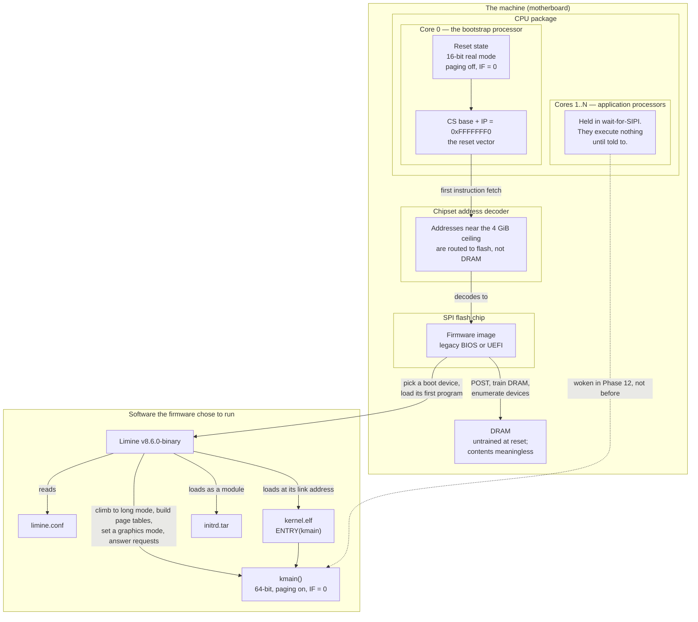

**Walking every box.**

- **`BOARD`** is the physical machine. Nothing in it knows what an operating system is.
- **`PKG` → `BSP`** is core 0, the **bootstrap processor** (BSP). On a multi-core
  machine exactly one core is released from reset to fetch instructions. The choice is
  made by the hardware, not by software.
- **`RESET`** is the CPU's power-on state, and it is deliberately primitive: 16-bit
  **real mode** (the CPU's original 1978 addressing model — see §3.3), **paging** off
  (paging is the hardware that translates the addresses a program uses into real RAM
  addresses; [[04 - Glossary]]), and the interrupt flag `IF` clear so no hardware event
  can divert execution.
- **`RIPV`** is the **reset vector** — the one address the CPU is hardwired to fetch
  from. §3.1 opens this box.
- **`APS` → `PARKED`**: every other core sits in a wait state. They are not running your
  firmware, your bootloader or your kernel. They are woken deliberately in
  [[Phase 12 - Overview|Phase 12]], and Limine does that work for us.
- **`CHIPSET` → `ALIAS`**: the memory controller and chipset decide which physical
  device answers each address. At reset, addresses near the top of the 32-bit space are
  routed to the flash chip. This is why the reset vector finds code rather than garbage.
- **`FLASH` → `FW`**: an SPI flash chip soldered to the board, holding the firmware
  image. This is the *only* code on the machine at power-on. §3.2 opens this box.
- **`DRAM`**: your RAM. At reset it is not usable — the memory controller has not been
  configured and the DIMMs have not been trained. Bringing DRAM up is one of the
  firmware's first jobs, and it is why firmware initially runs out of ROM.

**Walking every arrow.**

- `RESET --> RIPV`: the reset state *is* the initial register values, and those values
  produce the reset vector address. They are the same fact stated two ways.
- `RIPV --> ALIAS --> FW`: the fetch goes onto the bus, the chipset decodes it, the
  flash chip answers. Three separate mechanisms that together make the first
  instruction exist.
- `FW --> DRAM`: **POST** (power-on self test) plus memory training plus device
  enumeration. After this arrow, RAM is real.
- `FW --> LIM`: the firmware picks a boot device and loads the first program off it.
  **This is the moment an "operating system" first becomes possible** — and note that
  the firmware has no idea it is booting one. It is loading a blob or a file, per rules
  that predate this project by decades.
- `LIM --> CONF`: Limine reads its own configuration file to learn what to boot.
- `LIM --> KERN` and `LIM --> INITRD`: Limine loads `kernel.elf` at the addresses its
  **ELF** program headers demand, and `initrd.tar` as a *module* — an extra file placed
  in memory whose address is reported to the kernel ([[Phase 7 - Overview|Phase 7]]).
- `LIM --> KMAIN` (the long label): everything Limine does *to the machine* rather than
  *to memory* — climbing the mode ladder, building page tables, setting a graphics mode,
  filling in the responses to the requests declared in
  [[Stage 0.2 - The Limine Request Section]].
- `KERN --> KMAIN`: the loaded image contains the entry point. Limine jumps to the
  address in the ELF header's `e_entry` field, which the linker script sets to `kmain`
  ([[Stage 0.4 - The Linker Script and Higher-Half Layout]]).
- `PARKED -.-> KMAIN` (dashed): the other cores are still parked when `kmain` runs. The
  dashed line is a promise about Phase 12, not something that happens now.

> [!warning] There is no operating system on this machine
> Nothing above required an OS to exist. The firmware does not look for one, does not
> know the word, and cannot tell a kernel from a memory-test utility. "An operating
> system" is not a thing hardware recognises — it is whatever program the firmware was
> pointed at, plus whatever that program chooses to do next. Every protection,
> abstraction and guarantee your OS provides is something *it* builds, from nothing,
> starting at `kmain`.

---

## 3. Zooming in

### 3.1 The reset vector: one hardwired address

A CPU coming out of reset has no memory of anything. Its registers hold fixed values
defined by the instruction-set manual, and those values conspire to produce exactly one
first address.

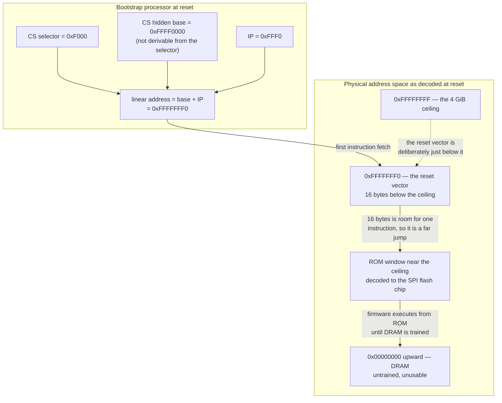

**Walking it.**

- **`CSSEL` / `CSBASE`** — `CS` is the *code segment* register. In real mode a segment
  register normally implies a base address of `selector × 16`, which for `0xF000` would
  be `0x000F0000`. At reset the CPU cheats: it loads the visible selector with `0xF000`
  but sets the hidden base to `0xFFFF0000`. The two disagree on purpose, and this is
  the single strangest fact in x86 boot. Its reason is historical compatibility — the
  8086 reset vector was at `0xFFFF0`, and later CPUs kept the *shape* of that while
  moving it to the top of a much larger address space.
- **`IPR`** — `IP` is the 16-bit instruction pointer, reset to `0xFFF0`.
- **`LIN`** — base plus offset gives `0xFFFFFFF0`, sixteen bytes below the 4 GiB mark.
- **`RV`** — that is the reset vector. The very first byte the CPU ever fetches.
- **`ROMWIN`** — the chipset routes that whole region to the flash chip, so the fetch
  returns firmware bytes. **This is what "firmware is mapped there by the motherboard"
  means concretely**: no software placed it there, and no DRAM is involved. It is an
  address-decoding decision made by the platform hardware.
- **`LOWMEM`** — normal RAM starts at address 0 and is *not* usable yet, which is why
  the first thing at the reset vector cannot be "call a function using the stack".
- The **`RV --> ROMWIN`** arrow is the reason the reset vector is 16 bytes from the top:
  there is only room for one instruction, so that instruction is almost always a far
  jump into the body of the firmware, lower in the ROM window.
- The dashed **`TOP -.-> RV`** arrow records the design intent — putting the vector just
  below the ceiling leaves the entire rest of the address space free for RAM.

> [!example] Why it must be at a fixed address
> Suppose the reset vector were configurable. Configured *where*? Any storage holding
> the setting would itself need to be found, and finding it would need code, and that
> code would need an address. The recursion has to stop somewhere, and hardware stops
> it by fixing exactly one address forever. Every bootstrap problem in computing has
> this shape: one immovable fact, and everything else built on top of it.

> [!note] On a modern machine the x86 core is not even first
> Contemporary platforms have a service processor — Intel's Management Engine, AMD's
> Platform Security Processor — that runs before the main cores are released from
> reset, verifying and sometimes loading the firmware image. It does not change
> anything below: from the x86 core's point of view, it wakes at `0xFFFFFFF0` and finds
> code. Mention it once so the model is honest, then ignore it.

---

### 3.2 What firmware is, and the two families

**Firmware** is a program stored in non-volatile memory on the motherboard, which owns
the machine from reset until it hands control to something on a disk. It is not part of
your OS, you do not ship it, and you cannot debug it. Its contract with you is short:
it will initialise the platform, and it will load *one* thing according to fixed rules.

There are two families of those rules, and they share almost nothing.

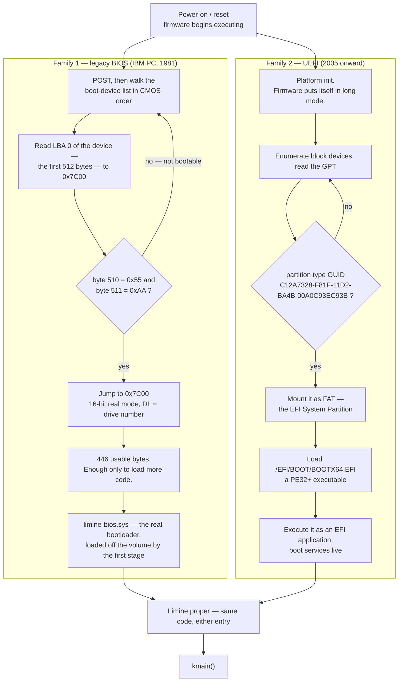

**Walking the BIOS branch.**

- **`B0`** — after POST, the firmware consults an ordered list of boot devices stored in
  battery-backed **CMOS** settings.
- **`B1`** — it reads the first 512-byte block (**LBA 0**, logical block address zero)
  into physical address `0x7C00`. That address is an accident of 1981 that never moved.
- **`B2`** — it checks the last two bytes for the signature `0x55 0xAA`. That is the
  entire definition of "bootable" in the BIOS world. Two bytes.
- **`B3`** — it jumps to `0x7C00` in 16-bit real mode, with the drive number in `DL`.
  No filesystem has been read. No mode change has occurred.
- **`B4`** — of those 512 bytes, the last 66 are the signature plus a four-entry
  partition table, leaving 446 bytes of code. That is not enough to do anything except
  load more code, which is why **every BIOS bootloader is a chain of stages**.
- **`B5`** — the chain ends at `limine-bios.sys`, the part of Limine that can actually
  read filesystems and ELF files.

**Walking the UEFI branch.**

- **`U0`** — UEFI firmware initialises the platform and, on x86_64, **puts the CPU into
  long mode itself**. By the time any third-party code runs, the mode ladder has already
  been climbed once.
- **`U1` / `U2`** — instead of a magic signature, UEFI reads the **GPT** (GUID Partition
  Table) and looks for a partition whose type GUID is
  `C12A7328-F81F-11D2-BA4B-00A0C93EC93B`.
- **`U3`** — that partition is the **ESP** (EFI System Partition), and it must be
  **FAT**. The firmware's only filesystem driver is FAT; the specification requires
  FAT12/16/32 and nothing else. You cannot put a bootloader on ext2 and expect firmware
  to find it. This constraint is the direct cause of the FAT32 half of
  [[ADR-0009 - Filesystem Strategy FAT32 then ext2]].
- **`U4`** — with no boot entry registered in the firmware's NVRAM (the case for
  removable media, and for our QEMU setup), the specification mandates a fallback path:
  `\EFI\BOOT\BOOTX64.EFI` on x86_64. Exactly that path, exactly that spelling.
- **`U5`** — the file is a **PE32+** executable — the Windows executable format, which
  UEFI adopted — and the firmware runs it as a proper program with a rich API (**boot
  services**) available: allocate memory, read files, set a graphics mode, get the
  memory map.
- **`B5 --> LIMINE`** and **`U5 --> LIMINE`** meet at the same place. From the kernel's
  side the two paths are indistinguishable, which is the entire point of
  [[Stage 0.5 - Building a Bootable Image]]'s hybrid image.

| | Legacy BIOS | UEFI |
|---|---|---|
| Age | 1981, essentially frozen | 2005 onward, still evolving |
| CPU mode when it hands over | 16-bit real mode | 64-bit long mode |
| Where it looks | LBA 0 of a device, or an El Torito boot catalogue on optical media | GPT partition with type GUID `C12A7328-…` |
| What "bootable" means | two bytes: `0x55 0xAA` at offset 510 | a FAT partition containing a PE32+ file at the fallback path |
| What it loads | 512 bytes (MBR) or N × 512 bytes (El Torito no-emulation) | one PE32+ file, any size |
| Filesystem awareness | none | FAT12/16/32 |
| API for the loaded program | interrupt-based BIOS services (`INT 13h` and friends) | UEFI boot services, then `ExitBootServices` |
| Our file | `limine-bios-cd.bin`, then `limine-bios.sys` | `BOOTX64.EFI` |

> [!warning] The BIOS path is not simpler, it is only older
> A common instinct is "BIOS is the easy one, UEFI is the complicated modern one". The
> table says otherwise. BIOS gives you 446 bytes of 16-bit code and no filesystem;
> everything after that is a chain you must build. UEFI gives you a 64-bit program
> loader with a file API. BIOS is *smaller*, not simpler — and its simplicity is
> purchased entirely with your labour.

> [!question] Check your understanding
> Our development setup runs QEMU with `-bios OVMF_CODE_4M.fd`, which gives the
> firmware no writable variable store. Why does that make the QEMU boot exercise
> exactly the same code path as a USB stick plugged into a stranger's laptop?

---

### 3.3 The mode ladder

x86 has never removed a mode. Every CPU still boots as if it were an 8086, and the
newer modes are reached by climbing, one rung at a time, in a fixed order.

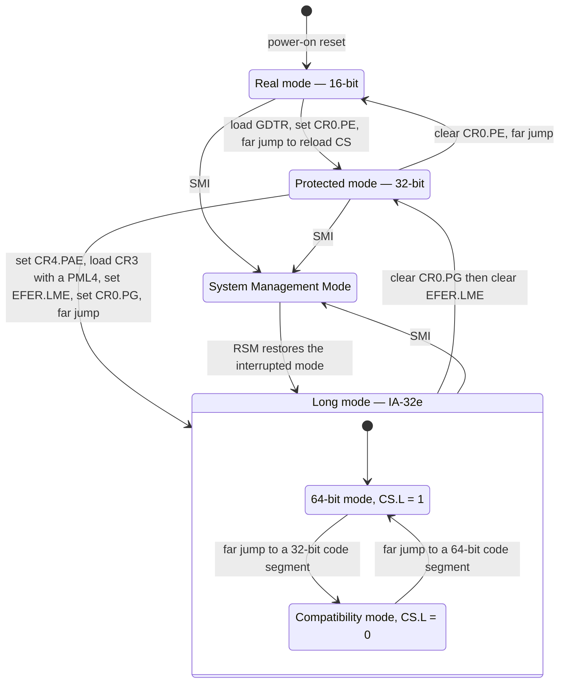

**Walking the rungs.**

- **`Real` — real mode, 16 bits.** Addresses are formed as `segment × 16 + offset`,
  giving a 20-bit address space of 1 MiB. No memory protection, no privilege levels: any
  instruction can do anything. This is where every x86 CPU starts, and it is where the
  BIOS hands over.
- **`Real --> Prot`.** Protected mode needs a **GDT** (Global Descriptor Table — a table
  in memory describing memory segments and their privilege, [[04 - Glossary]]). You
  build one, point `GDTR` at it, set bit 0 of control register `CR0` (`PE`, protection
  enable), and then perform a **far jump** — a jump that reloads the `CS` register —
  because the CPU only picks up the new code-segment meaning on a `CS` reload.
- **`Prot` — protected mode, 32 bits.** Flat 4 GiB addressing, **privilege rings**
  (ring 0 = kernel, ring 3 = user), and optional 32-bit paging. This is where a
  Multiboot-compliant bootloader such as GRUB would hand over, and it is precisely why
  [[ADR-0003 - Limine as the Bootloader]] rejected that path.
- **`Prot --> Long`.** The longest rung, and every step is mandatory and ordered:
  1. Set `CR4.PAE` (bit 5) — Physical Address Extension. Long mode has no non-PAE form.
  2. Build four levels of page tables and load the top level (**PML4**) into `CR3`.
  3. Set `EFER.LME` (bit 8 of MSR `0xC0000080`) — Long Mode Enable. This *arms* long
     mode; it does not activate it.
  4. Set `CR0.PG` (bit 31) — paging enable. **This is the activation step**: the CPU
     sets `EFER.LMA` in response.
  5. Far jump into a code segment whose descriptor has the `L` bit set, to actually
     start executing 64-bit instructions.
- **Note the ordering trap encoded in that list:** long mode *requires* paging, so the
  page tables must be correct *before* the instruction that enables them, and the
  instruction after `mov cr0` must still be reachable through those very tables. Get it
  wrong and the CPU faults on the next instruction fetch, with no handler installed. The
  observable symptom is an instant reboot.
- **`Long` — long mode (IA-32e).** A composite state with two sub-modes:
  - **`Bit64`** — 64-bit mode. 64-bit registers, RIP-relative addressing, segmentation
    mostly disabled. This is where our kernel lives.
  - **`Compat`** — compatibility mode, which runs unmodified 32-bit code inside a
    64-bit OS. We never use it, but it is why the state is drawn as a container: "long
    mode" is not one mode.
  - The two internal arrows are far jumps between code segments differing in the
    descriptor's `L` bit.
- **`Long --> Prot` and `Prot --> Real`** — the ladder can be descended. Rarely useful;
  drawn so the picture is not a lie.
- **`SMM` — System Management Mode.** Orthogonal to the ladder. A hardware **SMI**
  (system management interrupt) can suspend *any* mode, run firmware code from a region
  the OS cannot see, and return with `RSM`. It is how fan control and some USB legacy
  emulation work. Your OS cannot observe or prevent it. It is drawn here so you know
  that "my code owns the CPU" is not quite true even in ring 0.

**And now the point of this whole section.**

```
   Classic tutorial path            This project
   ─────────────────────            ────────────
   real mode      (you)             real mode      (Limine's BIOS stage, or skipped)
       ↓                                ↓
   protected mode (you)             protected mode (Limine, or skipped under UEFI)
       ↓                                ↓
   long mode      (you)             long mode      (Limine)
       ↓                                ↓
   kmain                            kmain          ← you start here
```

**Limine climbs the ladder for you.** On the UEFI path most of it was already climbed by
the firmware before Limine even started. On the BIOS path Limine's own stages do it. In
neither case do you write a **trampoline** — the hand-written, mode-switching assembly
that bridges two rungs. [[Stage 0.2 - The Limine Request Section]] documents what that
would have cost: a temporary GDT, four levels of page tables built by hand in assembly,
`CR4.PAE`, `CR3`, `EFER.LME`, `CR0.PG`, and a far jump — all of it 32-bit code embedded
in a 64-bit kernel, none of it debuggable with the tools you have, and every mistake
producing the same symptom: instant reset.

> [!warning] What you give up, stated honestly
> You will not learn real-mode programming, the A20 gate, the 512-byte boot sector
> budget, `INT 13h` disk reads, or the `ExitBootServices` handshake. Those are real
> gaps — and they are gaps in *firmware* knowledge, not *operating system* knowledge.
> You still build page tables ([[Phase 4 - Overview|Phase 4]]), a GDT and an IDT
> ([[Phase 2 - Overview|Phase 2]]), and you still parse the memory map yourself. The OS
> concepts are not skipped. Only the firmware trivia is.

---

### 3.4 What a bootloader is, and why one has to exist

A **bootloader** is the program that fills the gap between what firmware is capable of
loading and what a kernel needs in order to run. The gap is real and it is wide.

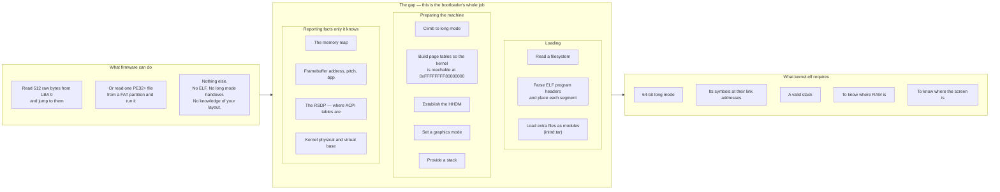

**Walking it.**

- **`FWCAN`** is the firmware's complete repertoire, from §3.2. `F3` is the important
  box: firmware cannot parse ELF, does not know your kernel's link address, and will not
  hand over in the mode you need. That is not a deficiency — it is a scope boundary.
- **`GAP`** is nested three levels deep because a bootloader does three distinguishable
  kinds of work, and separating them is how you reason about what a *different*
  bootloader would or would not give you.
  - **`GLOAD`** — loading. `G1` reading a filesystem, `G2` parsing **ELF** (the
    executable format of `kernel.elf`: a header plus program headers saying "put these
    bytes at this address"), `G3` loading modules such as our initrd.
  - **`GMACHINE`** — preparing the machine. `G4` the mode ladder from §3.3. `G5` the
    page tables that make `0xFFFFFFFF80000000` mean something. `G6` the **HHDM**
    (higher-half direct map — a mapping of *all* physical RAM at a fixed virtual offset,
    so any physical address is reachable without building a temporary mapping first;
    `0xFFFF800000000000` in our layout). `G7` the graphics mode. `G8` a stack, without
    which not one line of C++ can execute.
  - **`GTELL`** — reporting. These are facts that exist only in firmware context and
    become unrecoverable the moment the bootloader exits. `G9` the memory map. `G10` the
    framebuffer geometry. `G11` the **RSDP** (Root System Description Pointer, the entry
    point to the ACPI tables) — on a UEFI machine it is *not* at a fixed address, and
    the only component that still knows is about to exit. `G12` where the kernel
    actually landed, needed to symbolise panics in
    [[Stage 1.7 - Symbolised Backtraces|Stage 1.7]].
- **`KNEEDS`** is the kernel's side of the contract, and every entry maps to a box in
  `GAP`. `K1`←`G4`, `K2`←`G2`+`G5`, `K3`←`G8`, `K4`←`G9`, `K5`←`G7`+`G10`.
- The two arrows between subgraphs are the whole argument: **the gap is not optional, so
  somebody fills it.** Either a third-party bootloader does, or you do. Writing your own
  is roughly a month of work before the first `hlt`, and two implementations if you want
  both BIOS and UEFI. [[ADR-0003 - Limine as the Bootloader]] is the decision not to
  spend that month.

> [!note] The one architectural rule that comes out of this
> Because Limine is a third-party dependency, `kernel/arch/x86_64/boot/` is the **only**
> directory allowed to include `limine.h`. Everything Limine reports is copied into our
> own `boot_info_t` and nothing else in the tree knows the protocol exists. CI enforces
> it with a grep. See [[06 - Architecture Overview]] and
> [[Stage 0.3 - Freestanding C++ and kmain]].

---

### 3.5 "Firmware hands you a machine" — what that concretely means

This is the box worth opening most carefully, because "Limine hands over control" is
useless as a mental model. What is handed over is a specific machine state, and every
line of Phase 0 through Phase 2 either depends on it or replaces it.

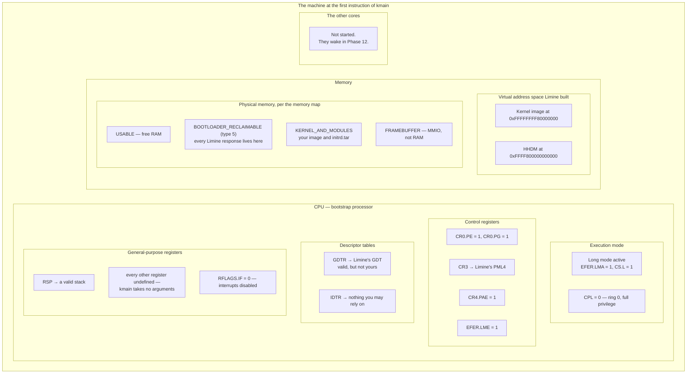

**Walking it, box by box, because each one is a fact you will depend on.**

- **`MODEB`.** You are in 64-bit long mode at **CPL 0** — current privilege level zero,
  the most privileged ring. Consequence: **no trampoline to write.** This is the single
  largest thing Limine buys.
- **`CTRL`.** Paging is *already on* (`CR0.PG = 1`), using page tables Limine built and
  `CR3` points at. Consequence: your first C++ line executes through address translation
  you did not write. [[Phase 4 - Overview|Phase 4]] replaces these tables with your own.
  Until then you are a guest in Limine's address space.
- **`TABS`.** The `GDT` is Limine's. It works, and you must not build on it — Limine's
  memory is reclaimable and its descriptor layout is not part of your design.
  [[Stage 2.1 - The Global Descriptor Table]] replaces it. There is **no usable IDT**
  (Interrupt Descriptor Table — the table mapping each interrupt number to its handler).
  Consequence, and it is the defining constraint of Phase 0 and 1: **any fault before
  [[Phase 2 - Overview|Phase 2]] is a triple fault and an instant reset, with no message
  of any kind.**
- **`GPRS`.** `RSP` points at a valid stack, so you can call C++ immediately.
  **`kmain` takes no parameters** — this is the protocol, not a simplification. Limine
  passes nothing in registers; every piece of information arrives through the response
  pointers described in §4. `RFLAGS.IF = 0` means interrupts are disabled, which is why
  a `hlt` instruction in Phase 0 halts *permanently* — exactly what you want when there
  is nothing to return to.
- **`VIRT`.** The kernel is mapped at its link address, `0xFFFFFFFF80000000` — the top
  2 GiB, required by the `-mcmodel=kernel` code model
  ([[Stage 0.4 - The Linker Script and Higher-Half Layout]]). The **HHDM** offset will
  be `0xFFFF800000000000`, but you must **read it from the response, never hardcode it**.
- **`PHYS`.** Four memory-map region types matter here. `USABLE` is free RAM.
  `KERNEL_AND_MODULES` holds your image and `initrd.tar`. `FRAMEBUFFER` is
  memory-mapped I/O — writing there paints pixels, it is not RAM.
  **`BOOTLOADER_RECLAIMABLE` (type 5) is the trap**: every Limine response structure
  lives there, and [[Phase 4 - Overview|Phase 4]]'s physical memory manager will fold
  that region into the free pool. See the warning below.
- **`OTHERCPUS`.** Still parked. Nothing you write before [[Phase 12 - Overview|Phase 12]]
  needs to consider concurrency between cores — though the *rules* apply from
  [[Phase 5 - Overview|Phase 5]] onward ([[06 - Architecture Overview]]).

The authoritative table, from [[Stage 0.2 - The Limine Request Section]] §4.6:

| Property | State at `kmain` | Consequence |
|---|---|---|
| CPU mode | 64-bit long mode | no trampoline to write |
| Privilege | ring 0 (CPL 0) | you can do anything, including break everything |
| Paging | enabled, kernel at its link address | you write your own tables in [[Phase 4 - Overview\|Phase 4]] |
| Interrupts | disabled (`IF = 0`) | `hlt` halts permanently |
| Stack | valid, `RSP` set by Limine | C++ works immediately |
| HHDM | established; offset in the response | read it, never hardcode it |
| Arguments | none — `kmain()` takes no parameters | everything arrives via response pointers |
| Application processors | not started | [[Phase 12 - Overview\|Phase 12]] |
| GDT | Limine's own | replaced in [[Phase 2 - Overview\|Phase 2]]; do not build on it |
| IDT | none you can use | any fault before Phase 2 is a triple fault |

> [!warning] Anything not in that table is unspecified
> Not "probably fine" — unspecified. Register contents other than `RSP`, the exact
> layout of Limine's GDT, whether a particular `CR4` feature bit is set: none of it is
> promised, and relying on an observed value is how you write code that works in QEMU
> and dies on hardware. Limine's `PROTOCOL.md`, at the pinned tag, is the authority.

> [!warning] The reclaimable-memory trap
> Limine's response structures live in `BOOTLOADER_RECLAIMABLE` memory. In
> [[Phase 4 - Overview|Phase 4]] your allocator reclaims it — that is what the name
> invites. Every retained pointer into a response then points into the heap. It does
> not fault, because the memory is mapped. It does not fail immediately, because free
> pages keep their old contents for a while. It fails **later, under load**, when the
> heap has churned enough to reuse those pages — and the commit that broke it is the
> Phase 4 allocator commit, while the bug is in `boot_info.cpp`, written in Phase 0 and
> untouched since. The rule, phrased for review:
> **after `collect_boot_info()` returns, no pointer derived from a Limine response is
> stored anywhere in the kernel.** See [[Stage 0.3 - Freestanding C++ and kmain]].

---

## 4. The data structures

There is exactly one data structure in play at power-on, and it has a shape most people
guess wrong: **the kernel allocates the mailboxes, and the bootloader fills them in.**

You put request structures into your own binary at build time. Each begins with a
128-bit magic number. Limine loads your binary, scans its bytes for that magic, and for
every request it recognises writes a pointer to an answer into the structure. Then it
jumps to your entry point. There is no argument in a register and no info-block pointer:
the answers are already sitting inside your own data, because you shipped the envelopes.

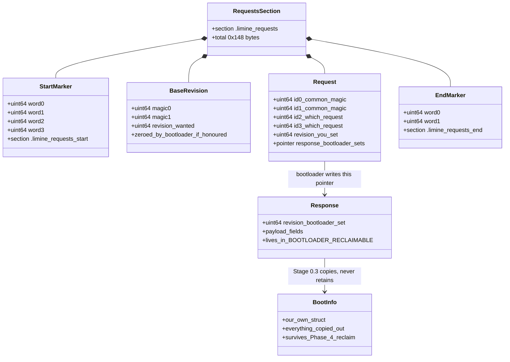

**Walking it.**

- **`RequestsSection`** — a named section in your ELF image, `0x148` (328) bytes for our
  six requests plus the base revision marker. The name means nothing to Limine, which
  scans bytes; it means everything to *you*, because it is how you guarantee the objects
  land contiguously between the delimiters and inside a loadable segment.
- **`StartMarker` / `EndMarker`** — two magic values bounding the region Limine scans.
  Without them Limine must scan the entire image, which is slower and risks
  misinterpreting an embedded data blob that happens to contain the magic bytes.
- **`BaseRevision`** — three words. The first two are magic; the third is the protocol
  revision you are written against (we ask for **2**). Limine zeroes the third word if
  it can honour that revision. That zero is the entire negotiation, and checking it is
  the first thing `kmain` does.
- **`Request`** — six 64-bit words. `id0`/`id1` are `LIMINE_COMMON_MAGIC`
  (`0xc7b1dd30df4c8b88`, `0x0a82e883a194f07b`) — identical in *every* request, and the
  128-bit pattern Limine actually searches for. `id2`/`id3` say which request this is.
  `revision` is what *you* filled in. `response` is the one field the bootloader writes.
- **`Response`** — the answer, allocated by Limine in `BOOTLOADER_RECLAIMABLE` memory.
  It has its own `revision`, meaning "which of my trailing fields did I fill in?" —
  a different question from the request's revision, pointing the opposite way.
- **`Request --> Response`** — the only arrow written by a program other than yours.
- **`Response --> BootInfo`** — [[Stage 0.3 - Freestanding C++ and kmain]] copies
  everything out into a struct we own, and after that no Limine pointer exists anywhere
  in the kernel. This arrow is the fix for the reclaimable-memory trap.

**The six requests, and when each is cashed in:**

| Request | Answers the question | First needed by |
|---|---|---|
| framebuffer | where is the screen, how wide, what pixel format | [[Phase 1 - Overview\|Phase 1]] |
| memmap | which physical addresses are real, usable RAM | [[Phase 4 - Overview\|Phase 4]] |
| hhdm | at what virtual offset is all physical RAM mapped | [[Phase 4 - Overview\|Phase 4]] |
| kernel address | where did my image actually land, physically and virtually | [[Stage 1.7 - Symbolised Backtraces\|Stage 1.7]] |
| module | where is `initrd.tar` in memory | [[Phase 7 - Overview\|Phase 7]] |
| rsdp | where are the ACPI tables | [[Phase 11 - Overview\|Phase 11]] |

All six are declared in Phase 0 even though four are not used for months. A declared
request costs 48 bytes and zero instructions; a *missing* request costs a debugging
session five phases later where ACPI gets a null pointer and nothing in recent history
mentions boot.

### The hardware bit fields the mode ladder touches

These are defined by the CPU, not by us. They are here because §3.3's rungs are just
writes to these bits, and because you will read them in a debugger for the next two
years.

**`CR0` — control register 0**

| Bit | Name | Meaning here |
|---|---|---|
| 0 | `PE` | Protection Enable — 0 → real mode, 1 → protected mode |
| 1 | `MP` | Monitor Coprocessor — x87 interaction |
| 2 | `EM` | Emulation — x87 instructions trap instead of executing |
| 3 | `TS` | Task Switched — used for lazy FPU state saving |
| 16 | `WP` | Write Protect — ring 0 honours read-only page mappings |
| 31 | `PG` | Paging Enable — **the instruction that activates long mode** |

**`CR4` — control register 4**

| Bit | Name | Meaning here |
|---|---|---|
| 5 | `PAE` | Physical Address Extension — **mandatory for long mode** |
| 7 | `PGE` | Page Global Enable — global TLB entries survive a `CR3` reload |
| 9 | `OSFXSR` | OS supports `FXSAVE`/`FXRSTOR`; SSE raises `#UD` without it |
| 20 | `SMEP` | Supervisor Mode Execution Prevention ([[Phase 15 - Overview\|Phase 15]]) |
| 21 | `SMAP` | Supervisor Mode Access Prevention ([[Phase 15 - Overview\|Phase 15]]) |

**`EFER` — Extended Feature Enable Register, MSR `0xC0000080`**

| Bit | Name | Meaning here |
|---|---|---|
| 0 | `SCE` | System Call Extensions — enables `syscall`/`sysret` ([[Phase 6 - Overview\|Phase 6]]) |
| 8 | `LME` | Long Mode Enable — arms long mode |
| 10 | `LMA` | Long Mode Active — **read-only**; the CPU sets it when `CR0.PG` goes on |
| 11 | `NXE` | No-Execute Enable — makes the NX bit in page tables meaningful |

**`RFLAGS`**

| Bit | Name | Meaning here |
|---|---|---|
| 9 | `IF` | Interrupt Flag — 0 at `kmain`, and why `hlt` halts forever in Phase 0 |

> [!question] Check your understanding
> `EFER.LMA` is read-only and set by the CPU. Why can the architecture not simply let
> software set it directly, and what does that tell you about the ordering of the five
> steps in §3.3?

---

## 5. The flows

### 5.1 The UEFI path, end to end

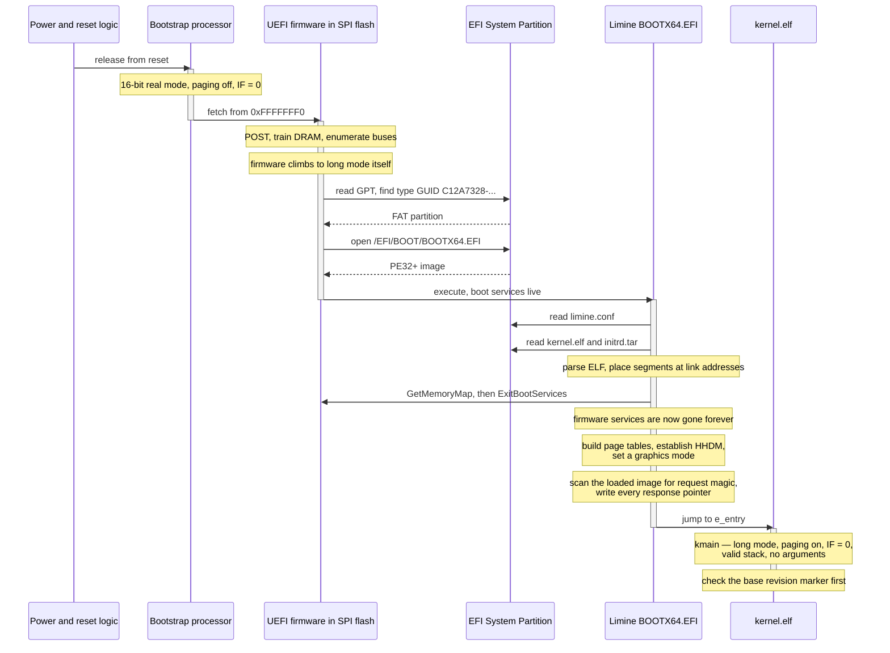

**Walking it.**

The reset arrow and the fetch from `0xFFFFFFF0` are §3.1 verbatim. The firmware's own
activation covers POST and DRAM training, and — the important UEFI-specific fact —
**the firmware climbs the mode ladder itself**, so Limine starts life already in long
mode. The GPT search and the FAT open are §3.2's UEFI branch.

`ExitBootServices` is the one call worth naming. Up to that point Limine can use the
firmware's memory allocator, file API and graphics API. After it, all of that is gone
permanently, and the memory map obtained immediately before it is the definitive
account of physical memory. This is why the memory map is something only a bootloader
can hand you: the API that produces it stops existing.

The two `Note over LIM` blocks after that are the entire §3.4 gap being filled — page
tables, HHDM, graphics mode, then the request scan from §4. Then one jump, and control
never comes back. `kmain`'s first act is the base-revision check, because if the
bootloader could not honour the requested protocol revision, nothing below is
trustworthy.

### 5.2 The legacy BIOS path, end to end

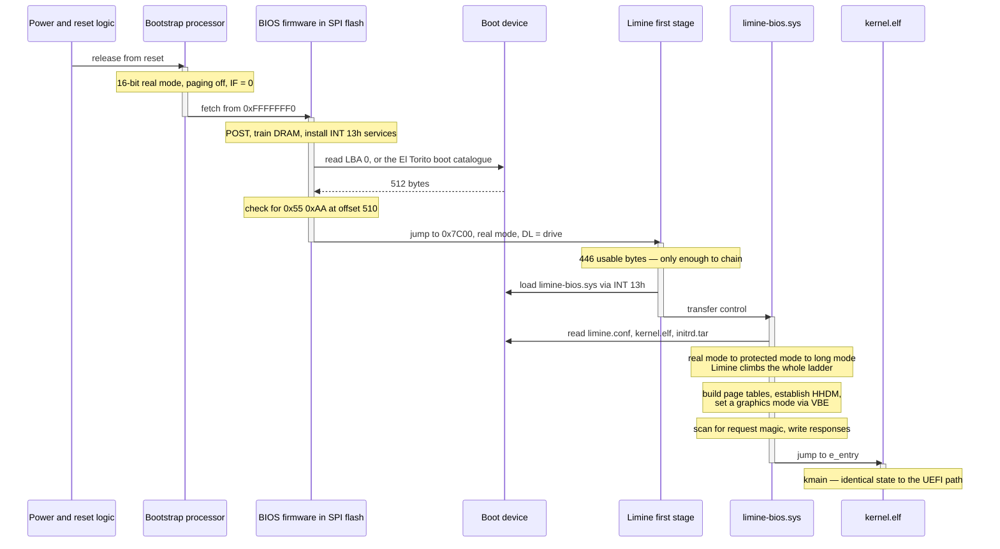

**Walking the differences, because the similarities are the point.**

The reset and the fetch are identical — the mode ladder starts at the same rung
regardless of firmware family. What differs is everything in the middle. The BIOS
firmware offers `INT 13h`, an interrupt-driven disk-read service usable only from real
mode, and hands over 512 raw bytes with no filesystem interpretation. The first stage
therefore exists purely to load the second, and Limine must climb the **whole** ladder
itself: real → protected → long.

And then the final two arrows are byte-for-byte the same as §5.1. **The kernel cannot
tell which path ran.** That is a deliberate product property — one artefact boots both
ways ([[Stage 0.5 - Building a Bootable Image]]) — and it is why `kmain` has no
firmware-family branch anywhere in it.

### 5.3 The flow when it goes wrong

Everything above assumes success. Here is the failure path you will actually meet,
because there is no IDT yet.

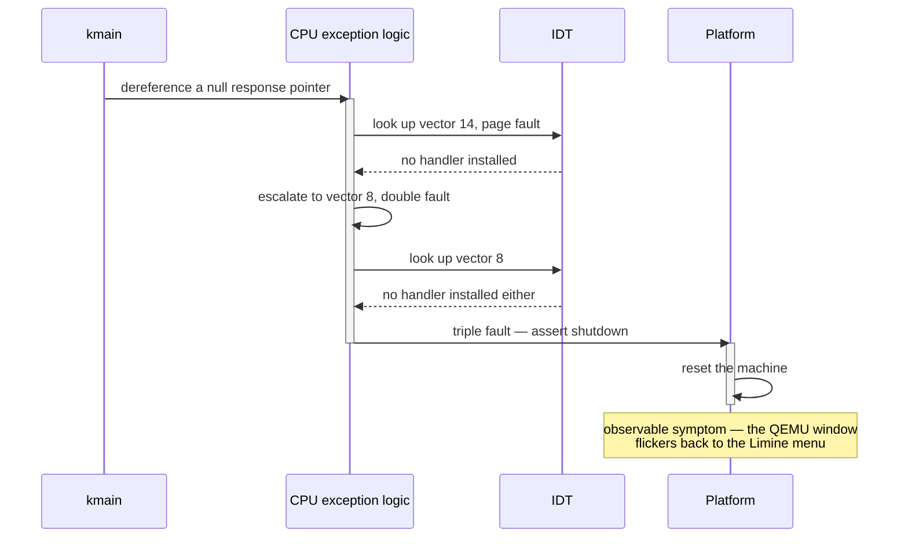

**Walking it.**

A null dereference raises a **page fault**, vector 14. The CPU consults the IDT for a
handler. There is none, because [[Phase 2 - Overview|Phase 2]] has not happened. An
exception raised while handling an exception escalates to a **double fault**, vector 8.
There is no handler for that either, and a fault while handling a double fault is a
**triple fault** — at which point the CPU stops trying, asserts a shutdown cycle, and
the platform resets it.

The consequence for you is the defining fact of Phase 0 and Phase 1: **every mistake
produces the same symptom, a silent reboot, with no message.** That is why
[[Stage 0.6 - Serial Output]] comes before the framebuffer console, and why
[[Stage 0.7 - Panic and KASSERT]] exists as a stage rather than as an afterthought. It
is also why `kmain` must never `return`: Limine *jumps* to the entry point and promises
no return address, so a `ret` pops eight arbitrary bytes into `RIP` and you triple-fault
for a reason that looks nothing like the cause.

> [!warning] `-no-reboot` is not optional in your QEMU line
> Without it a triple fault resets and boots again, so the failure looks like a
> flickering menu instead of a crash. With `-no-reboot -no-shutdown` QEMU stops on the
> triple fault and you can attach the monitor and read registers. See
> [[14 - Debugging Playbook]].

### 5.4 The full timeline, and where Stages 0.1 and 0.2 sit on it

The two stages that build this document's material do not run at boot at all. They run
on your laptop, before the machine is ever switched on — and that placement is the last
thing to internalise.

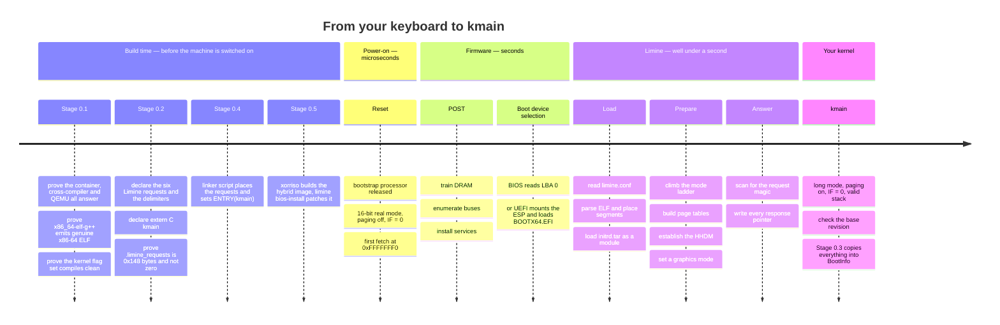

**Walking it.**

- **Build time.** [[Stage 0.1 - Prove Your Toolchain Works]] produces nothing that
  ships. Its entire output is *evidence*: that the pinned container runs, that
  `x86_64-elf-g++` 14.2.0 targets `x86_64-elf` and not `x86_64-linux-gnu`, that the
  kernel flag set compiles silently, that the resulting object really is
  `ELF 64-bit LSB relocatable, x86-64`, and that QEMU exists on the host. Seven links in
  the chain between "I wrote C++" and "the CPU executed it"; the stage checks each one
  before you depend on it, because the black screen at Stage 0.5 has seven suspects and
  no evidence.
- Still build time: [[Stage 0.2 - The Limine Request Section]] produces the object file
  containing `.limine_requests` and a global, unmangled `kmain`. **Everything §4
  describes is decided here**, months before it is read. The mailboxes must be in the
  binary at build time because Limine scans the binary — there is no runtime
  registration step and no second chance.
- [[Stage 0.4 - The Linker Script and Higher-Half Layout]] and
  [[Stage 0.5 - Building a Bootable Image]] complete the build-time half: the linker
  script places the request section in the right order inside a loadable segment and
  resolves `ENTRY(kmain)`; the image build makes a disc the firmware in §3.2 will accept.
- **Power-on** is §3.1, and it is over in microseconds.
- **Firmware** is §3.2, and it is the *slowest* section of the whole timeline by a wide
  margin — DRAM training and device enumeration dominate. Everything you will ever
  optimise about boot time is downstream of a phase you do not control.
- **Limine** is §3.4's gap being filled, in three groups: load, prepare, answer.
- **Your kernel** is one box. Everything else in this atlas lives inside it.

The teaching point of the whole diagram: **the two stages this document is built by are
in the first section, not the last.** Stage 0.1 buys you the right to assume, for the
next two years, that when something breaks it is your code and not your compiler.
Stage 0.2 is the moment the kernel and the bootloader agree on a contract — written by
you at build time, honoured by a different program at boot time, and read back by
`kmain` after that program has already exited.

---

## 6. Why it is shaped this way

| Decision | Option taken | Rejected | What breaks if you reject it | ADR |
|---|---|---|---|---|
| Target | x86_64 long mode | i686 protected mode | 32-bit is a dead end: no modern ABI, no `syscall`/`sysret`, an address space you outgrow, and firmware handover in a mode nobody ships | [[ADR-0002 - Target x86_64 Not i686]] |
| Bootloader | Limine `v8.6.0-binary` | GRUB2 + Multiboot 2 | Multiboot 2 hands over in **32-bit protected mode**, so you write the long-mode trampoline yourself: temporary GDT, four levels of page tables in assembly, `CR4.PAE`, `CR3`, `EFER.LME`, `CR0.PG`, far jump. Not debuggable; every mistake is an instant reset | [[ADR-0003 - Limine as the Bootloader]] |
| Bootloader | Limine | Write your own | ~1 month before the first `hlt`, and two implementations if you want both BIOS and UEFI. Firmware knowledge, not OS knowledge | [[ADR-0003 - Limine as the Bootloader]] |
| Handover data | request/response structs in your image | Multiboot 1's fixed struct plus a flags word | A forgotten `if (flags & (1 << 6))` produces no diagnostic and is *usually fine in QEMU*, because QEMU's firmware fills in more fields than real hardware. That is the exact shape of a bug that ships | [[ADR-0003 - Limine as the Bootloader]] |
| Boot media | one hybrid ISO plus a GPT disk image | separate BIOS and UEFI artefacts | Two artefacts, two checksums, and a user who must know their own firmware family — a question most people cannot answer about their own laptop | — |
| Console | framebuffer from the start | VGA text mode at `0xB8000` | VGA text mode does not exist on a UEFI machine that never entered legacy modes. You would build a console you must throw away | [[ADR-0004 - Framebuffer Console Not VGA Text]] |
| Toolchain | pinned container, `x86_64-elf` cross-compiler | host `gcc` with `-ffreestanding` | The triple still says `linux-gnu`: `__linux__` defined, `/usr/include` on the path, default PIE, stack-protector canaries read from `%fs:0x28`. It compiles, and the first guarded function faults | [[ADR-0005 - Containerised Pinned Toolchain]] |
| Limine confinement | `limine.h` in one directory, everything copied to `boot_info_t` | include it anywhere | The protocol becomes the kernel's internal interface; `kernel/mm/` stops being host-compilable; swapping bootloader means auditing the tree | [[ADR-0003 - Limine as the Bootloader]] |

**The shape underneath all of those rows.** Every one is the same trade: pay a small,
visible, *upfront* cost to convert a class of silent runtime failures into loud
build-time failures. A cross-compiler makes `#include <stdio.h>` an error instead of a
link mystery. `-mcmodel=kernel` makes a bad address a link error instead of a triple
fault. `-mno-sse` makes a stray `double` a compile error instead of a `#UD` with no IDT.
The request/response protocol makes a missing field a null pointer instead of stale
data. In a system where the *only* runtime diagnostic is "the machine reset", this trade
is worth making every single time it is offered.

---

## 7. How this grows across the phases

The power-on path is one of the few parts of the system that is *finished* early. What
changes is how much of the machine the kernel has taken over from Limine.

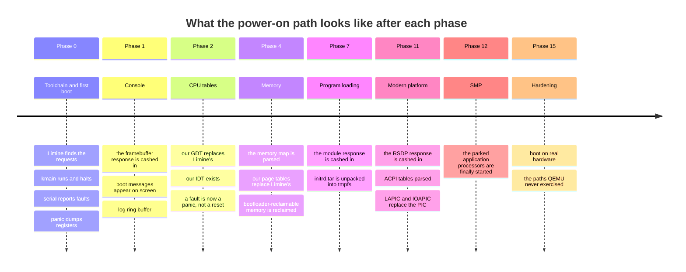

**Walking it.**

- **Phase 0** is where the whole handover contract is written and proven. Nothing about
  the power-on path changes after this; what changes is what the kernel *does* with what
  it was given.
- **Phase 1** cashes in the framebuffer response. The console is the first visible
  consequence of a request declared in [[Stage 0.2 - The Limine Request Section]].
- **Phase 2** is the first time the kernel takes something *away* from Limine: our GDT
  replaces Limine's, and an IDT exists for the first time. This is the phase after which
  a mistake produces a panic with a register dump instead of a silent reset — the single
  largest quality-of-life change in the project.
- **Phase 4** completes the takeover. Our page tables replace Limine's, and the
  bootloader-reclaimable region — including every response structure — is folded into
  the free pool. **After this point, Limine's data is gone.** Everything the kernel still
  needs was copied into `boot_info_t` in Phase 0.
- **Phase 7** cashes in the module response; **Phase 11** the RSDP.
- **Phase 12** starts the application processors that have been parked since §2's
  diagram.
- **Phase 15** is where the theory meets a real motherboard, whose firmware is
  idiosyncratic in ways OVMF and SeaBIOS are not.

**What is deliberately missing early, and why that is acceptable.** For the whole of
Phase 0 there is no IDT, so every fault is a reset; no console, so the only output is
the serial port; no allocator, so nothing is dynamic; and no way to recover from
anything. That is acceptable because Phase 0's deliverable is not a working OS — it is
*evidence that the chain works*, plus the two tools you will lean on for two years: a
reproducible build, and a way for the kernel to tell you what went wrong.

---

## 8. Failure modes

Symptom first, because at 2am the symptom is all you have. Every one of these looks
identical from the outside — a blank screen or a reboot — which is exactly why they are
worth memorising.

> [!warning] Blank screen, QEMU resets in a loop, back to the Limine menu
> **Most likely:** `.limine_requests` is zero bytes because `__attribute__((used))` is
> missing, so GCC deleted globals nobody reads. Limine honoured nothing, every response
> is null, and the first dereference triple-faults. **Check:**
> `x86_64-elf-objdump -h` should show `.limine_requests` at roughly `0x148` bytes, not
> `0`. [[Stage 0.2 - The Limine Request Section]] §6.

> [!warning] `ld: warning: cannot find entry symbol kmain; defaulting to …`
> `extern "C"` is missing, so the symbol is `_Z5kmainv` and `ENTRY(kmain)` resolves to
> nothing. It is a **warning**, so the build succeeds and produces an ELF whose entry
> point is wherever the linker guessed — quite possibly your request magic, executed as
> instructions. `-Werror` does not help: that is a compiler flag and this is the linker.
> **Check:** `x86_64-elf-nm entry.o | grep kmain` must print `T kmain`.

> [!warning] Five requests honoured, one comes back null, consistently
> That request landed outside the region bounded by the start and end markers — almost
> always because the linker script does not emit
> `.limine_requests_start`, `.limine_requests`, `.limine_requests_end` in that order.
> **Check:** `readelf -l` — the whole run must sit inside one `PT_LOAD` segment.
> [[Stage 0.4 - The Linker Script and Higher-Half Layout]].

> [!warning] UEFI drops you at a shell prompt instead of booting
> The firmware found no bootloader. Either `BOOTX64.EFI` is not at exactly
> `\EFI\BOOT\BOOTX64.EFI`, or the partition's type GUID is not
> `C12A7328-F81F-11D2-BA4B-00A0C93EC93B`, or the ESP is not FAT. All three produce the
> same prompt. [[Stage 0.5 - Building a Bootable Image]].

> [!warning] BIOS says "no bootable device", or hangs before Limine's menu
> The `0x55 0xAA` signature is missing from LBA 0, or `limine bios-install` was not run
> after `xorriso`, so the boot record was never patched into the image. The UEFI path
> keeps working, which makes this look like a firmware problem rather than a build one.

> [!warning] Works at `-O0`, breaks at `-O2`
> A missing `volatile` on the request objects. At `-O0` GCC reloads everything from
> memory so a plain global behaves; at `-O2` it folds `.response` to its initialiser,
> because from the compiler's point of view **no code in this program ever writes to
> it** — a different program does, and that program has already exited. Your null checks
> become compile-time constants. This is the one legitimate `volatile` in the kernel.

> [!warning] `kmain` halts, but QEMU pins a host core at 100%
> `for (;;) {}` instead of a loop containing `hlt`. An empty loop with no side effects
> is undefined behaviour in C++ — the forward-progress guarantee lets the compiler
> assume every loop terminates — so it may have been deleted entirely, letting control
> fall through into whatever bytes follow. `__asm__ volatile("hlt")` is an observable
> side effect, so the loop must be kept, and `hlt` with `IF = 0` genuinely stops the CPU.

> [!warning] Everything works for five phases, then the display draws garbage under load
> A retained pointer into a Limine response, and Phase 4's allocator has reused that
> memory. The commit that broke it is in Phase 4; the bug is in Phase 0. See §3.5.

> [!warning] Boots in QEMU, dead on the test laptop
> The class of bug this whole document exists to make thinkable. Real firmware differs:
> the framebuffer may be a different pixel format, the RSDP is at a different address,
> the memory map has more and stranger regions, and Secure Boot may refuse an unsigned
> loader outright. [[Phase 15 - Overview|Phase 15]] is where this is confronted
> deliberately rather than discovered by accident.

---

## 9. Masterclass notes

> [!question] Discussion prompts
> 1. The reset vector is at a fixed address that cannot be configured. Explain why any
>    configurable alternative is impossible, and name two other places in this system
>    where the same "one immovable fact" pattern appears.
> 2. Limine finds the request structures by **scanning the loaded image for a 128-bit
>    magic value**, not by looking up a symbol name. Argue both sides: what does
>    scanning buy, and what class of bug does it create that symbol lookup would not?
> 3. UEFI firmware puts the CPU in long mode before any third-party code runs; BIOS
>    hands over in 16-bit real mode. Yet `kmain` is byte-for-byte identical on both
>    paths. Where exactly does the difference get absorbed, and what would it cost us to
>    let that difference reach the kernel instead?
> 4. `EFER.LMA` is read-only and set by the CPU when `CR0.PG` is written. Reconstruct
>    the five-step long-mode entry sequence from that single fact, and explain why the
>    page tables must be valid *before* the step that enables them.
> 5. Phase 4 reclaims the memory holding every Limine response. Suppose you could not
>    change Phase 4. Design an alternative to "copy everything out in Phase 0", and
>    explain why it is worse.

**You understand this when you can:**

- [ ] Draw the path from `0xFFFFFFF0` to `kmain` from memory, both firmware families, with
      the mode of the CPU labelled at every arrow
- [ ] State the reset values of `CS`, its hidden base, and `IP`, and compute the reset
      vector from them
- [ ] Name the five steps of the long-mode entry sequence in order, and say which one is
      the activation step
- [ ] Explain why an OS is not a thing the hardware knows about
- [ ] List the ten rows of the machine-state table in §3.5 and say which subsystem
      replaces each one, and in which phase
- [ ] Explain why `kmain` takes no parameters, and where the information arrives instead
- [ ] Explain why a null dereference in Phase 0 produces a reboot rather than a message,
      and name the two phases that fix that
- [ ] Explain why `volatile` is correct on the Limine request objects and wrong on
      anything shared between two CPUs

**Board plan** — the order to draw this, in nine steps:

1. A horizontal line: **power → firmware → bootloader → kernel**. Label nothing else yet.
2. Above "power", write `0xFFFFFFF0` and the three register values that produce it.
   Draw the ROM window at the top of the address space and the arrow into it.
3. Split "firmware" into two parallel lanes — **BIOS** and **UEFI** — and write the one
   thing each looks for: `0x55 0xAA`, and a type GUID.
4. Draw the mode ladder vertically off to one side: **real → protected → long**. Put the
   five long-mode steps beside the top rung.
5. Draw a bracket over the ladder labelled **"Limine does this"**, and under the UEFI
   lane a second bracket labelled **"firmware already did this"**.
6. Rejoin the two lanes at a single box: **Limine proper**. Under it write the three
   groups of work: *load, prepare, report*.
7. On the arrow from Limine to `kmain`, write the machine-state table: long mode, paging
   on, `IF = 0`, valid stack, no arguments, Limine's GDT, no IDT.
8. Draw the request/response mailbox picture *backwards* — kernel image on the left with
   empty envelopes, arrow from Limine writing pointers into them, arrow from those
   pointers into reclaimable memory. Circle the reclaimable memory in red.
9. Finally, write **Stage 0.1** and **Stage 0.2** to the *left of the power button*, and
   let the room react to that.

**Time budget:** 45 minutes. Steps 1–3 in ten, step 4 in ten (it will generate
questions), steps 5–7 in fifteen, steps 8–9 in ten. Do not let the SMM digression run.

---

## 10. Related

- [[06 - Architecture Overview]] — the boot chain, the kernel initialisation order, the
  memory layout. This document is the zoom-in on that document's first four lines.
- [[Stage 0.1 - Prove Your Toolchain Works]] — the build-time half of the timeline in §5.4
- [[Stage 0.2 - The Limine Request Section]] — the handover contract in §4, in full detail
- [[Stage 0.3 - Freestanding C++ and kmain]] — copying the responses into `boot_info_t`
- [[Stage 0.4 - The Linker Script and Higher-Half Layout]] — `ENTRY(kmain)` and the
  request section's placement
- [[Stage 0.5 - Building a Bootable Image]] — the hybrid ISO, the GPT image, El Torito
  and the ESP in full
- [[Stage 0.6 - Serial Output]] — the first output, and the reason it precedes the console
- [[Stage 0.7 - Panic and KASSERT]] — turning a reset into a message
- [[ADR-0002 - Target x86_64 Not i686]] · [[ADR-0003 - Limine as the Bootloader]] ·
  [[ADR-0004 - Framebuffer Console Not VGA Text]] ·
  [[ADR-0005 - Containerised Pinned Toolchain]]
- [[Phase 2 - Overview]] — the GDT and IDT that replace Limine's tables
- [[Phase 4 - Overview]] — the page tables and the allocator that reclaim Limine's memory
- [[Phase 12 - Overview]] — waking the application processors parked in §2
- [[04 - Glossary]] · [[14 - Debugging Playbook]] · [[19 - The Eight-Hour Masterclass]]
