# 02 — The Boot Chain

> [!abstract] What this document covers
> Everything that runs between the power button and the first instruction of `kmain`,
> on both firmware standards this OS supports. It covers the two firmware legs (legacy
> BIOS and UEFI), how one hybrid ISO satisfies both, what Limine does while it holds the
> machine, the request/response protocol by which our kernel asks the bootloader
> questions, and the memory-lifetime trap that makes copying everything out of those
> answers mandatory rather than tidy.

**Zoom level:** System
**Built by:** [[Stage 0.2 - The Limine Request Section]], [[Stage 0.3 - Freestanding C++ and kmain]], [[Stage 0.5 - Building a Bootable Image]]
**Prerequisites:** [[06 - Architecture Overview]] · [[04 - Glossary]]
**Masterclass session:** 1 (see [[19 - The Eight-Hour Masterclass]])

---

## 1. The one-sentence version

**A chip on the motherboard finds some code on a disk, runs it, and that code finds our
kernel on the same disk and runs *it* — and the whole design problem is that the chip and
our kernel have almost nothing in common, so a third program has to stand between them.**

A processor coming out of reset cannot read a filesystem, does not know what an executable
file is, and has no idea what RAM is installed. It can do exactly one thing: fetch
instructions from a fixed address. Everything between that fixed address and our
`kmain()` exists to close that gap — to turn "fetch from a fixed address" into "a 64-bit
C++ function is running, with paging on, a valid stack, a known memory map, a known
framebuffer, and a pointer to the ACPI tables". Three programs cooperate to do it:
**firmware** (in flash on the motherboard, which we do not write), **Limine** (a
third-party bootloader, pinned at `v8.6.0-binary`, which we do not write either), and
**our kernel**. This document is about the seams between them, because every seam is a
place where a mistake produces a black screen and no error message.

> [!note] Terms defined on first use
> **Firmware** — software burned into a flash chip on the motherboard, which runs before
> any operating system. **BIOS** and **UEFI** are the two firmware families on x86.
> **Bootloader** — a program whose only job is to load another program. **Kernel** — the
> core of the operating system; ours is `kernel.elf`. **ELF** (Executable and Linkable
> Format) — the executable file format we compile to. **PE32+** — the Windows-derived
> executable format UEFI firmware executes. **LBA** (Logical Block Address) — a sector
> number on a storage device, counting from 0.

---

## 2. The picture

This is the diagram to be able to draw from memory. Everything else in this document is a
zoom into one of its boxes.

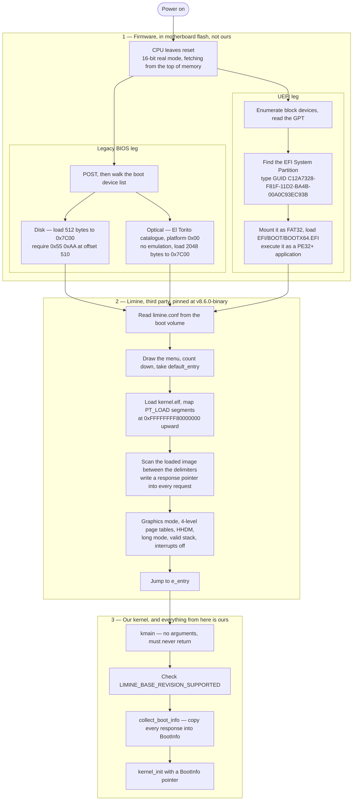

### Walking it

**`Power on` → `CPU leaves reset`.** Voltage stabilises and the processor begins fetching
instructions. It comes out of reset in **real mode** — the 16-bit mode the 8086 had in
1978, with a 1 MiB address space and no memory protection — with the instruction pointer
aimed near the top of the address space, where the motherboard has mapped the firmware
flash chip. Nothing about this is negotiable; it is the same on every x86 machine ever
made. Our kernel never sees this state, because Limine leaves it behind before we run.

**The fork into two legs.** There is one CPU and one reset behaviour, but two entirely
different firmware conventions for what happens next, and they share no code. Which leg
runs is decided by what is in the flash chip and by settings in firmware setup. Both legs
converge on the same box (`Read limine.conf`), and that convergence is the whole reason a
single artefact can boot both ways.

**`POST, then walk the boot device list`** — POST is Power-On Self Test, the firmware's
own hardware check. Then the BIOS tries each device in the order stored in CMOS (a small
battery-backed configuration memory) until one of them looks bootable.

**`Disk — load 512 bytes to 0x7C00`.** The BIOS reads LBA 0 of the device, drops it at
physical address `0x7C00`, checks for the two-byte signature `0x55 0xAA` at offset 510,
and if present jumps to it. That block is the **Master Boot Record**. §3.1 opens it.

**`Optical — El Torito catalogue`.** CD sectors are 2048 bytes and there is no MBR, so
optical media use a 1995 extension called El Torito with its own discovery path. Also
§3.1.

**`Enumerate block devices, read the GPT`.** UEFI does not read raw sectors and jump. It
reads a **GPT** (GUID Partition Table) — a modern partition table living at LBA 1 — and
looks for a partition of a specific type.

**`Find the EFI System Partition`.** That specific type is identified by the GUID
`C12A7328-F81F-11D2-BA4B-00A0C93EC93B`. A partition carrying it is an **ESP**. It is not
a magic filesystem; it is an ordinary FAT partition wearing a label the firmware
recognises.

**`Mount it as FAT32, load EFI/BOOT/BOOTX64.EFI`.** UEFI firmware contains a FAT driver
and a PE32+ loader. It opens a *file* and runs it as a program. §3.2 covers why that
exact path and that exact spelling.

**`Read limine.conf`.** Both legs have now handed control to Limine, and Limine's first
act is to find its own configuration on the volume it was loaded from. `boot():` in
`limine.conf` means exactly that — "the volume I came from" — which is what lets one
unmodified config file work on an ISO 9660 disc and on a FAT32 ESP.

**`Draw the menu, count down, take default_entry`.** `timeout: 3` and
`default_entry: 1` (one-based). The menu appearing is the strongest early signal you
have: it proves firmware found the medium, the first-stage loader ran, Limine's second
stage loaded, and it parsed your config. It proves *nothing* about your kernel.

**`Load kernel.elf, map PT_LOAD segments`.** Limine parses our ELF64 file and copies each
loadable segment (`PT_LOAD` is the ELF program-header type meaning "load this into
memory") to the virtual address the linker script assigned, which for us starts at
`0xFFFFFFFF80000000` ([[Stage 0.4 - The Linker Script and Higher-Half Layout]]).

**`Scan the loaded image between the delimiters`.** This is the request/response
protocol, and it is the single most surprising box in the diagram: the bootloader
searches our binary for structures we planted there at build time. §4 is entirely about
this.

**`Graphics mode, page tables, HHDM, long mode, stack, interrupts off`.** Limine
configures the machine into the state our kernel is written to assume. **Long mode** is
the 64-bit mode of x86_64. **HHDM** (Higher-Half Direct Map) is a mapping that makes
every byte of physical RAM readable at `physical address + offset`; ours is at
`0xFFFF800000000000`. §3.5 walks this.

**`Jump to e_entry`.** `e_entry` is a field in the ELF header holding the entry-point
address. The linker script's `ENTRY(kmain)` is what puts our `kmain`'s address there.
Limine *jumps*; it does not *call*. There is no return address on the stack.

**`kmain`** takes no arguments and must never return. **`Check
LIMINE_BASE_REVISION_SUPPORTED`** is the first thing it does, because if the bootloader
could not honour the protocol revision we asked for, nothing below is trustworthy.
**`collect_boot_info`** copies every answer into our own struct, and
**`kernel_init`** is the first function in the tree that has never heard of Limine.

> [!warning] The menu is not proof
> Reaching Limine's menu tells you the *firmware* half of the chain works. It says
> nothing about whether your kernel loaded, whether the request section survived the
> linker, or whether `kmain` ran. Those need the QEMU monitor
> ([[Stage 0.5 - Building a Bootable Image]] §6) or serial output
> ([[Stage 0.6 - Serial Output]]). Treating the menu as success is the most common way to
> spend an afternoon debugging the wrong thing.

---

## 3. Zooming in

### 3.1 The legacy BIOS leg

The convention here is essentially unchanged since the IBM PC in 1981, and its age shows
in every constraint.

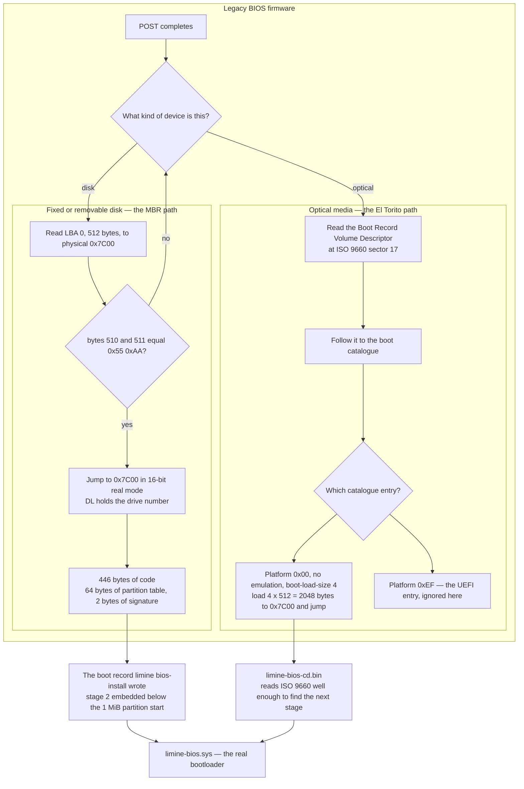

**Every box, in order.** `POST completes` and the firmware begins trying devices. `What
kind of device is this?` is the fork: an ATA/SATA/USB mass-storage device gets the MBR
treatment, an optical device gets El Torito. There is no negotiation — the firmware
decides based on the device class it enumerated.

Down the disk path: `Read LBA 0` puts the first 512 bytes at `0x7C00`, an address chosen
in 1981 and frozen ever since. `bytes 510 and 511 equal 0x55 0xAA?` is the entire
validity check — two bytes. If they are absent the firmware goes back to the device list
(`no` → back to the fork). If present, `Jump to 0x7C00` transfers control with the
processor still in 16-bit real mode and the BIOS drive number left in the `DL` register,
which is how the loaded code knows which device it came from.

`446 bytes of code` is the budget, and it is the reason every BIOS bootloader is a chain.
The 512-byte sector must also hold a 64-byte four-entry partition table and the two
signature bytes, leaving 446 bytes for instructions. You cannot fit a filesystem driver
in 446 bytes. You can just about fit "read some more sectors and jump to them", which is
what `The boot record limine bios-install wrote` does — and it locates its second stage
in the free space that exists because our first partition deliberately starts at 1 MiB
rather than immediately after the partition table.

Down the optical path: `Read the Boot Record Volume Descriptor at ISO 9660 sector 17`.
ISO 9660 is the CD filesystem; its volume descriptors start at sector 16, and sector 17
by convention holds the boot record that points at the **boot catalogue**. `Follow it to
the boot catalogue` and then `Which catalogue entry?` — because a catalogue may hold
several, each tagged with a **platform ID**.

`Platform 0x00, no emulation` is the BIOS entry. El Torito offers three emulation modes;
we use none of them:

| Emulation mode | What the BIOS pretends the disc is | Why we do not use it |
|---|---|---|
| Floppy | a 1.44 or 2.88 MB floppy | caps the loader at that size, and the reported disk geometry is a lie |
| Hard disk | a disk with an MBR | reintroduces the 446-byte chaining problem with extra indirection |
| **None (chosen)** | nothing — load N raw sectors and jump | the loader must locate itself, which the boot info table solves |

`boot-load-size 4` counts in 512-byte *virtual* sectors even though the physical sector is
2048 bytes, so four of them is exactly one CD sector: 2048 bytes loaded. That is not
enough for `limine-bios-cd.bin`, which is larger — so xorriso's `-boot-info-table` patches
a 56-byte structure into the boot image at byte offset 8, containing the volume
descriptor's LBA, the boot file's LBA, its length and a checksum. The loaded fragment
reads its own table, learns where the rest of itself is, and pulls it in.

`Platform 0xEF — the UEFI entry, ignored here` is the second catalogue entry. BIOS
firmware does not understand platform `0xEF` and skips it. That mutual ignoring is the
mechanism that makes one disc boot both ways.

Both branches converge on `limine-bios.sys`, the real bootloader, loaded off the
filesystem by whichever tiny first stage ran.

> [!warning] `limine bios-install` is a separate command and it is easy to lose
> `xorriso` produces an ISO that boots under BIOS *as a CD* and under UEFI. It does not
> produce one that boots under BIOS *from a USB stick*, because a USB mass-storage device
> is read as a disk, so the firmware reads LBA 0 as an MBR and never opens the El Torito
> catalogue at all. `limine bios-install` writes that boot record. Delete the line and
> everything passes in QEMU with `-cdrom` and fails on release day, on hardware, in front
> of someone. See [[Stage 0.5 - Building a Bootable Image]] §7.

### 3.2 The UEFI leg

UEFI throws the boot sector away entirely. This diagram nests three levels deep, because
that is genuinely how the discovery works: firmware → the mounted ESP → the decision about
which file inside it to execute.

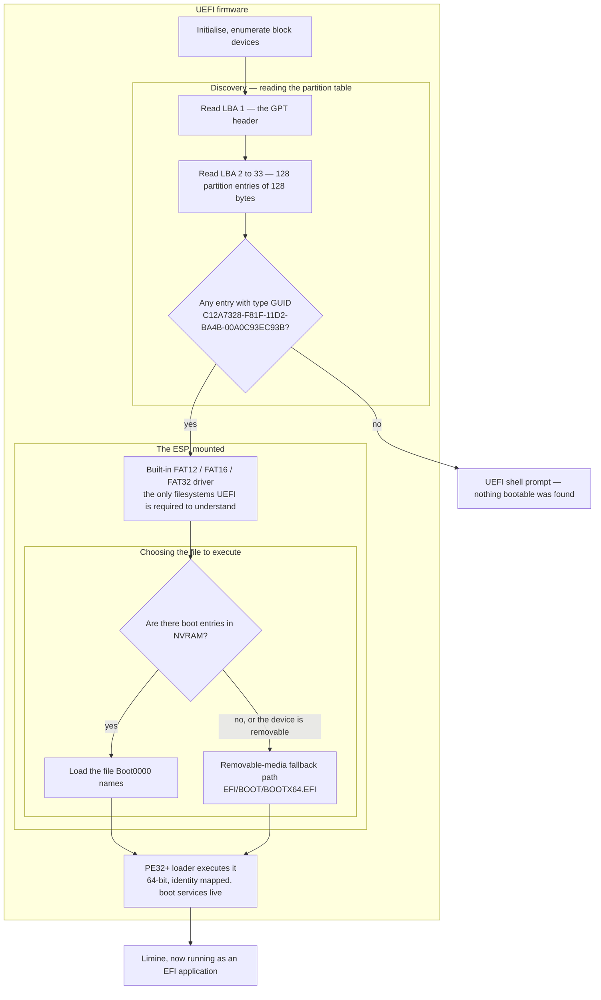

**Walking it.** `Initialise, enumerate block devices` — UEFI firmware is a small operating
system in its own right, with drivers, a protocol registry and a shell. It finds every
block device before deciding anything.

`Read LBA 1 — the GPT header` and `Read LBA 2 to 33`. GPT places its header at LBA 1 and
its partition entry array at LBA 2 through 33: 128 entries of 128 bytes each, which is
16 KiB. LBA 0 holds a **protective MBR** — a fake single-partition MBR of type `0xEE`
covering the whole disk, whose only purpose is to stop old tools that only understand MBR
from concluding the disk is empty and offering to partition it.

`Any entry with type GUID C12A7328-…?` If not, the firmware has nowhere to look and
drops you at a `Shell>` prompt. **That prompt is the UEFI failure mode you will actually
see**, and it is indistinguishable from having put the file in the wrong place — which is
why [[Stage 0.5 - Building a Bootable Image]] has you check `parted build/os.img print`
for the `esp` flag before ever booting.

`Built-in FAT driver`. This is a hard constraint, not a preference. The UEFI
specification requires implementations to support FAT12, FAT16 and FAT32 and says nothing
about anything else. You cannot put your bootloader on ext2, or on your own filesystem,
because the firmware cannot read it and there is no way to teach it before it runs. This
is the direct cause of the FAT32 half of
[[ADR-0009 - Filesystem Strategy FAT32 then ext2]]: we implement FAT32 in the kernel not
because it is a good filesystem but because it is the one we are *required* to be able to
write.

`Are there boot entries in NVRAM?` A permanently installed OS registers a variable
(`Boot0000`, `Boot0001`, …) in the firmware's non-volatile store naming its own loader.
A USB stick cannot — it has never seen this machine. So the specification defines a
hardcoded per-architecture fallback: `\EFI\BOOT\BOOTX64.EFI` on x86_64,
`\EFI\BOOT\BOOTIA32.EFI` on 32-bit x86. That path, spelled and capitalised exactly that
way, is why `mkimage.sh` copies Limine's `BOOTX64.EFI` there and nowhere else.

`PE32+ loader executes it`. PE32+ is the 64-bit variant of the Portable Executable
format. Note what the machine looks like at this instant: **already in 64-bit long mode,
identity mapped, with firmware "boot services" — memory allocation, disk I/O, console —
still callable.** Limine on this leg starts life in a far more comfortable environment
than on the BIOS leg.

> [!example] Why `-bios OVMF_CODE_4M.fd` in QEMU exercises the USB path
> Passing OVMF through `-bios` gives it no writable variable store, so it has no NVMR
> boot entries at all, so it always takes the `no` branch out of `Are there boot entries
> in NVRAM?` and lands on the removable-media fallback. Your development setup therefore
> exercises exactly the path a USB stick takes on real hardware — which is the path you
> care about and the one you would otherwise never test until release day.

### 3.3 One file, both legs: the hybrid ISO

`build/os.iso` is a single file with four separate boot paths layered into it. This
diagram goes four levels deep, because that is how many containers there really are: the
ISO holds a boot catalogue, which holds a UEFI entry, which points at a FAT image, which
holds a file.

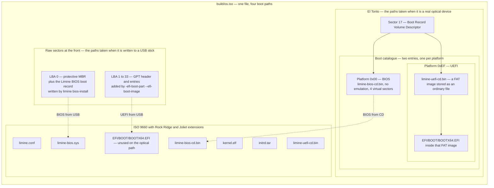

**The four paths, and which box serves each.**

| # | Firmware | Medium | Entry point | Then |
|---|---|---|---|---|
| 1 | BIOS | optical | El Torito entry, platform `0x00` | `limine-bios-cd.bin` → `limine-bios.sys` |
| 2 | UEFI | optical | El Torito entry, platform `0xEF` | FAT image → `BOOTX64.EFI` inside it |
| 3 | BIOS | USB / disk | LBA 0, the MBR boot record | embedded stage 2 → `limine-bios.sys` |
| 4 | UEFI | USB / disk | LBA 1, the GPT, the registered EFI boot partition | `/EFI/BOOT/BOOTX64.EFI` on the volume |

**Walking the arrows.** `LBA 0` and `LBA 1 to 33` occupy the very front of the file and
exist only for paths 3 and 4 — when the medium is presented to firmware as a *disk*, El
Torito never enters the picture, so the ISO has to also look like a partitioned disk.
That dual identity is what "hybrid" means, and it is produced by three separate
mechanisms: `--protective-msdos-label` writes the protective MBR,
`-efi-boot-part --efi-boot-image` registers the embedded EFI image as a real partition in
the image's partition table, and `limine bios-install` afterwards writes the actual BIOS
boot record into LBA 0.

`Sector 17` and the boot catalogue serve paths 1 and 2. `Platform 0x00` points directly
at raw sectors of `limine-bios-cd.bin`. `Platform 0xEF` cannot, because **UEFI does not
boot raw sectors — it boots a file out of a FAT filesystem.** So the UEFI catalogue entry
points at `limine-uefi-cd.bin`, which *is* a small FAT filesystem stored inside the ISO as
an ordinary file. Firmware exposes it as a virtual block device, mounts it, and finds
`/EFI/BOOT/BOOTX64.EFI` inside. That is the four-level nesting the diagram shows, and it
is genuinely four levels of container.

`EFI/BOOT/BOOTX64.EFI — unused on the optical path` is the box people go looking for when
UEFI-from-ISO fails. It is *not* what path 2 reads. Path 2 reads the copy inside
`limine-uefi-cd.bin`. The staged copy exists because `build_img` reuses the same staging
tree, where it is essential. Harmless duplication — but if you edit it expecting the ISO's
UEFI path to change, nothing happens.

### 3.4 The other artefact: the GPT disk image

`os.img` is not a disc. It is a byte-for-byte image of a real hard disk, and it is the
artefact that ships.

```mermaid
flowchart TD
    subgraph IMG["build/os.img — 322 MiB, ESP_MB 64 plus ROOT_MB 256 plus 2"]
        direction TB
        subgraph HEAD["First 1 MiB — partition metadata and the embedded BIOS stage"]
            direction TB
            H1["byte 0 — protective MBR, one entry of type 0xEE covering the disk"]
            H2["byte 512 — GPT header, LBA 1"]
            H3["byte 1024 — 128 partition entries of 128 bytes, LBA 2 to 33"]
            H4["about 17 KiB up to 1 MiB — free<br/>limine bios-install embeds stage 2 here"]
        end
        subgraph P1["1 MiB — partition 1, ESP, 64 MiB, FAT32, label OSBOOT"]
            direction TB
            subgraph EFIDIR["EFI/BOOT"]
                direction TB
                A1["BOOTX64.EFI"]
                A2["BOOTIA32.EFI — copied only if the Limine build has it"]
            end
            A3["limine.conf"]
            A4["kernel.elf"]
            A5["initrd.tar"]
            A6["limine-bios.sys — a BIOS file on an EFI partition, deliberately"]
        end
        subgraph P2["65 MiB — partition 2, root, 256 MiB, ext2, 1024-byte blocks, label OSROOT"]
            direction TB
            B1["Empty until Phase 10. WRITABLE — the only place persistence can be proven"]
        end
        G2["Last 33 sectors — backup GPT"]
    end
```

**Walking it.** `byte 0`, `byte 512`, `byte 1024` are the three fixed structures every GPT
disk has, and their offsets are worth memorising because they are the first thing you
check when a partition table looks wrong.

`about 17 KiB up to 1 MiB — free`. Partition 1 starts at 1 MiB rather than immediately
after the partition entry array, and this is not decoration. It leaves room for Limine's
BIOS second stage to be embedded, and it aligns the partition to any plausible flash
erase-block boundary. Move the partition start down and `limine bios-install` has nowhere
to put stage 2.

`partition 1, ESP, FAT32, label OSBOOT`. `set 1 esp on` in `parted` is what stamps the
type GUID; without it you have a perfectly correct FAT32 partition with all the right
files that no firmware will ever open. `mkfs.fat -F 32` forces FAT32 rather than letting
the tool choose, which matters because **FAT32 has a floor** — the format needs more than
65 524 clusters, roughly 32 MiB at 512-byte clusters. Shrink `ESP_MB` below about 33 and
you get a filesystem real firmware rejects.

`limine-bios.sys — a BIOS file on an EFI partition, deliberately`. This looks wrong and
is not. When `os.img` is booted on a legacy-BIOS machine, the boot record in LBA 0 needs
to load a second stage from *some* filesystem it can read, and FAT32 is one Limine can
read. Without it the BIOS path on `os.img` gets as far as the MBR and stops.

`partition 2, root, ext2, 1024-byte blocks`. Empty today. It exists now so the layout is
final now — layout changes late are the ones that break the release pipeline. 1024-byte
blocks are chosen so ext2's superblock, which always lives at byte offset 1024, *is*
block 1, which removes an entire category of off-by-one from the driver in
[[Phase 10 - Overview]].

`Last 33 sectors — backup GPT`. The `+ 2` in the total size exists so this has somewhere
to live. Remove it and `parted` cannot place the backup header.

> [!warning] The offsets are written down twice and nothing checks they agree
> `mkimage.sh` gives `parted` the partition boundaries in MiB, and separately computes
> byte offsets for `dd`. Change one without the other and you will `dd` a perfectly good
> filesystem to a place the partition table does not point at. Every command succeeds.
> Nothing boots. See [[Stage 0.5 - Building a Bootable Image]] §5.

### 3.5 What Limine actually does

Limine holds the machine for a long time by boot standards, and what it does in that
window is precisely the work our kernel does not have to do.

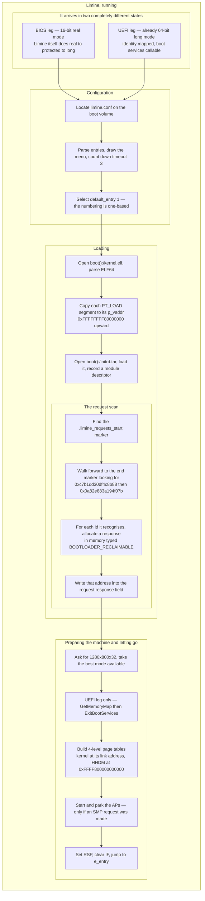

**Walking it.** `It arrives in two completely different states` is the box that explains
why using a bootloader is worth a third-party dependency at all. On the BIOS leg Limine
is handed a 1978-era 16-bit machine and must itself walk it through real mode → protected
mode (32-bit, with memory protection) → long mode (64-bit), enabling the A20 address line
and building temporary page tables on the way. On the UEFI leg it starts already in long
mode with a rich API available. **Two completely different problems, one bootloader, and
our kernel sees neither.** If we wrote our own loader we would be writing both.

`Locate limine.conf`, `Parse entries`, `Select default_entry 1`. Four entries are
configured — default, verbose, single-core, and self-test — and only the numbering is
worth flagging: `default_entry` is **one-based**, so `1` is the first entry. Entry 4
loads `kernel-test.elf`, which does not exist until the Tier 2 build in
[[09 - Testing Strategy]], and selecting it fails by design.

`Open boot():/kernel.elf, parse ELF64` and `Copy each PT_LOAD segment to its p_vaddr`.
Limine is an ELF loader. It reads the program headers and honours the virtual addresses
our linker script assigned. This is why the linker script and the bootloader have to
agree, and why `-mcmodel=kernel` — which requires code to live in the top 2 GiB —
constrains where the kernel can be linked ([[ADR-0002 - Target x86_64 Not i686]]).

`Open boot():/initrd.tar` — a **module** is any extra file the bootloader loads into RAM
alongside the kernel and reports the location of. Ours is the initial ramdisk, unused
until [[Phase 7 - Overview]], but the file must exist now or Limine errors while loading
the entry.

**The request scan** is §4's subject and the reason the diagram nests here. Note the
order of the boxes: the scan happens *after* the image is in memory, because Limine is
searching the loaded bytes, not the file on disk.

`Ask for 1280x800x32, take the best mode available`. It is a request, not a command. The
framebuffer response reports what was actually obtained. **Never hardcode a resolution in
the kernel** — read the response. Under
[[ADR-0004 - Framebuffer Console Not VGA Text]] the framebuffer is the only display path
in the system, so `limine.conf` is the only place a display mode is ever chosen.

`GetMemoryMap then ExitBootServices` (UEFI only). UEFI boot services own memory and
devices until this call; after it they are gone permanently, and the memory map obtained
immediately beforehand is the last word on what RAM exists. On the BIOS leg the
equivalent information came from the BIOS `INT 15h, E820` interface earlier.

`Build 4-level page tables` and `HHDM at 0xFFFF800000000000`. Limine establishes paging
in the layout our kernel expects. We build our *own* tables in [[Phase 4 - Overview]] and
keep the HHDM at the same offset deliberately, because pointers Limine handed us — the
framebuffer address in particular — are virtual addresses inside that map.

`Start and park the APs — only if an SMP request was made`. **AP** is Application
Processor, meaning every core except the one that booted (the **BSP**, Bootstrap
Processor). Limine will bring them up and park them in a callback for us, removing an
entire class of INIT/SIPI bugs — but only if we declare the SMP request, which we
deliberately do not until [[Phase 12 - Overview]], because a request that changes the
machine's behaviour should arrive in the phase ready to cope with it.

`Set RSP, clear IF, jump to e_entry`. `RSP` is the stack pointer; `IF` is the interrupt
flag in `RFLAGS`. Clearing `IF` means interrupts are off, which is why `hlt` in early
`kmain` halts permanently — exactly what we want when there is no interrupt handler.

> [!note] The contract is the state at `kmain`, not the order of these boxes
> The internal ordering inside `Preparing the machine` is Limine's business and may
> differ between versions. What is contractual is the table in
> [[Stage 0.2 - The Limine Request Section]] §4.6 — the machine state when `kmain` is
> entered. Anything not in that table is unspecified; check `PROTOCOL.md` for the pinned
> tag before relying on it.

#### The state `kmain` inherits

| Property | State on entry | Consequence for us |
|---|---|---|
| CPU mode | 64-bit long mode | no trampoline to write, ever |
| Paging | enabled, kernel mapped at its link address | we build our own tables in [[Phase 4 - Overview]] |
| Interrupts | disabled, `IF = 0` | `hlt` halts permanently, which is what Stage 0.5 wants |
| Stack | valid, `RSP` set by Limine | C++ is callable from the first instruction |
| HHDM | established; offset in the HHDM response | read it, never hardcode it |
| Arguments | none — `kmain` takes no parameters | everything arrives through response pointers |
| Application processors | **not started** unless an SMP request was made | [[Phase 12 - Overview]] |
| GDT | Limine's own | replaced in [[Phase 2 - Overview]]; do not build on it |
| IDT | none usable | any fault before Phase 2 is a triple fault |

---

## 4. The data structures

### 4.1 The request/response model

The direction of this protocol inverts what most people expect, and the inversion is the
whole point.

> **The kernel allocates the mailboxes; the bootloader fills them in.**

We place structures into our own binary. Each begins with a 128-bit magic number
identifying it as a request, followed by another 128 bits saying *which* request. Limine
loads our binary, walks its bytes looking for that magic, and every time it finds an id it
recognises it allocates an answer somewhere in RAM and writes the answer's address into
the `response` field of our structure. Then it jumps to `kmain`. There is no argument in
a register and no info-block pointer — the answers are already sitting inside our own
data, because we shipped the envelopes.

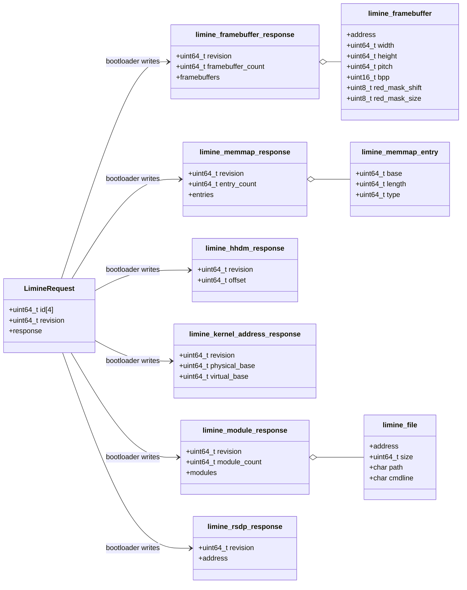

**Walking it.** `LimineRequest` is the shape all six of ours share: 32 bytes of id, 8
bytes of request revision, 8 bytes of `response`, 48 bytes total. The six arrows out of
it are the six answers Limine can write, one per request we declared. The `o--` aggregation
arrows show the three responses that are really *arrays of pointers to further structs* —
a framebuffer response points at a list of framebuffers, a memmap response at a list of
entries, a module response at a list of files. Everything reachable through those arrows
lives in bootloader-reclaimable memory. Everything above the arrows — the request structs
themselves — lives in our own image.

#### The 48-byte request, field by field

| Offset | Size | Field | Written by |
|---|---|---|---|
| 0 | 32 | `uint64_t id[4]` | us, at build time |
| 32 | 8 | `uint64_t revision` | us, at build time |
| 40 | 8 | `response` pointer | **the bootloader** |
| 48 | 8 | `internal_module_count` — module request only, request revision 1 | us |
| 56 | 8 | `internal_modules` — module request only, request revision 1 | us |

`id` is four 64-bit words, not one. Words `[0]` and `[1]` are `LIMINE_COMMON_MAGIC` —
`0xc7b1dd30df4c8b88` and `0x0a82e883a194f07b` — **identical in every request**. That
128-bit value is what Limine scans memory for. Words `[2]` and `[3]` say which request it
is:

| Request | `id[2]` | `id[3]` | Needed by |
|---|---|---|---|
| framebuffer | `0x9d5827dcd881dd75` | `0xa3148604f6fab11b` | [[Phase 1 - Overview]] |
| memmap | `0x67cf3d9d378a806f` | `0xe304acdfc50c3c62` | [[Phase 4 - Overview]] |
| hhdm | `0x48dcf1cb8ad2b852` | `0x63984e959a98244b` | [[Phase 4 - Overview]] |
| kernel address | `0x71ba76863cc55f63` | `0xb2644a48c516a487` | Stage 1.7 backtraces |
| module | `0x3e7e279702be32af` | `0xca1c4f3bd1280cee` | [[Phase 7 - Overview]] |
| rsdp | `0xc5e77b6b397e7b43` | `0x27637845accdcf3c` | [[Phase 11 - Overview]] |

You never type these; the macros expand to them. They are here so you can recognise them
in a hex dump when something has gone wrong.

**Two `revision` fields pointing opposite directions.** The *request* revision means
"which of my optional trailing fields have I filled in?" — set it to 0 and Limine reads
nothing past `response`. The *response* revision means "which of my trailing fields did
the bootloader fill in?" Reading a field the header marks as belonging to a higher
response revision, without checking, reads uninitialised bytes.

#### The section layout, and why the names matter

```
.limine_requests_start    32 B   start marker  (4 words)
.limine_requests         328 B   base revision marker (24 B)
                                 + framebuffer, memmap, hhdm,
                                   kernel_address, rsdp  (48 B each)
                                 + module (64 B)
.limine_requests_end      16 B   end marker    (2 words)
```

The section name means **nothing to Limine** — it scans loaded memory, not section
headers. It means everything to *us*: putting every request in one named section is how
we guarantee they land contiguously, inside the delimiters, and inside a loadable
segment. The delimiters bound the scan, which is faster and, more importantly, safe: if
the kernel ever embeds a data blob containing those sixteen magic bytes — a font, a
compressed archive, a test fixture — an unbounded scan would try to interpret it as a
request.

#### The base revision marker — version negotiation in three words

| Word | Initial value | After Limine has run |
|---|---|---|
| `[0]` | `0xf9562b2d5c95a6c8` | unchanged — this is what Limine searches for |
| `[1]` | `0x6a7b384944536bdc` | **overwritten** with the base revision actually loaded |
| `[2]` | `N`, the revision we want (we ask for 2) | **zeroed** if Limine can honour revision `N` |

`LIMINE_BASE_REVISION_SUPPORTED` is literally `limine_base_revision[2] == 0`. That is the
whole negotiation: we write a number in, the bootloader writes a zero back if it agrees.

> [!warning] Three ways the request section silently becomes empty
> Each produces the same symptom — every `response` is null, the first dereference page
> faults, there is no IDT yet so it escalates to a triple fault, and the machine reboots
> into the Limine menu. Nothing in that chain names the cause.
>
> 1. **Missing `__attribute__((used))`.** The compiler sees a global nothing reads,
>    concludes it is dead, and deletes it. `.limine_requests` is emitted with size 0.
> 2. **Missing `KEEP()` in the linker script.** The compiler kept it; the linker garbage
>    collected the section. `used` and `KEEP` stop two different tools and you need both.
> 3. **A typo in the section name.** `.limine_request` compiles and links fine. The
>    linker script does not mention it, so it lands outside the delimiters or is dropped.
>
> The build-time check that catches all three is `x86_64-elf-objdump -h` showing
> `.limine_requests` with a non-zero size — run it every time that file is touched.

### 4.2 Our own structure: `BootInfo`

Everything above is Limine's. Everything below is ours, and the translation between them
happens in exactly one function.

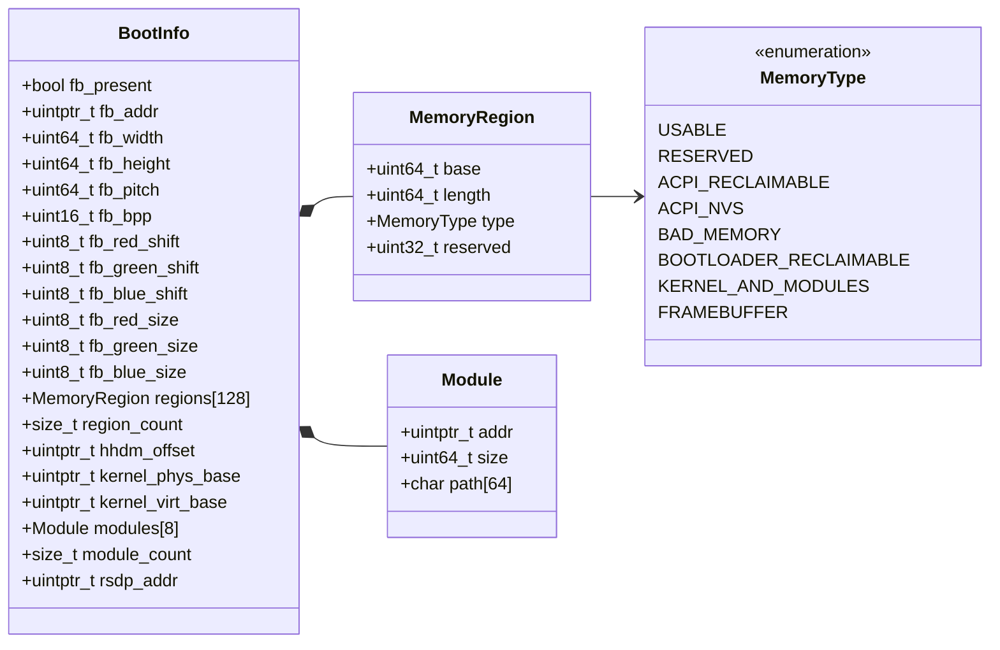

**Walking it.** `BootInfo` is a single 3808-byte object in `.bss` — the section of
zero-initialised globals, which costs nothing in the binary because it is described rather
than stored. It is one object because there is no heap: `collect_boot_info()` runs at step
2 of the initialisation order in [[06 - Architecture Overview]] and the heap does not
exist until step 10. The dependency is circular — the heap needs the physical memory
manager, the PMM needs the memory map, the memory map comes from here — and fixed-size
storage in `.bss` is the only way out.

The `*--` composition arrows are literal: `regions` is an inline array of 128
`MemoryRegion` values, not a pointer, and `modules` an inline array of 8 `Module` values.
`MemoryRegion` is 24 bytes and `Module` is 80, both pinned by `static_assert` so a layout
change is a build failure rather than a runtime surprise.

`MemoryType` is our own enum whose numeric values happen to match Limine's today.
`boot_info.cpp` translates explicitly anyway, so a bootloader change is one switch
statement rather than a tree-wide audit.

| Member | Bytes | Copied from |
|---|---|---|
| `fb_present` plus padding | 8 | `framebuffer_count > 0` |
| `fb_addr` | 8 | `framebuffers[0]->address` — a **virtual** address in the HHDM |
| `fb_width`, `fb_height`, `fb_pitch` | 24 | same framebuffer |
| `fb_bpp` plus six mask bytes | 8 | same framebuffer |
| `regions` | 3072 | memmap entries, one by one |
| `region_count` | 8 | `entry_count` |
| `hhdm_offset` | 8 | HHDM response `offset` |
| `kernel_phys_base`, `kernel_virt_base` | 16 | kernel-address response |
| `modules` | 640 | module descriptors, paths copied into the struct |
| `module_count` | 8 | `module_count` |
| `rsdp_addr` | 8 | RSDP response `address` |
| **Total** | **3808** | |

**Which responses are optional.** Getting this wrong in either direction is a real bug —
halting on a headless machine that would have booted fine, or dereferencing a null
response on a machine that had no framebuffer.

| Response | Required? | If missing |
|---|---|---|
| memmap | **yes** | halt — nothing works without a memory map |
| HHDM | **yes** | halt — Phase 4 cannot address physical memory without it |
| kernel address | **yes** | halt — backtraces and Phase 4 self-reservation need it |
| framebuffer | no | `fb_present = false`; a headless machine must still boot |
| modules | no | `module_count = 0`; there is no initrd until Phase 7 |
| RSDP | no | `rsdp_addr = 0`; Phase 11 decides what to do |

**How a failure is reported before there is any output.** There is no serial port until
[[Stage 0.6 - Serial Output]] and no `panic()` until [[Stage 0.7 - Panic and KASSERT]], so
a fatal boot error parks the CPU with a recognisable 64-bit value in `RDI`, read back with
`info registers` in the QEMU monitor. `0xB007FA11` reads as BOOTFAIL and `0xB007C0DE` as
BOOTCODE, which is the entire justification — you recognise them in a register dump
without looking anything up.

| Constant | Value | Fires when |
|---|---|---|
| `BOOT_HALT_OK` | `0xB007C0DE00000000` | `kernel_init` returned — the expected end of Stage 0.3 |
| `BOOT_FAIL_BASE_REVISION` | `0xB007FA1100000001` | Limine does not support our base revision |
| `BOOT_FAIL_NO_MEMMAP` | `0xB007FA1100000002` | memmap response is null |
| `BOOT_FAIL_EMPTY_MEMMAP` | `0xB007FA1100000003` | `entry_count == 0` |
| `BOOT_FAIL_TOO_MANY_REGIONS` | `0xB007FA1100000004` | more than 128 regions |
| `BOOT_FAIL_NO_HHDM` | `0xB007FA1100000005` | HHDM response is null |
| `BOOT_FAIL_NO_KERNEL_ADDRESS` | `0xB007FA1100000006` | kernel-address response is null |
| `BOOT_FAIL_TOO_MANY_MODULES` | `0xB007FA1100000007` | more than 8 modules |

---

## 5. The flows

### 5.1 The UEFI leg, end to end

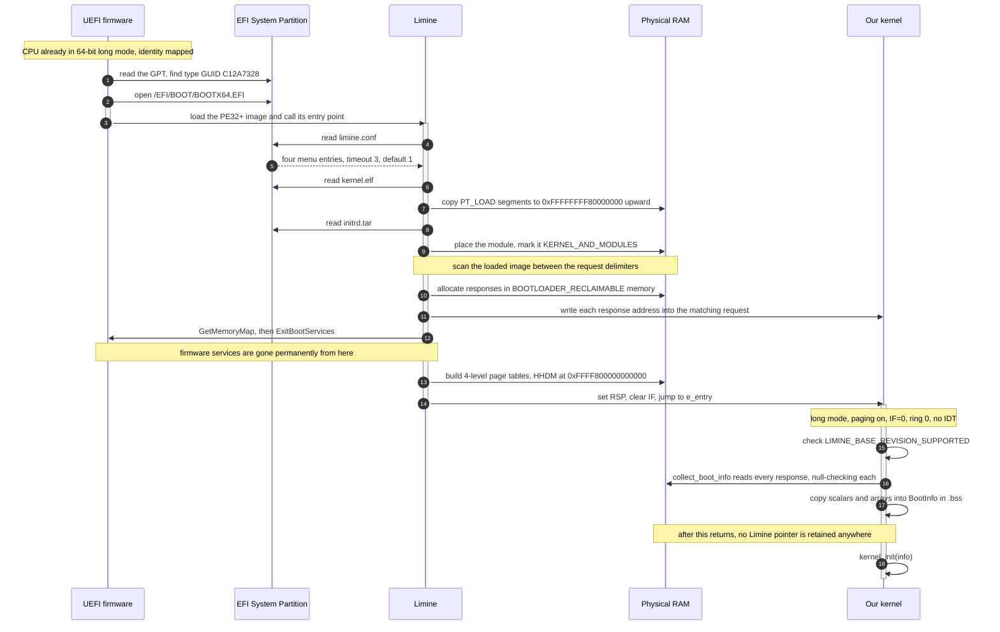

**Where control lives.** The `activate` bars are the point of this diagram. Firmware
holds the machine for steps 1–4 and then never runs again except for the two boot-service
calls at step 14. Limine holds it from 5 to 17. Our kernel holds it from 18 to the end and
never gives it back. **There is no scheduler, no interrupt, and no other agent** — this is
strictly sequential, single-threaded control transfer, which is why `volatile` on the
request structs is about a *different program* having written them, not about concurrency.

**Where privilege changes.** Nowhere. Every step runs at ring 0 (full privilege). The
first privilege drop in this OS is spawning `init` in ring 3, in [[Phase 8 - Overview]].
That is worth stating explicitly because it is unusual: the boot chain has no security
boundary in it at all, which is exactly why Secure Boot exists and why our unsigned Limine
cannot pass it.

**Where locks are taken.** Nowhere. There is one CPU running — the APs are not even
started — and no interrupt can fire because `IF` is clear.

**Step 14 is the point of no return.** After `ExitBootServices`, firmware memory
allocation, disk I/O and console are all gone. Anything not read before that call cannot
be read after it.

**Step 21 is the rule the whole design rests on.** After `collect_boot_info()` returns, no
pointer derived from a Limine response is stored anywhere in the kernel. §5.3 is why.

### 5.2 The BIOS leg, and where it differs

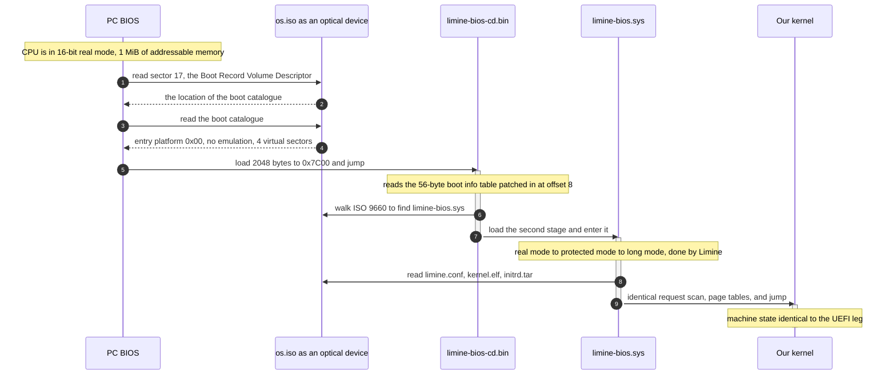

**What differs from §5.1.** Three things, all before Limine's second stage: the discovery
mechanism (a boot catalogue instead of a partition table), the number of chained loaders
(two tiny stages instead of one PE application), and the CPU mode Limine inherits (16-bit
real mode instead of 64-bit long mode, so the mode transitions are Limine's problem).

**What is identical.** Everything from `read limine.conf` onward. Same config file, same
ELF loading, same request scan, same page tables, same jump, same `kmain`. **That
convergence is the product decision.** One kernel, one `limine.conf`, one set of stage
notes, one class of bug. The alternative — a kernel that behaves differently depending on
firmware — would double the boot matrix and every debugging session with it.

### 5.3 The reclaimable-memory trap

This is the single most consequential fact in Phase 0, and it is a *lifetime* problem, not
a correctness-of-code problem.

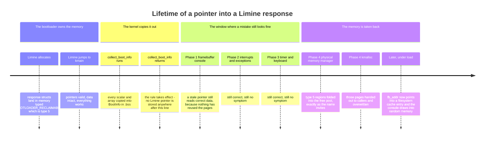

**Walking it.** `Limine allocates` — the response structures do **not** live in our kernel
image. Our image holds the request structs, the mailboxes. The replies are allocated by
Limine in memory it marks `BOOTLOADER_RECLAIMABLE`, memory-map type 5. That name is a
promise *to us*: once we no longer need what the bootloader left behind, the memory is
ours.

`collect_boot_info runs` and `returns` — this is the fix, and it is mechanical. Scalars
get copied. Memory map entries get copied into the fixed array. Module descriptors get
copied, including the path string; the module *contents* stay where they are, because they
can be large, but their ranges are marked reserved in Phase 4 so the allocator never hands
them out.

`Phase 1`, `Phase 2`, `Phase 3` — the window. If you skipped the copy and kept a pointer,
**nothing goes wrong here.** The memory is mapped, readable and writable. Nothing traps.
The pages are free but unused, so the old contents survive and the kernel keeps working
for three entire phases.

`Phase 4 physical memory manager` — the PMM does exactly what the type name invites and
folds type 5 into the free pool. At that instant every pointer into a Limine response
becomes a pointer into the heap. Still no symptom, because the pages have not been reused
yet.

`Phase 4 kmalloc` and `Later, under load` — the heap churns, those pages get reused, and
`fb_addr` becomes a fragment of a filesystem cache entry. The console starts drawing into
random memory.

> [!warning] Why this specific bug is so expensive
> - **It does not fault.** The memory is mapped and writable. Nothing traps.
> - **It does not fail immediately.** Three phases of correct behaviour follow the
>   mistake.
> - **The commit that breaks it is the PMM commit**, in Phase 4, and it is correct.
> - **The bug is in `boot_info.cpp`**, written in Phase 0, unmodified since.
> - **Nothing in the diff explains it.** You will be reading the wrong file for hours.
>
> The rule, phrased so it can be reviewed against: *after `collect_boot_info()` returns,
> no pointer derived from a Limine response is stored anywhere in the kernel.*

### 5.4 The boundary this creates

The reclaimable-memory rule and the architectural boundary in
[[07 - Repository Layout]] are the same rule wearing two hats. If no Limine *pointer*
escapes `kernel/arch/x86_64/boot/`, then no Limine *type* needs to either — and that is
what makes the escape hatch in [[ADR-0003 - Limine as the Bootloader]] real rather than
decorative.

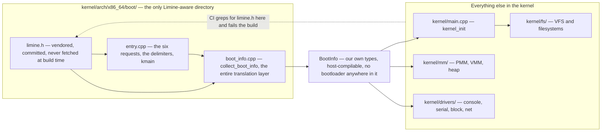

**Walking it.** `limine.h` is vendored — copied from the pinned `v8.6.0-binary` tag and
committed, because the header must not be able to drift out of step with the bootloader
binary and an offline build must still work. It feeds only `entry.cpp` and
`boot_info.cpp`. `boot_info.cpp` produces `BootInfo`, and `BootInfo` is what everything
else consumes.

The dotted arrow is the enforcement: `scripts/lint.sh` greps for the string `limine.h`
outside `boot/` and fails the build. **The grep is a proxy for the constraint, not the
constraint.** A re-export header — `kernel/include/kernel/boot.hpp` doing
`#include "limine.h"` — would satisfy the grep and defeat the rule entirely. If you find
yourself engineering around it, you have found the rule working correctly and are about to
break it.

The second payoff is testability: because `BootInfo` contains no bootloader types,
`kernel/mm/` and `kernel/fs/` compile on the *host* for Tier-1 unit tests
([[09 - Testing Strategy]]). A `limine_memmap_entry` in a PMM header would make the PMM
untestable off-target, which costs far more than the translation layer.

---

## 6. Why it is shaped this way

### Decision: which bootloader, and do we write our own?

| Option | How it works | Cost | Verdict |
|---|---|---|---|
| **A (chosen) — Limine** | Prebuilt `BOOTX64.EFI` plus BIOS stages; enters the kernel in long mode, paging on, HHDM established, stack valid | A third-party dependency, pinned at `v8.6.0-binary`; a protocol nobody else uses | ✅ |
| B — GRUB2 + Multiboot 2 | Widely known; hands you a tag stream | Enters in **32-bit protected mode** — you write the long-mode trampoline; staging GRUB EFI binaries cross-platform is painful; no SMP help | ❌ |
| C — GRUB + Multiboot 1 | The classic tutorial path | 32-bit only, legacy BIOS only, frozen info struct — wrong target entirely | ❌ |
| D — write our own | MBR, real mode, A20, protected, long mode; or a hand-written UEFI application | About a month before the first `hlt`, and **two** implementations if you want both firmware legs | ❌ |

**What breaks under B.** The kernel's first job becomes a trampoline: build a temporary
GDT, hand-build four levels of page tables in assembly, set `CR4.PAE`, load `CR3`, set
`EFER.LME`, set `CR0.PG`, far-jump to a 64-bit code segment. That is 32-bit code inside a
64-bit kernel, not debuggable with any tooling available at that point, and every mistake
in it produces the same symptom — instant reset. It teaches the format of a page-table
entry, which [[Phase 4 - Overview]] teaches properly, in C++, with a debugger attached.

**What we give up under A, stated plainly.** We will not learn real-mode programming, the
A20 gate, the 512-byte boot sector budget, BIOS `INT 13h` disk reads, the protected-mode
far jump, or the UEFI boot-services handshake. Those are real gaps — and they are gaps in
*firmware* knowledge, not *operating system* knowledge. We still build page tables, a GDT
and an IDT, and we still parse the memory map ourselves.

**When D would be right.** If boot and firmware *are* the project; if the target platform
is one no existing loader handles; if certification forbids third-party code in the boot
path. None applies. See [[ADR-0003 - Limine as the Bootloader]].

### Decision: request/response, or one fixed info struct?

| Option | How it works | Cost | Verdict |
|---|---|---|---|
| **A (chosen) — request/response** | We declare typed structs; the bootloader writes a typed pointer into each | Requests are found by scanning, so a build mistake silently yields zero requests; every response needs a null check | ✅ |
| B — Multiboot 2 tag stream | Bootloader builds a variable-length tag list; you walk it and cast each tag by its type field | Every access is a cast; alignment and bounds are your problem; the compiler checks nothing | ❌ |
| C — Multiboot 1 fixed struct | One struct at a known address plus a `flags` word where bit *N* means "field *M* is valid" | Frozen forever; forget a flag check and you read a field nobody filled in | ❌ |

**What breaks under C.** The flags word. `if (mbi->flags & (1 << 6))` before touching
`mmap_addr` is easy to skip, produces no diagnostic when skipped, and is *usually fine in
QEMU* because QEMU's firmware fills in more fields than real hardware does. That is the
exact shape of a bug that ships. A null pointer faults immediately, in the right place.

**What breaks under B.** Nothing catastrophic — it is genuinely better than C — but it
moves all type information to runtime. You cast an integer offset into a struct pointer,
hundreds of times, in the earliest and least debuggable code in the system.

**What A costs.** Two things, both real. Requests are located by scanning, so a build
mistake (missing `used`, missing `KEEP`, misspelled section) yields *zero* requests with
no diagnostic. And every response can legitimately be null, so every one needs a check —
which is why `collect_boot_info()` is so repetitive.

### Decision: one hybrid ISO, or separate BIOS and UEFI artefacts?

| Option | How it works | Cost | Verdict |
|---|---|---|---|
| **A (chosen) — one hybrid ISO** | Two El Torito entries in one catalogue, plus a protective MBR and GPT so a raw `dd` also boots | A genuinely intimidating `xorriso` command line; failures produce cryptic messages | ✅ |
| B — separate `os-bios.iso` and `os-uefi.iso` | Two simple `xorriso` calls | Two artefacts, two checksums, two download buttons, and a user who must know their own firmware type | ❌ |
| C — UEFI only | An ESP and nothing else | Fastest to build; abandons every pre-2012 machine and every VM configured for SeaBIOS | ❌ |

**What breaks under B.** It is not actually simpler where it counts — the hard part of
UEFI booting is the ESP layout, and you still have to get that exactly right. You have
just also added artefact management, a second checksum line, and a support question most
users cannot answer about their own laptop.

### Decision: ship an ISO, a GPT image, or both?

| Option | How it works | Cost | Verdict |
|---|---|---|---|
| **A (chosen) — both** | ISO for the dev loop and optical/Ventoy use; `.img` for USB, VMs and real hardware | Two build paths; the boot matrix doubles | ✅ |
| B — ISO only | One artefact, `-cdrom`, done | **Read-only root, forever.** Persistence can never be demonstrated | ❌ |
| C — image only | Closest to what ships | Building it runs `parted`, `mkfs.fat`, six `mcopy` calls, `mke2fs` and two `dd`s over 322 MiB; the ISO runs one `xorriso` | ❌ |

**What breaks under B.** Silently and late. Everything works for eight phases, then
[[Phase 10 - Overview]] arrives, you implement ext2, and there is nowhere to mount it.
Worse, you have spent those phases building a boot layout you now have to change, which
means changing the release pipeline, the boot matrix, and every instruction you have
written.

**The residual risk in A**, honestly stated: you can work all day on the ISO and only
discover a UEFI break later. The mitigation is a machine, not discipline —
`make test-boot` runs `bios/iso`, `uefi/iso` and `uefi/img` on every push
([[10 - CI Pipeline]]).

### Decision: `volatile` on the request globals

This is the one place in the kernel where [[13 - Coding Standards]] rule 3 — *"`volatile`
is for MMIO, never for concurrency"* — needs a careful reading, because what happens here
is neither.

`g_framebuffer_request.response` is initialised to `nullptr` at build time and **no code
in this program ever assigns to it.** It is written by a *different program*, which has
already exited by the time the first instruction of `kmain` runs. From the compiler's
point of view that is a global whose value is known at compile time and never modified.
Folding `request.response` to the constant `nullptr` is a completely correct optimisation
of the program as written. The optimiser is not being hostile; it is being right about a
program we lied to it about.

`volatile` means "an agent outside this program's control flow can change this object;
issue a real load every time". That is exactly and only what is true here — the same shape
as an MMIO register. What rule 3 forbids is `volatile` between two *threads of this
program*, where it gives neither atomicity nor ordering. Here there is one thread and no
ordering question: every write happened strictly before `kmain` was entered.

> [!warning] The failure mode without `volatile`
> `LIMINE_BASE_REVISION_SUPPORTED` is literally `limine_base_revision[2] == 0`. Without
> `volatile` that is a comparison of two compile-time constants — `2 == 0` — which folds
> to `false`. The kernel halts on every *successful* boot, with the "unsupported base
> revision" code in a register, on a machine where the revision was supported perfectly.

---

## 7. How this grows across the phases

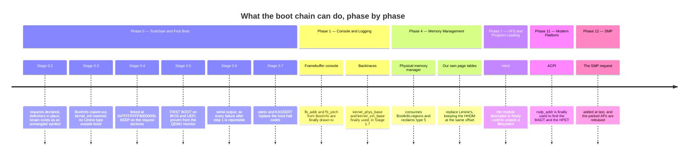

**What is deliberately missing early, and why that is acceptable.**

**The SMP request is not declared in Phase 0.** Requests that merely *report facts* cost
48 bytes and zero instructions, so all six of those go in at once — a missing one costs a
debugging session in Phase 11 where ACPI gets a null RSDP and nothing in recent history
mentions boot. But three requests in the header *change the machine you wake up on*:
`LIMINE_SMP_REQUEST` actually starts the application processors,
`LIMINE_STACK_SIZE_REQUEST` changes the stack you are handed, and
`LIMINE_PAGING_MODE_REQUEST` changes how many levels of page table Limine builds. Each
goes in during the phase ready to cope with it.

**Nothing reads `rsdp_addr`, `modules`, or the framebuffer for several phases.** They are
collected in Phase 0 anyway, because the *only* moment they are obtainable is before
Limine exits. Collecting early and using late is the correct shape; the alternative is
unobtainable.

**The boot chain itself barely changes after Phase 0.** That is the point. Firmware,
Limine, and the handoff are settled in nine stages and then remain fixed for the rest of
the project. The only later change to this area is the SMP request in
[[Phase 12 - Overview]] and the Secure Boot question in
[[Phase 15 - Overview]], which is a signing problem rather than a boot-chain problem.

---

## 8. Failure modes

Symptom first, because at 2am the symptom is all you have.

### "Limine's menu appears, then the screen goes black and QEMU reboots forever"

A **triple fault** — an exception arrived while another was being delivered, and with no
IDT the CPU gives up and asserts reset — plus a missing `-no-reboot`. Add
`-no-reboot -no-shutdown` first; that alone converts an infinite loop into a frozen
machine you can inspect. Then find the fault with `-d int,cpu_reset -D build/qemu.log`.
At this stage the causes are few: `kmain` returned (there is nothing to return *to*, so
the CPU executes whatever bytes follow), the stack pointer is invalid, or the linker
script placed a section somewhere unmapped.

> [!warning] A black screen that stays black is success in Stage 0.5
> The kernel only halts. Nothing draws to the framebuffer because nothing knows how yet.
> **The reboot is the symptom, not the blackness.** Do not "fix" a correct boot.

### "Limine's menu appears, then nothing, and `info registers` shows `RIP` in low memory"

`RIP` values like `0x7cxx`, `0xf000xxxx` or `0x10xxxx` mean the kernel was never reached —
you are still in firmware or in Limine. Check `kernel_path` in `limine.conf` against what
is actually on the artefact:

```sh
xorriso -indev build/os.iso -find /     # what is really on the ISO
mdir -i build/esp.img ::/               # what is really on the ESP
```

Almost always a confusion between the **staging path** and the **boot-volume path**.
`boot():/kernel.elf` means `/kernel.elf` *on the volume Limine booted from*, and
`mkimage.sh` makes `$STAGE` become that volume's root.

### "`RIP` is in the kernel range but changes between samples, and `HLT=0`"

Running, not halted. Either `kmain` returned into something, or the halt loop is not what
you think it is. Disassemble at `RIP` with `x /8i` and compare against
`objdump -d build/kernel.elf` around `kmain`. **Sample `info registers` twice** — a single
sample cannot distinguish "parked in the halt loop" from "passing through on the way to a
fault", and that distinction is the whole verification in
[[Stage 0.5 - Building a Bootable Image]] §6.

### "It boots fine under BIOS, but UEFI drops me at a `Shell>` prompt"

The firmware started, found no bootable application, and gave up gracefully. Three causes,
in order of likelihood:

1. `BOOTX64.EFI` is not at `/EFI/BOOT/BOOTX64.EFI`. The path is fixed by specification.
   Verify with `mdir -i build/esp.img ::/EFI/BOOT`.
2. The ESP type GUID is not set. `parted build/os.img print` must show `esp` in the Flags
   column.
3. The FAT is not valid FAT32 — usually because `ESP_MB` was reduced below about 33 and
   `mkfs.fat -F 32` could not reach the 65 525-cluster minimum.

From the shell you can diagnose directly: `fs0:`, `ls`, `ls EFI\BOOT`. **If `fs0:` does
not exist at all**, the firmware recognised no partition as an ESP, which points at cause
2 or 3 rather than cause 1.

### "The ISO boots under BIOS and under UEFI in QEMU, but not from a USB stick under BIOS"

`limine bios-install` did not run. The El Torito path never touches LBA 0, so `-cdrom`
testing cannot catch this. It fails only when the ISO is written to a stick and booted on
a BIOS machine — which is to say, on release day, on hardware.

### "Everything works, then a `hlt` loop or garbage output appears somewhere in Phase 4 or later"

The reclaimable-memory trap (§5.3). Something is still holding a pointer into a Limine
response. Search for any Limine type or Limine-derived pointer stored outside
`collect_boot_info()`'s stack frame. Remember that the *breaking* commit is in the PMM and
is correct; the *buggy* commit is in `boot_info.cpp` and has not been touched for months.

### "Zero requests were honoured — every response is null"

Build-time, and checkable before you ever boot:

```sh
x86_64-elf-objdump -h /tmp/entry.o     # .limine_requests must have non-zero size
x86_64-elf-nm       /tmp/entry.o       # must show `T kmain`, not `T _Z5kmainv`
```

`_Z5kmainv` means `extern "C"` is missing. The linker then emits a *warning* — not an
error, and `-Werror` does not apply to the linker — sets `e_entry` to whatever it put
first, and Limine jumps there. Very possibly into `.limine_requests`, executing request
magic as instructions.

### "Works perfectly in QEMU, black screen on real hardware"

QEMU is a forgiving, well-behaved, extremely simple machine. Real firmware is none of
those. In order:

- **Secure Boot.** Our Limine is unsigned; Secure Boot refuses it silently, with no
  message at all. Check this first, every time.
- **CSM / legacy mode.** Some firmware boots the stick via CSM instead of UEFI or vice
  versa. The two paths are completely different code in our image.
- **A USB writer that "helped".** Some tools unpack the ISO onto a fresh FAT partition
  instead of writing bytes, destroying the MBR, the GPT and the El Torito catalogue. Use
  `dd`, or Rufus in DD-image mode, or `os.img`, or Ventoy.
- **The resolution request.** `1280x800x32` may not exist on that panel. Limine falls
  back, so this rarely hangs, but it is worth trying `1024x768x32`.
- **No serial port.** Most laptops made after 2010 have no UART, so the diagnostic you
  lean on from [[Stage 0.6 - Serial Output]] onward is unavailable exactly where you need
  it most. This is the strongest argument for keeping one older test machine with a real
  serial header ([[11 - Release and Deployment]]).

### "I changed something and the behaviour did not change"

Check you rebuilt the artefact you booted. `make run` depends on `iso`; `make run-uefi`
depends on `img`. Editing `boot/limine.conf` and then running a stale `os.iso` is a
genuinely convincing illusion. `stage_common`'s `rm -rf "$STAGE"` protects you from a
stale staging tree; nothing protects you from booting yesterday's image.

---

## 9. Masterclass notes

> [!question] Discussion prompts
> 1. UEFI firmware contains a FAT driver but our kernel's first real filesystem is also
>    FAT32. Are those the same decision, two independent decisions that happen to agree,
>    or one decision forcing the other? What would have to be true for the kernel to skip
>    FAT32 entirely?
> 2. Limine finds our requests by scanning memory for a 128-bit magic number rather than
>    by looking up a symbol. Symbol lookup would be simpler to implement. Name two
>    concrete failures scanning avoids, and one new failure mode it introduces.
> 3. The reclaimable-memory bug does not fault, does not fail immediately, and is
>    introduced by a commit that is itself correct. Design a check — a `KASSERT`, a lint
>    rule, a test, anything — that would catch it in Phase 0 rather than Phase 4. What
>    does your check cost, and what can it not catch?
> 4. `volatile` is banned for concurrency by [[13 - Coding Standards]] rule 3 and required
>    here. State the distinction precisely enough that a reviewer could apply it to a case
>    neither of us has seen. Where is the boundary?
> 5. We ship one hybrid ISO that boots four different ways. Two of those four paths are
>    never exercised by `make run`. Is that acceptable? What would it cost to exercise all
>    four in CI, and what would you give up to pay for it?
> 6. The boot chain has no privilege boundary anywhere in it — every step runs at ring 0.
>    What does Secure Boot actually add, given that, and what does it not add?

**You understand this when you can:**

- [ ] Draw the four boot paths through `os.iso` from memory, and say which artefact and
      which QEMU invocation exercises each
- [ ] Explain why the kernel allocates the request structures and the bootloader fills
      them in, rather than the other way round
- [ ] State, without looking, what is true about the machine at the first instruction of
      `kmain` — mode, paging, interrupts, stack, GDT, IDT, APs
- [ ] Explain why `used` and `KEEP` are both required and neither is sufficient
- [ ] Explain why everything must be copied out of the Limine responses, and describe the
      three-phase delay between the mistake and the symptom
- [ ] Say why `\EFI\BOOT\BOOTX64.EFI` is spelled and capitalised exactly that way, and
      what happens if it is not
- [ ] Explain why Limine and not GRUB, and name specifically what we gave up

**Board plan** — the order to draw this, in eight steps:

1. A vertical line down the left edge. Mark three bands: **Firmware**, **Limine**,
   **Kernel**. Nothing else yet.
2. Split the Firmware band into two columns, BIOS and UEFI. Write `0x7C00` on the left
   and `\EFI\BOOT\BOOTX64.EFI` on the right. Ask the room what each firmware can read.
3. Draw both columns converging on one arrow into the Limine band. Label it
   `limine.conf`. **This convergence is the product decision** — say so out loud.
4. Inside the Limine band, four boxes: read config, load ELF, **scan for requests**, set
   up the machine. Box three gets a star.
5. Zoom into box three on a clean area: a rectangle for the kernel image with the request
   structs inside it, a separate rectangle for reclaimable memory, and arrows from
   `.response` fields into the second rectangle. **The arrows point out of the image.**
6. Draw the boundary at the bottom of the Limine band and write the state table across
   it: long mode, paging on, `IF=0`, valid stack, no usable IDT.
7. Under the Kernel band, three boxes: `kmain`, `collect_boot_info`, `kernel_init`. Draw a
   thick line after `collect_boot_info` and write the rule: *no Limine pointer survives
   this line.*
8. Finally, go back to step 5's second rectangle and cross it out. Write "Phase 4". Let
   that land before saying anything.

**Time budget:** 50 minutes — 10 on firmware, 10 on the hybrid image, 15 on
request/response, 10 on the reclaimable-memory trap, 5 on questions.

---

## 10. Related

**Stages that build this**
[[Stage 0.1 - Prove Your Toolchain Works]] ·
[[Stage 0.2 - The Limine Request Section]] ·
[[Stage 0.3 - Freestanding C++ and kmain]] ·
[[Stage 0.4 - The Linker Script and Higher-Half Layout]] ·
[[Stage 0.5 - Building a Bootable Image]] ·
[[Stage 0.6 - Serial Output]] ·
[[Stage 0.7 - Panic and KASSERT]]

**Decisions**
[[ADR-0002 - Target x86_64 Not i686]] ·
[[ADR-0003 - Limine as the Bootloader]] ·
[[ADR-0004 - Framebuffer Console Not VGA Text]] ·
[[ADR-0005 - Containerised Pinned Toolchain]] ·
[[ADR-0007 - Freestanding C++20 as the Kernel Language]] ·
[[ADR-0009 - Filesystem Strategy FAT32 then ext2]] ·
[[ADR-0010 - Testing Strategy and the QEMU Exit Device]]

**Vault context**
[[06 - Architecture Overview]] — the initialisation order this document hands off into ·
[[07 - Repository Layout]] — boundary rule 2, the `limine.h` confinement ·
[[08 - Build System]] — how `make iso`, `make img`, `make run` are wired ·
[[09 - Testing Strategy]] — the three tiers and the boot matrix ·
[[10 - CI Pipeline]] — where the boot matrix runs ·
[[11 - Release and Deployment]] — where `os.iso` and `os.img` end up ·
[[14 - Debugging Playbook]] — the general procedure §8 is a special case of ·
[[04 - Glossary]] — every term used here

**Phases that touch the boot chain later**
[[Phase 1 - Overview]] (framebuffer) ·
[[Phase 4 - Overview]] (memory map, reclaiming type 5) ·
[[Phase 7 - Overview]] (modules and the initrd) ·
[[Phase 11 - Overview]] (RSDP and ACPI) ·
[[Phase 12 - Overview]] (the SMP request) ·
[[Phase 15 - Overview]] (Secure Boot and real hardware)
