# 03 — The Address Space

> [!abstract] What this document covers
> Every address the CPU touches after paging is on is a *fictional* address, translated
> by hardware into a real one on the way to RAM. This document is the map of that
> fiction for our kernel: what lives where in the 256 TiB of addressable space, why the
> kernel occupies the top half of every process's map, why there is a 16-million-TiB
> hole in the middle that faults on touch, and why every byte of physical RAM has a
> permanent second name at `0xFFFF800000000000`.

**Zoom level:** System
**Built by:** [[Stage 0.4 - The Linker Script and Higher-Half Layout]], [[Stage 4.1 - Reading the Memory Map]], [[Stage 4.3 - Enabling Paging]]
**Prerequisites:** [[06 - Architecture Overview]] (the memory-layout diagram) · [[04 - Glossary]]
**Masterclass session:** 3 (see [[19 - The Eight-Hour Masterclass]])

---

## 1. The one-sentence version

**An address space is a lookup table, maintained by us and consulted by the CPU, that
decides which real bytes of RAM each address a program uses actually reaches — and our
table is arranged so the kernel occupies the top of every program's map while each
program gets a private bottom.**

Expanding that. When a program executes `mov rax, [0x401000]`, the number `0x401000`
is not an address in RAM. It is a **virtual address**: an index into a per-process
translation table. A piece of hardware inside the CPU called the **MMU** (Memory
Management Unit) reads that table, finds the **physical address** — a real electrical
address on the memory bus — and reissues the access there. Two different programs can
both use `0x401000` and reach two completely different physical locations, because
each has its own table. That is the whole isolation story of a modern OS in one
sentence, and it is enforced by silicon, not by convention. Our particular table is
split down the middle: the bottom half is the process's own and changes on every
context switch; the top half is the kernel's and is *identical in every table in the
system*, so a syscall or an interrupt can run kernel code without changing tables at
all.

> [!note] Terms defined here, in the order you will need them
> **Physical address** — a real address on the memory bus. RAM chip, byte number.
> **Virtual address** — the number a program (including the kernel) puts in a register.
> Meaningless until translated.
> **MMU** — the CPU hardware that performs the translation, on every single memory
> access, without being asked.
> **Page** — the unit of translation: a 4 KiB block of virtual addresses. 4096 bytes.
> **Frame** — a 4 KiB block of *physical* memory. A page maps to a frame.
> **Page table** — one 4 KiB array of 512 eight-byte entries that the MMU reads.
> **TLB** (Translation Lookaside Buffer) — a small cache inside the CPU holding
> recently-completed translations, so the MMU does not re-read the tables every time.
> **Address space** — one complete tree of page tables; equivalently, one map.
> **Canonical address** — a 64-bit value the hardware is willing to translate at all.
> **HHDM** (Higher-Half Direct Map) — our permanent mapping of *all* physical RAM into
> the kernel half, so any frame can be reached by adding a constant.

---

## 2. The picture

This is the map. Addresses increase upward, which is how every OS memory diagram in
the world is drawn and how [[06 - Architecture Overview]] draws it. Read it top to
bottom.

```mermaid
flowchart TD
    subgraph AS["ONE ADDRESS SPACE - 48 significant bits, 256 TiB canonical"]
        direction TB
        subgraph UPPER["UPPER HALF - kernel - identical in every address space"]
            direction TB
            subgraph KTOP["Top 512 GiB - one PML4 entry, number 511"]
                direction TB
                KIMG["0xFFFFFFFF80000000<br/>KERNEL IMAGE - 2 GiB window<br/>.text .rodata .data .bss + boot stack"]
                KHEAP["0xFFFFFFFF00000000<br/>KERNEL HEAP - 2 GiB window, grows up"]
            end
            KGAP["UNASSIGNED - roughly 112 TiB<br/>reserved address space, nothing mapped"]
            PERCPU["0xFFFF900000000000<br/>PER-CPU AREAS - one block per logical CPU"]
            HHDM["0xFFFF800000000000<br/>HHDM - direct map of ALL physical RAM<br/>16 TiB of window"]
        end
        HOLE["NON-CANONICAL HOLE<br/>0x0000800000000000 through 0xFFFF7FFFFFFFFFFF<br/>not memory - the hardware refuses these values"]
        subgraph LOWER["LOWER HALF - user - replaced on every process switch"]
            direction TB
            UCEIL["0x00007FFFFFFFFFFF - highest legal user address"]
            USTACK["0x0000700000000000<br/>USER STACK - grows down"]
            UMMAP["MMAP REGION - grows up toward the stack"]
            UTEXT["0x0000000000400000<br/>USER PROGRAM - .text .rodata .data .bss, then brk heap"]
            NULLG["0x0000000000000000 through 0x00000000003FFFFF<br/>FIRST 4 MiB - deliberately never mapped"]
        end
    end
    subgraph PHYS["PHYSICAL RAM - what the DIMMs actually contain"]
        FRAMES["4 KiB frames, catalogued by the PMM"]
    end
    HHDM ==>|"every frame, permanently, one arithmetic step"| FRAMES
    KIMG ==>|"the frames Limine loaded the kernel image into"| FRAMES
    KHEAP ==>|"frames the PMM hands to the heap on demand"| FRAMES
    PERCPU ==>|"one frame set per CPU, allocated in Phase 12"| FRAMES
    UTEXT ==>|"frames the ELF loader maps for this process only"| FRAMES
    USTACK ==>|"frames mapped with the USER bit set"| FRAMES
```

### Walking every box

**`AS` — one address space.** The outer box is *one* map. There is one of these per
process, plus one the kernel boots with. Its size is 256 TiB, not 16 EiB, because
x86-64 in 4-level paging mode only translates 48 of the 64 address bits. §3.3 explains
what happens to the other 16.

**`UPPER` — the upper half.** 128 TiB, from `0xFFFF800000000000` to the top. This half
is the kernel's, and — this is the single most important property on the page — the
page-table entries describing it are **the same in every address space in the system**.
Process A's map and process B's map differ entirely below the hole and are byte-for-byte
identical above it. Built across [[Stage 0.4 - The Linker Script and Higher-Half Layout]]
(where the kernel image is *linked* into this half) and [[Stage 4.3 - Enabling Paging]]
(where we build the tables that put it there).

**`KTOP` — the top 512 GiB.** This is one entry in the topmost page table, number 511
of 512. Everything the compiler emits addresses lives inside it. It is a distinct box
because it is a distinct *hardware* unit: a single top-level entry, which makes several
later arguments (sharing, pre-population, TLB behaviour) much simpler.

**`KIMG` — the kernel image, at `0xFFFFFFFF80000000`.** The top 2 GiB. The kernel's
machine code, its constants, its globals, and its boot stack. This address is not a
preference; it is the lowest address a sign-extended 32-bit displacement can reach, which
is what `-mcmodel=kernel` compiles for. [[Stage 0.4 - The Linker Script and Higher-Half Layout]]
derives that in full and this document does not repeat the derivation.

**`KHEAP` — the kernel heap, at `0xFFFFFFFF00000000`.** The 2 GiB immediately below the
image. `kmalloc` hands out bytes from here. It grows upward toward the image and stops
there. Built in [[Stage 4.4 - The Kernel Heap]].

**`KGAP` — the unassigned middle.** Between the top of the per-CPU region and the bottom
of the heap sits roughly 112 TiB with nothing in it. This is not waste. Address space is
free — it costs nothing until a page table describes it — and leaving a large, obviously
empty gap means every future region (a `vmalloc`-style area for non-contiguous kernel
allocations, an MMIO window, a KASAN shadow) gets somewhere to go without renumbering
anything that already exists. Renumbering an address-space constant after Phase 4 means
re-verifying every consumer of it.

**`PERCPU` — per-CPU areas, at `0xFFFF900000000000`.** One block per logical CPU,
holding the things that must not be shared: this CPU's current task pointer, its idle
stack, its scheduler run queue head. Reserved from the start, populated in
[[Phase 12 - Overview|Phase 12]] when secondary CPUs come up. Before then there is one
block and it belongs to the bootstrap processor.

**`HHDM` — the direct map, at `0xFFFF800000000000`.** Every byte of physical RAM,
mapped once, permanently, in ascending order. Physical address `P` is readable at
virtual address `P + 0xFFFF800000000000`. This is the region that makes writing a
memory manager tractable, and §3.6 is entirely about why. 16 TiB of window sits below
the per-CPU base, which comfortably exceeds any RAM this system will meet.

**`HOLE` — the non-canonical hole.** From `0x0000800000000000` to `0xFFFF7FFFFFFFFFFF`
inclusive. These are not unmapped addresses; they are *illegal values*. The CPU rejects
them before it consults any page table, and the fault it raises is a general protection
fault (vector 13), not a page fault (vector 14). §3.3 explains why the hardware is built
this way and why the hole is a feature.

**`LOWER` — the lower half.** 128 TiB, from `0x0` to `0x00007FFFFFFFFFFF`. This is the
process's own. It is described by the bottom 256 entries of the top-level table, and
those entries are what a context switch replaces.

**`UCEIL` — the ceiling.** `0x00007FFFFFFFFFFF` is the highest address a user program may
name. Every user-supplied pointer that crosses into the kernel is checked against it
before it is dereferenced ([[06 - Architecture Overview]] calls this the single most
security-critical check in the tree).

**`USTACK` — the user stack, at `0x0000700000000000`, growing down.** Placed high and
far from everything else so it has room to grow and so an overflow crosses a large empty
region rather than landing on the program's own data.

**`UMMAP` — the mmap region.** Where the loader puts shared libraries and where anonymous
`mmap` allocations go. It grows upward toward the stack, and the empty space between them
is the budget for both.

**`UTEXT` — the program image, at `0x0000000000400000`.** 4 MiB. The ELF loader in
[[Phase 7 - Overview|Phase 7]] places the executable's segments here with the same
per-section permissions the kernel gives itself: text `R X`, rodata `R`, data `RW NX`.

**`NULLG` — the first 4 MiB, unmapped.** Nothing is ever mapped below `0x400000`. A
null-pointer dereference therefore faults instead of silently reading whatever happened
to be at address zero. Because the guard is 4 MiB rather than one page, `p->field` on a
null `p` also faults for any struct offset up to 4 MiB, which covers essentially every
real struct.

**`PHYS` / `FRAMES` — physical RAM.** Outside the address space entirely, because it is
not addressed by anything the CPU executes after paging is on. The PMM in
[[Stage 4.2 - The Physical Frame Allocator]] owns the catalogue of which frames are free,
built from the memory map read in [[Stage 4.1 - Reading the Memory Map]].

### Walking every arrow

Every arrow in the diagram means the same thing — *this virtual region is backed by
physical frames* — and the differences between them are the whole design.

- **`HHDM ==> FRAMES`, "every frame, permanently, one arithmetic step."** Unconditional
  and total. Every frame is reachable here at all times, with no allocation, no locking,
  and no page-table modification. The mapping is set up once in
  [[Stage 4.3 - Enabling Paging]] and never changes.
- **`KIMG ==> FRAMES`, "the frames Limine loaded the kernel image into."** Fixed at boot.
  The bootloader chose a physical location for the kernel and mapped the image's segments
  there; we rebuild the same relationship in our own tables. These frames are marked
  reserved in the PMM using `__kernel_start` and `__kernel_end` from the linker script, so
  the allocator can never hand out a page the kernel is running from.
- **`KHEAP ==> FRAMES`, "on demand."** Sparse and growing. Only the part of the 2 GiB
  window that `kmalloc` has actually needed is backed; the rest has no page-table entry at
  all and faults if touched.
- **`PERCPU ==> FRAMES`, "one frame set per CPU."** Sparse and fixed after Phase 12
  brings the CPUs up.
- **`UTEXT ==> FRAMES` and `USTACK ==> FRAMES`, "for this process only", "with the USER
  bit set."** These are the arrows that are *different per address space*. The USER bit
  note matters: a page-table entry has a bit that says "ring 3 may touch this". Kernel
  pages leave it clear, so a user program that guesses a kernel address gets a page fault
  from the hardware rather than a read.

Notice what the arrows imply together: **the same physical frame can be at the end of
several arrows at once.** A frame holding part of the kernel heap is reachable both
through the heap's virtual address and through the HHDM. That is deliberate and it is
covered in §3.6.

> [!warning] The map is a contract, not a suggestion
> Every constant in this diagram appears in code, in the linker script, and in assertions.
> Changing one after Phase 4 is not an edit; it is a migration. The PMM reserves ranges
> using them, the VMM maps using them, `phys_to_virt` adds one of them, the user-pointer
> validator compares against one of them, and the backtrace symboliser classifies
> addresses by which range they fall in. Pick them once, write them down here, and treat
> this document as the authority.

---

## 3. Zooming in

### 3.1 What the MMU actually does, and why a TLB exists

Before the map, the mechanism. Every memory access — every instruction fetch, every
`mov`, every `push`, every stack access the CPU makes on your behalf during an interrupt
— goes through this.

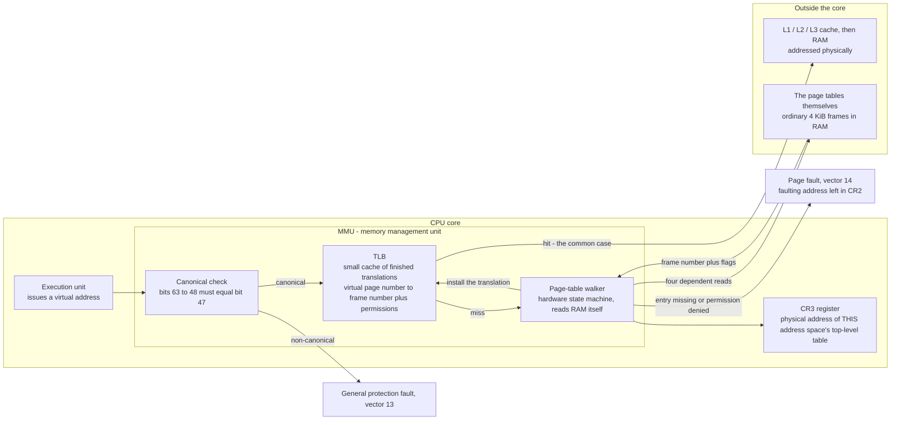

**Walkthrough.** `EXEC` issues a virtual address. Before anything else, `CANON` checks
whether the value is even legal (§3.3); an illegal one raises `GP` immediately and **no
page table is consulted and CR2 is not written** — a detail that catches people at 2am.
A legal address goes to the `TLB`, a small fully-associative cache holding perhaps a few
hundred recent translations. On a **hit**, the physical frame number and permission bits
come straight out of the cache and the access proceeds to `CACHE` — this is the common
case and it costs essentially nothing.

On a **miss**, the `WALK` hardware takes over. It reads `CR3R` to find the physical
address of the top-level table for the current address space, then performs **four
dependent memory reads** — each one's result is the address of the next — to reach the
final entry. Those reads go to `TABLES`, which are just ordinary frames of RAM; the walker
has no special channel and its reads hit the same caches everything else does. When it
finishes it installs the result into the `TLB` so the next access to that page is free.
If any level's entry is marked not-present, or the permissions in the entries forbid what
the instruction was trying to do, the walk aborts into `PF` — a page fault, vector 14,
with the offending virtual address deposited in `CR2` and a bitfield describing the
failure pushed as the error code. That handler already exists by the time paging is turned
on, from [[Stage 2.5 - CPU Exception Handlers]]; this is exactly why Phase 4 comes after
Phase 2 in the initialisation order.

**Why four reads and not one.** A flat array mapping every 4 KiB page in a 48-bit space
would need 2^36 entries of 8 bytes each: 512 GiB of table, per process, to describe 256 TiB
of space that is almost entirely empty. The four-level tree makes the table proportional
to what is actually *mapped* rather than to what is *addressable*. A process using 8 MiB of
memory needs a handful of 4 KiB tables, not half a terabyte. The cost is that a TLB miss
now costs four dependent RAM accesses instead of one — which is precisely why the TLB
exists, and why TLB behaviour on a context switch (§5.3) is a real performance concern
rather than a footnote.

> [!question] Check your understanding
> The page-table walker reads the page tables through **physical** addresses. Why must it?
> What would be circular about the alternative?

### 3.2 The virtual address, taken apart

A 4 KiB page means the bottom 12 bits of an address select a byte within the page and are
never translated. The remaining 36 significant bits are chopped into four 9-bit indices,
one per level. Nine bits is 512, and 512 entries of 8 bytes is exactly 4096 bytes — one
page. The whole structure falls out of that arithmetic.

| Bits | Field | Selects | One entry covers |
|---|---|---|---|
| 63:48 | sign extension | nothing — must equal bit 47 | — |
| 47:39 | PML4 index | 1 of 512 entries in the PML4 | 512 GiB |
| 38:30 | PDPT index | 1 of 512 entries in a PDPT | 1 GiB |
| 29:21 | PD index | 1 of 512 entries in a PD | 2 MiB |
| 20:12 | PT index | 1 of 512 entries in a PT | 4 KiB |
| 11:0 | byte offset | 1 of 4096 bytes in the frame | 1 byte |

The four table names, expanded once: **PML4** is the Page Map Level 4 (the root),
**PDPT** the Page Directory Pointer Table, **PD** the Page Directory, **PT** the Page
Table. They are structurally identical — 512 eight-byte entries — and differ only in what
their entries point at.

```mermaid
flowchart LR
    subgraph CPUB["CPU"]
        CR3["CR3<br/>bits 51 to 12 hold the physical address of the PML4"]
    end
    subgraph RAMB["Physical RAM"]
        direction TB
        subgraph TREE["The page-table tree for one address space"]
            direction TB
            PML4["PML4 - 4 KiB, 512 entries<br/>indexed by bits 47:39"]
            PDPT["PDPT - 4 KiB, 512 entries<br/>indexed by bits 38:30"]
            PD["PD - 4 KiB, 512 entries<br/>indexed by bits 29:21"]
            PT["PT - 4 KiB, 512 entries<br/>indexed by bits 20:12"]
        end
        FRAME["The target 4 KiB frame<br/>byte chosen by bits 11:0"]
    end
    CR3 -->|"physical address"| PML4
    PML4 -->|"entry holds the physical address of a PDPT"| PDPT
    PDPT -->|"entry holds the physical address of a PD"| PD
    PD -->|"entry holds the physical address of a PT"| PT
    PT -->|"entry holds the physical address of the frame, plus permissions"| FRAME
```

**Walkthrough.** `CR3` is a control register holding a *physical* address — the root of
the tree. Writing `CR3` is how you switch address spaces, and it is the only thing a
context switch does to memory mapping. From there the walk is mechanical: bits 47:39 of
the virtual address index the `PML4`; that entry's upper bits are the physical address of
a `PDPT`; bits 38:30 index that; and so on down to the `PT`, whose entry finally names the
frame and carries the permission bits that decide whether this particular access is
allowed. Bits 11:0 pick the byte. Note that **every arrow is a physical address**: page
tables never contain virtual addresses, which is the reason the HHDM in §3.6 matters so
much.

> [!example] Translating `0xFFFFFFFF80001000` by hand
> This is `__text_start` in a real link of our kernel — the first byte of `.text`, taken
> straight from the `nm` output in [[Stage 0.4 - The Linker Script and Higher-Half Layout]].
>
> | Step | Computation | Result |
> |---|---|---|
> | Canonical? | bits 63:48 are `0xFFFF`, bit 47 is 1 | legal, upper half |
> | PML4 index | bits 47:39 | **511** |
> | PDPT index | bits 38:30 | **510** |
> | PD index | bits 29:21 | **0** |
> | PT index | bits 20:12 | **1** |
> | Byte offset | bits 11:0 | **0** |
>
> So the first instruction of the kernel is found at `PML4[511] → PDPT[510] → PD[0] →
> PT[1]`, byte 0. Four reads, then the instruction fetch. Do this once by hand and the
> layout constants stop being magic numbers.
>
> Two consequences worth noticing. **PDPT index 510** — the kernel image occupies PDPT
> entries 510 and 511 (2 GiB, two 1 GiB entries). And the kernel heap at
> `0xFFFFFFFF00000000` works out to PDPT entries **508 and 509**. The heap and the image
> are neighbours in the same PDPT, which is why "the heap grows up and stops at the
> image" is a bounds check on two numbers rather than a data structure.

### 3.3 The non-canonical hole, and why it is a feature

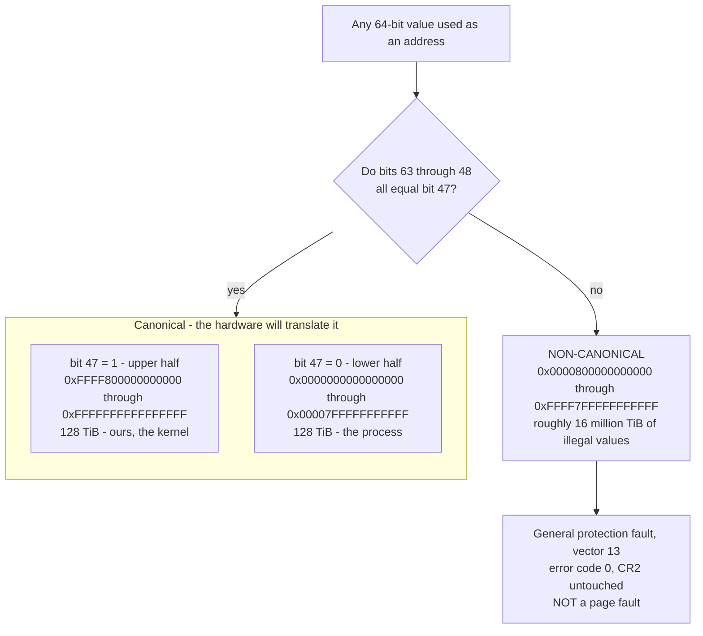

**Walkthrough.** `VAL` is any 64-bit number about to be used as an address. `CHK` is a
hardware comparison performed before translation: the top 16 bits must be a **sign
extension** of bit 47 — all ones if bit 47 is one, all zeros if it is zero. If they are,
the value falls into `OK`, and specifically into `HIGHR` or `LOWR` depending on bit 47.
If they are not, it is `BAD`, and using it produces `GPF`.

**Why the hardware is built this way.** Current x86-64 parts translate 48 address bits.
They could simply have ignored bits 63:48, treating `0x0000000000401000` and
`0xDEAD000000401000` as the same address. That would have been a disaster, because
software would immediately have started *using* those free bits — tagged pointers, type
bits, reference counts stuffed into the top byte. Then the day a CPU shipped that
translated 57 bits (which exists: 5-level paging, LA57), every one of those programs would
break, and break in a way that is essentially impossible to fix at scale.

Requiring sign extension makes that impossible up front. Any program stashing data in the
top bits faults *today*, on the first access, on the developer's machine. The hole is a
**forward-compatibility interlock enforced in silicon**, and it works: when 5-level paging
arrived, the canonical boundary simply moved from bit 47 to bit 56, the hole shrank, and
correctly-written 4-level software kept running unchanged.

**Why it is convenient for us.** Sign extension is exactly what makes the "upper half"
and "lower half" split natural. The two canonical ranges are already separated by an
unbridgeable gap, so "kernel above, user below" needs no additional boundary constant —
the hardware drew the line. It also means a corrupted pointer is far more likely to be
non-canonical (and fault loudly and immediately) than to be a valid address in the wrong
half.

> [!warning] The symptom that wastes an hour
> You dereference a garbage pointer and expect a page fault with a useful `CR2`. You get
> `#GP` (vector 13) with error code 0 and `CR2` holding a stale value from some earlier
> fault. The canonical check runs **before** translation, so no faulting address is ever
> recorded. Your only evidence is the saved `RIP` and the register dump. This is why the
> exception handler from [[Stage 2.5 - CPU Exception Handlers]] must dump general-purpose
> registers and not just `CR2` — see [[14 - Debugging Playbook]].

### 3.4 Zoom: the kernel half

```mermaid
flowchart TD
    subgraph UH["UPPER HALF - PML4 entries 256 through 511 - 128 TiB"]
        direction TB
        subgraph E511["PML4 entry 511 - the top 512 GiB - everything the compiler addresses"]
            direction TB
            subgraph IMGSEG["PDPT entries 510 and 511 - kernel image - 2 GiB window"]
                direction TB
                STK["boot stack, 64 KiB<br/>guard page below it, left unmapped in Phase 4"]
                BSS["__bss_start to __bss_end - RW, NX"]
                DAT["__data_start to __data_end - RW, NX<br/>includes .init_array"]
                RO["__rodata_start to __rodata_end - R only"]
                TXT["__text_start to __text_end - R X, never writable"]
                REQ["0xFFFFFFFF80000000 - .limine_requests - RW"]
            end
            HEAPSEG["PDPT entries 508 and 509 - kernel heap<br/>0xFFFFFFFF00000000, 2 GiB, sparsely backed, grows up"]
        end
        GAPE["PML4 entries 289 through 510<br/>unassigned - reserved for future regions"]
        PCPU["PML4 entry 288 onward - per-CPU areas<br/>0xFFFF900000000000"]
        subgraph HHDMSEG["PML4 entries 256 through 287 - HHDM - 16 TiB"]
            direction TB
            HALL["Every physical frame, in physical order<br/>virtual = physical + 0xFFFF800000000000"]
            HMMIO["Device MMIO regions the firmware reported<br/>reachable by the same arithmetic"]
        end
    end
```

**Walkthrough, top down.** `UH` is the whole upper half: PML4 entries 256 through 511,
which is 256 entries of 512 GiB each — 128 TiB.

`E511` is the single topmost entry, and it is where the kernel's own code and data live.
Inside it, `IMGSEG` is the kernel image occupying the top 2 GiB via PDPT entries 510 and
511. The boxes inside `IMGSEG` are the linker script's output, in ascending address order:
`REQ` (the Limine request structs, first at the base address, RW because the bootloader
writes response pointers into them), `TXT` (executable, never writable), `RO`
(read-only, no write, no execute), `DAT` and `BSS` (writable, never executable), and `STK`
(the boot stack with a guard page below it). Each boundary is 4 KiB-aligned precisely so
that the page-table entries covering it can carry different permissions — permissions have
page granularity, so a boundary that is not page-aligned cannot be a permission boundary.
[[Stage 0.4 - The Linker Script and Higher-Half Layout]] produces this layout and exports
each `__*_start` / `__*_end` symbol; [[Stage 4.3 - Enabling Paging]] is where those symbols
turn into actual page-table permissions, and [[Phase 15 - Overview|Phase 15]] is where
W^X is enforced and audited.

`HEAPSEG` is the kernel heap in PDPT entries 508 and 509 — same PML4 entry, adjacent
window, 2 GiB, and *sparsely backed*: only the pages `kmalloc` has needed exist.

`GAPE` is the unassigned span, PML4 entries 289 through 510. Nothing maps here and nothing
is meant to. It exists so that new regions can be added without moving old ones.

`PCPU` is PML4 entry 288 — `0xFFFF900000000000` — the per-CPU areas.

`HHDMSEG` is PML4 entries 256 through 287, 32 entries of 512 GiB, giving a 16 TiB window
starting at `0xFFFF800000000000`. `HALL` is the point of it: every physical frame appears
here at `physical + 0xFFFF800000000000`, in physical order, with no gaps in the arithmetic
even where there are gaps in the RAM. `HMMIO` notes that the same arithmetic reaches
device MMIO regions — the framebuffer, the local APIC, the MMCONFIG window — provided the
HHDM was built to cover them, which is a real consideration on hardware where MMIO sits
far above the top of RAM.

> [!warning] The HHDM does not automatically cover everything
> The HHDM covers what you built it to cover. If you map only the regions the memory map
> marked usable, then the framebuffer, ACPI tables, and MMCONFIG window — all of which
> live in *reserved* or *unreported* physical ranges — are not reachable through it. The
> symptom is a kernel that boots fine in QEMU with 128 MiB and page-faults on real
> hardware the first time it touches a device. Decide explicitly in
> [[Stage 4.3 - Enabling Paging]] what the HHDM spans, and assert it.

### 3.5 Zoom: the user half

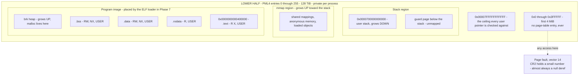

**Walkthrough.** `LH` is PML4 entries 0 through 255. These entries — and only these — are
what a context switch replaces.

`CEIL` is the top. Every pointer a user program passes into a syscall is validated against
three things before the kernel dereferences it: it must be canonical, it must be below this
ceiling, and it must be mapped in the calling process's address space. Skipping any one of
those turns a syscall into an arbitrary kernel read or write.

`STKZ` holds `USP`, the stack at `0x0000700000000000` growing downward, and `SGRD`, an
unmapped page beneath it so that stack overflow faults immediately instead of silently
corrupting whatever is below. Note the symmetry with the kernel boot stack's guard page in
§3.4 — same idea, same reason, different half.

`MMZ` is the mmap region, growing upward. The large empty span between `MMZ` and `STKZ` is
the shared growth budget: whichever grows more, gets more, and they collide only when the
process is genuinely out of address space.

`PROG` is the loaded executable, and its internal boxes mirror the kernel image's exactly:
`UTX` at `0x400000` executable and read-only, `URO` read-only, `UDAT` and `UBSS` writable
and non-executable, then `BRK` — the classic Unix heap — growing up from the end of the
image. Every one of these has the **USER bit** set in its page-table entries, which is the
one-bit difference between "ring 3 may touch this" and "ring 3 gets a fault". The kernel's
pages leave it clear.

`NUL` is the first 4 MiB, and the dotted arrow to `FAULT` is the entire reason it exists.
Any access — read, write, or instruction fetch — produces a page fault with a small number
in `CR2`. When you see `CR2 = 0x0000000000000018` in a panic, you are looking at a null
pointer with a struct offset of 24, and you have learned more in one line than a silent
read of address zero would ever have told you.

> [!question] Check your understanding
> Why 4 MiB of guard rather than a single 4 KiB page? What class of bug does the extra
> 1023 pages catch, and roughly what does it cost?

### 3.6 The HHDM, and why it beats temporary mappings

Here is the problem the HHDM solves. To create a mapping, the VMM must *write a page-table
entry*. A page table is a 4 KiB frame in physical memory. But after paging is enabled, the
kernel cannot address physical memory — every address it uses is virtual. So to write a
page table, the kernel needs a virtual address for that table's frame, which means it needs
a mapping, which means it needs to write a page-table entry. That is the circularity, and
every kernel has to break it somehow.

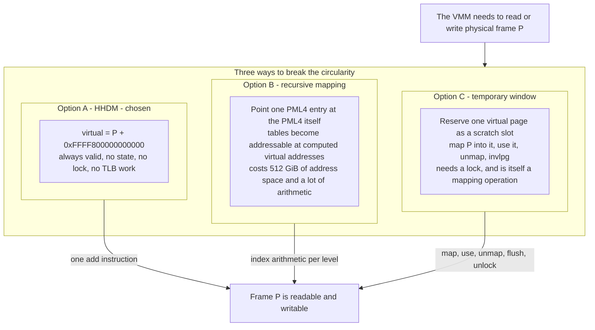

**Walkthrough.** `NEED` is the requirement. `OPTS` holds the three standard answers.

`A`, the HHDM, is what we use: because every frame is *permanently* mapped at a fixed
offset, `phys_to_virt(P)` is `P + hhdm_offset` — one addition, no state, no lock, nothing
that can fail. The reverse, `virt_to_phys(V)`, is `V - hhdm_offset` for any address inside
the HHDM window. The edge from `A` to `DONE` is labelled "one add instruction" because that
is literally what it compiles to.

`B`, recursive mapping, is the classic trick: point one PML4 entry back at the PML4's own
physical address, and the tables become reachable at virtual addresses you can compute from
the target address. It costs one PML4 entry — 512 GiB of address space — and it produces
index arithmetic that is genuinely hard to get right and harder to debug. Its advantage is
that it does not require mapping all of RAM, which matters on 32-bit systems where address
space is scarce. On 64-bit it does not.

`C`, a temporary window, is what you must do when neither of the others is available: keep
one reserved virtual page, map the target frame into it, use it, unmap it, and `invlpg`.
Every access costs a page-table write and a TLB invalidation, and because the window is a
single shared resource it needs a lock — a lock taken on the memory-management path, which
is exactly where you least want one. Worse, it is self-referential: manipulating the window
is itself a mapping operation.

**Why A wins here.** We have 128 TiB of kernel address space and, at most, a few hundred
gigabytes of RAM. Spending 16 TiB of *free* address space to make `phys_to_virt` a single
addition is not a trade, it is a giveaway. It also removes an entire class of bug — the
"forgot to unmap the temporary window" and "two CPUs raced on the scratch slot" families —
before they can exist.

**What it costs, honestly.** All of physical memory is writable through kernel-mode virtual
addresses at all times. A wild kernel pointer can therefore corrupt anything, including page
tables. In a system with a security model, this is a real weakness — Linux maps its direct
map non-executable, and hardened kernels go further. Our answer for v1 is that the kernel is
already fully trusted and the mitigations belong in [[Phase 15 - Overview|Phase 15]]; the
one thing worth doing early is ensuring the HHDM is mapped **NX**, so that even if an
attacker gets a write primitive, the direct map is not a place they can execute from.

### 3.7 One frame, several names

A direct consequence of the HHDM that surprises people the first time.

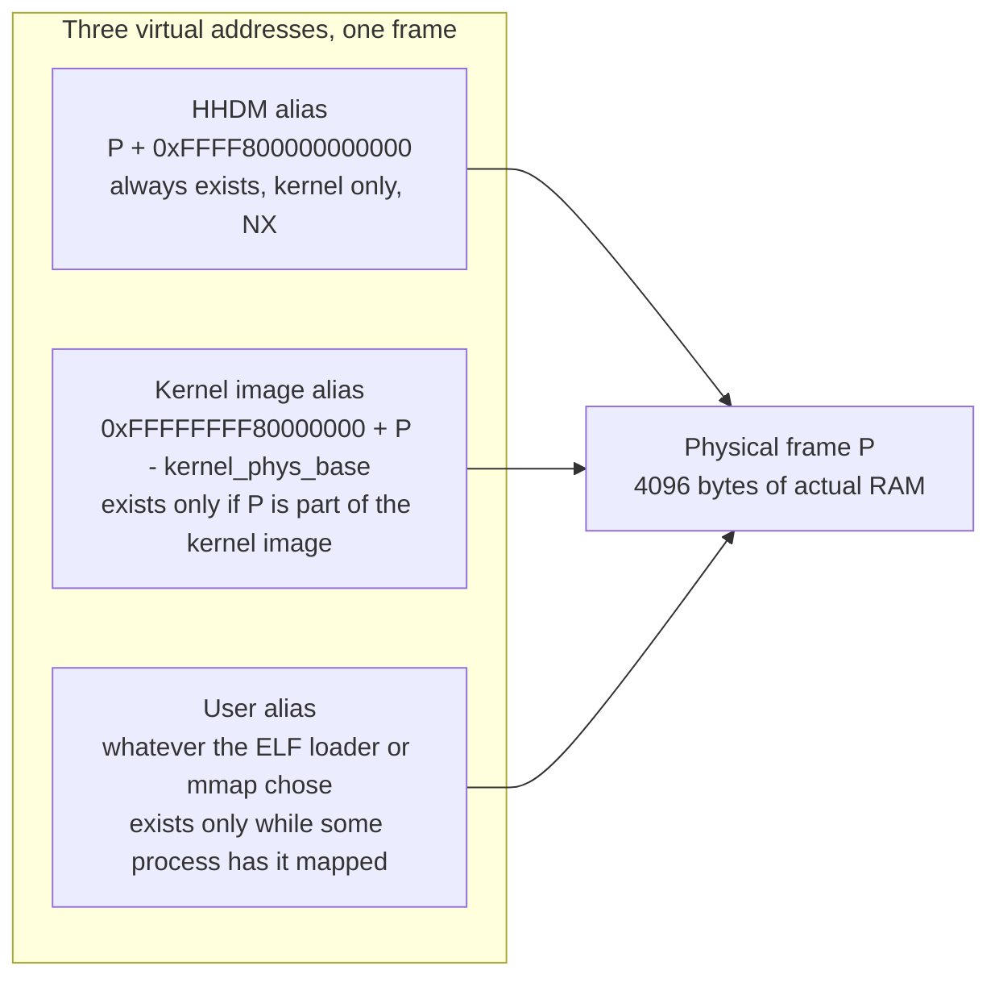

**Walkthrough.** `F` is one frame. `VH` is its HHDM alias, which exists from the moment the
HHDM is built until the machine powers off. `VK` is the alias it has if it happens to be
part of the kernel image — note the arithmetic differs from the HHDM's, because the kernel
image is mapped at a virtual base unrelated to its physical base, and `kernel_phys_base`
comes from the boot information copied out of Limine. `VU` is a user alias, present only
while some process has that frame mapped, and carrying the USER bit which neither of the
others does.

**Three things follow.**

1. **Permissions are per-mapping, not per-frame.** The same frame can be read-only through
   one alias and writable through another. That is a feature when you want it (copy-on-write
   in [[Phase 13 - Overview|Phase 13]] depends on it) and a hazard when you forget it: making
   `.rodata` read-only in the kernel image mapping does nothing if the same frame is still
   writable through the HHDM alias. Real kernels have shipped this bug.
2. **Aliasing is safe on x86-64.** The data caches are physically indexed and physically
   tagged, so two virtual addresses for one frame automatically see the same data with no
   flushing. On architectures with virtually-indexed caches this is a whole discipline
   ("cache aliasing"); here it is free, and it is one of the reasons the HHDM design is so
   comfortable on this target.
3. **`virt_to_phys` is not universal.** Subtracting the HHDM offset only works for addresses
   *inside* the HHDM. Do it to a kernel image address or a heap address and you get a
   plausible-looking, completely wrong physical address. This is the single most common
   HHDM bug; assert the input range.

> [!warning] `virt_to_phys` on the wrong kind of pointer
> `virt_to_phys(some_kmalloc_pointer)` compiles, runs, and returns garbage — a number that
> looks like a physical address and is not. If you then hand it to a device as a DMA target,
> the device writes to a random frame. There is no fault, no warning, and the corruption
> surfaces somewhere unrelated. Make `virt_to_phys` `KASSERT` that its argument is within
> `[hhdm_base, hhdm_base + ram_size)`, and give heap and image addresses a different,
> table-walking conversion path.

### 3.8 Two processes, one kernel

This is the payoff of the whole layout.

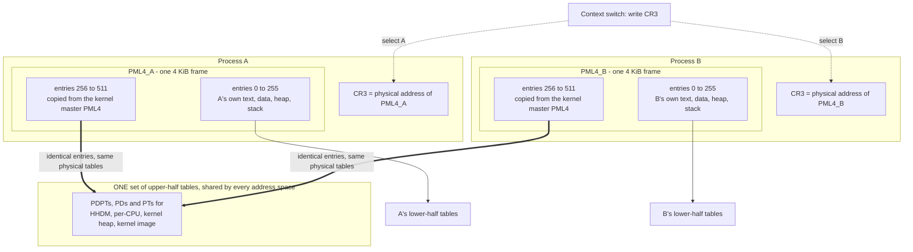

**Walkthrough.** `PA` and `PB` are two processes. Each has its own `PML4` — `M4A` and
`M4B` — a single 4 KiB frame containing 512 entries. Each PML4's **lower** 256 entries
(`ALO`, `BLO`) point at that process's own tables (`ALOT`, `BLOT`), which describe
completely different physical memory. Each PML4's **upper** 256 entries (`AHI`, `BHI`) are
*byte-for-byte identical* and point at `KT` — the same physical PDPTs, PDs and PTs. There is
exactly one copy of the kernel's page tables in the system, referenced from every PML4.

`SWITCH` is the context switch, and the dotted arrows say what it does: write a different
physical address into `CR3`. That is all. The upper half does not change because both PML4s
name the same upper-half tables.

**Why this matters — the argument in full.** When a user program executes `syscall`, the CPU
loads `RIP` from the `LSTAR` MSR and switches to ring 0. It does **not** touch `CR3`. When an
interrupt arrives, the CPU looks up the vector in the IDT, pushes `SS`, `RSP`, `RFLAGS`, `CS`
and `RIP` (five qwords, always, in 64-bit mode) onto the stack found via the TSS or an IST
slot, and jumps to the handler. It does **not** touch `CR3` either. In both cases the kernel's
code, its stack, and its IDT must already be mapped and valid *in whatever address space
happened to be current at that instant*. There is no opportunity to switch tables first —
the CPU is already executing kernel code before any of your instructions run.

If the kernel were not mapped in the current address space, the instruction fetch at the
handler's address would page-fault; the page-fault handler is also unmapped, so that fault
would escalate to a double fault; the double-fault handler is unmapped too, so that becomes
a triple fault, and the machine resets. Instantly, with no diagnostic. **The kernel being
present in every address space is not an optimisation. It is what makes traps possible at
all** without an architecturally-provided table switch, which x86-64 does not have.

The performance argument is the secondary one, and it is still large: a `CR3` write flushes
every non-global TLB entry, and re-walking the tables afterwards costs four dependent memory
accesses per page touched. Paying that on every syscall and every timer tick would be a
significant, permanent tax on the hottest path in the system.

> [!warning] The trap in sharing the upper half
> Copying entries 256–511 into a new PML4 shares the *tables those entries point at*, so any
> mapping change **below** the PML4 level is instantly visible to every address space. But if
> the kernel ever needs a **new PML4 entry** — a region that did not previously exist at all —
> that entry is added to whichever PML4 is current, and every other address space misses it.
> The symptom is spectacular: a kernel address that works in one process and page-faults in
> another, apparently at random.
> **The fix is structural.** At boot, pre-populate all 256 upper PML4 entries with empty
> next-level tables, before any process is created. The top level then never changes again,
> and sharing is total. Do this in [[Stage 4.3 - Enabling Paging]], not later.

> [!note] The one reason a real kernel would break this rule
> Meltdown. On affected CPUs, speculative execution could leak the contents of kernel pages
> mapped into a user address space even though the permission bits forbade access. The
> mitigation (KPTI) does exactly what this section argues against: it unmaps almost all of the
> kernel from user address spaces, keeps a tiny trampoline mapped, and switches `CR3` on every
> entry and exit. It costs real, measurable performance. We do not implement it in v1; it is a
> [[Phase 15 - Overview|Phase 15]] conversation about real hardware.

---

## 4. The data structures

Two kinds of structure appear here, and it is worth keeping them straight. The **page-table
entry**, `CR3`, and the **page-fault error code** are defined by the hardware — those layouts
are fixed and you must match them bit for bit. The software structures that manage address
spaces are ours, and the shapes below are architectural intent; the exact names and fields are
settled in the Phase 4 stage notes.

### 4.1 The page-table entry — hardware-defined, 64 bits

Every entry at every level has this shape. The differences between levels are noted.

| Bit | Name | Meaning | Notes |
|---|---|---|---|
| 0 | **P** — Present | 0 means the entry is invalid; the walk aborts into a page fault | When P is 0, the CPU ignores every other bit — the OS may use them freely (swap slots, and similar) |
| 1 | **R/W** — Writable | 0 means read-only | Restrictions are cumulative down the walk: read-only at any level makes the page read-only |
| 2 | **U/S** — User | 1 means ring 3 may access | Clear on every kernel page. Also cumulative |
| 3 | **PWT** — Write-through | Cache policy | Matters for MMIO |
| 4 | **PCD** — Cache disable | Cache policy | Set for MMIO regions such as the framebuffer and APIC |
| 5 | **A** — Accessed | Hardware sets this on any access | Software clears it; the basis of any future page-replacement policy |
| 6 | **D** — Dirty | Hardware sets this on write | Only meaningful in an entry that maps a page, not one that points at a table |
| 7 | **PS** / **PAT** | In a PD or PDPT entry, **PS** = 1 means this entry maps a large page directly (2 MiB or 1 GiB) rather than pointing at a lower table. In a PT entry this bit is **PAT** | This is the huge-page switch. We leave it 0 in v1 |
| 8 | **G** — Global | The entry survives a `CR3` write, if `CR4.PGE` is set | The right bit for kernel pages, which never change between address spaces |
| 11:9 | available | Ignored by hardware | Free for OS bookkeeping |
| 51:12 | **Address** | Physical address of the next table, or of the final frame | 4 KiB-aligned by construction: the low 12 bits are the flags |
| 62:52 | available | Ignored by hardware | Free for OS bookkeeping |
| 63 | **NX** — No-execute | 1 forbids instruction fetch | Requires `EFER.NXE` to be set first, or setting this bit makes the entry **reserved** and every access faults |

> [!warning] NX before NXE
> Setting bit 63 without first enabling `EFER.NXE` does not disable execution — it makes the
> entry malformed. The walk raises a page fault with the **reserved-bit** flag set in the error
> code, on every access, including reads. Symptom: paging turns on and the kernel faults
> immediately on addresses that are unquestionably mapped. Enable NXE first, in
> [[Stage 4.3 - Enabling Paging]].

> [!warning] Permissions are cumulative, and people get the direction backwards
> The effective permission for a page is the **most restrictive** across all four levels, not
> the one in the final PT entry. A PML4 entry without the USER bit makes the entire 512 GiB
> beneath it inaccessible to ring 3, no matter what the PT entries say. This is useful — one
> cleared bit locks out a whole region — and it is a trap when you set USER on a leaf and
> cannot work out why ring 3 still faults.

### 4.2 `CR3` and the page-fault error code

| Register / field | Bits | Meaning |
|---|---|---|
| `CR3` | 51:12 | Physical address of the PML4 for the current address space |
| `CR3` | 4, 3 | `PCD` / `PWT` — cache policy for the PML4 itself (when `CR4.PCIDE` is 0) |
| `CR2` | 63:0 | Written by the CPU on a page fault: the virtual address that faulted |

The error code pushed by a page fault (vector 14) is a bitfield, and reading it correctly turns
a page fault from a mystery into a sentence:

| Bit | Set means | Clear means |
|---|---|---|
| 0 | Protection violation — the page **is** present, permissions denied it | Page not present |
| 1 | The access was a **write** | The access was a read |
| 2 | The access came from **ring 3** | The access came from ring 0 |
| 3 | A **reserved bit** was set in a page-table entry | — |
| 4 | The access was an **instruction fetch** | — |

> [!example] Reading a real fault
> `CR2 = 0xFFFFFFFF80001000`, error code `0x3`.
> Bit 0 set — the page is present. Bit 1 set — it was a write. Bit 2 clear — from the kernel.
> So: the kernel tried to write to a present, read-only page at `__text_start`. That is the
> kernel writing to its own `.text`, and the fault is *correct behaviour* — it proves W^X is
> working. Compare with `CR2 = 0x18`, error code `0x2`: not present, a write, from ring 0.
> A null-pointer write in kernel code with a struct offset of 24.

### 4.3 The software structures

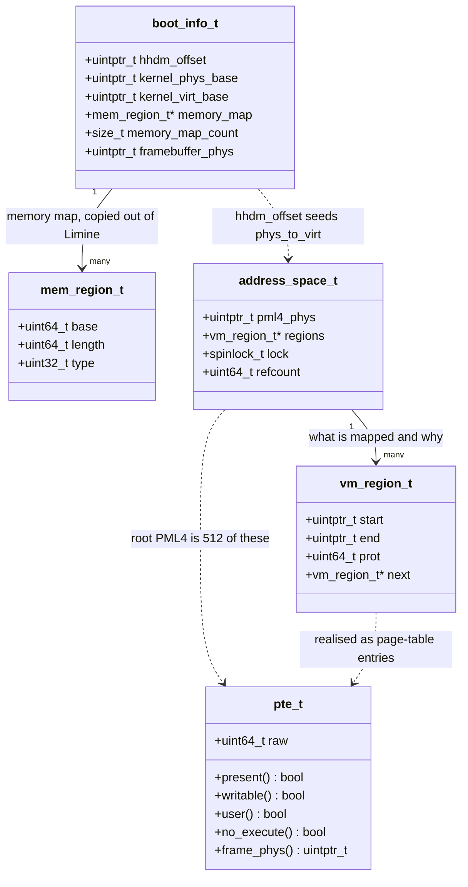

**Walkthrough.** `boot_info_t` is the structure [[06 - Architecture Overview]] describes as
the one place Limine is known — every Limine response is copied into it in Phase 0 and nothing
outside `kernel/arch/x86_64/boot/` ever includes `limine.h`. For this document its important
fields are `hhdm_offset` (the base of the direct map, which is architecturally
`0xFFFF800000000000` but should be *read from here*, not hardcoded), `kernel_phys_base` and
`kernel_virt_base` (which together give the kernel image's alias arithmetic from §3.7), and the
memory map.

`mem_region_t` is one entry of that memory map: base, length, and a type saying usable,
reserved, bootloader-reclaimable, ACPI, or bad. [[Stage 4.1 - Reading the Memory Map]] walks
this list; [[Stage 4.2 - The Physical Frame Allocator]] turns it into the free-frame catalogue;
[[Stage 4.3 - Enabling Paging]] uses it to decide what the HHDM must span.

`address_space_t` is one map: the physical address of its PML4 (which is what goes into `CR3`),
a list of the regions mapped in it, a lock, and a reference count so that `fork` in
[[Phase 13 - Overview|Phase 13]] can share one.

`vm_region_t` is the *bookkeeping* view of a mapping — a range and its intended protection —
kept separately from the page tables because page tables are a poor data structure to query.
Answering "what is mapped at this address and why" by walking four levels of hardware table is
slow and loses the intent; a region list answers it directly, and is what a page-fault handler
consults to decide whether a fault is a bug or expected work.

`pte_t` wraps the raw 64-bit entry from §4.1 with accessors, so that bit manipulation lives in
one place rather than being spread through the VMM.

> [!note] Verify the names against the code
> `boot_info_t` and `mem_region_t` are named in [[06 - Architecture Overview]]. The others are
> the architectural shape, not a promise about identifiers — the Phase 4 stage notes are
> authoritative on the actual field names.

---

## 5. The flows

### 5.1 A memory access, from instruction to data

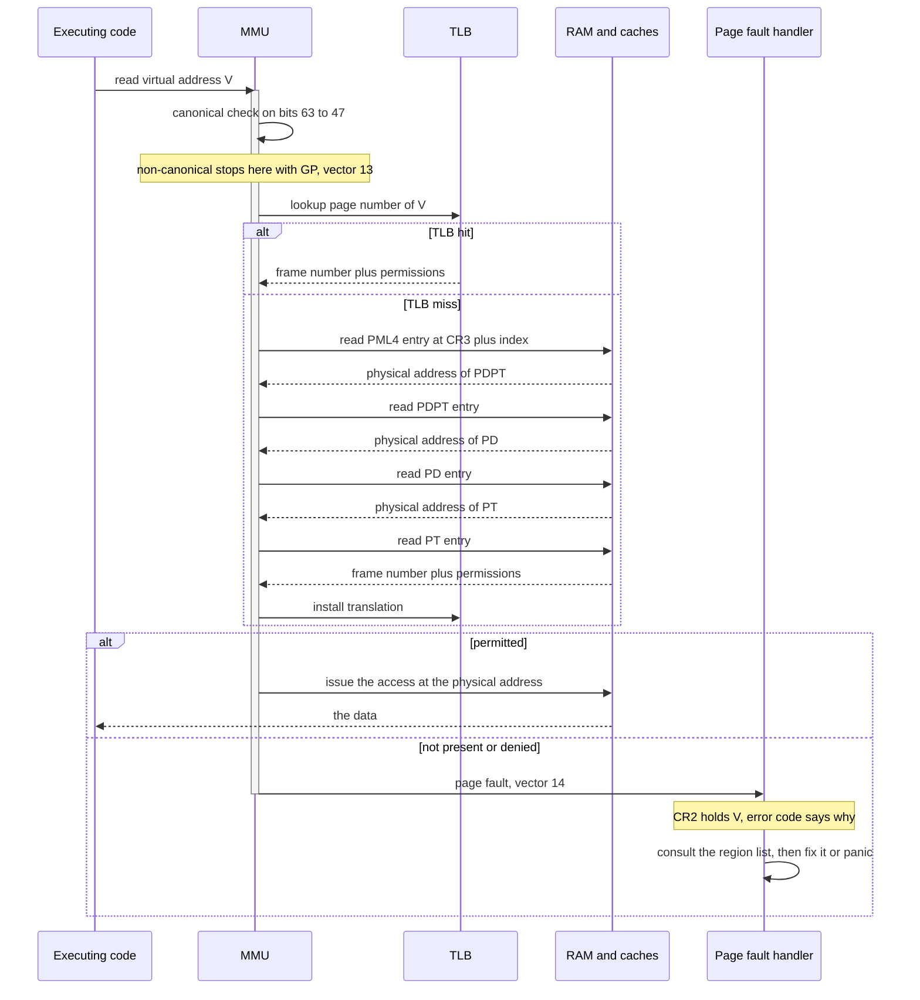

**Walkthrough.** `CODE` issues an access; it does not know translation exists. `MMU` runs the
canonical check first — an illegal value stops here with a general protection fault and never
reaches a page table. Then the `TLB` is consulted. On a hit, the translation is returned
immediately. On a miss, the four dependent reads run against `RAM`, each returning the physical
address of the next table, and the finished translation is installed in the `TLB` so the next
access is a hit. Finally the permission check: if allowed, the access proceeds at the physical
address and the data comes back to `CODE`, which never learns any of this happened. If not, the
`MMU` raises vector 14, leaving the faulting address in `CR2` and a reason code on the stack,
and `KERN` decides whether the fault is expected work (grow a stack, fault in a page, break a
copy-on-write share) or a bug worth panicking over.

Note where the expensive parts are: four RAM reads on a miss, zero on a hit. Everything about
TLB management downstream is an attempt to keep the miss path rare.

### 5.2 A syscall — a privilege change with no address-space change

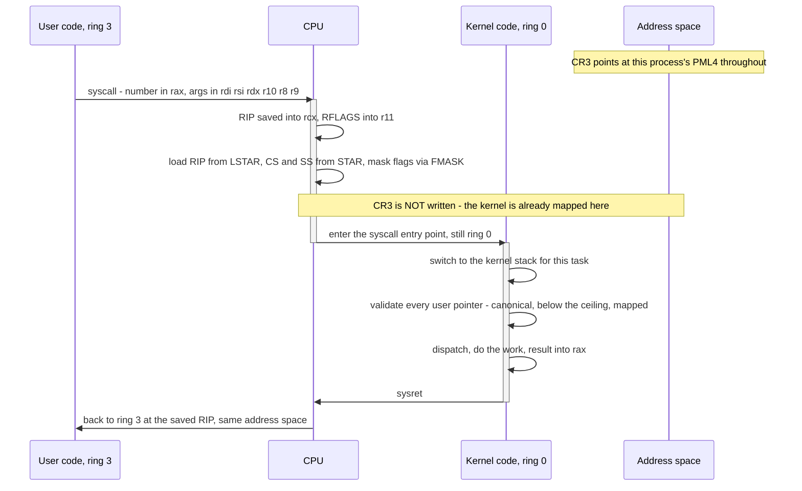

**Walkthrough.** `U` executes `syscall`. `CPU` saves `RIP` into `rcx` and `RFLAGS` into `r11`
— which is exactly why the syscall ABI uses `r10` rather than `rcx` for the fourth argument,
as [[06 - Architecture Overview]] insists — then loads the entry point from the `LSTAR` MSR and
the ring-0 selectors from `STAR`. The `Note over CPU,AS` is the point of this diagram: **`CR3`
is never written.** The kernel's `.text` at `0xFFFFFFFF80000000` and its stack are already
mapped in this process's address space, so execution continues without a single page-table
operation. `K` switches to the task's kernel stack, validates pointers, does the work, and
`sysret`s back. The address space in effect at the start and at the end is the same one.

Compare this to what a design without a shared kernel half would need: a `CR3` write on entry
and another on exit, each flushing the TLB, on every single syscall.

### 5.3 A context switch — the lower half changes, the upper half does not

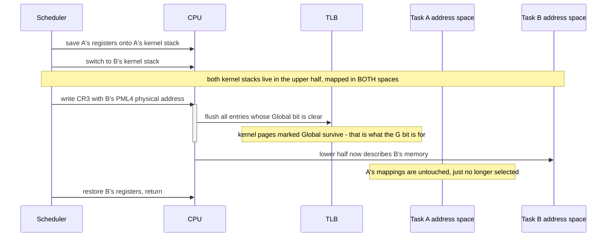

**Walkthrough.** `SCHED` saves A's registers, moves to B's kernel stack — and the note matters:
both kernel stacks are upper-half addresses, so they are valid in both address spaces, which is
what makes it safe to be standing on one while switching to the other. Then the one meaningful
instruction: write `CR3`. `CPU` responds by telling `TLB` to discard every entry whose **Global**
bit is clear. Kernel pages carry `G = 1` (assuming `CR4.PGE` is enabled), so their translations
*survive the switch* — the kernel does not pay for re-walking its own mappings on every switch.
User pages do not carry `G`, so they are flushed, which is correct: they meant something
different in A's address space and must not be reused for B.

`A`'s mappings still exist. Nothing was destroyed; a different root was selected. That is the
entire semantic content of a context switch as far as memory is concerned. Built in
[[Phase 5 - Overview|Phase 5]] and generalised per-CPU in [[Phase 12 - Overview|Phase 12]].

> [!warning] The Global bit is a loaded weapon
> `G = 1` means "do not flush this on a `CR3` write". Set it on a page whose mapping you later
> change, and a `CR3` write will *not* clear the stale translation — you must `invlpg` it
> explicitly. Set it on a user page and one process can be left executing with another's
> translation. Use it only for kernel mappings that are identical in every address space and
> never change, which is exactly the set this layout was designed to produce.

### 5.4 Mapping a new page, through the HHDM

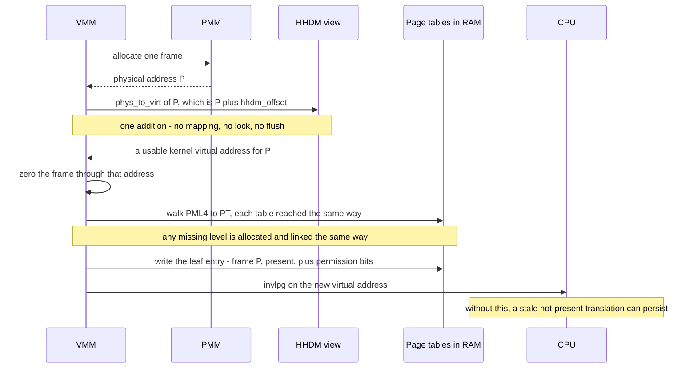

**Walkthrough.** `VMM` asks `PMM` for a frame and gets a physical address `P`. To touch it, it
computes `P + hhdm_offset` — the `Note` says what that costs: one addition. It zeros the frame
through that address, because a frame handed out with stale contents leaks whatever the previous
owner had in it. Then it walks the tables, reaching each one through the HHDM by the same
arithmetic, creating any missing level as it goes. It writes the leaf entry. Finally, `invlpg`.

That last step is the one people skip. The TLB may hold a *negative* result — some
implementations cache the fact that a translation was absent — and even where they do not,
mapping and immediately unmapping and remapping a page can leave a stale entry. `invlpg` on the
affected virtual address is cheap and unconditional; do it every time you change an entry, and
reload `CR3` only when you have changed many. On SMP, in [[Phase 12 - Overview|Phase 12]], this
grows into a TLB shootdown: an IPI to every other CPU that might hold the stale entry, because
`invlpg` only affects the CPU that executes it.

---

## 6. Why it is shaped this way

### Decision: where does the kernel live?

| Option | How it works | Cost | Verdict |
|---|---|---|---|
| **A. Upper half, mapped into every address space (chosen)** | PML4 entries 256–511 identical everywhere; kernel image in the top 2 GiB | All physical RAM reachable from user-mode-adjacent context; Meltdown-class leaks are possible on affected CPUs | ✅ |
| B. Identity-mapped low kernel | Virtual equals physical for the kernel | Steals the low address space from every process; `-mcmodel=kernel` no longer applies | ❌ |
| C. Kernel in its own address space | Switch `CR3` on every trap | A `CR3` write plus TLB flush on every syscall and interrupt — and the trap entry itself must still be mapped | ❌ |

**Why A.** §3.8 gives the hard argument: on entry to a trap the CPU has already begun executing
kernel code, using the address space that was current, before any of our instructions run. There
is no architectural hook to switch tables first. B and C both have to solve that anyway, by
keeping *something* mapped in every address space; A simply keeps everything.

**What breaks under B.** The kernel sits inside the low addresses that user programs expect to
be theirs, so `mmap` has a hole in the middle of its range, and a user program can name kernel
addresses (the USER bit still protects them, but the address-space accounting becomes a
permanent nuisance). It also abandons `-mcmodel=kernel`, so every global reference costs a
10-byte `movabs` instead of a 4-byte displacement.

**What breaks under C.** Every trap costs a `CR3` write and a TLB flush. It is, precisely, the
KPTI mitigation — which the industry adopted only under duress, for a hardware security bug, and
measured at single-digit to double-digit percentage costs on syscall-heavy workloads.

Related: [[ADR-0002 - Target x86_64 Not i686]], [[ADR-0003 - Limine as the Bootloader]].

### Decision: how does the kernel reach arbitrary physical memory?

| Option | How it works | Cost | Verdict |
|---|---|---|---|
| **A. HHDM — map all RAM once at `0xFFFF800000000000` (chosen)** | `phys_to_virt` is one addition | 16 TiB of address space; all RAM writable from ring 0 | ✅ |
| B. Recursive PML4 entry | Point one PML4 entry at the PML4 itself | 512 GiB of address space; genuinely difficult index arithmetic; reaches page tables only, not arbitrary frames | ❌ |
| C. Temporary mapping window | Map, use, unmap, `invlpg` per access | A lock on the memory path; a page-table write per access; self-referential | ❌ |

**Why A.** Address space is the cheapest resource we have — 128 TiB of kernel half against, at
most, hundreds of gigabytes of RAM. Spending some of it to make the most-used primitive in the
memory manager a single `add` is not a trade-off. Limine hands us the HHDM already built, so the
alternative is not "avoid the cost" but "tear down something that already works".

**What breaks under B.** Recursive mapping addresses *page tables*, not arbitrary frames. It
solves the table-editing circularity and nothing else, so you would still need a separate answer
for "the PMM wants to zero a freshly-allocated frame" and "the disk driver wants a virtual
address for a DMA buffer". Its arithmetic is also famously error-prone, and a mistake produces a
wrong-but-plausible address, which is the worst kind.

**What breaks under C.** A single shared window needs a lock, and that lock sits on the path
every allocation takes. On SMP it serialises memory management across all CPUs. Per-CPU windows
fix the contention and multiply the bookkeeping. And every use costs a page-table write plus a
TLB invalidation, which is strictly more work than the addition A does.

**When B or C would be right.** A 32-bit kernel, where address space is genuinely scarce and
mapping all of RAM is impossible by construction. This is the historical reason both techniques
exist, and it does not apply to us.

### Decision: 4 KiB pages, or huge pages?

| Option | How it works | Cost | Verdict |
|---|---|---|---|
| **A. 4 KiB pages everywhere (chosen for v1)** | `PS` bit clear at every level; full four-level walk | More TLB entries consumed; more table memory | ✅ |
| B. 2 MiB pages for the kernel image and HHDM | `PS` set in PD or PDPT entries; walk stops early | Permissions become 2 MiB-granular; the linker script would need 2 MiB alignment | ➖ later |
| C. 1 GiB pages for the HHDM | `PS` set in PDPT entries | Coarsest possible; not supported on every CPU | ➖ later |

**Why A.** Permission granularity is the argument. [[Stage 0.4 - The Linker Script and Higher-Half Layout]]
deliberately aligns `.text`, `.rodata`, `.data` and `.bss` to 4 KiB precisely so that each can
carry different permissions. Map them with 2 MiB pages and the whole kernel image collapses into
one or two permission regions, which means `RWX` — the permission set every exploit wants. The
same stage note rejects 2 MiB *alignment* for the same reason, and this is the other end of that
decision.

**When B and C become right.** When a profile shows iTLB or dTLB misses mattering. The HHDM is
the obvious first candidate: it is enormous, uniformly `RW NX`, and needs no per-page
granularity, so mapping it with 1 GiB pages would cost a handful of TLB entries instead of
millions. That is a real optimisation and it is deferred, not rejected. Linux maps both its
kernel text and its direct map with huge pages.

### Decision: how large is the null guard?

| Option | How it works | Cost | Verdict |
|---|---|---|---|
| **A. First 4 MiB unmapped, user base at `0x400000` (chosen)** | No mapping below `0x400000` | 4 MiB of a 128 TiB space | ✅ |
| B. First page unmapped | No mapping below `0x1000` | Catches `*p` but not `p->big_field` | ➖ |
| C. Map page zero | Address 0 is readable | Null dereferences read garbage and continue | ❌ |

**Why A.** `p->field` on a null `p` computes `0 + offsetof(field)`. With a one-page guard, any
struct larger than 4 KiB has fields that fall outside the guard and read real memory. 4 MiB
covers every struct and every array index bug of realistic size. The cost is 4 MiB of address
space, which is nothing, and it aligns exactly with the conventional ELF load base of `0x400000`
so nothing is actually given up.

**What breaks under C.** Null dereferences stop being crashes and become *silent wrong answers*.
This was a real class of Linux kernel exploit: a null function-pointer call, with the attacker
having mapped code at address zero. The mitigation, `mmap_min_addr`, is exactly option A.

---

## 7. How this grows across the phases

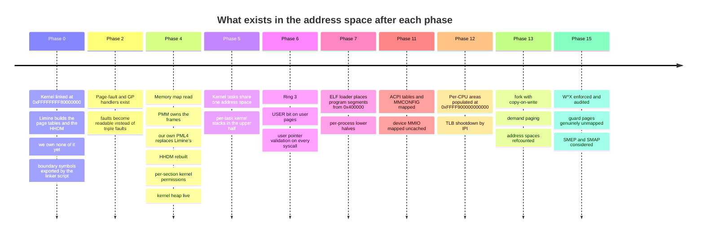

**Walkthrough of the deliberate gaps.**

**After Phase 0 we own nothing.** Limine hands over with paging already enabled, its own page
tables installed, and an HHDM already present — that is part of the handover contract in
[[ADR-0003 - Limine as the Bootloader]]. The kernel is *linked* for the higher half by
[[Stage 0.4 - The Linker Script and Higher-Half Layout]] and runs there, but the tables making
that true belong to the bootloader. This is fine and it is the reason no long-mode trampoline is
written. It is also a trap: those tables, and the memory describing them, are
bootloader-reclaimable, so everything needed must be copied into `boot_info_t` before Phase 4
reclaims it.

**Phase 2 before Phase 4 is not negotiable.** Turning on your own page tables without a working
page-fault handler means every mistake is a triple fault and a silent reboot. With the handler
from [[Stage 2.5 - CPU Exception Handlers]] already installed, the same mistake prints `CR2`, an
error code, and a register dump. This ordering is why the initialisation table in
[[06 - Architecture Overview]] puts the IDT at step 4 and virtual memory at step 9.

**Phase 4 is where this document becomes real.** [[Stage 4.1 - Reading the Memory Map]] finds out
what RAM exists; [[Stage 4.2 - The Physical Frame Allocator]] takes ownership of it;
[[Stage 4.3 - Enabling Paging]] builds our own PML4 with the layout in §2 and switches `CR3` to
it; [[Stage 4.4 - The Kernel Heap]] fills in the heap window. Everything above the hole reaches
its final shape here and barely changes afterwards.

**What is deliberately missing until Phase 13.** No demand paging, no copy-on-write, no swap.
Every mapping is created eagerly and stays. This is acceptable because until Phase 13 there is no
`fork`, and eager mapping is strictly simpler to debug: if an address is in the region list it is
mapped, and a fault on it is unambiguously a bug. Adding demand paging later is additive — a page
fault that currently panics starts, instead, consulting the region list and doing work.

**What is deliberately missing until Phase 15.** W^X enforcement, genuinely unmapped guard pages
(they are merely *reserved* address space before Phase 4 owns the tables), SMEP and SMAP, and any
Meltdown-class mitigation. The layout is designed so all of these are switch-flips rather than
relayouts — which is the entire argument for aligning sections at 4 KiB back in Phase 0.

---

## 8. Failure modes

Symptom first, because that is what you actually have at 2am.

**Symptom: the machine resets instantly the moment you load your own `CR3`. No output, no fault
message, QEMU just restarts.**
Triple fault. The page tables you switched to do not map the instruction after the `mov cr3`.
Because the tables are wrong, the page-fault handler is unreachable too, and so is the
double-fault handler.
*Cause:* the kernel image, or the current stack, or the IDT, is not mapped in the new tables.
*Fix:* before writing `CR3`, assert that your new tables translate `__text_start`,
`__text_end - 1`, the current `RSP`, and the IDT's address. Run QEMU with `-d int,cpu_reset` to
see the fault sequence. Build the new tables, verify by *walking them in software* for those
addresses, and only then switch.

**Symptom: `#GP` (vector 13) with error code 0 where you expected a page fault, and `CR2` holds
an address from some earlier fault.**
A non-canonical address. The canonical check runs before translation, so nothing was written to
`CR2`.
*Cause:* an uninitialised or corrupted pointer, or arithmetic that overflowed out of the lower
half. Very often `virt_to_phys` applied to something not in the HHDM, or a negative offset added
to a low address.
*Fix:* look at the saved `RIP` and the register dump, not at `CR2`. Add a canonical-address
assertion to any function taking a raw address.

**Symptom: `CR2` is a small number like `0x0` or `0x28`, error code says not-present.**
A null-pointer dereference, and the 4 MiB guard did its job. The value of `CR2` is the struct
offset.
*Fix:* the saved `RIP` names the function. This is the guard working, not a memory-management bug.

**Symptom: `CR2` is just below `__stack_bottom`, error code says not-present, from ring 0.**
Kernel stack overflow into the guard page. The saved `RIP` is inside the function that overflowed —
often a recursive one, or one with a large stack array.
*Fix:* find the recursion. Note that this diagnosis only works once Phase 4 has actually unmapped
the guard page; before that the overflow lands in mapped `.bss` and corrupts silently.

**Symptom: a page-fault handler that itself page-faults, producing a double fault.**
The fault path touched something unmapped — commonly the handler's own stack.
*Fix:* this is what the IST is for. [[Stage 2.2 - The TSS and Interrupt Stacks]] gives the double-fault
handler a known-good stack via IST so it can always run and print. The spec is explicit: `#DF`
must use an IST stack.

**Symptom: paging turns on and every access faults immediately, error code bit 3 (reserved bit)
set, on addresses that are definitely mapped.**
You set the NX bit (bit 63) in page-table entries without enabling `EFER.NXE` first. The entry is
malformed, not restrictive.
*Fix:* set `EFER.NXE` before writing any entry with bit 63 set.

**Symptom: ring 3 faults on a page whose PT entry clearly has the USER bit set.**
Permissions are cumulative across all four levels. A PML4, PDPT or PD entry on the path has the
USER bit clear.
*Fix:* set USER on every level of the walk for user mappings. Conversely, this is why clearing
USER on a single upper PML4 entry locks out an entire 512 GiB region.

**Symptom: you change a mapping and the old translation keeps being used.**
Stale TLB entry.
*Fix:* `invlpg` the affected virtual address after every entry change. If the page had the Global
bit set, a `CR3` reload will *not* clear it — you must `invlpg` explicitly. On SMP, `invlpg` only
affects the executing CPU, and you need a shootdown IPI ([[Phase 12 - Overview|Phase 12]]).

**Symptom: a kernel address works in one process and page-faults in another.**
The upper-half PML4 entries were copied at address-space creation, and a kernel mapping created
*afterwards* needed a new top-level entry that only the creating address space received.
*Fix:* pre-populate all 256 upper PML4 entries with empty next-level tables at boot, before any
process exists, so the top level never changes again.

**Symptom: DMA writes land in the wrong place, corrupting an unrelated subsystem.**
`virt_to_phys` was applied to an address outside the HHDM — a heap pointer or a kernel image
address — and returned a plausible but wrong number.
*Fix:* `KASSERT` the input range in `virt_to_phys`, and use a table-walking conversion for
non-HHDM addresses.

**Symptom: everything works in QEMU with 128 MiB and page-faults on real hardware, or when you
give QEMU more RAM.**
The HHDM does not span what you assumed. Either it covers only the regions the memory map marked
usable (so MMIO and ACPI ranges are absent), or you sized it from a hardcoded constant rather than
the memory map.
*Fix:* build the HHDM from the memory map in `boot_info_t`, decide explicitly whether reserved
ranges are included, and assert the highest physical address you intend to reach is inside the
window.

**Symptom: a fault long after boot, in code that was working, pointing at an address near where
the boot information used to be.**
Phase 4 reclaimed bootloader-reclaimable memory, and something is still pointing into it — a
Limine response struct, the initial stack, or the memory map itself.
*Fix:* copy everything out before reclaiming. This is the trap [[06 - Architecture Overview]]
flags, and it is the reason `boot_info_t` exists at all.

**Symptom: a write to `.rodata` succeeds.**
Expected before Phase 4 applies per-section permissions, and a real bug afterwards. Check both
aliases: the kernel image mapping *and* the HHDM alias of the same frames (§3.7).
*Fix:* [[Stage 4.3 - Enabling Paging]] must set per-section permissions from the linker symbols;
[[Phase 15 - Overview|Phase 15]] must audit that no writable alias survives.

---

## 9. Masterclass notes

> [!question] Discussion prompts
> 1. The CPU does not switch page tables when a `syscall` or an interrupt occurs. Trace what
>    would actually happen, fault by fault, if the kernel were *not* mapped in the current
>    address space — and explain why "just switch `CR3` in the handler" is not available as a
>    fix.
> 2. The non-canonical hole makes roughly 16 million TiB of the 64-bit space illegal. Argue that
>    this is better hardware design than ignoring the top 16 bits, using a concrete example of
>    what would have broken.
> 3. The HHDM maps all physical memory writably into the kernel half. Name two distinct classes
>    of bug this makes *worse*, and describe what a hardened kernel does about each.
> 4. `virt_to_phys` is a subtraction for HHDM addresses and a four-level table walk for kernel
>    heap addresses. Why can it not be a subtraction for both? What would have to be true of the
>    layout for it to be?
> 5. Copying the top 256 PML4 entries into a new address space shares the kernel half — until it
>    does not. Describe precisely when the sharing breaks, why the symptom looks random, and why
>    the fix has to happen at boot rather than at address-space creation.
> 6. Kernel pages set the Global bit so their TLB entries survive a `CR3` write. Construct a
>    scenario where that is a correctness bug rather than an optimisation.

**You understand this when you can:**

- [ ] Draw the full address-space map from memory, with all five upper-half constants and the
      user base, and say which PML4 entry each falls in
- [ ] Explain why the kernel is at `0xFFFFFFFF80000000` and not `0xFFFF800000000000`
- [ ] Split a 64-bit virtual address into its five fields and name what each selects
- [ ] Translate `0xFFFFFFFF80001000` to its four table indices without notes
- [ ] Explain why a non-canonical address raises `#GP` and not `#PF`, and what that costs you at
      debug time
- [ ] Explain what changes and what does not when `CR3` is written
- [ ] Explain why `phys_to_virt` is one instruction and why that was worth 16 TiB
- [ ] State what the 4 MiB null guard catches that a 4 KiB one does not
- [ ] Read a page-fault error code aloud as a sentence

**Board plan** — the order to draw this, 8 steps:

1. A tall rectangle. Label the top `0xFFFFFFFFFFFFFFFF` and the bottom `0x0`. Say: "this is one
   process's view of memory, and none of it is real."
2. Draw the hole across the middle. Write `0x0000800000000000` below it and
   `0xFFFF800000000000` above it. Explain sign extension of bit 47. **Do not move on until this
   lands** — everything else hangs off it.
3. Fill in the upper half top-down: kernel image, heap, gap, per-CPU, HHDM. Write the four
   constants.
4. Fill in the lower half bottom-up: the 4 MiB guard, the program at `0x400000`, mmap, the stack
   at `0x0000700000000000`.
5. Draw a second identical rectangle beside the first. Erase and redraw only its *lower* half.
   Say: "this is a context switch. One register write."
6. To the side, draw the four-level walk: `CR3` → PML4 → PDPT → PD → PT → frame, with the bit
   ranges. Work `0xFFFFFFFF80001000` on the board.
7. Draw one physical frame with three arrows pointing at it from three different virtual
   addresses. This is the HHDM aliasing idea and it is the one people need drawn.
8. Return to the pair of rectangles. Draw the `syscall` arrow into the upper half of one, and
   write "CR3 unchanged" next to it. That is the thesis of the whole session.

**Time budget:** 55 minutes. Roughly 10 on the hole and canonical addressing, 15 on the map
itself, 15 on translation and the worked example, 10 on the HHDM, 5 on the switch.

---

## 10. Related

**Stages that build this**
[[Stage 0.4 - The Linker Script and Higher-Half Layout]] · [[Stage 4.1 - Reading the Memory Map]] ·
[[Stage 4.2 - The Physical Frame Allocator]] · [[Stage 4.3 - Enabling Paging]] ·
[[Stage 4.4 - The Kernel Heap]]

**Stages that depend on this**
[[Stage 2.2 - The TSS and Interrupt Stacks]] · [[Stage 2.5 - CPU Exception Handlers]] ·
[[Stage 6.2 - Entering Ring 3]] · [[Stage 6.3 - The System Call Interface]]

**Phases**
[[Phase 4 - Overview]] · [[Phase 5 - Overview]] · [[Phase 6 - Overview]] · [[Phase 7 - Overview]] ·
[[Phase 11 - Overview]] · [[Phase 12 - Overview]] · [[Phase 13 - Overview]] · [[Phase 15 - Overview]]

**Decisions**
[[ADR-0002 - Target x86_64 Not i686]] · [[ADR-0003 - Limine as the Bootloader]] ·
[[ADR-0007 - Freestanding C++20 as the Kernel Language]]

**Reference**
[[06 - Architecture Overview]] · [[04 - Glossary]] · [[07 - Repository Layout]] ·
[[14 - Debugging Playbook]]
