# 04 — Privilege and the Ring Boundary

> [!abstract] What this document covers
> The wall between the kernel and every program that is not the kernel, and the fact
> that the wall is made of hardware rather than of code. This is the system-level view:
> which bits in which registers and tables the CPU consults, what physically happens
> when execution crosses the wall in each direction, and why a single missing check on
> the kernel side deletes the wall entirely.

**Zoom level:** System
**Built by:** [[Stage 2.1 - The Global Descriptor Table]], [[Stage 2.2 - The TSS and Interrupt Stacks]], [[Stage 6.2 - Entering Ring 3]], [[Stage 6.3 - The System Call Interface]]
**Prerequisites:** [[06 - Architecture Overview]] · [[04 - Glossary]]
**Masterclass session:** 3 (see [[19 - The Eight-Hour Masterclass]])

> [!warning] Two stage notes on this topic are superseded
> [[Stage 6.2 - Entering Ring 3]] and [[Stage 6.3 - The System Call Interface]] were
> written before [[ADR-0002 - Target x86_64 Not i686]]. They still say `esp`/`eip`/`eflags`,
> `ebx/ecx/edx` arguments, and `int 0x80`. All of that is 32-bit-era and none of it
> applies. The x86_64 facts are in [[06 - Architecture Overview]] and in this document,
> and the two stage notes are pending the same rewrite
> [[Stage 2.1 - The Global Descriptor Table]] already had. Where they disagree with this
> document, **this document wins**. The two Phase 2 notes are current and authoritative.

---

## 1. The one-sentence version

The CPU refuses to run privileged instructions, or to touch memory marked
kernel-only, whenever the bottom two bits of the `CS` register are `11` — and the only
ways to change those two bits are ways the kernel chose in advance.

Everything else in this document is detail on that sentence. A **privilege ring** is a
hardware mode, a number from 0 to 3 that the CPU carries around and consults before it
executes certain instructions and before the memory-management unit permits certain
accesses. Ring 0 is the kernel and can do everything. Ring 3 is every user program and
can do almost nothing directly. There is no software involved in the enforcement: no
check the kernel runs, no flag the kernel inspects. The CPU simply will not execute the
instruction, and raises a fault instead. That is why this boundary is worth building
correctly and once. It costs nothing per operation, it cannot be bypassed by a bug in
kernel logic, and it turns "a user program corrupted the kernel" from a routine outcome
into something that requires the kernel to actively cooperate. The rest of the work is
making sure the kernel never cooperates.

---

## 2. The picture

This is the diagram to be able to draw from memory. Everything below is a zoom into one
of its boxes.

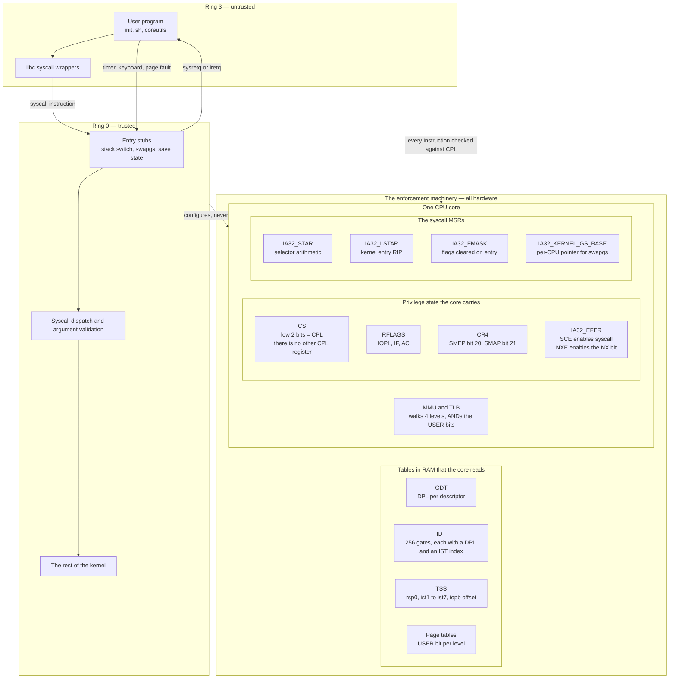

### Walking every box

**`Ring 3 — untrusted`** holds everything that is not the kernel. `User program` is the
compiled binary — `init`, the shell, a `ls`. `libc syscall wrappers` is the thin layer
from [[Stage 6.4 - A Minimal User C Library]] that turns a C call like `write(1, buf, n)`
into the exact register arrangement the kernel expects. The arrow between them is an
ordinary function call: both halves are ring 3, nothing crosses.

The label "untrusted" is doing real work. It does not mean the program is malicious. It
means the kernel's correctness must not depend on the program being well-behaved, because
the kernel cannot tell the difference. Every value that arrives from this box — pointers,
lengths, file descriptors, syscall numbers — is an input from an adversary as far as the
kernel's code is concerned.

**`The enforcement machinery`** is the middle box, and it is the whole point of this
document: it is *hardware*. Nothing inside it is a function the kernel calls. It is state
the kernel configures once, and the CPU consults on every instruction, forever.

Inside it, **`One CPU core`** splits into three groups.

`Privilege state the core carries` is the live state, in registers:

- **`CS`** — the code segment register. Its low two bits *are* the current privilege
  level. There is no separate CPL register anywhere on this architecture. Ring 3 exists
  because `CS` contains a value whose bottom two bits are `11`. This is the single most
  important fact in the document. Built by [[Stage 2.1 - The Global Descriptor Table]].
- **`RFLAGS`** — carries `IOPL` (the privilege level required for port I/O and for
  `cli`/`sti`), `IF` (are interrupts enabled), and `AC` (the alignment-check bit, which
  SMAP repurposes as "I am deliberately touching user memory right now").
- **`CR4`** — control register 4, holding the SMEP and SMAP enable bits. Turned on in
  [[Phase 15 - Overview|Phase 15]], but the kernel is written from the start so that
  turning them on changes nothing else.
- **`IA32_EFER`** — the Extended Feature Enable Register. `SCE` (bit 0) is what makes
  the `syscall` instruction legal at all; without it, `syscall` raises an invalid-opcode
  fault. `NXE` (bit 11) enables the no-execute page bit.

`The syscall MSRs` are four model-specific registers — CPU registers addressed by number
rather than by name in the instruction encoding, read and written with `rdmsr`/`wrmsr`,
both ring-0-only. They exist so that the fast entry path needs no table lookup at all:
`IA32_STAR` supplies the segment selectors by arithmetic (§3.5), `IA32_LSTAR` supplies
the kernel entry address directly, `IA32_FMASK` says which flag bits are forcibly
cleared on entry, and `IA32_KERNEL_GS_BASE` holds the pointer that `swapgs` installs.

`MMU and TLB` is the memory-management unit: the hardware that translates every virtual
address the program uses into a physical address, by walking four levels of page tables.
It is also where the second half of the privilege boundary lives — the USER bit (§3.4).

**`Tables in RAM that the core reads`** are the four structures the kernel builds and the
CPU reads. The kernel writes them; the CPU reads them; the CPU never writes them (with
one exception, the descriptor "accessed" bit). `GDT` carries the DPL of each segment.
`IDT` carries one gate per interrupt vector, each with its own DPL and its own choice of
stack. `TSS` carries the kernel stack pointer the CPU switches to. `Page tables` carry
the USER bit per page.

**`Ring 0 — trusted`** is the kernel side. `Entry stubs` is the small amount of assembly
that runs first on every crossing: switch to a kernel stack, run `swapgs`, save the
user's registers. `Syscall dispatch and argument validation` decides which service was
asked for and — critically — checks every pointer before touching it (§5.3). `The rest of
the kernel` is everything else, and it is written on the assumption that validation
already happened.

**The arrows crossing the boundary.** There are exactly three ways in and two ways out.

- `syscall instruction` — the voluntary doorway. The program asks. §5.2.
- `timer, keyboard, page fault` — the involuntary doorway. The program did not ask; the
  hardware or the program's own mistake forced the crossing. §5.1.
- `sysretq or iretq` — the two ways back out. `sysretq` pairs with `syscall`; `iretq`
  pairs with everything else, and is also how the kernel enters ring 3 for the very first
  time ([[Stage 6.2 - Entering Ring 3]]).

There is no fourth way in. That is the property the whole design rests on: the set of
entry points is finite, small, and chosen by the kernel.

**The dotted arrows.** `every instruction checked against CPL` is the ring-3 side: every
instruction ring 3 executes is validated by the core against the CPL before it retires.
`configures, never bypasses` is the ring-0 side: the kernel sets up the machinery, and
then is subject to it too — SMAP and SMEP in particular apply *to the kernel*, which is
the point of them.

---

## 3. Zooming in

### 3.1 Four rings, two used

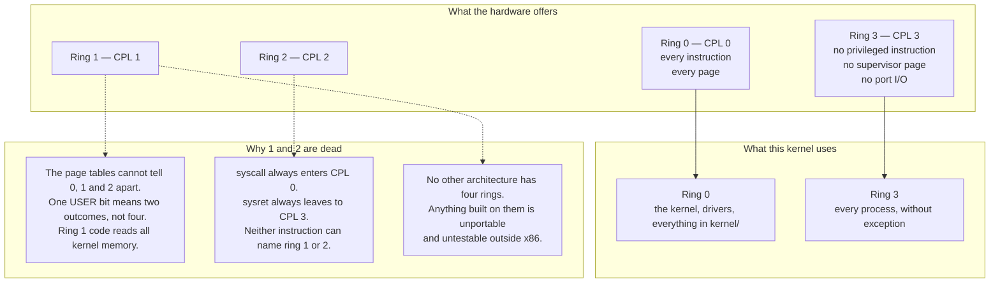

**Walking it.** The left column is what the silicon provides: four numbered privilege
levels, `0` the most privileged and `3` the least. Counting *upward* means *less*
privilege, which is backwards from intuition and is the source of a permanent low-grade
confusion — every privilege comparison in this document is "numerically less than or
equal to", and "less" means "more privileged".

`Ring 0` can execute every instruction in the instruction set and access every page.
`Ring 3` cannot execute the privileged instructions (§3.2), cannot access pages whose
USER bit is clear (§3.4), and cannot use `in`/`out` because `IOPL` is 0
([[Stage 2.2 - The TSS and Interrupt Stacks]] denies the entire port space through the
TSS I/O bitmap offset).

The right column is what this kernel actually uses, and the mapping is one-to-one: kernel
in ring 0, everything else in ring 3, no exceptions and no intermediate cases.

`Why 1 and 2 are dead` gives three independent reasons, and any one of them alone is
sufficient.

`P1` is the decisive one. The page-table entry has **one** bit that distinguishes
privilege — bit 2, the USER bit. Clear means "supervisor only", and *supervisor* means
CPL 0, 1 **or** 2. Set means "anyone". So as far as the memory system is concerned there
are two privilege levels, not four. Code in ring 1 has full read and write access to
every byte of kernel memory. It is not isolated from the kernel in any way that matters;
it is merely blocked from a handful of instructions. A "less privileged driver ring" that
can scribble on the kernel's page tables is a comfort, not a boundary.

`P2` closes the door from the other side. The two instructions this kernel uses for the
fast path — `syscall` and `sysret` — hardcode their privilege levels. `syscall` enters at
CPL 0. `sysretq` leaves at CPL 3. Neither takes an operand naming a ring. To use rings 1
or 2 you would have to abandon the fast path entirely and go back to `iretq` frames for
everything, paying the cost in §6 for a boundary `P1` already showed is not a boundary.

`P3` is the engineering argument. AArch64 has EL0 through EL3, RISC-V has U/S/M — both
have a user level and a supervisor level and then levels for hypervisors and firmware,
not for drivers. Nothing you build on rings 1 and 2 survives a port, and nothing you
build on them can be tested anywhere except x86. OS/2 famously used ring 2 for
I/O-privileged code, and it is remembered as an oddity rather than as a technique.

> [!question] Check your understanding
> If rings 1 and 2 give you nothing, why did Intel build four of them? What were they
> for in 1985, and what changed?

### 3.2 CPL, DPL and RPL

Three privilege numbers, similar names, different jobs. Getting them straight is most of
understanding x86 protection.

| Name | Lives in | Means | Set by |
|---|---|---|---|
| **CPL** | low 2 bits of `CS` | *Current* privilege level — what the core is running at right now | Changed only by a ring transition |
| **DPL** | bits 45–46 of a descriptor | *Descriptor* privilege level — the privilege this segment, gate or TSS demands | The kernel, when it builds the GDT or IDT |
| **RPL** | low 2 bits of any selector *value* | *Requested* privilege level — "check this access as if it came from ring N" | Whoever wrote the selector value |

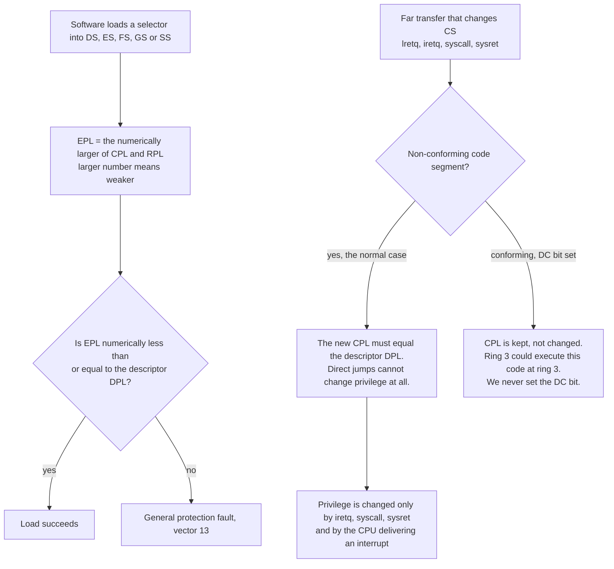

**Walking it.** The top path is the data-segment check, and it is the one where RPL
earns its existence. When software loads a selector into a data segment register, the CPU
computes an **effective privilege** — the weaker of the current CPL and the RPL written
into the selector value — and permits the load only if that effective privilege is at
least as privileged as the descriptor demands. `EPL <= DPL`, numerically.

Why would anyone deliberately *weaken* an access with RPL? Because of the confused-deputy
problem. Imagine ring 3 hands the kernel a selector and asks it to do something with it.
The kernel is at CPL 0, so every check passes and the kernel would happily act on a
selector the caller could never have used itself. RPL is the fix: the kernel tags the
selector with RPL 3, and now the hardware checks it as though ring 3 had done it. The
386 even had an instruction, `arpl`, whose only job was to force a selector's RPL to the
caller's CPL — and it is **not available in 64-bit mode**, which tells you how much of
this survived.

In this kernel RPL matters in exactly one place, and it matters absolutely: **the
selector values pushed into an `iretq` frame**. To return to ring 3 you push `CS = 0x23`
(index 4 with RPL 3) and `SS = 0x1B` (index 3 with RPL 3). Push `0x20` and `0x18`
instead — the same descriptors, RPL 0 — and `iretq` sees a return to the *same*
privilege level, checks a non-conforming DPL-3 descriptor against CPL 0, fails, and
raises a general protection fault. The program never starts. This is the most common
first-attempt failure in [[Stage 6.2 - Entering Ring 3]], and its symptom looks nothing
like its cause.

The bottom path is the code-segment rule. `Non-conforming code segment` is the normal
case and describes every code descriptor this kernel builds: the new CPL must **equal**
the descriptor's DPL, and a plain far jump or far call therefore cannot change privilege
at all — it can only stay where it is. Privilege changes only through the four
mechanisms in the `IRET` box: `iretq` popping a frame, `syscall`, `sysret`, and the CPU
delivering an interrupt through a gate.

`Conforming, DC bit set` is the trap. A conforming code segment *keeps the caller's CPL*
instead of adopting the descriptor's. Ring 3 could call into it and continue executing at
ring 3 while running kernel addresses. [[Stage 2.1 - The Global Descriptor Table]] leaves
the DC bit clear in every descriptor for exactly this reason, and says so in its access
byte table.

> [!warning] `iretq` also checks `SS.RPL == CS.RPL`
> A frame with `CS = 0x23` and `SS = 0x10` — user code, kernel data — faults on the
> `iretq`, not later. So does a frame whose `RFLAGS` has bit 1 clear; bit 1 is reserved
> and must read as 1. Build the frame from named constants, never by hand at the call
> site.

### 3.3 The segment descriptor as a privilege carrier

In long mode, segmentation is essentially switched off. The base and limit fields in
`CS`, `DS`, `ES` and `SS` descriptors are **ignored** — not conventionally zeroed,
ignored. About forty of a descriptor's sixty-four bits are dead. What survives is
privilege and mode, which is precisely what this document is about.

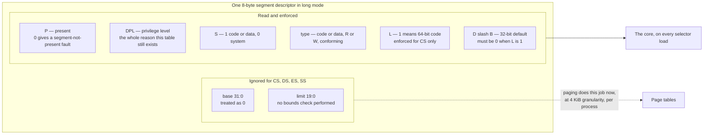

**Walking it.** The `Ignored` group is what x86-64 deleted. `base` was where the segment
started in linear memory; `limit` was how long it was, bounds-checked by hardware on
every single access. Both are genuinely useful ideas, and both are now done by paging —
at finer granularity, per address space, with support for swapping and copy-on-write that
segmentation never had. The dotted arrow to `Page tables` is the migration: the job did
not disappear, it moved.

The `Read and enforced` group is what remains, and every field in it is load-bearing for
this document:

- **`P`** — present. A load of a not-present descriptor faults immediately. This is why
  a GDT of zeros is not "empty", it is "every load faults".
- **`DPL`** — the privilege carried by the descriptor. This is the field. A ring-3 code
  descriptor is simply an ordinary code descriptor with `DPL = 3`, and without one in the
  table there is **no selector value in the world that means "ring 3"**. User mode is not
  a flag you set; it is a descriptor you built.
- **`S`** — distinguishes ordinary code/data descriptors (`S = 1`) from system
  descriptors (`S = 0`) such as the TSS. System descriptors in long mode are 16 bytes and
  occupy two consecutive slots, because they need a full 64-bit base — the TSS is real
  memory that the CPU must actually find, unlike a code segment whose base is ignored.
- **`type`** — code versus data, readable versus writable, and the conforming bit from
  §3.2.
- **`L` and `D/B`** — mode. `L = 1` means 64-bit code. They are **mutually exclusive**:
  both set is an invalid descriptor and loading it into `CS` faults. This is why the
  kernel code descriptor's flags byte is `0xAF` and the data descriptor's is `0xCF`, and
  why copying one to the other is a trap [[Stage 2.1 - The Global Descriptor Table]]
  calls out explicitly.

The practical consequence: **a descriptor in this kernel is a privilege token and nothing
else.** All four non-null descriptors have base 0 and a 4 GiB limit, and differ only in
DPL, in code-versus-data, and in the L/D pair. The table exists so that the CPU has
something legal to put in `CS`, so that DPL 3 has a name, so that `syscall` and `sysret`
have something to compute against, and so that the TSS descriptor has somewhere to live.

### 3.4 The USER bit — the other half of the wall

Rings stop ring 3 from executing privileged *instructions*. They do nothing about
*memory*. The memory half of the boundary is one bit per page-table entry, at every level
of the walk.

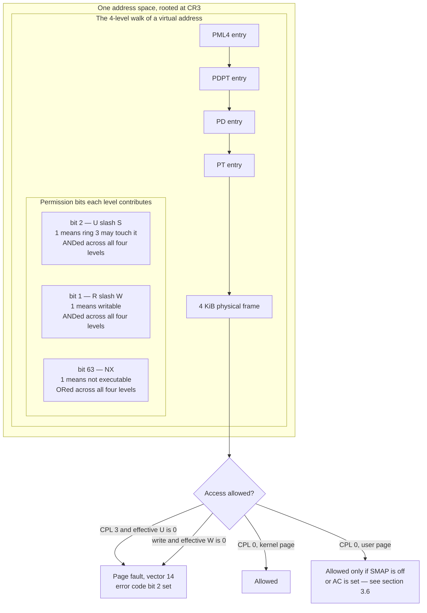

**Walking it.** `One address space, rooted at CR3` is the top: `CR3` is the control
register holding the physical address of the top-level page table, and switching
processes is essentially switching `CR3`. The kernel's mappings are in the upper half of
*every* address space ([[06 - Architecture Overview]]), so a crossing into ring 0 needs
no page-table switch at all — a fact §6 revisits.

`The 4-level walk` is the translation: the MMU splits a virtual address into four 9-bit
indices plus a 12-bit offset, and indexes `PML4 entry` → `PDPT entry` → `PD entry` →
`PT entry` → the `4 KiB physical frame`. Four memory reads, cached afterwards in the TLB.

`Permission bits each level contributes` is the subtlety, and it is the part people get
wrong.

- **`bit 2, U/S`** is the USER bit. Set means ring 3 may access this page. It is
  **ANDed** down the walk: if *any* of the four entries has it clear, the page is
  supervisor-only regardless of what the leaf entry says. Mapping a user page and setting
  U on the PTE alone is the classic version of this bug — the mapping looks correct in a
  dump of the leaf table and the program still faults on its first instruction.
- **`bit 1, R/W`** is likewise ANDed. Clear anywhere in the walk means the region is
  read-only.
- **`bit 63, NX`** is inverted logic and therefore **ORed**: set anywhere means the
  region is non-executable. It requires `IA32_EFER.NXE` to be enabled, which is
  [[Phase 15 - Overview|Phase 15]] work.

The decision box at the bottom is the enforcement, and it has four outcomes.

`CPL 3 and effective U is 0` is the whole memory boundary in one line: a user program
touching a kernel address takes a page fault, vector 14, with bit 2 of the error code set
to say the fault came from user mode. This is what makes the kernel's presence in every
address space safe.

`write and effective W is 0` catches writes to read-only pages. For ring 0 this depends
on `CR0.WP` — the write-protect bit. With `WP` clear, ring 0 may write to read-only pages
freely, which quietly destroys copy-on-write and W^X. **`CR0.WP` must be set.**

`CPL 0, kernel page` is the ordinary kernel case: allowed.

`CPL 0, user page` is the interesting one, and it is where §3.6 picks up. By default this
is allowed — which is exactly how the kernel reads a user buffer in a `write()` syscall,
and also exactly how a kernel that forgot to validate a pointer gets exploited.

**The page-fault error code**, which you will read hundreds of times:

| Bit | Name | 0 means | 1 means |
|---|---|---|---|
| 0 | P | page not present | protection violation on a present page |
| 1 | W/R | read | write |
| 2 | U/S | fault occurred at CPL 0 | fault occurred at CPL 3 |
| 3 | RSVD | — | a reserved bit was set in a page-table entry |
| 4 | I/D | data access | instruction fetch |

So error code `0x14` — bits 2 and 4 — is "user mode tried to fetch an instruction from a
page that is not present". That is the signature of a ring-3 entry whose code page was
never mapped, and it is the first thing you will see in [[Stage 6.2 - Entering Ring 3]].

> [!example] Reading a fault in one glance
> `#PF at rip=0x0000000000400000, cr2=0x0000000000400000, err=0x11`.
> Bit 0 set: the page *is* present. Bit 4 set: instruction fetch. Bit 2 clear: **CPL 0**.
> So the kernel jumped into user memory. That is not a mapping bug — that is a SMEP
> violation or a corrupted function pointer, and it is a security event, not a typo.

### 3.5 The GDT order that `sysret` forces

`syscall` and `sysret` take no operands. They compute the segment selectors they load by
adding **fixed offsets** to a 16-bit field in `IA32_STAR`. That arithmetic only produces
correct selectors if the descriptors sit in one specific order — which makes the layout of
the GDT a hardware requirement rather than a style choice.

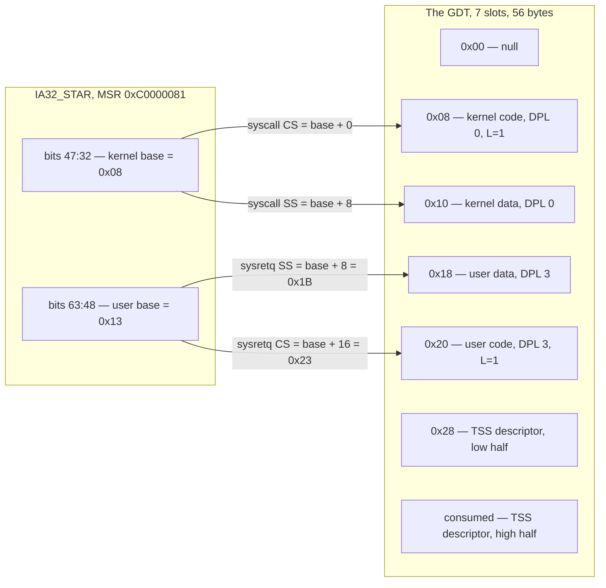

**Walking it.** `IA32_STAR` is one MSR carrying two 16-bit selector bases. The kernel base
is `0x08`; the user base is `0x13`, which is selector `0x10` with RPL 3 in the low two
bits.

`syscall` loads `CS` from the kernel base directly and `SS` from the kernel base **plus
8**. Since a selector value is a byte offset and every descriptor is 8 bytes, that says
kernel data must sit immediately *after* kernel code. `0x08 → 0x10`. Natural order, no
tension.

`sysretq` — the 64-bit form, with the REX.W prefix — loads `SS` from the user base **plus
8** and `CS` from the user base **plus 16**. Read those two again. `SS` comes from the
*lower* offset and `CS` from the *higher*. So:

> **The user data descriptor must sit 8 bytes below the user code descriptor.**

With user data at index 3 (`0x18`) and user code at index 4 (`0x20`), the required base is
`0x10`, written `0x13` with RPL 3. Check it: `0x13 + 8 = 0x1B` = index 3, RPL 3 = user
data ✓. `0x13 + 16 = 0x23` = index 4, RPL 3 = user code ✓. The whole MSR is
`IA32_STAR = 0x0013000800000000`.

Now try the "natural" order — user code before user data. You need a base `b` with
`b + 16` naming user code at `0x18` and `b + 8` naming user data at `0x20`. The first
gives `b = 0x08`, the second gives `b = 0x18`. **There is no solution.** The order is not
a preference; reversing it makes the equation unsatisfiable, and the only escape is to
append a second, correctly-ordered pair of user descriptors and leave the first pair as a
permanent trap in the table.

`0x28 — TSS descriptor, low half` and its consumed twin are why the table is seven slots
and not five. A system descriptor in long mode is 16 bytes (§3.3), so it takes two
consecutive GDT entries and the `lgdt` limit is `7 * 8 - 1 = 55`.
[[Stage 2.1 - The Global Descriptor Table]] reserves them; [[Stage 2.2 - The TSS and Interrupt Stacks]]
fills them in.

> [!warning] This ordering error costs a phase, not a line
> Get it wrong and everything works — the kernel boots, the GDT loads, `info registers`
> looks right — until the first `sysretq` in Phase 6. By then the wrong selector values
> are baked into every selector constant, every one of the 256 IDT gates, every `iretq`
> frame, and any hand-written assembly with a literal `0x18` in it. Stage 2.1 turns the
> ordering into a `static_assert` for exactly this reason. Free now, a rewrite later.

`sysret` also does something worth knowing: it **synthesises** the hidden descriptor
state rather than reading the GDT. The selector *values* it writes into `CS` and `SS` are
still indices into your table, and the very next interrupt or `iretq` does read them — so
the descriptors must exist, be DPL 3, and be the right types even though `sysret` itself
did not look.

### 3.6 SMEP and SMAP — the gate that watches the kernel

Rings and the USER bit stop ring 3 from reaching ring 0. They do nothing about ring 0
wandering into ring 3's memory — which is, by a wide margin, the more common direction for
a real exploit. SMEP and SMAP are two `CR4` bits that close it.

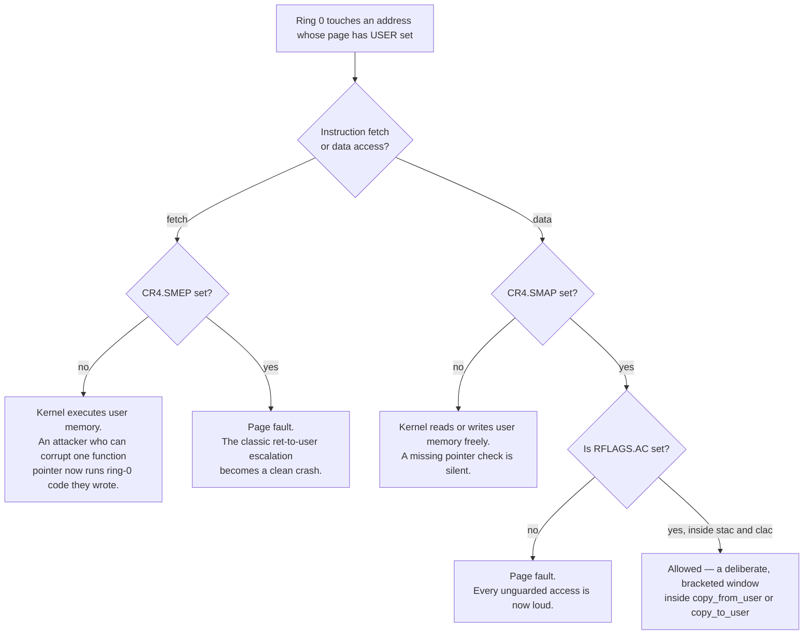

**Walking it.** The entry condition is ring 0 touching a page marked USER. The CPU then
splits on what kind of access it is.

`Instruction fetch` is SMEP's territory — Supervisor Mode Execution Prevention, `CR4`
bit 20. Without it, `Kernel executes user memory`: an attacker who can corrupt a single
kernel function pointer points it at a page they wrote themselves, and the kernel executes
attacker-authored code at ring 0. This is the oldest and most reliable privilege-escalation
technique on the architecture. With SMEP set, the fetch faults, and an exploit primitive
becomes a crash.

`Data access` is SMAP's territory — Supervisor Mode Access Prevention, `CR4` bit 21.
Without it, `Kernel reads or writes user memory freely` — which is normal and necessary,
since that is exactly what `write()` does with a user buffer. The problem is that the same
freedom makes a *missing* validation silent: the kernel that forgot to check a pointer
behaves identically to the kernel that checked it.

With SMAP set, the access faults unless `RFLAGS.AC` is set, and `AC` is set only by the
`stac` instruction and cleared by `clac`. That converts "touching user memory" from the
default into an explicit, bracketed act:

```
    // the ONLY place in the kernel that may do this
    stac();
    memcpy(kernel_buf, user_ptr, len);   // fault here returns -EFAULT, not panic
    clac();
```

The discipline that makes this work is one rule: **only `copy_from_user` and
`copy_to_user` ever execute `stac`/`clac`**, and the window between them contains nothing
but the copy. Every other kernel access to a user address is a bug, and with SMAP on it is
a bug that announces itself.

Two connections that are easy to miss.

First, **`IA32_FMASK` must clear `AC` on `syscall` entry.** `AC` is an ordinary
user-writable flag. A user program can set it, execute `syscall`, and if the mask does not
clear it, the kernel begins running with SMAP effectively disabled for the entire syscall.
That is the whole mitigation defeated by one flag bit. The mask must also clear `IF`
(so the kernel does not begin on a user stack with interrupts on), `DF` (the C ABI
requires the direction flag clear, and string instructions in the kernel assume it), `TF`
and `NT`. The exact constant belongs in the stage note; the requirement is architectural.

Second, **SMAP does not replace validation.** SMAP catches accesses that forgot the
`stac`/`clac` bracket. It says nothing about whether the pointer inside a correctly
bracketed copy was a legitimate user pointer. §5.3 is still mandatory. What SMAP buys is
that the *unbracketed* mistakes — the ordinary `*ptr` on a user pointer somewhere deep in
a driver — become immediate faults instead of exploitable behaviour.

Both bits are turned on in [[Phase 15 - Overview|Stage 15.2]]. The architecture is built
from the start so that switching them on requires no restructuring: every user access
already goes through two functions, so `stac`/`clac` land in two places.

---

## 4. The data structures

### 4.1 The four tables, as types

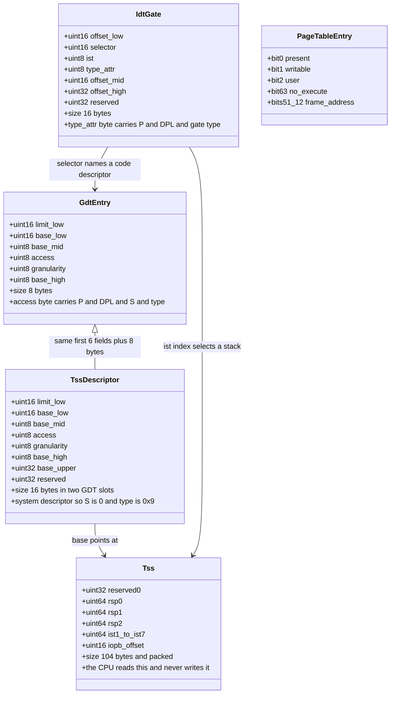

**Walking it.** `GdtEntry` is the 8-byte segment descriptor from §3.3. Its `access` byte
is the privilege carrier: bit 7 present, bits 6–5 DPL, bit 4 S, bits 3–0 the type. The
four values this kernel uses are `0x9A` kernel code, `0x92` kernel data, `0xF2` user data,
`0xFA` user code — and the only difference between the kernel and user pairs is the DPL
bits going from `00` to `11`.

`TssDescriptor` is the same layout plus eight more bytes, and the inheritance arrow says
so literally. The extra `base_upper` holds bits 63:32 of the TSS address. This matters
because the TSS is real memory the CPU must find, and a higher-half kernel puts it around
`0xFFFFFFFF80105000` — a base scattered across **five** non-contiguous descriptor fields.
Miss `base_upper` and the CPU reads the TSS from `0x0000000080105000`, which is user
address space and is not mapped, and `ltr` faults.

`Tss` is the 104-byte structure the CPU reads on every ring transition. It is packed
because `rsp0` sits at offset `0x04` — an 8-byte field on a 4-byte boundary — so without
`packed` the compiler inserts padding, every subsequent field shifts, and the CPU reads
`reserved1` where `ist1` should be. Note what this structure does **not** contain: any
saved registers. Hardware task switching was deleted in long mode; the CPU never writes
here.

`IdtGate` is the 16-byte interrupt gate. Its `selector` field names a ring-0 code
descriptor in the GDT — the arrow to `GdtEntry` — and its `ist` field's low three bits
select one of the TSS's seven stacks, the arrow to `Tss`. Its `type_attr` byte carries the
gate's own DPL, which is the field that decides whether ring 3 may invoke this vector with
a software `int` instruction.

`PageTableEntry` is the memory half from §3.4, shown with only the four bits this document
cares about.

### 4.2 The privilege fields, bit by bit

Everything the hardware reads to make a privilege decision, in one place.

| Structure | Field | Bits | Value here | Effect |
|---|---|---|---|---|
| `CS` register | RPL | 1:0 | `0` in kernel, `3` in user | **This is the CPL.** Nothing else is |
| Segment descriptor | DPL | 45:46 | `0` kernel, `3` user | Privilege the segment demands |
| Segment descriptor | S | 44 | `1` code/data, `0` TSS | Which descriptor format applies |
| Segment descriptor | DC | 42 | **always `0`** | `1` = conforming; ring 3 could run it at ring 3 |
| IDT gate | DPL | 45:46 | `0` for all 256 | Ring 3 cannot invoke any vector with `int n` |
| IDT gate | IST | 34:32 | `1`–`4` for four vectors, else `0` | Which known-good stack to switch to |
| TSS | `rsp0` | offset `0x04` | kernel stack top | Where the CPU pushes on a 3→0 interrupt |
| TSS | `iopb_offset` | offset `0x66` | `104` | `>=` the limit of 103, so **no bitmap, all ports denied** |
| `RFLAGS` | IOPL | 13:12 | **always `0`** | `in`/`out`/`cli`/`sti` require CPL `<=` IOPL |
| `RFLAGS` | AC | 18 | `0`, briefly `1` in `copy_*_user` | SMAP override |
| PTE, all 4 levels | U/S | 2 | `1` on user pages only | ANDed down the walk |
| `CR0` | WP | 16 | **must be `1`** | Ring 0 obeys read-only pages |
| `CR4` | SMEP | 20 | `1` from Phase 15 | Ring 0 cannot fetch from user pages |
| `CR4` | SMAP | 21 | `1` from Phase 15 | Ring 0 cannot touch user data without `AC` |
| `IA32_EFER` | SCE | 0 | `1` | `syscall` is legal at all |

Two rows deserve a sentence each.

**`IDT gate DPL = 0` for all 256 vectors.** A gate's DPL is the minimum privilege required
to invoke it *with a software `int n` instruction*. Hardware interrupts and CPU exceptions
are not checked against it — a page fault from ring 3 is delivered through a DPL-0 gate
without complaint. So leaving every gate at DPL 0 means ring 3 cannot fabricate an
interrupt of any vector, while still taking real faults normally. The old `int 0x80`
design required exactly one DPL-3 gate; this design requires none, which is one fewer
attack surface.

**`iopb_offset = 104`.** The I/O permission bitmap's offset is compared against the TSS
segment *limit*, which is 103. The SDM rule is that an offset at or beyond the limit means
there is no bitmap, and every I/O instruction from CPL above IOPL faults. `104 >= 103`, so
all 65,536 ports are denied to ring 3 with no bitmap to maintain.

### 4.3 The interrupt stack frame

What the CPU physically pushes when it delivers an interrupt in 64-bit mode.

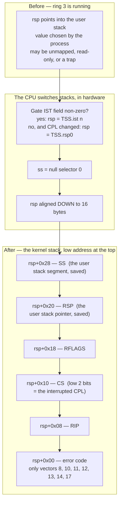

**Walking it.** `Before` is the state that makes all of this necessary: `rsp` holds a
value the *process* chose. The kernel cannot push anything there. It might be unmapped, it
might be read-only, it might be a kernel address the process is hoping the kernel will
write to. Three separate ways to be fatal.

`The CPU switches stacks, in hardware` is the fix, and every step is silicon.

`Gate IST field non-zero?` is checked first. If the gate names an IST slot, `rsp` is loaded
from that slot **unconditionally**, regardless of the current privilege level and
regardless of whether the current `rsp` was valid. That is the entire feature: it is how a
double fault survives a destroyed stack ([[Stage 2.2 - The TSS and Interrupt Stacks]]).
Otherwise, if the privilege level changed, `rsp` is loaded from `TSS.rsp0`. If neither —
a ring-0 interrupt on a gate with no IST — the current stack is kept.

`ss = null selector 0` is a long-mode quirk worth knowing so it does not surprise you in a
register dump. The CPU installs the null selector in `SS` on a privilege change. The
*saved* `SS` in the frame is the user's, so `iretq` restores it correctly.

`rsp aligned DOWN to 16 bytes` happens before the push. This has a consequence the entry
stub must handle: after five qwords, `rsp` is 8 modulo 16; after five qwords plus an error
code, it is 0 modulo 16. The two cases differ, which is one more reason the stub pushes a
dummy zero error code for the vectors that do not have one — it makes every vector's frame
identical in both layout and alignment.

`After` is the frame itself, five qwords, **always**, at every privilege level. This is a
real improvement over 32-bit mode, where `SS:ESP` were pushed only on a privilege change
and the handler had to know which case it was in. In long mode there is no branch: the
frame is the same shape every time.

The order matters and follows from pushes decrementing `rsp`: `SS` is pushed first and
therefore ends up at the *highest* address; `RIP` is pushed last and ends up at the lowest.
The error code, where there is one, is pushed after everything and sits lowest of all.

`CS (low 2 bits = the interrupted CPL)` is the field the entry stub reads to decide
everything else. Low bits `11` means we came from ring 3, so `swapgs` is required and the
per-CPU pointer must be installed. Low bits `00` means we came from ring 0, so `swapgs`
must **not** run — running it would install the *user's* GS base while executing kernel
code, and every subsequent per-CPU access would read attacker-controlled memory. This
single test is the origin of a well-known class of real kernel vulnerabilities
([[Phase 12 - Overview]] names it).

> [!warning] The error code is not popped by `iretq`
> `iretq` pops exactly five qwords. If a vector pushed an error code, software must remove
> it before `iretq`, or the return pops `RIP` from the error code and the machine goes
> somewhere random. Normalising every vector to have an error code — real or a pushed
> zero — makes the exit path a single unconditional `add rsp, 8`.

---

## 5. The flows

### 5.1 A timer tick: ring 3 → ring 0 → ring 3

The involuntary crossing. The process did not ask for this and does not know it happened.

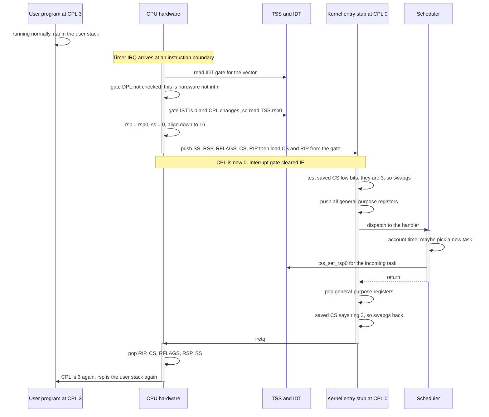

**Walking it.** The `User program` is running and knows nothing. A timer IRQ arrives at an
instruction boundary — interrupts are delivered *between* instructions, never inside one,
which is what makes any of this coherent.

`read IDT gate for the vector` is the CPU indexing the IDT. `gate DPL not checked` is the
distinction from §4.2: DPL gates the `int n` instruction, not hardware delivery.

`gate IST is 0 and CPL changes, so read TSS.rsp0` is the stack switch decision from §4.3.
This vector is an ordinary IRQ with no IST, and the privilege level is changing, so `rsp0`
it is. Then `rsp = rsp0, ss = 0, align down to 16`, then the five-qword push, then `CS` and
`RIP` are loaded from the gate. **CPL is now 0** — and note it changed as part of loading
`CS`, atomically, because there is nowhere else for it to live.

`Interrupt gate cleared IF` is the gate type doing its job: an interrupt gate clears the
interrupt flag on entry, a trap gate does not. This kernel uses interrupt gates so a
handler does not immediately reenter itself.

`test saved CS low bits, they are 3, so swapgs` is the first instruction of real kernel
code, and §4.3 explains why it is conditional. After `swapgs`, `GS` names this core's
per-CPU area and the kernel can find out where it is.

`push all general-purpose registers` completes the saved state. The hardware saved five
things; the software saves the other fifteen. The combined layout is what
[[Phase 5 - Overview|Phase 5]]'s context switch consumes.

`dispatch to the handler` runs the actual work at ring 0. `tss_set_rsp0 for the incoming
task` is the line that makes preemption safe: each task has its own kernel stack, and
`rsp0` must name the *next* task's stack before that task is ever interrupted again. It is
a plain store — the CPU re-reads `rsp0` from memory on every transition and caches nothing
— which is why this is cheap enough for the scheduler's hot path.

The exit is the entry reversed: pop the registers, `swapgs` back (again conditional on the
saved `CS`), and `iretq`, which pops all five qwords and restores privilege, stack and
instruction pointer in one atomic step.

### 5.2 A syscall: the voluntary crossing

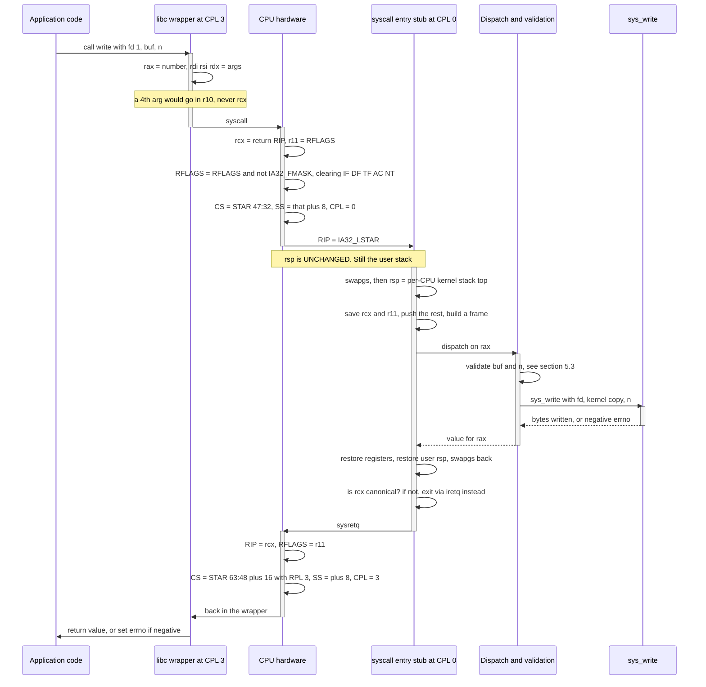

**Walking it.** `write(1, buf, n)` is an ordinary C call into the wrapper. The wrapper's
whole job is the register arrangement.

`rax = number, rdi rsi rdx = args` is the start of the contract, and the note beside it is
the fact everyone learns the hard way. The full contract:

| Register | Direction | Role |
|---|---|---|
| `rax` | in and out | Syscall number in, **return value out** |
| `rdi` | in | Argument 1 |
| `rsi` | in | Argument 2 |
| `rdx` | in | Argument 3 |
| `r10` | in | Argument 4 — **`r10`, not `rcx`** |
| `r8` | in | Argument 5 |
| `r9` | in | Argument 6 |
| `rcx` | clobbered | The CPU overwrites it with the return address |
| `r11` | clobbered | The CPU overwrites it with the saved `RFLAGS` |
| everything else | preserved | The kernel restores it |

The ordinary C calling convention on this platform passes arguments in
`rdi, rsi, rdx, rcx, r8, r9`. The `syscall` instruction destroys `rcx` before the kernel
ever sees it, so the fourth argument had to move somewhere, and `r10` is the register that
was free. Every libc wrapper with four or more arguments therefore begins with a
`mov r10, rcx` — a one-instruction translation between the C convention and the syscall
convention. Forget it and the fourth argument is the return address of the wrapper: a
plausible-looking, canonical, mapped, *kernel* pointer. Which is exactly the sort of value
that turns a missing validation into a compromise.

`rcx = return RIP, r11 = RFLAGS` is the hardware's first act. `RFLAGS = RFLAGS and not
IA32_FMASK` is the second, and §3.6 covered why `AC` must be in that mask. `CS = STAR
47:32, SS = that plus 8, CPL = 0` is §3.5's arithmetic. `RIP = IA32_LSTAR` is the jump —
no IDT lookup, no descriptor read, no memory access at all.

`rsp is UNCHANGED. Still the user stack` is the price of that speed, and it is the single
most dangerous moment in the kernel. The CPU has raised the privilege level to 0 and left
`rsp` pointing at memory the process controls. Any push, any call, any interrupt in this
window writes ring-0 data to a user-controlled address. The entry stub's first job — after
`swapgs`, which is needed to find the per-CPU area that holds the kernel stack pointer —
is to get off that stack. This is why NMI gets its own IST stack
([[Stage 2.2 - The TSS and Interrupt Stacks]] §3.2): an NMI cannot be masked and can land
in precisely this window.

`save rcx and r11, push the rest, build a frame` normalises the state into the same
`registers_t` layout the interrupt path produces, so that dispatch, the scheduler and the
debugger all see one shape.

`validate buf and n` is §5.3, and it is the entire security of the arrangement.

The exit reverses everything. `is rcx canonical? if not, exit via iretq instead` is not
paranoia: `sysretq` loads `RIP` from `rcx`, and if that value is non-canonical the
resulting fault is taken **at ring 0 with the user's stack pointer already loaded** on
some implementations. That is a real, named, historically exploited hardware subtlety. The
kernel checks, and falls back to the slower `iretq` when the check fails — which is also
the path used whenever `rcx` or `r11` could not be preserved, such as returning into a
freshly created process.

### 5.3 Validating a user pointer

Every rejection path. This is the most security-critical flowchart in the atlas.

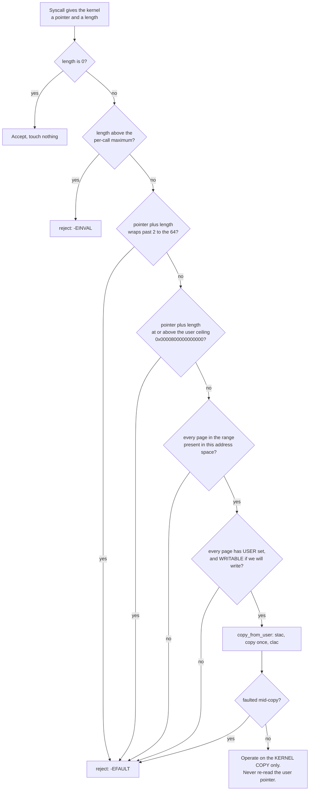

**Walking it, branch by branch.** Every one of these boxes is a real bug someone has
shipped.

`length is 0` short-circuits. A zero-length operation touches nothing, so the pointer is
irrelevant and may legitimately be null. Rejecting it breaks correct programs; validating
it against a null pointer rejects a legal call.

`length above the per-call maximum` catches the `read(fd, buf, SIZE_MAX)` class. Without a
cap, a single call asks the kernel to allocate or iterate over an unbounded amount, and
the failure is a hang or an out-of-memory panic rather than a clean error.

`pointer plus length wraps past 2 to the 64` is the arithmetic overflow check, and it must
come **before** the ceiling check. A pointer of `0xFFFFFFFFFFFFFF00` with a length of
`0x200` sums to `0x100` — which is comfortably below the user ceiling, so a ceiling check
alone would pass a pointer deep in kernel space. Check the overflow first, always.

`pointer plus length at or above the user ceiling` is the main event, and it is one
unsigned comparison doing three jobs. The ceiling is `0x0000800000000000`, the bottom of
the non-canonical hole ([[06 - Architecture Overview]]). Anything at or above it is either
in the hole — where the hardware faults on touch, because a canonical address must have
bits 63:48 all equal to bit 47 — or in the upper half, which is kernel space. So one
comparison rejects non-canonical addresses, kernel addresses, and the hole, with no
sign-extension test. This is the same trick [[Stage 0.7 - Panic and KASSERT]] uses from
the other direction with its kernel-space floor.

Note it checks `pointer + length`, not `pointer`. A range that *starts* in user space and
*ends* in kernel space is the boundary-straddling attack, and checking only the start
passes it.

`every page in the range present` and `every page has USER set, and WRITABLE if we will
write` are the mapping and permission checks. Both are per-page across the whole range,
not just the first page — a range can span a mapped page and an unmapped one. The USER
check is what stops a process from naming a page the kernel mapped for itself into the
lower half; the writable check stops a `read()` into a page the process mapped read-only,
which would otherwise let a process write to its own text segment via the kernel.

`copy_from_user: stac, copy once, clac` is the only place the kernel touches the memory,
and §3.6 explains the brackets. `faulted mid-copy?` is the belt to the braces: even after
every check, another thread in the same process can unmap the range between the check and
the copy. The copy routine has a fault-fixup entry so that a page fault inside it returns
`-EFAULT` to the caller instead of panicking the kernel.

`Operate on the KERNEL COPY only. Never re-read the user pointer.` is the
time-of-check-to-time-of-use rule, and it is the one that is easiest to get wrong while
looking correct. Validate a pointer, then read it twice, and a second thread in the same
process changes the memory between the reads. Your validation applied to a value that is
no longer there. **Copy in once, then use the copy.** [[Phase 15 - Overview|Stage 15.5]]
audits every syscall against exactly this list.

> [!warning] Why one missing check is total compromise
> Not "a bug", not "a vulnerability" — the end of the boundary. Consider
> `read(fd, (void*)0xFFFFFFFF80000000, 8)` reaching an unvalidated `copy_to_user`. The
> kernel writes eight attacker-chosen bytes over its own `.text`. That is arbitrary
> ring-0 code execution from an unprivileged program, in one syscall. The mirror image,
> `write(1, kernel_pointer, n)`, is arbitrary kernel memory disclosure — the KASLR base,
> credentials, keys, other processes' buffers.
>
> And the boundary is only as strong as the *weakest* syscall. Fifty syscalls that
> validate perfectly plus one that does not is a kernel with no boundary at all, because
> the attacker only has to find the one. This is why validation is centralised into two
> functions rather than written out at each call site, and why
> [[13 - Coding Standards]] rule 5 forbids dereferencing a user pointer directly
> anywhere in the tree.

---

## 6. Why it is shaped this way

| Decision | Option | Cost | Verdict |
|---|---|---|---|
| **How many rings** | Two: 0 and 3 | Nothing. Rings 1 and 2 are free to ignore | ✅ |
| | Four, drivers at ring 1 | Ring 1 has full access to kernel memory anyway (§3.1); unportable; `syscall`/`sysret` cannot reach it | ❌ |
| **Syscall mechanism** | `syscall`/`sysret` | The kernel must switch stacks itself and handle `swapgs` and the non-canonical `rcx` case | ✅ |
| | `int 0x80` | Roughly an order of magnitude slower ([[06 - Architecture Overview]]); needs a DPL-3 gate, which is an extra attack surface | ❌ |
| | `sysenter`/`sysexit` | Works, but it is the Intel-only 32-bit-era pair; `syscall` is the 64-bit one both vendors implement | ❌ |
| **GDT descriptor order** | `null, kcode, kdata, udata, ucode, TSS` | Zero — it is the order you type the lines in | ✅ |
| | "Natural" order, user code first | The `sysret` equation has no solution (§3.5); needs a duplicate descriptor pair forever | ❌ |
| **Kernel stack source** | `TSS.rsp0`, updated per context switch | One store per switch | ✅ |
| | One global kernel stack | Breaks the instant two tasks are in the kernel at once, and breaks harder under SMP | ❌ |
| **User memory access** | Validate, then `copy_*_user` with a fault fixup | Two functions, one discipline | ✅ |
| | Dereference user pointers directly | Every dereference is a potential compromise; SMAP cannot help you | ❌ |
| | Rely on SMAP alone | SMAP catches unbracketed accesses, not wrong pointers inside correct brackets (§3.6) | ❌ |
| **Kernel mapping** | Kernel in the upper half of every address space | A crossing needs no `CR3` reload; TLB stays warm | ✅ |
| | Separate kernel address space (KPTI-style) | A `CR3` write and a TLB flush on every crossing; defeats the point of the fast path | ⚠️ only if Meltdown-class defence is required |

**What specifically breaks under each rejected alternative.**

*Four rings.* A driver at ring 1 can read and write every byte of kernel memory, because
the page tables have one USER bit and it means "CPL 3 or not". You have paid the
complexity of a second boundary and received no isolation. The only enforcement you gain
is a handful of instructions the ring-1 code cannot execute — and it can simply write to
the kernel's data structures instead.

*`int 0x80`.* Two costs. The mechanical one is speed: `int` performs an IDT lookup, a
descriptor read, a privilege check, a TSS-driven stack switch and a five-qword push, and
`iret` reverses all of it, versus `syscall`'s "load three registers from MSRs". The
structural one is that it requires a gate with DPL 3, so ring 3 can invoke that vector
directly — one more thing to get right, in a table where everything else is DPL 0.

*Reversed GDT order.* §3.5 showed there is no `IA32_STAR` value that makes it work. The
escape — appending a second, correctly ordered pair of user descriptors — leaves two sets
of "user" descriptors in the table forever, one of which is inert and is a permanent trap
for the next person to read it.

*One global kernel stack.* Task A enters the kernel, blocks in the middle of a syscall.
Task B is scheduled and enters the kernel on the same stack, overwriting A's saved state.
A resumes into garbage. There is no version of preemption that survives this, which is why
`tss_set_rsp0` is called on every context switch.

*Direct dereference of user pointers.* Covered in §5.3's warning. The failure mode is not
degraded — it is total.

*Separate kernel address space.* This is the KPTI/Meltdown mitigation, and it is a real
design that real kernels ship. It costs a `CR3` write on every entry and every exit, plus
the TLB consequences. It defends against a *speculative side channel* that lets ring 3
infer the contents of kernel pages it cannot read. That threat is out of scope for this
project, and the cost would fall entirely on the path §5.2 exists to make fast. Revisit
only if the threat model changes.

Related: [[ADR-0002 - Target x86_64 Not i686]] (four rings and `syscall` are both x86_64
facts), [[ADR-0007 - Freestanding C++20 as the Kernel Language]] (why the entry stubs are
hand-written assembly rather than anything with a prologue).

---

## 7. How this grows across the phases

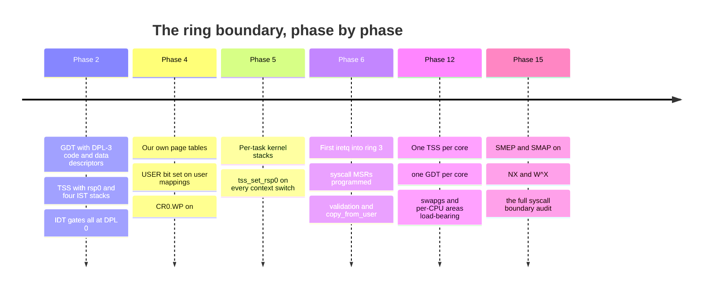

**Walking it.** `Phase 2` builds the machinery with nothing to use it. The DPL-3
descriptors exist and are never loaded; `rsp0` is set and never consulted, because nothing
runs in ring 3 yet. This looks like premature work and is not: the ordering constraint in
§3.5 is free to satisfy now and expensive to fix later, and the IST stacks make Phase 2's
own hardest stages debuggable ([[Stage 2.2 - The TSS and Interrupt Stacks]] §3.1).

`Phase 4` supplies the memory half. Until the kernel owns its page tables, it cannot set
the USER bit on anything, so ring 3 is unreachable regardless of how good the GDT is.
`CR0.WP` belongs here too, and is easy to forget because nothing fails when it is clear.

`Phase 5` makes `rsp0` dynamic. One kernel stack per task, and `tss_set_rsp0` called on
every switch. Note the API shape [[Stage 2.2 - The TSS and Interrupt Stacks]] insists on:
callers never touch a TSS object, only the function — which is what makes Phase 12 a
change to one function body rather than to twenty call sites.

`Phase 6` is where the boundary first exists as a runtime fact: the first `iretq` into
ring 3, the syscall MSRs programmed, and the first user pointer validated. Everything
before this was preparation.

`Phase 12` multiplies it. `rsp0` is inherently per-core — two cores can be in the kernel
at once and must not share a stack — so each core needs its own TSS, and because `ltr`
takes a selector, its own GDT. `swapgs` stops being a formality and becomes the mechanism
by which a core knows which core it is.

`Phase 15` hardens it. SMEP, SMAP, NX, W^X, and the audit. Note the ordering advice from
[[Phase 15 - Overview]]: turn SMAP on *before* the audit, not after, because SMAP's real
value is that it finds the places you forgot.

**What is deliberately missing early, and why that is acceptable.** Between Phase 2 and
Phase 6 there is no ring 3 at all, so there is no boundary to breach — every line of code
is trusted, and the machinery sitting unused costs 56 bytes of GDT and 100 KiB of stacks.
Between Phase 6 and Phase 15 the boundary is real but unhardened: validation is written
correctly by discipline rather than enforced by hardware. That gap is acceptable only
because the discipline is centralised — two functions, one coding-standard rule, one
review checklist — so that turning the hardware on in Phase 15 is a configuration change
and not a refactor. If user pointers were dereferenced ad hoc across the tree, Phase 15
would be a rewrite instead of two `CR4` bits.

---

## 8. Failure modes

Symptom first. This is the section for 2am.

> [!warning] Triple fault and reboot on the very first `iretq` into ring 3
> **Cause, in order of likelihood:** the pushed `CS` lacks RPL 3 (`0x20` instead of
> `0x23`); the pushed `SS` lacks RPL 3 (`0x18` instead of `0x1B`); `SS.RPL` does not equal
> `CS.RPL`; the pushed `RFLAGS` has reserved bit 1 clear; the GDT has no DPL-3 descriptor
> at all. All five are `#GP` on the `iretq`, and with an incomplete IDT a `#GP` becomes a
> triple fault. Dump the frame before the `iretq` and read the low two bits.

> [!warning] Page fault immediately at the user entry point, error code `0x14`
> Bits 2 and 4: user mode, instruction fetch, page not present. The user code page is not
> mapped, or — far more likely — the USER bit is set on the PTE but missing at one of the
> three levels above it. §3.4: the USER bit is ANDed down the whole walk. Dump all four
> entries for the faulting address, not just the leaf.

> [!warning] Ring 3 starts, then the first `syscall` raises an invalid-opcode fault
> `IA32_EFER.SCE` is clear. The `syscall` instruction does not exist until you enable it.

> [!warning] The `syscall` entry stub runs and the kernel corrupts random memory
> The stub is still on the user stack. `syscall` performs **no** stack switch (§5.2), and
> a stub that pushes anything before switching writes ring-0 data to a user-controlled
> address. Get off the user stack before the first push.

> [!warning] Per-CPU accesses return nonsense, or fault inside `this_cpu()`
> A `swapgs` imbalance. Either the entry stub ran `swapgs` unconditionally and a ring-0
> interrupt swapped the user base *in* while executing kernel code, or a path returned
> without swapping back. The test is always the saved `CS` in the frame, never "what did I
> do last time".

> [!warning] The fourth syscall argument is a plausible kernel address
> The libc wrapper passed argument 4 in `rcx` instead of `r10`, so the kernel is reading
> the wrapper's own return address as an argument. §5.2. Every wrapper with four or more
> arguments needs `mov r10, rcx`.

> [!warning] A syscall that failed appears to have returned a huge positive number
> The return value is a negative errno and the caller treated `rax` as unsigned.
> `-EFAULT` read as `uint64_t` is `0xFFFFFFFFFFFFFFF2`. The wrapper's job is to check for
> the small negative range, set `errno`, and return `-1`.

> [!warning] The kernel triple-faults inside `sysretq`, sometimes, on some hosts
> `rcx` is non-canonical at the point of return, and the resulting fault is taken at ring
> 0 with the user stack already installed. Check `rcx` for canonicity before `sysretq` and
> fall back to `iretq`. §5.2.

> [!warning] A ring-3 program successfully executes `in` or `out`
> Either `RFLAGS.IOPL` is not 0 — check the value pushed into the `iretq` frame — or the
> TSS `iopb_offset` is less than the segment limit, so the CPU believes there is a bitmap
> and reads permission bits out of whatever memory follows the TSS. §4.2.

> [!warning] Everything works, then Phase 15 turns SMAP on and every syscall faults
> This is SMAP working as designed. Each fault is a place the kernel touched user memory
> outside a `stac`/`clac` bracket. Fix them; do not turn SMAP off. [[Phase 15 - Overview]]
> says to expect exactly this.

> [!warning] The test program "runs in ring 3" and actually never left ring 0
> The most dangerous failure here is the one with no symptom. A program that runs
> correctly proves nothing about its privilege level. Verify it directly: check `CS` in
> the debugger, and make the program attempt something illegal — an `out` instruction, or
> a read of a kernel address — and confirm it faults. A privilege boundary that has never
> been *observed* to reject anything has not been tested.

---

## 9. Masterclass notes

> [!question] Discussion prompts
> 1. The CPL is the low two bits of `CS`, and `CS` can only be changed by a far transfer.
>    Why is that design better than a dedicated `CPL` register that some instruction could
>    write? What would break if `mov cs, ax` were encodable?
> 2. `sysret` synthesises the descriptor state rather than reading the GDT, yet
>    [[Stage 2.1 - The Global Descriptor Table]] insists the descriptors must still exist
>    and be correct. Trace an execution that proves it.
> 3. SMAP turns a missing pointer check into a fault. Given that, argue for and against
>    shipping a kernel that relies on SMAP instead of doing the validation in §5.3. Where
>    exactly does the argument fail?
> 4. Validation happens once and the data is copied into the kernel. Describe a concrete
>    two-thread program that defeats a kernel which validates and then reads the user
>    pointer twice. How many instructions is the window?
> 5. The kernel is mapped into every address space so that a crossing needs no `CR3`
>    reload. Meltdown made that a liability. What is the actual cost of KPTI on the §5.2
>    path, and what threat does the fast layout accept?

- [ ] You understand this when you can draw the §2 picture from memory, including which
      boxes are hardware and which are RAM
- [ ] You understand this when you can explain why `r10` and not `rcx`, without looking
- [ ] You understand this when you can derive `IA32_STAR = 0x0013000800000000` from the
      GDT layout, and show that the reversed order has no solution
- [ ] You understand this when you can list the five qwords of the interrupt frame in
      address order and say which are pushed by hardware
- [ ] You understand this when you can name every rejection path in §5.3 and give a
      concrete attack for each
- [ ] You understand this when you can explain why the USER bit is ANDed and the NX bit is
      ORed

**Board plan** — the order to draw this on a whiteboard:

1. Two boxes, `Ring 3` and `Ring 0`, with a thick line between them. Write "hardware" on
   the line.
2. On the line, three arrows in and two arrows out. Name them: `syscall`, `int`/exception,
   IRQ; `sysretq`, `iretq`.
3. Under `Ring 0`, write `CS` and circle the low two bits. Say: *this is the boundary.*
4. Draw the GDT as seven slots. Number them `0x00` to `0x28`. Mark DPL 0 and DPL 3.
5. Draw `IA32_STAR` above it as two fields, and draw the four `+0 / +8 / +16` arrows into
   the slots. Show that the reversed order has no solution.
6. Draw the TSS beside it: `rsp0` and `ist1..7`. One arrow from `rsp0` to a kernel stack.
7. Draw the five-qword frame on that stack, lowest address at the top. Add the error code
   below it in a dashed box.
8. Switch to memory: four page-table levels, circle bit 2 at each, write `AND`.
9. Add `CR4.SMEP` and `CR4.SMAP` as a gate on the arrow from `Ring 0` *into* ring-3 memory.
10. Finally, the validation flowchart from §5.3 — draw only the rejection paths, and ask
    the room what each one stops.

**Time budget:** 55 minutes. Roughly 10 on §3.1–§3.2 (the three privilege numbers, which
is where the confusion lives), 10 on the GDT/`STAR` arithmetic, 15 on the two flows in §5,
15 on validation and SMEP/SMAP, and 5 on failure modes.

---

## 10. Related

**The stages that build this**
[[Stage 2.1 - The Global Descriptor Table]] · [[Stage 2.2 - The TSS and Interrupt Stacks]] ·
[[Stage 2.3 - The Interrupt Descriptor Table]] · [[Stage 6.1 - The Task State Segment]] ·
[[Stage 6.2 - Entering Ring 3]] · [[Stage 6.3 - The System Call Interface]] ·
[[Stage 6.4 - A Minimal User C Library]]

**Phases**
[[Phase 2 - Overview]] · [[Phase 6 - Overview]] · [[Phase 12 - Overview]] ·
[[Phase 15 - Overview]]

**Depends on**
[[Stage 4.3 - Enabling Paging]] (the USER bit needs our own page tables) ·
[[Stage 0.4 - The Linker Script and Higher-Half Layout]] (the canonical split the user
ceiling is derived from) · [[Stage 0.7 - Panic and KASSERT]] (the same
one-comparison canonical test, from the other side)

**Decisions**
[[ADR-0002 - Target x86_64 Not i686]] · [[ADR-0007 - Freestanding C++20 as the Kernel Language]]

**Vault**
[[06 - Architecture Overview]] · [[13 - Coding Standards]] (rule 5) ·
[[14 - Debugging Playbook]] · [[04 - Glossary]] · [[19 - The Eight-Hour Masterclass]]
