# 05 — Kernel Initialisation Order

> [!abstract] What this document covers
> The twenty-one steps between `kmain` and a shell prompt, treated as a **dependency
> graph** rather than a list. For every step: what it needs, what it enables, and what
> specifically breaks when it runs too early. The single organising rule is that the
> order is chosen to keep the machine *diagnosable* at every instant, not merely to
> satisfy dependencies — several other orders would compile and boot, and every one of
> them is worse at 2am.

**Zoom level:** System
**Built by:** [[Stage 0.6 - Serial Output]], [[Stage 0.7 - Panic and KASSERT]], [[Stage 2.3 - The Interrupt Descriptor Table]], [[Stage 4.4 - The Kernel Heap]]
**Prerequisites:** [[06 - Architecture Overview]]
**Masterclass session:** 2 (see [[19 - The Eight-Hour Masterclass]])

---

## 1. The one-sentence version

**The kernel brings itself up in an order where every step can report its own failure,
because the step that reports failures is first.**

Expanded: a kernel starts with nothing. No memory allocator, no output, no way to catch
a mistake — the CPU is executing your code and there is no software underneath to
notice if it goes wrong. Each subsystem you bring up depends on subsystems already
running, so there is a genuine ordering constraint: the heap cannot exist before the
page tables, the page tables cannot exist before the physical frame allocator, the
frame allocator cannot exist before you know where RAM is. That constraint forms a
**directed acyclic graph** — a DAG: boxes with arrows, no cycles — and any order that
respects the arrows is a valid **topological sort**. There are thousands of valid
sorts. This kernel picks one particular sort, and it picks it by a second rule layered
on top of the first: *at every point in the sequence, the machine must be able to tell
you what went wrong.* That is why serial output is step 1 even though nothing depends
on it, and why the framebuffer console — the thing a human actually wants to look
at — is step 6.

---

## 2. The picture

Twenty-one steps, drawn as the DAG they actually are. Arrows point from a prerequisite
to the thing that needs it. Solid arrows are the dependencies stated in
[[06 - Architecture Overview]]; the one dashed arrow is a real dependency the overview's
table leaves implicit, discussed in §3.5.

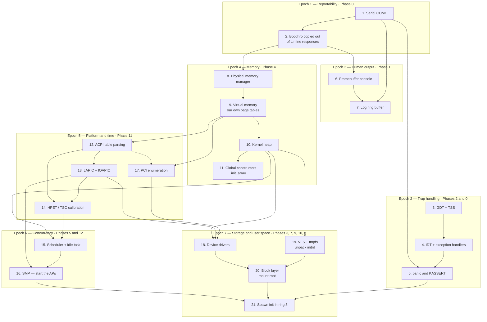

### Walking every box

**Epoch 1 — Reportability.**

- **S1, Serial COM1.** A **UART** (Universal Asynchronous Receiver/Transmitter) is a
  chip that turns a byte inside the machine into a sequence of bits on a wire. The PC's
  is a 16550 at I/O port `0x3F8`. Nine `out` instructions configure it; after that,
  writing a byte makes it leave the machine. It is the root of the graph: nothing
  points at it, because it needs nothing. Built by [[Stage 0.6 - Serial Output]].
- **S2, `BootInfo`.** Limine, the bootloader ([[ADR-0003 - Limine as the Bootloader]]),
  answers a list of requests the kernel embeds in its own image: where the framebuffer
  is, where RAM is, what the direct-map offset is, where the initrd was loaded.
  Those answers live in **bootloader-reclaimable memory** — memory the kernel is
  entitled to take back and reuse later. Step 2 copies every answer into the kernel's
  own `BootInfo` struct in `.bss` (the zero-filled part of the kernel image) so that
  reclaiming that memory later is safe. Built by
  [[Stage 0.3 - Freestanding C++ and kmain]] and [[Stage 0.2 - The Limine Request Section]].

**Epoch 2 — Trap handling.**

- **S3, GDT + TSS.** The **GDT** (Global Descriptor Table) is a table of memory
  descriptors the CPU consults whenever a segment register is loaded; in 64-bit mode it
  has been reduced to little more than "here is a ring-0 code segment, here is a ring-3
  code segment", but the CPU still requires it and still validates selectors against it.
  The **TSS** (Task State Segment) is a structure the CPU reads to find a kernel stack
  when privilege changes, and to find the **IST** (Interrupt Stack Table) — seven
  known-good stacks an interrupt gate can switch to unconditionally. The TSS is named by
  a **16-byte** system descriptor inside the GDT, which is why the two are one step.
  Built by [[Stage 2.1 - The Global Descriptor Table]] and
  [[Stage 2.2 - The TSS and Interrupt Stacks]].
- **S4, IDT + exception handlers.** The **IDT** (Interrupt Descriptor Table) maps each
  of the 256 interrupt **vectors** — numbered reasons the CPU stops what it is doing —
  to a handler address. Vector 0 is divide error, 8 is double fault, 13 is general
  protection, 14 is page fault. Each entry is **16 bytes** in long mode and contains a
  code-segment selector, which is why the arrow runs S3 → S4: the selector must name a
  descriptor in a GDT the kernel controls. Built by
  [[Stage 2.3 - The Interrupt Descriptor Table]] and
  [[Stage 2.5 - CPU Exception Handlers]].
- **S5, `panic` and `KASSERT`.** `panic()` is the deliberate refusal to continue: print
  everything the kernel knows and park the core. `KASSERT` states an invariant and calls
  `panic` when it does not hold. Two arrows point in. S1 → S5 because a panic that
  cannot print is a silent hang. S4 → S5 because without an IDT, a CPU *fault* never
  reaches `panic` at all — it escalates to a triple fault and resets the machine. Built
  by [[Stage 0.7 - Panic and KASSERT]], completed by
  [[Stage 2.5 - CPU Exception Handlers]].

**Epoch 3 — Human output.**

- **S6, Framebuffer console.** A **framebuffer** is a block of memory the display
  hardware scans out as pixels. Limine sets a graphics mode and reports the base
  address, width, height, bits per pixel and **pitch** (the byte distance between the
  start of one row and the next, which is not always `width × bytes-per-pixel`). The
  console rasterises glyphs into it. S2 → S6 because every one of those numbers comes
  from `BootInfo`. There is deliberately **no VGA text mode anywhere**
  ([[ADR-0004 - Framebuffer Console Not VGA Text]]). Built by
  [[Stage 1.1 - The Linear Framebuffer]] through
  [[Stage 1.3 - A Console - Cursor, Colour, Scrolling]].
- **S7, Log ring buffer.** A fixed array of message slots used as if it were an infinite
  list: write to `slot[counter % CAPACITY]`, increment, wrap. Two arrows in, and the
  distinction matters: the *array* works from the first instruction, because it lives in
  `.bss`. What step 7 does is register the **sinks** — serial and the console — that a
  stored line is fanned out to. Built by
  [[Stage 1.5 - The Log Ring Buffer and Levels]] and [[Stage 1.6 - kprintf]].

**Epoch 4 — Memory.**

- **S8, Physical memory manager (PMM).** Divides RAM into 4 KiB **frames** and hands
  them out one at a time. S2 → S8: the free list is built from the memory map inside
  `BootInfo`. Built by [[Stage 4.1 - Reading the Memory Map]] and
  [[Stage 4.2 - The Physical Frame Allocator]].
- **S9, Virtual memory.** The CPU translates every address a program uses through
  **four levels of page tables** (PML4 → PDPT → PD → PT), 4 KiB at a time. Limine hands
  over with paging already on and its own tables installed; step 9 builds *ours* and
  loads `CR3` with it. S8 → S9 because each page table is itself a frame that must be
  allocated. Built by [[Stage 4.3 - Enabling Paging]].
- **S10, Kernel heap.** `kmalloc`/`free` for objects smaller than a frame, at virtual
  base `0xFFFFFFFF00000000`. S9 → S10 because that range must be mapped before the
  first byte of it is touched. Built by [[Stage 4.4 - The Kernel Heap]].
- **S11, Global constructors.** C++ objects at namespace scope that need code to run
  before first use get an entry in a linker section called `.init_array`. In a hosted
  program the C runtime runs that array before `main`. There is no C runtime here, so
  the kernel runs it itself — and it chooses to run it at step 11, **after the heap
  exists**, so that a constructor which allocates works instead of faulting.

**Epoch 5 — Platform and time.**

- **S12, ACPI.** **ACPI** (Advanced Configuration and Power Interface) is a set of
  tables the firmware leaves in memory describing the machine: how many CPUs, where the
  interrupt controllers are, where the high-precision timer is, how PCI config space is
  mapped. S9 → S12 is the interesting arrow and §3.5 is about it. Built by
  [[Stage 11.1 - Finding and Validating ACPI Tables]] and
  [[Stage 11.2 - The MADT and Interrupt Topology]].
- **S13, LAPIC + IOAPIC.** The **LAPIC** (Local APIC) is a per-CPU interrupt controller
  built into each core; the **IOAPIC** routes device interrupt lines to LAPICs. S12 → S13
  because the **MADT** — the ACPI table listing CPUs and interrupt controllers — is the
  only place the IOAPIC's address and the interrupt-routing overrides are written down.
  Built by [[Stage 11.4 - The Local APIC]] and [[Stage 11.5 - The I/O APIC]].
- **S14, HPET / TSC calibration.** Turning "the timer ticked" into "37 nanoseconds
  passed". S12 → S14 for the HPET's address, S13 → S14 because the LAPIC timer is the
  thing being calibrated. Built by [[Stage 11.6 - HPET and TSC Calibration]].
- **S17, PCI enumeration.** Walking the PCI bus to find every device, its **BARs** (Base
  Address Registers — where the device's registers are mapped) and its interrupt
  routing. S9 → S17 because the modern access method, ECAM, is a physical memory window
  that must be mapped. Built by [[Stage 11.3 - PCI Enumeration]].

**Epoch 6 — Concurrency.**

- **S15, Scheduler + idle task.** The code that decides which task runs next, plus a
  task that runs `hlt` when nothing else is runnable. Two arrows in, and they are the
  two halves of what a scheduler is: S10 → S15 for the *what* (task structures and
  kernel stacks are allocated), S14 → S15 for the *when* (a periodic interrupt is the
  only thing that can take the CPU away from a task that will not give it up). Built by
  [[Stage 5.1 - Tasks, Context, and the Stack]] through
  [[Stage 5.3 - Preemptive Scheduling]].
- **S16, SMP.** Starting the **APs** (application processors — every core that is not
  the one the firmware started on). S13 → S16 because waking a core is done by sending
  it an **IPI** (inter-processor interrupt) through the LAPIC. S15 → S16 because a core
  that wakes with no scheduler and no idle task has nothing to do. Built by
  [[Stage 12.1 - Per-CPU Data]] and
  [[Stage 12.3 - Starting the Application Processors]].

**Epoch 7 — Storage and user space.**

- **S18, Device drivers.** Three arrows in: S17 for *where the device is*, S10 for
  buffers, S13 for *delivering its interrupts*. Built across
  [[Phase 3 - Overview]], [[Phase 9 - Overview]] and [[Phase 14 - Overview]].
- **S19, VFS + tmpfs, unpack initrd.** The **VFS** (Virtual File System) is one
  `open`/`read`/`write` interface over many filesystems; **tmpfs** is a filesystem that
  lives in RAM; the **initrd** is a tar archive Limine loaded alongside the kernel. S10
  → S19 because every inode, directory entry and mount record is a heap allocation.
  Built by [[Stage 7.1 - The Initial Ramdisk]] through
  [[Stage 7.3 - The Virtual Filesystem Layer]].
- **S20, Block layer, mount root.** A uniform "read sector N / write sector N" interface
  over any disk, then mounting a real filesystem on it. S18 → S20 for the disk, S19 → S20
  for somewhere to mount it. Built by [[Stage 9.1 - The Block Device Interface]] and
  [[Stage 10.1 - Mounting and the Mount Table]].
- **S21, Spawn `init` in ring 3.** **Ring 3** is the CPU's unprivileged mode. Three
  arrows are drawn, but the honest dependency is *everything*: the loader reads the
  binary through S19/S20, the address space comes from S9, the task comes from S15, the
  kernel stack it traps back onto is named by the TSS from S3, and any failure on the
  way is reported by S5. Built by [[Stage 6.2 - Entering Ring 3]],
  [[Stage 7.4 - Loading and Running an ELF Program]] and
  [[Stage 8.4 - init - Wiring It Together]].

### The reference table

| # | Step | Depends on | Phase | What breaks if it moves earlier |
|---|---|---|---|---|
| 1 | Serial (COM1) | nothing | 0 | Nothing — it is the root. Moving *anything else* above it is the mistake. |
| 2 | `BootInfo` copied out | serial | 0 | Before 1: a null Limine response halts with no output. After 8: the responses have been reclaimed and reused — `0 MiB usable`, or a wild loop over a garbage entry count. |
| 3 | GDT + TSS | — | 2 | Before 1: a bad descriptor triple-faults silently. After 4: the IDT's gates name selectors in a GDT you do not control. |
| 4 | IDT + exceptions | GDT | 2 | Before 3: the first delivered interrupt loads a selector that does not resolve → `#GP` during delivery → `#DF` → triple fault. |
| 5 | `panic` / `KASSERT` | serial, IDT | 0/2 | Before 1: the panic prints nothing. Before 4: only *detected* errors reach it; CPU faults still reset the machine. |
| 6 | Framebuffer console | `BootInfo` | 1 | Before 2: `fb_addr` is zero or garbage, so the first glyph writes to a wild address. Before 1: a black screen with five indistinguishable causes. |
| 7 | Log ring buffer | console, serial | 1 | Before 1 and 6: lines are stored but there is no sink to fan them out to, so nothing is ever seen. |
| 8 | Physical memory manager | `BootInfo` memory map | 4 | Before 2: no map, so no free list — the PMM believes the machine has no RAM. |
| 9 | Virtual memory | PMM | 4 | Before 8: page tables are themselves frames, and there is no allocator to get one from. |
| 10 | Kernel heap | VMM | 4 | Before 9: the heap window at `0xFFFFFFFF00000000` is unmapped and the first `kmalloc` page-faults inside the allocator. |
| 11 | Global constructors | heap | 4 | Before 10: any constructor that allocates faults or silently gets null. |
| 12 | ACPI table parsing | VMM | 11 | Before 9: pointers saved into Limine's address space become dangling the instant `CR3` is reloaded. |
| 13 | LAPIC + IOAPIC | ACPI (MADT) | 11 | Before 12: the IOAPIC address and the ISA-IRQ overrides are unknown, so device IRQs are routed by guesswork. |
| 14 | HPET / TSC calibration | ACPI, LAPIC | 11 | Before 13: there is no LAPIC timer to calibrate. Before 12: there is no reference clock of known frequency to calibrate *against*. |
| 15 | Scheduler + idle task | heap, timer | 5 | Before 10: no task structures, no kernel stacks. Before the timer: cooperative only — one task that loops freezes the machine. |
| 16 | SMP — start APs | LAPIC, scheduler, per-CPU | 12 | Before 15: an AP wakes with nothing runnable. Before per-CPU areas: the AP's first `this_cpu()` reads through an unset `GS` base. |
| 17 | PCI enumeration | VMM (MMCONFIG) | 11 | Before 9: the ECAM window is unmapped. Before 12: the `MCFG` table that names the ECAM base has not been read. |
| 18 | Device drivers | PCI, heap, IRQs | 3/9/14 | Before 13: a driver enables a device interrupt that has nowhere to be delivered. Before 10: no DMA or descriptor buffers. |
| 19 | VFS + tmpfs, initrd | heap | 7 | Before 10: inodes, dentries and the mount table have nowhere to live. |
| 20 | Block layer, mount root | drivers, VFS | 9/10 | Before 18: no device to read sectors from. Before 19: no mount point to attach a filesystem to. |
| 21 | Spawn `init` in ring 3 | everything | 8 | Before 3: no TSS, so the first syscall from ring 3 has no kernel stack to land on and double-faults. |

> [!warning] The rule that carries the whole table
> **Serial output works from step 1, so any failure from step 2 onward is reportable.**
> Everything else in the ordering is negotiable in principle. This is not. Move serial
> to step 6 "because the framebuffer is nicer to look at" and you have converted every
> Phase 0 through Phase 4 bug into the same symptom: a machine that resets in a loop and
> tells you nothing. [[09 - Testing Strategy]]'s CI harness reports that as
> `TIMEOUT — kernel hung`, which is also what a deadlock, an infinite loop, and forty
> other causes report.

---

## 3. Zooming in

### 3.1 Step 1 — the reportability floor

Serial is first because it is the only output device on a PC that depends on **nothing
at all**: no memory map, no page tables, no `BootInfo`, no font, no arithmetic on a
pitch value, no interrupt table. Here is what it actually reaches, from the kernel down
to the pins.

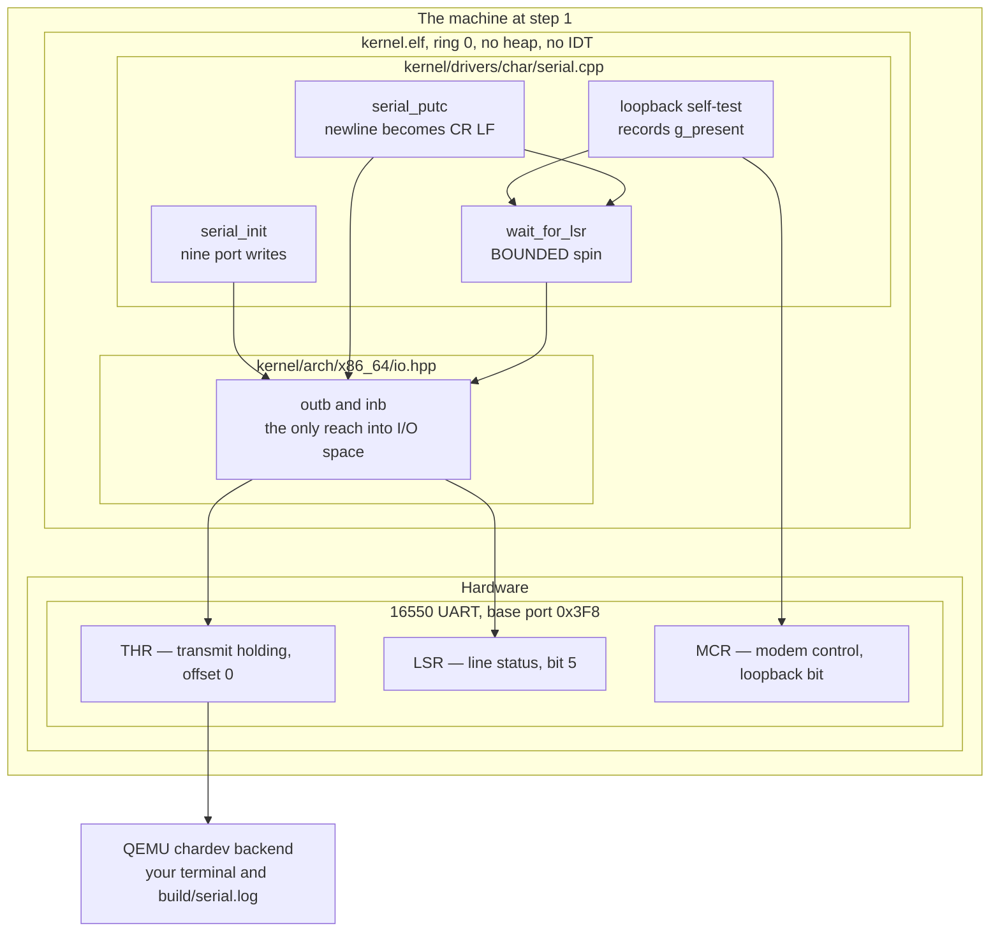

Three levels of nesting, and each level is a real boundary. **`MACHINE`** contains
everything; **`KERNEL`** is the software half and **`HW`** the silicon half; inside the
kernel, **`SERIALDRV`** is portable driver logic and **`ARCHIO`** is the one place in the
tree allowed to contain inline assembly ([[07 - Repository Layout]] rule 1), because
x86's I/O ports live in a *separate address space* that no C++ pointer can name.

Walking the arrows. `SINIT` → `OUTB`: initialisation is nine `out` instructions and
nothing else — set the baud divisor, set 8N1 framing, enable the FIFOs, raise DTR/RTS.
`STEST` → `MCR`: the self-test sets the UART's loopback bit so the transmitter feeds the
receiver, writes `0xAE`, and reads it back; an absent UART returns `0xFF` because an
undecoded I/O port floats high, so the test fails correctly with no special case.
`STEST` → `SWAIT` and `SPUTC` → `SWAIT`: both wait on the line-status register, and both
use the *bounded* spin. `SWAIT` → `OUTB`: each poll is a genuine fresh `inb`, which is
why the `volatile` on that inline asm is load-bearing rather than decorative. `SPUTC` →
`OUTB`: after the wait succeeds, one byte goes to the transmit holding register. `THR` →
`HOST`: the byte leaves the machine. That last arrow is the entire point of the step —
**evidence that has left the machine survives the machine's death.**

> [!warning] The unbounded spin is how "no output" becomes "no output *and* a hang"
> `while ((inb(base + 5) & 0x20) == 0);` is the version in most tutorials. On a machine
> where the line-status register reads `0x00` forever — a UART held in reset, one the
> firmware disabled, an emulator configured without one — it never returns. The machine
> appears to hang at boot with no output, and the reason it produces no output is that
> it is stuck inside the code that produces output. `panic()` calls this function.
> A panic handler that can hang is worse than no panic handler, because it converts a
> diagnosable fault into a silent freeze. Bound the loop.

> [!example] What step 1 actually prints, and why it is not "hello world"
> The greeting is four lines: kernel name and version; framebuffer geometry and address;
> memory region count and total usable MiB; the HHDM offset. Each retires a distinct
> risk. Line 1 proves the port is programmed. Line 2 proves Limine answered the
> framebuffer request and the numbers match `boot/limine.conf`. Line 3 proves the memory
> map was copied and can be walked — and booting with `-m 128M` versus the default turns
> that into a real check rather than a plausible-looking number. Line 4 proves the
> direct-map request was honoured, which everything in Phase 4 depends on. "Hello world"
> proves only line 1 and defers the other three to the phase where they are expensive.

### 3.2 Steps 3, 4, 5 — the trap triangle

These three exist to answer one question: *what happens when the CPU hits something it
cannot execute?* Without them the answer is "the machine resets".

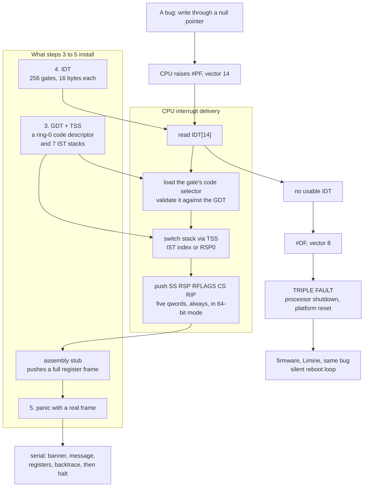

Walking it. `BUG` → `PF`: a write through a null pointer is a page fault, vector 14.
`PF` → `LOOKUP`: the CPU indexes the IDT with the vector. That single arrow is where the
whole triangle is decided. If step 4 has run, `LOOKUP` succeeds and control continues
down the left spine; if it has not, control takes the `NOIDT` branch.

Down the successful path: `LOOKUP` → `SEL`, the gate contains a code-segment selector and
the CPU validates it against the currently loaded GDT — **this is the S3 → S4 arrow from
§2, made concrete**. `SEL` → `STACK`: the gate may name an IST index, in which case the
CPU switches to one of the seven known-good stacks the TSS points at, unconditionally and
before pushing anything. `STACK` → `PUSH`: in 64-bit mode the CPU always pushes five
qwords — `SS`, `RSP`, `RFLAGS`, `CS`, `RIP` — with an error code for some vectors.
`PUSH` → `STUB` → `PANIC` → `REPORT`: the assembly stub saves the general-purpose
registers into a frame, calls into C++, and `panic` prints an exact report — exact
because the frame was captured at the instant of the fault rather than reconstructed
afterwards.

Down the failure path: `LOOKUP` → `NOIDT` → `DF`, because failing to deliver an
exception is itself an exception. `DF` → `TRIPLE`: delivering the double fault needs the
same table, fails the same way, and the processor gives up. `TRIPLE` → `SILENT`: the
platform resets, firmware runs, Limine runs, your kernel runs, your bug happens again.

Two orderings fall out of this diagram and neither is arbitrary.

**Why the IDT needs the GDT.** The `GDT` → `SEL` and `GDT` → `STACK` arrows. A gate does
not hold a bare function address; it holds a selector plus an offset, and the selector is
resolved through the GDT at *delivery* time. Load an IDT whose gates name selector `0x08`
while a GDT you do not control is active, take one interrupt, and the delivery itself
raises `#GP`. You have built a fault-handling mechanism whose first act is to fault.

> [!warning] Do not rely on the bootloader's GDT
> Limine hands over in long mode with paging on and a valid stack, but the descriptor
> tables it leaves behind are its own. Treat `IDTR` as containing nothing you may rely
> on, and load your own GDT before anything reads a selector out of it. Check the
> `PROTOCOL.md` for the Limine revision you pinned (`v8.6.0-binary`) for exactly what is
> and is not guaranteed at handoff — this is a fact to verify, not to assume.

**Why panic is step 5 and not step 1.** Panic has two dependencies and they arrive at
different times. Serial (step 1) gives it a *voice*; the IDT (step 4) gives it *ears*.
With only serial, `panic()` catches errors the kernel **detects** — an explicit call, a
failed `KASSERT` — and that is genuinely useful from Phase 0 onward. What it cannot catch
is a CPU **fault**, because a fault is delivered through the IDT or not at all. Step 5
sits after step 4 so that the moment exception handlers exist, they have somewhere to
report to; the reporting half is written first, in [[Stage 0.7 - Panic and KASSERT]],
precisely so that Phase 2 is debuggable while you build the catching half.

> [!question] Why is `panic` not simply step 2?
> It could be, and the kernel would work. The reason to number it 5 is that the number
> records its *capability*, not its file order: a panic handler before the IDT is a
> partial panic handler, and pretending otherwise leads people to expect a page fault in
> Phase 3 to produce a report. Numbering it after the IDT is documentation.

### 3.3 Steps 6 and 7 — why the screen is sixth

The framebuffer console is the output humans actually want. It is step 6, five steps
after a text channel that only appears in a terminal window. Here is the concrete reason.

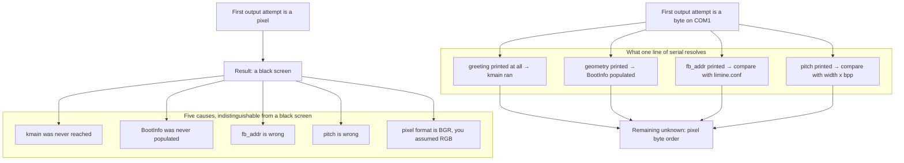

Walking it. The top half is the failure the ordering avoids: `START` → `BLACK` → five
causes, and the arrows fan out because a black screen is *the same observation* for all
five. You cannot bisect between them, because the only diagnostic instrument available
is the thing that is broken. People lose weekends here rewriting correct display code on
a machine where `kmain` never ran.

The bottom half is what step 1 buys. `SERIALFIRST` fans out to four *answers* rather
than four hypotheses, and they converge on `LEFT`: one remaining unknown, the pixel byte
order, which is a two-minute experiment once you can print. Four of five causes are
retired by four `serial_write_hex` calls that were already in the greeting.

There is a second, less obvious property. **A framebuffer console shows the last thing
drawn; the screen is cleared by the reset that follows.** Serial output has already left
the machine — the CI harness runs QEMU with `-serial file:build/serial.log`, so by the
time the kernel dies the evidence is a file on the host. That is why the test script can
print the last 60 lines of the log on failure, and why serial is the only channel CI can
read at all.

**Step 7 and the sink/store distinction.** The log ring is a static array in `.bss`, so
writing into it works from the very first instruction — before `serial_init()`, before
the console, before the memory manager. What step 7 establishes is the *fan-out*: the
ring stores the line first and only then pushes it at whatever sinks are registered.
Order matters here for exactly the reason it matters everywhere else in this document —
if the device write came first and the device wedged, the line would be lost *and* the
machine hung. Banking the evidence before attempting anything risky is the same
reliability gradient that orders the eight steps inside `panic()` itself.

> [!warning] The back buffer is a pre-heap allocation problem
> [[Stage 1.4 - Double Buffering]] wants roughly 4 MiB for a pixel back buffer, and the
> heap is step 10. The answer is not to move the console after step 10 — it is a static
> array in `.bss`, sized for a maximum mode, with an unbuffered fallback if the real mode
> is larger. This is the general technique for everything that needs memory before step
> 10: `.bss` costs zero bytes in `kernel.elf` because it is a `NOBITS` section, and the
> ELF loader zero-fills it. The log ring (64 KiB) and `BootInfo` (~3.8 KiB) use the same
> trick.

### 3.4 Steps 8 to 11 — the memory staircase

Four steps, each strictly on top of the last, and the only place in the graph where the
chain is a straight line with no branches. That is not a coincidence: each step *is* the
allocator for the next.

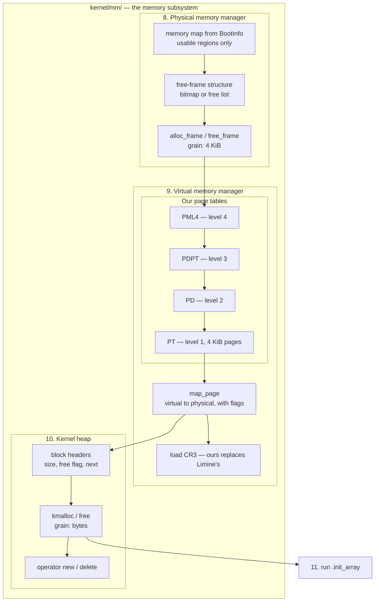

Three levels again: `MM` → `VMM` → `TABLES` → the four page-table levels.

Walking it. `MAP` → `FREELIST`: the PMM walks `BootInfo`'s region array and marks every
frame in a `USABLE` region free. `FREELIST` → `ALLOCF`: that structure is what
`alloc_frame` hands out of. `ALLOCF` → `PML4`: the first customer of the frame allocator
is the page-table code, because **a page table is a frame** — one 4 KiB frame per table,
and a fresh mapping may need up to four of them. `PML4` → `PDPT` → `PD` → `PT` is the
hardware's own walk: the CPU splits a 48-bit virtual address into four 9-bit indices plus
a 12-bit offset and dereferences one table per index. `PT` → `MAPPAGE`: `map_page` is the
software that installs an entry at the bottom of that walk. `MAPPAGE` → `CR3`: once our
tables describe everything the kernel needs — the kernel image at `0xFFFFFFFF80000000`,
the **HHDM** (a direct map of all physical RAM at `0xFFFF800000000000`, so any physical
address is reachable as `hhdm_offset + phys`), the per-CPU window at
`0xFFFF900000000000` — we load `CR3` and Limine's tables stop being the active ones.

`MAPPAGE` → `BLOCKS`: the heap's virtual window at `0xFFFFFFFF00000000` is mapped page by
page as it grows. `BLOCKS` → `KMALLOC` → `NEWDEL`: a first-fit walk over block headers,
splitting and coalescing, with `operator new` layered on top so C++ allocation works.
`KMALLOC` → `CTORS`: and only now, at step 11, is it safe to run the constructor array.

> [!warning] The failure that looks like a heap bug and is a paging bug
> `kmalloc` returns a pointer, you write through it, and the machine page-faults inside
> the allocator. The heap logic is fine; the heap *grew* into a page nobody mapped.
> Growing the heap means calling `map_page` for the new range **before** the first byte
> of it is touched, and `map_page` in turn calls `alloc_frame`, so a heap grow is an
> allocation that recurses two layers down the staircase. Get the order wrong inside
> that path and the fault happens in `kmalloc`, which is the last place you will look.

**Why step 11 is where it is.** In a hosted C++ program the C runtime walks `.init_array`
before `main` and you never think about it. Freestanding, there is no C runtime: the
kernel calls the array itself, which means the kernel chooses *when*. Placing it after
step 10 makes a constructor that allocates work correctly instead of faulting on a
nonexistent heap.

That does **not** make global constructors safe to depend on, and
[[13 - Coding Standards]] rule 9 still bans them:

```cpp
Scheduler g_sched;                    // NO — order across translation units is undefined
Scheduler& scheduler() {              // yes — explicit init, called in the documented order
    static Scheduler* s = nullptr;
    return *s;
}
```

The two facts fit together like this. **Ordering between constructors in different
translation units is undefined by the language**, and no placement of the array fixes
that; if `mm`'s global depends on `sched`'s global you have a bug the linker decides. So
the kernel initialises subsystems by explicit `init()` calls in the order this document
describes. Step 11 exists anyway, because the compiler will emit `.init_array` entries
whether you planned them or not — a namespace-scope object with a non-trivial
constructor, a function-local `static` with a runtime initialiser — and running the array
after the heap turns an accidental entry into something that works rather than something
that faults. Step 11 is a safety net, not a mechanism you build on.

> [!question] What is the symptom of never running `.init_array` at all?
> Not a crash. `.bss` is zero-filled, so the object exists and every field reads as
> zero — a null pointer, an empty container, a count of 0. The code runs, does nothing,
> and returns success. That is strictly worse than a fault, and it is why the atlas
> numbers this step rather than leaving it implicit.

### 3.5 Steps 12, 13, 14, 17 — the platform, and why ACPI waits for our page tables

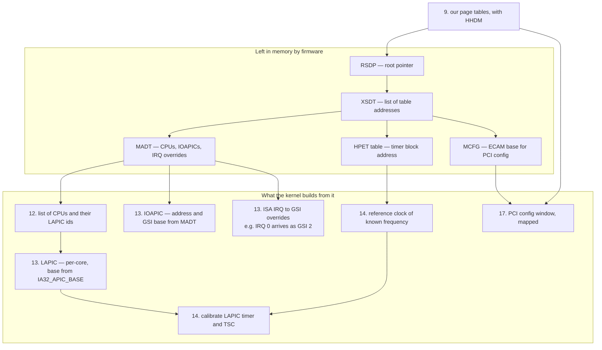

Walking it. `RSDP` → `XSDT`: ACPI is a linked structure — a **root pointer** found in a
firmware-defined region, pointing at a table of pointers to every other table, each
identified by a four-character signature and validated by a checksum. `XSDT` → `MADT`,
`HPETT`, `MCFG`: three of those tables matter to initialisation, and each feeds a
different step.

`MADT` → `CPULIST`, `IOAPIC`, `OVERRIDE` is step 13's dependency in full. The LAPIC's own
base address is readable from the `IA32_APIC_BASE` MSR without ACPI at all, so it is not
the LAPIC that forces the ordering — it is everything *around* it. How many cores exist,
where the IOAPIC is, and how legacy ISA interrupt lines map onto **GSIs** (Global System
Interrupt numbers, the IOAPIC's own numbering) are written down only in the MADT. The
canonical example is the interrupt source override that maps ISA IRQ 0 — the timer — onto
GSI 2. Program the IOAPIC without reading it and you unmask the wrong input: the timer
interrupt never arrives, and the scheduler at step 15 never preempts anything.

`HPETT` → `CLOCK` → `CAL` and `LAPIC` → `CAL` is step 14. The LAPIC timer counts at the
core crystal or bus frequency, which is **not architecturally discoverable** on most
parts; the TSC counts at a fixed rate that is likewise not directly readable on older
CPUs. So you calibrate: run a counter of *unknown* rate against a counter of *known*
rate for a fixed interval and divide. The known rate comes from the HPET, whose main
counter period in femtoseconds is published in its capability register, or from the PIT
at 1.193182 MHz. On newer parts `CPUID` leaf `0x15` gives the TSC-to-crystal ratio
directly — verify against the Intel SDM for the parts you target before relying on it.

`MCFG` → `ECAM` and `VMM9` → `ECAM` is step 17. PCI configuration space has two access
methods: the legacy `0xCF8`/`0xCFC` port pair, which needs no mapping at all, and **ECAM**
(also called MMCONFIG), a physical memory window where each device's config space is a
4 KiB region. ECAM is required for PCIe and for any config register above offset 0xFF,
its base address comes from the `MCFG` table, and being a physical window it must be
mapped — which is both arrows. The dashed `S12 -.-> S17` edge in §2's diagram is this
one: [[06 - Architecture Overview]] lists step 17 as depending on the VMM, and that is
the dependency that bites, but the address being mapped came out of ACPI.

**Now the arrow that surprises people: `VMM9` → `RSDP`.** ACPI tables are in physical
memory, and Limine already provides a direct map, so why not parse them at step 3?
Because at step 9 the kernel loads `CR3` with page tables of its own. Any pointer into
Limine's address space that was saved before that instant is a pointer whose *meaning
depends on a page table that is no longer active*. If our HHDM happens to cover the same
range at the same offset, it keeps working — by luck, and only until someone changes the
HHDM base or the firmware places a table somewhere our early map does not cover. Parsing
after step 9 makes the dependency explicit instead of accidental.

> [!warning] The Limine reclaim trap, stated in full
> Limine's response structures and the memory they point at live in
> **bootloader-reclaimable** memory. Step 2 copies out everything the kernel will ever
> need for exactly this reason. Steps 8 and 9 are where that memory becomes eligible for
> reuse, so **any pointer into bootloader memory that survives past step 8 is a bug that
> will not manifest until the heap is busy enough to hand that page to someone else** —
> typically weeks later, as a corrupt page table or a nonsensical memory total. The
> initrd is the case to check by hand: `BootInfo` records where the module *is*, but
> whether the bytes themselves are safe from the PMM depends on how your
> `collect_boot_info()` and your free-list construction treat module ranges. Verify it
> rather than assuming it.

### 3.6 Steps 15 and 16 — the scheduler needs exactly two things

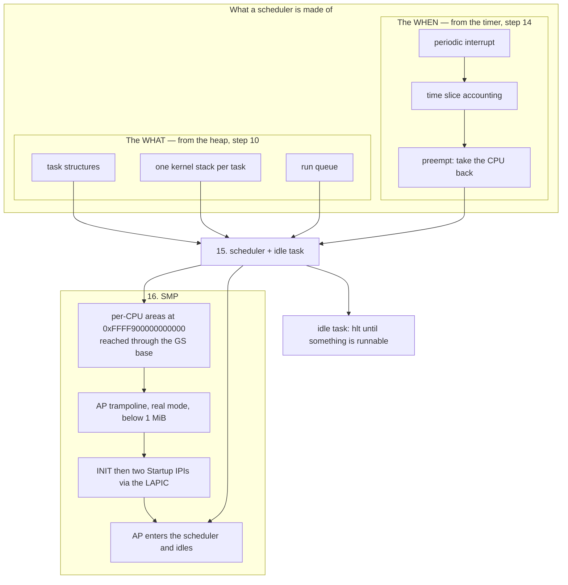

Walking it. The `WHAT` subgraph is everything the scheduler allocates: a task structure
per task, a kernel stack per task (a whole page or more, from the frame allocator via the
heap), and a run queue. All three arrows land on `SCHED`, and all three are why step 15
is after step 10. Fixed global arrays would technically avoid the heap — and that is
exactly the thing the kernel stops doing once `kmalloc` exists, because a fixed maximum
task count is a limit you discover at the worst moment.

The `WHEN` subgraph is the other half. `TICK` → `SLICE` → `PREEMPT` → `SCHED`:
**preemption is a hardware fact, not a software one.** The only way to take the CPU away
from a task that does not cooperate is for a device to interrupt it. Without a timer you
have cooperative multitasking: tasks that call `yield()` share the machine, and one task
with a `while (1)` loop freezes it forever. [[Stage 5.2 - Cooperative Task Switching]]
builds the cooperative version deliberately, because context switching and preemption are
two separate hard problems and debugging them simultaneously is worse than debugging them
in sequence.

`SCHED` → `IDLE`: the idle task exists so the scheduler never has to answer "what if
nothing is runnable". It always has something to pick, and that something executes `hlt`,
which stops the core until the next interrupt instead of spinning.

The `SMP` subgraph is step 16 and its internal order is itself a dependency chain.
`SCHED` → `PERCPU`: per-CPU areas at `0xFFFF900000000000`, reached through the `GS` base
register, so that `this_cpu()` resolves differently on each core. They must exist
**before** an AP runs a single line of shared kernel code, because almost every kernel
primitive — the current task pointer, the local run queue, the lock-held depth — is
per-CPU. `PERCPU` → `TRAMP`: application processors start in **real mode**, the CPU's
16-bit startup mode, so the code they land on must live in a page below 1 MiB and must be
identity-mapped in whatever page tables it eventually loads. `TRAMP` → `IPI`: waking a
core means sending an INIT inter-processor interrupt followed by two Startup IPIs whose
vector names that trampoline page. `IPI` → `APRUN`, and `SCHED` → `APRUN`: the AP climbs
from real mode to long mode, loads the kernel's page tables and its own per-CPU area, and
enters the scheduler — which must already exist, or the core has arrived somewhere with
nothing to do and no idle task to fall back on.

> [!warning] "The APs never check in"
> Three causes, in order of likelihood. The trampoline is not identity-mapped in the page
> tables the AP loads, so it faults the instant it turns paging on. The per-CPU area is
> not set up before the AP's first `this_cpu()`, so it dereferences through a zero `GS`
> base. Or the MADT was misparsed and the LAPIC id you sent the IPI to does not exist.
> All three produce the same observation — a core that never prints — which is why
> [[Stage 12.3 - Starting the Application Processors]] has the AP write a byte to a known
> address at each stage of the climb.

### 3.7 Steps 18 to 21 — the last mile

The final four steps are ordinary dependency work with one genuinely subtle item.

- **18, drivers.** Needs *where* (PCI, step 17), *memory* (heap, step 10), and
  *delivery* (IRQs, step 13). Enabling a device's interrupt before its handler is
  installed is the classic ordering bug in this step: the device fires, the vector is
  unhandled, and depending on what is in that IDT slot you get either a spurious
  interrupt storm or a fault.
- **19, VFS + tmpfs, unpack initrd.** Needs the heap. Also needs the initrd's location,
  which came from `BootInfo` at step 2 — an S2 → S19 edge the overview's table omits
  because the heap dependency dominates, but worth holding in mind alongside the reclaim
  warning in §3.5.
- **20, block layer, mount root.** Needs a driver to talk to a disk and a VFS to mount
  onto. Until [[Stage 10.8 - Booting From Disk]], the root filesystem is the initrd, and
  step 20 is where that stops being true.
- **21, spawn `init` in ring 3.** Depends on everything, and the non-obvious part is that
  it *reaches back to step 3*. Entering ring 3 needs user code and data descriptors in
  the GDT; returning from ring 3 into the kernel needs `TSS.rsp0` to name a valid kernel
  stack, because the CPU reads it from the TSS on every privilege change. The TSS
  structure is built at step 3 for the IST stacks; its `rsp0` field only becomes
  load-bearing at step 21, which is why [[Stage 2.2 - The TSS and Interrupt Stacks]] and
  [[Stage 6.1 - The Task State Segment]] are both about the same structure at different
  moments of its life.

The syscall path is configured here too, and it is register-level detail worth stating
once because it catches everyone. The kernel uses `syscall`/`sysret`, not `int 0x80`
— the MSRs `STAR`, `LSTAR` and `SFMASK` name the entry point and the flags to clear, and
`EFER` bit 0 (`SCE`) enables the instruction at all. Arguments go in `rdi`, `rsi`, `rdx`,
`r10`, `r8`, `r9` — **`r10`, not `rcx`**, because the `syscall` instruction itself
clobbers `rcx` with the return address.

### 3.8 What is available at step N

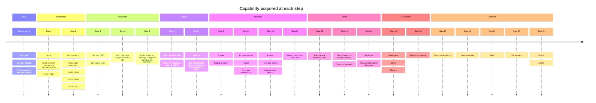

Read this as an inventory rather than a schedule. The question it answers is the one you
ask when a bug lands: *what could I have used to see this?* If the fault is at step 9,
the answer is serial, panic with a real exception frame, the console, and the log ring —
but not `kmalloc`, not a timer, not a second core. That constrains both the bug and the
debugging technique. If the fault is at step 2, the answer is serial and nothing else,
which is why the greeting prints raw hex through a hand-rolled formatter rather than
through `kprintf`.

Two entries deserve a second look. **Step 5 is where the machine stops lying to you** —
before it, the observable behaviour of every fault is identical (reset); after it, each
fault has a vector, an address and a call chain. And **step 14, not step 3, is where
"real time" begins**: before calibration the kernel can count interrupts but cannot
convert them into seconds, so `sleep(1s)` is guesswork.

### 3.9 The critical path

A DAG has a **critical path**: the longest chain of dependencies, which is the sequence
that determines how much work must happen strictly in order. Everything else can, in
principle, be moved around it.

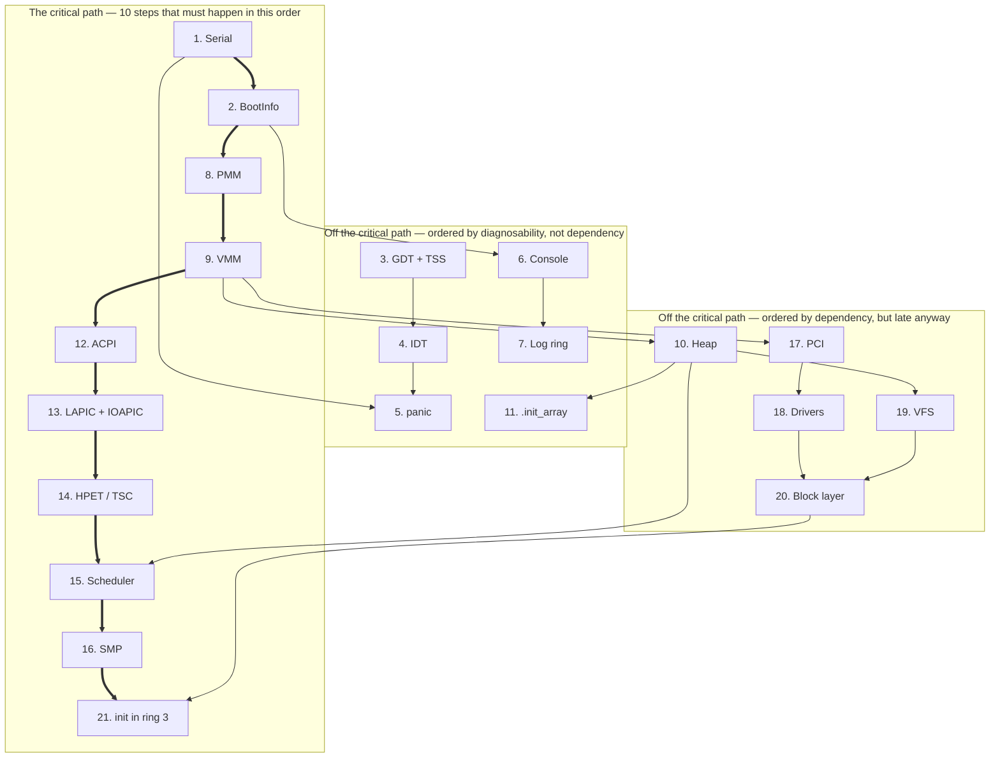

Walking it. The thick chain `P1 ⇒ P2 ⇒ P8 ⇒ P9 ⇒ P12 ⇒ P13 ⇒ P14 ⇒ P15 ⇒ P16 ⇒ P21` is
the spine: serial, then facts about the machine, then physical memory, then virtual
memory, then the platform description, then interrupt routing, then time, then
scheduling, then the other cores, then user space. Ten of the twenty-one steps. Nothing
in that chain can be reordered by any amount of cleverness, because each link is a hard
data dependency: you cannot allocate a frame without knowing where RAM is, cannot build a
page table without a frame, cannot map the ACPI tables without page tables, cannot find
the IOAPIC without the MADT, cannot calibrate a timer without a reference clock, cannot
preempt without a timer.

The `LATE` subgraph hangs off the spine with ordinary dependencies — `P9 → L10 → P15`,
`P9 → L17 → L18 → L20 → P21`, `L10 → L19 → L20`. These are constrained but not critical:
the heap could be built before ACPI or after it and nothing would notice.

The `OFF` subgraph is the point of the whole document. **Steps 3, 4, 5, 6, 7 and 11 are
not on the critical path, and steps 3 to 7 could all be deferred to just before step 21
without violating a single dependency arrow.** The kernel would boot. It would simply be
undebuggable for the entire interval where it is most likely to be wrong. They are early
because a broken machine that can describe itself is worth more than a fast boot, and
that is a *diagnosability* argument, not a dependency argument.

> [!question] Which steps could you genuinely swap without breaking anything?
> 6 and 7 with 8, 9 and 10 (the console and log ring do not need memory management).
> 11 with 12, 13, 14 (nothing between them interacts). 17 anywhere after 12. 19 anywhere
> after 10. Now ask the follow-up: for each swap, does the machine get better or worse at
> telling you what went wrong? That question, not the dependency graph, is what fixed the
> published order.

---

## 4. The data structures

The initialisation order is not encoded in a table anywhere — it is the literal statement
order of `kernel_init()`. What *is* encoded in data structures is the handful of things
that make the order work: the copied-out boot facts, the registration hooks that let a
late subsystem attach itself to an early one, and the frames the panic path walks.

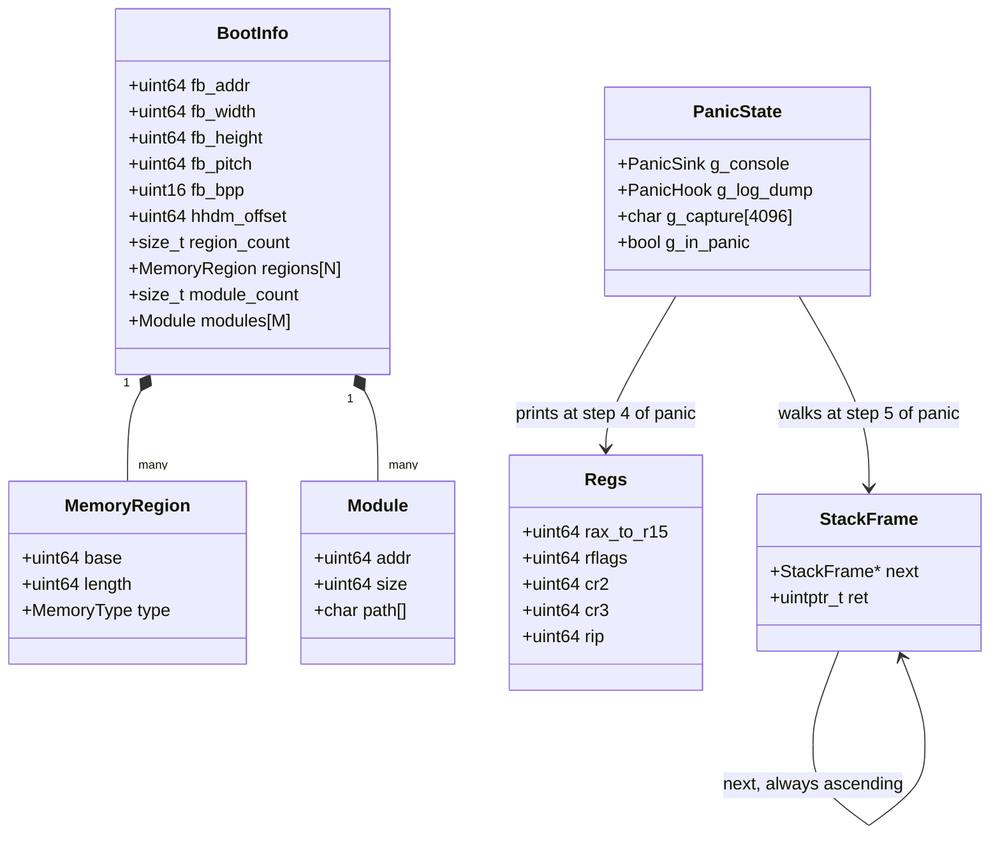

`BootInfo` **owns** its regions and modules — that is what the filled-diamond composition
means, and it is the entire content of step 2. Fixed arrays, not pointers, not a
`kstd::vector`: `collect_boot_info()` runs at step 2 and the heap is step 10, so there is
nothing to allocate from. The capacities are constants you choose and enforce.

`StackFrame` points at itself, which is the frame-pointer chain: `rbp` holds the address
of a two-word structure whose first word is the caller's `rbp` and whose second is the
return address. Walking it is how the backtrace works, and the self-arrow is annotated
*always ascending* because "stacks grow down" is one of the six predicates that must hold
before a frame is dereferenced.

`PanicState` → `Regs` and `PanicState` → `StackFrame` are the two things a panic prints,
in that order, because reading registers cannot fault and dereferencing a frame pointer
can.

### Field notes

| Structure | Lives in | Created at | Why it has that shape |
|---|---|---|---|
| `BootInfo` | `.bss`, ~3.8 KiB | Step 2 | No heap exists; fixed arrays and plain scalars only, so nothing needs to run to construct it |
| `MemoryRegion[]` | inside `BootInfo` | Step 2 | Consumed by the PMM at step 8, long after Limine's own copy is gone |
| `Module[]` | inside `BootInfo` | Step 2 | Records where the initrd is, consumed at step 19 |
| `Regs` | `.bss`, static | Step 5 (on use) | Static rather than local: the stack may be the corrupted thing, and a link-time address means each capture needs no scratch register |
| `g_capture[4096]` | `.bss` | Step 5 (on use) | The panic report is buffered as it goes to serial, then replayed to the console *last* — so a console fault cannot cost you the serial report |
| `PanicSink` / `PanicHook` | function pointers | Registered at steps 6 and 7 | Dependency inversion, see below |
| `IdtEntry[256]` | `.bss` | Step 4 | **16 bytes each** in long mode; must persist, so never a local |
| `LogLine[256]` | `.bss`, 64 KiB | Valid from instruction zero | A static ring works before any device exists — which is the property that makes "log before console" possible |

> [!note] Field spellings are yours
> `fb_width`, `region_count`, `hhdm_offset` and the `MemoryType` enum are names chosen in
> [[Stage 0.3 - Freestanding C++ and kmain]]. Open
> `kernel/include/kernel/boot_info.hpp` and use what is actually there. The *shape* is
> what this document asserts: an aggregate of scalars and fixed arrays, in `.bss`, with
> no constructor.

**Why the panic hooks are function pointers.** In the subsystem map in
[[06 - Architecture Overview]], `drivers/` sits *above* `lib/`, and the dependency rule is
that a layer may call downward and sideways but never upward. `panic.cpp` lives in `lib/`
and must be able to print to a framebuffer console that lives in `drivers/`. Calling it
directly would be an upward call. Inverting it costs one function pointer: the console
registers itself when it initialises at step 6, and `panic.cpp` never learns that a
framebuffer exists. The null check that step 7 of the panic sequence needs comes free —
before step 6, the pointer is null and the console step is skipped.

This is the general shape of every "a late subsystem enriches an early one" relationship
in the boot order. The early subsystem exposes a registration point; the late subsystem
fills it in when it comes up; the early subsystem's behaviour degrades gracefully when it
is empty. The alternative — an early subsystem that calls a late one — is an ordering
dependency that the type system cannot see and the linker will happily accept.

---

## 5. The flows

### 5.1 Cold boot, happy path

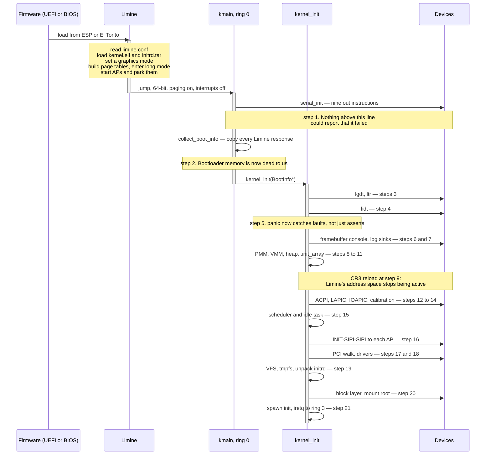

Walking it. Firmware finds Limine on the EFI system partition or through El Torito and
runs it. Limine reads its config, loads the kernel and the initrd, sets a graphics mode,
builds page tables, enters long mode, and starts the application processors only to park
them — that last detail matters, because it means step 16 is *re-*starting cores rather
than starting them cold.

Control reaches `kmain` already 64-bit with paging on and interrupts disabled, with a
valid stack. **No long-mode trampoline is written anywhere in this kernel**, which is a
substantial chunk of traditional OS-development work that [[ADR-0003 - Limine as the Bootloader]]
deletes outright.

The first thing `kmain` does is `serial_init()`. The `Note` marks the invariant: nothing
may be placed above that line, because nothing above it could report its own failure.
Then `collect_boot_info()`, after which the bootloader is irrelevant — the second `Note`
is the reclaim boundary from §3.5.

`kernel_init` then runs the remaining nineteen steps, and the activation bar shows why
this is a *sequence* and not a *system*: exactly one thread of control exists until step
16. There is no concurrency to reason about, no lock to take, no interrupt to race
with — interrupts are still disabled and stay disabled until the IDT is loaded and the
controllers are configured. This is the calmest the kernel will ever be, and it is why
so much is done here rather than lazily later.

### 5.2 A failure at step 9, reported

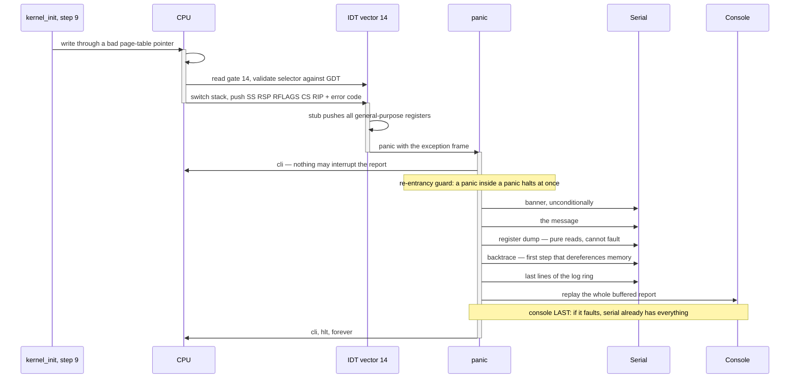

Walking it. The fault is raised with `CR2` holding the faulting address — the one piece
of state that makes a page fault diagnosable, and the reason `CR2` is in the register
dump. Delivery goes through the IDT gate, which validates its selector against the GDT
and may switch to an IST stack; the CPU pushes five qwords plus an error code, and the
assembly stub completes the frame by pushing the general-purpose registers. That frame is
what makes the report *exact*: the values are the values at the instant of the fault, not
reconstructed afterwards.

Inside `panic`, the order is a **reliability gradient** — each step is more likely to fail
than the one above it, so each is placed after everything it could destroy. `cli` first,
because it is one instruction that cannot fail. The banner second, unconditionally, so
the log says *something* even if everything below it dies. The message third, because it
is the most valuable line and formatting touches only the format string. Registers
fourth, because reading a register cannot fault. The backtrace fifth, because it is the
first step that dereferences memory. The log ring sixth, because a corrupt ring would
otherwise eat the backtrace. The console **last**, because it is the most code, the most
MMIO and the most arithmetic — and because the report was buffered rather than mirrored,
a console fault at that point costs nothing that has not already left the machine.

The `Note` about re-entrancy is the backstop for the one thing the frame predicates
cannot check: whether a plausible-looking address is actually *mapped*. If the backtrace
faults, the second entry into `panic` halts immediately instead of recursing into a
triple fault.

### 5.3 Boot as a state machine

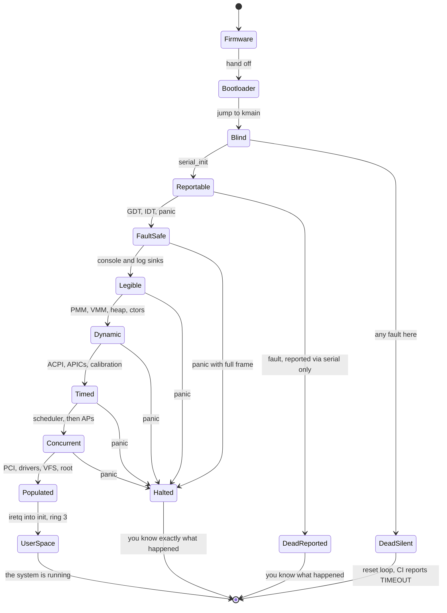

Walking it. The forward spine — `Firmware` → `Bootloader` → `Blind` → `Reportable` →
`FaultSafe` → `Legible` → `Dynamic` → `Timed` → `Concurrent` → `Populated` → `UserSpace`
— is the twenty-one steps grouped by what the machine can *do*. The interesting content
is the transitions that leave it.

**`Blind` → `DeadSilent`** is the only bad terminal state in the diagram, and it is the
state the entire ordering exists to shrink. It is reachable during exactly one window:
between `kmain` and `serial_init()`. That window is a handful of instructions long *by
design*.

**`Reportable` → `DeadReported`** is what a fault looks like between steps 1 and 4: the
machine still resets, because there is no IDT, but the serial log ends at a known point
and the last line tells you roughly where. Not a report, but a bisection.

**Every state from `FaultSafe` onward** exits to `Halted` rather than to `DeadSilent`.
That is the shape of the whole design: after step 5, a fault is a paragraph of text and a
parked core, not a reset. Notice that `Halted` and `DeadSilent` are both terminal and both
mean "the kernel stopped", but one of them tells you why. That difference is worth five
steps of careful ordering.

---

## 6. Why it is shaped this way

### The ordering principle

| Option | How it works | Cost | Verdict |
|---|---|---|---|
| **A (chosen) — one hand-written `kernel_init()`, numbered steps, documented order** | Twenty-one statements in a function, each commented with its step number | The order is a convention a reviewer must enforce; no mechanism prevents a bad insertion | ✅ |
| B — initcall-style link-section table | Each subsystem registers a constructor with a priority level; a loop walks the section | The order becomes implicit in link order plus magic priority constants; failures happen inside a loop with no context; needs `.init_array`-style machinery *before* the heap | ❌ |
| C — runtime dependency-graph resolver | Subsystems declare their dependencies; a topological sort runs at boot | The resolver needs data structures before step 10, and a bug in it is a bug in the thing that starts everything | ❌ |

**Why A.** The order is a *design artefact*, and design artefacts belong somewhere a
human reads. Twenty-one statements in one function, with the step number in a comment and
this document as the explanation, is legible in a way a priority constant is not. It also
degrades honestly: inserting a step in the wrong place produces a fault you can see, in a
function you are already looking at.

**Why not B.** Linux's initcall levels are the model, and they work at Linux's scale
because the alternative is unmanageable. At this scale they buy nothing and cost the two
things that matter most in early boot: legibility and the ability to report a failure at a
specific named point. There is also a bootstrapping problem — a link-section walker is
structurally the same machinery as step 11, and steps 1 to 10 all need to run before it.

**Why not C.** A dependency resolver is a data structure, and every data structure before
step 10 must be static and fixed-size. You would be writing a graph library that runs
before the allocator exists, to order the initialisation of the allocator. The circularity
is not fatal but it is absurd.

**When B becomes right.** When subsystems are loadable rather than compiled in — modules,
drivers discovered at runtime, an out-of-tree driver that must slot into the order without
editing `kernel_init()`. That is a post-1.0 concern and it arrives with its own phase.

### The four decisions this document exists to justify

| Decision | Rejected alternative | What specifically breaks |
|---|---|---|
| Serial is step 1 | Framebuffer first | A black screen has five indistinguishable causes and no instrument to separate them; a reset erases the screen but not a host-side log file. [[ADR-0004 - Framebuffer Console Not VGA Text]], [[Stage 0.6 - Serial Output]] §3 |
| Panic is step 5, not step 2 | Panic as early as possible | It would be a partial panic handler that catches asserts but not faults, and people would trust it to catch faults. The number encodes the capability |
| Framebuffer console is step 6, not step 1 | Console first because it is what humans look at | It depends on `BootInfo`, a font, and pitch arithmetic — three things that can each be wrong — while serial depends on nothing |
| `.init_array` at step 11, not before `kmain` | Run constructors the way a hosted C runtime does | Every constructor that allocates would fault; a function-local `static` would call `__cxa_guard_acquire`, which does not exist in a freestanding build |

### What the rejected alternatives look like in practice

**Framebuffer first.** You write correct display code. It produces nothing. You rewrite
it. It produces nothing. Three days later you attach the QEMU monitor and discover `RIP`
is in Limine, because a null response check failed at step 2 and the kernel never reached
your display code at all. Every hour of that was spent on the one subsystem that was
already correct.

**Panic first.** `panic()` at step 2 prints. `KASSERT` works. Then in Phase 3 a keyboard
driver dereferences a null pointer, the machine resets, and the reasonable inference —
"panic works, so this is not a fault" — is wrong. The correct model is that panic's
coverage grew at step 4, and numbering it 5 is how the model is written down.

**Constructors before the heap.** The symptom is not a crash. `.bss` is zeroed, so an
object whose constructor never ran has null pointers and zero counts, and the code using
it takes the "empty" branch and returns success. You discover it three phases later when a
container that should have had entries has none.

---

## 7. How this grows across the phases

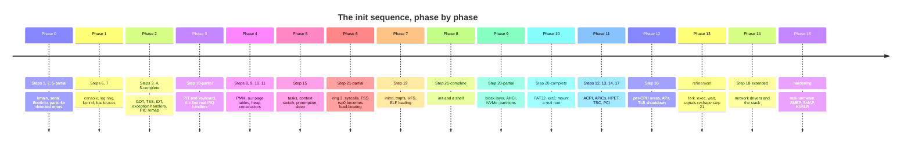

Walking it. Read down the second column and the ordering looks scrambled: Phase 0 builds
steps 1 and 2, Phase 1 builds 6 and 7, Phase 2 builds 3, 4 and 5, Phase 4 builds 8 to 11,
and Phase 11 — the eleventh phase of sixteen — builds steps 12, 13, 14 and 17, which run
before the scheduler that Phase 5 wrote.

**That mismatch is deliberate and it is worth sitting with.** The step number is a
*runtime* order. The phase number is a *build* order. They are different questions:
"what must exist before this can work?" versus "what can I usefully build next?" A
scheduler on a PIT interrupt (Phase 5, using [[Stage 3.1 - The Programmable Interval Timer]])
is a real scheduler you can test years before the LAPIC timer exists; when Phase 11
arrives it substitutes a better clock underneath an interface that already works.

The deliberate gaps in the early sequence, and why each is acceptable:

- **No timer until Phase 3.** Steps 1 to 11 are a straight-line sequence with no
  concurrency at all, so nothing needs to be preempted and nothing needs to sleep.
- **No heap until Phase 4.** Everything before it is a fixed-size static: `BootInfo`
  (~3.8 KiB), the log ring (64 KiB), the console's back buffer (~4 MiB), the IDT, the GDT.
  All in `.bss`, all costing zero bytes in `kernel.elf`.
- **The PIC before the APIC.** [[Stage 2.6 - The 8259 PIC - Remap and Mask]] remaps the
  legacy controller so its vectors do not collide with CPU exceptions, and Phase 11
  masks it off entirely in favour of the IOAPIC. The intermediate step is not wasted
  work; it is the only interrupt controller that works before ACPI is parsed.
- **One core until Phase 12.** Every lock in the kernel is written from Phase 5 onward as
  though SMP existed, because retrofitting locking is the thing that
  [[Stage 12.5 - Auditing the Kernel for Races]] exists to survive.
- **No ACPI until Phase 11.** The kernel runs on hardcoded legacy assumptions — COM1 at
  `0x3F8`, PIT at `0x40`, PS/2 at `0x60` — which are true of every PC-compatible machine
  and every emulator. Phase 11 is where "PC-compatible" stops being enough.

---

## 8. Failure modes

Symptom first. This is the section to read at 2am.

### The reporting capability curve

Which channels exist to tell you about a failure, as a function of where the failure
happens.

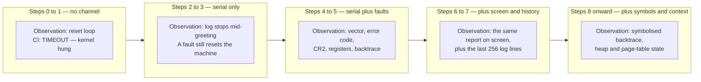

Walking it. Each band is a *diagnostic budget*, and the arrows are one-way: the budget
only grows. `B0` has nothing — a fault is a reset and the reset erases the evidence. `B1`
has a text channel that survives the reset, which converts "it hangs" into "it hangs after
this exact line". `B2` is the qualitative jump: a fault stops being a reset and becomes a
report with a vector number, an error code, `CR2`, sixteen registers and a call chain.
`B3` adds the screen (useful on hardware with no UART) and the log ring's history (useful
when the interesting line scrolled away thirty lines ago). `B4` adds the things that need
memory management — symbol resolution ([[Stage 1.7 - Symbolised Backtraces]]), and dumps
of the allocator's and page tables' own state.

**The whole argument of this document is the `B0` → `B1` arrow, and how few instructions
long band `B0` is.**

### Symptom table

| Symptom | Likely cause | First thing to check |
|---|---|---|
| Machine resets in a loop, no output at all | A fault before step 4, or before step 1 | Attach the QEMU monitor and read `RIP`. Is it even in your `.text`? |
| CI says `TIMEOUT — kernel hung` | Anything in band `B0`, or a genuine hang | `build/serial.log` — does it contain the greeting? |
| Absolutely nothing on serial, host CPU at 100% | Unbounded spin in `wait_for_lsr`, or DLAB left set so every character rewrites the baud divisor | Is the spin bounded? Does step 5 of `serial_init` write `0x03` and not `0x83`? |
| Serial works but QEMU shows nothing | `-serial` not wired to a backend | The UART is emulated regardless; the bytes are going somewhere you are not looking |
| Greeting prints, then silence | A fault between steps 2 and 4 — reported by absence, not by message | The last line printed brackets it to one subsystem |
| `memory: 0 MiB usable` | `BootInfo` read after step 8 reclaimed it, or the memory map was never copied | Print the region count in the greeting; if the count is huge or zero, you are reading reclaimed memory |
| Screen black, serial fine | A step 6 problem only — the kernel is healthy | `fb_addr`, `pitch`, and pixel byte order, in that order |
| Page fault inside `kmalloc` | The heap grew into unmapped pages | Does the grow path call `map_page` before the first touch? |
| An object's fields are all zero and nothing crashed | `.init_array` never ran, or the object's constructor ran before its dependency's | Rule 9 — replace the global with explicit `init()` |
| `sleep(1)` takes twelve seconds | LAPIC timer uncalibrated, or calibrated against a reference of assumed frequency | Step 14. Print the measured ticks-per-second |
| Timer IRQ never arrives after enabling the IOAPIC | MADT interrupt source override ignored — ISA IRQ 0 often arrives as GSI 2 | Step 13. Dump every MADT entry you parsed |
| Serial IRQ never arrives (Phase 3) | UART `MCR` bit 3 (`OUT2`) clear — it gates the UART's interrupt line onto IRQ 4 | Step 1's init sequence, `MCR = 0x0B` |
| An AP never checks in | Trampoline not identity-mapped, per-CPU area unset, or wrong LAPIC id | Step 16. Have the AP store a progress byte at each stage |
| `init` faults immediately on entering ring 3 | `TSS.rsp0` wrong, or user pages lack the USER bit | Steps 3 and 21 together |
| Everything worked for weeks, then random corruption after adding a feature | A retained pointer into bootloader-reclaimable memory | Grep for anything holding a Limine response outside `kernel/arch/x86_64/boot/` — CI enforces this, so the leak is probably a *copy* of an address rather than a pointer |

> [!warning] The failure with the longest fuse
> Holding a pointer into bootloader-reclaimable memory past step 8 works perfectly
> through Phases 0 to 3 (nothing has allocated), works in Phase 4 on the first run (the
> PMM reads the map to *build* the free list, and only then adds reclaimable pages to
> it), and breaks weeks later once the heap is busy enough to hand that page out. The
> page becomes a slab, or a page table, or a task struct, and your "entry count" is now
> whatever integer sits at that offset. `git bisect` lands on a commit with nothing to do
> with the failure. Copy at step 2 and the entire category cannot occur.

> [!warning] Symptom aliasing is the real enemy
> Note how many rows in the table share the observation "nothing happens". That is the
> disease this ordering treats. Every step you move earlier in the sequence takes its
> failures out of the "nothing happens" bucket and gives them a distinct symptom — which
> is why the cheapest possible reporting channel goes first, and why the expensive,
> attractive one waits until it can be built safely.

---

## 9. Masterclass notes

> [!question] Discussion prompts
> 1. The DAG in §2 admits thousands of valid topological sorts. Name three constraints
>    *other than dependencies* that pick this one, and find a step whose position is
>    justified by each.
> 2. Steps 3 through 7 could all be deferred to just before step 21 without violating a
>    single arrow. Argue the case for doing exactly that on a kernel that must boot in
>    under 50 ms, and then say what you would give up.
> 3. `panic()` needs serial and the IDT. Serial needs nothing. The IDT needs the GDT. Why
>    is `panic` not simply split into two steps — a serial-only version at 2 and a
>    fault-catching version at 5 — and what would you name them?
> 4. Step 11 runs `.init_array` after the heap, yet [[13 - Coding Standards]] rule 9 bans
>    global objects with constructors. Both are correct. Reconcile them, then describe the
>    bug that occurs if you delete step 11 entirely.
> 5. The ACPI tables are readable from the moment Limine hands over. Why does step 12 wait
>    for step 9, and what precisely goes wrong in the version that does not wait? Your
>    answer must mention `CR3`.

- [ ] You understand this when you can draw the 21-step DAG from memory, with the arrows,
      and name the root and the critical path
- [ ] You understand this when you can explain why serial is step 1 and the framebuffer
      console is step 6 without saying "because it is simpler"
- [ ] You understand this when you can state, for any step N, exactly which diagnostic
      channels exist at that point
- [ ] You understand this when you can explain why panic is step 5 rather than step 2 in
      terms of *coverage*, not convenience
- [ ] You understand this when you can predict the symptom — not just "it breaks" — of
      swapping any adjacent pair of steps

**Board plan.** Draw it in this order; it builds the argument rather than presenting it.

1. A single box: `kmain`. Ask the room: what can this machine tell you right now?
   (Nothing.) Write `RESET` under it.
2. Add box 1, `Serial`, with no incoming arrows. Say the sentence: *it depends on
   nothing, which is why it is first.*
3. Add box 2, `BootInfo`, with the arrow from 1. Write the rule on the board:
   **serial works from step 1, so every failure from step 2 onward is reportable.**
4. Draw the triangle 3 → 4 → 5 off to one side. Add the escalation path
   `#PF → #DF → triple fault → reset` in a different colour. This is the "why 5, not 2"
   moment.
5. Add 6 and 7 *below* 5, and ask why the thing humans look at is sixth. Elicit the five
   black-screen causes from the room.
6. Draw the memory staircase 8 → 9 → 10 → 11 as a literal staircase. One arrow, one step,
   no branches. Point out that each step is the allocator for the next.
7. Add 12 → 13 → 14 and the arrow back from 9 to 12. Spend a minute on `CR3` — this is
   the subtlest arrow on the board.
8. Add 15 with its two arrows (heap and timer) and say: *the what and the when.*
9. Add 16 through 21 quickly; they are ordinary.
10. Finally, trace the critical path in thick strokes and circle the boxes that are *not*
    on it. Close with: those are the ones ordered by diagnosability, and they are why
    this kernel is debuggable.

**Time budget:** 45 minutes — 10 on the DAG, 10 on the trap triangle, 10 on the memory
staircase, 8 on the platform and `CR3`, 7 on the critical path and the close.

---

## 10. Related

[[06 - Architecture Overview]] · [[07 - Repository Layout]] · [[13 - Coding Standards]] ·
[[14 - Debugging Playbook]] · [[09 - Testing Strategy]] · [[04 - Glossary]]

**Stages that build these steps:**
[[Stage 0.2 - The Limine Request Section]] ·
[[Stage 0.3 - Freestanding C++ and kmain]] ·
[[Stage 0.6 - Serial Output]] ·
[[Stage 0.7 - Panic and KASSERT]] ·
[[Stage 1.1 - The Linear Framebuffer]] ·
[[Stage 1.4 - Double Buffering]] ·
[[Stage 1.5 - The Log Ring Buffer and Levels]] ·
[[Stage 2.1 - The Global Descriptor Table]] ·
[[Stage 2.2 - The TSS and Interrupt Stacks]] ·
[[Stage 2.3 - The Interrupt Descriptor Table]] ·
[[Stage 2.5 - CPU Exception Handlers]] ·
[[Stage 4.1 - Reading the Memory Map]] ·
[[Stage 4.2 - The Physical Frame Allocator]] ·
[[Stage 4.3 - Enabling Paging]] ·
[[Stage 4.4 - The Kernel Heap]] ·
[[Stage 5.3 - Preemptive Scheduling]] ·
[[Stage 6.2 - Entering Ring 3]] ·
[[Stage 12.3 - Starting the Application Processors]]

**Decisions:**
[[ADR-0002 - Target x86_64 Not i686]] ·
[[ADR-0003 - Limine as the Bootloader]] ·
[[ADR-0004 - Framebuffer Console Not VGA Text]] ·
[[ADR-0007 - Freestanding C++20 as the Kernel Language]] ·
[[ADR-0010 - Testing Strategy and the QEMU Exit Device]]
