# 06 — The Subsystem Map

> [!abstract] What this document covers
> The kernel is not one program. It is nine directories stacked into a cake, where
> each layer may call the layers beneath it and its own neighbours, and may never
> call the layers above it. This document draws that cake, maps every box to a
> directory in the source tree, and shows the four walls CI builds around it with a
> `grep` so the shape survives contact with a deadline.

**Zoom level:** System
**Built by:** [[Stage 0.9 - CI From Day One]]
**Prerequisites:** [[06 - Architecture Overview]] · [[07 - Repository Layout]]
**Masterclass session:** 1 (see [[19 - The Eight-Hour Masterclass]])

---

## 1. The one-sentence version

**Every piece of the system has a rank, calls only downward or sideways, and CI
fails the build when a file is in the wrong place.**

The expanded version. An operating system is a large program with no supervisor —
nothing above it catches its mistakes, and every part of it can, at the instruction
level, reach every other part. The only thing standing between that and an
unmaintainable ball of mud is a *layering discipline*: a total ordering of the
subsystems, plus a rule about which direction calls are allowed to travel. The
ordering is the subsystem map. The rule is "downward and sideways, never upward".
The enforcement is four `grep` steps in a CI job that runs on every push. Everything
else in this document is detail on those three sentences.

Two words used throughout, defined now because the rest of the atlas assumes them:

- **Kernel** — the program that runs with full hardware privilege (**ring 0** on
  x86_64: it may execute any instruction, touch any physical address, and disable
  interrupts). There is exactly one, and it is always resident.
- **Userspace** — every other program (**ring 3**: privileged instructions fault,
  and it can only see the memory the kernel has mapped for it). `init`, `sh`, `cat`
  are userspace. The kernel is not a library they link; it is a service they call
  across a hardware privilege boundary.

---

## 2. The picture

This is the diagram to memorise. Everything else in this document is a zoom into one
of its boxes.

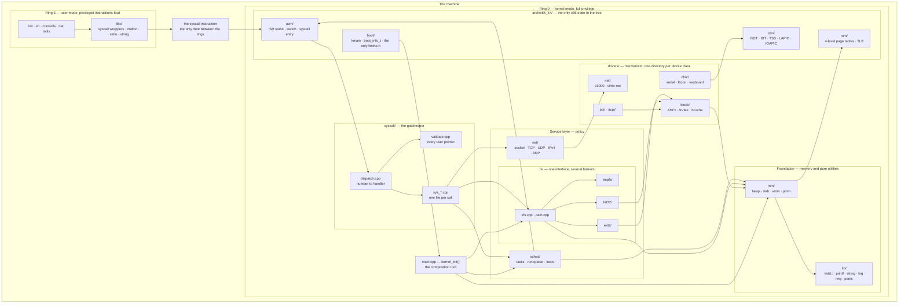

### Walking the picture

**`MACHINE`** is the outer frame: one physical computer, one CPU (until Phase 12),
and one virtual address space at a time. Everything in the diagram lives inside it.

**`RING3` — the user band.** `APPS` is every program that is not the kernel: `init`
(the first process, PID 1), `sh` (the shell), and the coreutils. `LIBC` is our own C
library. The arrow `APPS --> LIBC` says user programs do not talk to the kernel
directly — they call `write()` or `open()`, and libc turns that into the machine
instruction that crosses the ring boundary. That indirection is what lets us change
the syscall convention without recompiling every program.

**`GATE` — the `syscall` instruction.** The one arrow `LIBC --> GATE` is the entire
attack surface of the kernel. There is no other way in from ring 3. Not a call, not
a jump, not a shared page — one instruction, which the CPU implements by loading a
kernel entry point and a kernel privilege level out of registers configured at boot
([[Stage 6.3 - The System Call Interface]]). Drawn as a box rather than an arrow
because it is a piece of hardware, not a piece of our code.

**`GATE --> AASM`** is the surprising arrow, and it is the first proof that the
layers are about *dependencies*, not about *control flow*. The `syscall` instruction
lands in `kernel/arch/x86_64/asm/syscall.asm` — the very **bottom** of the cake —
because only assembly can switch stacks and save the user register state. It then
calls **upward** into `syscall/dispatch.cpp`. That is legal because it is a
*hardware-driven entry*, not a subsystem reaching for a service it should not know
about. §3.6 covers the general form of this.

**`BAND_SYS` — `syscall/`, the gatekeeper.** `DISPATCH` maps the number in `rax` to
a handler. `SYSFNS` are the handlers, one file per call. `VALIDATE` is the box that
matters: every pointer that arrives from ring 3 is checked to be canonical, below
the user ceiling, and actually mapped, before anything dereferences it. `DISPATCH -->
VALIDATE` and `DISPATCH --> SYSFNS` are the two things dispatch does. A missing check
in `VALIDATE` is a full kernel compromise; it is the most security-critical file in
the tree.

**`BAND_SVC` — the service layer.** Three peers, each owning one policy question.
`SCHED` decides *who runs*. `FS` decides *what a file is*. `NET` decides *what a
connection is*. They are drawn side by side because they are the same rank: none of
them is beneath another.

Inside `FS` is the diagram's deepest nesting, and it is the standard trick of the
whole subsystem: `VFS` (the Virtual File System — one `open`/`read`/`write`
interface) sits above three concrete filesystems. `VFS --> TMPFS`, `VFS --> FAT32`,
`VFS --> EXT2` are the three implementations of that interface. The caller never
knows which one it got. Adding ext4 is a fourth arrow, not a change to anything
above.

**`BAND_DRV` — `drivers/`.** Mechanism, as opposed to the policy above it. A driver
knows how to make one device do one thing and has no opinion about why. `DCHAR` is
character devices (a stream of bytes: serial port, framebuffer console, keyboard).
`DBLOCK` is block devices (fixed-size sectors: AHCI and NVMe disks, plus `bcache`,
the block cache). `DNET` is network cards. `DBUS` is the discovery machinery — PCI
enumeration and ACPI table parsing — which is why `DBUS --> DBLOCK`: PCI finds the
AHCI controller and hands the driver its base address.

`FAT32 --> DBLOCK` and `EXT2 --> DBLOCK` are the service layer reaching down for
mechanism: a filesystem asks for sector 4096 and does not care whether an SSD or a
spinning disk answers. `NET --> DNET` is the same shape for packets.

**`BAND_FOUND` — the foundation.** `MM` is memory: the physical frame allocator
(hands out 4 KiB frames of real RAM), the virtual memory manager (address-space
objects), the heap (`kmalloc`/`free`), and the slab allocator. Nearly everything
above allocates, which is why `SCHED --> MM`, `VFS --> MM` and `DBLOCK --> MM` all
converge here. `LIB` is pure utility code with no state of its own worth speaking
of: our `kstd::` containers, `printf` formatting, `string` functions, the log ring
buffer, and `panic`. `MM --> LIB` because the allocator formats diagnostics.

**`BAND_ARCH` — `arch/x86_64/`.** The floor. Every x86-specific fact in the entire
repository lives in these four directories and nowhere else. `ACPU` holds the tables
the CPU reads (GDT, IDT, TSS) and the interrupt controllers (LAPIC, IOAPIC). `AMM`
walks and writes 4-level page tables. `AASM` is hand-written assembly: the 256
interrupt stubs, the context switch, the syscall entry. `ABOOT` is the entry point
and the only place in the tree that has ever heard of Limine.

`MM --> AMM` is the load-bearing split of the whole memory subsystem: the *decision*
about which page to map is architecture-neutral and lives in `mm/`; the *act* of
writing a PTE is x86 and lives in `arch/x86_64/mm/`. That split is why the allocator
arithmetic can be unit-tested on your laptop ([[09 - Testing Strategy]]).
`SCHED --> AASM` is the same split for tasks: the run queue is portable, the register
save/restore is not. `DCHAR --> ACPU` is the serial driver reaching for the port-I/O
helpers, the only instructions that can talk to a UART.

**`MAIN` — `kernel_init()`, the composition root.** `ABOOT --> MAIN` is the handover:
`kmain` copies the bootloader's answers into our own `boot_info_t` and calls into
architecture-neutral code. `MAIN --> SCHED`, `MAIN --> VFS`, `MAIN --> MM` (and a
dozen more not drawn) are `kernel_init` bringing each subsystem up in the order
mandated by [[06 - Architecture Overview]]. **This one file is exempt from the
dependency rule**, and deliberately so: something has to know about everything in
order to wire it together, and confining that knowledge to a single file is the whole
point of having a composition root.

> [!warning] The arrow that is not on this diagram
> There is no arrow from `MM` up to `FS`. In a mature kernel there would be — that is
> what swapping is: the memory manager, out of RAM, asking the filesystem to write a
> page to disk. We do not have swap in v1, and the reason the rule is written as
> "`mm/` must never call `fs/`" rather than left implicit is that the day someone
> adds swap, they must add it as an *inverted* dependency (§3.6) rather than as an
> `#include`. Get that wrong and every filesystem operation can recurse into the
> allocator that called it.

---

## 3. Zooming in

Each subsection takes one band from §2 and opens it.

### 3.1 The user band — and why libc is not part of the kernel

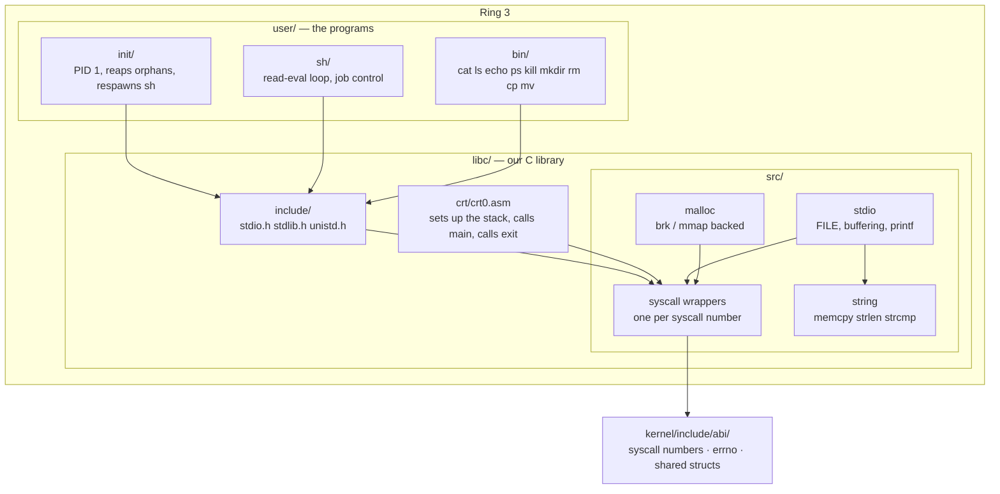

**Walking it.** `PROGS` is `user/` in the source tree, split into the two special
programs (`init/`, `sh/`) and the interchangeable ones (`bin/`). All three arrow into
`LIBINC`, the public headers — a user program includes `<stdio.h>`, never a kernel
header.

Inside `LIBC`, `CRT` is `crt0.asm`, the code that runs *before* `main`: it arranges
the stack the way the C standard requires, calls `main`, and calls the `exit` syscall
with whatever `main` returned. `CRT --> WRAP` because `exit` is a syscall like any
other.

`LIBSRC` holds the four kinds of thing a libc does. `WRAP` is the thin part: one
function per syscall, each loading `rax` with the number and the arguments into
`rdi, rsi, rdx, r10, r8, r9`, executing `syscall`, and turning a negative return into
`errno`. `MALLOC --> WRAP` and `STDIO --> WRAP` because both are implemented *on top
of* syscalls — `malloc` gets memory by asking the kernel, `printf` gets output by
calling `write`. `STDIO --> STR` because formatting needs `memcpy`. Everything else
in libc is ordinary portable C that happens to run in ring 3.

`WRAP --> ABI` is the only arrow leaving the ring-3 box, and it points at a **kernel**
directory. That is intentional and is boundary rule 4 (§6.2.4): the syscall numbers
are one table, physically stored under `kernel/include/abi/`, and libc includes *from*
there. The reverse — the kernel including something from `libc/` — is forbidden and
greppable.

**Why libc is userspace.** It is tempting to think of libc as "part of the OS", and in
a sense it is: we ship it, we version it with the kernel ([[ADR-0008 - Monorepo Layout]]). But it executes in ring 3, in the calling process's address space, using
the process's memory. A bug in `malloc` corrupts one process. If the same code lived
in the kernel, the same bug would corrupt the machine. The privilege boundary is the
layer boundary.

Built by [[Stage 6.4 - A Minimal User C Library]] and [[Stage 8.4 - init - Wiring It Together]].

---

### 3.2 The gatekeeper — `syscall/`

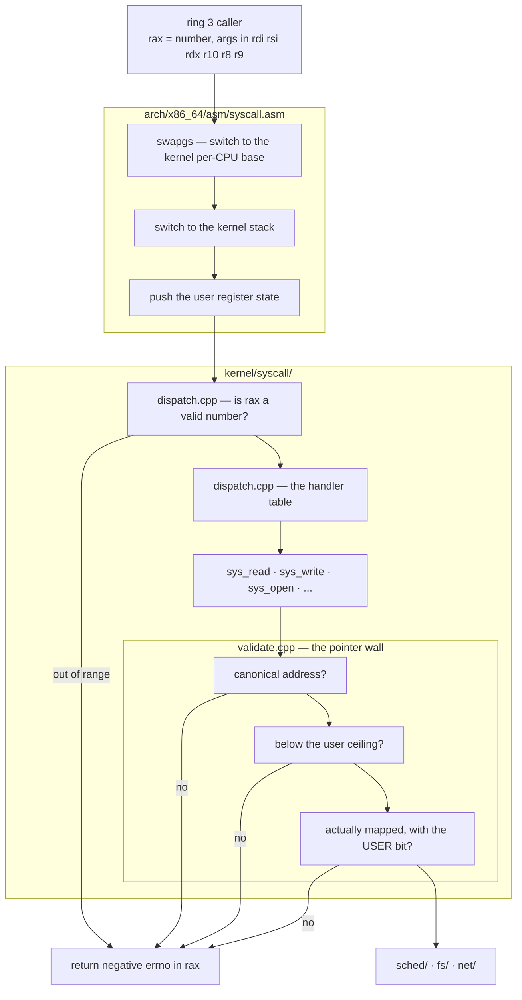

**Walking it.** `USER` is the state at the moment `syscall` executes: the call number
in `rax` and up to six arguments in registers. Note `r10`, not `rcx` — the `syscall`
instruction overwrites `rcx` with the return address, so the fourth argument had to
move. This catches everyone exactly once.

`ARCHENTRY` is three steps of assembly that must happen before a single line of C++
can run. `SWAPGS` exchanges the `GS` base register so per-CPU data points at kernel
structures instead of whatever userspace had there. `STACKSW` moves off the user stack
— which is attacker-controlled and may be a single unmapped page — onto this task's
kernel stack. `SAVE` pushes the user's registers so they can be restored on return.
Skipping any of these three is a security hole, and all three are architecture-
specific, which is why they are in `asm/` at the bottom of the cake.

`SYSCALL` is where portable C++ resumes. `BOUNDS` checks that `rax` indexes inside
the table; a number out of range returns `-ENOSYS` rather than jumping through
whatever happened to be past the end of the array. `TABLE` is the array of function
pointers. `HANDLER` is the individual `sys_*` function.

`VAL` is the box that justifies the whole layer. A user pointer is three separate
lies until proven otherwise, and the three nodes are the three proofs. `CANON` — is
it a canonical 48-bit address at all, or is it in the non-canonical hole between
`0x0000800000000000` and `0xFFFF800000000000`? `CEIL` — is it below the user ceiling,
or is userspace asking the kernel to read a kernel address on its behalf? `MAPPED` —
is there actually a page there with the USER bit set, or will dereferencing it fault
in kernel context? Any "no" short-circuits to `EFAULT`, the negative-errno return.
Only a pointer that survives all three reaches `SERVICES`.

**Why this is a layer and not a helper.** Everything above the syscall band is
untrusted; everything below it is trusted. Concentrating the transition in one
directory means there is exactly one place to audit and exactly one place where a new
kernel developer must be careful. If validation were scattered into the individual
subsystems, the security property would be "every `fs/` author remembered", which is
not a property.

Built by [[Stage 6.3 - The System Call Interface]].

---

### 3.3 The service layer — three peers, and what sideways means

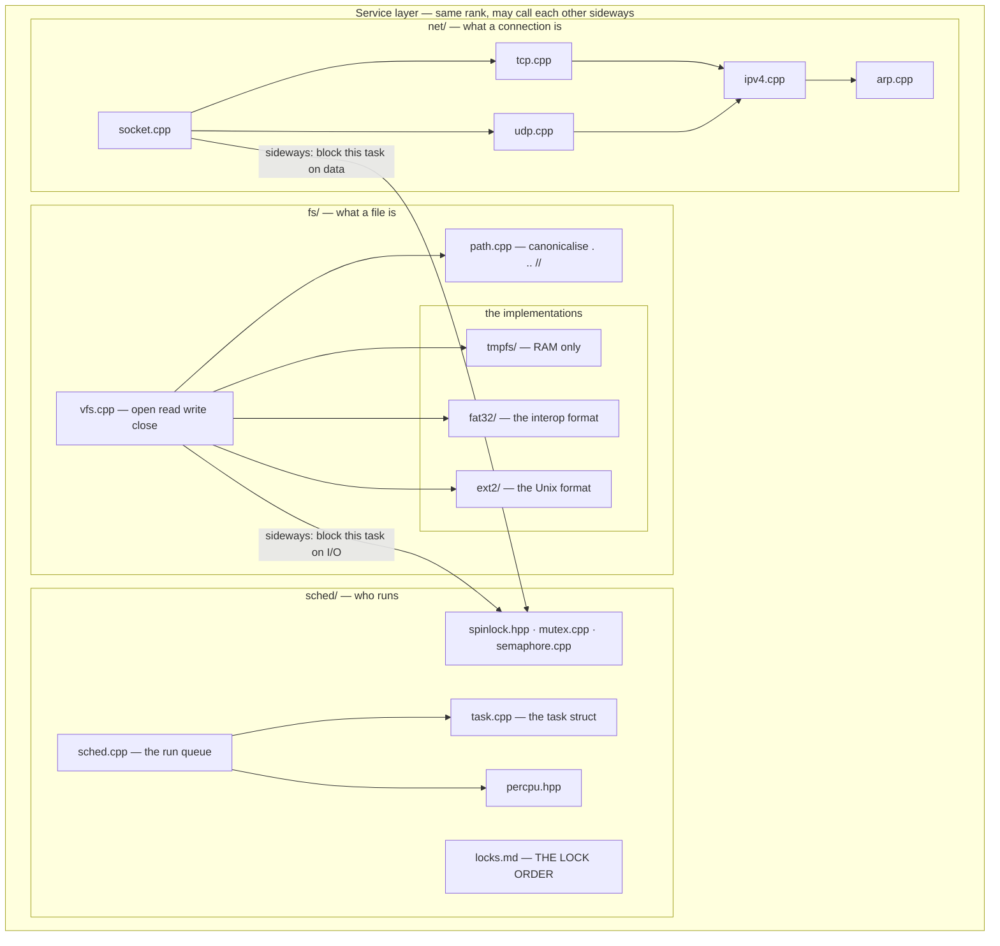

**Walking it.** Three subsystems, three questions, one rank.

`SCHED` first. `TASK` is the structure describing one unit of execution — its saved
registers, its kernel stack, its state. `RQ` is the run queue and the decision of who
runs next; `RQ --> TASK` because picking a task means reading task structures.
`PERCPU` is the per-CPU data area, which from Phase 12 gives each core its own current
task and its own run queue; `RQ --> PERCPU` because "which task is running" is a
per-core question. `SYNC` is the synchronisation primitives. `LOCKS` is not code — it
is `locks.md`, the file that records the global lock ordering. It is drawn because a
lock taken out of order is a deadlock waiting for load, and the document is the only
thing that prevents it.

`FSYS` next. `VFSN` is the indirection layer; `PATH` is string manipulation
(`/a/./b/../c` becomes `/a/c`) and is pure logic, which is why it is a favourite
Tier-1 unit test. `IMPLS` holds the three filesystem formats: `TMP` lives entirely in
RAM and is the first one that works; `F32` is FAT32, chosen because every other
operating system on earth can write it; `E2` is ext2, chosen because it has the Unix
semantics — permissions, hard links, real inodes — that FAT32 cannot express
([[ADR-0009 - Filesystem Strategy FAT32 then ext2]]).

`NETS` is a protocol stack, which is itself a layer cake nested inside this one:
`SOCK` is the API, `TCP` and `UDP` are the transports, `IP` is the network layer, and
`ARP` maps an IP address to a hardware address. Each arrow points at the layer beneath
it in the network stack — the same rule, one scale down.

**The two labelled sideways arrows are the point of this diagram.**
`VFSN -->|sideways| SYNC` and `SOCK -->|sideways| SYNC` are calls from one service
subsystem into another at the same rank. A `read()` from a disk file cannot complete
immediately, so the filesystem must put the calling task to sleep and wake it when the
sector arrives — and putting a task to sleep is the scheduler's job. That is legal
under the dependency rule.

> [!warning] Sideways is legal, not free
> The rule permits `fs/ -> sched/`. It equally permits `sched/ -> fs/`, and that one
> would be a design mistake: the scheduler has no business knowing what a file is, and
> the moment it does, the two subsystems can no longer be reasoned about or tested
> separately. Treat every sideways call as something you must be able to justify out
> loud in review. The rule catches upward calls automatically; sideways calls are a
> human judgement ([[12 - Team Workflow]]).

Built by [[Stage 5.3 - Preemptive Scheduling]], [[Stage 7.3 - The Virtual Filesystem Layer]], and [[Phase 14 - Overview]].

---

### 3.4 The driver band — mechanism, three levels deep

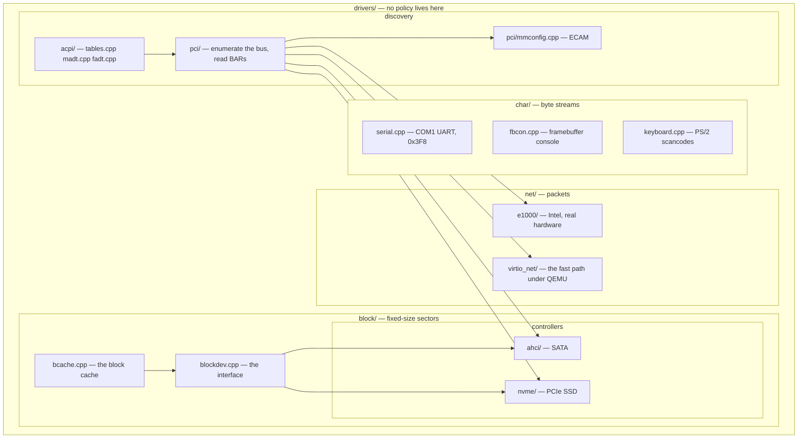

**Walking it.** Three levels of nesting: `DRV` contains `BLK` contains `CTRL`
contains `AHCI`. That is the "box inside a box inside a box" that a whiteboard drawing
of this system actually has.

`CHARC` is the character devices — anything that is a stream of bytes with no
addressable position. `SER` is the UART at port `0x3F8`, and it is the first driver
written in the whole project because it is the only output that works before anything
else does ([[Stage 0.6 - Serial Output]]). `FBC` is the framebuffer console: we draw
glyphs into a pixel buffer, because there is no VGA text mode anywhere in this system
([[ADR-0004 - Framebuffer Console Not VGA Text]]). `KBD` turns PS/2 scancodes into
characters. Three unrelated devices, one directory, because they present the same
shape to the layer above.

`BLK` is the block devices. `BDEV` is the interface every disk implements —
`read_blocks`, `write_blocks`, `block_size` — and it is deliberately agreed *before*
either side is written ([[12 - Team Workflow]]'s interface-first rule). `CTRL` holds
the actual controller drivers: `AHCI` for SATA, `NVME` for PCIe SSDs. `BDEV --> AHCI`
and `BDEV --> NVME` are the interface dispatching to an implementation, the same trick
the VFS uses one band up. `BCACHE --> BDEV` puts the block cache *above* the raw
device: a cached read never reaches the disk, and every reader benefits without
knowing the cache exists.

`NETD` is the two network cards. `VNET` is `virtio-net`, a paravirtualised device that
exists only inside a hypervisor and is dramatically simpler and faster than emulating
real silicon; `E1000` is a real Intel chip that also exists on real machines. Having
both is what makes "it works in QEMU" and "it works on hardware" separable claims.

`DISC` is how anything above finds anything below. `ACPI --> PCI`: the ACPI tables
tell us where the PCI configuration space is. `PCI --> MMCFG`: on a modern machine PCI
configuration is done through a memory window (ECAM) rather than the legacy I/O ports.
`PCI --> AHCI`, `PCI --> NVME`, `PCI --> E1000`, `PCI --> VNET`: bus enumeration finds
each device, reads its Base Address Registers, and hands the matching driver its
hardware addresses. No driver hardcodes an address. That is the difference between a
kernel and a demo.

**Why mechanism and policy are different bands.** A driver answers "how do I make this
chip transfer 4096 bytes". A filesystem answers "which 4096 bytes, and what do they
mean". Keeping them apart means a new disk controller is a new directory under
`block/` and zero changes to `fat32/`, and a new filesystem is a new directory under
`fs/` and zero changes to `ahci/`. Merge them and every new device is a change to
every filesystem.

Built by [[Stage 3.2 - The Keyboard Driver]], [[Phase 9 - Overview]] and
[[Phase 11 - Overview]].

---

### 3.5 The foundation — `mm/` and `lib/`

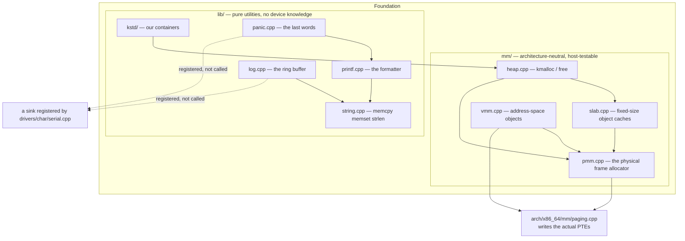

**Walking it.** `MMS` is the memory subsystem, drawn as the stack it actually is.
`PMM` is the bottom: it owns the list of free 4 KiB physical frames, built from the
memory map the bootloader gave us. `VMM --> PMM` because creating a mapping needs a
frame to map. `SLAB --> PMM` and `HEAP --> PMM` because both allocators get their raw
memory in whole frames and then subdivide. `HEAP --> SLAB` because `kmalloc` of a
common size is served from a slab cache rather than a general-purpose free list.

`VMM --> ARCHMM` and `PMM --> ARCHMM` cross into `arch/`, and this is the split that
makes the whole testing strategy work. The *arithmetic* — which frame is free, which
virtual range is available, how a 137-byte request rounds up — is portable C++ and is
unit-tested on your laptop in milliseconds. The *effect* — writing a page-table entry,
invalidating a TLB entry — is x86 and can only be tested inside QEMU. Two directories,
two test tiers ([[09 - Testing Strategy]]).

`LIBS` is everything that is useful and knows nothing. `PRINTF --> STRING` and
`LOG --> STRING` because formatting and buffering both copy bytes. `PANIC --> PRINTF`
— though note that in Phase 0 `panic.cpp` carries its own tiny formatter, precisely
because `kprintf` does not exist yet and, when it does, it may be the broken thing
([[Stage 0.7 - Panic and KASSERT]]). `KSTD --> HEAP` is the one real dependency `lib/`
has: a growable container has to allocate.

**The two dotted arrows are the most important thing on this diagram.** `drivers/`
sits *above* `lib/`. So `log.cpp` may not call `serial_putc`, and `panic.cpp` may not
call the framebuffer console — both would be upward calls. Instead the driver
*registers itself*: `serial.cpp` provides a sink function, `kernel_init` hands it to
the log subsystem, and `log.cpp` calls a function pointer it knows nothing about. The
console does the same with `panic_set_console_sink`.

That inversion costs one function pointer and buys three things. `log.cpp` has no
device dependencies, so it can be unit-tested on the host with a six-line stub. The
panic path degrades gracefully — if the console has not initialised yet, the pointer
is null and panic simply skips it. And a second output channel is a registration, not
a change to the logger.

Built by [[Stage 4.2 - The Physical Frame Allocator]], [[Stage 4.4 - The Kernel Heap]],
[[Stage 1.5 - The Log Ring Buffer and Levels]], [[Stage 1.6 - kprintf]].

---

### 3.6 The floor — `arch/x86_64/` — and how anything gets back up

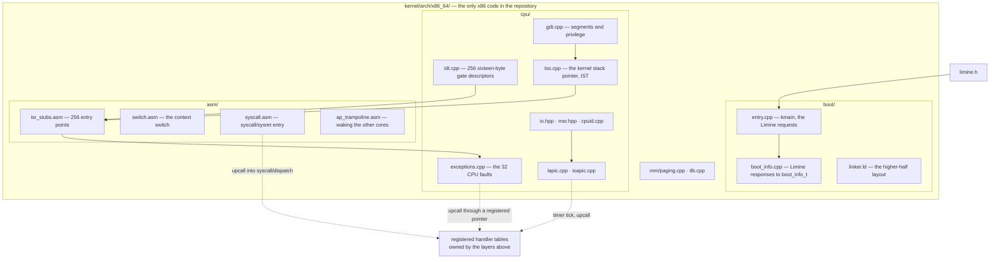

**Walking it.** `BOOTD` is where the machine becomes ours. `LIMINE --> ENTRY` is the
one arrow in the entire repository that touches the bootloader's header: Limine hands
control to `kmain` already in 64-bit long mode, with paging on, interrupts disabled,
and a valid stack ([[ADR-0003 - Limine as the Bootloader]]). `ENTRY --> BINFO` is the
translation step: every Limine response is copied into our own `boot_info_t`, and
after that nothing in the kernel has heard of Limine. `LD` is the linker script that
places the kernel at `0xFFFFFFFF80000000`.

`CPUD` holds the tables the CPU itself reads. `GDT --> TSS` because the Task State
Segment is described by a descriptor in the GDT — a 16-byte one in 64-bit mode, twice
the size of every other entry, which is a classic first bug. `TSS --> STUBS` because
the TSS is how the CPU finds a kernel stack when an interrupt arrives while running in
ring 3; without it, the CPU tries to push an interrupt frame onto the user stack.
`IDTF --> STUBS` because each of the 256 IDT gates points at one of the 256 assembly
entry points. `IO --> LAPIC` because programming the local APIC means MMIO and MSR
access, and those are inline assembly.

`ASMD` is the hand-written assembly, and each file exists because C++ physically
cannot express it: you cannot write "push all registers in a defined order and switch
stacks" in C++, because the compiler owns the registers and the stack.

**The three dotted arrows answer the question this whole section exists for.** If
`arch/` is the bottom layer, how does a timer interrupt ever reach the scheduler,
which is four bands above it?

Not by calling upward. By **inversion**: the layer above registers a function pointer
downward, and the layer below calls through it without knowing what is on the other
end. `sched/` hands the timer a `void (*)()` during initialisation. `syscall/` hands
`arch/` its dispatch entry point. `drivers/` hand the IDT their IRQ handlers. In every
case the *dependency* points downward — `sched/` knows the timer's registration API,
the timer knows nothing about `sched/` — even though the *control flow* at run time
points upward.

> [!example] Why "dependency" and "control flow" are different words
> Consider `qsort(array, n, size, my_compare)`. Control flow goes *from* `qsort` *to*
> `my_compare` — `qsort` calls your function. But the dependency goes the other way:
> your code includes `<stdlib.h>` and knows about `qsort`; `qsort` was compiled years
> ago and has never heard of `my_compare`. Recompiling `qsort` does not affect your
> code. The layering rule constrains *dependencies*, because dependencies are what
> make a change ripple. Control flow can go anywhere.

Built by [[Stage 0.2 - The Limine Request Section]], [[Stage 0.4 - The Linker Script and Higher-Half Layout]], [[Stage 2.1 - The Global Descriptor Table]], [[Stage 2.2 - The TSS and Interrupt Stacks]], [[Stage 2.3 - The Interrupt Descriptor Table]].

---

### 3.7 The dependency rule, drawn

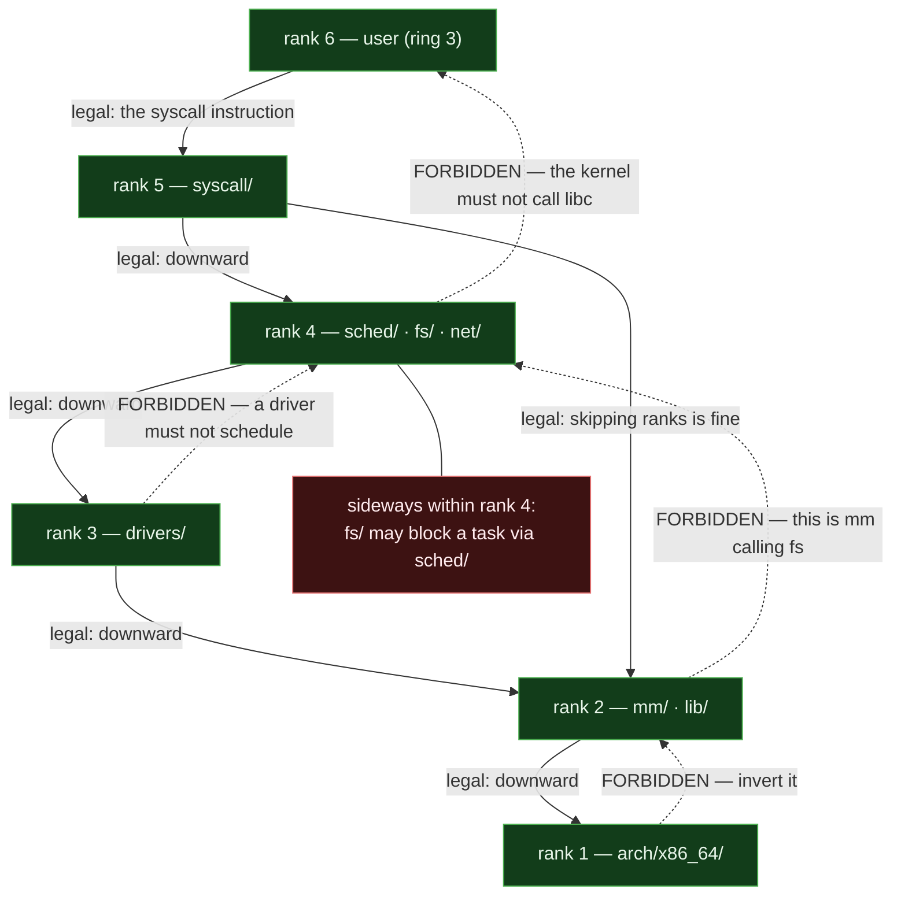

**Walking it.** Six ranks, numbered from the hardware up. The solid arrows are legal
calls, the dotted arrows are the four canonical violations.

`R6 --> R5` is the only legal way into the kernel and it is not a function call — it
is the `syscall` instruction, mediated by hardware.

`R5 --> R4 --> R3 --> R2 --> R1` is the ordinary downward chain: a syscall handler
calls the VFS, the VFS calls the block layer, the block layer calls `kmalloc`, and
`kmalloc` eventually writes a page-table entry.

`R5 --> R2` shows that **skipping ranks downward is fine**. A syscall handler calling
`kmalloc` directly does not need to launder the call through `fs/`. The rule is about
direction, not adjacency — there is no requirement that each layer only speak to the
one immediately beneath it, and imposing one produces enormous quantities of
pass-through code that does nothing.

The four dotted arrows, each of which is a real mistake someone will make:

- `R1 -.-> R2` — architecture code reaching into the memory manager. The concrete
  case is `arch/x86_64/mm/paging.cpp` needing a frame to hold a new page table. Real,
  unavoidable, and resolved by **injection**: the frame allocator is passed in at
  initialisation, not `#include`d. Do it the other way and `kernel/mm/` and
  `kernel/arch/x86_64/mm/` become mutually dependent, and neither is host-testable
  any more. Verify the exact shape against [[Stage 4.3 - Enabling Paging]].
- `R2 -.-> R4` — **`mm/` calling `fs/`**, the violation the rule names explicitly. See
  §3.8.
- `R3 -.-> R4` — a driver calling the scheduler. Tempting when a disk driver wants to
  wait for a command to finish. Forbidden, and structurally impossible on the path
  that matters: an interrupt handler may not sleep at all
  ([[06 - Architecture Overview]]'s concurrency table). The correct shape is a
  completion object owned by the block layer at rank 4: the driver submits and
  returns, the IRQ signals completion, and the *caller* — already at rank 4 — is the
  one that sleeps.
- `R4 -.-> R6` — the kernel including a userspace header. Boundary rule 3 (§6.2.3).

`SIDE4` is the annotation for sideways calls, attached to rank 4 with a plain line
because it is not a call arrow: within a rank, calls in either direction are legal, and
`fs/` blocking a task through `sched/` is the everyday example.

> [!question] Why is skipping ranks downward allowed but skipping ranks upward still
> forbidden?
> Because the rule exists to prevent *cycles*, not to enforce etiquette. Any downward
> call, adjacent or not, keeps the dependency graph acyclic. Any upward call closes a
> loop the moment the layer above calls back down — and it always does, since that is
> what being above means.

---

### 3.8 The named prohibition: `mm/` must never call `fs/`

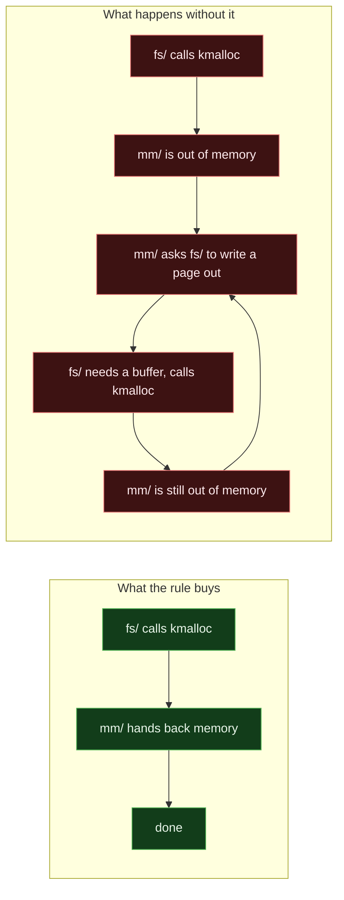

**Walking it.** `GOOD` is the whole story when the rule holds: a filesystem asks for
memory, gets it, and proceeds. Three boxes, no loop.

`BAD` is what a memory manager that can call a filesystem looks like under pressure.
`B1` a filesystem allocates. `B2` the heap is empty. `B3` — this is the forbidden
arrow — the allocator decides to free memory by writing a dirty page out to disk, so
it calls into `fs/`. `B4` the filesystem needs a buffer to do that write, so it calls
`kmalloc`. `B5` the heap is still empty. `B5 --> B3` closes the loop, and the machine
either recurses until the kernel stack is exhausted (a triple fault, an instant reboot
with no error message) or deadlocks holding the heap lock.

This is not a hypothetical. It is one of the hardest problems in real kernels, and
Linux spends an entire subsystem on it (`GFP_NOFS`, reserved memory pools, a dedicated
writeback path that pre-allocates everything it will ever need). We do not have swap in
v1, so the problem does not exist yet — and the rule is written down now so that when
someone adds swap, the cycle is visible in review as a violated architectural rule
rather than discovered at 2am as an unreproducible hang under memory pressure.

> [!warning] This is the one rule with no grep
> A `grep` can see `#include <fs/vfs.hpp>` inside `kernel/mm/`. It cannot see the same
> dependency expressed through a function pointer, a virtual call, or a callback
> registered three files away — which is exactly how it will actually arrive.
> [[06 - Architecture Overview]] says this plainly: *"CI cannot fully enforce this, so
> it is a review responsibility."* Two people who both know why the loop above is fatal
> are the enforcement mechanism.

---

## 4. The data structures

For this document, the "data structures" are the directory tree and the dependency
matrix. Both are real artefacts you can `ls` and both are checkable.

### 4.1 The kernel tree, coloured by rank

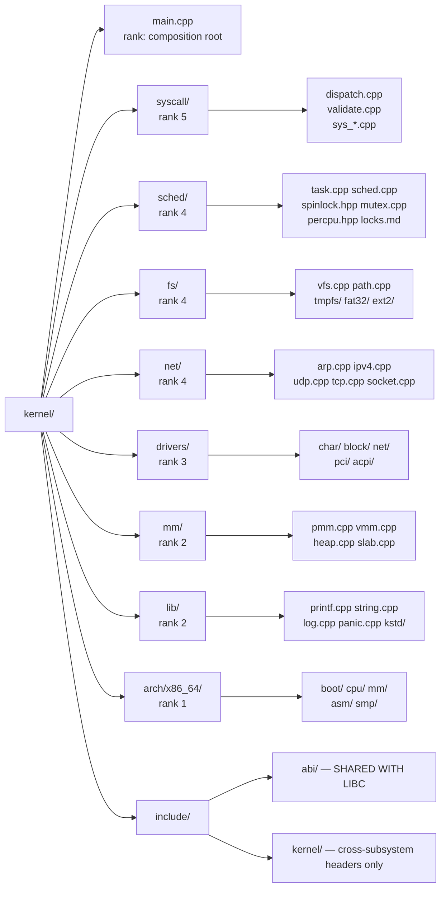

**Walking it.** Ten children of `kernel/`, and nine of them have a rank. That is the
central claim of this document made literal: **the rank is a property of the
directory, so it can be checked by looking at a file path.**

`main.cpp` has no rank because it is the composition root (§2) — the one file that may
depend on everything.

`syscall/`, `sched/`, `fs/`, `net/`, `drivers/`, `mm/`, `lib/`, `arch/x86_64/` map one
to one onto the bands in §2. Nothing in the tree is ambiguous about which band it is
in, which is the property that makes the greps in §6 possible at all.

`include/` splits in two and the split matters. `include/abi/` is the kernel/user
contract: plain C types, `extern "C"`-safe, because libc consumes it. `include/kernel/`
is for *cross-subsystem* interfaces only — the headers one band publishes for another
band to call. Headers internal to a subsystem live beside their source, not here.
That convention is what stops `include/kernel/` from becoming a dumping ground where
every subsystem can see every other subsystem's internals, which would make the layer
ranks unenforceable in practice even if they remained true on paper.

### 4.2 The rest of the repository

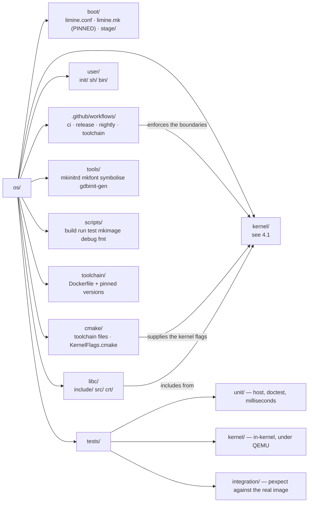

**Walking it.** Ten top-level directories, and the three arrows at the bottom are the
ones that carry meaning.

`boot/` holds `limine.conf` (the boot menu and kernel path) and `limine.mk` (the
pinned bootloader version, `v8.6.0-binary`). `stage/` is the ISO/ESP staging tree and
is a gitignored build output.

`libc/` and `user/` are ring 3 — rank 6 in §3.7 — and are physically separate
top-level directories from `kernel/` so that "the kernel must not include userspace"
is a statement about paths, and therefore greppable.

`tests/` splits into exactly the three tiers of [[09 - Testing Strategy]]: `unit/`
compiles for the host and runs in milliseconds; `kernel/` boots a test kernel under
QEMU and reports through the `isa-debug-exit` device; `integration/` drives the real
image with expect scripts. The tier a test belongs in is decided by which layer it
tests — rank 2 logic is Tier 1, rank 1 behaviour is Tier 2.

`tools/` are host programs, not kernel code — `mkinitrd` builds the initial ramdisk,
`symbolise` turns a backtrace address into a function name. They are built with the
*host* compiler and must never carry the kernel's flags, which is why the red-zone CI
rule filters on `/kernel/` in the path.

`GH -->|enforces the boundaries| KERN` is §6 of this document in one arrow.
`CM -->|supplies the kernel flags| KERN` is where `-mno-red-zone`, `-mcmodel=kernel`,
`-ffreestanding` and the rest are attached ([[08 - Build System]]).
`LIBC -->|includes from| KERN` is boundary rule 4: one arrow, one direction, and the
reverse is a build failure.

### 4.3 The layer model as a type

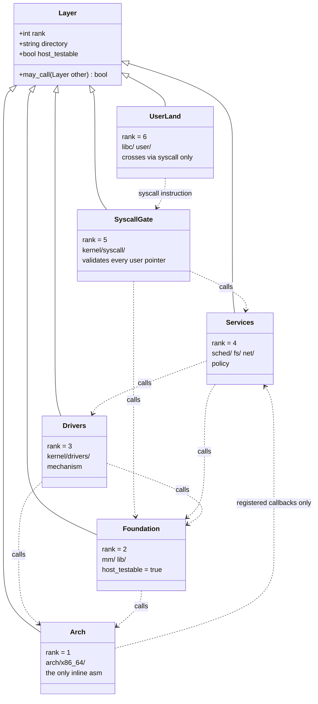

**Walking it.** `Layer` is the abstract idea: a rank, a directory, whether it is
host-testable, and a predicate `may_call`. The six concrete layers inherit from it.

The `..>` dependency arrows restate §3.7 in a form that reads like code. Every arrow
points from a higher rank to a lower one except the last, `Arch ..> Services`, which is
annotated *"registered callbacks only"* — the inversion from §3.6. That single
annotated arrow is the entire exception list.

`host_testable = true` appears only on `Foundation`, and that is not an accident of
what we happened to write. It is the *reason* `mm/` and `arch/x86_64/mm/` are separate
directories. A layer is host-testable exactly when it contains no inline assembly and
no hardware access, and the boundary rule that confines assembly to `arch/` is what
guarantees the property rather than merely hoping for it.

### 4.4 The dependency matrix

Read a row as "may this caller call this callee?".

| Caller ↓ / Callee → | user | syscall/ | sched/ | fs/ | net/ | drivers/ | mm/ | lib/ | arch/ |
|---|---|---|---|---|---|---|---|---|---|
| **user** (ring 3) | ↔ | ✅ *instruction only* | ❌ | ❌ | ❌ | ❌ | ❌ | ❌ | ❌ |
| **syscall/** | ⤴ *sysret, not a call* | — | ✅ | ✅ | ✅ | ✅ *rare: tty, ioctl* | ✅ | ✅ | ✅ |
| **sched/** | ❌ | ❌ | — | ↔ *justify* | ↔ *justify* | ❌ *timer upcalls in* | ✅ | ✅ | ✅ |
| **fs/** | ❌ | ❌ | ↔ *block the caller* | — | ❌ | ✅ | ✅ | ✅ | ❌ *breaks Tier 1* |
| **net/** | ❌ | ❌ | ↔ *block the caller* | ❌ | — | ✅ | ✅ | ✅ | ❌ *breaks Tier 1* |
| **drivers/** | ❌ | ❌ | ⤴ *completion only* | ❌ | ⤴ *rx hook* | ↔ | ✅ | ✅ | ✅ |
| **mm/** | ❌ | ❌ | ❌ | ❌ **the named rule** | ❌ | ❌ | — | ✅ | ✅ |
| **lib/** | ❌ | ❌ | ❌ | ❌ | ❌ | ⤴ *sinks only* | ✅ *kstd allocates* | — | ✅ |
| **arch/** | ❌ | ⤴ *dispatch entry* | ⤴ *timer, IRQ* | ❌ | ❌ | ⤴ *IRQ table* | ⤴ *injected allocator* | ✅ | — |
| **main.cpp** | ❌ | ✅ | ✅ | ✅ | ✅ | ✅ | ✅ | ✅ | ✅ |

Legend: ✅ legal downward call · ↔ sideways, legal but must be justified in review ·
⤴ inverted — expressed as a registered function pointer or injected dependency, never
as an `#include` · ❌ forbidden · — same layer.

**Three rows repay careful reading.**

The **`mm/` row** is almost entirely ❌. The memory manager is a leaf as far as the
rest of the kernel is concerned: it depends on `lib/` for formatting and on `arch/` for
page tables, and on nothing else at all. That is what makes it the most heavily
unit-tested subsystem in the tree.

The **`arch/` row** is almost entirely ⤴. Architecture code is *called by* everything
and *depends on* almost nothing — which is exactly the profile you want at the bottom
of a stack, and exactly what makes a second architecture an additive change rather
than a rewrite.

The **`main.cpp` row** is entirely ✅, which looks like it destroys the whole scheme
until you notice it is one file. Concentrating all cross-layer knowledge in a single
composition root is the standard way to have both a strict dependency rule and a system
that can actually be wired together.

> [!warning] Where the tree and the ranks disagree
> `kernel/sched/spinlock.hpp` is filed at rank 4, but `mm/heap.cpp` needs a lock — and
> `mm` is rank 2. Is that an upward call?
>
> No, and the distinction is worth internalising. `spinlock.hpp` is header-only, holds
> no scheduler state, and compiles down to an atomic instruction from `arch/`. By
> *dependency* it is rank 2; it lives under `sched/` for filing convenience.
> `mutex.cpp` and `semaphore.cpp` are different — they block the calling task, which
> means they genuinely touch the run queue, and they are genuinely rank 4. So the heap
> may take a spinlock and may **not** take a mutex, which is the same conclusion the
> concurrency table in [[06 - Architecture Overview]] reaches from the other direction:
> allocation can happen in interrupt context, and interrupt context may not sleep.
> When a rank and a directory disagree, **the dependency is the truth and the directory
> is the bug.**

---

## 5. The flows

### 5.1 One `write()` all the way down

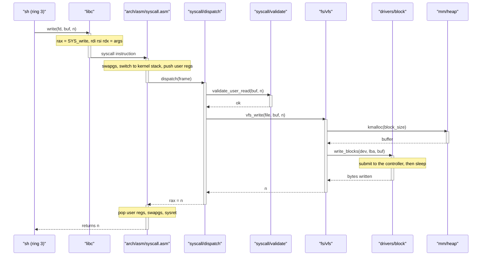

**Walking it.** Eight participants, one per band, in rank order left to right — which
means every arrow that points right is a downward call and every arrow that points
left is a return. Nothing in this diagram violates the rule, and you can see that at a
glance from the arrow directions alone. That is the practical value of drawing flows
this way.

`sh` calls `write`. libc loads the syscall number and arguments into the registers the
ABI specifies and executes `syscall`. Control lands in `syscall.asm`, which does the
three unavoidable things (swap the per-CPU base, move to the kernel stack, save the
user registers) and calls `dispatch`.

`dispatch` calls `validate` **before** anything touches `buf`. The `activate`/
`deactivate` pair around `validate` is short on purpose: it is a pure check with no
side effects, and it either returns "ok" or the whole call returns `-EFAULT` without
descending further.

`vfs_write` is the first rank-4 code to run. It calls `kmalloc` — a rank-2 call,
skipping rank 3 entirely, which §3.7 says is fine — and then `write_blocks`, a rank-3
call. The `Note over B` records the interesting part: the driver submits the command to
the controller and the *caller* sleeps waiting for completion. The driver does not call
the scheduler; the block layer at rank 4 does.

The returns unwind in the same order. `syscall.asm` restores the user registers,
restores the user `GS` base, and executes `sysret` — and note that `sysret` is a return
to ring 3, not a call into it. The kernel never calls userspace. It only ever returns
there or enters it at a fresh entry point.

### 5.2 A timer tick, going the other way

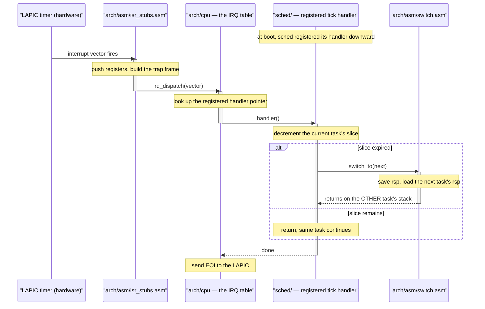

**Walking it.** This is the inversion from §3.6 shown as a runtime flow, and it is the
one flow where control travels *upward*.

The `Note over SC` at the top is the whole trick: before any of this happens, at
`kernel_init` time, `sched/` handed a function pointer *down* to `arch/`. The
dependency was created at boot, downward, and it is the only dependency that exists.

Then hardware fires. `isr_stubs.asm` — rank 1 — pushes registers and builds a trap
frame. `irq_dispatch` looks up the vector in a table of function pointers. It calls
`handler()`, and control is now in `sched/` at rank 4. **`arch/` called upward, but
`arch/` has no dependency on `sched/`**: it called through a pointer it was given, and
if `sched/` did not exist the pointer would be null and the tick would be dropped.
Recompiling `sched/` does not require recompiling `arch/`. That is the test.

The `alt` block is the scheduling decision. If the current task's time slice has
expired, `sched/` calls *downward* into `switch.asm` — an ordinary downward call, rank
4 to rank 1 — and the `Note over SW` records the strangest thing in the kernel: the
function saves one stack pointer, loads another, and **returns onto a different task's
stack**. It was called by one task and returns to another, possibly minutes later.

If the slice has not expired, nothing happens and the same task resumes. Either way
control unwinds back to `arch/`, which sends the End Of Interrupt to the LAPIC — and
that EOI must happen in `arch/`, because the LAPIC is architecture-specific and no
rank-4 code should know it exists.

Built by [[Stage 5.2 - Cooperative Task Switching]] and [[Stage 5.3 - Preemptive Scheduling]].

### 5.3 The CI `lint` job — how the shape is defended

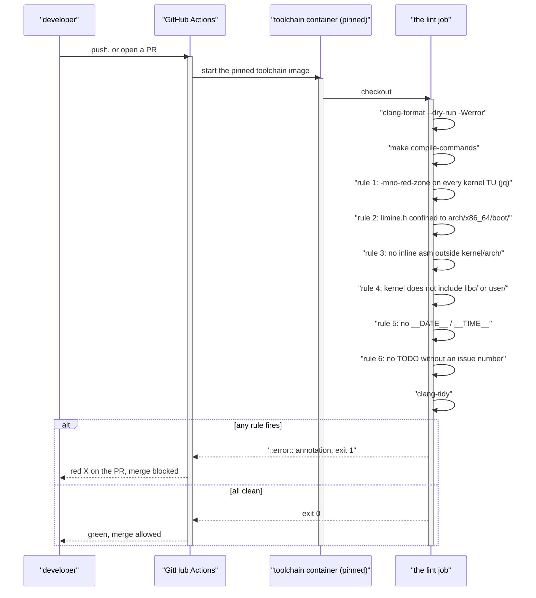

**Walking it.** A push or a PR starts the run. Every step executes inside the **pinned
toolchain container**, which matters more than it looks: `grep -P` (used by rule 6)
requires a `grep` built with PCRE, and the same rule that passes on Ubuntu fails on
Alpine with `support for -P is not compiled` ([[ADR-0005 - Containerised Pinned Toolchain]]).

`clang-format --dry-run -Werror` runs first because it is the cheapest and the most
frequently tripped. `make compile-commands` generates `build/compile_commands.json`,
the compile database — one JSON object per translation unit recording the exact command
line — which the next rule mines.

Then six rules, one step each, in the order they appear in `ci.yml`. Each is a few
lines of shell, each takes milliseconds, and each fails with a `::error::` annotation —
a GitHub *workflow command* that the runner parses out of stdout and renders at the top
of the run summary and on the PR itself, so the reason is visible without opening a log.

`clang-tidy` runs last because it is the slowest.

The `alt` block is the whole point: any rule firing turns the merge gate red. There is
no "the reviewer will catch it" path.

> [!warning] `grep` exits 1 when it finds nothing
> The success case for every boundary rule is *no matches*, and `grep` reports that as
> exit status 1. GitHub runs `run:` blocks under `bash -e`, and a command substitution
> in an assignment propagates its exit status — so without a trailing `|| true`, every
> one of these steps aborts the job on the **good** outcome. Every rule below carries
> `|| true` for exactly this reason, and it is not cosmetic.

---

## 6. Why it is shaped this way

### 6.1 Layers at all?

| Option | How it works | Cost | Verdict |
|---|---|---|---|
| **A (chosen): ranked layers, downward-and-sideways only** | Nine directories, a documented rank each, four CI greps | Occasional inversion boilerplate (a function pointer where a call would do) | ✅ |
| B: flat kernel, everything may call everything | One big `kernel/` directory, no rules | Works to about 5k lines, then every change touches every file and nothing is testable in isolation | ❌ |
| C: microkernel — subsystems as separate ring-3 servers, IPC between them | Hard isolation enforced by hardware, not by grep | A syscall becomes several IPC round trips; message passing everywhere; the single largest cost multiplier available | ❌ |
| D: layers, enforced by review only | Zero tooling | Decays exactly as fast as the codebase grows | ❌ |

**Why A.** The layering is what makes the rest of the project's commitments
achievable, and each one is concrete:

- `kernel/mm/` is host-testable at Tier 1 **because** the rule keeps hardware access
  in `arch/`. Delete the rule and the allocator's arithmetic can only be tested by
  booting QEMU, which turns a millisecond test into a two-minute one and, in practice,
  into no test at all ([[09 - Testing Strategy]]).
- A second architecture is **additive** — a new `kernel/arch/aarch64/` — rather than a
  rewrite, which is what keeps [[ADR-0006 - Apple Silicon Is Not a Boot Target]]'s
  revisit condition open rather than theoretical.
- Two people can work in parallel on `arch/`+`mm/`+`drivers/` and `fs/`+`syscall/`+
  `sched/` without colliding, because the seam between their halves is a rank boundary
  with a documented interface ([[12 - Team Workflow]]).

**Why not B.** Not because flat is inelegant. Because a flat kernel has no unit that
can be reasoned about alone, so every bug is a whole-system bug and every test is a
whole-system test.

**Why not C.** A microkernel gets a strictly better version of this property — the
isolation is enforced by the MMU rather than by a grep — and pays for it in
performance and in complexity we cannot afford at this size. A monolithic kernel with
disciplined internal layering is the right point on that curve for a system this size,
and it is what Linux, xv6 and SerenityOS all are.

**Why not D.** See §6.3.

### 6.2 The four walls

These are the boundary rules from [[07 - Repository Layout]]. Each is stated, drawn as
the violation it prevents, given its actual CI grep, and mapped to the ADR it defends.

#### 6.2.1 Rule 1 — architecture code is confined to `kernel/arch/`

Inline assembly, x86 register names, and port I/O appear **only** under `kernel/arch/`.
Everything else is portable C++.

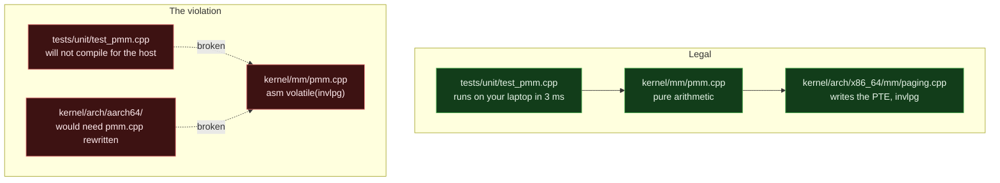

**Walking it.** On the left, `pmm.cpp` is arithmetic only — which frame is free, how a
request rounds — and calls down into `paging.cpp` for the one instruction that must be
x86. Because it contains no assembly, `test_pmm.cpp` compiles for the host and runs in
milliseconds.

On the right, one `asm volatile` has been added to `pmm.cpp`, and two things break at
once. The unit test no longer compiles for the host, because your laptop's compiler has
no idea what `invlpg` means in this context — so the allocator silently loses its test
coverage. And a hypothetical `kernel/arch/aarch64/` port now requires editing
`kernel/mm/pmm.cpp`, so the second architecture is a rewrite rather than an addition.
Neither failure announces itself; both are discovered months later.

**The grep** ([[Stage 0.9 - CI From Day One]], lint step 5):

```bash
leak=$(grep -rnE '\b(asm|__asm__)[[:space:]]*(volatile)?[[:space:]]*\(' kernel/ \
         --include='*.cpp' --include='*.hpp' 2>/dev/null \
       | grep -v '^kernel/arch/' || true)
```

`-E` selects extended regular expressions; `-n` adds line numbers so the annotation
points at the offending line. `\b` is a GNU word boundary, so `wasm(` and `basm(` do not
match. `(volatile)?` makes the qualifier optional. The second `grep -v` drops the one
tree where assembly is legal.

**Protects:** [[ADR-0008 - Monorepo Layout]] rule 1, and keeps
[[ADR-0006 - Apple Silicon Is Not a Boot Target]]'s revisit condition achievable.

> [!warning] This grep is a net, not a proof
> `__asm__ __volatile__ (` does **not** match, because `__volatile__` is not
> `volatile`. Neither does `asm goto (`. Both are legal GCC. And [[ADR-0008 - Monorepo Layout]] promises greps for x86 *register names* too, which this pattern does not
> implement — verify what `ci.yml` actually contains before relying on it. Widen the
> pattern rather than trusting it, and widen `scripts/lint.sh` at the same time, since
> it carries the same rule for local runs.

> [!example] The one documented exemption
> `kernel/lib/panic.cpp` contains x86 inline assembly and lives at rank 2, not in
> `arch/`. The exemption is deliberate: the *policy* in that file — output ordering,
> formatting, assert semantics — is architecture-neutral and belongs in `lib/`, while
> the register reads are the only architecture-specific part. If a second architecture
> appears, the capture and the halt loop move behind `arch_capture_regs()` /
> `arch_halt()` and nothing else changes. [[Stage 0.7 - Panic and KASSERT]] requires the
> exemption to be recorded in `ci.yml` itself, **so that it is a decision rather than a
> hole**. That is the general principle: an exception you can point at is fine; an
> exception nobody wrote down is how a rule dies.

#### 6.2.2 Rule 2 — `limine.h` is confined to `kernel/arch/x86_64/boot/`

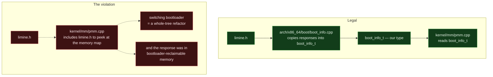

**Walking it.** On the left, `limine.h` is included in exactly one directory. That
directory's job is translation: every Limine response is copied into `boot_info_t`, our
own type, and everything above consumes only `boot_info_t`. The bootloader is a
detail of one directory.

On the right, `pmm.cpp` includes `limine.h` to read the memory map directly, and two
distinct disasters follow. The obvious one: switching bootloaders is now a whole-tree
refactor, and the escape hatch [[ADR-0003 - Limine as the Bootloader]] was granted on
is gone. The subtle one is worse — **Limine's response structures live in
bootloader-reclaimable memory**. Phase 4 reclaims that memory. Anything still holding a
pointer into it is reading whatever the allocator put there, and the fault appears long
after and nowhere near the mistake.

**The grep** ([[Stage 0.9 - CI From Day One]], lint step 4):

```bash
leak=$(grep -rl 'limine\.h' kernel/ --include='*.?pp' --include='*.h' 2>/dev/null \
       | grep -v '^kernel/arch/x86_64/boot/' || true)
```

`-l` prints file names only, deduplicated. `limine\.h` escapes the dot to make it
literal. `--include='*.?pp'` matches `.cpp` and `.hpp` (`?` is a single-character glob);
the second `--include` adds `.h`.

> [!warning] The `^` anchor is load-bearing and fragile
> `grep -r … kernel/` prints paths beginning `kernel/`, so `^kernel/arch/x86_64/boot/`
> matches and the legal directory is excluded. Write `grep -r … ./kernel/` instead and
> every path gains a `./`, the anchor never matches, and **every legal file is reported
> as a leak**. If this rule ever fires on `boot/entry.cpp` itself, that is what
> happened.

**Protects:** [[ADR-0003 - Limine as the Bootloader]].
**False positive:** a comment or documentation string naming the header in a file
outside `boot/` — including a header comment explaining this very rule — trips it.
`grep` does not parse C++. Reword the prose or move the note.

#### 6.2.3 Rule 3 — the kernel never includes userspace

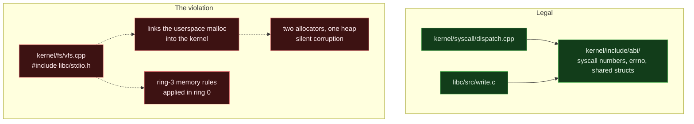

**Walking it.** On the left, both sides include from `kernel/include/abi/`. The arrows
converge on the shared contract and never cross into each other's trees. That is the
only legal channel between the rings.

On the right, `vfs.cpp` includes a libc header. Two things follow. The link line now
drags the *userspace* `malloc` into the kernel image, so there are two allocators
managing the same heap and neither knows about the other — silent corruption, found
weeks later. And libc's headers encode ring-3 assumptions (that memory is demand-paged,
that a fault is recoverable, that a pointer can be dereferenced) that are simply false
in ring 0. [[07 - Repository Layout]] calls the result "a very confusing afternoon",
which is generous.

**The grep** ([[Stage 0.9 - CI From Day One]], lint step 6):

```bash
leak=$(grep -rnE '#include[[:space:]]*[<"](libc|user)/' kernel/ 2>/dev/null || true)
```

`[<"]` is a character class matching either include form. `(libc|user)/` requires the
trailing slash, so `libcxx/` does not match — the slash is doing real work. This grep
carries no `--include` filter, so it scans every file under `kernel/` including `.md`,
`.ld` and `.asm`: slightly stricter than intended, and harmless.

**Protects:** [[ADR-0008 - Monorepo Layout]] rule 3.

#### 6.2.4 Rule 4 — the ABI has exactly one home

Anything crossing the kernel/user boundary — syscall numbers, `errno` values, struct
layouts, flag constants — lives in `kernel/include/abi/` and nowhere else.

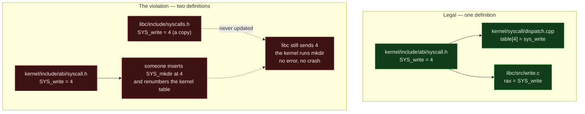

**Walking it.** On the left, one file defines `SYS_write` and both consumers include
it. There is no way for the two sides to disagree, because there is nothing to
disagree about.

On the right, libc has grown its own copy — the most natural mistake in the world, made
to avoid reaching into a kernel directory from userspace. It is correct on the day it
is written. Then someone inserts a syscall in the middle of the kernel's table. The
kernel is internally consistent. libc is internally consistent. But libc now sends the
number for `write` and the kernel dispatches `mkdir`. **There is no error, no crash, and
no diagnostic** — the syscall silently does the wrong thing, and the bug surfaces as
inexplicable filesystem behaviour a long way from the change that caused it.

**How it is enforced — honestly, one grep and one human gate.** Unlike the first three
rules, there is no single `grep` in [[Stage 0.9 - CI From Day One]] for "this constant
is defined twice". The enforcement is two-part:

1. **Mechanised, one direction.** The rule-3 grep above makes the *reverse* dependency
   impossible: `kernel/` cannot include from `libc/`, so the ABI can never migrate to
   the userspace side. The arrow can only ever point one way.
2. **Human, the other direction.** `kernel/include/abi/` is co-owned in `CODEOWNERS`,
   and **every change to it requires both reviewers** ([[12 - Team Workflow]],
   [[ADR-0008 - Monorepo Layout]] rule 4). That is not a weaker substitute for a grep;
   it is a different kind of check. A grep can see a duplicated `#define`; it cannot see
   that inserting a number in the middle of a table breaks every already-compiled
   binary. Only a person can.

> [!example] A candidate grep, if you want the mechanical half too
> Nothing today stops a second definition appearing under `libc/include/`. A rule of the
> shape below would catch the literal duplication, and it is **not currently in
> `ci.yml`** — treat it as a proposal to add, and verify against the workflow as it
> stands before claiming it exists:
> ```bash
> leak=$(grep -rn 'SYS_[A-Za-z0-9_]*[[:space:]]*=' libc/ user/ 2>/dev/null || true)
> ```
> It would catch a copied enum and miss a copied `#define`, which is a fair summary of
> what greps are worth: they raise the cost of the mistake, they do not eliminate it.

**Protects:** [[ADR-0008 - Monorepo Layout]] rule 4.

### 6.3 Why greps, and not code review

| Option | How it works | Cost | Verdict |
|---|---|---|---|
| **A (chosen): greps in `lint`, one step per rule** | Six `run:` steps, each failing with a `::error::` annotation | Crude; textual; will occasionally false-positive on comments and strings | ✅ |
| B: code review only | The reviewer checks the four rules | Humans forget, and someone must be the one who says it | ❌ |
| C: a real static analyser or custom clang-tidy checks | AST-aware, no false positives on comments | Days of work; a clang-tidy plugin that enforces a directory convention is not a weekend project | ❌ |

**Why A.** A grep has exactly two virtues and they are enough.

It is **tireless**. It checks all six rules on all files on every push, including the
one made at 01:00 to fix one thing, forever. A reviewer checks the rules they remember,
on the files in the diff, when they are not tired.

It is **impersonal**, and this is the underrated one. On a two-person team nobody wants
to be the person who writes "you put `limine.h` in the wrong directory again" for the
third time. So they stop writing it, and the boundary erodes — not because anyone
decided to abandon it, but because enforcing it socially is unpleasant. A grep has no
feelings, requires no diplomacy, and is never accused of nitpicking. The rule stops
being a relationship between two people and becomes a property of the repository.

**When C would be right.** If the rules were about code *semantics* rather than file
*locations* — "no allocation in interrupt context", "no blocking call while holding a
spinlock" — grep cannot express that and a real analyser earns its cost. Directory
conventions are genuinely a grep-shaped problem. Note that `mm/` must never call `fs/`
(§3.8) is in the first category, which is precisely why it has no grep.

---

## 7. How this grows across the phases

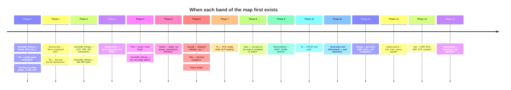

**Walking it.** The map is built bottom-up, and the order is forced by dependency, not
by preference.

**Phase 0** creates the two ends of the cake and nothing in between: `arch/.../boot/`
because something has to be entered, and `lib/` because something has to report
failure. The third entry is the one worth noticing — **the boundary greps exist in
Phase 0, when the repository is about 300 lines and trivially satisfies them.** That is
deliberate. A rule added when it is free is a rule the codebase grows around; a rule
added after the violation exists is a refactor nobody schedules.

**Phases 1–2** fill in `drivers/char/` and `arch/x86_64/cpu/`. Phase 2 is where rule 1
earns its keep for the first time, because the first `outb` outside `kernel/arch/` is
written during IDT work.

**Phase 4** creates `mm/`, and with it the first substantial Tier-1 test suite — which
is only possible because rule 1 kept the arithmetic free of assembly.

**Phase 6** is the moment the cake acquires its top: ring 3 exists, so `syscall/` has
something to gate and `libc/` has something to call. Before Phase 6 the "user" band of
§2 is empty.

**Phase 8** completes the map *in outline*. Every band in §2 has at least one file.
Everything from Phase 9 onward makes existing bands wider rather than adding new ones —
which is the strongest evidence that the shape is right. `net/` in Phase 14 is a large
subsystem, but it slots into rank 4 beside `fs/` and requires no change to the rule.

**What is deliberately missing early, and why that is fine.** There is no `net/` until
Phase 14 and no `pci/` until Phase 11, but the *ranks* for them are decided now. The
cost of deciding the layout early and filling it in late is almost zero; the cost of
discovering the layout after 20k lines exist is a refactor across every file.

> [!question] Phase 8 completes the map in outline. What would it mean if Phase 14 had
> required a *new band*?
> It would mean the ranking was wrong — that there was a kind of subsystem the original
> six ranks could not express. Watch for this: a new subsystem that fits none of the
> existing ranks is real evidence against the model, and is worth a redesign. A new
> subsystem that fits an existing rank is evidence for it.

---

## 8. Failure modes

Symptom first, because that is the order you will meet them in.

**CI fails with `limine.h included outside arch/x86_64/boot/` and lists
`kernel/arch/x86_64/boot/entry.cpp` — a legal file.**
The `^` anchor in the second grep. Somebody wrote `grep -r … ./kernel/` instead of
`grep -r … kernel/`; every path gained a `./` prefix, `^kernel/arch/...` stopped
matching, and the rule now reports every legal file as a leak. §6.2.2.

**A boundary rule has never once failed, including when you deliberately violate it.**
Almost certainly the missing `|| true` combined with an inverted test, or a pattern
that never matches anything. Fix it by *deliberately breaking the rule and confirming
CI goes red* — [[Stage 0.9 - CI From Day One]] §6.4 does exactly this by adding
`#include "limine.h"` to `kernel/main.cpp`. A boundary rule you have never seen fire is
a boundary rule you have no evidence about.

**CI fails a boundary rule on a comment.** Expected. `grep` does not parse C++, so a
comment saying "do not include `limine.h` here" trips the limine rule and a comment
saying `// asm("hlt") is not allowed` trips the assembly rule. Reword the comment or
move the note. This is the documented price of option A in §6.3.

**Random, unreproducible memory corruption found weeks later, in code that is not at
fault.** A kernel translation unit missing `-mno-red-zone`. The AMD64 ABI lets a leaf
function use the 128 bytes below `rsp` without adjusting `rsp`; in kernel space an
interrupt pushes its frame right there and silently destroys live data. No warning, no
crash at the point of the mistake. This is why the red-zone rule exists as a mechanical
check over the compile database rather than as a convention.

**A kernel build suddenly links two `malloc` symbols, or the linker reports a
duplicate.** Rule 3: something under `kernel/` has included a libc header. Run the
rule-3 grep locally; the offending include will be recent.

**A syscall silently does the wrong thing — `write` behaves like `mkdir`.** Two copies
of the syscall number table that have drifted. §6.2.4. Check whether anything under
`libc/` defines a `SYS_*` constant rather than including `kernel/include/abi/`.

**A page fault deep inside the physical memory manager, long after boot, at an address
that used to be valid.** Something retained a pointer into Limine's response
structures, which live in bootloader-reclaimable memory that Phase 4 reclaims. The
value was read correctly at boot and became garbage later. This is the failure rule 2
exists to make structurally impossible.

**The kernel hangs or triple-faults under memory pressure only.** A dependency cycle
through the allocator — the shape in §3.8. Look for anything that allocates while
holding the heap lock, or any path from `mm/` into a higher band, including through a
callback.

**A deadlock that only appears under load, on one machine, once a week.** Locks taken
out of order. `kernel/sched/locks.md` records the global ranking, every lock has a
documented rank, and taking a lower rank while holding a higher one is checked by
`KASSERT` in debug builds. If the assertion is not firing, the new lock was probably
never given a rank.

**A spinlock held forever with the CPU pinned at 100%.** A lock shared with an
interrupt handler taken without disabling interrupts on the local CPU: the handler
interrupted the holder and is now spinning on a lock the same CPU already owns. Use the
`irq_lock_guard` RAII wrapper, which makes the correct behaviour the default one.

**`grep: support for -P is not compiled` in the lint job.** Rule 6 needs PCRE for its
negative lookahead. Ubuntu's GNU grep has it; BusyBox grep (Alpine) does not. Another
argument for the pinned container ([[ADR-0005 - Containerised Pinned Toolchain]]).

---

## 9. Masterclass notes

> [!question] Discussion prompts
> 1. `arch/` is rank 1 and `sched/` is rank 4, yet a timer interrupt starts in `arch/`
>    and ends in `sched/`. Explain why that is not a violation, using the words
>    "dependency" and "control flow". Then explain what would make it a violation.
> 2. The rule permits `fs/ -> sched/` and permits `sched/ -> fs/`, since both are rank
>    4. One of those is fine and one is a design mistake. Which, and how would you argue
>    it in review when the author says "the rule allows it"?
> 3. Three of the four boundary rules have a `grep` and one does not. What distinguishes
>    the one that does not, and what does that tell you about the general limits of
>    mechanical enforcement?
> 4. `kernel/lib/panic.cpp` contains inline assembly and is not under `arch/`. Defend
>    that exemption. Then describe the specific thing that must be true about how the
>    exemption is recorded, and why an undocumented exemption is worse than no rule.
> 5. A teammate proposes adding swap: under memory pressure, `mm/` writes dirty pages to
>    disk via `fs/`. Draw what goes wrong. Then design the version that does not,
>    without moving `fs/` below `mm/`.

- [ ] You understand this when you can draw the six ranks and place all nine kernel
      directories into them from memory
- [ ] You understand this when you can explain why `kernel/mm/` and
      `kernel/arch/x86_64/mm/` are separate directories, in terms of testing rather
      than tidiness
- [ ] You understand this when you can explain why inverting a dependency with a
      function pointer is not "cheating the rule"
- [ ] You understand this when you can state, without looking, which single file is
      exempt from the dependency rule and why one such file is necessary
- [ ] You understand this when you can write the `limine.h` grep, including the `^`
      anchor and the `|| true`, and say what each is for

**Board plan** — the order to draw this on a whiteboard:

1. Draw one horizontal line. Above it write "ring 3", below it "ring 0". Write
   `syscall` on the line. That is the whole system in three marks.
2. Below the line, draw five stacked boxes bottom-up: `arch/`, then `mm/ lib/`, then
   `drivers/`, then `sched/ fs/ net/`, then `syscall/`. Number them 1 to 5 on the left.
3. Draw one arrow from rank 5 down to rank 4, and one from rank 5 skipping to rank 2.
   Say: downward, adjacent or not.
4. Draw one dotted arrow upward from rank 2 to rank 4 and cross it out. Label it
   "`mm/` calling `fs/`". Then draw the four-box recursion loop from §3.8 beside it —
   this is the emotional core of the session and deserves its own corner of the board.
5. Draw a horizontal double-headed arrow inside rank 4 between `fs/` and `sched/`.
   Label it "sideways: legal, justify it".
6. Draw a dotted arrow from rank 4 down to rank 1 labelled "registers a callback", then
   a solid arrow from rank 1 up to rank 4 labelled "calls it". Two arrows, opposite
   directions, one legal relationship. Wait for the objection, then give the `qsort`
   analogy.
7. Off to one side, write the four wall names: **arch confined · limine confined ·
   no userspace · one ABI**. Under each, one line of grep.
8. Write `main.cpp` at the bottom of the board with arrows to everything. Say: one file
   is exempt, and that is what makes the other rules affordable.
9. Finish by pointing back at the boxes and naming the phase that creates each one.

**Time budget:** 45 minutes. Steps 1–3 in 10, step 4 in 10 (do not rush the recursion
loop), steps 5–6 in 10, step 7 in 10, steps 8–9 in 5.

---

## 10. Related

[[06 - Architecture Overview]] · [[07 - Repository Layout]] · [[08 - Build System]] ·
[[09 - Testing Strategy]] · [[10 - CI Pipeline]] · [[12 - Team Workflow]] ·
[[13 - Coding Standards]] · [[14 - Debugging Playbook]]

[[ADR-0002 - Target x86_64 Not i686]] · [[ADR-0003 - Limine as the Bootloader]] ·
[[ADR-0005 - Containerised Pinned Toolchain]] ·
[[ADR-0006 - Apple Silicon Is Not a Boot Target]] ·
[[ADR-0007 - Freestanding C++20 as the Kernel Language]] ·
[[ADR-0008 - Monorepo Layout]] · [[ADR-0009 - Filesystem Strategy FAT32 then ext2]] ·
[[ADR-0010 - Testing Strategy and the QEMU Exit Device]]

[[Stage 0.2 - The Limine Request Section]] · [[Stage 0.7 - Panic and KASSERT]] ·
[[Stage 0.9 - CI From Day One]] · [[Stage 1.5 - The Log Ring Buffer and Levels]] ·
[[Stage 4.3 - Enabling Paging]] · [[Stage 5.3 - Preemptive Scheduling]] ·
[[Stage 6.3 - The System Call Interface]] ·
[[Stage 7.3 - The Virtual Filesystem Layer]]
