# 07 — Memory Management

> [!abstract] What this document covers
> The whole memory story, from "which bytes of RAM physically exist" to "why did
> writing to this pointer make the CPU jump into my kernel". It covers the three
> layers of `kernel/mm/` — the physical frame allocator, the four-level page
> tables, and the kernel heap — plus the two things built on top of them much
> later: demand paging and copy-on-write. It does **not** cover the scheduler's
> use of memory, address-space switching on context switch, or the userspace
> allocator; those get their own documents.

**Zoom level:** Subsystem, deep — down to individual hardware bits.
**Built by:** [[Stage 4.1 - Reading the Memory Map]], [[Stage 4.2 - The Physical Frame Allocator]], [[Stage 4.3 - Enabling Paging]], [[Stage 4.4 - The Kernel Heap]], [[Stage 13.3 - Copy-on-Write]]
**Prerequisites:** [[06 - Architecture Overview]], [[Stage 0.4 - The Linker Script and Higher-Half Layout]], [[Stage 2.5 - CPU Exception Handlers]]
**Masterclass session:** 4 (see [[19 - The Eight-Hour Masterclass]])

> [!note] Terminology, and one correction to the glossary
> [[04 - Glossary]] defines **page** (a 4 KiB block of *virtual* address space),
> **frame** (a 4 KiB block of *physical* RAM), **page fault**, **frame
> allocator**, **heap** and **higher half**. Those definitions all hold here.
>
> Its entry for "page directory / page table" describes the **two-level** tables
> of 32-bit x86. We target x86_64 ([[ADR-0002 - Target x86_64 Not i686]]), which
> uses **four** levels. Everywhere the two disagree, this document and
> [[06 - Architecture Overview]] are correct.

---

## 1. The one-sentence version

**Memory management answers two questions: *which physical bytes of RAM are
currently in use*, and *what does each address a program uses actually point
at*.**

Those two questions are genuinely separate, and conflating them is the single
most common source of confusion for someone new to this. The first is
bookkeeping over a fixed resource: the machine has some number of bytes of RAM,
they exist at fixed physical addresses, and somebody has to remember which ones
are spoken for. The second is a *lie the hardware tells on your behalf*: the CPU
does not send the address in your pointer to the memory chips. It sends it to a
translation unit that looks the address up in tables you built, and forwards
whatever physical address those tables name. Because you own the tables, you
decide what every program can see, what it can write, and what it can execute —
and the CPU enforces that decision in hardware, on every single access, at no
cost in software.

Everything in [[Phase 4 - Overview|Phase 4]] is the machinery for those two
questions, plus one convenience layer on top so that the rest of the kernel can
ask for 40 bytes instead of 4096.

---

## 2. The picture

This is the diagram to hold in your head. Read it top-down: hardware at the top
issuing addresses, our three software layers in the middle, and the consumers at
the bottom that never touch any of it directly.

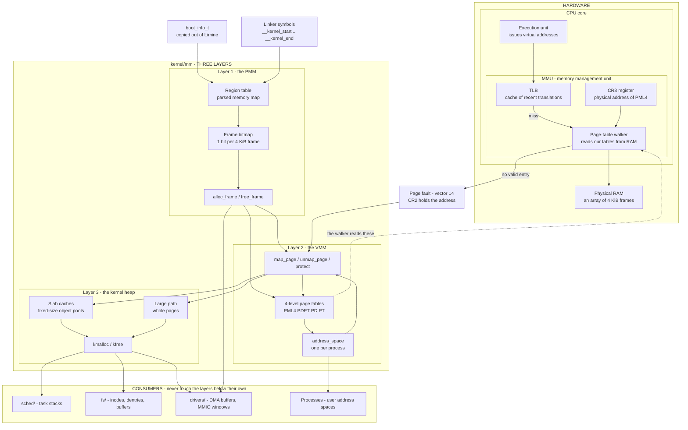

### Walking every box

**Hardware, top of the diagram.**

- **Execution unit.** Every instruction that touches memory — a load, a store, an
  instruction fetch, a stack push — produces a *virtual address*. The execution
  unit never sees a physical address. Not once, ever, while paging is enabled.
- **TLB (Translation Lookaside Buffer).** A small, fully-hardware cache holding
  recently-used virtual-to-physical translations. On a hit, translation costs
  nothing. It exists because the alternative — walking four levels of tables in
  RAM for every access — would make the machine roughly five times slower. The
  TLB is the reason [§3.3](#33-layer-2--the-page-tables-stage-43) spends so much
  space on *invalidation*: a cache you cannot invalidate correctly is a cache
  that lies.
- **Page-table walker.** On a TLB miss, this hardware unit reads our tables out
  of RAM, four dependent loads deep, and produces the physical address. It also
  writes back into our tables: the Accessed and Dirty bits. It is the only piece
  of the CPU that reads the structures we build in Layer 2.
- **CR3.** A control register holding the *physical* address of the top-level
  table. It is the single pointer that defines "what this CPU can currently see".
  Writing CR3 changes the entire address space in one instruction.
- **Physical RAM.** Bytes at fixed physical addresses. The only thing Layer 1
  cares about, and the only thing the memory controller understands.

**The three software layers, middle.**

- **Layer 1 — the PMM (physical memory manager).** Owns physical RAM. Its
  interface is two functions: give me a free 4 KiB frame, and here is one back.
  It has no idea what a virtual address is. It is deliberately architecture-
  neutral and lives in `kernel/mm/pmm.cpp`, which is why it is host-testable
  ([[07 - Repository Layout]], boundary rule 1).
  - **Region table** — the digested memory map: which physical ranges exist and
    what each is for.
  - **Frame bitmap** — one bit per frame, the actual free/used state.
- **Layer 2 — the VMM (virtual memory manager).** Owns the mapping from virtual
  to physical. Its interface is `map_page(virt, phys, flags)` and friends. It
  *calls* the PMM whenever it needs a frame — either to hold a new page table, or
  to back a page someone asked for. It never calls upward.
  - **`address_space`** — the object representing one process's view of memory:
    a root table plus the list of regions that are supposed to be there.
  - **Page tables** — the four-level structure the walker reads.
- **Layer 3 — the kernel heap.** Owns *sub-page* allocation. Its interface is
  `kmalloc(size)` / `kfree(ptr)`. It asks the VMM for pages of virtual address
  space backed by frames, then carves those pages into objects.
  - **Slab caches** — pools of same-sized objects, the fast path.
  - **Large path** — anything bigger than the largest size class goes straight to
    whole pages.

**Consumers, bottom.** The scheduler, filesystem, and drivers call `kmalloc`.
They do not call `alloc_frame` and they do not call `map_page` — with one
principled exception: a driver doing DMA needs *physically contiguous, physically
addressed* memory, because the device's address translation is not ours. That is
the arrow from `alloc_frame` straight to `drivers/`.

**Inputs, left.** `boot_info_t` carries the memory map copied out of Limine's
response structures ([[06 - Architecture Overview]], the boot chain). The linker
symbols carry the kernel image's own extent
([[Stage 0.4 - The Linker Script and Higher-Half Layout]]). Both feed the region
table before anything else can run.

**Every arrow.**

- `boot_info_t → regions` and `linker symbols → regions`: the two facts the PMM
  needs before it can decide anything. Step 8 of the initialisation order.
- `regions → bitmap`: the region table is *parsed once* into the bitmap, then
  discarded as a decision-maker. The bitmap is the live state.
- `bitmap → alloc_frame`: the API reads and writes the bitmap. Nothing else may.
- `alloc_frame → page tables`: a page table **is** a frame. Creating a mapping at
  a fresh address may require allocating up to three new tables.
- `alloc_frame → map_page` and `map_page → page tables`: mapping a page needs a
  frame to map *and* possibly frames to hold the tables that describe it.
- `page tables ↔ address_space`: an address space owns a root table; the VMM API
  operates on an address space.
- `map_page → slab`, `map_page → large`: the heap gets its raw material as
  mapped virtual pages, not as frames. It never sees physical addresses.
- `slab/large → kmalloc`: `kmalloc` is a router that picks a size class or the
  large path.
- `kmalloc → sched/fs/drivers`: the entire rest of the kernel.
- `address_space → processes`: [[Phase 6 - Overview|Phase 6]] onward, each
  process gets one.
- `exec → TLB → walker → RAM`: the hardware translation path. The dashed arrow
  from `page tables` to `walker` is the important one: **the walker reads the
  structures we wrote, and there is no other channel between us and it.** We do
  not "tell" the MMU anything; we write bytes into RAM at an address we put in
  CR3, and the hardware reads them.
- `walker → page fault → map_page`: when the walker finds no valid entry it
  raises exception vector 14. The handler runs *our* code, which can fix the
  tables and retry. This one arrow is the foundation of demand paging, lazy stack
  growth, `mmap`, and copy-on-write. Without it, memory management is static
  bookkeeping. With it, memory becomes a thing you can be *lazy* about.

---

## 3. Zooming in

### 3.1 Layer 0 — the memory map ([[Stage 4.1 - Reading the Memory Map]])

You cannot allocate RAM until you know which RAM exists. You do not find that out
yourself: probing memory by writing patterns and reading them back is unreliable
on real hardware and dangerous where memory-mapped devices live. The firmware
already enumerated it, and Limine passes the result on.

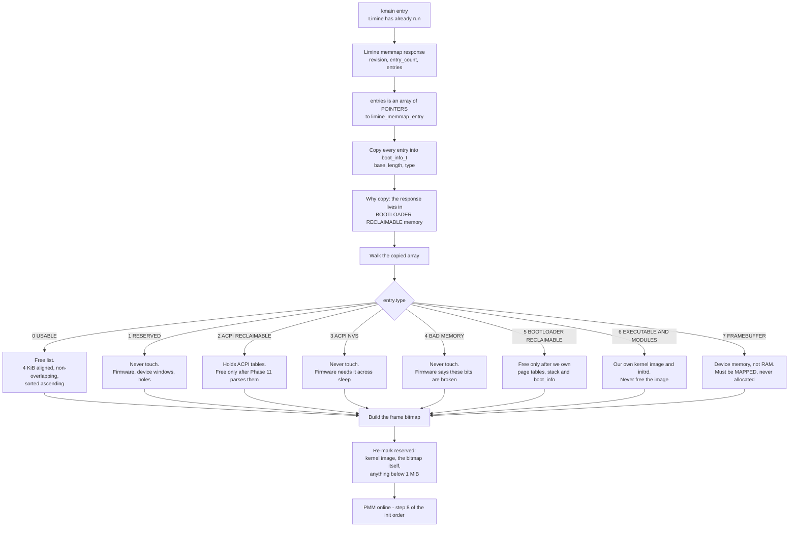

**Walking it.** Limine's memory-map response gives three fields: a revision, an
entry count, and `entries`. That last one catches people: it is an array of
*pointers to* entries, not an array of entries. Indexing it as a flat struct
array produces a region table of garbage that happens to parse.

Each entry is three 64-bit fields — `base`, `length`, `type`. There are eight
types, and the whole art of this stage is knowing what each one licenses you to
do. The switch in the diagram is the complete list:

| Type | Name | May we allocate from it? | Notes |
|---|---|---|---|
| 0 | `USABLE` | **Yes** | The only unconditional yes. |
| 1 | `RESERVED` | No | Firmware regions, memory holes, device address windows. Not RAM you own. |
| 2 | `ACPI_RECLAIMABLE` | Later | Holds the ACPI tables. Becomes usable once [[Phase 11 - Overview\|Phase 11]] has parsed and copied what it needs. |
| 3 | `ACPI_NVS` | No | Non-volatile firmware scratch. Corrupting it breaks sleep and resume. |
| 4 | `BAD_MEMORY` | No | The firmware has flagged these cells as faulty. Trust it. |
| 5 | `BOOTLOADER_RECLAIMABLE` | Later — carefully | Limine's own structures, page tables, and the stack it handed us. |
| 6 | `EXECUTABLE_AND_MODULES` | No (image), later (modules) | Our loaded `kernel.elf` and `initrd.tar`. |
| 7 | `FRAMEBUFFER` | **No** | Not RAM at all. Device memory behind the same address bus. |

> [!warning] The reclaimable-memory trap, stated precisely
> Type 5 is the one that will cost you a day. **Three live things sit in
> bootloader-reclaimable memory when `kmain` starts:**
>
> 1. **Every Limine response structure**, including the memory map you are
>    reading right now.
> 2. **The page tables the CPU is currently translating through.** Limine built
>    them, enabled paging, and jumped to us. `CR3` points into type-5 memory.
> 3. **The stack `kmain` is running on.** Limine provided it.
>
> Add type 5 to the free list before replacing all three and the allocator will
> eventually hand out the page tables it is being translated through, or the
> stack it is standing on. The fault arrives minutes later, in unrelated code,
> with a call stack that makes no sense. This is why the fix is *ordering*, not
> defensiveness: copy the responses out (Phase 0), switch to our own stack
> (Phase 0), build our own tables and load `CR3` ([[Stage 4.3 - Enabling Paging]]),
> **then** reclaim.

Three guarantees Limine's protocol makes that the parser depends on: entries are
sorted by base address ascending; usable and bootloader-reclaimable entries are
4 KiB-aligned in both base and length; and usable and bootloader-reclaimable
entries never overlap any other entry. **Nothing is guaranteed about the other
types** — they may overlap, and they may be unaligned. Verify the exact wording
against `PROTOCOL.md` for the pinned `v8.6.0-binary` before relying on it, and
round non-usable regions *outward* to frame boundaries when reserving so a
partial frame is never handed out.

> [!example] A real memory map, QEMU with `-m 512M`
> ```
> base 0x0000000000000000  len 0x000000000009F000  type 0  USABLE
> base 0x000000000009F000  len 0x0000000000001000  type 1  RESERVED
> base 0x00000000000E8000  len 0x0000000000018000  type 1  RESERVED
> base 0x0000000000100000  len 0x000000001FEF0000  type 0  USABLE
> base 0x000000001FFF0000  len 0x0000000000010000  type 2  ACPI RECLAIMABLE
> base 0x00000000FD000000  len 0x0000000001000000  type 7  FRAMEBUFFER
> ```
> Note what is *not* here: a single contiguous 512 MiB block. There is a hole
> below 1 MiB (legacy device space), a hole for firmware, and a framebuffer
> parked at a physical address far above installed RAM. The total of the type-0
> lengths is what "512M" actually bought. **Never assume contiguity, never
> assume RAM starts at zero, and never assume the highest physical address is
> the amount of RAM.**

#### The lifecycle of one physical frame

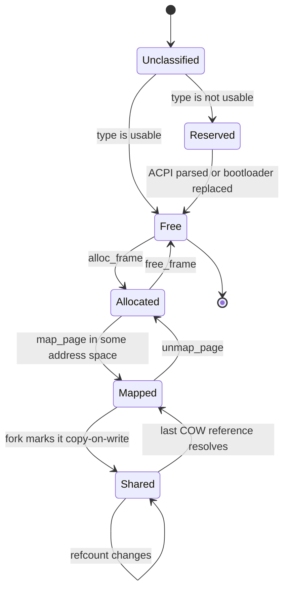

A frame starts unclassified — the bitmap is initialised to *all used*, which is
the safe default, because a bug that leaves a region unclassified then fails
closed rather than handing out firmware memory. Parsing moves usable frames to
Free. Two reserved categories can be promoted later, exactly once, when their
original owner is finished with them. `alloc_frame` moves a frame to Allocated;
mapping it into an address space moves it to Mapped; `fork` in
[[Phase 13 - Overview|Phase 13]] can push it to Shared, where a reference count
rather than a single bit decides when it may return to Free.

The self-loop on Shared is not decoration: a frame shared by eight processes has
seven reference-count decrements before it is anything other than Shared. On SMP
those decrements are concurrent, which is why the count must be atomic
([[Phase 12 - Overview|Phase 12]]).

---

### 3.2 Layer 1 — the frame allocator ([[Stage 4.2 - The Physical Frame Allocator]])

The frame allocator is 150 lines of code and one of the most consequential design
decisions in the kernel, because everything above it inherits its properties.

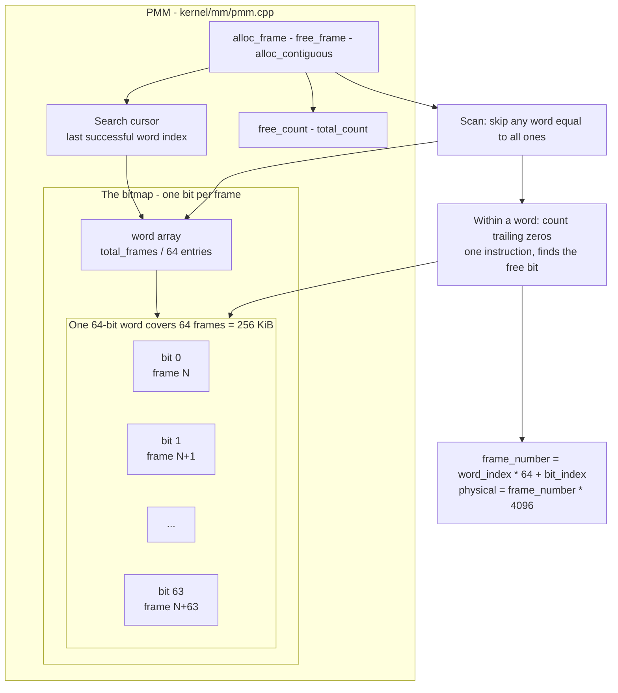

**Walking it.** The public surface is three functions. `alloc_frame` returns one
frame. `free_frame` returns one. `alloc_contiguous(n)` returns `n` *physically
adjacent* frames — needed only by DMA-capable drivers, and the requirement that
forces the whole design.

The bitmap is an array of 64-bit words. Frame *number* `n` lives in word `n / 64`
at bit `n % 64`; its physical address is `n * 4096`. Confusing frame number with
frame address is the classic bug in this file, and it is silent — the numbers are
plausible either way.

The scan is not a bit-at-a-time loop. Read a whole word; if it equals
`0xFFFF...FF` every frame it covers is used, so skip 64 frames in one comparison.
On the first word that is not all-ones, `__builtin_ctzll(~word)` gives the index
of the lowest zero bit in one instruction. The search cursor remembers where the
last success was, so a run of allocations does not rescan the used prefix every
time. That turns a nominally O(n) scan into something that costs a handful of
cycles in the common case.

`free_count` and `total_count` exist so that `kmalloc` failure has a diagnosis
and so an in-kernel test can assert that a `alloc`/`free` cycle is balanced.

#### The real tradeoff

| Option | Metadata for 4 GiB RAM | `alloc` | `free` | Contiguous run of 16? | Survives a wild write into a freed frame? | Verdict |
|---|---|---|---|---|---|---|
| **A. Bitmap (chosen)** | 128 KiB, fixed | ~O(1) with a cursor; O(n/64) worst case | O(1) | **Yes** — scan for 16 clear bits | **Yes** — metadata is outside the frames | ✅ |
| B. Intrusive free list | 0 bytes | O(1) always | O(1) | **No** — needs a full traversal and a sort | **No** — the list pointers live *inside* free frames | ❌ |
| C. Buddy allocator | ~256 KiB plus order lists | O(log n) | O(log n) + merge | **Yes**, natural and cheap | Yes | ➖ later |

**The numbers.** 4 GiB is 2²⁰ frames. One bit each is 2²⁰ bits = **128 KiB**,
which is 1/32768 of RAM — 0.003%. For the 128 MiB QEMU default it is 4 KiB. The
fixed cost is not a cost.

**Why A.** Two properties decide it, and neither is speed.

*Contiguous allocation.* A device doing DMA writes to *physical* addresses. It
has no MMU of ours and, before an IOMMU exists, no translation at all. An AHCI
command table or an e1000 receive ring must be physically contiguous, and the
driver must know its physical address. With a bitmap, "find 16 adjacent free
frames" is a scan for 16 consecutive clear bits — mildly annoying but obviously
correct. With an intrusive free list it is not implementable without traversing
and sorting the entire list, because the list has no notion of adjacency.
[[Phase 9 - Overview|Phase 9]] and [[Phase 14 - Overview|Phase 14]] both need
this, and discovering it after the allocator is load-bearing is a rewrite.

*Failure containment.* An intrusive free list stores its `next` pointer *inside
the free frame*, reachable through the HHDM. This is elegant and costs zero
metadata. It also means that a single stray write into a freed frame — a
use-after-free anywhere in the kernel — corrupts the allocator's linked list,
and the symptom appears at some later, unrelated allocation. A bitmap keeps its
state in a separate array; the same bug corrupts the freed frame's contents and
nothing else. When you are debugging a kernel with no debugger attached, the
distance between the bug and its symptom is the single variable that matters.

**Why not C, yet.** A buddy allocator gives cheap contiguous allocation of
power-of-two orders and cheap coalescing, which is why Linux uses one. It is also
a genuinely more complex data structure with a genuinely more complex failure
mode, and until a profile shows the bitmap scan on a hot path there is nothing to
buy. The bitmap's interface — `alloc_frame`, `free_frame`, `alloc_contiguous` —
is exactly the interface a buddy allocator provides, so this is a swap, not a
rewrite. That is the point of putting it behind three functions.

#### Reserving the kernel image

The allocator must never return a frame the kernel is running out of. There are
two independent sources of truth for where that is, and we use both.

**Source one: Limine.** The loaded image is marked type 6 in the memory map, so
it is excluded by construction, along with the initrd.

**Source two: the linker symbols.** `__kernel_start` and `__kernel_end` bound the
image exactly ([[Stage 0.4 - The Linker Script and Higher-Half Layout]]).

> [!warning] The linker symbols are *virtual* addresses
> `__kernel_start` is `0xFFFFFFFF80000000`. The PMM deals in *physical*
> addresses. You cannot subtract one from the other and call it done.
>
> The conversion comes from Limine's executable-address response, which reports
> `physical_base` and `virtual_base` for the loaded image:
>
> ```
> phys = (virt - virtual_base) + physical_base
> ```
>
> Copy both values into `boot_info_t` alongside the memory map. Skipping this and
> assuming the image sits at some fixed physical address works under QEMU by
> accident and fails on the first machine whose firmware places it elsewhere.

Using both sources is not redundancy for its own sake. The type-6 region is what
*actually* keeps the allocator honest. The linker symbols are what
[[Stage 4.3 - Enabling Paging]] needs to give `.text`, `.rodata` and `.data`
different page permissions, and what [[Phase 15 - Overview|Phase 15]] needs for
W^X. Asserting at boot that the symbol-derived range lies inside the type-6
region is a two-line `KASSERT` that catches a whole class of layout drift.

Three more things get reserved, and forgetting any of them is a distinctive bug:

- **The bitmap itself**, if it is allocated from the memory it describes.
  Otherwise the allocator hands out its own bookkeeping and the first symptom is
  frames being allocated twice.
- **Everything below 1 MiB.** Legacy device space, the BIOS data area, and — from
  [[Phase 12 - Overview|Phase 12]] — the AP trampoline, which must live in the
  low 1 MiB because application processors start in real mode.
- **The framebuffer's physical range.** It is device memory. Handing it out as
  RAM means a heap object is silently aliased to the screen; you will see your
  own kernel structures rendered as coloured noise, which is at least a memorable
  way to learn this.

---

### 3.3 Layer 2 — the page tables ([[Stage 4.3 - Enabling Paging]])

This is the deepest part of the document. Take it slowly.

#### The address split

An x86_64 virtual address in 4-level paging mode has 48 significant bits,
sign-extended to 64. Those 48 bits are cut into five fields:

```
 63          48 47      39 38      30 29      21 20      12 11         0
┌──────────────┬──────────┬──────────┬──────────┬──────────┬────────────┐
│ sign extend  │  PML4    │  PDPT    │   PD     │   PT     │   offset   │
│ 16 bits      │  9 bits  │  9 bits  │  9 bits  │  9 bits  │  12 bits   │
│ = bit 47     │  index   │  index   │  index   │  index   │ into frame │
└──────────────┴──────────┴──────────┴──────────┴──────────┴────────────┘
```

Every number here is forced, not chosen:

- **12 bits of offset** because pages are 4 KiB. 2¹² = 4096.
- **9 bits per index** because a table entry is 8 bytes and a table is one page.
  4096 / 8 = 512 = 2⁹. Each level is *exactly* one page. That is the whole reason
  the split is 9/9/9/9: it makes tables allocatable from the frame allocator with
  no special case.
- **Four levels** because 4 × 9 + 12 = 48 bits, and 48 bits is what the hardware
  implements. Three levels would give 39 bits — 512 GiB — which was not enough
  when AMD designed this. Five levels exist on newer parts and give 57; Limine
  can be asked for either, and we ask for 4
  ([[06 - Architecture Overview]], the memory-layout section).
- **Sign extension** because 48 < 64. Bits 63:48 must all equal bit 47, which
  splits the space into a low half and a high half with a **non-canonical hole**
  between `0x0000800000000000` and `0xFFFF800000000000`.

> [!warning] Touching the non-canonical hole gives you `#GP`, not `#PF`
> This surprises everyone once. A pointer whose top bits are inconsistent is not
> a *translation* failure — the address is malformed before translation is
> attempted. The CPU raises **general protection fault, vector 13**, with error
> code 0, and **`CR2` is not updated**.
>
> So the debugging rule is: a page fault means "this address is well-formed but
> not mapped, or mapped without the permission you used". A `#GP` on a memory
> access means "this address is not an address". Wild pointers built from
> uninitialised memory hit the second case far more often than the first, because
> most 64-bit garbage is non-canonical.

#### Coverage per level

| Level | Index bits | Entries | Each entry covers | One table covers |
|---|---|---|---|---|
| PML4 | 47:39 | 512 | 512 GiB | 256 TiB |
| PDPT | 38:30 | 512 | 1 GiB | 512 GiB |
| PD | 29:21 | 512 | 2 MiB | 1 GiB |
| PT | 20:12 | 512 | 4 KiB | 2 MiB |

This table lets you read our memory layout at a glance:

- **HHDM at `0xFFFF800000000000` is PML4 entry 256** — the first entry of the
  upper half. Entries 256 through 287 are 16 TiB of address space reserved for
  the direct map, which is more physical RAM than any machine we will meet.
- **Per-CPU areas at `0xFFFF900000000000` are PML4 entry 288.**
- **The kernel heap at `0xFFFFFFFF00000000` and the kernel image at
  `0xFFFFFFFF80000000` are both inside PML4 entry 511** — the top 512 GiB. Within
  it, the heap occupies PDPT entries 508 and 509 (2 GiB) and the image starts at
  PDPT entry 510. The entire kernel therefore hangs off **one** PML4 entry, which
  is what makes "map the kernel into every address space" cheap: copying one
  8-byte entry into every new process's PML4 shares the whole kernel.
- **The first 4 MiB of user space is PD entries 0 and 1** of the first PD. Leaving
  those two entries clear is what makes a null-pointer dereference fault.

#### A complete walk of one real address

Take `0xFFFF800012345678`. Because that is HHDM base plus `0x12345678`, we know in
advance it must translate to physical `0x12345678` — which makes it a good address
to check your index arithmetic against.

```
0xFFFF800012345678 in binary:

1111111111111111 100000000 000000000 010010001 101000101 011001111000
└─── 63:48 ────┘ └ 47:39 ┘ └ 38:30 ┘ └ 29:21 ┘ └ 20:12 ┘ └── 11:0 ──┘
   sign extend    PML4=256   PDPT=0    PD=145    PT=325   offset=0x678
```

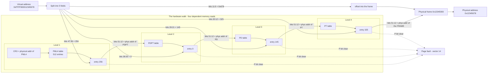

**Walking it.** The address is split into five fields. `CR3` supplies the physical
address of the PML4 — this is the only place the chain is anchored, and it is a
*physical* address because the hardware cannot translate its way to the thing
that does translation.

The walker reads PML4 entry 256, takes bits 51:12 of that entry as the physical
address of the next table, and reads PDPT entry 0 there. Same again for PD entry
145, then PT entry 325. That last entry's bits 51:12 are the physical address of
the actual data frame, and the 12-bit offset is appended unchanged.

**Four dependent memory reads.** Dependent, so they cannot be overlapped: each
address depends on the previous read's result. This is why the TLB exists and why
a TLB miss is expensive.

The dotted arrows are the failure path, and they can trigger at *any* of the four
levels. A page fault does not mean "the last table entry was missing"; it means
"somewhere in this chain, an entry was absent or the access violated its
permissions". `CR2` tells you the virtual address; it does not tell you which
level failed. Walking the tables yourself in the fault handler and printing all
four entries is the single most valuable debugging tool in this phase, and it is
about forty lines ([[14 - Debugging Playbook]]).

> [!example] Check the arithmetic yourself
> `0x12345678` = 305,419,896.
> - PD index: `0x12345678 >> 21 = 145`. 145 × 2 MiB = `0x12200000`.
> - Remainder: `0x12345678 - 0x12200000 = 0x145678`.
> - PT index: `0x145678 >> 12 = 0x145 = 325`. 325 × 4 KiB = `0x145000`.
> - Offset: `0x145678 - 0x145000 = 0x678`. ✓
>
> Now do `0x0000000000400000`, the user program base. PML4 0, PDPT 0, PD 2, PT 0,
> offset 0 — which is why "the first 4 MiB is unmapped" means "PD entries 0 and 1
> are clear".

#### The bits in an entry

Every entry at every level is 64 bits with the same *shape*, but bits 6, 7 and 8
mean different things depending on the level.

```
 63   62-59    58-52              51 ── 12               11-9   8   7   6   5   4   3   2   1   0
┌────┬─────────┬────────┬───────────────────────────────┬──────┬───┬───┬───┬───┬───┬───┬───┬───┬───┐
│ NX │  PKEY   │ AVAIL  │  physical frame address 51:12 │ AVL  │ G │PAT│ D │ A │PCD│PWT│U/S│R/W│ P │
└────┴─────────┴────────┴───────────────────────────────┴──────┴───┴───┴───┴───┴───┴───┴───┴───┴───┘
```

| Bit | Name | Meaning | Who writes it | If you get it wrong |
|---|---|---|---|---|
| 0 | **P** — Present | 1 = this entry is valid and the walk continues | Us | 0 on any level → page fault. This is *the* bit. |
| 1 | **R/W** — Writable | 1 = writes allowed | Us | Kernel `.text` left writable is a W^X hole. User data left read-only faults on first write. |
| 2 | **U/S** — User | 1 = ring 3 may access | Us | Set on a kernel page → user code reads kernel memory. **Full compromise.** Clear on a user page → every user access faults. |
| 3 | **PWT** — Write-Through | Cache policy: write-through instead of write-back | Us | Wrong policy on MMIO gives stale device reads. |
| 4 | **PCD** — Cache Disable | Cache policy: uncacheable | Us | Missing on an MMIO window → the CPU caches device registers. Missing on RAM → the framebuffer works but everything is slow. |
| 5 | **A** — Accessed | Set by hardware on any access | **CPU** | Never cleared by us in v1. Needed by page-replacement policies later. |
| 6 | **D** — Dirty | Set by hardware on write. Only in the entry that maps a page | **CPU** | Needed for writeback and swap. Ignored in upper levels. |
| 7 | **PS / PAT** | In a PDE or PDPTE: **PS**, 1 = this entry maps a large page and the walk stops here. In a PTE: **PAT**, a cache-policy selector | Us | PS set by accident in a PDE → the "next table pointer" is read as a 2 MiB frame address. Spectacular. |
| 8 | **G** — Global | Translation survives a `CR3` reload | Us | Set on a user page → a stale translation leaks across a process switch. Never set G on user pages. |
| 11:9 | **AVL** — Available | Ignored by hardware. Ours | Us | **This is where the copy-on-write marker lives.** See §5.3. |
| 51:12 | **Address** | Physical address of the next table, or of the frame | Us | Must be 4 KiB-aligned; the low 12 bits are the flags. |
| 58:52 | Available | Ignored by hardware | Us | Spare software bits. |
| 62:59 | **PKEY** | Protection keys, requires `CR4.PKE` | — | Unused in v1. Leave zero. |
| 63 | **NX** — No Execute | 1 = instruction fetches fault | Us | Requires `EFER.NXE = 1` first. **Setting NX before enabling NXE sets a reserved bit and every mapping faults.** |

Two composition rules that catch people:

- **Permissions AND down the chain.** The effective R/W and U/S for a page are the
  logical AND across all four entries. A PTE marked writable inside a PDE marked
  read-only is *not* writable. This is a feature — clearing U/S on one PML4 entry
  makes 512 GiB inaccessible to ring 3 in one write — and a trap, because
  debugging "the PTE clearly says writable" means looking one level up.
- **NX ORs down the chain.** If *any* level has bit 63 set, the region is
  non-executable. Same mechanism, opposite polarity.

#### What CR3 holds

| Bits | Meaning when `CR4.PCIDE = 0` (our case) |
|---|---|
| 63:52 | Reserved, must be zero |
| 51:12 | **Physical** address of the PML4, 4 KiB-aligned |
| 11:5 | Ignored |
| 4 | PCD — cache policy for the PML4 itself |
| 3 | PWT — cache policy for the PML4 itself |
| 2:0 | Ignored |

Two consequences. First, `CR3` is a *physical* address, so loading it means
converting the PML4's virtual address back to physical — which under the HHDM is
a subtraction, and is the most common place people accidentally load a virtual
address and instantly triple-fault. Second, **writing `CR3` flushes every
non-global TLB entry**, which is both a feature (it is how a context switch
invalidates the old address space) and a cost (a few hundred cycles of subsequent
TLB misses). PCID would let us tag translations per address space and skip the
flush; it is deliberately out of scope for v1 and belongs with the SMP work in
[[Phase 12 - Overview|Phase 12]].

#### TLB invalidation

The TLB caches translations. If you change a page table entry, the TLB may still
be serving the old answer. There is no coherence protocol for this: **the CPU
will not notice that you edited RAM the walker previously read.** Invalidation is
entirely your responsibility.

| What changed | Required action | Why |
|---|---|---|
| Entry made present (0 → 1) | Nothing, architecturally | The CPU only caches translations that would not fault, so there is no stale entry to evict. A stray `invlpg` costs one instruction; skipping it wrongly costs one *spurious* fault, which a correct handler simply returns from. |
| Frame address changed | **`invlpg [addr]`** | The old translation is cached and points at the wrong frame. Silent data corruption. |
| Permissions tightened (RW → R, or NX set) | **`invlpg [addr]`** | The permissive entry is cached. The protection you just added does not exist until you invalidate. |
| Permissions loosened (R → RW) | `invlpg [addr]` | Otherwise the next write takes a fault the tables say should not happen. Benign but confusing. |
| Entry removed | **`invlpg [addr]`** | Otherwise the page stays readable after `unmap`. This is a use-after-free the hardware helps you not notice. |
| Many pages at once | Reload `CR3` | Cheaper than thousands of `invlpg`. Does **not** flush entries with the G bit set. |
| Global pages must go | Toggle `CR4.PGE` off and on | The only way to flush G-bit entries. |
| Any of the above, on SMP | `invlpg` locally **plus an IPI** to every other CPU that has this address space loaded | Each core has its own TLB. See [[Phase 12 - Overview\|Phase 12]] and §5.4. |

> [!warning] The permission-tightening case is a security bug, not a correctness bug
> "I marked this page read-only but forgot to invalidate" reads like a
> performance nit. It is not. Until the invalidation happens, the page is still
> writable on that core, through a cached translation that no longer matches any
> table in memory. Every W^X and COW mechanism in this kernel depends on
> tightening actually taking effect at the moment you tighten it.

#### Why we rebuild the tables at all

Limine hands us a working address space: kernel mapped, HHDM present, framebuffer
mapped, paging on. We throw it away and build our own in
[[Stage 4.3 - Enabling Paging]]. Three reasons.

1. **Limine's tables live in bootloader-reclaimable memory.** We cannot free that
   region while translating through it.
2. **Limine maps our sections with the permissions from the ELF program headers,
   which is coarse.** We want `.text` as `R X` with NX everywhere else, `.rodata`
   as `R` with no write and no execute, and `.data`/`.bss` as `RW` with NX. That
   requires per-section mapping using the linker symbols, and it is what makes
   [[Phase 15 - Overview|Phase 15]]'s W^X a configuration change rather than a
   project.
3. **We need to be able to make new address spaces.** A process is an address
   space ([[Phase 6 - Overview|Phase 6]]). Code that can build one from nothing is
   code we have to write regardless; writing it for the kernel's own space first
   means debugging it while there is exactly one thread and no user mode.

> [!danger] The three things that must be in your new tables before you load CR3
> The instruction *after* `mov cr3, rax` is fetched through the new tables.
>
> 1. **The code doing the switch**, or the fetch faults and you triple-fault with
>    no output at all — QEMU just resets.
> 2. **The stack**, or the first push or `ret` faults.
> 3. **The framebuffer and the serial port's mapping**, or you lose your only two
>    ways to find out what went wrong.
>
> Symptom triage: if the machine resets instantly, it is 1 or 2. If it keeps
> running and serial still talks but the screen freezes, it is the framebuffer —
> which is exactly why serial comes first in the initialisation order
> ([[06 - Architecture Overview]], step 1).

---

### 3.4 Layer 3 — the kernel heap ([[Stage 4.4 - The Kernel Heap]])

The frame allocator's smallest unit is 4096 bytes. A directory entry is maybe 40.
Allocating a frame per directory entry wastes 99% of RAM. The heap exists to
close that gap.

This is the diagram that goes four levels deep: heap → allocator path → cache →
slab → object.

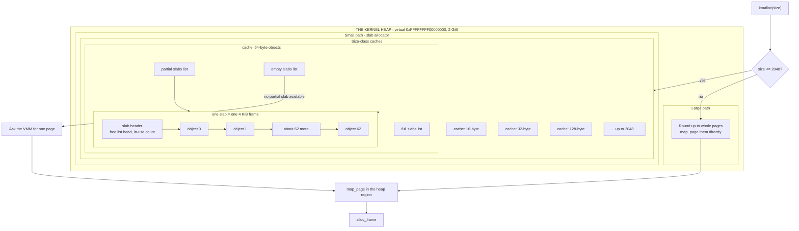

**Walking it.** `kmalloc` is a router, not an allocator. It looks at the size and
picks one of two paths.

**Small path — the slab allocator.** There is one *cache* per size class: 16, 32,
64, 128, 256, 512, 1024, 2048 bytes. A cache owns *slabs*. A slab is one frame's
worth of virtual memory divided into objects of that cache's size, plus a small
header. For the 64-byte cache, one 4 KiB slab holds roughly 62 objects after the
header.

Each cache keeps three lists: slabs that are completely full, slabs with room
(*partial*), and slabs that are completely empty. Allocation takes the first
partial slab, pops an object off that slab's internal free list, and returns it —
a handful of instructions, no search. If there is no partial slab, an empty one is
promoted; if there is no empty one, the cache asks the VMM to map another page.

The objects are chained in the diagram because the free objects *are* the free
list: the `next` pointer is written into the object's own bytes while it is free.
This is safe here in a way it is not in the PMM, because a slab's objects are all
the same size, the corruption is confined to one cache, and (unlike a physical
frame) an in-use kernel object being written after free is already a bug we would
want to catch.

**Large path.** Anything above 2048 bytes rounds up to whole pages and gets its
own mapping. No headers, no size classes. Above a page, the internal waste from
rounding is proportionally small and the bookkeeping cost of doing better is not
worth it.

**Growth.** Both paths bottom out in the same two calls: `map_page` for virtual
address space, `alloc_frame` for the physical backing. The heap occupies exactly
2 GiB of virtual address space between `0xFFFFFFFF00000000` and the kernel image
at `0xFFFFFFFF80000000`, and it grows upward into it.

#### Why a slab allocator on top of a free-list heap

The simplest correct heap is a linked list of blocks with a header on each:
`{ size, free, next }`. It works, and [[Stage 4.4 - The Kernel Heap]] builds it
first because you should be able to write one from memory. Then it stops scaling,
for two measurable reasons.

**Internal fragmentation from headers.** A 16-byte header on a 24-byte
allocation is 40% overhead. The kernel allocates enormous numbers of small
objects — every list node, every dentry, every file descriptor — and 40% of the
kernel's small-object memory is not a rounding error.

**External fragmentation from splitting.** Allocate 100 objects of alternating
32 and 48 bytes, free every 48-byte one. You now have 50 free blocks of 48 bytes
each, separated by live 32-byte blocks, and a request for 64 bytes fails even
though 2400 bytes are free. Coalescing only helps when free blocks are
*adjacent*, and adversarial-looking patterns like this happen naturally in a
kernel because allocation lifetimes correlate with object types.

The slab allocator's insight is to **convert external fragmentation into internal
fragmentation, where it is bounded and predictable.**

| Property | Header free-list | Slab |
|---|---|---|
| Per-object metadata | 16 bytes, always | **0 bytes** — the slab knows the size |
| `alloc` cost | Search a list, split | **Pop a free-list head** |
| `free` cost | Find neighbours, coalesce | **Push a free-list head** |
| Waste on a 24-byte object | 16 bytes of header | 8 bytes — rounded up to the 32-byte class |
| External fragmentation | Unbounded, grows with time | **Zero within a cache** |
| Worst-case waste | Unbounded | One partially-full slab per cache, bounded by `slab_size × cache_count` |
| Cache behaviour | Objects of one type scattered | Objects of one type packed together |
| `kfree` needs to know | Read the header behind the pointer | Mask the pointer to its slab base and read the slab header |

The last row is the one design decision worth stating explicitly. `kfree(ptr)`
receives a bare pointer and must work out which cache it came from. A header
would answer that instantly — and reintroduce the overhead we just removed.
Instead, because a slab is page-aligned and one page long, masking the pointer
with `~0xFFF` gives the slab's base address, where the slab header sits. One AND
instruction, zero per-object cost. This is why slabs are page-aligned, and it is
the reason the slab size is not a free parameter.

> [!question] Where did the fragmentation go?
> The slab allocator does not eliminate waste; it *relocates* it. A cache with
> one 64-byte object live still holds a whole 4 KiB slab. Under what allocation
> pattern is a slab allocator strictly worse than a free-list heap — and what
> does the kernel do about it? (Hint: what should happen to the *empty* slab
> list under memory pressure, and why is it a separate list from *partial*?)

---

## 4. The data structures

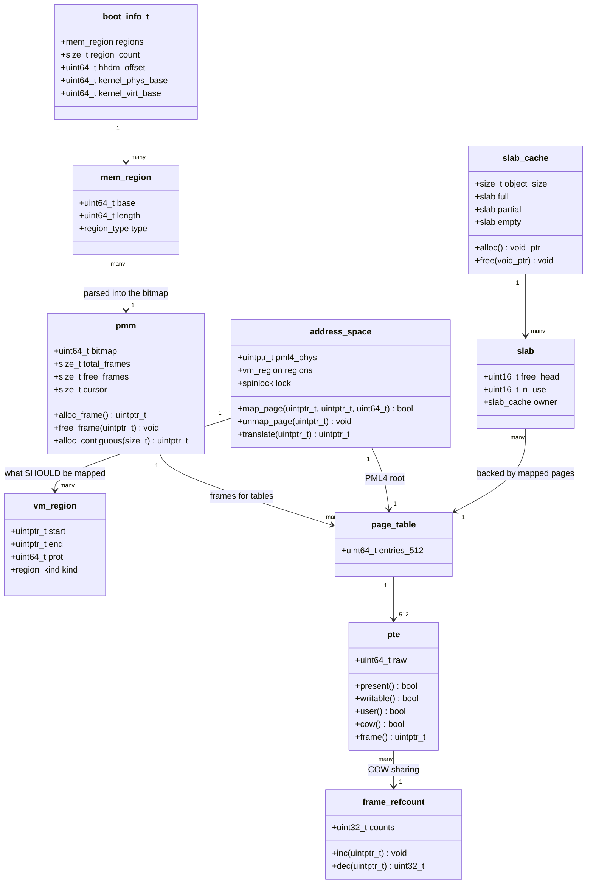

**The structures, and why each field exists.**

| Structure | Field | Size | Why it is there |
|---|---|---|---|
| `boot_info_t` | `regions`, `region_count` | array | The memory map, copied out of bootloader-reclaimable memory before it is reclaimed. |
| | `hhdm_offset` | 8 B | `0xFFFF800000000000` in practice, but **read it from Limine, do not hardcode it**. Adding it to a physical address gives a usable virtual one. |
| | `kernel_phys_base`, `kernel_virt_base` | 8 B each | Converts linker symbols to physical addresses. §3.2. |
| `mem_region` | `base`, `length`, `type` | 8/8/4 B | One entry of the map. Kept after parsing so `/proc`-style introspection and the ACPI-reclaim step can revisit it. |
| `pmm` | `bitmap` | pointer | The array of 64-bit words. |
| | `total_frames`, `free_frames` | 8 B each | Diagnosis and test assertions. `free_frames` going down across a balanced alloc/free cycle is a leak, detectable in a Tier-2 test. |
| | `cursor` | 8 B | Where the last successful scan ended. Turns a linear scan into an amortised near-constant one. |
| `address_space` | `pml4_phys` | 8 B | **Physical**, because it goes into `CR3`. Storing it as a virtual address is the classic instant triple fault. |
| | `regions` | list | The *declared* layout — what should be mapped, with what permissions. Distinct from the page tables, which are what *is* mapped. §5.2 explains why both are needed. |
| | `lock` | 4 B | Two threads mapping into the same address space race on table creation. Non-negotiable from [[Phase 12 - Overview\|Phase 12]]; cheap to add now. |
| `vm_region` | `start`, `end`, `prot`, `kind` | | Half-open range plus intended permissions plus what backs it — anonymous, file-backed, device, stack. The page-fault handler consults this to decide whether a fault is legitimate. |
| `page_table` | 512 × `uint64_t` | 4096 B | Exactly one frame. Same type at all four levels. |
| `pte` | `raw` | 8 B | A thin wrapper with named accessors. Raw `uint64_t` arithmetic scattered through the VMM is how flag bugs happen. |
| `frame_refcount` | `counts` | 4 B × frames | How many mappings reference each frame. Only needed once sharing exists ([[Stage 13.3 - Copy-on-Write]]). For 4 GiB of RAM at `uint32` each, this is 4 MiB — 0.1% of RAM. |
| `slab_cache` | `object_size` | 8 B | The size class. |
| | `full`, `partial`, `empty` | 3 lists | Allocation looks only at `partial`; `empty` is a reclaim reserve; `full` exists so a `free` can move a slab back. |
| `slab` | `free_head`, `in_use` | 2 B each | Index-based, not pointer-based, so the header stays small. |
| | `owner` | 8 B | What `kfree` finds after masking the pointer to the page boundary. |

#### The page-fault error code — bit by bit

When the CPU raises vector 14, it pushes a 32-bit error code *and* leaves the
faulting virtual address in `CR2`. Reading both correctly is most of the work of
diagnosing a fault.

| Bit | Name | 0 means | 1 means |
|---|---|---|---|
| 0 | **P** | The page was **not present** | A **protection violation** on a present page |
| 1 | **W/R** | The access was a **read** | The access was a **write** |
| 2 | **U/S** | The access came from **supervisor** mode (ring 0) | The access came from **user** mode (ring 3) |
| 3 | **RSVD** | — | A **reserved bit was set** in a paging structure. Always our bug. |
| 4 | **I/D** | — | The access was an **instruction fetch**. Only meaningful with `EFER.NXE = 1`. |
| 5 | **PK** | — | Protection-key violation. Unused in v1. |
| 6 | **SS** | — | Shadow-stack access. Unused in v1. |

The combinations are the diagnosis:

- `P=0, U=1, W=0` — user read of an unmapped address. Either a legitimate demand
  fault, or a segfault.
- `P=1, W=1, U=1` — user wrote to a present, read-only page. **The COW signature.**
  Also what a genuine write to `.rodata` looks like, which is why the handler must
  distinguish them by the AVL bit and the `vm_region`.
- `P=1, I=1` — attempted execution of a non-executable page. W^X did its job.
- `RSVD=1` — we constructed a bad entry. Almost always NX set without `EFER.NXE`,
  or a physical address with bits above 51.
- `P=0, U=0` and `CR2` near a kernel stack's low bound — **kernel stack
  overflow**, caught by the guard page from
  [[Stage 0.4 - The Linker Script and Higher-Half Layout]].

---

## 5. The flows

### 5.1 A cold `kmalloc` — all the way to the bottom

The interesting case is not the fast path. It is the first allocation of a new
size class, which touches all three layers and creates page tables on the way.

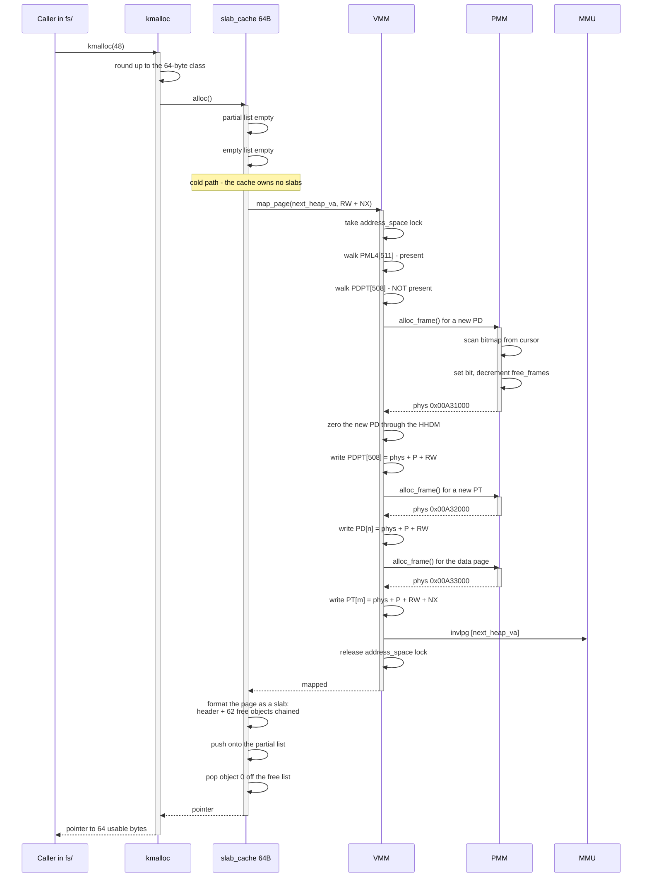

**Reading it.** Three separate frame allocations happen for one `kmalloc`,
because the virtual address being mapped is in a 1 GiB region that has never been
touched before, so neither the PD nor the PT for it exists yet. This is the
worst case and it happens once per gigabyte of heap; the 4,000 allocations after
it hit the slab's free list and cost a pop.

Three details worth naming.

**Zeroing new tables is mandatory, not hygiene.** A freshly allocated frame
contains whatever the previous owner left. Interpreted as page-table entries,
that is 512 random mappings with random permission bits — a randomly-addressed
window into physical memory, present bits included. Zeroing it is what makes the
"not present" default true.

**The zeroing happens through the HHDM.** `alloc_frame` returns a *physical*
address; we cannot write to a physical address with paging on. `hhdm_offset +
phys` gives a virtual address that already maps it. Without the HHDM this step
requires mapping the frame temporarily somewhere, writing, and unmapping — a
"recursive mapping" or a fixed scratch window — which is more code, needs a TLB
invalidation per operation, and needs its own lock. **The HHDM's entire
justification is that it makes this step a subtraction.**

**The lock is held across the whole walk.** Two threads mapping nearby addresses
could otherwise both observe "PDPT[508] not present", both allocate a PD, and
both write it — leaking one frame and, worse, leaving one thread's subsequent PT
writes going into a table that is no longer referenced. Its mappings simply do
not exist, and the fault appears much later.

### 5.2 A page fault, resolved — every outcome

This is the flowchart to internalise. It is the kernel's entire policy on "what
does this memory access mean", and every path ends somewhere specific.

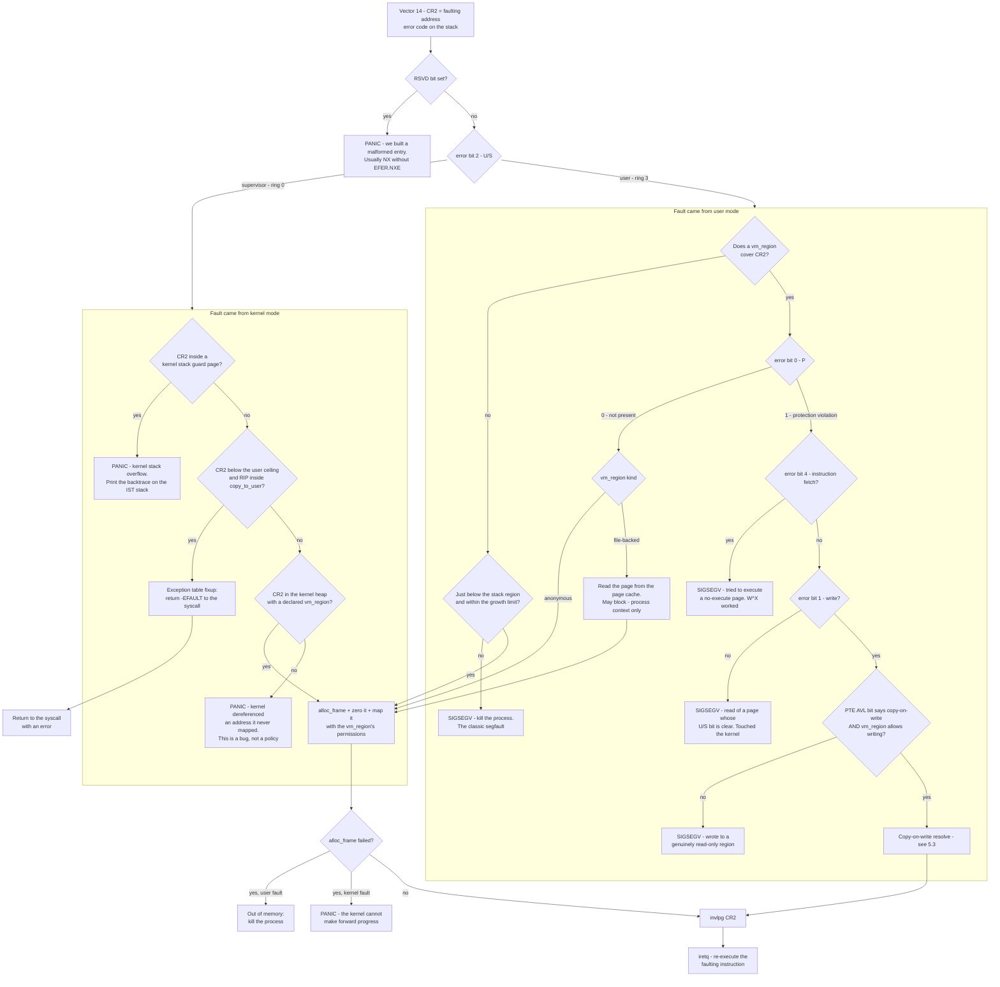

**Walking every path.**

The **reserved-bit check comes first** because it can never be a legitimate
fault. It means we constructed an entry the hardware rejects — overwhelmingly the
NX-without-NXE mistake — and nothing further in the handler will make sense.

**Supervisor faults, left branch.** Four outcomes.

- *Guard page.* The fault address sits in the unmapped page below a kernel stack.
  This is a kernel stack overflow, and it is the reason that page is deliberately
  left unmapped. Note that the handler must run on an IST stack for this to
  work — the faulting stack is exhausted, so pushing a fault frame onto it would
  fault again ([[Stage 2.2 - The TSS and Interrupt Stacks]]).
- *`copy_to_user` fixup.* The kernel dereferenced a user pointer that turned out
  to be unmapped. This is **not** a kernel bug: the user gave us a bad pointer, and
  the correct response is `-EFAULT`, not a panic. Making that work means keeping a
  table of "if RIP is in this range and we fault, jump here instead", consulted
  by the handler. Without it, any user program can crash the kernel by passing a
  garbage pointer to `write` — which is why
  [[06 - Architecture Overview]] calls pointer validation the most
  security-critical code in the tree.
- *Kernel lazy fill.* A kernel-heap address inside a declared region that has not
  been backed yet. Legitimate, and rare in v1 because the heap maps eagerly.
- *Anything else is a panic.* The kernel dereferenced memory it never asked for.
  There is no policy that recovers from that; there is only a bug to find, and
  a panic with a backtrace finds it faster than a heuristic ever will.

**User faults, right branch.** The first question is always *does a `vm_region`
cover this address*, and this is why the `address_space` carries a region list
separate from its page tables. The page tables record what *is* mapped; the
region list records what *should be* mapped. Demand paging is precisely the gap
between them. Without the region list you cannot tell "this page is legitimately
not yet materialised" from "this pointer is garbage", and you either kill valid
programs or map garbage on demand.

- *No region, near the stack.* The stack grows downward and we do not pre-map
  megabytes of it. A fault just below the stack region, within a growth limit,
  extends it. Outside that limit it is a runaway recursion and gets a SIGSEGV —
  the limit is what stops a stack overflow from eating the heap.
- *No region at all.* SIGSEGV. This is the ordinary segfault, and it is the reason
  the first 4 MiB of user space is unmapped: `*(int*)0 = 1` lands here instead of
  writing to whatever occupies physical address zero.
- *Region exists, page not present, anonymous.* Allocate, zero, map. Zeroing is
  **mandatory for security, not tidiness** — a fresh page could otherwise contain
  another process's freed data.
- *Region exists, page not present, file-backed.* Read it from the page cache.
  Note the annotation: this path can block, so it may only run in process context.
  A fault taken in an interrupt handler cannot wait for disk, which is one of the
  concrete consequences of the concurrency rules in
  [[06 - Architecture Overview]].
- *Protection violation, instruction fetch.* Something jumped into data. W^X did
  exactly its job. SIGSEGV.
- *Protection violation, read.* Ring 3 touched a page whose U/S bit is clear —
  a user program reaching into the kernel's half. SIGSEGV.
- *Protection violation, write, COW bit set, region writable.* The one path that
  fixes the fault by *copying*. §5.3.
- *Protection violation, write, no COW bit.* A real write to a read-only region.
  SIGSEGV.

**Both branches converge on FILL**, which is where out-of-memory is decided. A
user fault that cannot get a frame kills that process; a kernel fault that cannot
get a frame panics, because there is no smaller thing to sacrifice.

**Every successful path ends in `invlpg` then `iretq`.** The handler does not
"skip" the faulting instruction — it returns to it, and the instruction executes
again, this time succeeding. That re-execution is what makes demand paging
invisible to the program: nothing in user code can tell that its load took a
detour through the kernel.

> [!warning] The recursive fault
> If the fault handler itself faults — dereferencing a bad `vm_region` list,
> printing through an unmapped console, or overflowing its own stack — you get a
> second page fault while handling the first. That is a **double fault (#DF,
> vector 8)**, and if the double-fault handler cannot run either, the CPU
> triple-faults and the machine resets with no output whatsoever.
>
> This is exactly why `#DF` must have an IST stack
> ([[06 - Architecture Overview]], the interrupt rules). The IST entry gives the
> double-fault handler a known-good stack regardless of what the faulting context
> destroyed, which converts "QEMU silently restarted" into a message on the
> serial line.

### 5.3 Copy-on-write, before and after

`fork` creates a child process that is a copy of its parent. Copying every page
is correct, simple, and — because the overwhelmingly common next action is
`exec`, which discards all of it — mostly wasted. Copy-on-write shares the frames
and defers the copy until somebody actually writes.

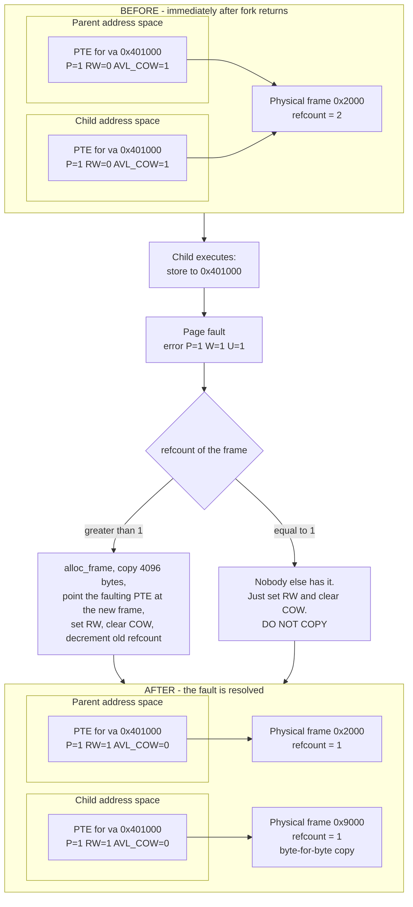

**Walking it.**

**Before.** `fork` did not copy any data page. It walked the parent's lower-half
page tables and, for every writable page, did three things: cleared the R/W bit
in the *parent's* PTE, set a software bit (one of bits 11:9) marking it
copy-on-write, and incremented the frame's reference count. Then it built the
child's tables pointing at the *same* frames with the same flags. Two page
tables, one set of frames, refcount 2.

**The trigger.** The child stores to a shared page. The PTE says present but
not writable, so the CPU raises a page fault with `P=1, W=1, U=1` — the
protection-violation-on-write signature.

**The handler's decision.** It confirms the region is *supposed* to be writable
(otherwise this is a genuine segfault) and that the COW bit is set. Then it
branches on the reference count.

- **refcount > 1.** Allocate a fresh frame, copy 4096 bytes into it, repoint the
  faulting process's PTE at the new frame with R/W set and the COW bit cleared,
  and decrement the old frame's count.
- **refcount == 1.** Nobody else references this frame any more — the other
  sharer already copied away, or exited. **Do not copy.** Just set R/W and clear
  the COW bit. Copying here is not merely wasteful; if two processes both take
  the copy path when only one reference remains, you get an extra frame per page
  and the memory saving evaporates.

**After.** Parent and child hold different frames, both writable, both with
refcount 1. The parent's PTE was fixed up when its own next write faulted, by
exactly the refcount==1 path.

> [!warning] The four copy-on-write bugs, each of which costs a day
> **1. Forgetting to mark the *parent* read-only.** Only marking the child's
> pages means the parent's writes go straight into the shared frame and the child
> sees them. The child observes its parent's variables changing under it.
>
> **2. Non-atomic reference counts.** On SMP, two cores resolving a COW fault on
> the same frame concurrently can both read count 2, both copy, and both
> decrement to 1 — leaking a frame — or worse, interleave to reach 0 and free a
> frame still in use. The count must be atomic from the moment a second CPU
> exists ([[Phase 12 - Overview\|Phase 12]]).
>
> **3. The kernel writing to a user COW page.** `copy_to_user` writing into a
> COW page must trigger the copy too. If the kernel writes through the HHDM
> alias instead of through the process's own mapping, **the write bypasses the
> page tables entirely** — no fault, no copy, and the parent silently observes
> data written into the child. This is the subtlest bug in the phase and the
> reason `copy_to_user` must go through the user mapping.
>
> **4. Forgetting to decrement on `exit` and `unmap`.** Counts that only go up
> mean frames are never freed. The symptom is a system that runs out of memory
> after a few thousand `fork`s and looks like a leak in whatever allocated last.
>
> Full treatment in [[Stage 13.3 - Copy-on-Write]].

### 5.4 Changing a mapping under SMP

Everything above assumed one CPU. The moment a second exists, the TLB stops being
a local concern.

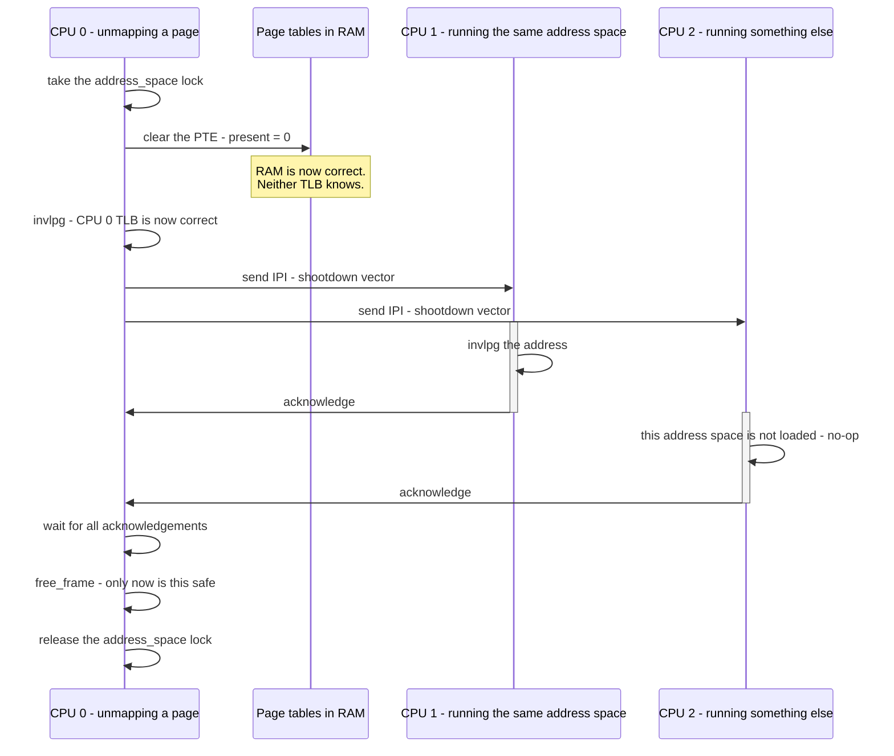

**Reading it.** CPU 0 clears the entry. RAM is now correct and *both other TLBs
are wrong*. CPU 0 fixes its own with `invlpg`, then sends an inter-processor
interrupt to every other core, each of which invalidates and acknowledges.

**The ordering is the whole point.** `free_frame` must come *after* every
acknowledgement. Free it first, and there is a window in which the frame is on
the free list, available to `alloc_frame`, while CPU 1 still has a cached
translation pointing at it. Reallocate it in that window and two unrelated
subsystems are writing to the same physical memory through different virtual
addresses. This is a use-after-free that no amount of code review of the freeing
subsystem will find, because the bug is in the *synchronisation*, not the logic.

CPU 2 does not have this address space loaded and its invalidation is a no-op —
but it must still acknowledge, because CPU 0 cannot know that without asking.
Tracking which CPUs have which address space loaded, to skip the IPI entirely, is
a real optimisation and a real source of bugs; it belongs to
[[Phase 12 - Overview|Phase 12]] with a test that deliberately races.

---

## 6. Why it is shaped this way

### Decision: how does the kernel reach arbitrary physical memory?

| Option | How it works | Cost | Verdict |
|---|---|---|---|
| **A. HHDM — direct map all RAM (chosen)** | Every physical address is readable at `hhdm_offset + phys` | 8 MiB of page tables to map 4 GiB with 4 KiB pages; ~20 KiB with 2 MiB pages | ✅ |
| B. Recursive page-table mapping | Point one PML4 entry at the PML4 itself; tables become addressable at computable virtual addresses | Only reaches *page tables*, not arbitrary frames; the address arithmetic is famously unreadable; consumes a PML4 slot | ❌ |
| C. Temporary mapping window | A fixed virtual page; map, use, unmap | A TLB invalidation on every access to a frame; needs its own lock; makes `alloc_frame`-then-zero a critical section | ❌ |

**Why A.** Zeroing a fresh page table is the operation the whole VMM is built
out of, and under the HHDM it is `memset(hhdm + phys, 0, 4096)`. Under C it is
map, invalidate, memset, unmap, invalidate — with a lock around it, on a path
called several times per `map_page`. Under B it does not work at all for a frame
that is not a page table.

The HHDM also makes the PMM's job trivially inspectable: a debugging dump of any
physical address is a pointer arithmetic away, which matters enormously when the
only debugger you have is `kprintf`.

**The cost, honestly.** Mapping 4 GiB with 4 KiB pages needs 2048 page tables —
8 MiB of RAM for page tables alone, spent before you have allocated anything.
Mapping the same range with 2 MiB pages needs four page directories, about
20 KiB. This is the strongest argument in the whole subsystem for large pages, and
it is why the HHDM is the first place to use them.

**Why not B.** The recursive trick is clever and self-contained, and it is what
many tutorials teach. It only ever gives access to paging structures, which
means you *still* need another mechanism for anything else, and the virtual
addresses it produces require a mental model that nobody retains. It also burns
one of 512 PML4 entries — 512 GiB of address space — for a facility the HHDM
provides better.

**When C would be right.** A 32-bit kernel, where 4 GiB of physical RAM cannot
fit in a 4 GiB virtual address space alongside everything else. This is exactly
what Linux's `HIGHMEM` and `kmap()` were, and exactly why they were deleted when
32-bit stopped mattering. On 64-bit, address space is free.

### Decision: 4 KiB pages only, or mix in 2 MiB?

| Option | How it works | Cost | Verdict |
|---|---|---|---|
| **A. 4 KiB everywhere in v1 (chosen)** | One page size, one code path | 8 MiB of tables for the HHDM; more TLB pressure | ✅ for now |
| B. 2 MiB pages for the HHDM and kernel text | Set PS in the PDE | Every routine must handle "the walk stopped early"; splitting a large page on a permission change is real work | ➖ Phase 15 |
| C. 1 GiB pages | Set PS in the PDPTE | Not universally supported; check CPUID | ➖ |

**Why A.** A single page size means `map_page`, `unmap_page`, the fault handler,
the COW path and the address-space teardown all have exactly one case. Adding
large pages means every one of them must answer "what if the walk terminated at
level 3", and a permission change on one 4 KiB page inside a 2 MiB mapping
requires *splitting* it into 512 small entries — allocating a table, populating
it, and swapping it in atomically with respect to other cores. That is a real
feature with a real test burden, and it buys nothing until either the HHDM's
8 MiB or iTLB misses show up as a problem you have measured.

**When B becomes right.** The moment the HHDM's page-table cost is a visible
fraction of RAM — which on a machine with 32 GiB is 64 MiB and no longer
ignorable — or the moment a profile shows iTLB misses in kernel text. Linux maps
both with large pages for exactly these reasons.

### Decision: does the kernel heap map eagerly or on demand?

| Option | How it works | Cost | Verdict |
|---|---|---|---|
| **A. Eager — `map_page` before returning (chosen)** | Every heap page is backed at allocation time | `kmalloc` can take a frame allocation on its slow path | ✅ |
| B. Lazy — reserve address space, fault it in | The heap region is declared; pages materialise on first touch | A kernel page fault can now happen *anywhere*, including in an interrupt handler where it cannot be resolved | ❌ |

**Why A.** Lazy kernel memory means the fault handler must be able to run, and
succeed, in every context the kernel can fault in — including inside an interrupt
handler holding a spinlock, where it may not sleep and may not wait for the PMM
lock. That is a deadlock waiting for load, and the concurrency rules in
[[06 - Architecture Overview]] exist precisely to prevent this class of thing.
Eager mapping moves the whole problem to allocation time, where the caller is in
process context and blocking is allowed. It costs a slower `kmalloc` on the cold
path and buys a fault handler that never has to succeed in interrupt context.

Note that this is the *opposite* choice from user memory, where laziness is the
entire point. The difference is that a user fault always happens in process
context, on a thread that can block.

### Decision: bitmap versus a per-frame descriptor array

| Option | How it works | Cost for 4 GiB | Verdict |
|---|---|---|---|
| **A. Bitmap plus a separate refcount array (chosen)** | Free/used in one bit; the refcount array appears only when COW does | 128 KiB now, +4 MiB at [[Phase 13 - Overview\|Phase 13]] | ✅ |
| B. A `struct page` per frame from the start | One descriptor per frame carrying flags, refcount, owner, list links | 32–64 MiB, ~1% of RAM, most fields unused for ten phases | ❌ for v1 |

**Why A.** Linux's `struct page` is the right long-term answer — it is where the
page cache, reverse mappings, and NUMA information all live. It is also 1% of RAM
spent on fields that stay zero until [[Phase 10 - Overview|Phase 10]] wants a
page cache. Starting with a bitmap and adding a parallel refcount array when COW
needs one keeps the cost proportional to the features that exist, and both are
indexed by frame number, so growing into a descriptor array later is a
mechanical change behind the same three functions.

### Decision: copy-on-write, or a copying `fork`?

Covered in [[Phase 13 - Overview]] and settled there, but the reasoning belongs
here because it is a memory-management argument. A copying `fork` duplicates the
entire address space and the standard Unix idiom immediately `exec`s, discarding
all of it. For a shell running a three-stage pipeline, that is three full address
space copies per command line. **COW is not an optimisation in this system; it is
what makes the process model usable.** [[Stage 13.2 - fork]] builds the copying
version first because it is the correct thing to debug against, and
[[Stage 13.3 - Copy-on-Write]] replaces it.

---

## 7. How this grows across the phases

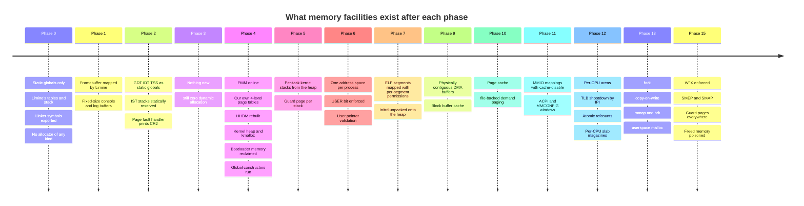

**What is deliberately missing early, and why that is acceptable.**

**Phases 0 through 3 have no allocator at all.** Every buffer is a fixed global,
sized at compile time. This is not a limitation being tolerated — it is what
makes those phases debuggable. A kernel with no dynamic memory cannot have a
use-after-free, a double free, a leak, or heap corruption, so when something goes
wrong in Phase 2 the cause is in Phase 2. Introducing the heap at Phase 4, after
the console, the log, and the exception handlers all work, means that when the
heap misbehaves you have three working tools to watch it with.

**Phase 4 does not have demand paging.** Every mapping is created eagerly and
every heap page is backed immediately. The page-fault handler exists, but its only
job is to print a diagnosis and panic. This is correct sequencing: the fault
handler's *resolution* paths all depend on the `vm_region` list, which only means
something once there are processes, and processes arrive in
[[Phase 6 - Overview|Phase 6]].

**Phase 4 has no reference counting.** A frame has one owner. That holds until
`fork` shares frames in [[Phase 13 - Overview|Phase 13]], and the refcount array
appears then. Adding it in Phase 4 would be 4 MiB of zeros and nine phases of
code maintaining an invariant nothing checks.

**Everything before Phase 12 assumes one CPU.** The `address_space` lock is taken
from Phase 4 anyway, because retrofitting locks into a subsystem is the hardest
kind of retrofit and taking an uncontended spinlock costs almost nothing. The
*shootdown* logic genuinely cannot be written before there is a second CPU to
shoot at.

**W^X arrives in Phase 15, but Phase 0 made it possible.** The page-aligned,
separately-permissioned sections from
[[Stage 0.4 - The Linker Script and Higher-Half Layout]] and the per-section
mapping in [[Stage 4.3 - Enabling Paging]] mean that turning on W^X is setting
NX bits, not relaying out the kernel. This is the general pattern in this project:
**do the layout work early, where it is a line of code, so that the security work
later is a configuration change.**

---

## 8. Failure modes

Symptom first, because at 2am the symptom is all you have.

| Symptom | Cause | Where to look |
|---|---|---|
| **QEMU resets instantly**, no output, right where you load `CR3` | Your new tables do not map the code doing the load, or the stack | Map the kernel image and the current stack in the new tables *before* loading `CR3`. Run QEMU with `-d int,cpu_reset` to see the triple fault |
| **Serial keeps talking, screen freezes** immediately after enabling your tables | The framebuffer's physical range is not mapped in your tables | Map the framebuffer explicitly. Limine mapped it; you did not inherit that |
| **Loading `CR3` triple-faults** and the value looks like a kernel address | You loaded a *virtual* address into `CR3` | `CR3` takes the PML4's **physical** address. Subtract `hhdm_offset`, or keep `pml4_phys` as physical from the start |
| **Every mapping faults with the RSVD error bit set** | NX (bit 63) set without `EFER.NXE = 1` | Set `EFER.NXE` before writing any entry with NX. Also check for physical addresses with bits above 51 |
| **A fault minutes after boot, in unrelated code, with a nonsense backtrace** | You reclaimed bootloader memory that still held live data — Limine's page tables, the boot stack, or an uncopied response | §3.1. Reclaim type 5 only after your own `CR3`, your own stack, and a fully copied `boot_info_t` |
| **Random corruption that moves when you change unrelated code** | The PMM is handing out frames it should have reserved: the kernel image, the bitmap, or the framebuffer | Assert that `alloc_frame` never returns anything inside `[kernel_phys_base, kernel_phys_base + image_size)`. Make it a Tier-2 test |
| **`kmalloc` returns a pointer and the first write faults** | The heap's virtual range was reserved but never backed | The heap maps eagerly. The `map_page` call is missing on the growth path |
| **A page fault at an address your table walk says is mapped** | Stale TLB entry — a missing `invlpg` | §3.3. Every change to an existing entry needs invalidation. If it only happens under SMP, it is a missing shootdown |
| **`#GP` (vector 13) instead of a page fault**, and `CR2` is stale | The address is non-canonical | A garbage pointer, usually from uninitialised memory. `CR2` is *not* updated by `#GP`; do not trust it |
| **Kernel stack overflow corrupts unrelated memory** instead of faulting | The guard page is mapped | Phase 0 *reserves* the guard page; [[Stage 4.3 - Enabling Paging]] must leave its present bit clear. Until then it is dead space, not protection |
| **A fault inside the page-fault handler resets the machine** | Recursive fault escalated to `#DF` and then to a triple fault | `#DF` must use an IST stack. Keep the handler's own dependencies minimal and mapped |
| **`alloc_frame` returns zero far too early** | Regions marked used that should be free, or a leak | Print `free_frames` at boot and compare against the sum of type-0 lengths. Assert a balanced alloc/free cycle in a Tier-2 test |
| **The heap grows without bound under an alloc/free loop** | No coalescing in the free-list heap, or slabs never returning to the empty list | For a slab allocator, check that `free` moves a slab from `full` to `partial`, and from `partial` to `empty` at zero in-use |
| **A child process sees its parent's later writes** | `fork` marked only the child's PTEs read-only | Both sides. §5.3, bug 1 |
| **Memory usage climbs with every `fork`, never returns** | Refcounts incremented but not decremented on `exit` or `unmap` | §5.3, bug 4 |
| **A write through `copy_to_user` lands in the parent's memory** | The kernel wrote through the HHDM alias, bypassing the COW fault | §5.3, bug 3. `copy_to_user` must go through the process's own mapping |

> [!tip] Instrument this subsystem before you debug it
> Three things are worth building before you need them, all cheap:
>
> 1. **A page-table dumper.** Given a virtual address, print all four entries with
>    their flags decoded. Nearly every bug in §3.3 becomes obvious the moment you
>    can see which level is wrong.
> 2. **A memory-map dump at boot.** Print every region with its type name and a
>    running total. Compare against what you told QEMU.
> 3. **A `free_frames` counter you can assert on.** Tier-2 in-kernel tests under
>    QEMU ([[ADR-0010 - Testing Strategy and the QEMU Exit Device]]) can then
>    check that an alloc/free cycle is balanced, that the kernel range is never
>    returned, and that a COW write produces exactly one copy — the three
>    invariants this whole subsystem rests on.

---

## 9. Masterclass notes

> [!question] Discussion prompts
> 1. The HHDM lets the kernel reach any physical address by adding a constant.
>    That means a wild kernel pointer can name *any byte of RAM*, including
>    another process's private data. Is the HHDM therefore a security weakness?
>    What would it cost to remove it, and what does Linux's `CONFIG_KMAP_LOCAL`
>    era tell us about the tradeoff?
> 2. Permissions AND down the four-level chain; NX ORs down it. Why are the two
>    polarities different, and what would break if NX also ANDed?
> 3. Demand paging requires the fault handler to distinguish "not mapped yet but
>    should be" from "not mapped and never will be". The page tables cannot answer
>    that. What *is* the minimum extra state required, and why can it not be
>    encoded in the available bits of a PTE?
> 4. Copy-on-write with a reference count of exactly 1 must **not** copy. Construct
>    a sequence of `fork` and `exit` calls that reaches that state, and work out
>    how much memory is wasted if the handler copies anyway.
> 5. We eagerly map kernel heap pages and lazily map user pages. Both are
>    defensible. State the property of *context* that makes the asymmetry correct,
>    and describe the deadlock that appears if you make kernel memory lazy.
> 6. The frame allocator's bitmap costs 0.003% of RAM. The COW refcount array
>    costs 0.1%. A Linux-style `struct page` costs about 1%. What does each
>    additional order of magnitude buy, and at what phase does each become worth
>    paying?

**You understand this when you can:**

- [ ] Draw the 9/9/9/9/12 address split from memory, and derive why each field is
      that width without looking anything up
- [ ] Take an arbitrary 64-bit virtual address and produce its four table indices
      and offset on paper
- [ ] Name every bit of a PTE, say who writes it — us or the CPU — and give the
      failure mode of getting it wrong
- [ ] Explain why `CR3` holds a physical address, and why that is not a design
      choice
- [ ] State the three things living in bootloader-reclaimable memory and the
      order in which each must be replaced
- [ ] Explain why the frame allocator is a bitmap and not a free list, using
      DMA and failure containment rather than speed
- [ ] Explain why a slab allocator sits on top of the heap, in terms of where the
      fragmentation goes rather than in terms of it being faster
- [ ] Trace a page fault from `CR2` to every one of its outcomes, including the
      two that panic and the five that kill the process
- [ ] Draw copy-on-write before and after, including the reference count, and say
      what happens when it is 1
- [ ] Explain why `free_frame` comes after the TLB shootdown acknowledgements and
      not before

**Board plan** — the order to draw this, live, in eight steps:

1. **Two questions, two boxes.** "Which bytes exist" and "what does this address
   mean". Draw them as separate boxes. Everything hangs off this split.
2. **The physical side.** RAM as a strip of 4 KiB frames. Draw the bitmap
   underneath it, one bit per frame. Mark the kernel image and the framebuffer as
   reserved. Do not mention virtual addresses yet.
3. **One address, five fields.** Write `0xFFFF800012345678` on the board and cut
   it into 16 / 9 / 9 / 9 / 9 / 12. Derive the widths from "a table is one page,
   an entry is 8 bytes".
4. **The four-level walk.** Draw `CR3` → PML4 → PDPT → PD → PT → frame as five
   boxes with the index arriving at each. Emphasise: four dependent reads.
5. **Add the TLB.** Draw it as a cache in front of the walker. Now ask: what
   happens when we edit a table? Introduce `invlpg`. This is the natural moment
   because the audience has just watched the walker read RAM.
6. **The heap, three boxes deep.** `kmalloc` → cache → slab → object. Show the
   free list living *inside* the free objects. Show `kfree` masking a pointer to
   find its slab.
7. **The fault handler as a decision tree.** Start with `CR2` and the error code.
   Add outcomes one at a time, easiest first: segfault, then demand fill, then
   stack growth, then COW, then the two panics. Ask after each: what state did we
   need to decide that?
8. **COW, before and after.** Two address spaces, one frame, refcount 2. Then the
   write, then the split. End with the refcount-1 special case as the question
   that checks whether the room was following.

**Time budget:** 75 minutes. Steps 3 through 5 are the core and deserve 35 of
them; if you are short, compress step 6 and keep step 7 whole — the fault handler
is where the subsystem stops being bookkeeping and starts being an operating
system.

---

## 10. Related

**Stages that build this:**
[[Stage 4.1 - Reading the Memory Map]] ·
[[Stage 4.2 - The Physical Frame Allocator]] ·
[[Stage 4.3 - Enabling Paging]] ·
[[Stage 4.4 - The Kernel Heap]] ·
[[Stage 13.3 - Copy-on-Write]]

**Stages that depend on this:**
[[Stage 5.1 - Tasks, Context, and the Stack]] ·
[[Stage 6.2 - Entering Ring 3]] ·
[[Stage 7.4 - Loading and Running an ELF Program]] ·
[[Stage 13.2 - fork]] ·
[[Stage 13.10 - Userspace malloc]]

**Stages this depends on:**
[[Stage 0.4 - The Linker Script and Higher-Half Layout]] ·
[[Stage 0.7 - Panic and KASSERT]] ·
[[Stage 2.2 - The TSS and Interrupt Stacks]] ·
[[Stage 2.5 - CPU Exception Handlers]]

**Phases:**
[[Phase 4 - Overview]] ·
[[Phase 11 - Overview]] ·
[[Phase 12 - Overview]] ·
[[Phase 13 - Overview]] ·
[[Phase 15 - Overview]]

**Decisions:**
[[ADR-0002 - Target x86_64 Not i686]] ·
[[ADR-0003 - Limine as the Bootloader]] ·
[[ADR-0007 - Freestanding C++20 as the Kernel Language]] ·
[[ADR-0010 - Testing Strategy and the QEMU Exit Device]]

**Vault:**
[[06 - Architecture Overview]] ·
[[04 - Glossary]] ·
[[07 - Repository Layout]] ·
[[09 - Testing Strategy]] ·
[[14 - Debugging Playbook]] ·
[[05 - Gap Analysis (v1 to Product)]]
