# 08 — Interrupts and Exceptions

> [!abstract] What this document covers
> The three tables the CPU reads to decide what to do when something interrupts it —
> the **GDT**, the **TSS** and the **IDT** — and the complete path a signal takes from
> a device pin or a faulting instruction to a C++ function with a register dump in its
> hands. This is the subsystem that turns "the machine rebooted" into "page fault,
> write to `0xDEADBEEF`, from `heap_expand+0x8C`", and it is the reason every later
> phase is debuggable at all.

**Zoom level:** Subsystem, deep — down to individual bits where the hardware defines a layout
**Built by:** [[Stage 2.1 - The Global Descriptor Table]], [[Stage 2.2 - The TSS and Interrupt Stacks]], [[Stage 2.3 - The Interrupt Descriptor Table]], [[Stage 2.4 - Interrupt Stubs and the Saved Frame]], [[Stage 2.5 - CPU Exception Handlers]], [[Stage 2.6 - The 8259 PIC - Remap and Mask]], [[Stage 2.7 - Hardware Interrupts]]
**Prerequisites:** [[06 - Architecture Overview]], [[04 - Glossary]]
**Masterclass session:** 3 (see [[19 - The Eight-Hour Masterclass]])

---

## 1. The one-sentence version

**An interrupt is the hardware's `goto`: the CPU stops mid-instruction-stream, looks up
a number in a table you built, and jumps there — and this document is about building
that table correctly enough that the jump lands somewhere useful even when everything
else in the machine is already broken.**

A processor executing your kernel is a machine that fetches an instruction, executes
it, and moves to the next one. Three things can break that loop. A **device** can raise
a signal on a wire because a key was pressed or a disk finished. **The instruction
itself** can be impossible to execute — a divide by zero, a write to memory that is not
mapped, an opcode the CPU does not recognise. Or the software can **ask** to be
interrupted, with the `int` instruction. In all three cases the CPU does the same
thing: it stops, works out a number between 0 and 255 called a **vector**, uses that
number as an index into a table in memory called the **Interrupt Descriptor Table**,
and transfers control to the address it finds there.

Everything hard about this subsystem follows from one detail: **the CPU tells you
almost nothing about why it jumped.** It does not pass the vector number. It does not
consistently push an error code. It does not save your general-purpose registers. It
does not switch to a safe stack unless you told it in advance, in a table, which stack
to switch to. Every design decision below is a response to one of those four gaps.

> [!note] Vocabulary, defined once
> - **Vector** — a number 0–255 naming one interrupt source. Vectors 0–31 are reserved by
>   Intel/AMD for CPU-detected errors; 32–255 are yours.
> - **Exception** — an interrupt the CPU raises itself because an instruction went wrong.
> - **IRQ (interrupt request)** — a hardware line from a device. IRQ 0 is the timer, IRQ 1
>   the keyboard. IRQs are *mapped onto* vectors by an interrupt controller.
> - **Descriptor** — an 8- or 16-byte record in a CPU table describing a memory segment,
>   a task-state segment, or a gate.
> - **Gate** — a descriptor that describes *a place to jump to*, rather than a region of
>   memory. IDT entries are gates.
> - **Selector** — a 16-bit number that indexes a descriptor table. `0x08` means "byte
>   offset 8 into the GDT", i.e. entry 1.
> - **Ring / CPL** — hardware privilege level. Ring 0 is the kernel, ring 3 is user code.
>   CPL is the *current* privilege level; DPL is the level stamped on a descriptor.
> - **`iretq`** — the 64-bit "interrupt return" instruction. It pops the frame the CPU
>   pushed and resumes the interrupted code.
> - **`.bss`** — the region of the kernel image that is zero-filled at load time. It costs
>   nothing on disk and everything in RAM.

---

## 2. The picture

One diagram, walked box by box. Everything else in this document is a zoom into one of
these boxes.

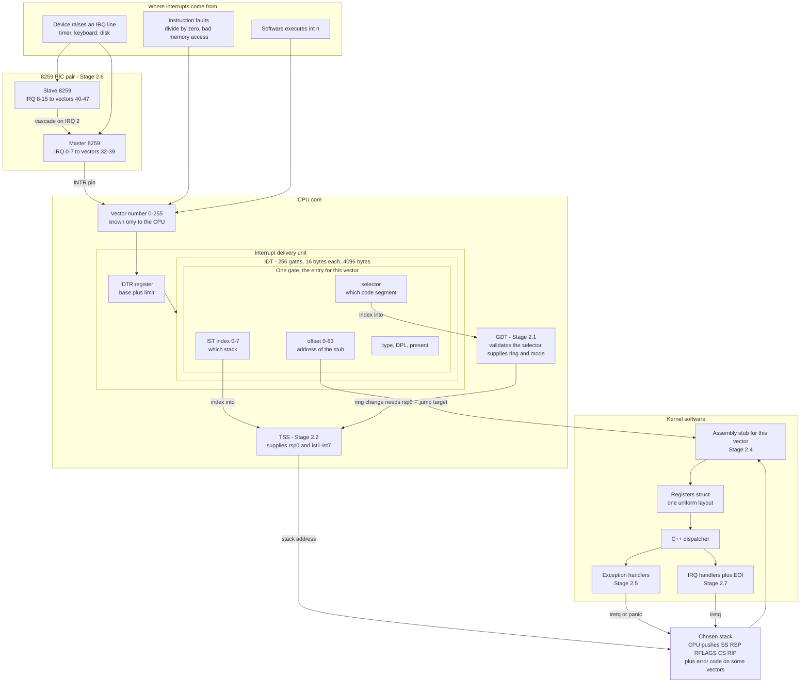

### Walking every box

**`SOURCES` — the three origins.** A **device** asserts a physical wire. A faulting
**instruction** makes the CPU raise an exception on its own. **Software** executes `int
n` deliberately. These three converge immediately: by the time the CPU is choosing what
to do, all it has is a vector number. The origin is forgotten. This is why the vector
number itself has to carry all the identity — a theme that dominates §3.4.

**`PIC_BOX` — the interrupt controller.** Devices have far more interrupt lines than the
CPU has interrupt pins. The CPU has essentially one: `INTR`. The 8259 PIC is the
multiplexer. Sixteen device lines go in; one signal plus one vector number comes out.
There are two 8259s because one chip only has eight inputs; the second is chained into
the first. Built in [[Stage 2.6 - The 8259 PIC - Remap and Mask]], opened up in §3.6.

**`VEC` — the vector number.** The single narrowest point in the whole subsystem. Eight
bits. Everything the CPU knows about why it stopped is compressed into this number plus,
sometimes, an error code. Note carefully: **the CPU does not hand this number to your
handler.** It uses it to pick a table entry and then discards it. Recovering it is
§3.4's entire problem.

**`DELIVERY` — the CPU's interrupt delivery unit.** This is microcode, not software. It
reads `IDTR` (a CPU register holding the IDT's base address and size), multiplies the
vector by 16, and reads the gate at that offset.

**`GATE` — the 16 bytes that decide everything.** Four fields matter, and each one hands
off to a different part of the system:

- `G_OFF`, the 64-bit address of the code to run. This is why the entry point *is* the
  identity: it is the only per-vector information that reaches software.
- `G_SEL`, a code-segment selector. The CPU loads this into `CS`, which sets the
  privilege level the handler runs at. It is validated against the GDT.
- `G_IST`, a three-bit index. Zero means "keep using whatever stack we are on". One to
  seven means "load `rsp` from this slot of the TSS, unconditionally". This is the field
  that decides whether a stack overflow produces a panic or a silent reboot.
- `G_ATTR`, the type/DPL/present byte. Type decides whether interrupts stay enabled
  inside the handler. DPL decides whether ring-3 code may reach this gate with `int n`.

**`GDT_T` — the Global Descriptor Table.** In long mode it no longer describes memory
regions in any meaningful way (see §3.1), but it still holds the privilege and mode bits
for `CS`, and it holds the descriptor that tells the CPU where the TSS is. Built in
[[Stage 2.1 - The Global Descriptor Table]].

**`TSS_T` — the Task State Segment.** A 104-byte structure the CPU **reads and never
writes**. It answers exactly two questions on this path: "I am switching from ring 3 to
ring 0, which stack?" (`rsp0`) and "this gate named IST slot *n*, which stack?"
(`ist1`–`ist7`). Built in [[Stage 2.2 - The TSS and Interrupt Stacks]].

**`STACK` — the chosen stack.** Once a stack is picked, the CPU pushes five 64-bit values
onto it — `SS`, `RSP`, `RFLAGS`, `CS`, `RIP` — and, for ten of the 256 vectors, an error
code. In 64-bit mode it pushes all five **always**, even when there was no privilege
change. That uniformity is a genuine improvement over 32-bit mode and it is what makes a
single `Registers` layout possible.

**`STUB` — the assembly entry point.** The gate's offset points here, never directly at a
C++ function, because the CPU's entry convention and the C++ calling convention have
nothing in common. The stub's job is to normalise: push a dummy error code where the CPU
did not push one, push the vector number, push every general-purpose register, and hand
a single pointer to C++.

**`REGS` — the uniform saved frame.** The contract between assembly and C++, and the
subject of §3.5. It outlives this phase: [[Phase 5 - Overview|Phase 5]]'s scheduler saves
and restores through this exact structure, and [[Phase 6 - Overview|Phase 6]] builds one
by hand to launch a user process.

**`DISPATCH`, `EXC`, `IRQH` — the C++ side.** One function receives every interrupt, looks
at `regs->vector`, and routes: vectors 0–31 to exception handling, 32–47 to the IRQ layer,
which calls a registered driver callback and then sends the End Of Interrupt to the PIC.

**The return arrows.** Exception and IRQ handlers return by unwinding the stub's pushes
and executing `iretq`, which pops the CPU's five qwords and resumes the interrupted
instruction stream. Whether resuming is *meaningful* depends on the exception's class,
which is §5.3.

> [!warning] The state before this subsystem exists
> Limine hands the kernel a machine in long mode with **no IDT at all** — `IDTR` has a
> limit of zero. Any exception whatsoever therefore fails to find a handler, which is
> itself an exception, which also fails, and the machine triple-faults and resets. Every
> bug you write between first boot and the end of [[Stage 2.5 - CPU Exception Handlers]]
> manifests identically: a silent reboot loop with no output. That is the state this
> phase exists to escape.

---

## 3. Zooming in

### 3.1 The GDT — a table that mostly does nothing, and is mandatory anyway

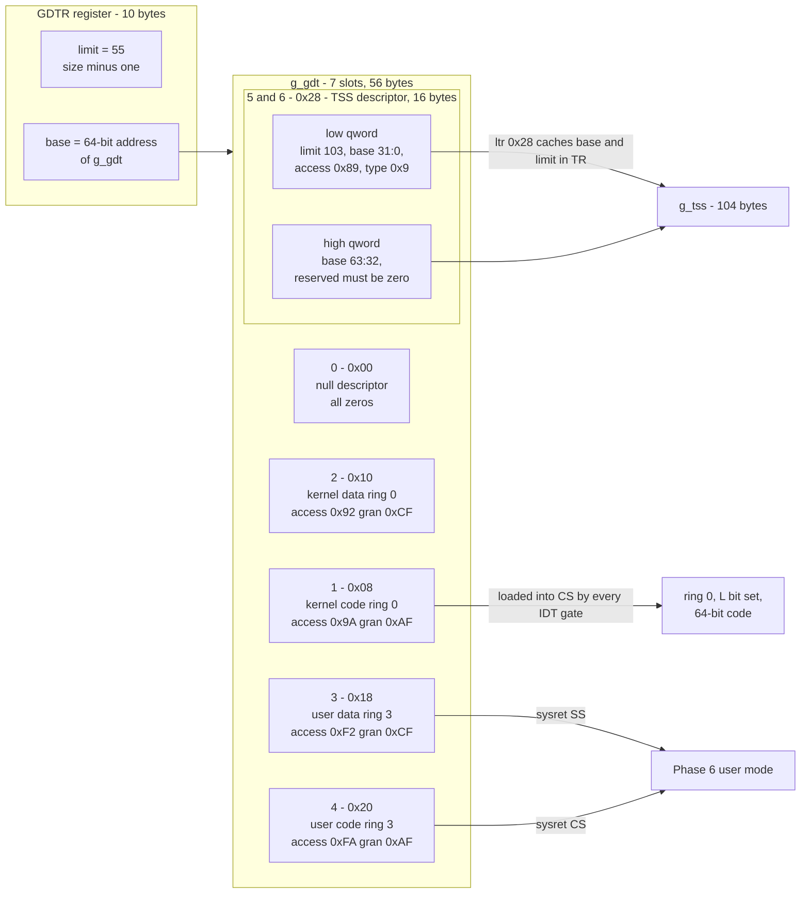

**Why there is a GDT at all when segmentation is dead.** On a 32-bit x86, a segment
descriptor carried a base address and a length limit, and every memory access was
checked against them. In long mode the CPU ignores both: the base is forced to zero for
`CS`, `DS`, `ES` and `SS`, and the limit is not checked. Memory protection is entirely
paging's job now. What survives in a descriptor is a handful of *bits*: is this present,
what ring does it run at, is it code or data, is it 64-bit code. Those bits are still
enforced, so the table is still mandatory.

**Walking the boxes.** `GDTR_BOX` is a CPU register loaded by the `lgdt` instruction from
a 10-byte operand in memory: a 2-byte limit and — critically — an **8-byte base**. In
protected mode that operand was six bytes with a 32-bit base, and copying a 32-bit
tutorial here truncates a kernel address like `0xFFFFFFFF80115000` to `0x80115000`, an
unmapped low address. The failure appears on the *next* segment load, far from the cause.
`static_assert(sizeof(GdtPointer) == 10)` is the real defence.

`E0`, the **null descriptor**, must be all zeros and must be first. Selector 0 is the
encoding of "no segment"; loading it into a data register is legal and marks the register
unusable, and the CPU itself pushes `SS = 0` on some interrupt paths. It is not padding.

`E1`, the **kernel code descriptor**, is the one every IDT gate names. Its access byte
`0x9A` sets present, DPL 0, code, readable; its granularity byte `0xAF` sets the **L
bit**, meaning 64-bit code. The L bit and the D/B bit are mutually exclusive — setting
both is a `#GP` on load.

`E2` is the kernel data descriptor. In long mode `DS`/`ES`/`SS` are barely consulted, but
`SS` must hold a valid descriptor or the null selector when `iretq` restores it.

`E3` and `E4`, **user data before user code**, in that order and no other. The order is
not aesthetic: `sysret` computes `SS` as `STAR[63:48] + 8` and `CS` as `STAR[63:48] + 16`,
so the data descriptor must sit exactly eight bytes below the code descriptor. Getting
this wrong is discovered in [[Phase 6 - Overview|Phase 6]], four phases later, as a `#GP`
on the first return to user mode.

`TSSD`, the **TSS descriptor**, is the third level of this diagram and the interesting
one. It is a *system* descriptor — `S = 0` — and system descriptors in long mode are
**16 bytes**, occupying two consecutive GDT slots, because they need a full 64-bit base
and an 8-byte descriptor has nowhere to put the top 32 bits. Code and data descriptors
stay 8 bytes. So `sizeof(g_gdt)` is `7 * 8 = 56` and the `lgdt` limit is 55.

> [!warning] The base is scattered across five fields
> A TSS at `0xFFFFFFFF80105000` has its base split as `base[15:0]` and `base[23:16]` and
> `base[31:24]` in the low qword, and `base[63:32]` in the high qword. The split order is
> a 1982 binary-compatibility artefact; there is no logic to derive. Forget the high
> qword and the CPU reads your TSS from `0x0000000080105000` — user address space, not
> mapped. `ltr` faults, and at that point in boot there is still no IDT, so the machine
> triple-faults instantly with no output. Encode from the table in
> [[Stage 2.2 - The TSS and Interrupt Stacks]], and unit-test the encoder against the
> golden bytes.

**Descriptor bit layouts.** The access byte, for reference:

| Bit | Name | Meaning | K code | K data | U data | U code |
|---|---|---|---|---|---|---|
| 7 | P | Present. `0` raises `#NP` on load | 1 | 1 | 1 | 1 |
| 6–5 | DPL | Descriptor privilege level | 00 | 00 | 11 | 11 |
| 4 | S | `1` = code/data, `0` = system | 1 | 1 | 1 | 1 |
| 3 | E | Executable | 1 | 0 | 0 | 1 |
| 2 | DC | Conforming (code) / expand-down (data) | 0 | 0 | 0 | 0 |
| 1 | RW | Readable (code) / writable (data) | 1 | 1 | 1 | 1 |
| 0 | A | Accessed — **the CPU sets this itself** | 0 | 0 | 0 | 0 |
| | | **byte** | `0x9A` | `0x92` | `0xF2` | `0xFA` |

The TSS descriptor's access byte is `0x89`: present, DPL 0, `S = 0` (system), type `0x9`
= "available 64-bit TSS". Type `0xB` is "busy"; `ltr` rewrites `0x9` to `0xB` in memory as
a side effect, so a second `ltr` on the same descriptor faults. Load it once.

> [!question] Check your understanding
> `DC = 1` on a code descriptor makes it *conforming* — code that executes at the
> caller's privilege level rather than the descriptor's. Why is a conforming ring-0 code
> segment a security hole, and what could ring-3 code do with one?

### 3.2 The TSS — 104 bytes that decide whether a crash is readable

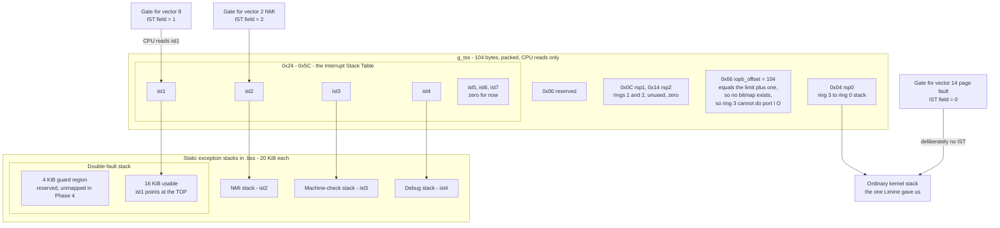

**Walking it.** The TSS in long mode is *not* the 32-bit hardware task-switching
structure. AMD deleted hardware task switching from x86-64 entirely: task gates do not
exist in the 64-bit IDT, and the CPU will never save a register set into a TSS. What
remains is a small read-only lookup table with three useful fields.

`RSP0` answers "the CPU is entering ring 0 from ring 3 — which stack?" It cannot push the
interrupt frame on the user stack: the user chose that pointer, so it may be unmapped,
read-only, or aimed at kernel memory the process wants you to overwrite; and even if it
is valid, the kernel would be writing its saved `RIP` and `CS` somewhere the process can
read and modify while the handler runs. So on any privilege-raising interrupt the CPU
loads `rsp` from `rsp0`, loads `SS` with the null selector, and *then* pushes.

`RSP12` — rings 1 and 2 have not been used by a mainstream OS since OS/2. Zero them.

`ISTS` is the part that matters most, and it exists because `rsp0` has a hole: **`rsp0` is
only consulted on a privilege change.** If the kernel is already in ring 0 and its own
stack is broken, the CPU keeps using the broken stack. The IST closes that hole. When a
gate names IST slot *n*, the CPU loads `rsp` from `TSS.ist<n>` **unconditionally** —
regardless of current privilege, regardless of whether the current `rsp` was valid, and
without ever touching the old stack.

`IOPB` is a security field with counter-intuitive semantics. It is the byte offset at
which an I/O permission bitmap would begin. The rule is: *if that offset is greater than
or equal to the TSS segment limit, there is no bitmap, and every `in`/`out` from CPL >
IOPL faults with `#GP`.* Limit is 103, offset is 104, `104 >= 103`, so all 65 536 ports
are denied to ring 3. Denying by pointing past the end of the structure is exactly the
kind of encoding x86 is made of.

`STACKS` shows the third level: each IST stack is a `.bss` object with a **4 KiB guard
region below 16 KiB of usable stack**, `alignas(4096)` so the guard is exactly one page on
a page boundary. Sixteen KiB because one panic — interrupt frame, saved registers,
`panic()`'s format buffer, the `kprintf` call chain, the backtrace walk, the log-ring dump
— genuinely uses about 2 KiB, and a structure whose whole job is to work when everything
else is broken deserves a factor of eight, not a factor of two. It is also four clean
pages, and the same number Linux uses for a kernel stack.

> [!warning] The guard page is not a guard page yet
> Making a page genuinely unmapped means editing page tables, and this kernel does not
> own its page tables until [[Phase 4 - Overview|Phase 4]] — Limine built the current ones.
> So Stage 2.2 *reserves and aligns* the region and nothing more. Today an overflow
> scribbles it silently. In Phase 4 you walk the list of reserved regions and unmap them,
> and the protection turns on with no change to this file. Reserving now is what makes
> that a five-line change instead of a re-layout.

**Which vectors get an IST slot, and why not more.**

| Vector | Name | IST | Reason |
|---|---|---|---|
| 8 | `#DF` double fault | `ist1` | **Non-negotiable.** The only vector whose alternative is a triple fault |
| 2 | NMI | `ist2` | Arrives at any instruction boundary; `cli` does not stop it |
| 18 | `#MC` machine check | `ist3` | Asynchronous hardware error; fires effectively never in QEMU, matters on real hardware in [[Phase 15 - Overview\|Phase 15]] |
| 1 | `#DB` debug | `ist4` | So you can breakpoint code inside another exception handler |
| 14 | `#PF` page fault | **none** | Page faults nest legitimately, and IST stacks are not re-entrant |

> [!warning] IST stacks are not re-entrant, and this is a trap
> The hardware gives you a stack, not a stack *allocator*. If a vector using `ist1` fires
> while a handler is already running on `ist1`, the CPU loads the same top-of-stack
> address again and pushes the new frame directly over the running handler's live locals.
> This is why each slot gets its own stack rather than one shared 16 KiB region, and why
> `#PF` deliberately does **not** get a slot: from Phase 4 onward the page-fault handler
> is a real subsystem — demand paging, copy-on-write, lazy stack growth — that can itself
> take a page fault while touching a not-yet-mapped page-table page. Put `#PF` on an IST
> and the nested fault silently corrupts the outer handler's frame. You would have traded
> a rare loud failure for a rare silent one.

Also: **the IST index is 1-based.** Zero means "do not switch stacks". Writing `0` in a
gate while meaning "the first one" silently disables the whole feature, and you find out
during a stack overflow, which is the worst possible moment.

### 3.3 The IDT — 256 gates, sixteen bytes each, exactly one page

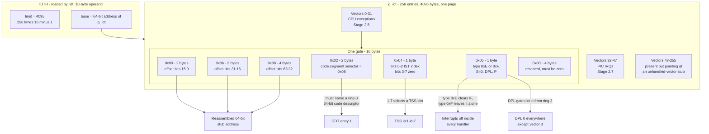

**Walking it.** `IDTR` is loaded by `lidt` from the same 10-byte shape as `lgdt`: 2-byte
limit, 8-byte base. Same 32-bit-tutorial trap, same fix.

The table is **256 × 16 = 4096 bytes — exactly one 4 KiB page**. That is a happy accident
worth remembering: the IDT is naturally page-aligned and page-sized, so in Phase 4 you can
map it read-only with no fuss.

`V0_31`, `V32_47`, `V48_255` are ranges, not separate structures. The important design
choice is that **all 256 gates are filled**, including the ones nothing uses. An absent
gate (P = 0) turns a stray interrupt into `#NP`, which is a second mystery on top of the
first. A present gate pointing at a stub that prints "unhandled vector 47" turns it into a
diagnosis. Fill the table.

`ONEGATE` is the data structure, the third level of the diagram. The 64-bit handler
address is split into **three** non-contiguous fields at offsets `0x00`, `0x06` and
`0x08` — another 286/386 compatibility scar, and another thing to unit-test rather than
eyeball.

The **selector** at `0x02` must be the kernel *code* selector `0x08`. Using the data
selector `0x10` is a popular error; the CPU cannot load a data descriptor into `CS` and
raises `#GP` during delivery, which — because it happens during delivery — escalates.

The **IST byte** at `0x04` is where §3.2's decision is expressed. Three bits, 1-based.

The **type/attribute byte** at `0x05` carries two independent policies:

| Bits | Field | Our value | Consequence |
|---|---|---|---|
| 0–3 | Gate type | `0xE` = interrupt gate | The CPU clears `IF` on entry, so handlers are not themselves interrupted |
| 4 | S | `0` | Gates are system descriptors |
| 5–6 | DPL | `0` for all, `3` optionally for vector 3 | Ring 3 executing `int n` on a DPL-0 gate gets `#GP` |
| 7 | P | `1` | Present |

Type `0xF` is a **trap gate**, identical except that it leaves `IF` untouched. This kernel
uses `0xE` everywhere, which matches the concurrency rules in [[06 - Architecture Overview]]:
handlers may not sleep, may not take a mutex, and may only take IRQ-save spinlocks. Running
with interrupts already off makes that the default rather than a discipline.

> [!warning] Gate DPL controls software, not hardware
> DPL decides whether ring-3 code may *deliberately* invoke a vector with the `int`
> instruction. It has no effect on hardware delivery — a page fault taken by a user
> process reaches your DPL-0 gate regardless. Leaving every gate at DPL 0 means a user
> program executing `int 0x0E` gets a `#GP` instead of being able to forge a page fault
> with an error code of its choosing and a `CR2` you did not set. There is also **no
> `int 0x80` gate** in this kernel: system calls use `syscall`/`sysret`
> ([[06 - Architecture Overview]]), so `int 0x80` from user code is a `#GP`, which is
> correct and intentional.

### 3.4 The stub problem — why the entry point *is* the identity

This is the single most important idea in Phase 2, and it follows from one sentence:
**the CPU does not tell the handler which vector fired.**

It knows the number. It used the number to index the IDT. Then it discarded it. Nothing in
the pushed frame, nothing in a register, nothing anywhere says "this was vector 14". The
only per-vector information that survives into software is **which address the CPU jumped
to**. Therefore the address must encode the vector: you need 256 distinct entry points,
each of which knows its own number as a constant.

That produces the fan-in shape:

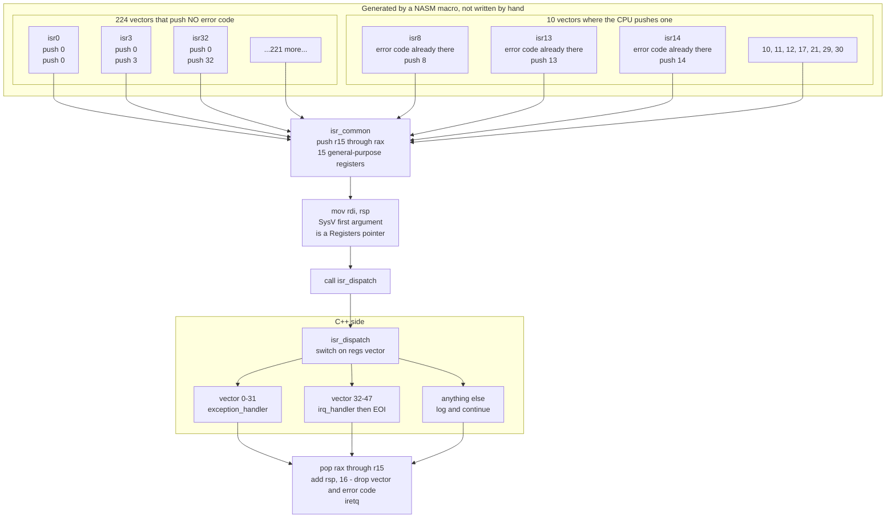

**Walking it.** `GEN` splits into two macro classes and the split is forced by hardware.
Ten vectors cause the CPU to push a 64-bit **error code** onto the stack after the five
standard qwords. The other 246 do not. If you wrote one stub shape for all of them, then
for half your vectors `RIP` would sit at `[rsp+8]` and for the other half at `[rsp+16]`,
and every field the C++ handler reads would be off by eight bytes for one group. You would
get a working divide-by-zero handler and a page-fault handler that prints garbage.

So the `NOERR` macro pushes a **dummy zero** first, making the stack layout from that point
identical for every vector. Then both macros push the vector number as a constant — the
only place the vector number ever enters software. Then both `jmp` to the shared tail.

> [!example] The vectors that push an error code
> `8` (`#DF`, always zero), `10` (`#TS`), `11` (`#NP`), `12` (`#SS`), `13` (`#GP`),
> `14` (`#PF`), `17` (`#AC`, always zero), and on CPUs that implement them `21` (`#CP`),
> `29` (`#VC`) and `30` (`#SX`). Everything else does not. Note that `#DF` and `#AC` push
> an error code that is *always zero* — the push happens for layout consistency, not
> information. Encode this set as a single constant in one place; deriving it twice
> guarantees the two copies disagree.

> [!note] The dummy push does a second job for free
> In 64-bit mode the CPU aligns `rsp` down to a 16-byte boundary before pushing. Five
> qwords is 40 bytes, which leaves `rsp` misaligned by 8. Add the error code and it is
> 48 bytes — aligned again. So on no-error vectors the dummy zero restores the alignment
> that the error-code vectors get from the hardware, and by the time the stub has pushed
> the vector number (8) and fifteen registers (120), the total is 176 bytes, a clean
> multiple of 16. The SysV AMD64 ABI requires that alignment at a `call`, and violating it
> makes any future SSE-using code fault in a way that has nothing to do with interrupts.

`COMMON` pushes the fifteen general-purpose registers the CPU did not save. Note *fifteen*,
not sixteen: `rsp` is already in the CPU's frame, so saving it again would be both
redundant and wrong. Note also that no segment registers are pushed — in long mode `DS`,
`ES`, `SS` carry no state worth preserving, and `FS`/`GS` bases are MSRs handled by
`swapgs` in [[Phase 6 - Overview|Phase 6]], not by pushing.

`ARG` is three characters of assembly carrying the whole assembly-to-C++ interface:
`mov rdi, rsp`. The stack pointer, right now, *is* a pointer to a fully populated
`Registers` structure. `rdi` is the first argument register in the SysV AMD64 ABI, so the
C++ function receives it as `Registers*` with no marshalling at all.

`CXX` dispatches on `regs->vector` — the number the stub reconstructed. `RET` unwinds
exactly what was pushed: pop the fifteen registers in reverse, `add rsp, 16` to discard the
vector and the error code (real or dummy — the same instruction covers both, which is the
payoff for normalising), and `iretq`.

> [!warning] `ret` is not `iretq`
> A normal `ret` pops one qword and jumps. The CPU's frame is five qwords plus flags and
> segment state. Returning with `ret` from an interrupt handler transfers control to
> whatever `CS` happened to be, leaves `IF` clear so no further interrupt ever arrives,
> and desynchronises the stack. The symptom is a machine that appears to hang after the
> first interrupt.

**Why generate the stubs.** 256 near-identical fragments written by hand contain exactly
one typo, in the vector you have not triggered yet, and it will be found in Phase 9 while
you are debugging a disk driver. A NASM macro is six lines and is correct by construction.

### 3.5 The saved frame — one contract, written twice, checked by nothing

The stub pushes. The C++ struct describes what was pushed. **Neither the assembler nor the
compiler can check that these agree.** They are two halves of one contract expressed in two
languages that do not talk to each other, and the only feedback for getting it wrong is
handler output that looks *almost* plausible.

The rule that connects them: **the stack grows downward, and struct fields ascend in
address. Therefore the struct field order is the reverse of the push order.** The last
thing pushed sits at the lowest address, and the lowest address is the first field.

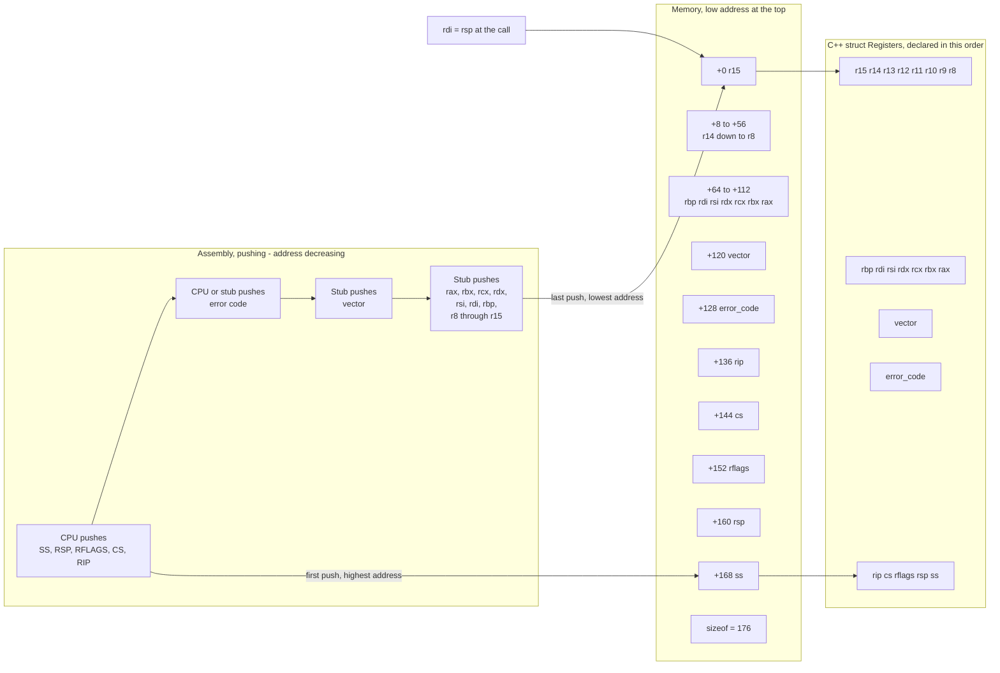

**Walking it.** The left column is chronological: the CPU pushes first, so its five qwords
end up at the *highest* addresses. The stub's registers, pushed last, end up lowest. The
middle column is the same bytes viewed as memory, low address at the top. The right column
is the C++ declaration, which must be read top-to-bottom as ascending offsets — hence the
apparent inversion.

```cpp
struct Registers {
    // pushed by isr_common, in reverse order of declaration
    uint64_t r15, r14, r13, r12, r11, r10, r9, r8;
    uint64_t rbp, rdi, rsi, rdx, rcx, rbx, rax;
    // pushed by the per-vector stub
    uint64_t vector;
    uint64_t error_code;     // real, or a dummy zero
    // pushed by the CPU
    uint64_t rip, cs, rflags, rsp, ss;
};
static_assert(sizeof(Registers) == 176);
static_assert(offsetof(Registers, vector)     == 120);
static_assert(offsetof(Registers, error_code) == 128);
static_assert(offsetof(Registers, rip)        == 136);
```

The `static_assert`s are not decoration — they are the only automated check that exists.
Pair them with a Tier-1 host unit test that builds a byte pattern, reinterprets it as a
`Registers`, and asserts each field reads the value the pattern put at that offset. See
[[09 - Testing Strategy]].

> [!warning] The symptom of a mismatched contract
> Not a crash. Values that are *shifted by one field*. Your page-fault handler prints a
> faulting address that is actually `RFLAGS`, or an error code that is actually the low
> half of `RIP`. Both look like numbers. If a fault report contains a value that is
> plausible but wrong for a different field, suspect the push order before you suspect the
> fault.

**Why this structure outlives Phase 2.** [[Phase 5 - Overview|Phase 5]]'s context switch
saves and restores a task through exactly this layout — a timer interrupt arrives, the
stub builds a `Registers`, the scheduler swaps `rsp` to another task's saved frame, and
`iretq` resumes a *different* task. [[Phase 6 - Overview|Phase 6]] constructs one by hand,
filling `cs` and `ss` with ring-3 selectors and `rip` with a user entry point, then
`iretq`s into user mode having never been there before. Design it once, here, with those
two uses in mind. Discovering a design flaw in it during Phase 5 means rewriting assembly
you have not looked at in a month.

### 3.6 The PIC — sixteen wires, one pin, and a vector collision

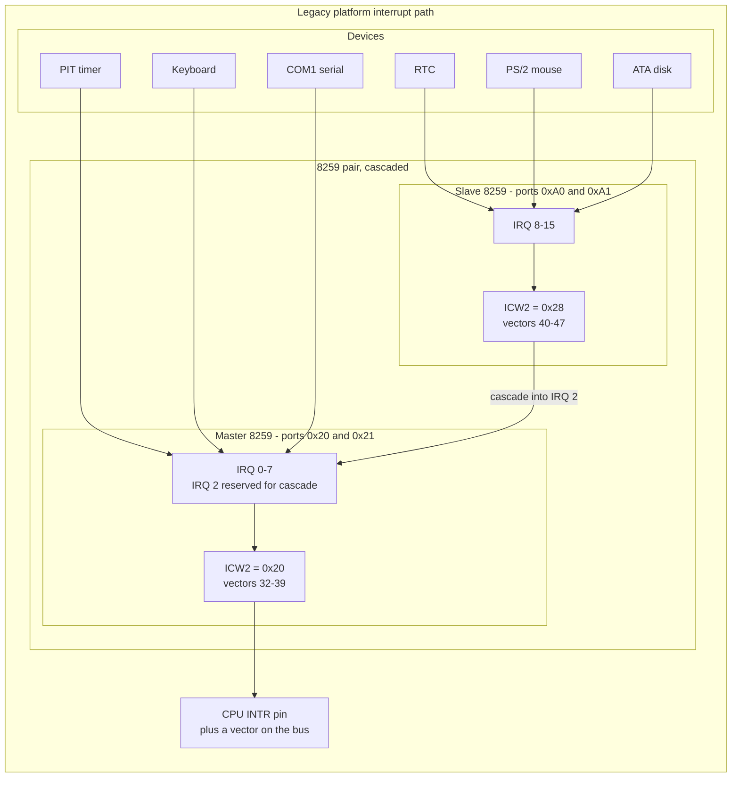

**Walking it.** Sixteen device lines, one CPU pin. The master 8259 has eight inputs; the
slave's output is wired into the master's input 2, which is why **IRQ 2 is not a usable
device line** and why the master's mask must leave bit 2 clear or nothing on the slave can
ever be delivered.

`ICW2` is the register that matters architecturally: it sets the **vector offset**, the
number the PIC puts on the bus when it raises `INTR`. The BIOS leaves the master at offset
`0x08` and the slave at `0x70`. And `0x08` is a catastrophe:

| IRQ | Device | Default vector | Which exception that is |
|---|---|---|---|
| 0 | Timer | 8 | `#DF` **double fault** |
| 1 | Keyboard | 9 | reserved |
| 3 | COM2 | 11 | `#NP` segment not present |
| 4 | COM1 | 12 | `#SS` stack-segment fault |
| 5 | LPT2 | 13 | `#GP` **general protection** |
| 6 | Floppy | 14 | `#PF` **page fault** |

A timer tick would arrive as a double fault. A serial byte would arrive as a general
protection fault — and worse, your `#GP` handler would read an error code the PIC never
pushed, so it would read `RIP` instead and print nonsense. There is no way to tell the two
apart at the handler, because vectors are the only identity. **Remapping is not tidiness;
it is the difference between a working system and one that cannot distinguish hardware
from failure.**

The remap is four **ICW** (initialisation command word) bytes to each chip: `0x11` (begin
init, ICW4 will follow), the new vector offset, the cascade wiring (`0x04` to the master
meaning "a slave is on line 2", `0x02` to the slave meaning "you are line 2"), and `0x01`
for 8086 mode. Then a mask byte. Move the master to `0x20` (vectors 32–39) and the slave to
`0x28` (vectors 40–47), clear of the CPU's reserved 0–31.

**EOI — End Of Interrupt.** The PIC will not deliver another interrupt on a line until you
acknowledge the current one by writing `0x20` to the chip's command port. Forget it and the
device fires exactly once and then goes permanently silent.

> [!warning] The slave EOI rule catches everyone
> For IRQs 8–15 the interrupt passed through **both** chips, so **both** need an EOI:
> write `0x20` to the slave at `0xA0` *and* to the master at `0x20`. Send it only to the
> master and IRQs 8–15 work exactly once each. The symptom — a keyboard that works and a
> mouse that dies after one click — looks like a driver bug and is not.

> [!warning] Spurious IRQ 7 and IRQ 15
> The 8259 will occasionally raise its lowest-priority line (7 on the master, 15 on the
> slave) for an interrupt that has since gone away. Read the In-Service Register (write
> `0x0B` to the command port, then read the data port) to check whether the bit is really
> set. For a spurious IRQ 7 send **no** EOI at all. For a spurious IRQ 15 send an EOI to
> the **master only**, because the master genuinely did service a cascade. Sending a
> normal EOI for a spurious IRQ 7 acknowledges an interrupt that never happened and
> desynchronises the priority logic.

**The PIC is temporary and the interface is not.** The 8259 cannot route an interrupt to
more than one core, which makes it a hard blocker for [[Phase 12 - Overview|SMP]]. It is
replaced by the LAPIC and IOAPIC in [[Phase 11 - Overview|Phase 11]]. Write the IRQ layer
behind a small interface — `mask`, `unmask`, `eoi`, `vector_for_irq` — so that swap is one
file rather than a rewrite of every driver.

---

## 4. The data structures

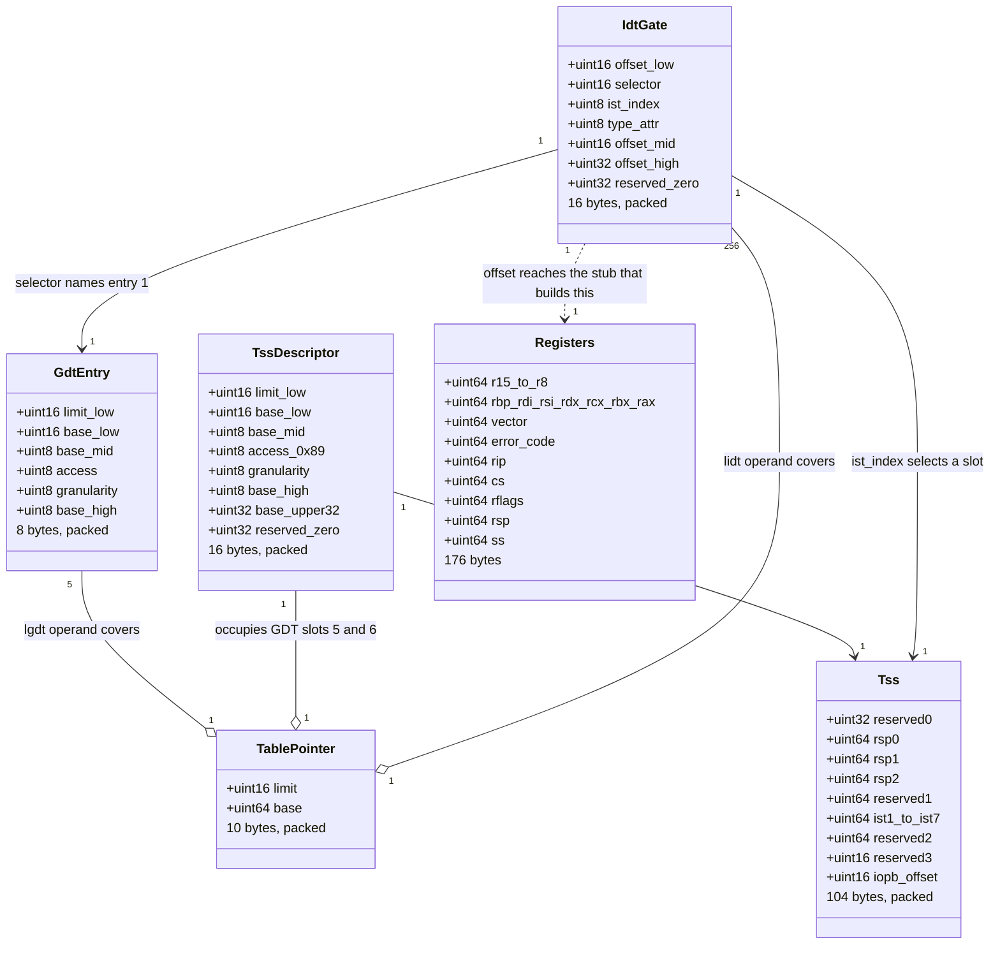

**Walking the relationships.** `TablePointer` is one shape used twice — `lgdt` and `lidt`
read the identical 10-byte layout, and both are `packed` or they silently become 16 bytes
with six bytes of padding where the base should be. `TssDescriptor` is `GdtEntry` plus
eight bytes, which is why their first six fields are declared identically; it lives in the
GDT and points at the `Tss`. `IdtGate` reaches into three places at once: the GDT for its
selector, the TSS for its stack, and the stub that will eventually build a `Registers`.
`Registers` is the only structure here the hardware does not define — it is entirely ours,
which is exactly why it is the one that can be wrong without anything noticing.

### 4.1 The exception vectors

Vectors 0–31 are fixed by the architecture. This is the table your handler switches on.

| Vec | Mnemonic | Name | Class | Error code | Notes |
|---|---|---|---|---|---|
| 0 | `#DE` | Divide error | Fault | no | `div` by zero, or a quotient that does not fit |
| 1 | `#DB` | Debug | Fault/Trap | no | Hardware breakpoints, single-step. `ist4` |
| 2 | — | NMI | Interrupt | no | Not maskable by `cli`. `ist2` |
| 3 | `#BP` | Breakpoint | **Trap** | no | `int3`. The one gate that may be DPL 3 |
| 4 | `#OF` | Overflow | **Trap** | no | `into` |
| 5 | `#BR` | BOUND range exceeded | Fault | no | Effectively dead |
| 6 | `#UD` | Invalid opcode | Fault | no | Also fires on `ud2`, which is what a failed `KASSERT` uses |
| 7 | `#NM` | Device not available | Fault | no | FPU/SSE lazy state. Relevant from Phase 5 |
| 8 | `#DF` | **Double fault** | **Abort** | yes, always 0 | `ist1`. Cannot be returned from |
| 9 | — | Reserved | — | no | Legacy coprocessor overrun |
| 10 | `#TS` | Invalid TSS | Fault | **yes** | Bad `ltr`, bad TSS descriptor |
| 11 | `#NP` | Segment not present | Fault | **yes** | P = 0 descriptor loaded |
| 12 | `#SS` | Stack-segment fault | Fault | **yes** | Bad `SS`, or a non-canonical stack push |
| 13 | `#GP` | General protection | Fault | **yes** | The catch-all. Non-canonical address, privilege violation, bad `int n` |
| 14 | `#PF` | **Page fault** | Fault | **yes** | Address in `CR2`. §4.2 |
| 15 | — | Reserved | — | no | |
| 16 | `#MF` | x87 floating-point error | Fault | no | The kernel does not use FP ([[ADR-0007 - Freestanding C++20 as the Kernel Language]]) |
| 17 | `#AC` | Alignment check | Fault | yes, always 0 | Only when `AC` in `RFLAGS` and `CR0.AM` are set |
| 18 | `#MC` | Machine check | **Abort** | no | `ist3`. Real hardware, Phase 15 |
| 19 | `#XM` | SIMD floating-point | Fault | no | |
| 20 | `#VE` | Virtualisation | Fault | no | |
| 21 | `#CP` | Control protection | Fault | **yes** | CET shadow stacks, if implemented |
| 22–27 | — | Reserved | — | no | |
| 28 | `#HV` | Hypervisor injection | Fault | no | |
| 29 | `#VC` | VMM communication | Fault | **yes** | AMD SEV-ES |
| 30 | `#SX` | Security exception | Fault | **yes** | |
| 31 | — | Reserved | — | no | |

### 4.2 Decoding the page-fault error code

`#PF` is the exception you will read most often for the rest of the project, so decode it
properly. The faulting **address** is in control register `CR2`; the error code says what
the access was trying to do.

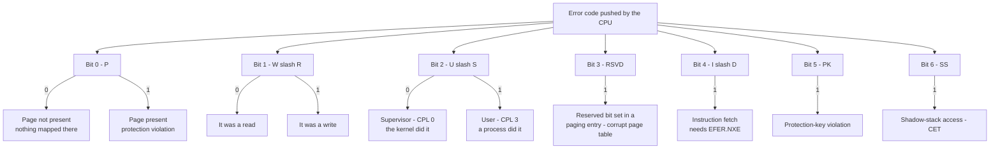

**Walking it.** Each bit is an independent yes/no about the *access that faulted*, not
about the page. Bit 0 is the one people misread: it is `1` when the page **was** present,
meaning the mapping exists but the access was not permitted. Bit 2 says who did it, and it
is the security-relevant one — a user-mode fault at a kernel address is a process probing
your address space, not a kernel bug.

Read together, the combinations are diagnoses:

| Code | Bits | Reading | What it usually means |
|---|---|---|---|
| `0x0` | — | supervisor read, not present | Kernel dereferenced a null or garbage pointer |
| `0x2` | W | supervisor write, not present | Kernel wrote through a bad pointer |
| `0x3` | P W | supervisor write to a present page | Kernel wrote to `.rodata` or a read-only mapping with `CR0.WP` set |
| `0x4` | U | user read, not present | Null dereference in a user program — the first 4 MiB is deliberately unmapped ([[06 - Architecture Overview]]) |
| `0x6` | W U | user write, not present | Growing a user stack, or a genuine user bug |
| `0x7` | P W U | user write to a present page | Copy-on-write trigger, or a write to a read-only mapping |
| `0x11` | P I | supervisor instruction fetch, present | Kernel executed an NX page — W^X violation |
| `0x14` | U I | user instruction fetch, not present | Jumped through a corrupt function pointer |
| any with bit 3 | RSVD | reserved bit set | Your page-table writing code is corrupt. Suspect Phase 4 |

> [!example] What a good fault report looks like
> ```
> PANIC: #PF page fault
>   cr2      0x00000000deadbeef
>   error    0x0002  supervisor write to a non-present page
>   rip      0xffffffff801034ac  heap_expand+0x8c
>   rsp      0xffffffff80120e40
>   backtrace:
>     heap_expand+0x8c
>     kmalloc+0x41
>     vfs_open+0x12d
> ```
> Compare with `Exception 14, error code 2`. The information content is identical; the
> *usable* information content is not. Decoding the bits into words and symbolising the
> addresses ([[Stage 1.7 - Symbolised Backtraces]]) is what makes this subsystem pay for
> itself, and it is why [[Stage 2.5 - CPU Exception Handlers]] is a whole stage rather
> than a `switch` with 32 `kprintf`s.

---

## 5. The flows

### 5.1 A device interrupt, end to end

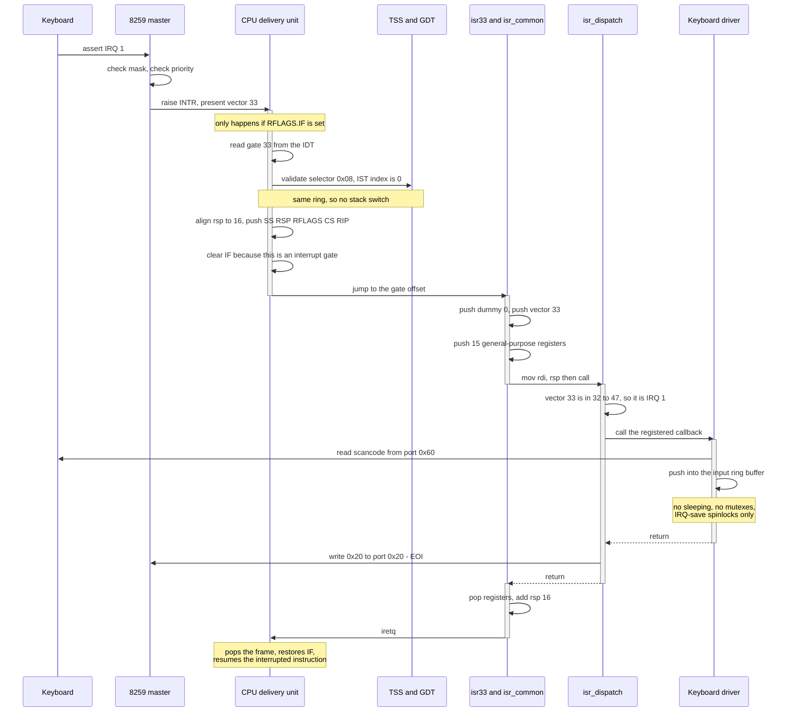

**Walking it.** Three things in this sequence are load-bearing and easy to miss.

**`RFLAGS.IF` gates the whole thing.** Hardware interrupts are only delivered when the
interrupt flag is set. `cli` clears it, `sti` sets it, and an interrupt gate clears it on
entry. That last point means this handler cannot itself be interrupted by another IRQ — no
nesting, by construction. It is why the concurrency table in [[06 - Architecture Overview]]
can say handlers only ever take IRQ-save spinlocks: on the local CPU, interrupts are
already off.

**The EOI is sent by the dispatcher, not the driver.** Making every driver remember it
guarantees one driver forgets. Send it in one place, after the callback returns, and send
it even when no callback is registered — an unhandled IRQ that is never acknowledged
wedges the line for good.

**The driver does almost nothing.** It reads the port and puts a byte in a ring buffer.
Interpretation — scancode to keycode, keycode to character, line editing — happens in
process context later. Interrupt handlers run with interrupts off on a stack they did not
choose; keeping them short is not style, it is the only way the rest of the system stays
responsive. See [[Stage 3.2 - The Keyboard Driver]].

### 5.2 An exception from user mode, which is the interesting case

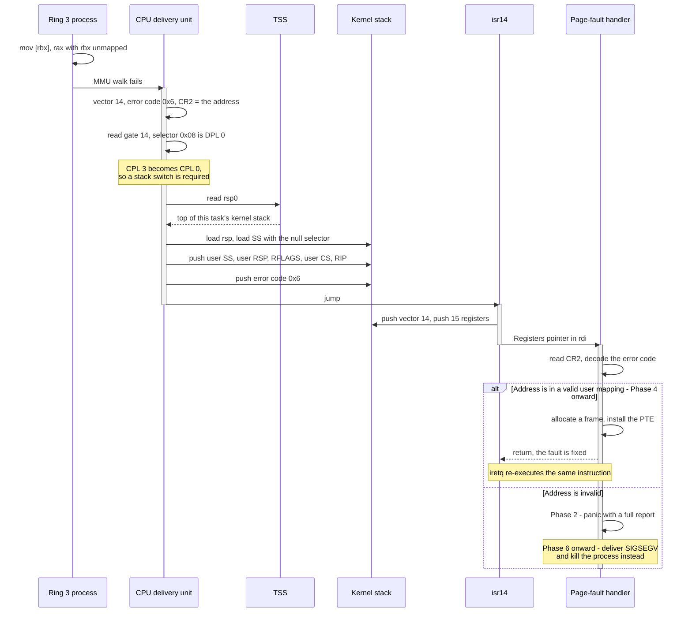

**Walking it.** The privilege change is the whole difference from §5.1. Because `CS` in the
gate is DPL 0 and the interrupted code was CPL 3, the CPU **must** switch stacks. It reads
`rsp0` from the TSS, loads `SS` with the null selector, and pushes the frame there. The
user's `SS` and `RSP` are part of what gets pushed, so `iretq` can put them back.

That is also why `rsp0` must be **updated on every context switch** from Phase 5 onward: it
names *this task's* kernel stack, and there is one per task. Leave it pointing at the
previous task's stack and two tasks share a kernel stack — corruption that reproduces under
load and never under a debugger.

The `alt` block is the point of the exception-class distinction in §5.3. A page fault is a
**fault**: the saved `RIP` points *at* the instruction that failed, not after it. So if the
handler fixes the mapping and returns, the CPU re-executes the same `mov` and it now
succeeds. That single property is what makes demand paging, copy-on-write and lazy stack
growth possible — the entire Phase 4 design rests on it.

> [!warning] `syscall` does not use `rsp0`
> The `syscall` instruction performs **no stack switch at all**. It loads `RIP` and
> `RFLAGS` from MSRs and leaves `rsp` pointing at the *user* stack. The kernel must switch
> stacks itself in the first few instructions of the entry stub, using `swapgs` and a
> per-CPU pointer. `rsp0` covers interrupts and exceptions arriving while user code runs —
> which is the timer, the keyboard and every page fault a process takes. Both paths matter;
> only one of them is the TSS's job. See [[Phase 6 - Overview|Phase 6]].

### 5.3 Exception classes — the state machine that decides if returning means anything

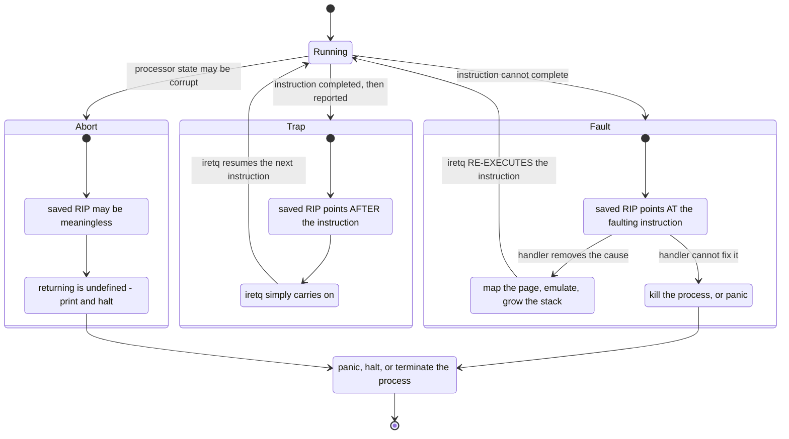

**Walking it.** Three classes, and the class determines what `iretq` *means*.

**Fault.** The instruction did not execute. `RIP` points at it. Returning re-runs it. This
is a feature, not a limitation: `#PF` is a fault precisely so that a handler can install a
mapping and let the access retry transparently. It is also a trap for the unwary — a `#DE`
divide-by-zero is a fault, so a handler that prints a message and returns without changing
anything re-executes the same `div`, faults again, and loops forever printing. The correct
Phase 2 response to `#DE` is to halt; the correct Phase 6 response is to kill the process.

**Trap.** The instruction completed and *then* the exception was reported. `RIP` points at
the next instruction. Returning simply continues. `#BP` (`int3`) is the canonical example
and is why breakpoints work: a debugger patches an `int3` over an instruction, the trap
fires after it, the debugger does its thing and resumes.

**Abort.** The processor cannot guarantee its own state. `RIP` may be meaningless. There is
no defined behaviour for returning. `#DF` and `#MC` are aborts. This is why the `#DF`
handler's entire job is *print and halt* — there is nothing else that can honestly be done,
and attempting more risks faulting inside it.

> [!question] Check your understanding
> `#DB` (vector 1) is listed as "Fault/Trap" because it is a fault for some conditions and
> a trap for others. Which conditions, and why does a single-step debug exception have to
> be a trap while an instruction-breakpoint debug exception has to be a fault?

### 5.4 The triple fault, told as a failure narrative

This is the story that justifies every byte of §3.2, so tell it as a story.

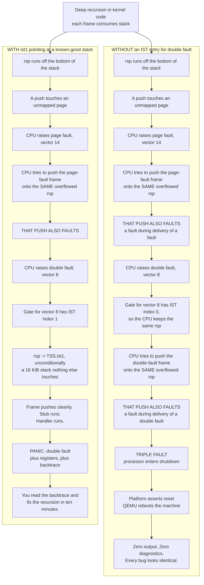

**Walking it.** Follow the left column one arrow at a time, because the mechanism is
precise and the precision is the point.

`W1`–`W2`: a runaway recursion walks `rsp` down past the bottom of the kernel stack into
memory that is not mapped. The `push` at the start of the next function is the first access
that fails.

`W3`: the MMU reports a page fault. Normal so far — this is exactly the mechanism a guard
page is *supposed* to trigger.

`W4`–`W5`: here is the trap. To *deliver* the page fault, the CPU must push five qwords and
an error code. Push where? `rsp` — which is exactly the broken value that caused the fault
in the first place. The push faults. **A second exception raised during the delivery of a
first is what defines a double fault**; note carefully that this is faulting *while the CPU
is setting up the handler*, not faulting *inside* the handler. A handler that runs and then
takes a page fault is a normal nested exception and is fine. This is not that.

`W6`–`W8`: the CPU raises `#DF`, vector 8. It reads gate 8. The IST field is 0, so it does
not switch stacks. It pushes the `#DF` frame onto — the same broken `rsp`.

`W9`–`W11`: that push faults too. A fault during the delivery of a double fault has no
third-chance handler; the processor enters **shutdown**. A triple fault is not an
exception, it is the processor giving up. The platform responds to shutdown by asserting
reset. QEMU reboots the VM.

`W12` is the part that costs you weeks. There is no output, no register dump, no vector
number. A null pointer dereference, a bad descriptor, a stack overflow and a corrupt page
table all produce the same observable: the machine reboots. You cannot tell them apart, so
you debug by bisecting your own commits.

The right column diverges at exactly one box — `H7`/`H8`. The gate for vector 8 names IST
slot 1, so the CPU loads `rsp` from `TSS.ist1` **without consulting or touching the broken
stack**. That stack is 16 KiB of `.bss` that nothing else uses, so the push succeeds, the
stub runs, the handler runs, and you get a panic with a backtrace.

**The whole difference is three bits in one IDT gate and 20 KiB of `.bss`.** That is the
trade, and it is why [[Stage 2.2 - The TSS and Interrupt Stacks]] comes before
[[Stage 2.5 - CPU Exception Handlers]] rather than after — you want the safety net
installed before you start deliberately provoking faults.

> [!warning] Debugging a triple fault when you have not built the net yet
> `qemu-system-x86_64 -d int,cpu_reset -no-reboot -no-shutdown ... 2> trace.log`. `-d int`
> logs every exception the CPU takes and `-no-reboot` stops the loop so the log ends at the
> failure. **The first exception in the log is your bug; everything after it is cascade.**
> Read from the top. See [[14 - Debugging Playbook]].

---

## 6. Why it is shaped this way

### 6.1 Table-level decisions

| Decision | Option taken | Rejected alternative | What breaks in the alternative |
|---|---|---|---|
| GDT ownership | Build our own, 7 slots | Keep using Limine's GDT | Limine's GDT lives in bootloader-reclaimable memory that Phase 4 frees. The descriptors vanish under a running kernel and the next segment load faults, phases later |
| GDT contents | Null, K code, K data, U data, U code, TSS | Add per-ring data segments, LDT | Long mode ignores segment bases and limits. Extra descriptors are pure surface area for a `sysret` ordering bug |
| Descriptor order | User data at index 3, user code at index 4 | Any other order | `sysret` computes `SS = STAR + 8` and `CS = STAR + 16`. Wrong order means `#GP` on the first return to user mode, in Phase 6 |
| Table construction | `constexpr`, built at compile time | Built at runtime by a function | A compile-time table can be asserted against golden bytes at build time and mapped read-only later. A runtime builder can be wrong on a path you have not run |
| IDT size | All 256 gates present | Only the 48 we use | An absent gate turns a stray interrupt into `#NP`, a second mystery stacked on the first. A present "unhandled vector" stub turns it into a printed diagnosis |
| Gate type | `0xE` interrupt gate everywhere | `0xF` trap gate | Trap gates leave `IF` set, so handlers nest. With a non-preemptible kernel and IRQ-save spinlocks, nesting buys nothing and costs a whole class of re-entrancy bugs |
| Gate DPL | `0` for every vector | `3` for convenience | Ring 3 could execute `int 0x0E` and forge a page fault with an error code of its choosing. Handlers would trust attacker-supplied data |

### 6.2 IST decisions

| Decision | Option taken | Cost | Verdict |
|---|---|---|---|
| Which vectors get an IST | `#DF`, NMI, `#MC`, `#DB` | 4 × 20 KiB `.bss` | Chosen. `#DF` is non-negotiable; the other three arrive without regard to what you were doing |
| | `#DF` only | 20 KiB. An NMI during a stack switch still kills you | Acceptable minimum |
| | Add `#PF` | 20 KiB more, and nested page faults corrupt each other | Rejected — see §3.2 |
| | Every exception | 640 KiB, and nothing is re-entrant | Rejected |
| Stack sharing | One stack per IST slot | 80 KiB total | Chosen. Shared stacks corrupt exactly when NMI lands inside `#DF`, which is unprovable to exclude |
| Stack size | 16 KiB usable + 4 KiB guard | 20 KiB each | Chosen. A panic genuinely uses ~2 KiB; a factor of eight is the right margin for a structure that must work when everything else is broken. Four clean pages, same as Linux |
| TSS count | One now, all access through functions | Phase 12 changes one file | Chosen. `rsp0` is inherently per-CPU, but inventing `MAX_CPUS` and a CPU-id source before either exists is untestable |

### 6.3 Interrupt-controller decision

| Decision | Option taken | Rejected | Consequence |
|---|---|---|---|
| Controller in Phase 2 | 8259 PIC | Go straight to LAPIC/IOAPIC | The APIC needs ACPI table parsing, which needs a VMM to map the tables, which is Phase 4/11. Waiting for it means no interrupts until Phase 11, so no timer, no keyboard, no preemption for nine phases |
| Vector offsets | Master 32, slave 40 | Anything overlapping 0–31 | Timer ticks arrive as double faults; disk interrupts as page faults. Vectors are the only identity, so the confusion is unresolvable at the handler |
| Interface shape | `mask`/`unmask`/`eoi` behind an interface | Drivers poke PIC ports directly | The PIC cannot route to more than one core, so Phase 12 is blocked until it is replaced. With an interface that is one file; without it, it is every driver |

Related decisions: [[ADR-0002 - Target x86_64 Not i686]] (why 16-byte gates and IST exist at
all), [[ADR-0003 - Limine as the Bootloader]] (why the machine arrives in long mode with
interrupts already disabled and no IDT), [[ADR-0007 - Freestanding C++20 as the Kernel Language]]
(why handlers cannot throw, cannot allocate, and cannot use floating point).

---

## 7. How this grows across the phases

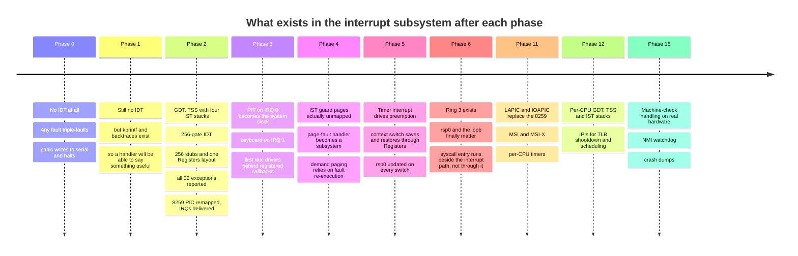

**What is deliberately missing early, and why that is acceptable.**

**No APIC until Phase 11.** The 8259 is objectively worse: one core, sixteen lines, no
message-signalled interrupts. But the APIC path requires parsing ACPI tables, which requires
mapping physical memory the firmware chose, which requires a VMM. Waiting would mean no
interrupts at all until Phase 11 — no timer, therefore no preemption, therefore no Phase 5.
The PIC is the thing that lets the next nine phases happen. Hiding it behind an interface
is what makes discarding it cheap.

**No `#PF` handling worth the name until Phase 4.** In Phase 2 a page fault means "panic
with a decoded error code". Only once the VMM owns the page tables can the handler *fix*
anything. The Phase 2 version is not a placeholder, though — it is the diagnostic that makes
Phase 4 debuggable.

**No per-CPU tables until Phase 12.** One GDT, one TSS, one set of IST stacks. This is
correct for one core and catastrophically wrong for two — two cores sharing a `rsp0` means
two cores pushing frames onto the same kernel stack. The mitigation is architectural rather
than implemented: all access goes through functions, never a raw global, so Phase 12
changes one file rather than every call site.

**No nested interrupts, ever, in v1.** Interrupt gates clear `IF`. Combined with the
non-preemptible kernel in [[06 - Architecture Overview]], this means an interrupt handler
runs to completion with interrupts off on the local CPU. It costs latency. It buys the
elimination of an entire category of re-entrancy bug at a stage where you cannot yet debug
one. Revisit post-1.0.

---

## 8. Failure modes

Symptom first, because at 2am that is all you have.

| Symptom | Likely cause | Where to look |
|---|---|---|
| **QEMU reboots in a loop, no output** | Triple fault. No IDT yet, bad GDT/IDT descriptor, `lgdt`/`lidt` with a truncated 32-bit base, or `ltr` with a bad TSS selector | `-d int,cpu_reset -no-reboot`; read the **first** exception in the log |
| **Reboot loop the instant `ltr` runs** | TSS descriptor `base[63:32]` not written, so the CPU reads the TSS from a low unmapped address | [[Stage 2.2 - The TSS and Interrupt Stacks]] §4.2; unit-test the encoder against the golden bytes |
| **Reboot loop on the first `sti`** | Interrupts enabled before the PIC was remapped. A pending timer tick arrives as vector 8 | Remap in [[Stage 2.6 - The 8259 PIC - Remap and Mask]] **before** `sti` in [[Stage 2.7 - Hardware Interrupts]] |
| **Handler runs, printed values are nonsense but plausible** | `Registers` field order does not match the stub push order — everything is shifted by one field | §3.5; check `offsetof` assertions and the Tier-1 test |
| **Half the exceptions report correctly, the other half are off by eight bytes** | Missing dummy error-code push on the no-error vectors | §3.4; verify the error-code vector set is `{8,10,11,12,13,14,17,21,29,30}` |
| **`#GP` immediately on the first interrupt** | IDT gate selector is the data selector `0x10` instead of the code selector `0x08` | §3.3 |
| **Machine appears to hang after exactly one interrupt** | Handler returned with `ret` instead of `iretq`, so `IF` was never restored | §3.4 |
| **Keyboard works, mouse dies after one event** | EOI sent only to the master for a slave IRQ (8–15) | §3.6; both `0xA0` and `0x20` |
| **A device fires exactly once and goes silent** | EOI never sent at all, or not sent when no callback is registered | Send it in the dispatcher, unconditionally |
| **Endless stream of "unhandled vector 39" or "vector 47"** | Spurious PIC interrupts on the lowest-priority lines | Check the In-Service Register; no EOI for spurious IRQ 7, master-only EOI for spurious IRQ 15 |
| **Divide-by-zero handler prints forever** | `#DE` is a *fault*; returning re-executes the same `div` | §5.3. Halt in Phase 2, terminate the process from Phase 6 |
| **`#DF` reported, but the register dump is garbage** | Two IST slots point at the same stack, and a second vector overwrote the first handler's frame | §3.2; one stack per slot |
| **Everything works, then breaks the moment a second core boots** | Shared GDT/TSS/`rsp0` across CPUs | Expected. Phase 12 makes them per-CPU |
| **Works in QEMU, `#GP` on real hardware** | Reserved bits not zeroed in a gate or descriptor. QEMU is lenient; silicon is not | Zero every reserved field explicitly |

> [!warning] The failure mode with no symptom
> An IST gate written with index `0` when you meant "the first slot". Everything works. Every
> test passes. The feature is silently off, and you discover it during your first real stack
> overflow — which is the exact moment it was supposed to save you. The only defence is a
> deliberate test: recurse infinitely on purpose and assert that a readable `#DF` panic
> appears. [[Stage 2.2 - The TSS and Interrupt Stacks]] §6.5 makes this a Tier-2 test rather
> than a hope.

---

## 9. Masterclass notes

> [!question] Discussion prompts
> 1. The CPU discards the vector number before entering your handler, which forces 256
>    separate entry points. Suppose the hardware *did* pass the vector in a register. What
>    would the stub layer collapse to, and which of Phase 2's bugs would simply stop
>    existing? What would you lose?
> 2. Ten vectors push an error code and 246 do not. Instead of pushing a dummy zero, you
>    could give C++ two structs and two dispatch functions. Argue both sides, then say what
>    happens to [[Phase 5 - Overview|Phase 5]]'s context switch under each design.
> 3. `#PF` deliberately gets no IST entry, on the grounds that page faults nest
>    legitimately. Construct a kernel design where putting `#PF` on an IST would be the
>    *right* call, and say what property of that design makes it safe.
> 4. Interrupt gates clear `IF`, so handlers never nest. That costs interrupt latency —
>    a slow disk handler delays the timer tick. What breaks first when you allow nesting,
>    and what would have to be true about the locking model before it is safe?
> 5. A triple fault is not an exception; it is the processor giving up. Given that the
>    machine resets and loses all state, what would you have to build to extract a
>    diagnostic from a triple fault anyway — and is any of it worth doing before Phase 15?

**You understand this when you can:**

- [ ] Draw the GDT, TSS and IDT and every arrow between them, from memory, without notes
- [ ] Explain why an IDT gate is 16 bytes when a code descriptor is 8, in one sentence
- [ ] State the five things the CPU pushes, in order, and say why `SS` and `RSP` are pushed
      even without a privilege change
- [ ] Name the ten vectors that push an error code, and say what the dummy push does *besides*
      making the layout uniform
- [ ] Write the `Registers` struct and the stub push order and explain why one is the reverse
      of the other
- [ ] Decode `#PF` error code `0x7` into English without looking it up
- [ ] Tell the triple-fault story end to end, naming the exact box where an IST entry changes
      the outcome
- [ ] Explain why the PIC's default master offset of 8 makes a timer tick indistinguishable
      from a double fault
- [ ] Say which EOI goes to which chip for IRQ 12, and why

**Board plan — the order to draw this, in nine steps.**

1. A CPU box with a single `INTR` pin. Ask: sixteen devices, one pin. How?
2. Draw the two 8259s cascaded, master offset `0x20`. Write vectors 32–47 next to them.
3. Draw the vector number as a single narrow arrow into the CPU. Say out loud: *this is
   all the CPU knows.*
4. Draw the IDT as 256 boxes; explode one into its four meaningful fields.
5. From the selector field, draw an arrow to a GDT box. From the IST field, draw an arrow
   to a TSS box. Note that both tables were built before the IDT for exactly this reason.
6. Draw the stack, and push onto it in the hardware's order: `SS RSP RFLAGS CS RIP`, then
   error code. Mark which vectors get one.
7. Draw the stub adding a dummy zero, the vector, and fifteen registers. Turn the picture
   upside down and write the C++ struct beside it — this is the moment the reversal clicks.
8. Draw the fan-in: 256 stubs into one `isr_common` into one dispatcher.
9. Erase the IST arrow. Walk the triple-fault chain. Put the arrow back. Walk it again.
   End there.

**Time budget:** 55 minutes. Ten on the tables, fifteen on the stub and the frame contract,
ten on the PIC, ten on the triple-fault narrative, ten on questions.

---

## 10. Related

**Stages that build this:** [[Stage 2.1 - The Global Descriptor Table]] ·
[[Stage 2.2 - The TSS and Interrupt Stacks]] · [[Stage 2.3 - The Interrupt Descriptor Table]] ·
[[Stage 2.4 - Interrupt Stubs and the Saved Frame]] · [[Stage 2.5 - CPU Exception Handlers]] ·
[[Stage 2.6 - The 8259 PIC - Remap and Mask]] · [[Stage 2.7 - Hardware Interrupts]]

**Phase context:** [[Phase 2 - Overview]] · [[Phase 3 - Overview]] · [[Phase 11 - Overview]] ·
[[Phase 12 - Overview]]

**Depends on:** [[Stage 0.7 - Panic and KASSERT]] · [[Stage 1.6 - kprintf]] ·
[[Stage 1.7 - Symbolised Backtraces]] · [[Stage 1.5 - The Log Ring Buffer and Levels]]

**Consumed by:** [[Stage 3.1 - The Programmable Interval Timer]] ·
[[Stage 3.2 - The Keyboard Driver]] · [[Phase 4 - Overview]] · [[Phase 5 - Overview]] ·
[[Phase 6 - Overview]]

**Decisions:** [[ADR-0002 - Target x86_64 Not i686]] · [[ADR-0003 - Limine as the Bootloader]] ·
[[ADR-0007 - Freestanding C++20 as the Kernel Language]]

**Reference:** [[06 - Architecture Overview]] · [[04 - Glossary]] · [[07 - Repository Layout]] ·
[[09 - Testing Strategy]] · [[14 - Debugging Playbook]]
