# 09 — Tasks, Scheduling and Concurrency

> [!abstract] What this document covers
> The part of the kernel that decides which piece of work the CPU is executing at
> this instant, and the rules that keep that decision from corrupting everything
> else. It opens the `sched/` box from [[06 - Architecture Overview]]: what a task
> is, how the CPU is taken from one task and handed to another, how a task waits
> without burning the machine, and the locking discipline that makes all of it
> survivable.

**Zoom level:** Subsystem, deep — down to individual stack slots and single registers.
**Built by:** [[Stage 3.1 - The Programmable Interval Timer]], [[Stage 5.1 - Tasks, Context, and the Stack]], [[Stage 5.2 - Cooperative Task Switching]], [[Stage 5.3 - Preemptive Scheduling]], [[Stage 5.4 - Sleep and Blocking]]
**Prerequisites:** [[06 - Architecture Overview]], [[Phase 2 - Overview|Phase 2 — CPU Tables & Interrupts]], [[Phase 4 - Overview|Phase 4 — Memory Management]]
**Masterclass session:** 5 (see [[19 - The Eight-Hour Masterclass]])

---

## 1. The one-sentence version

**A task is a saved set of CPU registers plus a stack plus an address space; the
scheduler is the code that decides whose saved registers the CPU should be running
right now.**

A CPU executes one instruction stream. It has one set of registers, one stack
pointer, one instruction pointer. "Running two programs at once" on one core is a
lie told convincingly: the kernel runs one for a few milliseconds, carefully
photographs every register it was using, restores the photograph belonging to a
different program, and lets that one run for a few milliseconds. Do this twenty
times a second and a human cannot tell the difference. Do it wrongly by one stack
slot and the machine executes an address that was never a function.

Everything in this document is a consequence of that one trick and of the fact that
the trick can happen *between any two instructions* once a timer is involved.

> [!note] Terms defined here, in order of first use
> **Register** — a named storage slot inside the CPU (`rax`, `rsp`, `rip`). There are
> only sixteen general ones on x86_64, so they are constantly reused.
> **Stack** — a region of memory a function uses for its local variables and return
> addresses; `rsp` points at its current top. Each task needs its own, or two tasks
> would scribble on each other's local variables.
> **Address space** — the mapping from the addresses a program uses to real RAM.
> **Context switch** — saving one task's registers and restoring another's.
> **Preemption** — the timer forcibly taking the CPU away from a task that did not
> offer to give it up.
> **Deadlock** — two or more pieces of code each waiting for something only the
> other can provide. Nothing moves, ever again.

---

## 2. The picture

This is the whole subsystem. Everything else in this document is one of these boxes
opened up.

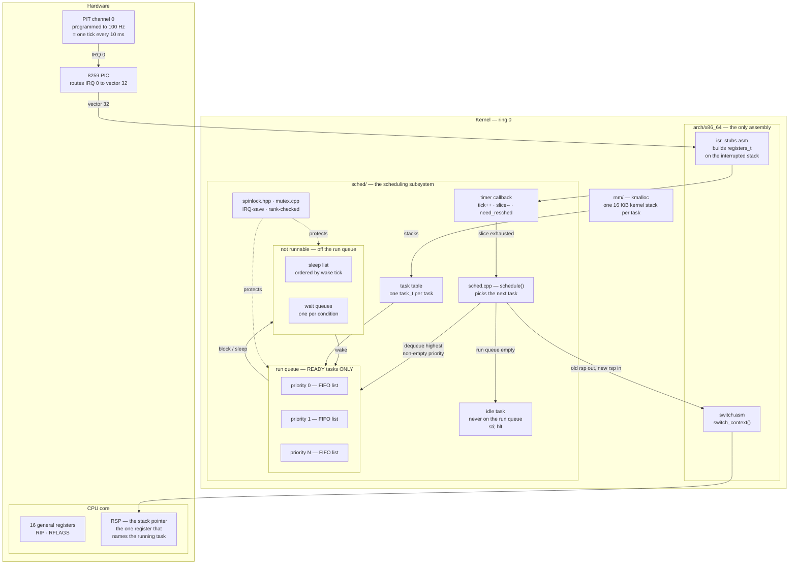

### Walking every box and every arrow

**`PIT channel 0`** — the Programmable Interval Timer, an ancient chip that counts
down from a divisor of a 1.193182 MHz base clock and raises an interrupt each time it
hits zero. [[Stage 3.1 - The Programmable Interval Timer]] programs it to 100 Hz, so
one interrupt every 10 ms. This chip is the entire reason preemption is possible: it
is the only component in the system that can interrupt a task that has no intention
of stopping.

**`8259 PIC`** — the interrupt controller. [[Stage 2.6 - The 8259 PIC - Remap and Mask]]
remapped it so IRQ 0 arrives as CPU vector 32 rather than colliding with the CPU's own
exception vectors. From [[Phase 11 - Overview|Phase 11]] the LAPIC timer replaces the
PIT and the IOAPIC replaces the PIC; the shape of this diagram does not change, only
the two boxes at the top.

**`CPU core`** holds the registers. `RSP` is drawn separately because it carries the
whole argument of this document: **for a task that is not running, the saved value of
`rsp` is the entire context.** Everything else the task owns is sitting on the stack
that `rsp` points into. That is why `task_t` can be tiny.

**`isr_stubs.asm`** — the 256 interrupt entry points from
[[Stage 2.4 - Interrupt Stubs and the Saved Frame]]. Every vector, including the
timer, lands here first. The stub's job is to turn the CPU's partial hardware frame
into one complete, identical `registers_t` structure on the interrupted task's stack,
so C++ code can be called.

**`timer callback`** — registered on IRQ 0. It does three things and nothing else:
increments a 64-bit tick, wakes any sleeper whose time has come, and decrements the
running task's remaining time slice. If the slice reaches zero it sets `need_resched`.
It is deliberately tiny; see §8 for what happens when it is not.

**`schedule()`** — the picker. It takes the run queue lock, removes the highest-priority
ready task, marks the outgoing task ready and re-enqueues it (unless it is blocking),
and calls the switch.

**`run queue`** — the *only* structure the picker looks at. The invariant, and it is
the most important one in this document, is **a task is on the run queue if and only
if its state is READY**. Three priority lists are drawn to show the shape the design
leaves room for; v1 uses exactly one and is plain round-robin ([[Stage 5.3 - Preemptive Scheduling]]).

**`idle task`** — the task the scheduler runs when the run queue is empty. It is not
*on* the run queue, because it must never compete with real work. §3.6 explains why it
must exist rather than being a special case in `schedule()`.

**`sleep list` and `wait queues`** — where a task lives while it is not runnable. A
task is on exactly one of these containers at any moment: run queue, sleep list, or
one wait queue. Never two. Never none (except while it is the running task).

**`spinlock.hpp` / `mutex.cpp`** — the synchronisation primitives. The dotted arrows
mean "protects": both the run queue and the parked structures are touched from both
process context and interrupt context, so both need IRQ-save spinlocks. §3.8 and §5.4
are about exactly this.

**`kmalloc`** — every task needs a stack, and a stack is 16 KiB of heap. This is why
[[Phase 5 - Overview|Phase 5]] cannot begin before [[Phase 4 - Overview|Phase 4]]: no
heap, no stacks, no tasks.

The arrows in the middle are the two loops that make an OS an OS. The downward path
`PIT → PIC → stubs → tick → schedule → switch → RSP` is **preemption**: hardware taking
the CPU away. The horizontal pair `run queue ⇄ parked` is **blocking**: software giving
the CPU away and getting it back when a condition is satisfied.

---

## 3. Zooming in

### 3.1 What a task actually is

Three things, and the third one is free until [[Phase 6 - Overview|Phase 6]].

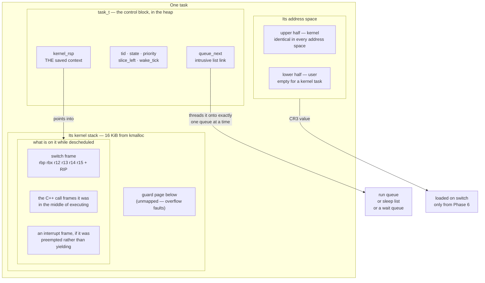

**`task_t`** lives in the heap. `kernel_rsp` is the whole point: when the task is not
running, this field holds the value `rsp` had at the instant it stopped. Restoring the
task means writing this number back into `rsp` and popping. `tid`, `state`, `priority`,
`slice_left` and `wake_tick` are bookkeeping the scheduler reads. `queue_next` is an
*intrusive* link — the list pointer lives inside the object rather than in a separately
allocated node, so enqueue and dequeue never allocate. That matters because the
scheduler runs with interrupts off and must never call `kmalloc` (§3.8).

**The kernel stack** is 16 KiB of `kmalloc`'d memory used top-down.
[[Stage 5.1 - Tasks, Context, and the Stack]] picks 16 KiB because a kernel call chain
plus a 176-byte interrupt frame on top of it does not fit comfortably in 4 KiB, and
because an overflow is silent. The **guard page** — an unmapped page immediately below
the stack — converts a silent overflow into a clean page fault. That page fault will
itself try to push a frame onto the exhausted stack, fail again, and escalate to a
double fault, which is precisely why [[Stage 2.2 - The TSS and Interrupt Stacks]]
insisted that `#DF` gets its own IST stack. Those two decisions, made three phases
apart, combine into "a stack overflow produces a readable panic instead of a reboot".

> [!warning] Heap-allocated stacks cannot have guard pages
> `kmalloc` hands out contiguous bytes from one region; there is no unmapped page
> between two allocations. Until stacks are allocated page-granularly through the VMM
> with a deliberately unmapped page below each one, an overflow silently eats the
> neighbouring task's stack — and the symptom appears in the *other* task, minutes
> later. Treat the guard page as a Phase 4/5 follow-up, not an optional nicety.

**The address space.** In [[Phase 5 - Overview|Phase 5]] every task is a *kernel task*:
they all share the kernel's page tables, `CR3` never changes, and the third element of
the definition costs nothing. From [[Phase 6 - Overview|Phase 6]] each user process
carries its own PML4 and the switch must load `CR3` when the incoming task's address
space differs from the outgoing one.

This is where the memory layout in [[06 - Architecture Overview]] earns its keep. The
kernel is mapped into the **upper half of every address space**. The instruction that
loads `CR3` is kernel code; if the kernel were not present at the same virtual
addresses in the new address space, the very next instruction fetch would fault into a
page table that has no kernel in it. The higher-half layout is not an aesthetic choice —
it is what makes an address-space switch survivable.

### 3.2 Task states and every transition

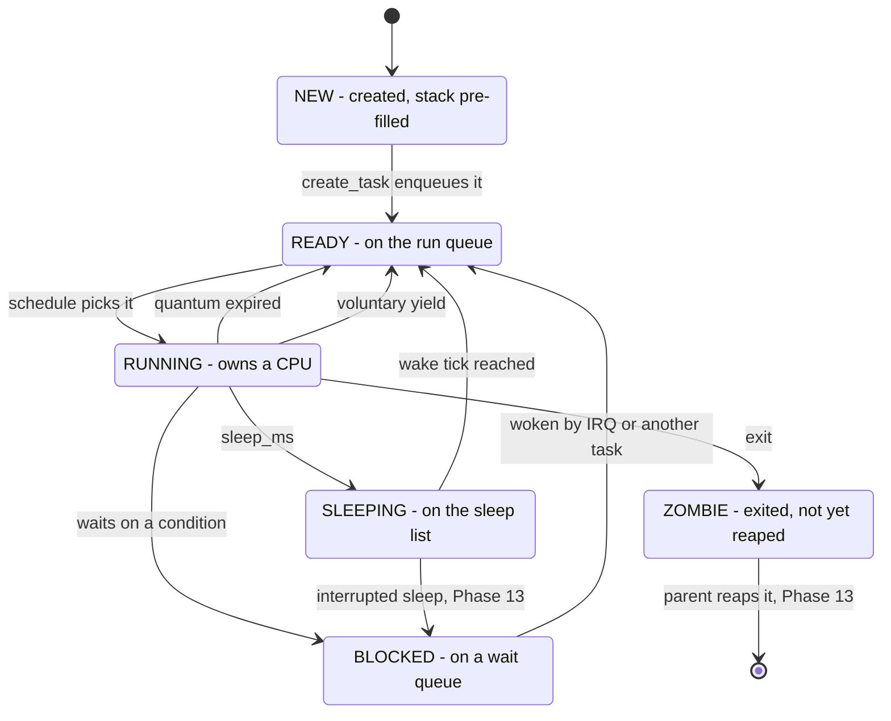

Every transition, in order:

- **`[*] → NEW`** — `create_task(entry)` allocates a `task_t` and a 16 KiB stack and
  pre-fills the stack so that the first switch into this task lands at `entry`
  (§3.3). It is not runnable yet; nothing has enqueued it.
- **`NEW → READY`** — the task is put on the run queue. From this moment the timer may
  select it, so everything it needs must already be initialised. Publishing a
  half-built task is a race even on one core.
- **`READY → RUNNING`** — `schedule()` dequeued it and `switch_context` restored its
  registers. Exactly one task per CPU is RUNNING. The idle task is RUNNING when nothing
  else is.
- **`RUNNING → READY` (quantum expired)** — preemption. The timer decremented
  `slice_left` to zero, `need_resched` was set, and the switch was taken on the way out
  of the interrupt. The task did not ask and does not know.
- **`RUNNING → READY` (voluntary yield)** — the task called `yield()`. Same mechanism,
  different trigger. This is all of [[Stage 5.2 - Cooperative Task Switching]].
- **`RUNNING → BLOCKED`** — the task needs something that is not available: a key
  press, a disk block, a mutex someone else holds. It puts itself on that condition's
  wait queue and calls `schedule()`. **It is removed from the run queue.** §3.7 explains
  why this is not optional.
- **`RUNNING → SLEEPING`** — `sleep_ms(n)` computes `wake_tick = tick + n * ticks_per_ms`,
  puts the task on the sleep list, and schedules away. Sleeping is blocking where the
  waker is the timer.
- **`BLOCKED → READY`** — someone satisfied the condition and called `wake()`. Usually
  an interrupt handler: the keyboard IRQ that saw Enter, the disk IRQ that saw a
  completion. The waker sets the state and enqueues, under the same lock, in that order.
- **`SLEEPING → READY`** — the timer callback scanned the sleep list and found
  `wake_tick <= tick`.
- **`RUNNING → ZOMBIE`** and **`ZOMBIE → [*]`** — [[Phase 13 - Overview|Phase 13]]. A
  task that exits cannot free its own stack, because it is standing on it. It parks in
  ZOMBIE holding only its exit status until a parent calls `wait()`; the reaper frees
  the stack and the `task_t`. Drawn now so the state machine does not have to be
  redrawn later.

There are exactly two transitions into READY from a non-running state, and both are
"someone else made this task runnable". There is no transition from BLOCKED or SLEEPING
to RUNNING. A woken task always goes through READY, and therefore through the
scheduler's selection. A wake is not a switch.

> [!question] Why is there no `BLOCKED → RUNNING` edge?
> What would break if `wake()` switched directly to the woken task? Consider: who is
> calling `wake()`, what stack are they on, and what happens to the task they
> interrupted.

### 3.3 The context switch, one stack slot at a time

`switch_context(uint64_t* save_old_rsp, uint64_t load_new_rsp)`. Two arguments, in
`rdi` and `rsi` per the System V AMD64 calling convention. Roughly fifteen instructions.
It is the smallest and most load-bearing function in the kernel.

```
switch_context:
    push rbp
    push rbx
    push r12
    push r13
    push r14
    push r15
    mov  [rdi], rsp        ; save outgoing stack pointer into old task
    mov  rsp, rsi          ; adopt incoming task's stack
    pop  r15
    pop  r14
    pop  r13
    pop  r12
    pop  rbx
    pop  rbp
    ret                    ; returns into the OTHER task
```

The single instruction that matters is `mov rsp, rsi`. Before it, the function is
running as task A. After it, the same function is running as task B. The `ret` at the
end pops a return address that task B pushed, possibly seconds ago, and control
resumes in task B's `schedule()` call as though it had just returned normally.

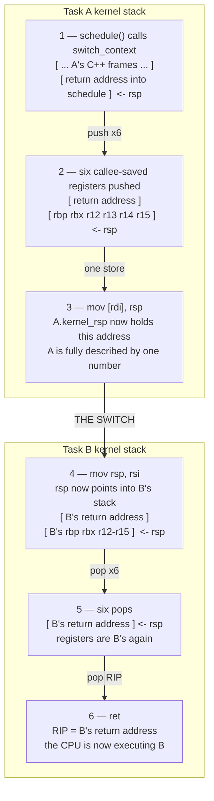

**Moment 1.** `schedule()` executes `call switch_context`. The `call` pushes the address
of the instruction after it. That pushed address is what will eventually resume this
task — the saved instruction pointer, stored on the stack rather than in the task
struct.

**Moment 2.** Six pushes. Not sixteen. The System V AMD64 ABI splits the registers:

| Registers | Class | Saved by the switch | Why |
|---|---|---|---|
| `rbx`, `rbp`, `r12`–`r15` | callee-saved | **yes**, on the stack | The compiler assumes they survive a call, so they hold live values |
| `rax`, `rcx`, `rdx`, `rsi`, `rdi`, `r8`–`r11` | caller-saved | **no** | The ABI says a call may destroy them; the compiler already spilled anything it still needed |
| `rsp` | — | **yes**, into `task_t.kernel_rsp` | It is the handle for everything else |
| `rip` | — | **yes**, implicitly | It is the return address the `call` pushed |
| `rflags` | — | see below | Carries the interrupt-enable flag |
| `CS`, `SS`, `DS`… | — | no | Long mode segments are flat; all kernel tasks use the same selectors |
| `CR3` | — | from Phase 6 | Only when the address space actually differs |
| `FS`/`GS` base | — | from Phase 12/13 | Per-CPU base and user TLS |
| x87 / SSE / AVX | — | not in v1 | The kernel is built `-mno-sse` and uses no FP at all ([[ADR-0007 - Freestanding C++20 as the Kernel Language]]); user FPU state arrives with user mode |

Six registers is the entire cost of a voluntary switch. That is not a trick — it is the
calling convention doing the work. `switch_context` is a normal C function to its
caller, so the caller has already assumed its scratch registers are gone.

**Moment 3.** `mov [rdi], rsp` writes the stack pointer into task A's control block.
From this instant A is a number. Nothing else about A is anywhere except on A's stack,
reachable from that number.

**Moment 4.** `mov rsp, rsi`. The stack changed under the function's feet. Every local,
every frame pointer, every spill slot the compiler might have assumed is now wrong.
This is the reason the routine is written in assembly and can never be written in C++:
there is no C++ semantics for "the stack is now a different stack", and the compiler is
entitled to reorder, inline, add a frame pointer, insert alignment padding, or spill to
the red zone. Assembly is not chosen for speed here. It is chosen because the language
cannot express the operation. Note also that the kernel is compiled `-mno-red-zone`
([[Stage 0.1 - Prove Your Toolchain Works]]) — assembly never uses the red zone anyway,
but every C++ function that could be interrupted must not either.

**Moment 5.** Six pops, in exactly the reverse order of the pushes. This is the contract
that [[Stage 5.1 - Tasks, Context, and the Stack]] and
[[Stage 5.2 - Cooperative Task Switching]] must agree on to the byte.

**Moment 6.** `ret` pops task B's saved instruction pointer. The switch is complete.

#### Faking moment 3 for a task that has never run

A brand-new task has no saved state to restore, so `create_task` writes one by hand.
The pre-filled stack must look *exactly* like a stack that has already been through
moments 1 and 2:

```
   higher addresses
   ┌──────────────────────────────┐  <- stack_top (16-byte aligned)
   │  &task_exit                  │   fake return address: if the entry
   ├──────────────────────────────┤   function ever returns, land here
   │  entry_point                 │   <- the final `ret` pops this into RIP
   ├──────────────────────────────┤
   │  rbp = 0                     │
   │  rbx = 0                     │
   │  r12 = 0                     │
   │  r13 = 0                     │
   │  r14 = 0                     │
   │  r15 = 0                     │   <- task_t.kernel_rsp points HERE
   └──────────────────────────────┘
   lower addresses      ... 16 KiB of unused stack below ...
```

Two details that are easy to get wrong and hard to debug:

**The fake return address.** If a task's entry function simply returns — and someone
will write one that does — `ret` pops whatever is above `entry_point`. Put the address
of a `task_exit` trampoline there and a returning task exits cleanly. Put zero there
and it jumps to address 0, which the memory layout deliberately leaves unmapped so
that the fault is immediate and obvious. Put nothing there and it jumps into the heap.

**Alignment.** The ABI requires `rsp` to be 16-byte aligned at a `call`, which means a
function sees `rsp ≡ 8 (mod 16)` on entry, because the `call` pushed eight bytes. The
layout above reproduces that: with `stack_top` 16-byte aligned and exactly one qword
(the fake return address) above `entry_point`, the entry function begins with `rsp`
eight bytes below a 16-byte boundary — the same as any normally-called function.

> [!warning] The single most common multitasking bug
> The pre-fill order and the pop order disagree. The symptom is that the first switch
> into a new task jumps to a nonsense address: `rbx` gets used as the instruction
> pointer, or the entry address ends up in `r12`. There is no useful backtrace, because
> the stack the backtracer would walk is the one you built incorrectly. Design the
> pre-fill and the assembly together, in one sitting, and print both layouts in the
> stage note.

### 3.4 What the timer changes

Cooperative and preemptive switching use the **same** `switch_context`. Only the
trigger differs, and one bit of hardware state.

| | Cooperative ([[Stage 5.2 - Cooperative Task Switching|5.2]]) | Preemptive ([[Stage 5.3 - Preemptive Scheduling|5.3]]) |
|---|---|---|
| Trigger | The task calls `yield()` | IRQ 0 fires |
| Switch points | Only where the programmer wrote one | Between **any** two instructions |
| Registers to preserve | 6 callee-saved — the ABI covers the rest | All 16, plus RIP, RFLAGS, CS, SS — the ABI covers nothing |
| A task that loops forever | Hangs the machine | Is interrupted anyway |
| Shared data | Safe unless you yield in the middle | Racy everywhere |
| Difficulty of debugging | You can reason about it | Reproduce, or read the code very carefully |

The middle two rows are the whole story. When a task *asks* to be switched away, it is
at a function-call boundary and the compiler has already saved anything it cares about.
When the timer takes the CPU, the task might be halfway through updating a linked list
with a pointer live in `r11`. Nothing has been saved, nothing is consistent, and the
interrupted instruction stream must be resumed *bit-exactly*.

That is why a preempted task's stack carries far more than a switch frame:

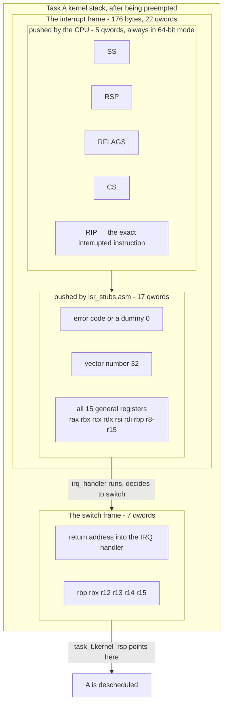

**The CPU's five qwords.** In 64-bit mode the CPU pushes `SS`, `RSP`, `RFLAGS`, `CS`
and `RIP` on *every* interrupt — unlike 32-bit protected mode, where `SS`/`ESP` were
pushed only on a privilege change. This uniformity is a genuine simplification: one
frame layout for every case.

**The stub's seventeen.** Vectors 8, 10–14 and 17 push a hardware error code; the rest
do not. The stub pushes a dummy zero for the ones that do not, so every vector produces
an identical `registers_t`. Then the vector number, then all fifteen general registers.

**Twenty-two qwords is 176 bytes.** That number should look familiar: it is exactly the
figure [[Stage 0.1 - Prove Your Toolchain Works]] uses to justify `-mno-red-zone`. The
red zone is 128 bytes of scratch space below `rsp` that a leaf function may use without
adjusting `rsp`. An interrupt lands there and writes 176 bytes over the top. The
interrupted function does not lose part of its scratch space; it loses all of it and
48 bytes of whatever was below. One translation unit compiled without the flag is
enough to produce corruption that appears weeks later, on unrelated data.

**The switch frame on top.** When `irq_handler` decides to preempt, it calls
`schedule()`, which calls `switch_context`, which pushes six more registers onto the
same stack. So a preempted task's saved `rsp` points at a switch frame that sits on top
of a complete interrupt frame. Resuming it unwinds in reverse: `switch_context` returns
into the interrupt handler's tail, the stub pops `registers_t`, and `iretq` restores
`RIP`, `CS`, `RFLAGS`, `RSP` and `SS` atomically — landing back on the exact instruction
that was interrupted, with `RFLAGS` restored so the task's interrupt-enable state is
what it was.

The composition is the elegant part. Two independently designed mechanisms — the
interrupt frame from [[Phase 2 - Overview|Phase 2]] and the switch frame from
[[Phase 5 - Overview|Phase 5]] — stack on top of each other and unwind cleanly, because
each is a strict LIFO discipline on the same stack.

> [!warning] Send the EOI *before* the switch
> The End Of Interrupt tells the PIC that IRQ 0 has been handled and further timer
> interrupts may be delivered. If the handler switches away before sending it, the code
> that would have sent it does not run again until this task is next scheduled — which
> requires a timer interrupt, which the PIC will not deliver. The system freezes after
> exactly one tick. This is a five-minute bug to fix and a two-hour bug to find.

#### Where preemption is actually taken

The tick does not switch. It sets a flag. The switch is taken at a **preemption point**,
and which points those are is the entire meaning of "non-preemptible kernel" in
[[06 - Architecture Overview]].

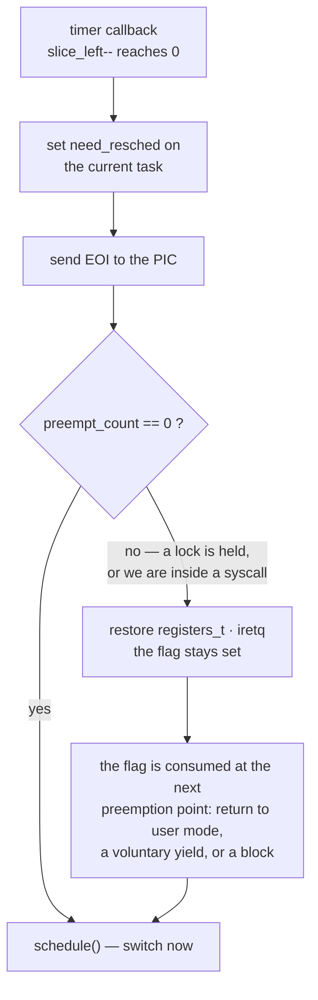

`preempt_count` is non-zero whenever the current context must not be switched away
from: while any spinlock is held, while inside the scheduler itself, and — from
[[Phase 6 - Overview|Phase 6]] — for the whole duration of a syscall. That last one is
the v1 policy: *a task in kernel mode on behalf of a user process runs until it blocks
or returns to user mode.* Kernel tasks, which have no user half, are preempted at the
interrupt-return boundary itself, which is what makes the
[[Stage 5.3 - Preemptive Scheduling]] deliverable work: two kernel tasks that never
call `yield` still interleave.

> [!warning] "Non-preemptible" does not mean "no concurrency"
> It is easy to read the one-line rule in [[06 - Architecture Overview]] as "nothing can
> interrupt me, so I need no locks". False in two directions. First, interrupt handlers
> run regardless — any data shared with a handler needs an IRQ-save spinlock even on a
> single core with no preemption at all. Second, kernel tasks *are* preempted between
> arbitrary instructions. What the policy actually buys is narrower and still valuable:
> a syscall never yields the CPU in the middle of updating a kernel structure unless it
> chose to.

> [!note] Names in this section
> `need_resched`, `preempt_count` and `slice_left` are this atlas's names for the
> mechanism. The shape is normative — a flag set by the tick, a counter that gates the
> switch, a preemption point on the exit path — but the identifiers are not yet fixed
> in a stage note. Verify against `kernel/sched/sched.cpp` once it exists.

### 3.5 The run queue

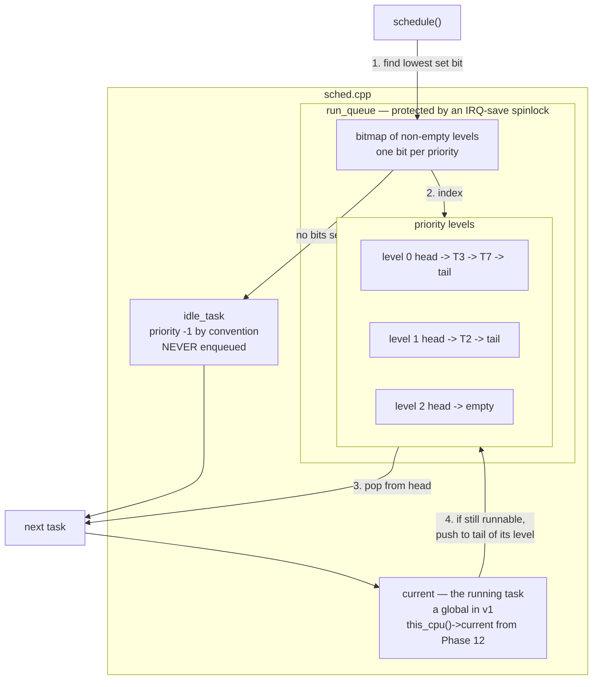

**`current`** must always be valid. There is never a moment when no task is running,
which is why [[Stage 5.1 - Tasks, Context, and the Stack]] insists that the kernel's own
boot execution is registered as task 0 before any switch is attempted: the first switch
needs somewhere to *save* the outgoing context, and if `current` is null there is
nowhere.

**The bitmap and the levels.** One FIFO list per priority, plus one machine word with a
bit set for each non-empty level. Selection is "find the lowest set bit" — a single
`bsf`/`tzcnt` instruction — then pop that list's head. O(1) regardless of how many tasks
exist. v1 has one level and is plain round-robin; the structure is drawn with three
because adding priorities later must not be a rewrite.

**Round-robin fairness comes from the tail push.** A preempted task goes to the *back*
of its level. If it went to the front it would be immediately reselected and nothing
would ever change.

**Strict priority starves.** If level 0 is never empty, level 2 never runs. Real systems
fix this with aging (a task waiting too long is promoted) or with a multi-level feedback
queue that lowers the priority of CPU-bound tasks and raises the priority of tasks that
block often — the OSTEP scheduling chapters that [[Phase 5 - Overview]] sets as reading.
v1 does neither and does not need to: with one level, starvation is impossible.

#### Choosing the quantum

| Quantum | Switches per second at 100 Hz | Effect |
|---|---|---|
| 1 tick — 10 ms | 100 | Overhead becomes visible; cache and TLB never warm up |
| 5 ticks — 50 ms | 20 | The v1 default. Interactive enough, cheap |
| 20 ticks — 200 ms | 5 | A key press can wait a fifth of a second. Feels broken |

The direct cost of a switch is small — a dozen register moves. The real cost is
indirect: the new task's working set is not in the L1 cache, its page translations are
not in the TLB, and the branch predictor is trained on the wrong code. That cost is
paid *after* the switch and is invisible in a profile of the switch itself.

### 3.6 The idle task, and why it must exist

The naive version of `schedule()` has a branch: "if the run queue is empty, return
without switching". That branch is a mistake, and it is worth being precise about why.

- **It breaks the invariant that `current` is always a valid task.** Every other piece
  of code — the tick handler decrementing a slice, the logger stamping a task id, the
  panic handler printing who died — dereferences `current`. Making it nullable adds a
  null check to all of them, and one of those checks will be missing.
- **It breaks the switch's contract.** `switch_context` needs an outgoing task to save
  into. "No task" has no `kernel_rsp` field.
- **It makes "nothing to do" a special case.** With an idle task, the run queue being
  empty is not exceptional; it is Tuesday. Special cases in the scheduler are where
  kernels go to die.
- **The CPU must actually be told to stop.** A busy loop burns a core, heats the
  machine, and in QEMU pins a host CPU at 100%. `hlt` parks the core until the next
  interrupt.

The rules for the idle task follow from what it is:

1. **It is never on the run queue.** It is selected only when nothing else can be. If it
   were enqueued it would take a fair share of the CPU from real work.
2. **It must never block or sleep.** Nothing would ever wake it, and then the scheduler
   would have nothing at all to pick.
3. **Its loop is `sti; hlt`.** `hlt` with interrupts *disabled* parks the core until an
   NMI, which in QEMU means forever — the same trap [[Stage 0.7 - Panic and KASSERT]]
   documents for `boot_halt()`, where halting forever is the *desired* behaviour. Here it
   is not. The two-instruction sequence is also atomic in a way that matters: `sti` has a
   one-instruction interrupt shadow, so an interrupt cannot be delivered between the
   `sti` and the `hlt` and leave the core asleep with work pending.
4. **It still needs a stack.** Interrupts arrive while it is halted and land on it.
5. **It must exist before the first tick that can preempt.** That is why the kernel
   initialisation order in [[06 - Architecture Overview]] lists "scheduler + idle task"
   as one step, not two.
6. **One per core, from [[Phase 12 - Overview|Phase 12]].** Cores idle independently.

The `hlt` instruction is inline assembly, which [[07 - Repository Layout]]'s boundary
rule 1 confines to `kernel/arch/`. So the idle loop's body is an arch function that the
portable scheduler calls — the same split [[Stage 0.3 - Freestanding C++ and kmain]]
made when `kernel_init` returned rather than halting in portable code.

### 3.7 Sleeping, blocking, and wait queues

A task that waits must stop consuming the CPU. That is the whole of
[[Stage 5.4 - Sleep and Blocking]], and it is one structural idea: **move the task out
of the run queue and into the thing it is waiting on.**

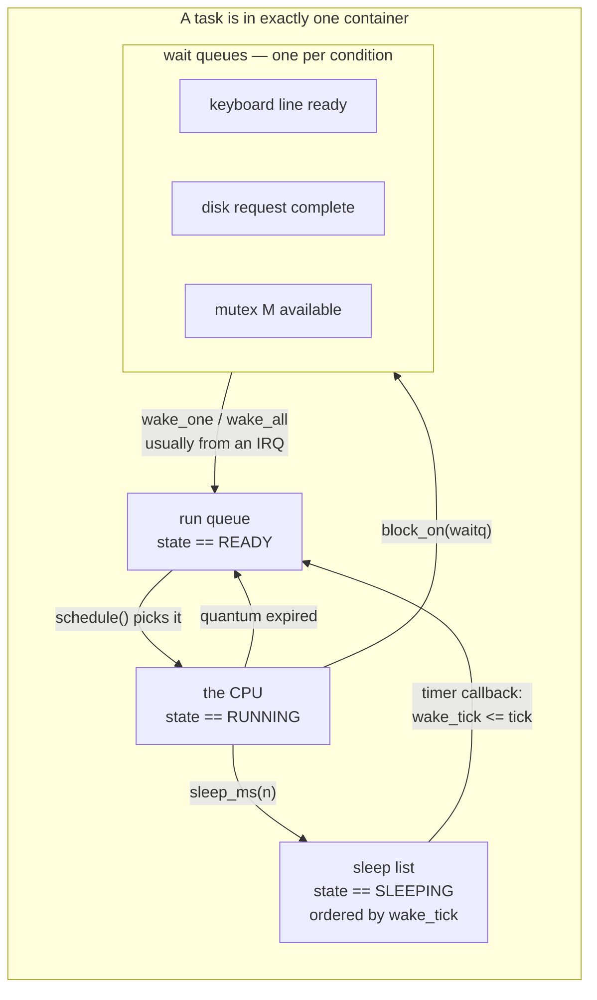

**Why a blocked task must not stay on the run queue.** Three reasons, escalating:

1. **It would be selected.** The scheduler picks from the run queue. A blocked task on
   it gets the CPU, immediately re-checks its condition, finds it still false, and blocks
   again. That is a busy-wait with the cost of two context switches per iteration —
   strictly worse than the busy-wait it was meant to replace.
2. **The fix is worse than the bug.** "Skip tasks whose state is not READY" turns
   selection from popping a head into scanning a list, which is O(n) in the number of
   blocked tasks, executed inside an IRQ-save critical section with interrupts off, on
   every switch. Interrupt latency now depends on how many tasks are asleep.
3. **The invariant is what makes waking correct.** If **on the run queue ⇔ state ==
   READY** holds, then `wake()` is "set READY, enqueue" and `block()` is "set BLOCKED,
   dequeue", and both are trivially checkable. Without it, waking a task that is already
   enqueued links an intrusive list node to itself and the run queue becomes a cycle.
   The scheduler then hands the same task the CPU forever, or spins inside the queue,
   with no error message.

The state field and the queue membership are two representations of one fact. They must
change together, under the same lock, and `KASSERT` should check the pair on every
enqueue and dequeue in debug builds.

**Sleep is blocking with the timer as the waker.** `wake_tick` is a 64-bit tick count.
At 100 Hz a 64-bit counter wraps after roughly 5.8 billion years, so the comparison
`wake_tick <= tick` needs no wraparound handling. A 32-bit counter wraps in 497 days,
which is exactly long enough to ship and exactly short enough to matter.

**Wait queues generalise it.** A wait queue is a list head attached to a condition. Any
number of tasks can be parked on it. The code that makes the condition true walks the
list and moves tasks to the run queue. This is the mechanism behind every blocking
operation added later: `readline` blocking until the keyboard IRQ sees Enter
([[Stage 3.3 - An Input Line Buffer]] rewritten by 5.4), `read()` blocking on a disk
completion in [[Phase 9 - Overview|Phase 9]], `accept()` blocking on a connection in
[[Phase 14 - Overview|Phase 14]], and the sleeping half of a mutex.

### 3.8 The concurrency rules

From [[06 - Architecture Overview]], unchanged, because this is the table the rest of
the kernel is written against:

| Context | May sleep? | May take a mutex? | May take a spinlock? |
|---|---|---|---|
| Process context (syscall) | yes | yes | yes |
| Interrupt handler | **no** | **no** | yes — must be IRQ-save |
| Scheduler internals | no | no | yes |

**Why an interrupt handler may not sleep** is the question worth answering properly,
because the rule looks arbitrary until you see the mechanism.

An interrupt handler has no task of its own. It runs on the stack, and with the
identity, of whatever task happened to be running when the interrupt arrived. If it
called `block_on()`:

- The scheduler would mark *that* task BLOCKED — an innocent task with no relationship
  to the condition being waited on.
- The switch would leave a half-finished interrupt frame on that task's stack, with no
  code path that will ever `iretq` from it.
- The EOI would not have been sent, so that interrupt line is dead.
- When the condition is eventually satisfied and the task is woken, it resumes in the
  middle of an interrupt handler for an event that is now ancient history.

A mutex may sleep when it is contended. So "may not take a mutex" is not a separate
rule; it is the same rule wearing different clothing.

**Why the scheduler may not sleep**: blocking calls `schedule()`, and `schedule()` is
what is running. It would re-enter itself with its own lock held.

The decision procedure, as a flowchart, because this is the question every new kernel
function has to answer:

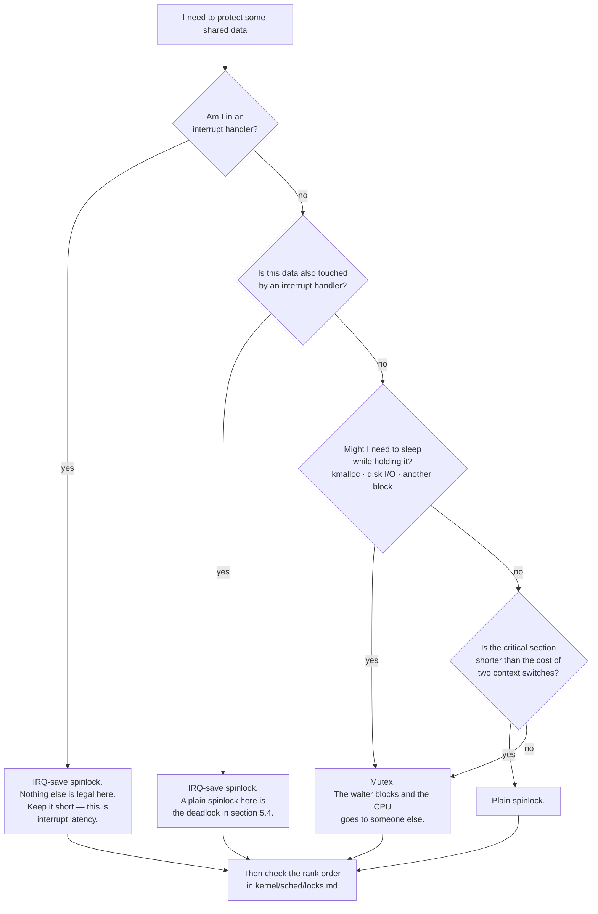

**Start** — you have data reachable from more than one context. **Q1** is first because
it is absolute: inside an interrupt handler, a spinlock is the only primitive available,
and it must be IRQ-save even though interrupts are already disabled on entry through an
interrupt gate — because the same lock is taken from process context, where they are
not.

**Q2** is the question that catches people. The data may be touched from process context
99% of the time; if an interrupt handler touches it *at all*, every acquisition of that
lock, everywhere, must disable local interrupts. A lock is IRQ-save or it is not; it
cannot be IRQ-save on Tuesdays.

**Q3** distinguishes the two primitives by their failure mode, not their speed. A
spinlock spins: the CPU is occupied doing nothing until the lock is free. That is cheap
if the wait is nanoseconds and catastrophic if it is a disk seek. A mutex blocks: the
waiter leaves the run queue and something else runs, at the cost of two context switches.
The rule that falls out — **never sleep while holding a spinlock**
([[13 - Coding Standards]] rule 4) — includes `kmalloc`, because the heap may need to
grow, and growing may block.

**Q4** is the tuning question. Two context switches cost far more than a few hundred
nanoseconds of spinning, so short sections favour spinlocks even when sleeping would be
legal.

**Every path ends at the rank check**, because choosing the right *kind* of lock does
not save you from taking the right locks in the wrong *order*. That is §6.

---

## 4. The data structures

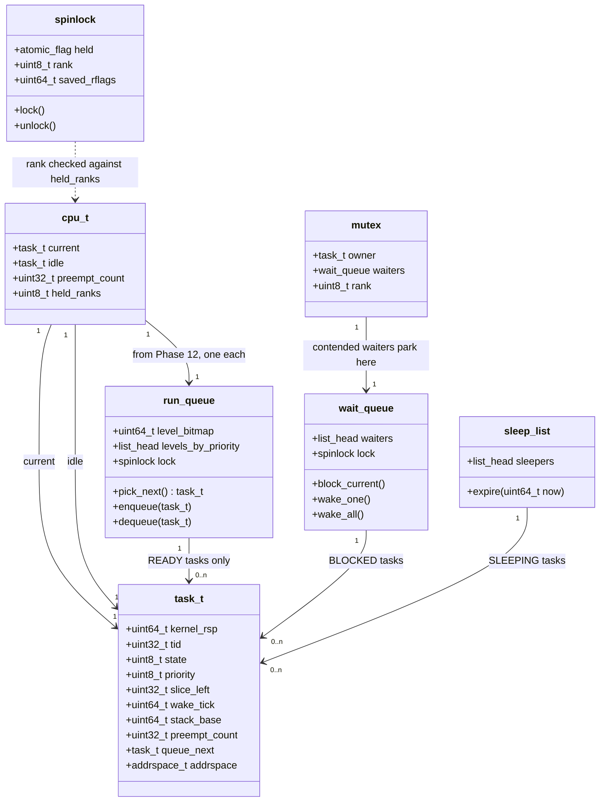

`queue_next` and `addrspace` are pointers; Mermaid's class syntax is happier without
the asterisks.

### task_t, field by field

| Field | Size | Meaning | Introduced |
|---|---|---|---|
| `kernel_rsp` | 8 | Saved stack pointer. **The context.** Valid only while not RUNNING | [[Stage 5.1 - Tasks, Context, and the Stack\|5.1]] |
| `tid` | 4 | Task id, for logs and `ps` | 5.1 |
| `state` | 1 | NEW / READY / RUNNING / BLOCKED / SLEEPING / ZOMBIE | 5.1, extended 5.4 |
| `priority` | 1 | Which run-queue level. One level in v1 | 5.3 |
| `slice_left` | 4 | Ticks remaining in this quantum. Hits zero → `need_resched` | 5.3 |
| `wake_tick` | 8 | Absolute tick to wake at. 64-bit so it never wraps | 5.4 |
| `stack_base` | 8 | Base of the 16 KiB allocation, so the stack can be freed | 5.1 |
| `preempt_count` | 4 | Non-zero → do not switch away from this task | 5.3 |
| `queue_next` | 8 | Intrusive list link. Enqueue and dequeue never allocate | 5.1 |
| `addrspace` | 8 | Page tables. Null (= kernel address space) until Phase 6 | Phase 6 |

Roughly 56 bytes plus alignment, against 16 KiB of stack. **The task is the stack; the
struct is a label on it.** Every field above except `kernel_rsp` exists for the
scheduler's convenience, not for the CPU's.

### The saved-context inventory

Where each piece of a task's CPU state actually lives while it is descheduled:

| State | Where it is saved | Who saves it |
|---|---|---|
| `rsp` | `task_t.kernel_rsp` | `switch.asm` |
| `rip` | On the task's stack, as a return address | `call` / the CPU |
| `rbx`, `rbp`, `r12`–`r15` | On the task's stack, switch frame | `switch.asm` |
| Caller-saved registers | Nowhere — the ABI permits their loss | the compiler, at the call site |
| Full 15 GPRs + `RFLAGS` + `CS`/`SS` | On the task's stack, interrupt frame | `isr_stubs.asm` + the CPU — only if preempted |
| `CR3` | `task_t.addrspace` | the switch, from Phase 6 |
| Kernel stack top for the next trap | `TSS.rsp0`, rewritten on each switch | the switch, from Phase 6 |
| x87/SSE | Not saved — the kernel has none | — |

Two different *sizes* of saved state, depending on how the task lost the CPU. Both
unwind through the same `switch_context`; only the code it returns into differs.

---

## 5. The flows

### 5.1 A cooperative switch

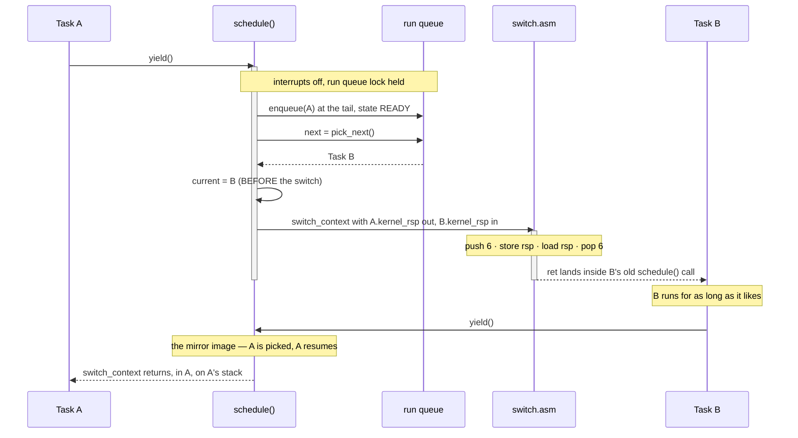

`yield()` is a normal function call, so A's caller-saved registers are already
expendable. `schedule()` disables interrupts and takes the run-queue lock — even in
Phase 5 on one core, because the timer callback touches the same queue.

The ordering of `current = B` is a real trap. It must happen **before** the switch. The
assignment after `switch_context` returns would execute in the *incoming* task's
context, using the incoming task's stale local variable `next`. Set it before, and every
task that resumes finds `current` pointing at itself.

`switch_context` returns *into a different task*. That sentence is the whole mechanism.
The `ret` at the end of the assembly pops B's return address, so the function that was
called by A returns to B. When B later yields, the same thing happens in reverse and A's
`switch_context` call finally returns — possibly milliseconds later, possibly with the
run queue and half the kernel changed underneath it. Code after a call to `schedule()`
must assume the world moved.

### 5.2 The timer forces a switch

```mermaid
sequenceDiagram
    participant PIT as PIT hardware
    participant CPU as CPU core
    participant STUB as isr_stubs.asm
    participant IRQ as irq_handler
    participant TMR as timer callback
    participant SCH as schedule()
    participant SW as switch.asm

    PIT->>CPU: IRQ 0 asserted
    Note over CPU: interrupt gate clears IF automatically
    CPU->>CPU: push SS RSP RFLAGS CS RIP onto Task A's stack
    CPU->>STUB: vector 32
    activate STUB
    STUB->>STUB: push dummy error code, vector, 15 GPRs
    STUB->>IRQ: irq_handler(registers_t*)
    activate IRQ
    IRQ->>TMR: registered IRQ 0 callback
    activate TMR
    TMR->>TMR: tick++
    TMR->>TMR: wake sleepers with wake_tick <= tick
    TMR->>TMR: if --slice_left == 0 set need_resched
    deactivate TMR
    IRQ->>IRQ: pic_send_eoi()  — BEFORE any switch
    alt need_resched and preempt_count == 0
        IRQ->>SCH: schedule()
        activate SCH
        SCH->>SW: switch_context, A out, B in
        Note over SW: A is now descheduled mid-instruction-stream
        SW-->>SCH: much later, returns as A again
        deactivate SCH
    else not preemptible
        Note over IRQ: leave the flag set; take it at the next<br/>preemption point
    end
    IRQ-->>STUB: return
    deactivate IRQ
    STUB->>CPU: pop 15 GPRs, discard error code and vector
    deactivate STUB
    CPU->>CPU: iretq restores RIP CS RFLAGS RSP SS
    Note over CPU: Task A resumes on the exact instruction<br/>it was interrupted on
```

Read the interleaving carefully. Between "A is now descheduled" and "much later,
returns as A again", an unbounded amount of time passes and other tasks run. The stack
frames belonging to `irq_handler` and the stub are still sitting on A's stack the whole
time, untouched, waiting.

Three ordering constraints are visible and all three are bugs if broken:

1. **`IF` is cleared by the interrupt gate**, not by the handler. This is why an IDT
   entry's type matters: an interrupt gate clears the interrupt flag on entry, a trap
   gate does not. With a trap gate, a second timer tick can arrive while the first is
   still being handled, nesting the handler on the same stack — and eventually
   overflowing it.
2. **EOI before the switch**, as established in §3.4.
3. **`iretq`, not `ret`.** Only `iretq` restores `RFLAGS` (and therefore the interrupt
   flag), `CS` and `SS` atomically with `RIP`. From Phase 6 it is also the instruction
   that drops privilege back to ring 3.

### 5.3 Sleeping, waking, and the lost wakeup

```mermaid
sequenceDiagram
    participant T as Task A
    participant WQ as keyboard wait queue
    participant SCH as schedule()
    participant KBD as keyboard IRQ handler

    Note over T: THE BUG — check and block are not atomic
    T->>T: if (line_ready) ... false
    KBD-->>WQ: Enter pressed. wake_all() — the queue is EMPTY
    Note over KBD,WQ: the wakeup is delivered to nobody
    T->>WQ: block_on(kbd_waitq)
    T->>SCH: schedule()
    Note over T: blocked forever. The line is ready and<br/>nobody will ever say so again.

    Note over T,KBD: THE FIX — one critical section
    T->>WQ: IrqLockGuard g(kbd_waitq.lock)
    activate WQ
    T->>T: if (line_ready) break out and return
    T->>WQ: enqueue self, state = BLOCKED
    T->>SCH: schedule() — releases the guard after<br/>the switch decision is made
    deactivate WQ
    KBD->>WQ: IrqLockGuard g(kbd_waitq.lock)
    KBD->>WQ: line_ready = true; wake_all()
    WQ-->>SCH: Task A -> READY, enqueued on the run queue
    SCH-->>T: eventually rescheduled; re-checks the condition
```

The **lost wakeup** is the canonical concurrency bug in a kernel and it is a
three-instruction window. Task A tests its condition, finds it false, and is interrupted
before it can park itself. The interrupt makes the condition true and wakes everyone on
the wait queue — which, at that instant, does not include A. A then parks on a queue
nobody will ever wake. The symptom is a task that hangs occasionally, under load, and
never in the debugger.

The fix has one requirement: **the condition test and the enqueue must be atomic with
respect to the waker.** Hold the wait queue's IRQ-save lock across both. The subtlety is
that the lock cannot simply be released before calling `schedule()` — that reopens the
window — so `schedule()` releases it after the switch decision is committed. Getting this
handoff right is what makes wait queues harder than they look.

Note the last line: A **re-checks the condition** after waking. Never assume that being
woken means the condition is true. Another task may have consumed the data first. Every
blocking wait is a loop, not an `if`.

> [!example] The same bug in the timer path
> `sleep_ms(0)` computes `wake_tick = tick`, and the timer's wake scan may run between
> the computation and the enqueue. The task parks on the sleep list with a wake tick
> already in the past, and stays there until the tick catches up again — which, with a
> 64-bit counter, is never. Fix it the same way: compute, enqueue, and mark blocked with
> the sleep list's lock held.

### 5.4 The IRQ-save deadlock

This is the deadlock every kernel writes once. It needs no second CPU, no SMP, and no
unusual timing — just one lock taken from two contexts.

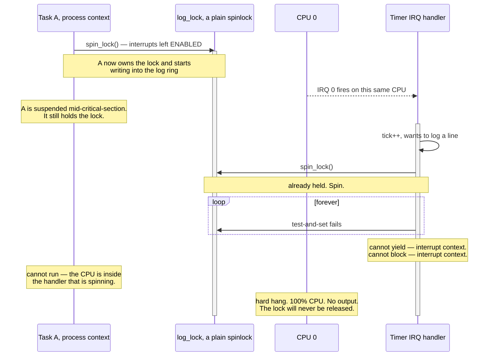

Walk the participants. **Task A** takes a plain spinlock. On a single core with no other
task running, this looks completely safe — and it is, with respect to other *tasks*.
**The timer IRQ** arrives. Interrupts are enabled, because A never disabled them, so the
CPU suspends A exactly where it is and enters the handler. **The handler** wants the same
lock. The lock is held. So it spins, which is the only thing a spinlock can do.

Now the fatal part: **the holder cannot make progress, because the CPU that would run it
is the CPU that is spinning.** There is one core, and it is inside an interrupt handler
that will not return until a lock is released by code that cannot execute until the
handler returns. This is not a livelock or a slow path. It is a permanent hang, and it
happens the first time a timer tick lands inside that critical section — which, at 100 Hz
with a section that runs often, is within seconds.

The fix is one bit of CPU state:

```cpp
{
    IrqLockGuard guard(log_lock);   // cli, remembering the previous IF state
    // ... bounded work, no allocation, no I/O ...
}                                    // release, then RESTORE the saved IF
```

The guard saves `RFLAGS`, executes `cli`, acquires the lock, and on scope exit releases
the lock and restores the saved `RFLAGS`. The interrupt cannot be delivered on this CPU
while the lock is held, so the handler cannot interrupt the holder, so the cycle cannot
form. [[06 - Architecture Overview]] calls this guard `irq_lock_guard`;
[[13 - Coding Standards]] spells it `IrqLockGuard`. Same object.

> [!warning] Restore the flag, never unconditionally `sti`
> The second version of this bug: `unlock()` ends with `sti` instead of restoring the
> saved flags. Now a nested critical section — an outer one that had already disabled
> interrupts — has interrupts re-enabled by the *inner* one's release, and the outer
> section is exposed for the rest of its lifetime. The bug is invisible at the call site
> that caused it. Save and restore, always; this is why the guard is RAII and why manual
> `lock()`/`unlock()` pairs are banned.

> [!question] Does this deadlock go away on a four-core machine?
> Think it through: what does the handler on CPU 0 spin on, what is the holder doing, and
> which CPU is it doing it on? Then decide whether the answer changes the rule.

---

## 6. Why it is shaped this way

### The decisions

| # | Decision | Alternative | Cost of the alternative | Verdict |
|---|---|---|---|---|
| 1 | Software context switch in assembly | x86 hardware task switching (TSS task gates) | **Does not exist in long mode.** 64-bit mode removed it; the TSS survives only to hold `rsp0` and the IST | Forced |
| 2 | Save only callee-saved registers on a voluntary switch | Save all sixteen | 10 pointless pushes and pops on every switch; the ABI already permits their loss | Chosen |
| 3 | Cooperative first, preemptive second | Go straight to timer-driven | Every bug is now a timing bug. The switch mechanism and the interrupt frame are debugged simultaneously | Chosen ([[Stage 5.2 - Cooperative Task Switching\|5.2]] then [[Stage 5.3 - Preemptive Scheduling\|5.3]]) |
| 4 | Non-preemptible kernel in v1 | Fully preemptible kernel | Every kernel data structure becomes concurrent immediately; this is what xv6 avoids and what Linux took a decade to get right | Chosen ([[05 - Gap Analysis (v1 to Product)\|Gap Analysis]], Tier 4) |
| 5 | An idle task, not a null `current` | Special-case "nothing to run" in `schedule()` | A null check in every consumer of `current`, and one of them will be missing | Chosen |
| 6 | Blocked tasks leave the run queue | Leave them and skip non-READY entries | O(n) selection inside an interrupts-off critical section; interrupt latency scales with the number of sleepers | Chosen |
| 7 | Locking discipline introduced in Phase 5 | Add locks in Phase 12 with SMP | A kernel-wide retrofit instead of an extension. This is gap **S7** and it is why "Stage 5.0" exists | Chosen |
| 8 | Ranked locks with `KASSERT` in debug builds | Rely on review and on locks documented in prose | Deadlocks are interleaving-dependent; without a rank check they are found by customers | Chosen |
| 9 | One global run queue in v1 | Per-CPU run queues from the start | Unnecessary complexity with one core, and Phase 12 has to touch this code anyway | Deferred to [[Phase 12 - Overview\|Phase 12]] |
| 10 | Round-robin, one priority level | Priorities or MLFQ now | Starvation and interactivity tuning before there is any workload to tune against | Deferred |

**Decision 1 deserves emphasis** because it is the opposite of a preference. 32-bit x86
could switch tasks in hardware: load a task-gate selector and the CPU saved every
register into one TSS and restored them from another. AMD removed it from long mode.
Every 64-bit OS switches in software, and the TSS in [[Stage 2.2 - The TSS and Interrupt Stacks]]
exists solely to supply `rsp0` and seven IST stacks. So `switch.asm` is not a hobbyist
shortcut; it is what Linux, Windows and every other x86_64 kernel does.

### Lock ordering and ranks

Choosing the right kind of lock prevents one class of bug. Taking locks in a consistent
*order* prevents the other. If task A takes lock X then wants Y, while task B holds Y and
wants X, both wait forever. Neither did anything locally wrong.

The global fix is a total order. Every lock gets a **rank**, and locks must be acquired
in increasing rank order: **holding a higher rank while taking a lower one is a bug**.
The canonical list lives in `kernel/sched/locks.md` ([[07 - Repository Layout]]) and this
is the atlas's starting shape for it:

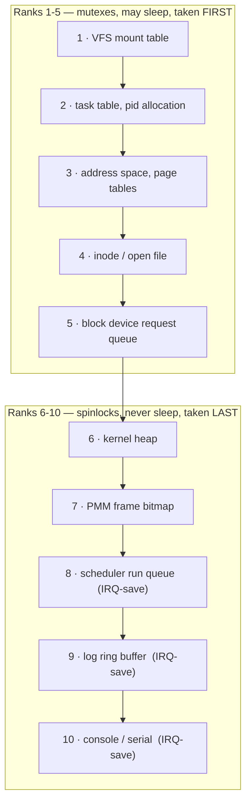

The arrows are "may be taken while holding". The graph is a straight line, which is the
strongest possible form of a DAG and the easiest to check: a single integer comparison.

Three properties fall out of this particular ordering, and they are the reason to choose
it rather than any other:

1. **All mutexes rank below all spinlocks.** Therefore "never sleep while holding a
   spinlock" is not an extra rule to remember — it is a *consequence* of the rank order.
   You cannot take a mutex (rank ≤ 5) while holding a spinlock (rank ≥ 6) without
   violating the ordering, and the assertion fires.
2. **The log and console are ranked highest**, i.e. innermost. Deliberately: logging must
   be legal from anywhere, including from inside the scheduler and from a panic path that
   holds the run-queue lock. The price is that the log path itself must take no other
   lock and must never allocate — exactly the constraint
   [[Stage 1.5 - The Log Ring Buffer and Levels]] already imposed when it argued that its
   critical section is bounded and copies at most 252 bytes.
3. **The run queue ranks above the heap.** So you may block or wake a task while holding
   the heap lock, but you may never call `kmalloc` while holding the run-queue lock. That
   is the right way round: the scheduler must be allocation-free.

**Why `KASSERT` rather than review.** A deadlock requires a specific interleaving. Code
that takes X-then-Y where the convention is Y-then-X may run correctly for months and
deadlock the first time a customer's workload produces the interleaving. The rank check
does not need the interleaving: it fires the first time the *order* is wrong, on the
developer's machine, deterministically, with a panic that names both locks. It converts a
probabilistic production failure into a deterministic test failure — which is the same
argument the whole of [[09 - Testing Strategy]] rests on.

The implementation is a per-CPU stack of held ranks, a comparison on acquire, and a pop
on release: a handful of instructions, compiled out of release builds. Cheap enough that
there is no reason to argue about it.

---

## 7. How this grows across the phases

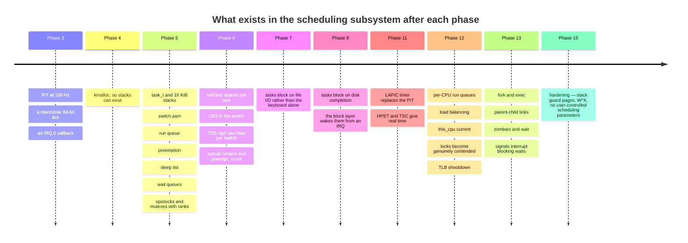

Reading it as a dependency chain: [[Phase 3 - Overview|Phase 3]] provides the heartbeat,
[[Phase 4 - Overview|Phase 4]] provides the memory, and Phase 5 turns them into tasks.
Everything after Phase 5 either adds a new reason to block (files, disks, sockets,
signals) or adds a new CPU to schedule onto.

**What is deliberately missing in v1, and why that is acceptable:**

- **Priorities.** With one shell and a couple of kernel tasks there is no scheduling
  decision worth making. The run queue's shape leaves room; the policy does not exist yet.
- **Load balancing.** There is one core.
- **A tickless idle.** A 100 Hz timer wakes an idle machine 100 times a second, which
  matters for battery life on real hardware and not at all in QEMU. Deferred with the
  LAPIC timer work in [[Phase 11 - Overview|Phase 11]].
- **FPU/SSE context.** The kernel uses no floating point at all
  ([[ADR-0007 - Freestanding C++20 as the Kernel Language]]), so there is no FPU state to
  save between kernel tasks. The moment user programs may use SSE, the switch must save
  512 bytes of `FXSAVE` state or prove it never needs to — a conversation
  [[Stage 1.2 - Rasterising a Bitmap Font]] already flagged and pushed to Phases 12/13.
- **Priority inheritance.** A low-priority task holding a mutex a high-priority task
  wants is only a problem once priorities exist.

> [!warning] The documentation gap around "Stage 5.0"
> [[05 - Gap Analysis (v1 to Product)]] and [[15 - Roadmap and Milestones]] both state
> that Stage 5.0 introduces atomics, spinlocks, IRQ-save discipline and RAII guards
> *before* the first preemptive switch, and [[Phase 12 - Overview]] tells the reader to
> stop and do it if they skipped it. [[Phase 5 - Overview]] still lists only stages
> 5.1–5.4. The locking primitives in §3.8 and §6 belong to that missing stage. Until the
> note exists, treat §3.8 and §6 of this document as its specification.

### Testing this subsystem

Mapped onto the three tiers from [[09 - Testing Strategy]] and
[[ADR-0010 - Testing Strategy and the QEMU Exit Device]]:

| Tier | What is tested | Why it belongs there |
|---|---|---|
| 1 — host unit | `pick_next()` against a synthetic run queue; the rank checker rejecting an out-of-order acquire; wake-tick expiry arithmetic | Pure logic with no hardware. Milliseconds per run |
| 2 — in-kernel under QEMU | Two tasks interleave without calling `yield`; a task sleeping 1000 ms wakes within tolerance while others run; a blocked task consumes no CPU; a deliberate lost-wakeup stress loop | Needs a real timer, real interrupts and a real stack |
| 3 — integration | Boot, run the workload, confirm the tick advances and the shell stays responsive under load | End-to-end behaviour |

The scheduler's pure logic being host-testable is not an accident — it is why
[[07 - Repository Layout]] keeps `sched/` architecture-neutral and confines `switch.asm`
to `arch/x86_64/asm/`.

---

## 8. Failure modes

Symptom first, because that is what you actually have at 2am.

| Symptom | Cause | Where to look |
|---|---|---|
| First switch into a new task jumps to a nonsense address | Stack pre-fill order does not match the pop order | §3.3; [[Stage 5.1 - Tasks, Context, and the Stack]] |
| Both tasks run, but local variables are corrupted after a switch | Saving `rsp` into the wrong task's struct, or a push/pop count mismatch | `switch.asm` |
| Output stops after exactly one timer tick | Missing EOI, or EOI sent after the switch | §3.4 |
| Machine hangs, host CPU pinned at 100%, no output | IRQ-save deadlock, or a busy idle loop | §5.4; §3.6 |
| Machine hangs, host CPU at 0% | `hlt` executed with interrupts disabled | §3.6 rule 3 |
| A task never runs again, occasionally, under load | Lost wakeup — condition test and enqueue not atomic | §5.3 |
| A task runs forever and no other task ever gets the CPU | Preempted task re-enqueued at the head instead of the tail; or `need_resched` never checked | §3.5 |
| The scheduler picks a blocked task | State and queue membership updated separately | §3.7 |
| Run queue traversal never terminates | A task enqueued twice — an intrusive node linked to itself | §3.7 reason 3 |
| Panic naming two locks in a debug build | Rank violation. **This is the system working** | §6 |
| Random corruption with no pattern, weeks after the change | A translation unit compiled without `-mno-red-zone` | §3.4; [[14 - Debugging Playbook]] |
| Corruption in task B when the bug is in task A | Stack overflow across the `kmalloc` boundary — no guard page | §3.1 |
| Works with `-smp 1`, breaks with `-smp 4` | A lock not taken, taken without IRQ-save, or taken out of rank order | [[Phase 12 - Overview]] |
| A sleep of *n* ms takes very roughly *n* ms and drifts | The PIT is coarse and the tick divisor does not divide evenly | [[Stage 3.1 - The Programmable Interval Timer]] |

Three of these deserve expanding.

**"Output stops after exactly one tick."** The word *exactly* is the diagnostic. A
crash produces garbage or a fault; a missing EOI produces one perfect tick and then
silence, because the PIC is still waiting to be told the first one was handled. If
preemption also stops working at the same moment, the two symptoms have one cause.

**"A task never runs again, occasionally."** Occasionally is the signature of a race.
Ask which two contexts touch the structure, and whether the test and the state change
happen under one lock. If the answer involves the phrase "it's fine, this only takes a
few instructions", you have found it. See §5.3.

**"Panic naming two locks."** A rank assertion firing is a *good* outcome and should be
read as the tooling doing its job, not as an obstacle. The fix is never to relax the
assertion; it is either to reorder the acquisitions or to re-rank the locks in
`kernel/sched/locks.md` and re-derive whether the new order is still acyclic.

---

## 9. Masterclass notes

> [!question] Discussion prompts
> 1. `switch_context` saves six registers. A full interrupt frame saves twenty-two
>    values. Both correctly preserve a task. Explain the difference in terms of who was
>    asked and who was not — and then explain why a task preempted by the timer ends up
>    carrying *both* frames on its stack simultaneously.
> 2. Suppose you delete the idle task and instead make `schedule()` return without
>    switching when the run queue is empty. Name three separate things that break, in
>    increasing order of how long they take to discover.
> 3. Take the IRQ-save deadlock in §5.4 to a four-core machine. Does the deadlock still
>    occur? Does IRQ-save still fix it? Does IRQ-save *alone* still suffice?
> 4. The lock ranks in §6 put the log ring buffer near the top of the order rather than
>    the bottom. Argue for the opposite choice, then say what it would cost the panic
>    handler.
> 5. [[06 - Architecture Overview]] says the kernel is non-preemptible in v1, and
>    [[Stage 5.3 - Preemptive Scheduling]] preempts kernel tasks with the timer. Both
>    are true. Reconcile them precisely, using the word "preemption point".

**You understand this when you can:**

- [ ] Draw a task's kernel stack from memory at three moments: freshly created, yielded,
      and preempted — and say what `task_t.kernel_rsp` points at in each.
- [ ] Write `switch_context` from memory, in order, and justify the register list from
      the calling convention rather than from having memorised it.
- [ ] Explain why the routine cannot be written in C++ without using the word "fast".
- [ ] State the run-queue invariant in one sentence and give three consequences of
      breaking it.
- [ ] Explain why an interrupt handler may not sleep, in terms of whose stack it is on.
- [ ] Draw the IRQ-save deadlock as a cycle and point at the edge that IRQ-save removes.
- [ ] Explain why lock ranks are checked with `KASSERT` rather than found by review.

**Board plan** — the order to draw this live:

1. One CPU, one set of registers, one `rsp`. "Running two things at once is a lie."
2. Two stacks side by side. Sketch a task struct next to each with one field:
   `kernel_rsp`. Draw the arrow from the field into the stack.
3. The six pushes, the `mov [rdi], rsp`, the `mov rsp, rsi`, the six pops, the `ret`.
   Move the chalk between the two stacks at exactly the right instruction.
4. The pre-filled stack for a new task. Add the fake return address last and ask what
   happens without it.
5. Add the PIT at the top of the board with an arrow into the middle of task A's
   instruction stream. Draw the 176-byte interrupt frame landing on A's stack, then the
   switch frame on top of it.
6. The run queue as a horizontal list. Move a task out of it into a wait queue. State the
   invariant out loud while erasing it from the run queue.
7. The idle task, drawn deliberately *outside* the run queue box.
8. The rules table: three contexts, three columns. Then the IRQ-save deadlock as a
   four-arrow cycle in the corner of the board.
9. The rank line, 1 to 10, with mutexes on the left and spinlocks on the right, and the
   arrow that `KASSERT` refuses to let you draw backwards.

**Time budget:** 55 minutes. Steps 3 and 5 are twenty of them; do not rush the stack
drawings, because everything else in the session depends on the audience believing the
stack picture.

---

## 10. Related

**In this atlas:** [[06 - Architecture Overview]] — the concurrency rules table and the
kernel initialisation order this subsystem sits at step 15 of.

**Stages that build it:** [[Stage 3.1 - The Programmable Interval Timer]] ·
[[Stage 5.1 - Tasks, Context, and the Stack]] ·
[[Stage 5.2 - Cooperative Task Switching]] · [[Stage 5.3 - Preemptive Scheduling]] ·
[[Stage 5.4 - Sleep and Blocking]] · [[Phase 5 - Overview]]

**Stages it depends on:** [[Stage 2.2 - The TSS and Interrupt Stacks]] ·
[[Stage 2.4 - Interrupt Stubs and the Saved Frame]] · [[Stage 2.7 - Hardware Interrupts]] ·
[[Stage 0.1 - Prove Your Toolchain Works]] (the red zone) ·
[[Stage 1.5 - The Log Ring Buffer and Levels]] (the first lock that will need IRQ-save)

**Stages that extend it:** [[Phase 6 - Overview]] (address spaces and syscall context) ·
[[Phase 11 - Overview]] (LAPIC timer, HPET, TSC) · [[Phase 12 - Overview]] (per-CPU run
queues, real SMP locking) · [[Phase 13 - Overview]] (fork, exit, wait, signals)

**Process and reference:** [[13 - Coding Standards]] rule 4 (lock discipline) ·
[[14 - Debugging Playbook]] · [[09 - Testing Strategy]] ·
[[05 - Gap Analysis (v1 to Product)]] gap S7 · [[07 - Repository Layout]] ·
[[04 - Glossary]] · [[ADR-0007 - Freestanding C++20 as the Kernel Language]] ·
[[ADR-0002 - Target x86_64 Not i686]]
