# 10 — The Syscall Path

> [!abstract] What this document covers
> One system call, traced end to end: `write(1, "hi", 2)` from a C function in a ring-3
> program, through the `syscall` instruction, the kernel entry stub, the dispatch table,
> argument validation, the file-descriptor table, the VFS and the serial driver — until
> two bytes leave the UART — and all the way back out through `sysret`. This is the
> narrowest and most security-critical interface in the system, so it is examined at
> component level, instruction by instruction.

**Zoom level:** Component, traced end to end
**Built by:** [[Stage 6.1 - The Task State Segment]], [[Stage 6.2 - Entering Ring 3]], [[Stage 6.3 - The System Call Interface]], [[Stage 6.4 - A Minimal User C Library]], [[Stage 13.1 - The File Descriptor Table]]
**Prerequisites:** [[06 - Architecture Overview]], [[Stage 2.1 - The Global Descriptor Table]], [[Stage 2.2 - The TSS and Interrupt Stacks]], [[Stage 4.3 - Enabling Paging]]
**Masterclass session:** 5 (see [[19 - The Eight-Hour Masterclass]])

---

## 1. The one-sentence version

A system call is a **doorway with one door, one doorman, and a rule that the doorman
believes nothing the visitor says**.

A user program runs in **ring 3** — the CPU's low-privilege mode, where it cannot touch
hardware, cannot read kernel memory, and cannot execute privileged instructions. It
therefore cannot print anything by itself. To get anything done it must ask the kernel,
which runs in **ring 0** with full power. The `syscall` instruction is the only way to
make that request: it flips the CPU to ring 0 and jumps to one fixed kernel address that
the kernel chose in advance. Everything else in this document is consequence — the kernel
arrives on the wrong stack, with the wrong `gs` base, with registers half-destroyed by the
instruction itself, holding six 64-bit values that a hostile process chose, and it has to
turn that into a safe function call, do the work, and get back out without leaking
anything or trusting anything.

---

## 2. The picture

Here is the entire path in one diagram. Everything after this section is a zoom into one
of these boxes.

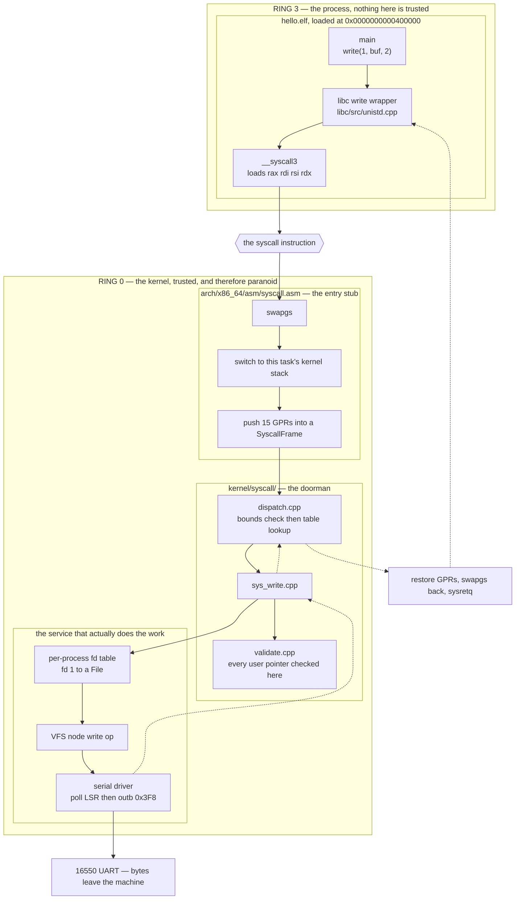

**Walking every box.**

- **`main`** is ordinary C. It knows nothing about rings, registers or the kernel. It
  calls `write` the way it would call any other function. That is the point of a libc: the
  privilege boundary is invisible from above.
- **`libc write wrapper`** is the last piece of *our* code that runs at ring 3 as a normal
  function. It turns a C argument list into the syscall register contract, and — on the
  way back — turns the kernel's negative-errno return into the `-1` plus `errno` shape
  that C programmers expect. Built in [[Stage 6.4 - A Minimal User C Library]].
- **`__syscall3`** is the three-argument inline-assembly stub. It exists separately from
  `write` so that every syscall wrapper shares one audited piece of assembly instead of
  each one inventing its own clobber list.
- **`the syscall instruction`** is the boundary itself. It is drawn as a hexagon because it
  is not code either side owns — it is the CPU performing a fixed, hardwired sequence
  configured by MSRs the kernel wrote at boot. §3.2 opens it.
- **`swapgs`** is the first kernel instruction executed. Until it runs, the `gs` base still
  belongs to the user process, so the kernel cannot safely read any per-CPU data. §3.3.
- **`switch to this task's kernel stack`** — `syscall` performs **no stack switch**. On
  arrival, `rsp` still points into the user's stack, at an address the process chose. The
  stub must fix that before it pushes anything at all.
- **`push 15 GPRs into a SyscallFrame`** captures the complete user register state on the
  kernel stack, in the same layout the interrupt stubs use, so that `fork`, signals and a
  debugger can all read one shape. §4.
- **`dispatch.cpp`** does one bounds check and one array index. It is deliberately tiny;
  everything interesting is in the handlers. §3.6.
- **`validate.cpp`** is the single most security-critical file in the tree. It answers one
  question — *may the kernel touch this user address?* — and it must answer correctly every
  time, because one miss is a total kernel compromise. §3.5.
- **`sys_write.cpp`** is the handler. It validates, looks up the fd, copies user bytes into
  a kernel buffer, and calls down.
- **`per-process fd table`** turns the small integer `1` into a kernel `File` object. In
  Phase 6 this is a hardcoded special case; the real table arrives in
  [[Stage 13.1 - The File Descriptor Table]].
- **`VFS node write op`** is a function pointer. `sys_write` does not know whether it is
  writing to a console, a file, a pipe or a socket, and that ignorance is the entire value
  of the VFS ([[Stage 7.3 - The Virtual Filesystem Layer]]).
- **`serial driver`** spins on the UART's line-status register until the transmit holding
  register is empty, then writes one byte to port `0x3F8`. Built in
  [[Stage 0.6 - Serial Output]].
- **`UART`** is where the bytes physically leave. Under QEMU they arrive on the host's
  stdout and in `build/serial.log`.
- **The dashed arrows** are the return path. It is not a mirror image: the outbound path
  crosses a privilege boundary using an instruction that discards state, so the return has
  its own constraints and its own failure modes. §5.

> [!warning] The boundary is not where the cost is
> The `syscall`/`sysret` pair costs roughly one hundred cycles — tens of nanoseconds.
> The two `outb`s at the end of this path cost about **87 microseconds each** at 115200
> baud, because the driver spins waiting for the UART. The mechanism in this document is
> three orders of magnitude cheaper than the device it is talking to. Do not optimise the
> entry stub before you have measured the driver.

---

## 3. Zooming in

### 3.1 The MSRs that make `syscall` mean anything

`syscall` is not a jump to a fixed address baked into the silicon. It is a jump to an
address the kernel wrote into a **model-specific register** (MSR) — a CPU control register
addressed by number, read with `rdmsr` and written with `wrmsr`, both privileged. Five of
them define the entire mechanism.

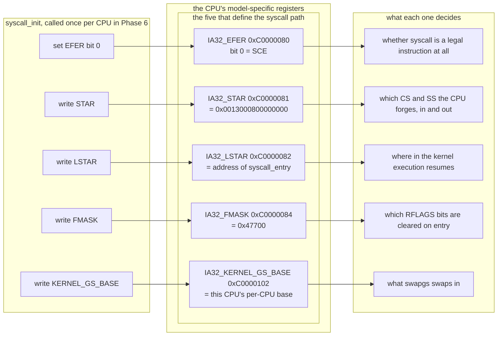

**Walking it.**

- **`IA32_EFER` bit 0, `SCE` (System Call Extensions)** is the master switch. With it clear,
  `syscall` raises an *invalid opcode* exception, vector 6 — the CPU claims not to know the
  instruction. This is the single most common first-syscall failure, and it is confusing
  because the disassembly is obviously correct.
- **`IA32_STAR`** holds the two selector bases. `STAR[47:32]` is used on entry: the CPU sets
  `CS` to that value and `SS` to that value plus 8. `STAR[63:48]` is used on exit, where
  `sysretq` sets `SS` to base plus 8 and `CS` to base plus **16**. That asymmetry is why
  [[Stage 2.1 - The Global Descriptor Table]] insists on the order *null, kernel code,
  kernel data, **user data**, **user code**, TSS*: user data must sit 8 bytes below user
  code, or there is no value of `STAR[63:48]` that works. With our layout the value is
  `0x0013000800000000` and nothing else. This is a decision made four phases early because
  it is free now and a renumbering later.
- **`IA32_LSTAR`** is the entry point: the kernel virtual address of `syscall_entry`. It
  must be a **canonical** address in the kernel's higher half, and it must be mapped in
  *every* address space — which it is, because the kernel is mapped into the upper half of
  every process's page tables ([[06 - Architecture Overview]]).
- **`IA32_FMASK`** (AMD's manuals call it `SFMASK`; the register is the same) names the
  `RFLAGS` bits the CPU clears on entry. Our value `0x47700` clears TF (`0x100`), IF
  (`0x200`), DF (`0x400`), IOPL (`0x3000`), NT (`0x4000`) and AC (`0x40000`). §3.2 explains
  why each of those is not optional.
- **`IA32_KERNEL_GS_BASE`** holds the base address of this CPU's per-CPU area while user
  code is running. `swapgs` exchanges it with the active `gs` base. §3.3.

> [!warning] These are per-CPU registers
> MSRs are not global. On an SMP machine ([[Phase 12 - Overview]]) every application
> processor must run `syscall_init` for itself, with **its own** `KERNEL_GS_BASE`. A boot
> that writes them only on the bootstrap processor produces a kernel where syscalls work
> perfectly on core 0 and triple-fault on core 3, which reads as an SMP bug and is not one.

### 3.2 What the CPU actually does

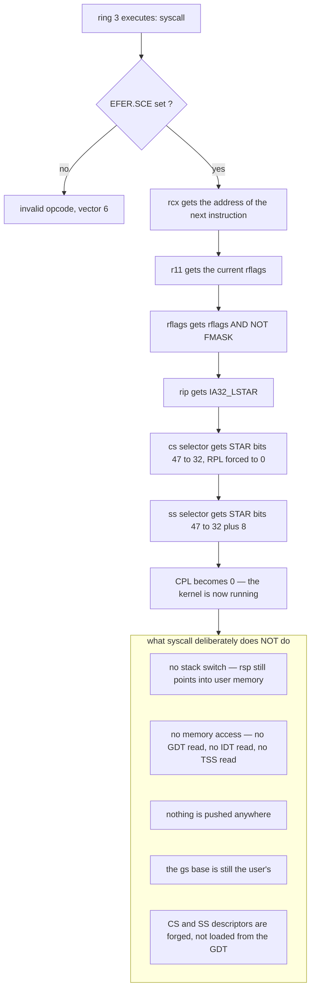

**Walking every step.**

1. **`EFER.SCE` check.** Fails closed with vector 6. See §8.
2. **`rcx` gets the return address.** The CPU has to put the resume point *somewhere*, and
   because it refuses to touch memory it must use a register. It picks `rcx`. **This single
   fact is why the syscall calling convention differs from the function calling
   convention** — §3.4.
3. **`r11` gets `rflags`.** Same reasoning, same problem: `r11` is destroyed too.
4. **`rflags` is masked.** Each cleared bit prevents a specific attack or bug:
   - **IF** — with interrupts still enabled, a timer tick could arrive between `syscall`
     and the stub's stack switch. The interrupt would be delivered at the *current* `rsp`
     (a user-controlled address) with the *user's* `gs` base. Both are fatal. Clearing IF
     closes the window.
   - **DF** — the SysV ABI guarantees the direction flag is clear on entry to any function,
     and GCC emits `rep movsb` on that assumption. A process that sets DF and then calls
     `write` would make every kernel string operation run backwards.
   - **AC** — from [[Phase 15 - Overview]], SMAP makes supervisor accesses to user pages
     fault *unless* `RFLAGS.AC` is set. If the user's AC survived into ring 0, the process
     would have switched SMAP off for the kernel. This bit costs nothing to mask and
     defeats an entire mitigation bypass.
   - **TF** — otherwise a process can single-step the kernel entry stub.
   - **NT, IOPL** — legacy bits with no business being process-controlled at ring 0.
5. **`rip` gets `LSTAR`.**
6–7. **`CS` and `SS` selectors** are set from `STAR`, and **CPL becomes 0**.

**And now the five things it does not do**, which are the whole reason the entry stub is
subtle:

- **No stack switch.** `iret`-based entry (an `int 0x80` gate) reads `TSS.rsp0` and switches
  stacks in hardware. `syscall` does not consult the TSS at all — [[Stage 2.2 - The TSS and Interrupt Stacks]]
  states this explicitly. `rsp0` covers *interrupts and exceptions* that arrive while user
  code runs; the syscall path is the stub's own problem.
- **No memory access.** This is the performance argument in one line. An `int` gate must
  read a 16-byte IDT entry, check its DPL, load a CS descriptor out of the GDT, read
  `TSS.rsp0`, and push five qwords. `syscall` reads on-core registers and pushes nothing.
  The roughly ten-to-one cost ratio quoted in [[06 - Architecture Overview]] is that
  mechanism, not a benchmark artefact.
- **Nothing is pushed.** There is no frame. The stub builds one.
- **The `gs` base is still the user's.**
- **`CS` and `SS` are forged.** The CPU synthesises the hidden descriptor state (base 0,
  flat limit, 64-bit code, DPL 0) rather than reading the GDT. The GDT entries must still
  *exist* and be correct, because `iretq`, exceptions and the user's own `mov ds, ax` all
  read them — but `syscall` itself never looks.

> [!warning] There is still a window, and it is not closed by masking IF
> Non-maskable interrupts and machine-check exceptions ignore IF. If an NMI lands on the
> single instruction between `syscall` and `swapgs`, the NMI handler runs with the user's
> `gs` base and will read garbage as per-CPU state. Real kernels solve this with a
> "paranoid entry" path that checks the `gs` base sign bit and conditionally swaps. We do
> not, in v1. Record it as a known hole and revisit in [[Phase 15 - Overview]] — do not
> discover it later and think it is new.

### 3.3 `swapgs` and the stack switch

The kernel needs two things it does not have on arrival: a pointer to per-CPU data, and a
stack it owns.

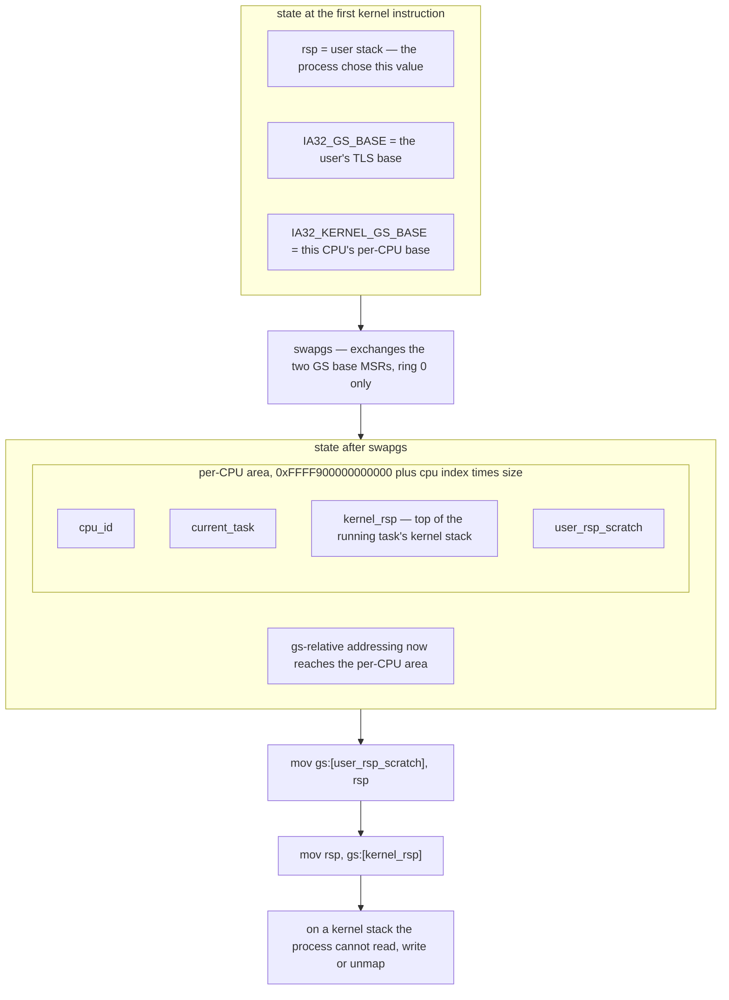

**Walking it.**

- **`rsp = user stack`.** The value is entirely under the process's control. It may be
  unmapped, read-only, non-canonical, or pointed deliberately at a kernel structure the
  process wants overwritten. Anything the kernel pushes before fixing this is a
  vulnerability, so the stub pushes nothing.
- **The two GS bases.** x86-64 keeps segment *bases* for FS and GS in MSRs rather than in
  descriptors ([[Stage 2.1 - The Global Descriptor Table]]). The architecture provides a
  second, shadow GS base purely so that a kernel can park its per-CPU pointer somewhere the
  user cannot see and retrieve it in one instruction.
- **`swapgs`** is that instruction: an atomic exchange of `IA32_GS_BASE` and
  `IA32_KERNEL_GS_BASE`. It is legal only at CPL 0.
- **The per-CPU area** lives at `0xFFFF900000000000` in the kernel's map. `kernel_rsp` is
  the field this path needs.
- **`user_rsp_scratch`** exists because there is nowhere else to put the user's `rsp`: the
  kernel stack is not loaded yet and no register may be clobbered, since every one of them
  holds either an argument or user state that must be restored.
- **`mov rsp, gs:[kernel_rsp]`** completes the switch. From here the stub can push.

> [!warning] Two places hold the same number, and forgetting one is invisible for weeks
> `TSS.rsp0` (used by *interrupts* from ring 3) and per-CPU `kernel_rsp` (used by the
> *syscall* stub) must both be updated on every context switch, to the same value. Update
> only `rsp0` and syscalls from the second task run on the first task's kernel stack.
> Update only `kernel_rsp` and the first timer tick after a task switch corrupts memory.
> Both bugs survive light testing and fail under load.

> [!warning] `swapgs` must execute exactly once per crossing
> Executed twice on the way in, the kernel runs with the user's `gs` base and reads
> attacker-controlled memory as per-CPU state. Omitted on the way out, the user program
> runs with the *kernel's* `gs` base — and any `gs:`-relative access it makes then reads
> kernel memory. This exact class of bug has produced real, named CVEs in production
> kernels. Write the stub once, audit it once, and never edit it casually.

### 3.4 The register contract, in full

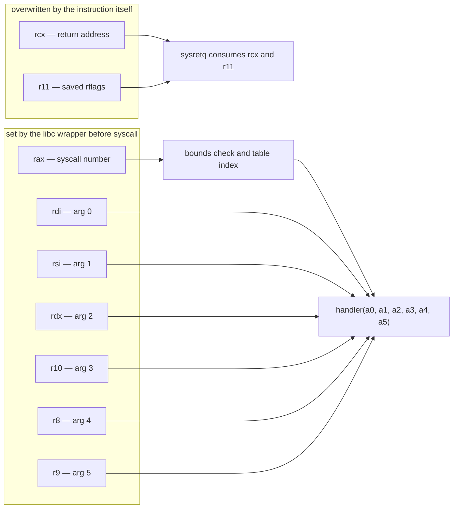

**Walking it.** Six registers carry arguments, one carries the number, and two are already
spent before the kernel gets a chance to look at them. The dispatcher turns `rax` into a
table index and passes the six argument registers straight through as the six integer
parameters of a C function — which, under SysV, land back in `rdi, rsi, rdx, rcx, r8, r9`.
The one move the dispatcher must make is `r10` into `rcx`, and the C compiler emits it for
free because the handler is called as an ordinary function.

The complete contract:

| Register | Before `syscall` | On entry to the kernel | On return to ring 3 |
|---|---|---|---|
| `rax` | syscall number | the number | **return value**, or negative errno |
| `rdi` | arg 0 | arg 0 | restored to the user's value |
| `rsi` | arg 1 | arg 1 | restored |
| `rdx` | arg 2 | arg 2 | restored |
| `r10` | arg 3 | arg 3 | restored |
| `r8` | arg 4 | arg 4 | restored |
| `r9` | arg 5 | arg 5 | restored |
| `rcx` | *anything* | **return RIP**, set by the CPU | must hold the return RIP again — `sysretq` reads it |
| `r11` | *anything* | **saved RFLAGS**, set by the CPU | must hold the RFLAGS to restore |
| `rbx`, `rbp`, `r12`–`r15` | callee-saved | preserved | preserved exactly |
| `rsp` | user stack | **unchanged** — still the user stack | restored by the stub before `sysretq` |
| `rip` | — | `IA32_LSTAR` | from `rcx` |
| `CS`, `SS` | ring 3 | forged ring 0 from `STAR[47:32]` | forged ring 3 from `STAR[63:48]` |
| `RFLAGS` | user's | user's `AND NOT FMASK` | from `r11` |

#### Why `r10` and not `rcx`

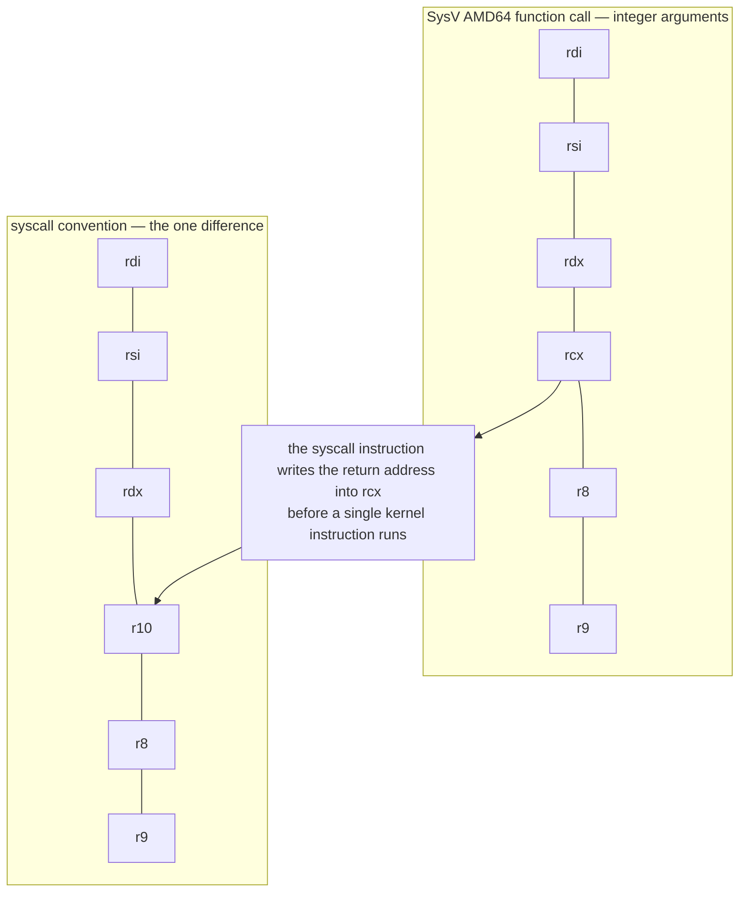

**Walking it.** The obvious design is to make the syscall convention identical to the
function convention, so a libc wrapper is a plain `jmp`. That design is impossible: the
fourth argument register under SysV is `rcx`, and `rcx` is precisely the register the
`syscall` instruction destroys. The value would be gone before the kernel's first
instruction. `r11` is destroyed too, which is why the convention stops at six arguments —
`r10` is the last caller-saved integer register left that the instruction does not touch.

The cost is one `mov r10, rcx` in the wrapper for any call with four or more arguments. In
practice GCC needs help here, because there is no inline-assembly constraint letter for
`r10`; you pin it with an explicit register variable:

```cpp
// libc/src/syscall.hpp — the four-argument form
static inline long __syscall4(long n, long a0, long a1, long a2, long a3) {
    register long r10 __asm__("r10") = a3;   // no constraint letter exists for r10
    long ret;
    __asm__ volatile("syscall"
                     : "=a"(ret)
                     : "a"(n), "D"(a0), "S"(a1), "d"(a2), "r"(r10)
                     : "rcx", "r11", "memory");
    return ret;
}
```

> [!warning] The clobber list is load-bearing
> `"rcx"` and `"r11"` must be declared clobbered or the compiler will assume they survived
> the call and reuse stale values. `"memory"` must be declared or the compiler may hoist a
> load of the buffer across the `syscall`, which matters the moment the syscall is `read`.
> [[13 - Coding Standards]] rule 2 exists for exactly this.
>
> The converse also binds the kernel: because the wrapper declares only `rcx`, `r11` and
> memory as clobbered, the kernel **must restore every other register exactly**. If a
> future hardening pass decides to zero caller-saved registers on return (a reasonable
> Phase 15 idea, to deny ROP gadgets easy operands), that is an **ABI change** and every
> wrapper's clobber list changes with it. Decide it deliberately; do not drift into it.

#### How an error is distinguished from a value

The kernel returns a single `int64_t` in `rax`. Success is the value; failure is a negative
errno. That is ambiguous in principle — `lseek` may legitimately return a huge value, and
`mmap` returns an address whose top bit could in theory be set — so the convention adds a
band:

> Return values in the range `[-4095, -1]` are errors. Everything else is a result.

That is why errno numbers must stay below 4096, and it is what the libc wrapper checks:

```cpp
ssize_t write(int fd, const void* buf, size_t len) {
    long r = __syscall3(SYS_write, fd, (long)buf, (long)len);
    if ((unsigned long)r >= (unsigned long)-4095) { errno = (int)-r; return -1; }
    return (ssize_t)r;
}
```

The translation to `errno` happens **in libc, at ring 3**. The kernel has no `errno` and
never sets one. `errno` is thread-local user state; making it kernel state would mean a
syscall that writes to user memory on every single call.

### 3.5 Argument validation — why every user pointer is hostile

The kernel is now running at ring 0 holding six 64-bit integers a process chose. Two of
them, in this call, are meant to be a pointer and a length. Nothing about the hardware
makes them so. This is the section that decides whether the OS has a security boundary.

The essential asymmetry: **at CPL 0 the CPU stops enforcing the user/supervisor page bit
for you.** A user-mode access to a kernel page faults, always. A *kernel*-mode access to a
kernel page succeeds — even when the address arrived in `rsi` from a ring-3 program thirty
instructions ago. Without SMAP (which arrives in [[Phase 15 - Overview]]), a kernel-mode
access to a *user* page succeeds too. The hardware will not save you. The range check is
the security boundary.

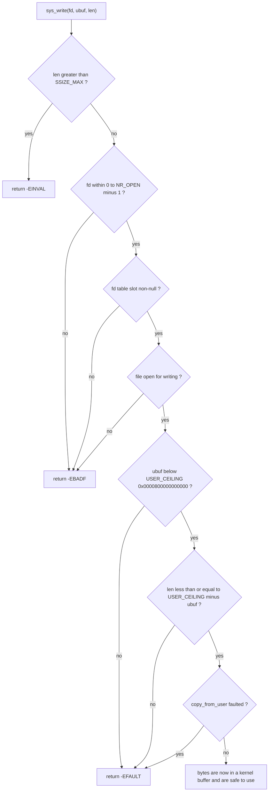

**Walking every rejection.**

- **`len > SSIZE_MAX`.** The return type is signed. A length that cannot be expressed as a
  positive `ssize_t` can never be reported correctly, and it is also the shape of an
  arithmetic-overflow probe. Reject it before doing any arithmetic with it.
- **`fd` in range.** The fd is an *index*, so the check is the classic one. Note the cast:
  `fd` arrives as a 64-bit value, and the comparison must be unsigned, or `fd = -1` indexes
  backwards out of the table into whatever precedes it in memory.
- **fd slot non-null.** In range is not the same as open. A closed fd leaves a hole.
- **Open for writing.** A file opened `O_RDONLY` must not be writable through `write`, or
  the open flags are decoration.
- **`ubuf < USER_CEILING`.** This one check does two jobs, and the reason is worth seeing.
  With 4-level paging the address space is 48-bit canonical: the low half runs from `0` to
  `0x00007FFFFFFFFFFF`, then a **non-canonical hole**, then the kernel's high half from
  `0xFFFF800000000000`. An address is a valid *user* address exactly when bits 63:47 are
  all zero — which is exactly when it is below `0x0000800000000000`. So the canonicality
  test and the "below the user ceiling" test are the **same comparison**. One `cmp`
  rejects kernel pointers, non-canonical pointers, and sign-extended garbage together.
- **`len <= USER_CEILING - ubuf`.** Written that way, never as `ubuf + len <= CEILING`. The
  naive form overflows: `ubuf = 0xFFFFFFFFFFFFFFF0` with `len = 0x20` wraps to `0x10` and
  sails through, and the kernel then reads from the top of its own address space. Subtract
  from the ceiling instead of adding to the pointer, and there is nothing to overflow.
- **`copy_from_user` faulted.** Even a perfectly canonical, in-range user address may be
  unmapped, or read-only, or copy-on-write. The kernel does not pre-walk the page tables to
  find out — see the decision below — it attempts the copy and recovers if it faults.

> [!example] Four calls, four different rejections
> All four are `write` with fd 1 and length 64.
>
> | `ubuf` | What it is | Which check catches it | Returned |
> |---|---|---|---|
> | `0xFFFFFFFF80001000` | the kernel's `.text` | below-ceiling | `-EFAULT` |
> | `0x0000800000000000` | first byte of the non-canonical hole | below-ceiling, same test | `-EFAULT` |
> | `0xFFFFFFFFFFFFFFF0` with len `0x20` | pointer chosen to overflow the addition | overflow-safe length test | `-EFAULT` |
> | `0x0000000000401000` in a page never mapped | a plausible, in-range, unmapped address | `copy_from_user` fault fixup | `-EFAULT` |
>
> Every one returns the same thing to the process. That is intentional: an error code that
> distinguished "kernel address" from "unmapped user address" would be an address-space
> oracle. Same answer, no information.

> [!warning] The check with no symptom
> Every other bug in this document announces itself — a fault, a hang, a garbled line. A
> missing pointer check announces nothing. The system boots, the tests pass, the shell
> works, and a user program can read the whole of kernel memory. This is the one place in
> the tree where "it works" is not evidence, and it is why the validation tests in
> [[09 - Testing Strategy]] tier 2 must include the hostile cases above and assert the
> **return value**, not merely the absence of a crash.

> [!question] Why not just check once and cache the answer?
> Because in Phase 13 two threads can share one address space. Thread A validates a
> pointer; thread B calls `munmap` on it; thread A dereferences. The check was true and is
> now false — a time-of-check-to-time-of-use race. The only check that cannot go stale is
> the one performed by the hardware at the moment of access, which is what `copy_from_user`
> arranges.

### 3.6 The dispatch table

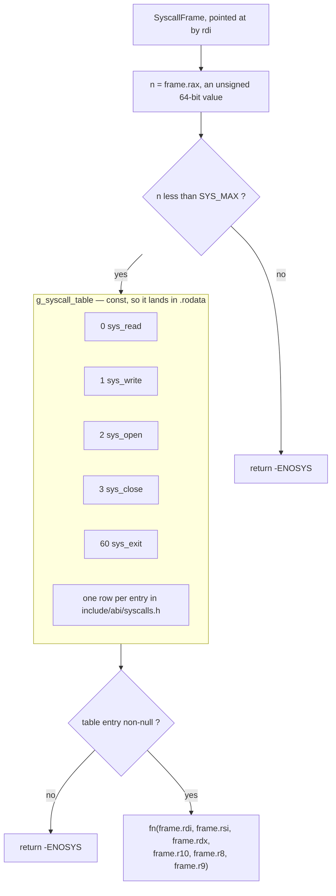

**Walking it.**

- **`n` is unsigned.** This is not a stylistic choice. With a signed `n`, `n = -1` passes a
  `n < SYS_MAX` test and indexes eight bytes *before* the table — reading whatever the
  linker put there as a function pointer and calling it. Declaring `n` as `uint64_t` makes
  every negative number enormous and the single bound test complete.
- **The bound is `<`, not `<=`.** `SYS_MAX` is the count, not the last index.
- **The table is `const`** and therefore lands in `.rodata`, which the kernel maps
  read-only. A stray kernel write that would otherwise install an arbitrary function
  pointer instead takes a page fault at the moment of the bug rather than at the moment of
  exploitation.
- **A null entry** means the number is reserved but unimplemented. It returns `-ENOSYS`,
  the same as an out-of-range number, so the table's holes are not enumerable from
  userspace.
- **The call** passes all six argument slots regardless of how many the handler declares.
  Extra arguments in registers are harmless under SysV, and a uniform signature means one
  function-pointer type for the whole table.

```cpp
// kernel/syscall/dispatch.cpp
using SyscallFn = int64_t (*)(uint64_t, uint64_t, uint64_t, uint64_t, uint64_t, uint64_t);

extern "C" int64_t syscall_dispatch(SyscallFrame* f) {
    const uint64_t n = f->rax;                    // unsigned on purpose
    if (n >= SYS_MAX) return -ENOSYS;
    const SyscallFn fn = g_syscall_table[n];
    if (fn == nullptr) return -ENOSYS;
    return fn(f->rdi, f->rsi, f->rdx, f->r10, f->r8, f->r9);
}
```

That is the whole dispatcher. Its smallness is the design: everything expensive, fallible
or security-relevant lives in a handler that can be unit-tested on the host, and the piece
that cannot be host-tested is nine lines long.

> [!tip]- Why a table rather than a `switch`
> A `switch` on a dense range compiles to a jump table anyway, so the runtime cost is the
> same. The difference is that an array is **data**: a tier-1 host test can walk it and
> assert that every number defined in `include/abi/syscalls.h` has a non-null entry, that
> no two names map to the same number, and that the table length matches `SYS_MAX`. A
> `switch` statement cannot be walked, and the drift it permits — a number added to the ABI
> header and forgotten in the kernel — is exactly the failure [[07 - Repository Layout]]
> rule 4 exists to prevent.

### 3.7 Inside `copy_from_user`

This is the deepest zoom in the document: a single function whose job is to perform a
memory copy that is *allowed to fail* without taking the kernel down.

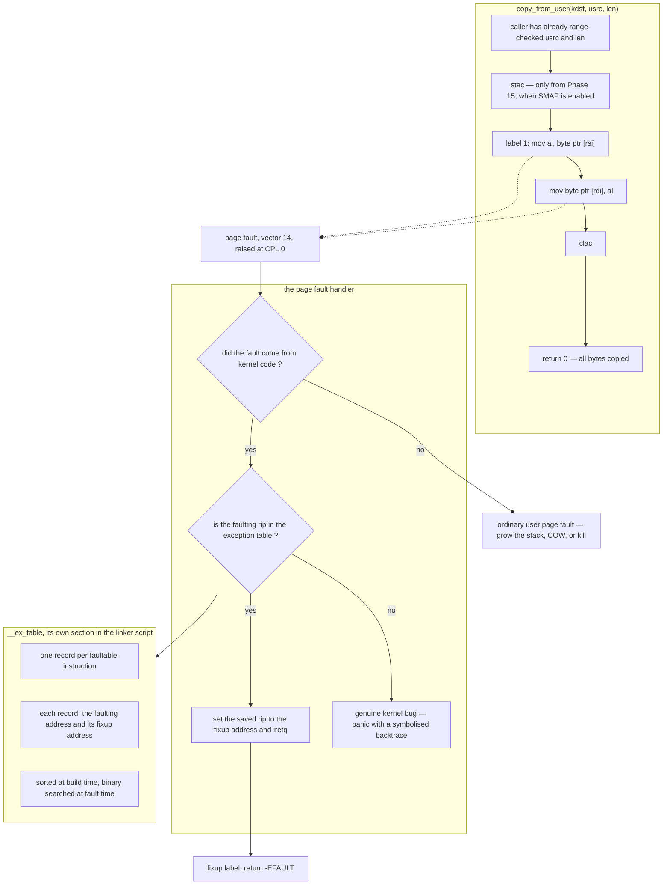

**Walking it.**

- **`C0`** — the range check happened in the caller. `copy_from_user` does not repeat it;
  it assumes it and documents the assumption. The two jobs are separate: the range check
  is *security*, the fault fixup is *robustness*. Conflating them produces code where
  neither is obviously correct.
- **`stac` / `clac`** — from Phase 15, with SMAP enabled, these are the only instructions
  permitted to open the window in which the kernel may touch user pages. They bracket the
  access as tightly as possible. Before Phase 15 they are absent and the range check stands
  alone.
- **`label 1`** — the loads and stores that may fault are individually labelled. The label
  is what the exception table keys on.
- **The dashed arrows to `FAULT`** — either access can fault: the load if the user page is
  unmapped, the store if the *kernel* destination is somehow bad (which would be a real
  bug, and is why the table's fixup should also be reachable from a panic path in debug
  builds).
- **`H1`** — the handler first asks whether the fault came from ring 0. A fault from ring 3
  is an ordinary user page fault and goes down the normal road: grow the stack, resolve a
  copy-on-write page ([[Phase 13 - Overview]]), or kill the process.
- **`H2` and `EXT`** — for a ring-0 fault, the handler searches the exception table for the
  faulting `rip`. The table is generated at build time: each labelled instruction emits a
  record into its own section, the linker gathers them, and a boot-time pass sorts them so
  the lookup is a binary search rather than a scan.
- **`H3`** — a hit means "this fault was anticipated". The handler rewrites the saved `rip`
  in the interrupt frame to the fixup address and returns. From the CPU's point of view the
  faulting instruction simply resumed somewhere else; from the C code's point of view
  `copy_from_user` returned an error.
- **`H4`** — a miss means the kernel dereferenced something bad on a path nobody declared
  faultable. That is a bug, not a hostile pointer, and it must panic loudly with a
  backtrace ([[Stage 1.7 - Symbolised Backtraces]]). Silently fixing up unknown kernel
  faults would convert every kernel bug into a mysterious `-EFAULT`.

> [!warning] `copy_from_user` may sleep, so it may not be called under a spinlock
> In v1 there is no demand paging and a fault on a user page means "bad pointer, return
> `-EFAULT`". From [[Phase 13 - Overview]] a fault may instead mean "resolve a
> copy-on-write page", which allocates, and from [[Phase 9 - Overview]] it may mean "read
> the page back from disk", which blocks. A function that can block must never be called
> with a spinlock held or with interrupts disabled — see the concurrency table in
> [[06 - Architecture Overview]]. Validate and copy **first**, into a kernel buffer, and
> only then take the lock. The bounce buffer is not just about safety; it is what makes
> the locking possible.

> [!warning] The kernel stack is small — size the bounce buffer accordingly
> A 256-byte on-stack buffer copied in a loop is right. A `char tmp[len]` is a stack
> overflow the process chooses the size of, and it lands as a double fault
> ([[Stage 2.2 - The TSS and Interrupt Stacks]]) if you are lucky and as silent corruption
> of the adjacent task's stack if you are not.

---

## 4. The data structures

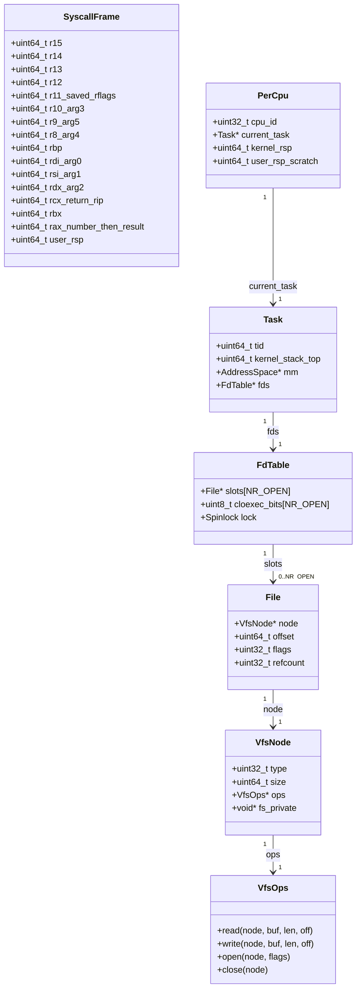

**Walking the structures.**

- **`SyscallFrame`** is the user's register state, laid out on the kernel stack in the exact
  order the entry stub pushes it. Three properties matter more than the field list:
  1. It has the **same layout as the interrupt-path register struct**. One shape means
     `fork` ([[Phase 13 - Overview]]) can copy a frame, a signal handler can build one, and
     a debugger can read one, without caring which door the task came through.
  2. `rcx` and `r11` hold the CPU-supplied return RIP and RFLAGS, not user arguments. The
     field names say so, because a comment is easier to ignore than a name.
  3. `rax` is an input on the way in and an output on the way out. The dispatcher's return
     value is stored back into this slot, and the pop sequence delivers it.
- **`PerCpu`** is what `gs:` reaches after `swapgs`. It is deliberately tiny and holds only
  what the entry path needs before it has a stack. On a single-CPU kernel it is one
  instance; from [[Phase 12 - Overview]] there is one per core at
  `0xFFFF900000000000 + index * size`.
- **`Task`** owns `kernel_stack_top`. The scheduler copies it into both `PerCpu.kernel_rsp`
  and `TSS.rsp0` on every switch — the duplication warned about in §3.3.
- **`FdTable`** is per-process. `slots` is a flat array indexed by the fd, which is why an
  fd is a small integer and why the range check in §3.5 is a single unsigned compare.
  `cloexec_bits` is a bitmap rather than a flag inside `File`, because close-on-exec is a
  property of the *descriptor*, not of the open file — two descriptors created by `dup` share
  one `File` and may have different close-on-exec settings. Built in
  [[Stage 13.1 - The File Descriptor Table]].
- **`File`** is the open-file description: position, mode, reference count. `dup(1)` creates
  a second slot pointing at the *same* `File`, which is why writes through both descriptors
  advance one shared offset — and why `refcount` exists.
- **`VfsNode` / `VfsOps`** are the polymorphic layer. `sys_write` calls
  `f->node->ops->write(...)` and has no idea whether it just wrote to a console, a tmpfs
  file, a FAT32 file, a pipe or a socket ([[Stage 7.3 - The Virtual Filesystem Layer]]).

**The three integers of `write(1, buf, 2)`, and what each one means at each layer:**

| Value | At ring 3 | In the frame | After lookup | At the driver |
|---|---|---|---|---|
| `1` | the constant `STDOUT_FILENO` | `frame.rdi` | index into `FdTable.slots` | irrelevant — the node was already chosen |
| `buf` | a `const char*` into `.rodata` | `frame.rsi` — an untrusted integer | still untrusted | never seen; the driver gets a kernel buffer |
| `2` | `size_t` | `frame.rdx` | bounded against the buffer | the loop count for the UART |

Note the third row. **The driver never sees a user pointer.** The bounce buffer in
`sys_write` is what guarantees that, and it is why the rule "validate at the boundary, once"
is achievable at all: exactly one function in the tree is allowed to hold an unvalidated
user address, and everything below it works on kernel memory.

---

## 5. The flows

### 5.1 The successful call, end to end

```mermaid
sequenceDiagram
    autonumber
    participant P as user program
    participant L as libc wrapper
    participant C as the CPU
    participant E as entry stub
    participant D as dispatch
    participant W as sys_write
    participant V as fd table and VFS
    participant S as serial driver

    Note over P,L: RING 3 — untrusted. Every value below is chosen by the process.
    P->>L: write(1, buf, 2)
    activate L
    L->>L: rax=1 rdi=1 rsi=buf rdx=2
    L->>C: syscall
    deactivate L

    activate C
    Note over C: rcx gets return rip, r11 gets rflags,<br/>rflags masked by FMASK, rip gets LSTAR, CPL becomes 0
    C->>E: execution resumes at syscall_entry
    deactivate C

    Note over E,S: RING 0 — the boundary is crossed here and nowhere else
    activate E
    E->>E: swapgs
    E->>E: stash user rsp, load kernel rsp from the per-CPU area
    E->>E: push 15 GPRs to build a SyscallFrame
    E->>E: sti — interrupts back on, the kernel stack is safe now
    E->>D: syscall_dispatch(frame)

    activate D
    D->>D: unsigned bound check of rax against SYS_MAX
    D->>W: sys_write(1, ubuf, 2)

    activate W
    W->>W: ubuf below USER_CEILING, length overflow-safe
    W->>V: fd_lookup(current_task, 1)
    activate V
    V-->>W: File for the console
    deactivate V
    W->>W: copy_from_user into a 256-byte kernel buffer
    W->>V: node.ops.write(kernel buffer, 2)
    activate V
    V->>S: serial_write(kernel buffer, 2)
    activate S
    S->>S: poll LSR bit 5, then outb to 0x3F8 — twice
    S-->>V: 2
    deactivate S
    V-->>W: 2
    deactivate V
    W-->>D: 2
    deactivate W
    D-->>E: 2
    deactivate D

    E->>E: store 2 into frame.rax
    E->>E: cli — no interrupt may see a half-restored state
    E->>E: pop 15 GPRs; rcx gets return rip, r11 gets rflags
    E->>E: swapgs back
    E->>E: rsp gets the stashed user rsp
    E->>C: sysretq
    deactivate E

    activate C
    Note over C: rip gets rcx, rflags gets r11,<br/>CS and SS from STAR bits 63 to 48 with RPL 3, CPL becomes 3
    C->>L: resume at the instruction after syscall
    deactivate C

    activate L
    L->>L: rax is 2, not in the error band, so errno is untouched
    L-->>P: 2
    deactivate L
```

**Walking the flow.** Read the activation bars: they show who holds the CPU. Note four
things.

- **The privilege change happens twice and only twice** — at the `syscall` and at the
  `sysretq`. Everything between the two `Note over C` blocks runs at ring 0.
- **`sti` is deliberately late and `cli` deliberately early.** Interrupts stay off from the
  `syscall` until the stub owns a kernel stack, and go off again before the restore
  sequence begins. In between, a syscall is fully interruptible — which it must be, or a
  slow `write` would stop the scheduler's clock.
- **The kernel stack is re-entered by interrupts, not switched.** An interrupt arriving
  during step 15 is a *same-ring* interrupt: the CPU does not consult `TSS.rsp0` and pushes
  onto the current kernel stack. The stack must be large enough for a `SyscallFrame`, a
  nested interrupt frame, and the handler's own frames.
- **The return value is threaded through four layers unchanged** — `2` from the driver, `2`
  from the VFS, `2` from `sys_write`, `2` into `frame.rax`. Nothing reinterprets it. That
  discipline is what makes the error path in §5.2 work with no extra machinery.

### 5.2 The failing call — negative errno all the way out

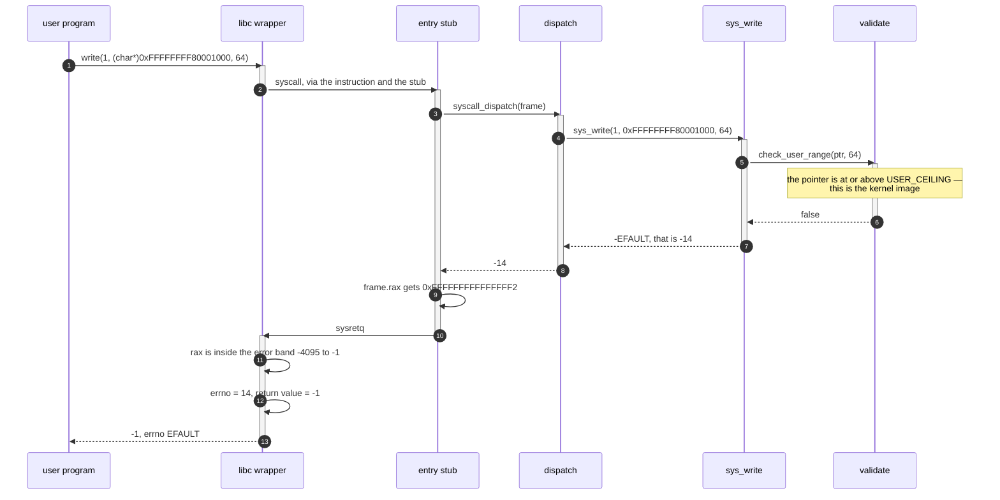

**Walking it.** The error travels as an ordinary return value. There is no exception
mechanism, no error flag register, no out-parameter — which matters because the kernel is
built with exceptions disabled ([[ADR-0007 - Freestanding C++20 as the Kernel Language]])
and because an error path that uses different machinery from the success path is an error
path nobody tests. Note the bit pattern: `-14` as an unsigned 64-bit value is
`0xFFFFFFFFFFFFFFF2`, which is what a debugger will show in `rax`. Recognising the
`0xFFFFFFFFFFFFFFxx` shape as "a small negative errno" saves a lot of confusion at 2am.

Note also what the process learns: nothing. It cannot distinguish "that is the kernel" from
"that page is not mapped" from "that page is read-only". All three are `-EFAULT`.

### 5.3 The lifetime of a call, including the cases v1 does not have yet

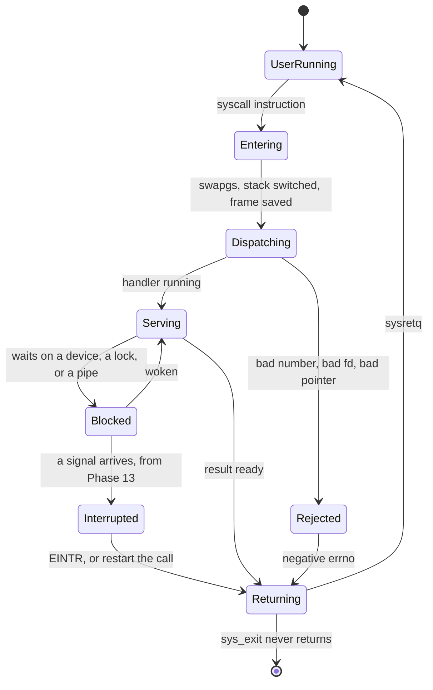

**Walking the states.** `UserRunning` → `Entering` → `Dispatching` → `Serving` →
`Returning` → `UserRunning` is the whole of Phase 6: no syscall in Phase 6 blocks, so
`Blocked` is unreachable and the path is a straight line. Three states are placeholders for
later phases and they are drawn now because each one changes the *shape* of the path rather
than adding to it:

- **`Blocked`** appears with `sys_read` on a pipe ([[Phase 13 - Overview]]) and with disk
  and socket calls. It means a syscall can be in flight while another task runs, so
  everything the handler is holding must survive an arbitrary gap: no pointers into another
  task's stack, no spinlocks held across the block.
- **`Interrupted`** is signal delivery landing on a blocked syscall. The call either returns
  `-EINTR` or is restarted, and *which* is a per-syscall property. This is the hardest part
  of Phase 13.7 and the reason the `SyscallFrame` must be complete: restarting means
  rewinding `rip` by the two bytes of the `syscall` instruction and re-running it with the
  original registers, which is only possible because they were all saved.
- **`sys_exit` never returns.** It is the one handler that does not come back through the
  stub; it hands the CPU to the scheduler, and the frame it was building is discarded with
  the task.

---

## 6. Why it is shaped this way

| Decision | Alternatives | Cost of the alternative | Verdict |
|---|---|---|---|
| **Entry via `syscall`/`sysret`** | `int 0x80` gate with DPL 3; `sysenter` | `int` reads an IDT entry, a GDT descriptor and the TSS on every call, and `iret` is worse — roughly ten times the cost. `sysenter` is the 32-bit Intel-only variant and does not survive on AMD in long mode | ✅ `syscall` |
| **Arg 3 in `r10`** | `rcx`, matching the function ABI; the fourth argument on the user stack | `rcx` is destroyed by the instruction before the kernel runs — impossible, not merely slow. Stack arguments mean the kernel must validate and fault-handle a *user stack read* on every call with four arguments | ✅ `r10` |
| **Errors as negative errno in `rax`** | A separate `errno` the kernel writes; an out-parameter; a two-register pair | A kernel-written `errno` means a user-memory write on every failing call, with its own validation. An out-parameter is another hostile pointer to check. A register pair burns a register and every wrapper | ✅ negative errno |
| **Validate range, then fault-and-fixup** | Pre-walk the page tables on every pointer | The pre-walk is slower *and* wrong: it is a time-of-check-to-time-of-use race the moment two threads share an address space, and it duplicates logic the MMU already implements | ✅ range check plus `__ex_table` |
| **Bounce buffer into kernel memory** | Pass the user pointer down to the driver | Every driver, filesystem and network path would then have to be user-pointer-aware, and each one becomes a place to get it wrong. One validated copy at the boundary keeps the blast radius at one file | ✅ bounce buffer |
| **A `const` function-pointer table** | A `switch`; a hash of syscall names | The `switch` is not enumerable, so nothing can test that the ABI header and the kernel agree. A hash is slower and buys nothing for a dense, small, compile-time-known set | ✅ table |
| **`sysretq` fast path, `iretq` fallback** | Always `iretq`; always `sysretq` | Always `iretq` throws away most of the performance the entry mechanism bought. Always `sysretq` is a privilege-escalation bug — see below | ✅ fast path with a guard |
| **Restore all registers exactly** | Zero the caller-saved registers on return | Zeroing is real hardening, but it is an ABI change: every libc wrapper's clobber list must list them. Defer to [[Phase 15 - Overview]] and change both sides together | ⚠️ later |

### What breaks under "always `sysretq`"

This is the rejected alternative that is not merely slower but unsafe, so it is worth
stating precisely.

`sysretq` loads `rip` from `rcx` without checking canonicality first. If `rcx` holds a
non-canonical address, the instruction raises a general-protection fault — and **on Intel
processors that fault is taken while the CPU is still at CPL 0**. By that point our stub has
already loaded `rsp` with the user's stack pointer, because `sysret` does not restore `rsp`
and the stub must do it beforehand. So the `#GP` handler begins executing kernel code, at
ring 0, pushing its exception frame onto a stack whose address the process chose. That is a
full privilege escalation, and it has a CVE number in every major OS that shipped it. AMD
parts raise the same fault after the privilege change, where it is harmless — so the bug is
also *silent on half the machines you might test on*.

Two defences, and we take both:

1. **Check before returning.** If the frame's `rip` is not canonical — or if `r11`,
   `cs` or `ss` have been modified by anything (a signal return, a debugger) into something
   `sysret` cannot express — fall back to `iretq`, which validates properly and is allowed
   to fault safely.
2. **Give `#GP` an IST stack.** [[Stage 2.2 - The TSS and Interrupt Stacks]] already builds
   the Interrupt Stack Table for `#DF`. Adding `#GP` to it means that even if defence 1 is
   ever bypassed, the fault handler lands on a known-good kernel stack rather than the
   process's. This is the payoff for work done four phases earlier.

> [!warning] `r11` is user-controllable on some paths, and `RFLAGS` comes from it wholesale
> On the plain path `r11` holds the flags the CPU saved, so it is safe. But any path that
> lets a process *construct* a frame — signal return in Phase 13.7, or a debugger writing
> registers — can put anything in it. `sysretq` copies it into `RFLAGS` with only RF and VM
> forced. A process that gets `IF = 0` into `r11` returns to ring 3 with interrupts
> disabled and wedges the core: no timer, no preemption, no way in. Sanitise `RFLAGS` on
> every path that reconstructs a frame — force IF on, clear IOPL, clear NT — or use `iretq`
> there.

---

## 7. How this grows across the phases

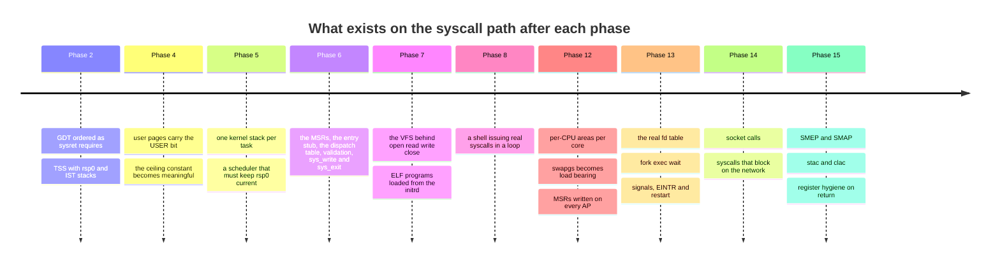

**Walking the timeline.**

- **Phase 2** looks unrelated and is not. The GDT descriptor order and the TSS are
  prerequisites of a path that does not exist for another four phases, and both are
  effectively free to get right now and expensive to fix later.
- **Phase 4** gives the address-space shape the validation depends on: the user/kernel split,
  the USER bit, and the unmapped first 4 MiB that turns a null-pointer syscall argument into
  a clean `-EFAULT` rather than a read of address zero.
- **Phase 5** provides per-task kernel stacks. Before this, "switch to the task's kernel
  stack" has no meaning.
- **Phase 6** is where everything in §3 is built. What it deliberately lacks: fd 1 and 2 are
  hardcoded to the console, there is no fd table, and no syscall blocks.
- **Phase 7** replaces the hardcoded console with a VFS node, and the same `sys_write` code
  starts working on files. This is the payoff for the indirection in §4 — the syscall layer
  does not change at all.
- **Phase 8** is the first real *load* on this path: a shell in a read-eval loop is thousands
  of syscalls a second, and it is where a subtly wrong register restore finally shows up.
- **Phase 12** turns the per-CPU area from a formality into a requirement, and makes
  `swapgs` correctness a genuine multicore concern.
- **Phase 13** is the largest single change: a real fd table, a frame that must survive
  `fork`, and signals that can interrupt a call mid-flight.
- **Phase 14** adds calls that block for a long time on something outside the machine.
- **Phase 15** finally puts hardware behind the rule that §3.5 currently enforces in
  software alone.

> [!note] What is deliberately missing early, and why that is acceptable
> Phase 6 has no fd table, no blocking, no signals, no SMAP and no seccomp-style filtering.
> That is acceptable because none of them change the *shape* of the path — each one slots
> into a box that already exists. What would not have been acceptable is getting the
> **register contract**, the **frame layout** or the **descriptor order** wrong, because
> those are the things every later phase builds on top of and cannot renegotiate cheaply.
> Get the interface right early; fill in the implementations late.

> [!warning] The Phase 6 stage notes still describe the v1 plan
> [[Stage 6.3 - The System Call Interface]] and [[Stage 6.4 - A Minimal User C Library]]
> currently specify `int 0x80` with `eax`/`ebx`/`ecx`/`edx` — the 32-bit convention from
> the v1 vault, superseded by [[ADR-0002 - Target x86_64 Not i686]] and by the syscall
> section of [[06 - Architecture Overview]]. Where those notes and this document disagree,
> **this document and the architecture overview are correct**. See
> [[05 - Gap Analysis (v1 to Product)]] gap B1. The stage notes are on the rewrite list.

---

## 8. Failure modes

Symptom first. This is the table to read at 2am.

| What you observe | What it actually is |
|---|---|
| The very first `syscall` from ring 3 raises **invalid opcode, vector 6** | `EFER.SCE` (bit 0) was never set. The instruction is genuinely unrecognised |
| Machine **resets instantly** on the first syscall, no output | `LSTAR` holds a non-canonical, unmapped or plain wrong address. The CPU faults trying to fetch, cannot deliver the fault, and triple-faults |
| Kernel enters, then **page-faults reading `gs:` data** at a wild address | `swapgs` missing, or executed twice. The `gs` base is still the user's |
| Syscalls work for a while, then the machine dies **after the first task switch** | The scheduler updates `TSS.rsp0` but not per-CPU `kernel_rsp` (or the reverse). The second task's syscall runs on the first task's stack |
| A user program's **locals are corrupted** after an otherwise correct `write` | The entry stub does not restore all 15 GPRs, or restores them in the wrong order. Callee-saved `rbx`, `rbp`, `r12`–`r15` are the usual casualties |
| `#GP` **in ring 0 at the `sysretq`** | `rcx` is non-canonical, or `STAR[63:48]` is wrong. See §6 — this is the dangerous one |
| The user program resumes and **immediately faults on its own stack** | `rsp` was not restored before `sysretq`. The instruction does not restore it for you |
| User code runs but **`cs` is garbage / instant `#GP` after return** | User data and user code descriptors are in the wrong order in the GDT, so `STAR[63:48] + 16` does not name user code ([[Stage 2.1 - The Global Descriptor Table]]) |
| **Panic inside `copy_from_user`**, faulting address is a plausible user pointer | The exception-table entry for that instruction is missing, or the `__ex_table` section is not emitted by the linker script, or the boot-time sort never ran |
| `write` returns **`-EFAULT` for a buffer that is obviously fine** | The overflow-safe length test written the wrong way round, or `USER_CEILING` off by one, or `fd` compared as signed |
| Everything works in QEMU, **corrupts data on real hardware** | `FMASK` missing DF. The user process left the direction flag set and a kernel `rep movsb` ran backwards |
| The system **hangs the moment a program returns from a syscall** | `RFLAGS.IF` cleared in the value restored from `r11`. No timer, no preemption, no recovery |
| Random corruption **only when the timer fires during entry** | `FMASK` missing IF. An interrupt landed in the window before the stack switch |
| **A user program can read kernel memory** | A missing range check. There is no symptom. This one is found by a test or not at all |

> [!danger] The two-symptomless bugs
> A missing pointer range check and a doubled `swapgs` both produce a system that looks
> completely healthy. Neither is found by "boot it and look at the screen". Both need
> deliberate hostile tests in [[09 - Testing Strategy]] tier 2 — a user program that passes
> a kernel address and asserts `-EFAULT`, and one that reads `gs:`-relative memory from ring
> 3 and asserts it faults.

---

## 9. Masterclass notes

> [!question] Discussion prompts
> 1. `syscall` performs no stack switch and reads no memory, while an `int` gate switches
>    stacks in hardware by reading the TSS. Which design is *safer*, and which is *faster* —
>    and what does that tell you about where the kernel's remaining work went?
> 2. The canonicality check and the "below the user ceiling" check collapse into one
>    comparison. Under what change to the system would they stop being the same check, and
>    what would you have to add?
> 3. `copy_from_user` recovers from a page fault by rewriting the saved `rip`. Explain why
>    the same machinery must **not** be used to recover from a fault at an address the
>    kernel itself computed.
> 4. A process calls `write(1, buf, 4096)` where the first half of `buf` is mapped and the
>    second half is not. What should the call return, and where in the path is that decided?
>    What does the answer imply about doing the copy in one call versus in a loop?
> 5. Why does the syscall convention stop at six arguments? What would you do if you needed
>    a seventh, and what does your answer cost in validation work?

**You understand this when you can:**

- [ ] Draw the full path from `main` to `outb` from memory, marking exactly where the
      privilege level changes.
- [ ] Name the five MSRs and say what breaks if each one is wrong.
- [ ] Explain why `r10` carries argument 3, without saying "because Linux does".
- [ ] Write the overflow-safe range check on a whiteboard and explain why the obvious form
      is wrong.
- [ ] Explain why `sysret` needs a guard and `iret` does not.
- [ ] Say what `swapgs` exchanges, why once and not twice, and what an NMI does to the
      argument.
- [ ] Explain why the driver never sees a user pointer.

**Board plan** — the order to draw this, with the board wiped once in the middle.

1. Two boxes: ring 3 on top, ring 0 underneath, one arrow between them labelled `syscall`.
   Nothing else. Establish that this is the *only* door.
2. Fill in ring 3: `main` → `write` → `__syscall3`. Write the register loads next to the
   last box.
3. Draw what the instruction does as a list of six lines, then draw a heavy line under it
   and write the four things it does **not** do. Spend time here; this is the crux.
4. Draw `rsp` still pointing into the user's stack, and ask the room what the first kernel
   instruction can safely do. Let them arrive at "nothing". Then introduce `swapgs` and the
   per-CPU `kernel_rsp`.
5. Draw the frame being pushed. Note that it is the same shape as the interrupt frame.
6. **Wipe the board.** Draw the validation flowchart alone, with all five rejection paths.
   This is the half of the session people remember.
7. Draw `copy_from_user` and the exception table beside it.
8. Redraw the whole path in one line, fast, as a recap — then walk the return path
   backwards over it, marking `sysret`'s three constraints.
9. Finish on the `sysret` non-canonical-`rcx` escalation. It is the best story in the
   session and it lands the point that this path is security code.

**Time budget:** 55 minutes. Steps 1–5 take 20, step 6 takes 15, steps 7–9 take 20.

---

## 10. Related

[[06 - Architecture Overview]] · [[07 - Repository Layout]] · [[09 - Testing Strategy]] · [[13 - Coding Standards]] · [[14 - Debugging Playbook]]

**Stages that build this path:**
[[Stage 2.1 - The Global Descriptor Table]] · [[Stage 2.2 - The TSS and Interrupt Stacks]] · [[Stage 4.3 - Enabling Paging]] · [[Stage 6.1 - The Task State Segment]] · [[Stage 6.2 - Entering Ring 3]] · [[Stage 6.3 - The System Call Interface]] · [[Stage 6.4 - A Minimal User C Library]] · [[Stage 7.3 - The Virtual Filesystem Layer]] · [[Stage 13.1 - The File Descriptor Table]]

**Where it is exercised or extended:**
[[Phase 8 - Overview]] · [[Phase 12 - Overview]] · [[Phase 13 - Overview]] · [[Phase 15 - Overview]]

**Decisions:**
[[ADR-0002 - Target x86_64 Not i686]] · [[ADR-0007 - Freestanding C++20 as the Kernel Language]] · [[ADR-0008 - Monorepo Layout]] · [[05 - Gap Analysis (v1 to Product)]]
