# 11 — The Storage Stack

> [!abstract] What this document covers
> Everything between a chip soldered to the PCI bus and a byte your program can
> read. Five layers — PCI enumeration, a device driver, the block-device
> interface, the buffer cache, and partition-table parsing — plus the one
> mechanism that makes all of them possible and all of them dangerous: **DMA**,
> the device writing straight into RAM without asking the CPU. This is the
> subsystem view. The filesystems that sit on top are the next document.

**Zoom level:** Subsystem
**Built by:** [[Stage 9.1 - The Block Device Interface]], [[Stage 9.2 - DMA and Physically Contiguous Memory]], [[Stage 9.3 - The Buffer Cache]], [[Stage 9.4 - PCI Device Discovery for Storage]], [[Stage 9.5 - The AHCI Driver]], [[Stage 9.6 - The NVMe Driver]], [[Stage 9.7 - Partition Table Parsing]]
**Prerequisites:** [[06 - Architecture Overview]] · [[Phase 4 - Overview|Phase 4 — Memory Management]] (frames, paging, HHDM) · [[Stage 5.4 - Sleep and Blocking]] (a task that waits) · [[Stage 11.3 - PCI Enumeration]] (how the controller is found)
**Masterclass session:** 6 (see [[19 - The Eight-Hour Masterclass]])

---

## 1. The one-sentence version

**The storage stack is the chain of code that turns "give me byte 4 097 of this
file" into a physical address handed to a chip that writes into your RAM while
the CPU is doing something else entirely — and then wakes the right task when it
is done.**

Every other subsystem in this kernel is synchronous. You write to the serial
port and the byte is gone. You call the frame allocator and it returns. Storage
is the first place where you ask for something and the answer arrives
**milliseconds later, from an interrupt, into memory you did not write**. That
one property — asynchrony plus a second bus master mutating your address space —
is what gives this subsystem its shape. Every layer below exists either to hide
that asynchrony from callers, or to make the second bus master safe.

Three vocabulary items before anything else, because nothing here parses without
them:

- **Sector** — the smallest unit a disk will read or write. 512 bytes
  historically; 4096 on modern drives. The disk has no concept of a byte offset.
- **LBA (Logical Block Address)** — sectors numbered 0, 1, 2, … to the end of the
  disk. The disk's entire addressing model. There is no "track" or "cylinder"
  any more; those survive only as dead fields in the MBR.
- **DMA (Direct Memory Access)** — the device reads and writes system RAM itself,
  over the bus, without the CPU copying anything. The CPU hands over a *physical*
  address and gets an interrupt when the transfer finishes.

---

## 2. The picture

This is the whole subsystem. Read it top to bottom: a request travels down the
left, data comes back up through RAM on the right.

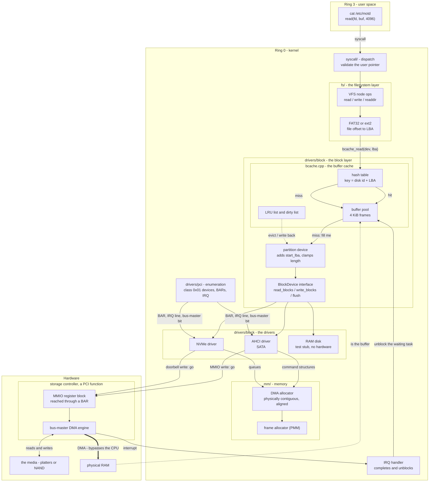

### Walking every box

**`cat` in ring 3** issues `read(fd, buf, 4096)`. It knows nothing below this
line. That is the point of the whole stack.

**`syscall/` dispatch** validates the user pointer — canonical, below the user
ceiling, mapped — before anything dereferences it
([[06 - Architecture Overview]], "Syscall interface"). A missing check here is a
full kernel compromise, and storage is the subsystem most likely to be handed a
hostile length.

**VFS node ops** ([[Stage 7.3 - The Virtual Filesystem Layer]]) dispatch through
the node's function table to whichever filesystem owns this file. The VFS does
not know what a disk is.

**FAT32 / ext2** perform the only genuinely filesystem-specific act in the
diagram: turning a *byte offset within a file* into a *block number on a
device*. FAT32 walks a cluster chain; ext2 walks inode block pointers with up to
triple indirection. Both then call the same function.

**The hash table** is the front door of the buffer cache. Key: the identity of
the underlying disk plus the absolute LBA. Two outcomes and no third.

**Hit** — the buffer is already in the pool. The call returns without touching
hardware. On a mounted filesystem the overwhelming majority of reads end here,
because filesystems re-read the same metadata blocks constantly.

**Miss** — the cache picks a victim buffer (via the **LRU list**), writes it out
first if it is on the **dirty list**, then reuses its 4 KiB of memory and asks
the layer below to fill it.

**The buffer pool** is the memory itself: whole 4 KiB frames from the PMM, one
per cached block. Crucially these are the same frames the DMA engine writes
into. There is no second copy. This is why the pool is allocated from the frame
allocator and not from `kmalloc` — see §3.3.

**The partition device** is the entire partition abstraction, and it is four
lines of code: it is *itself* a `BlockDevice` that holds a pointer to the parent
disk, a `start_lba`, and a `block_count`. `read_blocks(n)` becomes
`parent->read_blocks(start_lba + n)`, with a bounds check that is the only thing
standing between a filesystem bug and another partition's data.

**The `BlockDevice` interface** is the seam. Five operations, no hardware
concepts. Everything above it works against any disk; everything below is a
driver. §3.2 opens it.

**AHCI, NVMe, RAM disk** are three implementations of that one interface. The
RAM disk exists so that Phase 10's filesystem work can start before either real
driver is finished — the interface-first rule from [[12 - Team Workflow]].

**PCI enumeration** is what finds the other two at boot: it walks the bus,
matches on class code, extracts the register-block address from a BAR, reads the
interrupt routing, and — the step everyone forgets — sets the **bus-master
enable** bit that permits the device to perform DMA at all.

**The DMA allocator** hands out memory the *device* can address: physically
contiguous, correctly aligned, and identified by physical address. It sits on
the frame allocator and imposes a requirement on it that Phase 4 did not
originally have. §3.3.

**The MMIO register block** is how the CPU talks to the controller: ordinary
loads and stores to addresses that are not RAM. It must be mapped **uncacheable**
or your commands sit in the CPU's write-back cache and never reach the chip.

**The DMA engine** is the second bus master. The double arrow to RAM is drawn
thick because it is the one arrow in this diagram the CPU is not involved in.

**The interrupt** is the return path for *control*. Note it goes to a different
box than the data: data lands in RAM directly, and the interrupt only says "it
is there now." Conflating those two is the source of half the bugs in §8.

**The IRQ handler** does the minimum: acknowledge the device, find which request
completed, mark it done, unblock the waiting task. It may not sleep, may not
take a mutex, and may only take IRQ-save spinlocks
([[06 - Architecture Overview]], "Concurrency model").

> [!warning] The one arrow that is not there
> Nothing calls upward. `drivers/block` never calls `fs/`. The cache does not
> know what a filesystem is; the driver does not know what a partition is. The
> moment a driver needs to know which filesystem is mounted, the layering has
> failed and the subsystem becomes untestable.

---

## 3. Zooming in

### 3.1 Finding the controller — PCI enumeration

You cannot drive a device you cannot find. Before Phase 11 the kernel only
talked to devices at hardcoded legacy addresses: the serial port at `0x3F8`, the
PIT at `0x40`, the keyboard controller at `0x60`. No storage controller has a
fixed address. It lives on the **PCI bus**, and its register block is wherever
firmware decided to put it this boot.

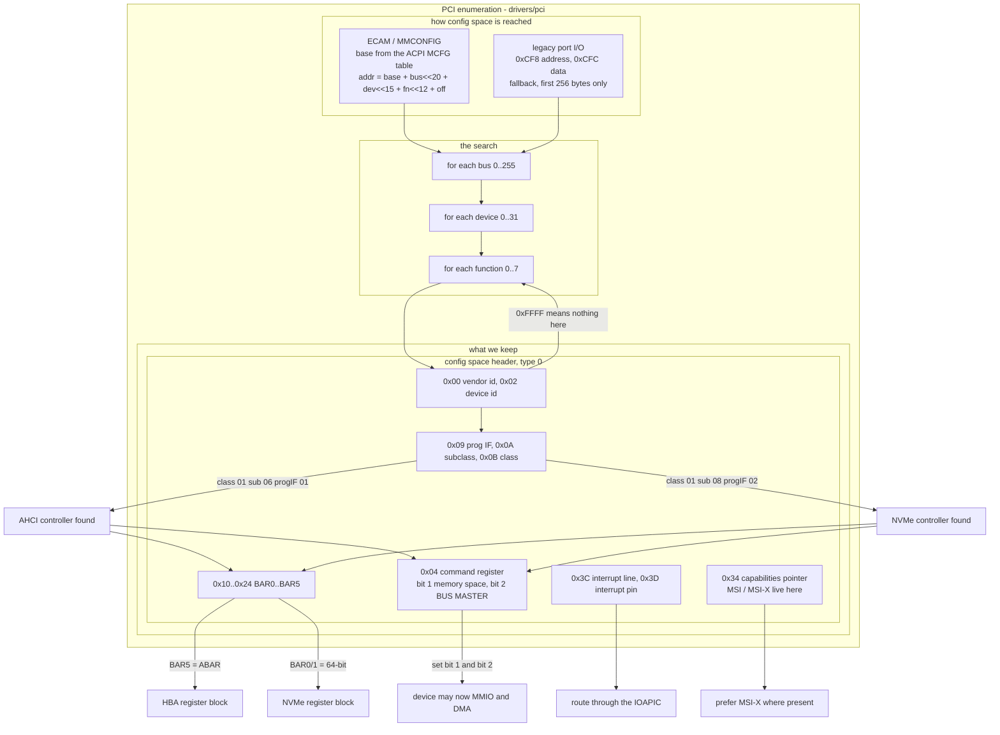

**Config space** is a 256-byte (PCI) or 4096-byte (PCI Express) register block
that every function on the bus exposes, at a fixed layout. It is *not* the
device's operational registers — it is the standardised header that tells you
what the device is and where its real registers are.

**Two ways to reach it.** The legacy mechanism writes a bus/device/function/
offset address to port `0xCF8` and reads data from `0xCFC`, and can only see the
first 256 bytes. **ECAM** (also called MMCONFIG) maps the whole of config space
into physical memory; the base address comes from the ACPI **MCFG** table, which
is why PCI enumeration sits at step 17 of the init order in
[[06 - Architecture Overview]], after ACPI at step 12. Use ECAM when MCFG
exists, fall back to ports when it does not.

**The search** is a triple loop. Reading vendor ID `0xFFFF` means "no function
here" — that is the probe. A device whose header type has bit 7 set is
multi-function and all eight function numbers must be tried; otherwise only
function 0 exists.

**The match** is on the three class bytes, never on vendor and device ID. Class
`0x01` is Mass Storage. Subclass `0x06` with prog IF `0x01` is an AHCI 1.0 SATA
controller. Subclass `0x08` with prog IF `0x02` is NVMe. Matching on class is
what makes one driver work on every vendor's chip — the entire reason the class
code exists.

**The BAR** (Base Address Register) holds the physical address of the device's
operational register block. For AHCI it is always BAR5, conventionally called
**ABAR**. For NVMe it is BAR0, and it is a 64-bit BAR, meaning BAR0 and BAR1
together form one address — read BAR1 as the high half, do not treat it as a
separate region. Sizing a BAR is a small ritual: write all ones, read back, mask
off the low flag bits, invert, add one.

**The command register** is the step that produces the most baffling bug in the
phase. Bit 1 enables memory-space decoding; without it every MMIO read returns
all-ones. Bit 2 is **bus master enable**; without it the device is not permitted
to initiate DMA, so it will accept your command, do nothing, and never
interrupt. Both must be set explicitly. Firmware may or may not have done it.

**Interrupt routing** comes from the interrupt pin plus the ACPI routing tables,
delivered through the IOAPIC ([[Stage 11.5 - The I/O APIC]]). NVMe controllers
implement MSI or MSI-X and that is the path to prefer; MSI-X delivers a
per-queue vector as a plain memory write, which removes the shared-line
disambiguation problem entirely.

> [!warning] Phase 9 depends on a Phase 11 stage
> This is the one place where the phase numbering lies. Storage is Phase 9;
> PCI enumeration is [[Stage 11.3 - PCI Enumeration]]. You must do 11.3 first,
> or write a hardcoded stub that finds the QEMU AHCI controller at a known
> bus/device/function and replace it later. The phase overview says so; believe
> it before you spend an afternoon on it.

---

### 3.2 The seam — the block device interface

Everything above this line is portable logic that can be unit-tested on the
host. Everything below is hardware. The interface is deliberately tiny.

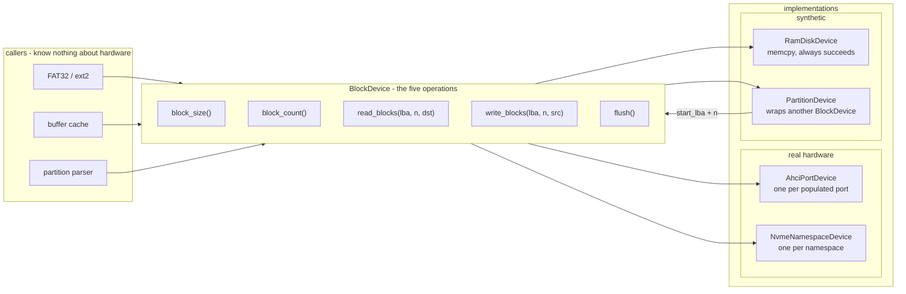

**Why exactly these five.** `block_size` and `block_count` because a caller
cannot compute an address without them and they differ per device — 512 on
QEMU's default AHCI disk, 4096 on many NVMe namespaces. `read_blocks` and
`write_blocks` because that is the entire I/O model of a disk. `flush` because a
disk with a volatile write cache will acknowledge a write it has not yet
committed, and without a flush primitive a filesystem cannot ever promise
durability.

**Why not a `seek`/`read`/`write` byte interface.** Because it would force every
implementation to reimplement the same offset-to-LBA arithmetic, and because a
byte-granular write to a disk does not exist — it is always
read-modify-write of a whole sector. Pushing that up to the caller makes the
cost visible instead of hiding it in the driver.

**`PartitionDevice` pointing back at the interface** is the most important arrow
here. A partition is not a special case in the block layer; it is a
`BlockDevice` implemented in terms of another `BlockDevice`. That composition is
what lets `mount /dev/disk0p2` and `mount /dev/disk0` use identical code paths,
and it is what lets you nest — an image file inside a partition inside a disk —
without new machinery.

**One note on C++.** Virtual functions are fine here. [[ADR-0007 - Freestanding C++20 as the Kernel Language]]
forbids exceptions and RTTI, not vtables. Function-pointer tables (the style
[[Stage 7.3 - The Virtual Filesystem Layer]] uses for VFS nodes) are equally
valid; pick one and be consistent, because the failure mode of a null slot in a
hand-rolled table is a jump to address zero.

---

### 3.3 DMA — the device writes into your RAM

This is the conceptual centre of the phase. Everything strange about storage
drivers follows from this one picture.

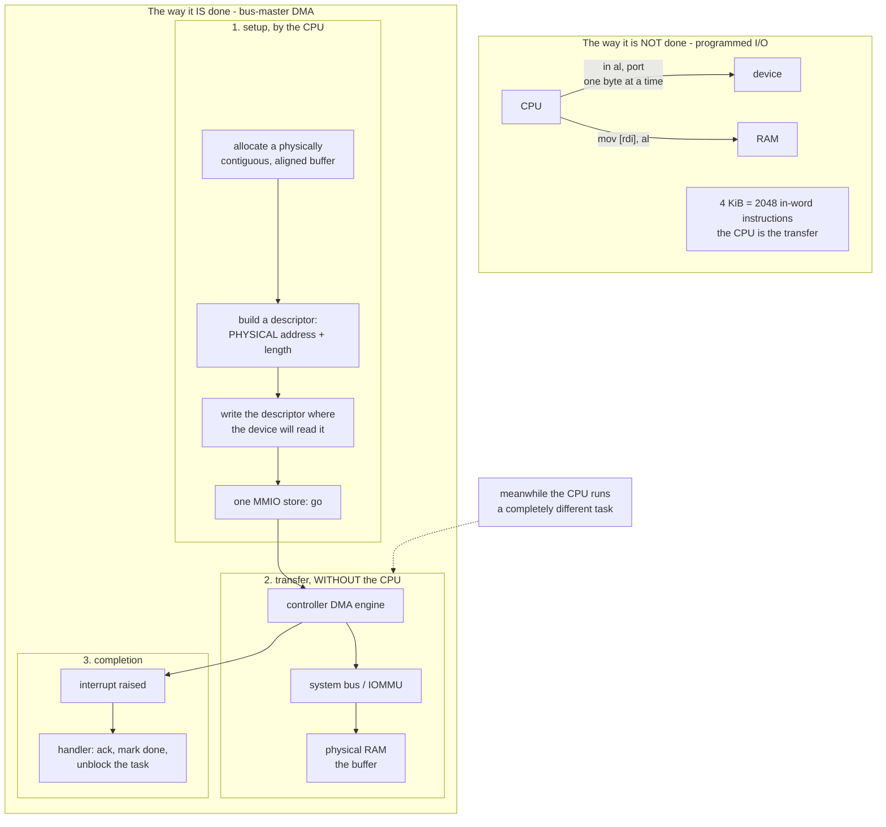

**Programmed I/O**, on the left, is what the keyboard driver does: the CPU reads
a byte from a port and stores it. For 4 KiB that is thousands of instructions
during which the CPU does nothing else, and it scales linearly with the transfer
size. No disk has worked this way since the 1990s.

**Bus-master DMA** inverts the relationship. The CPU builds a *descriptor* — an
address and a length — puts it somewhere the device can find it, and performs a
single store to a register to start the transfer. The device then acts as a bus
master: it drives the system bus itself and writes into RAM at full speed. The
CPU is free the whole time, which is precisely why the calling task blocks and
the scheduler runs something else.

Four consequences follow, and each one is a rule you cannot break.

**Rule 1: the address must be physical.** The device does not have a CR3. It
does not walk your page tables. It has no idea that `0xFFFF800010203000` means
anything. Give it a virtual address and it will write to that number treated as
a physical address — somewhere in the middle of RAM, corrupting whatever lives
there, with no fault and no warning. **This is the classic first AHCI bug** and
it manifests as random corruption in an unrelated subsystem an unknown time
later.

Our layout makes the conversion trivial, and that is not an accident. The
**HHDM** maps all physical RAM at `0xFFFF800000000000`
([[06 - Architecture Overview]], "Memory layout"), so for any buffer that lives
in the HHDM:

```
phys = virt - 0xFFFF800000000000
virt = phys + 0xFFFF800000000000
```

Both directions are a subtraction. A kernel without a direct map needs a
temporary mapping or a reverse page-table walk for every DMA buffer. This is the
payoff for a decision made in Phase 4.

**Rule 2: the memory must be physically contiguous — for the parts that must
be.** `kmalloc` returns memory that is contiguous *virtually*. The heap at
`0xFFFFFFFF00000000` is backed by whatever frames the PMM handed out, in
whatever order. A 16 KiB `kmalloc` can easily be four frames scattered across
RAM. Hand its start address and a 16 KiB length to a device and it writes 16 KiB
of *physically* consecutive memory, three-quarters of which belongs to something
else.

**Rule 3: alignment is not advisory.** AHCI requires the command list on a
1 KiB boundary, the received-FIS area on 256 bytes, and each command table on
128 bytes. NVMe requires queues and PRP targets on page boundaries. These are
enforced by the hardware ignoring the low bits of the address you give it — so a
misaligned structure is silently read from a *different address than you wrote
to*, and the device sees zeros.

**Rule 4: what the frame allocator now has to do.** [[Stage 4.2 - The Physical Frame Allocator]]
answers `alloc_frame()` — one 4 KiB frame. Storage needs `alloc_contiguous(n,
alignment)`, which means scanning the bitmap for a **run** of clear bits at the
right alignment. If the controller does not report 64-bit addressing support
(AHCI `CAP.S64A`), it additionally needs to constrain that run to below 4 GiB.
This is a real, concrete requirement Phase 9 imposes backwards on Phase 4, and
it is why [[Stage 9.2 - DMA and Physically Contiguous Memory]] is its own stage.

#### Scatter-gather: the escape from Rule 2

If DMA truly required one huge contiguous buffer per transfer, the buffer cache
could not work — it hands out 4 KiB frames from all over RAM. Both controllers
solve this the same way: **the descriptor is a list**.

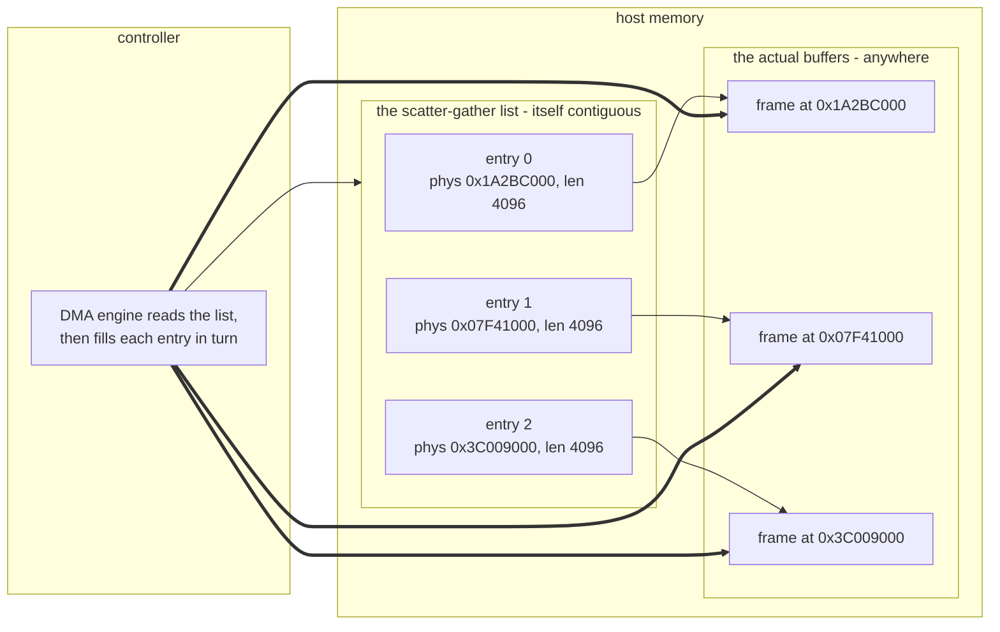

AHCI calls this list the **PRDT** (Physical Region Descriptor Table); NVMe calls
its entries **PRPs** (Physical Region Pages). The mechanism is the same: one
logically contiguous transfer is described as N physically scattered chunks. The
*list itself* must still be contiguous and aligned — but the list is small and
allocated once per command slot, not per transfer.

So Rule 2 refines to: **the control structures must be physically contiguous;
the data need only be page-granular.** That is exactly the granularity the frame
allocator already provides, which is why the buffer cache uses whole frames.

> [!note] Cache coherency, and why x86 lets you off lightly
> On x86-64 DMA is **cache-coherent**: the hardware snoops, so a device write to
> RAM invalidates the corresponding CPU cache line automatically. You do not
> need explicit cache maintenance around DMA buffers. On ARM you would.
> What you *do* still need is **ordering** — the compiler must not reorder your
> descriptor stores after the doorbell store, and the CPU must not either. Use
> `volatile` for MMIO and a compiler barrier (or `sfence` where write-combining
> memory is involved) before the store that says "go". The device reading a
> half-built descriptor is a real failure, and it looks like random corruption.

---

### 3.4 The buffer cache

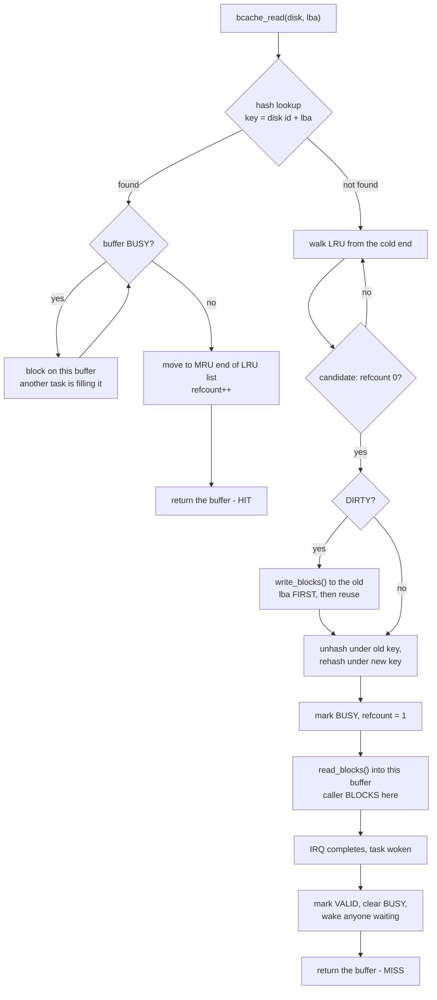

**Why the cache exists at all** is a latency argument with four orders of
magnitude in it. A cached 4 KiB block is a hash lookup: tens of nanoseconds. The
same block from an NVMe SSD is tens of microseconds. From a spinning disk with a
seek, ten milliseconds. Filesystems make this ratio matter because their access
pattern is pathologically repetitive: reading one file touches the superblock,
a block-group descriptor, an inode block, and one or more indirect blocks — and
the *next* file touches most of the same ones. Without a cache, listing a
directory of 100 files reads the same metadata sector 100 times.

**The two data structures, and why both.** The **hash table** answers "do I have
this block" in constant time; a linear scan of a few thousand buffers per read
would eat the benefit. The **LRU list** answers "which buffer may I steal";
without a recency order you evict something you are about to need. Every buffer
is in both at once — the hash by key, the list by recency.

**`BUSY` versus `refcount`.** They are different and conflating them is a
race. `BUSY` means "an I/O is in flight for this buffer; its contents are not
yet meaningful." `refcount` means "N callers hold a pointer to this buffer; do
not evict it." A buffer being read is BUSY *and* referenced. A buffer sitting
valid and unused is neither. A buffer under DMA that gets evicted because
someone only checked `refcount` is a controller writing into memory that now
belongs to a different block — the failure is silent and the corruption arrives
later.

**The `SLEEP → BUSYQ` loop** is the second-reader case: task B asks for a block
that task A is already fetching. B must not issue a second read. It blocks, and
the completion path wakes it. Re-testing the condition in a loop rather than
assuming it after the wake-up is the standard discipline — a lost or spurious
wake-up otherwise proceeds with garbage.

**Write-back before reuse** is the single ordering rule that makes the whole
scheme safe: a dirty victim's contents must reach the disk *at its old address*
before the buffer is rekeyed. Rekey first and you have just lost a write and
possibly written the wrong data to the new address.

#### Write-back versus write-through

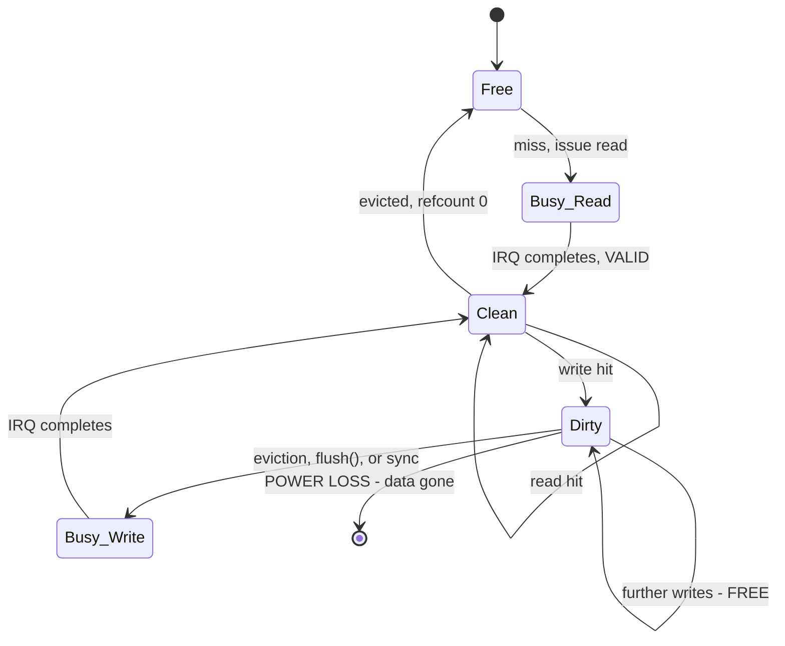

| | Write-through | Write-back (chosen) |
|---|---|---|
| A write returns when | the disk acknowledges | the buffer is marked dirty |
| Cost of `write(1 byte)` × 4096 to one block | 4096 disk writes | 1 disk write |
| Data at risk on power loss | none | everything dirty |
| Ordering guarantees | free — writes hit the disk in call order | must be imposed explicitly |
| Complexity | trivial | dirty list, flusher, `sync`, `fsync` |

**Why write-back.** The `Dirty --> Dirty` self-transition is the entire argument
and it is free. A filesystem extending a file writes the same block-allocation
bitmap block repeatedly within a few microseconds. Write-through turns that into
one disk round-trip each. Write-back turns it into one, later, for all of them.
For metadata-heavy workloads the difference is not a percentage, it is a factor
of ten or more.

**What it costs, stated plainly.** The `POWER LOSS` transition is real. A
write-back cache means acknowledged writes can be lost. There are exactly three
mitigations and this kernel uses all three:

1. **`flush()` on the block device**, which forces the disk's own volatile write
   cache to commit — the cache above is useless if the disk lies below it.
2. **Ordering discipline in the filesystem**: data blocks written before the
   metadata that points at them, so a crash loses the write rather than
   corrupting the structure ([[Phase 10 - Overview]]).
3. **`fsck` at mount** to repair what ordering could not prevent
   ([[Stage 10.9 - fsck and Crash Consistency]]). There is no journal; that is
   an explicit scope decision in [[ADR-0009 - Filesystem Strategy FAT32 then ext2]].

> [!warning] Cache aliasing: the bug you design out, not debug out
> If the cache is keyed on `(partition device, relative LBA)`, then absolute
> sector 304 192 can live in the cache **twice** — once as block 40 000 of
> partition 2, once as block 304 192 of the whole disk — with different contents.
> Whichever is written last wins and the other silently disappears.
> Key the cache on **the underlying disk's identity and the absolute LBA**,
> which places the cache *below* the partition translation. Then aliasing is
> not possible rather than merely unlikely.

---

### 3.5 AHCI, opened up

AHCI is the interface a SATA controller presents. It is a memory-mapped register
block plus a set of host-memory structures the controller reads. Its shape is
inherited: underneath it is still ATA, and ATA is still talking in **FIS**es —
Frame Information Structures, the packets SATA puts on the wire. AHCI's job is
to let you construct those packets in RAM and have the controller send them.

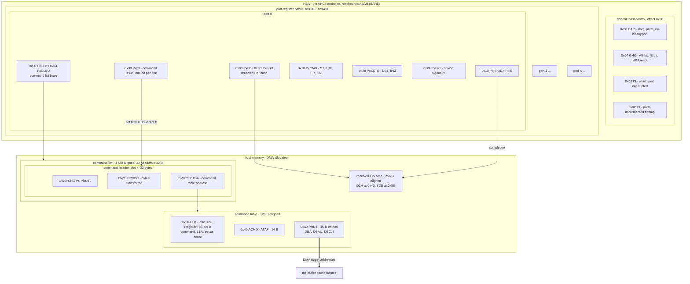

**Walking it.** `ABAR` gives the register block. `CAP` reports how many command
slots and ports the controller supports and whether it can address 64-bit
memory. `GHC.AE` puts the controller in AHCI mode rather than legacy IDE
emulation; `GHC.IE` enables interrupts globally. `PI` is a bitmap of which port
numbers physically exist — iterate that, not 0 to 31.

**Per port**, `PxSSTS` tells you whether anything is attached: detection value 3
with interface power management 1 means "device present and communication
established." `PxSIG` then says what kind — `0x00000101` for a plain SATA disk,
`0xEB140101` for SATAPI. `PxCMD` starts and stops the port's command engine and
its FIS receive engine, and you must stop both before changing `PxCLB` or
`PxFB`, then wait for the `CR` and `FR` status bits to clear.

**The three host structures are the interesting part**, and they nest three
deep:

1. **The command list** — 32 command headers of 32 bytes each, 1 KiB total, on a
   1 KiB boundary. `PxCLB` points at it. Slot *k* is a command you have prepared.
2. **A command header** — mostly a pointer. `CFL` says how many dwords of command
   FIS follow; `W` says this is a write; `PRDTL` says how many scatter-gather
   entries; `CTBA` points to the command table. `PRDBC` is written *by the
   controller* with the byte count actually transferred, and comparing it to what
   you asked for is your only cheap integrity check.
3. **The command table** — the actual command. The first 64 bytes are a **Host to
   Device Register FIS** (type `0x27`) carrying the ATA command byte
   (`0x25` READ DMA EXT, `0x35` WRITE DMA EXT, `0xEC` IDENTIFY DEVICE,
   `0xEA` FLUSH CACHE EXT), the 48-bit LBA split across six fields, and the
   sector count. At offset `0x80` begins the PRDT.

**Issuing** is one store: set bit *k* of `PxCI`. The controller notices, fetches
header *k*, fetches the command table, sends the FIS, runs the DMA, and clears
bit *k*. **Completion** is signalled by that bit clearing *and* by a bit in
`PxIS`; the device-to-host Register FIS lands in the received-FIS area at offset
`0x40` carrying the ATA status and error registers.

**Why this is more complicated than it needs to be.** Because it is not a
storage protocol — it is a *bridge* to one. Every layer in that nesting exists to
preserve an ATA concept: the FIS because SATA serialises ATA's register file,
the ATAPI field because optical drives tunnel SCSI, the port structure because
SATA inherited a per-cable model from parallel ATA. AHCI is a 2004 wrapper around
a 1994 command set around a 1986 register interface, and it shows.

---

### 3.6 NVMe, opened up

NVMe was designed in 2011 with no legacy to preserve, for devices where the
media has no seek time and the queue depth is the performance variable. It threw
away the register-file model entirely and replaced it with **queue pairs in host
memory**.

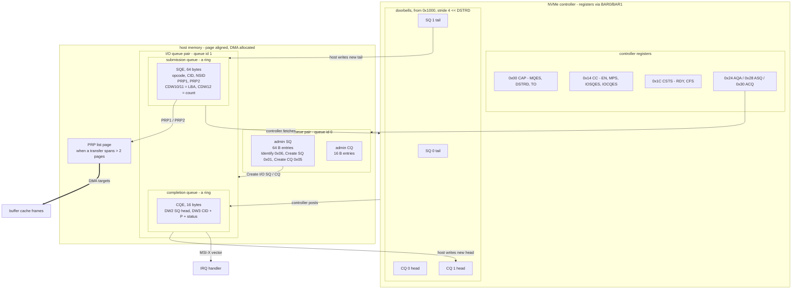

**Bring-up** is short. Read `CAP` for the maximum queue size, doorbell stride,
and the enable timeout. Clear `CC.EN` and wait for `CSTS.RDY` to clear. Allocate
the admin submission and completion queues, point `ASQ` and `ACQ` at their
physical addresses, set the sizes in `AQA`. Set `CC.EN` and wait for `CSTS.RDY`.
Then use the admin queue to `Identify` the controller and its namespaces, and to
`Create I/O Completion Queue` and `Create I/O Submission Queue`. That is the
entire initialisation.

**A queue pair** is two rings in host memory. The **submission queue** is written
by the host and read by the controller; the **completion queue** is the reverse.
Each ring has a head and a tail; the side that produces advances the tail, the
side that consumes advances the head. The **doorbell** register is how the
producer tells the other side it moved — the *only* MMIO write in the entire I/O
path.

**A submission queue entry** is 64 bytes. Opcode `0x02` is Read, `0x01` is
Write, `0x00` is Flush. `NSID` selects the namespace. `PRP1` and `PRP2` describe
the data buffer: for one page, `PRP1` alone; for two, `PRP1` and `PRP2`; for
more, `PRP2` points at a page full of 64-bit physical addresses. `CDW10`/`CDW11`
carry the 64-bit starting LBA and `CDW12`'s low 16 bits the block count, **zero
based** — a value of 0 means one block, and misreading that is a classic
off-by-one that reads nothing at all.

**The phase tag** is the piece worth understanding. The controller writes
completion entries into a ring the host also walks. How does the host know
whether the entry at the head is new or left over from the previous lap? Bit 16
of DW3 is the **P** bit, and it inverts every time the ring wraps. The host
keeps its own expected phase and flips it on wrap. An entry whose P matches the
expected phase is new. This means **completion detection requires no MMIO read
at all** — the host polls its own cached memory, which the DMA write has already
invalidated. On AHCI, checking completion means reading `PxCI` over the PCI bus,
which costs on the order of a microsecond.

**Why the newer protocol is architecturally simpler:**

| | AHCI | NVMe |
|---|---|---|
| Structures per command | command header → command table → CFIS → PRDT (4 levels) | one 64-byte SQE (1 level) |
| Command encoding | an ATA register file serialised into a FIS | a flat opcode + dwords |
| Queues | one per port, 32 slots, `PxCI` bitmap | up to 65 535 pairs, up to 65 536 entries each |
| Completion detection | MMIO read of `PxCI` and `PxIS` | memory read of the phase bit |
| Per-core scaling | one shared port, one interrupt | one queue pair and one MSI-X vector per core |
| Legacy carried | ATA, ATAPI, port multipliers, PIO modes | none |

Newer is usually more complicated. NVMe is the exception because it was allowed
to delete things. It exists precisely because AHCI's single 32-slot queue and
MMIO-heavy completion path became the bottleneck once the media stopped being
the bottleneck.

> [!question] Worth arguing about
> If NVMe is simpler *and* faster, why implement AHCI at all? Answer in terms of
> what QEMU gives you by default, what a 2015 laptop has, and what the second
> implementation proves about [[Stage 9.1 - The Block Device Interface]] that the
> first cannot.

---

### 3.7 Partition tables

The disk is one flat array of sectors. Something must divide it. That something
is a data structure in the first few sectors, and there are two of them because
the first one ran out of address bits.

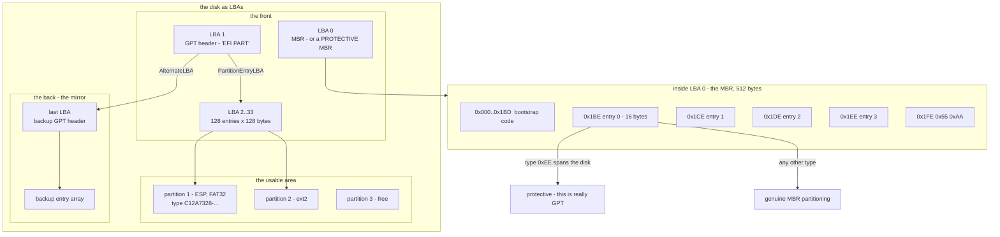

**The parse order is fixed and it matters.** Read LBA 0. Check for `0x55 0xAA`
at offset `0x1FE`. Look at the four 16-byte entries. If entry 0 has type `0xEE`
and spans the disk, this is a **protective MBR** — the disk is GPT-partitioned,
and the protective MBR exists solely so that a GPT-unaware tool sees one
unknown partition covering everything rather than an empty disk it might helpfully
reformat. In that case, read LBA 1 and parse GPT. Otherwise parse the MBR
entries as real partitions.

**An MBR entry** is 16 bytes: a boot flag, three bytes of CHS start (dead), a
one-byte type, three bytes of CHS end (dead), a 32-bit starting LBA and a 32-bit
sector count, both little-endian. Only the last eight bytes matter. The 32-bit
sector count is the format's grave: 2³² × 512 bytes is **2 TiB**, and that is
the hard limit.

**A GPT header** is at LBA 1 and self-describes everything else:

| Offset | Size | Field | Notes |
|---|---|---|---|
| 0x00 | 8 | Signature | ASCII `EFI PART` |
| 0x08 | 4 | Revision | `0x00010000` for 1.0 |
| 0x0C | 4 | HeaderSize | normally 92 |
| 0x10 | 4 | HeaderCRC32 | computed with this field zeroed |
| 0x18 | 8 | MyLBA | must equal the LBA it was read from |
| 0x20 | 8 | AlternateLBA | the backup header, normally the last LBA |
| 0x28 | 8 | FirstUsableLBA | |
| 0x30 | 8 | LastUsableLBA | |
| 0x38 | 16 | DiskGUID | |
| 0x48 | 8 | PartitionEntryLBA | normally 2 |
| 0x50 | 4 | NumberOfPartitionEntries | normally 128 |
| 0x54 | 4 | SizeOfPartitionEntry | normally 128 — **use this, do not assume** |
| 0x58 | 4 | PartitionEntryArrayCRC32 | over `Number × Size` bytes |

**A GPT entry** is 128 bytes: a 16-byte partition **type GUID**, a 16-byte unique
GUID, an 8-byte starting LBA, an 8-byte **inclusive** ending LBA, 8 bytes of
attributes, and 72 bytes of UTF-16LE name. An entry whose type GUID is all zeros
is unused — and unused entries can appear *before* used ones, so iterate all
`NumberOfPartitionEntries`, do not stop at the first hole.

Three traps that GPT builds in deliberately, and one it does not:

- **Both CRC32s must be checked.** GPT is the only structure in this kernel that
  comes with its own integrity check. Skipping it means happily mounting a
  corrupt table. The header CRC is computed over `HeaderSize` bytes with the CRC
  field itself zeroed — a detail people get wrong once each.
- **Fall back to the backup.** `AlternateLBA` points at a full second copy at the
  end of the disk. If the primary fails its CRC, read that. This is the format
  doing your error recovery for you.
- **`EndingLBA` is inclusive.** Sector count is `end - start + 1`. Omitting the
  `+ 1` produces a partition one sector short, which corrupts only the very last
  block of a filesystem and therefore fails months later.
- **GUIDs are mixed-endian.** The first three fields of a GUID are little-endian
  and the last two are big-endian. A byte-for-byte comparison against a GUID you
  typed out of a specification will not match. Compare against the raw byte
  sequence, or convert carefully.

> [!example] Reading byte 4 097 of a file on partition 2
> Concrete numbers, one layer at a time.
>
> 1. GPT entry 1 says partition 2 starts at **LBA 264 192** and the disk reports
>    a 512-byte sector.
> 2. The cache uses 4 KiB blocks, so one cache block is **8 sectors**.
> 3. Byte 4 097 is in file block **1** at offset **1** — integer division, not
>    subtlety.
> 4. FAT32 walks the cluster chain and says file block 1 is partition block
>    **5 000**.
> 5. `PartitionDevice` translates: absolute LBA = 264 192 + 5 000 × 8 =
>    **304 192**.
> 6. The cache hashes `(disk0, 304192)`. Miss. It takes a clean victim buffer
>    whose frame is at physical `0x1A2BC000`, virtual
>    `0xFFFF80001A2BC000` through the HHDM.
> 7. The AHCI driver builds one PRDT entry: `DBA = 0x1A2BC000`, `DBC = 4095`
>    — byte count **minus one**, as the hardware requires — and a CFIS with
>    command `0x25`, LBA 304 192, sector count 8.
> 8. It sets bit 0 of `PxCI`. The task blocks.
> 9. The controller DMAs 4 096 bytes into `0x1A2BC000` and interrupts.
> 10. The task wakes, the buffer is marked VALID, and the byte the caller asked
>     for is at `0xFFFF80001A2BC001`.
>
> Every number in step 7 is physical. Every number in step 10 is virtual. That
> is the whole discipline of DMA in one worked example.

---

## 4. The data structures

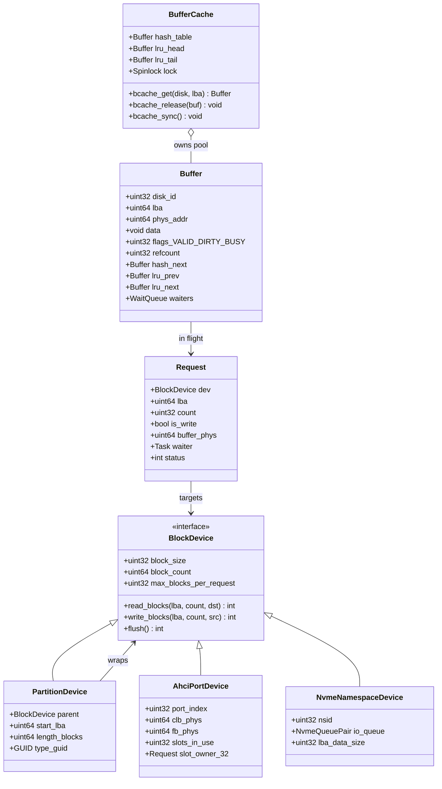

**`Buffer` carries both addresses.** `data` is the virtual pointer callers use;
`phys_addr` is what goes in a PRDT or PRP. Storing both, computed once at pool
setup, removes every opportunity to convert one into the other at the wrong
moment. It costs 8 bytes per buffer and it eliminates an entire bug class.

**`Request` exists so the interrupt handler has somewhere to look.** When the
controller says "slot 3 finished", the handler needs to get from `3` to a task
to wake. `slot_owner` in the port device is that map. Without it, completion is
unattributable.

**`max_blocks_per_request`** is not decoration. AHCI's PRDT is bounded, NVMe's
PRP list is bounded by one page of pointers unless you chain, and both
controllers have a maximum transfer size. The cache must break a large request
into pieces, and it needs the driver to tell it where the boundary is.

### AHCI command header, DW0 — bit layout

| Bits | Field | What you write |
|---|---|---|
| 0–4 | CFL | command FIS length **in dwords**; 5 for a Register H2D FIS |
| 5 | A | ATAPI — 0 for a disk |
| 6 | W | 1 for a write (host → device), 0 for a read |
| 7 | P | prefetchable — leave 0 |
| 8 | R | reset |
| 9 | B | BIST |
| 10 | C | clear busy on R_OK |
| 11 | reserved | 0 |
| 12–15 | PMP | port multiplier port — 0 |
| 16–31 | PRDTL | number of PRDT entries |

`CFL` is in **dwords, not bytes**. Writing 20 there is a classic error; the
correct value for the 20-byte Register H2D FIS is 5.

### AHCI PRDT entry — 16 bytes

| Offset | Size | Field | Note |
|---|---|---|---|
| 0x0 | 4 | DBA | data base address, low 32 bits, **must be even** |
| 0x4 | 4 | DBAU | high 32 bits — zero unless `CAP.S64A` |
| 0x8 | 4 | reserved | 0 |
| 0xC | 4 | DBC + I | bits 0–21 = byte count **minus one**; bit 31 = interrupt on completion |

Byte count minus one, and it must describe an even number of bytes. A 4 096-byte
region is `4095`. Writing `4096` transfers 4 097 bytes and overruns the buffer by
one — which is exactly the kind of off-by-one that corrupts the *next* buffer in
the pool.

### NVMe submission queue entry — 64 bytes

| Dword | Field | Note |
|---|---|---|
| 0 | CDW0 | bits 0–7 opcode, bits 16–31 **command identifier (CID)** |
| 1 | NSID | namespace |
| 2–3 | reserved | |
| 4–5 | MPTR | metadata pointer |
| 6–7 | PRP1 | first physical region — may carry a byte offset |
| 8–9 | PRP2 | second page, or a pointer to a PRP list page |
| 10–11 | CDW10/11 | starting LBA, 64-bit |
| 12 | CDW12 | bits 0–15 = number of blocks, **zero based** |
| 13–15 | CDW13/14/15 | command specific |

### NVMe completion queue entry — 16 bytes

| Dword | Field |
|---|---|
| 0 | command specific |
| 1 | reserved |
| 2 | bits 0–15 SQ head pointer, bits 16–31 SQ identifier |
| 3 | bits 0–15 CID, **bit 16 phase (P)**, bits 17–31 status |

The CID is what ties a completion back to a request. Allocate CIDs from a
per-queue table and index it directly on completion — searching a list is
unnecessary and, in an interrupt handler, unacceptable.

### MBR partition entry — 16 bytes at 0x1BE + 16n

| Offset | Size | Field |
|---|---|---|
| 0x0 | 1 | status — `0x80` active, `0x00` inactive |
| 0x1 | 3 | CHS start — ignore |
| 0x4 | 1 | partition type — `0xEE` means protective/GPT |
| 0x5 | 3 | CHS end — ignore |
| 0x8 | 4 | starting LBA, little-endian |
| 0xC | 4 | number of sectors, little-endian |

---

## 5. The flows

### 5.1 A read that misses the cache, end to end

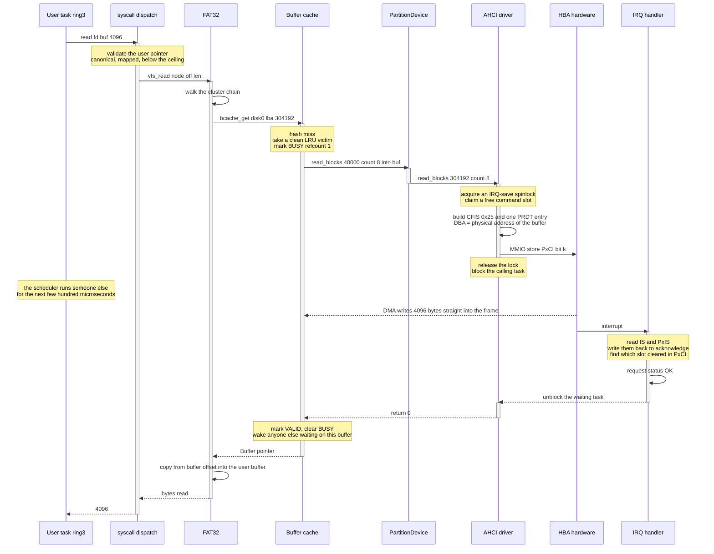

**What to notice, in order.**

The **dashed arrow from H to C** is the only data transfer in the diagram, and it
does not pass through any participant. That is DMA drawn honestly: the bytes
arrive in the cache's memory without the cache, the driver, or the CPU touching
them.

**The block point** is inside the driver, after the doorbell and after the lock
is released. Releasing before blocking is mandatory — sleeping while holding a
spinlock deadlocks every other CPU that wants it. This is where
[[Stage 5.4 - Sleep and Blocking]] stops being a teaching exercise.

**Acknowledging the interrupt** means writing the status bits back to the device
(AHCI status registers are write-1-to-clear, both at the port and at the HBA
level). Miss either and the line stays asserted and you take the same interrupt
forever, which presents as a completely frozen machine.

**The copy to the user buffer happens in the filesystem layer**, in process
context, after the wake-up. Not in the interrupt handler. The handler's entire
job is: acknowledge, attribute, unblock.

### 5.2 The same read on NVMe

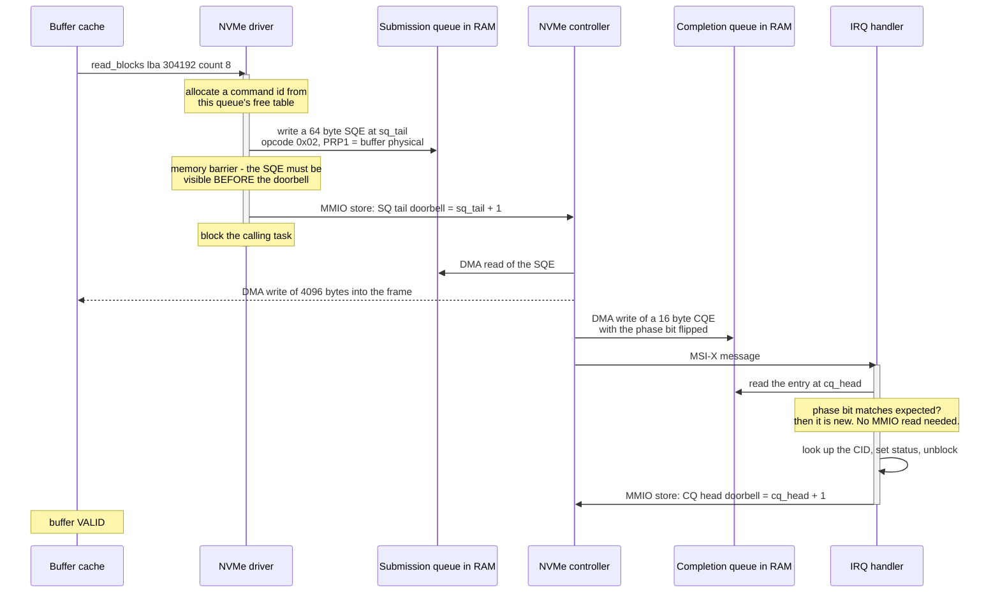

The structural difference is visible in the participant list: **the queues are
participants**. On AHCI the driver talks to the hardware and the hardware talks
back through registers. On NVMe both sides talk to shared memory and use exactly
two MMIO stores per command — one doorbell each way — with no MMIO reads at all
in the fast path. That is the architecture, and it is why one NVMe device can
sustain millions of operations per second while an AHCI port cannot.

The **memory barrier before the doorbell** is not optional. The store that
publishes the doorbell must not become visible before the stores that built the
SQE, or the controller fetches a half-written command.

### 5.3 Write-back: where a write actually goes

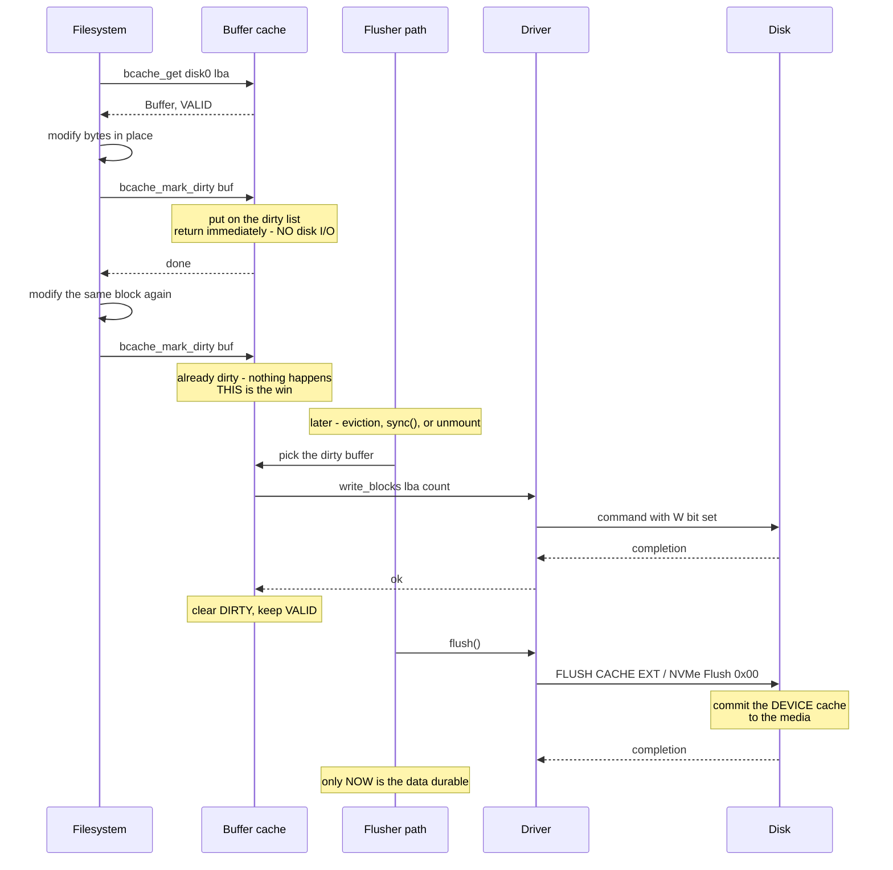

**The second `bcache_mark_dirty` doing nothing** is the entire performance
argument for write-back, made visible.

**The `flush()` at the end** is the part people omit. Writing a block to the
controller means the controller has it — a modern disk holds it in a volatile
DRAM cache and acknowledges immediately. Without the explicit flush command,
`sync()` returns having guaranteed nothing at all, and the power-loss window you
thought you closed is still open.

---

## 6. Why it is shaped this way

| Decision | Alternative | Cost of the alternative | Verdict |
|---|---|---|---|
| Block interface **before** drivers | Write AHCI first, extract an interface later | The interface ends up AHCI-shaped: 32 slots, ports, FIS. NVMe then does not fit and gets bolted on. Phase 10 cannot start in parallel. | ✅ interface first |
| **Two** drivers (AHCI + NVMe) | One driver | An abstraction with one implementation is indirection. The second implementation is what proves the seam is real. | ✅ both |
| Cache **below** the partition layer | Cache per partition device | The same physical sector cached twice under two keys; last writer wins, the other write vanishes. | ✅ key on disk + absolute LBA |
| **Write-back** | Write-through | 10× more disk writes on metadata-heavy work; correct but unusable. | ✅ write-back + ordering + fsck |
| **Whole 4 KiB frames** as buffers | `kmalloc`ed buffers | Not physically contiguous, not page-aligned, and virt→phys is a page-table walk instead of a subtraction. | ✅ frames from the PMM |
| Store `phys_addr` in the buffer | Convert at use | One conversion site somewhere gets it wrong; the symptom is corruption elsewhere, minutes later. | ✅ store both |
| **Interrupt-driven** completion | Poll `PxCI` in a loop | A CPU burned for 10 ms per spinning-disk read. The whole point of blocking is undone. | ✅ interrupts |
| Parse **both** GPT and MBR | GPT only | Cannot read a QEMU image made with `fdisk`, USB sticks, or anything pre-2010. | ✅ both, GPT first |
| **No IOMMU** in v1 | Program the IOMMU for DMA | A misprogrammed device address is unconstrained and can hit anything. Accepted for v1; revisit in [[Phase 15 - Overview]]. | ⚠️ accepted risk |
| A RAM disk stub | Only real hardware | Phase 10 blocked on Phase 9 finishing; no Tier-1 testable path for cache logic. | ✅ stub from day one |

**What breaks under the rejected options, specifically.**

*Driver-first.* The interface you extract afterwards inherits the vocabulary of
whichever driver you wrote. You end up with `submit_command_slot()` on something
that has no slots, and every NVMe operation pretends to be an AHCI one.

*Write-through.* Correctness is not the problem; it is genuinely safer. The
problem is that ext2 updates a block bitmap once per allocated block, and a
`cp` of a 10 MiB file allocates 2 560 blocks. Write-through makes that 2 560
synchronous disk round-trips instead of a handful.

*Cache above the partition layer.* The failure is a filesystem that reads back
data it did not write, only when two mounts touch the same disk, only sometimes.
There is no debugging session that finds this quickly. Design it out.

*Polling.* It works, and it is the right first step during bring-up because it
removes the interrupt path from the set of things that can be broken. It is not
shippable: [[Stage 5.4 - Sleep and Blocking]] exists precisely so the CPU can do
something useful during those milliseconds.

Related decisions: [[ADR-0009 - Filesystem Strategy FAT32 then ext2]] (why a
block layer must exist before Phase 10), [[ADR-0007 - Freestanding C++20 as the Kernel Language]]
(what the driver may use), [[ADR-0010 - Testing Strategy and the QEMU Exit Device]]
(how any of this gets tested).

---

## 7. How this grows across the phases

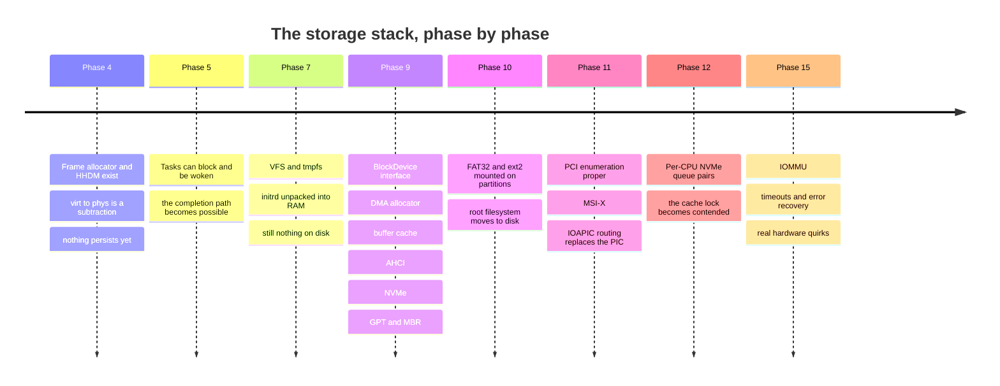

**What is deliberately missing early, and why that is acceptable.**

**No storage at all before Phase 9.** Phases 0–8 run entirely from RAM, with the
initrd unpacked into tmpfs. This is not laziness — it means the VFS, the process
model, and the shell are all working and debuggable before a single asynchronous
device exists. Introducing the first non-instantaneous driver into a system that
already has a scheduler and a shell is a far smaller step than introducing it
into a kernel that has neither.

**No NCQ, no request merging, no I/O scheduler.** AHCI supports Native Command
Queuing — up to 32 outstanding commands reordered by the drive — and we issue
one at a time. NVMe supports 65 535 queue pairs and we use one. Both are correct
and both leave performance on the table. That is the right trade: depth is a
throughput optimisation, and until there are concurrent processes doing real I/O
there is nothing to be deep about. Phase 12 is when it starts to matter, because
that is when one queue pair per core becomes the natural design.

**No IOMMU.** Until Phase 15, a device given a bad physical address can write
anywhere in RAM. Under QEMU with code you wrote yourself, this is a bug-finding
problem, not a security problem. On real hardware with a real threat model it is
both.

**No timeouts.** A command that never completes blocks its task forever, and the
symptom is a shell that stops responding. Adding a timeout requires a monotonic
clock ([[Stage 11.6 - HPET and TSC Calibration]]) and an error-recovery path that
resets the port or the controller — genuinely hard, correctly deferred, and
listed in Phase 15.

---

## 8. Failure modes

Symptom first. This is the section to read at 2am.

> [!warning] Every MMIO read returns `0xFFFFFFFF`
> The device is not decoding memory accesses. Either the BAR was never
> programmed, or **bit 1 of the PCI command register** (memory space enable) is
> clear, or you mapped the BAR's physical address without actually mapping it —
> and are reading unmapped memory. Check the command register first; it is one
> read and it is usually the answer.

> [!warning] The command is accepted, `PxCI` never clears, no interrupt ever arrives
> **Bit 2 of the PCI command register — bus master enable — is clear.** The
> controller is not permitted to touch memory, so it cannot fetch the command
> list. It sits there. Nothing in the AHCI registers tells you this; you have to
> already know.

> [!warning] The read completes, the buffer is unchanged, and something unrelated is corrupted
> You gave the device a **virtual** address. It wrote your data to that number
> interpreted as a physical address. The corruption is real, it is somewhere
> else, and it will surface as a crash in a subsystem that has nothing to do
> with storage. Every address in a PRDT, a PRP, `PxCLB`, `PxFB`, `ASQ`, or `ACQ`
> must be physical. Add a `KASSERT` that rejects any address above the
> non-canonical hole.

> [!warning] Works with one PRDT entry, corrupts with more than one
> The buffer is `kmalloc`ed and physically discontiguous, and you described it
> as one region. It worked at 4 KiB because one allocation happened to fit in a
> single frame. Use the DMA allocator, or split the description at frame
> boundaries.

> [!warning] Everything works in QEMU, nothing works on real hardware
> The two usual causes. **Alignment:** QEMU ignores the low bits you got wrong;
> silicon does not. Assert 1 KiB on the command list, 256 B on the FIS area,
> 128 B on each command table, page alignment on NVMe queues. **Port reset:**
> QEMU's AHCI is forgiving about a port that was not properly stopped and
> restarted; a real HBA will simply refuse to run commands. Stop `ST` and `FRE`,
> wait for `CR` and `FR` to clear, then reprogram.

> [!warning] The machine freezes completely the instant the first I/O completes
> The interrupt was not acknowledged. AHCI needs the port's `PxIS` bits written
> back **and** the corresponding bit in the global `IS` register written back —
> both are write-1-to-clear, and clearing only one leaves the line asserted. The
> CPU then re-enters the handler forever. Under QEMU, `-d int` shows the same
> vector repeating.

> [!warning] Reads return the previous block's contents
> Off-by-one in a zero-based field. NVMe `CDW12`'s block count is **zero based**
> — 0 means one block. AHCI's PRDT byte count is **minus one** — 4 095 means
> 4 096 bytes. Both fields punish the natural reading.

> [!warning] The file is right until you reboot, then it is stale or gone
> Dirty buffers were never flushed, or they were flushed to the controller but
> `flush()` was never issued so the disk's own volatile cache lost them. `sync`
> on shutdown must walk the dirty list *and* issue the device flush.

> [!warning] Partition 2 mounts, but writing to it corrupts partition 3
> `EndingLBA` in GPT is **inclusive**, and the bounds check in
> `PartitionDevice::read_blocks` is either missing or off by one. That bounds
> check is the only thing that makes partitions a safety boundary rather than a
> naming convention.

> [!warning] The disk is detected but reports zero capacity
> The `IDENTIFY DEVICE` (AHCI) or `Identify Namespace` (NVMe) response was read
> before the DMA completed, or from the wrong offset. Both return their data by
> DMA into a buffer you supplied — they are ordinary commands, not register
> reads, and they must be waited on like any other.

> [!warning] Random corruption that only appears under load
> A buffer was evicted while a DMA into it was still in flight. The check before
> eviction must be `refcount == 0 && !BUSY`, not `refcount == 0`. Under light
> load the transfer always finishes before the buffer becomes a victim, so this
> reproduces only when the cache is full and busy.

---

## 9. Masterclass notes

> [!question] Discussion prompts
> 1. The DMA engine writes into a frame the buffer cache owns. Nothing in the
>    page tables mentions that frame's use, and the device does not consult page
>    tables anyway. **What, concretely, prevents the frame allocator from handing
>    that same frame to a process while the transfer is in flight?** Name the
>    field and the check.
> 2. NVMe is newer than AHCI and simpler than AHCI. Explain that without using
>    the word "modern". What did NVMe get to *delete*, and what forced AHCI to
>    keep it?
> 3. You are asked to make the buffer cache 8 KiB per entry instead of 4 KiB.
>    List everything that changes — in the cache, in the DMA path, and in the
>    filesystem layer — and decide whether it is worth it.
> 4. A write-back cache can lose acknowledged writes. A write-through cache
>    cannot. We chose write-back. **Reconstruct the argument from first
>    principles**, then say what a database would have to do on top of our
>    interface to get durability back.
> 5. GPT ships two CRC32s and a full backup copy at the other end of the disk.
>    MBR ships neither. What does that tell you about what the designers of each
>    expected to go wrong, and which of those expectations was correct?

Checkpoints — you understand this when you can:

- [ ] Draw the five layers of §2 from memory and say what each one hides from
      the one above.
- [ ] Explain why a `kmalloc`ed buffer is unsafe for DMA, and give two different
      correct fixes.
- [ ] State the two fields the cache checks before evicting a buffer, and the
      failure mode of checking only one.
- [ ] Trace a cache miss from `read()` to the doorbell store, naming which
      component holds control at each step and where the task blocks.
- [ ] Explain the NVMe phase bit and why it removes an MMIO read from the fast
      path.
- [ ] Name the two PCI command-register bits that must be set, and the distinct
      symptom of each being clear.
- [ ] Say why the buffer cache is keyed on absolute LBA rather than
      partition-relative LBA.
- [ ] Explain why AHCI needs four levels of structure per command and NVMe needs
      one.

**Board plan** — the order to draw this on a whiteboard:

1. One horizontal line. Above it: "a file". Below it: "sectors 0…N". State that
   the whole subsystem lives on that line.
2. Five stacked boxes: filesystem, cache, partition, block interface, driver.
   Draw the request going down the left edge.
3. Off to the right: RAM and the controller. Draw the DMA arrow from the
   controller **directly into the cache's box**, crossing all the layers. Let
   that land.
4. Draw the interrupt as a *separate, thin* arrow going to a different place.
   Say aloud: data goes to memory, control goes to the CPU.
5. Open the cache: hash table, LRU list, and a buffer with its three flag bits.
   Do the hit path, then the miss path, then the dirty-eviction path.
6. Open the driver box twice, side by side. Left: AHCI's four nested structures.
   Right: NVMe's one SQE plus two rings. Do not explain either yet — let the
   picture make the comparison.
7. Add the doorbells. One MMIO store each way for NVMe; register reads for AHCI.
   Now explain the difference.
8. Draw the disk's first 34 sectors. Protective MBR, header, entry array. Draw
   the backup at the far end and the arrow from `AlternateLBA` to it.
9. Return to step 3's arrow and ask the room what stops that frame from being
   reallocated. Finish on the answer.

**Time budget:** 55 minutes. 15 on DMA — it is the concept everything else
depends on and the one that does not survive being rushed. 15 on the cache.
15 on AHCI versus NVMe. 10 on partitions and the failure modes.

---

## 10. Related

**Documents:** [[06 - Architecture Overview]] · [[12 - The Filesystem Stack]] · [[07 - Memory Management]] · [[08 - Interrupts and Exceptions]] · [[19 - The Eight-Hour Masterclass]] · [[14 - Debugging Playbook]] · [[04 - Glossary]]

**Phases:** [[Phase 9 - Overview]] · [[Phase 10 - Overview]] · [[Phase 11 - Overview]] · [[Phase 4 - Overview]] · [[Phase 12 - Overview]] · [[Phase 15 - Overview]]

**Stages that build this:** [[Stage 9.1 - The Block Device Interface]] · [[Stage 9.2 - DMA and Physically Contiguous Memory]] · [[Stage 9.3 - The Buffer Cache]] · [[Stage 9.4 - PCI Device Discovery for Storage]] · [[Stage 9.5 - The AHCI Driver]] · [[Stage 9.6 - The NVMe Driver]] · [[Stage 9.7 - Partition Table Parsing]]

**Stages this depends on:** [[Stage 4.2 - The Physical Frame Allocator]] · [[Stage 4.3 - Enabling Paging]] · [[Stage 4.4 - The Kernel Heap]] · [[Stage 5.4 - Sleep and Blocking]] · [[Stage 7.3 - The Virtual Filesystem Layer]] · [[Stage 11.3 - PCI Enumeration]] · [[Stage 11.5 - The I/O APIC]]

**Decisions:** [[ADR-0009 - Filesystem Strategy FAT32 then ext2]] · [[ADR-0007 - Freestanding C++20 as the Kernel Language]] · [[ADR-0010 - Testing Strategy and the QEMU Exit Device]]
