# 12 — The Filesystem Stack

> [!abstract] What this document covers
> The `fs/` box from the subsystem map in [[06 - Architecture Overview]], opened up.
> It covers the Virtual File System — the layer that lets one `open`/`read`/`write`
> serve three completely different on-disk formats — and the two real filesystems
> underneath it, FAT32 and ext2. It stops where the block layer begins: how a sector
> gets off the platter belongs to [[Phase 9 - Overview]], not here.

**Zoom level:** Subsystem
**Built by:** [[Stage 7.1 - The Initial Ramdisk]], [[Stage 7.2 - A Read-Only Filesystem]], [[Stage 7.3 - The Virtual Filesystem Layer]], [[Stage 10.1 - Mounting and the Mount Table]], [[Stage 10.2 - FAT32 Read]], [[Stage 10.5 - ext2 Read]]
**Prerequisites:** [[06 - Architecture Overview]], [[Phase 9 - Overview]], [[ADR-0009 - Filesystem Strategy FAT32 then ext2]]
**Masterclass session:** 6 (see [[19 - The Eight-Hour Masterclass]])

> [!warning] The Phase 7 stage notes are older than two ADRs
> [[Stage 7.1 - The Initial Ramdisk]] and [[Stage 7.2 - A Read-Only Filesystem]] were
> written before [[ADR-0003 - Limine as the Bootloader]] and
> [[ADR-0009 - Filesystem Strategy FAT32 then ext2]]. They say "GRUB", "Multiboot
> module", and "read-only tar filesystem". The current design is: **Limine** loads
> `initrd.tar` as a module, and the tar is **unpacked into a writable `tmpfs`** at
> boot rather than being read in place. Where the stage notes and the ADRs disagree,
> the ADRs win. Everything else in those stages — the USTAR header layout, the octal
> size field, the ops-table shape of the VFS — still stands.

---

## 1. The one-sentence version

**A filesystem turns a numbered array of fixed-size blocks into named files arranged
in a tree, and the VFS is the layer that makes every filesystem look the same to
everyone above it.**

A disk does not have files. It has sectors: numbered slots of 512 or 4096 bytes,
addressed by an integer (a **Logical Block Address**, or LBA), with no names, no
sizes, no directories and no ordering beyond the numbers. A **filesystem** is a
convention for laying data structures across those sectors so that the byte string
`"/home/ada/notes.txt"` can be turned into a list of sector numbers. A **Virtual File
System (VFS)** sits one level above that: it defines what a file, a directory and a
mounted volume *are* in the abstract, and then lets several different on-disk
conventions each supply their own implementation. The kernel's `sys_open` calls the
VFS. The VFS calls whichever filesystem owns that part of the tree. Nothing above the
VFS knows or cares whether the answer came from RAM, from a FAT32 partition, or from
ext2 inodes.

This document argues that the indirection earns its cost, shows the four objects the
VFS is built from, walks path resolution one component at a time, and then opens
FAT32 and ext2 far enough to see why they are opposite designs.

---

## 2. The picture

This is the whole stack, from a user program's `open()` down to a physical sector.
Every later diagram is a zoom into one box of this one.

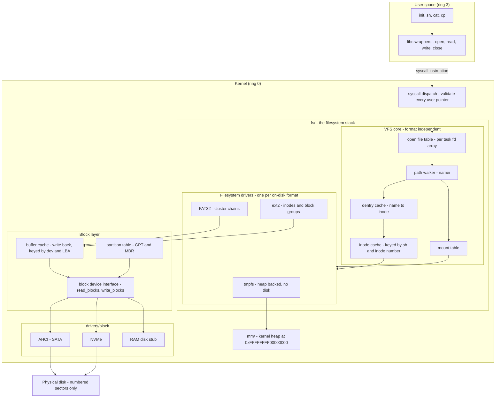

### Walking every box

- **`init, sh, cat, cp`** — ordinary ring 3 programs. They know paths and file
  descriptors and nothing else. A file descriptor (**fd**) is just a small
  non-negative integer the kernel hands back from `open`; it indexes a per-task array.
- **`libc wrappers`** — three-line functions that put the syscall number in `rax`,
  the arguments in `rdi, rsi, rdx, r10, r8, r9`, execute `syscall`, and translate a
  negative return into `errno`. **`r10`, not `rcx`** — the `syscall` instruction
  overwrites `rcx` with the return address. See [[06 - Architecture Overview]].
- **`syscall dispatch`** — the privilege boundary. Ring 3 becomes ring 0 here. Its
  filesystem-specific job is to copy the path string *out of* user memory into a
  kernel buffer with a bounded copy, capped at `PATH_MAX`, after checking the pointer
  is canonical, below the user ceiling, and mapped. A missing check here is a full
  kernel compromise. Built in [[Stage 6.3 - The System Call Interface]].
- **`open file table`** — the per-task array mapping fd → `file` object. `read(3, ...)`
  becomes "look up slot 3, get a `file`, call its ops". Sharing this table between
  processes (`fork`, `dup`) arrives in [[Phase 13 - Overview]].
- **`path walker`** — the routine (traditionally called `namei`) that turns a string
  into an inode, one `/`-separated component at a time. §3.3 walks it in full.
- **`dentry cache`** — remembers "in directory X, the name `foo` resolves to inode Y",
  so repeated lookups of `/usr/bin/sh` do not re-read the same directory blocks.
- **`mount table`** — the list of "at this directory, stop using that filesystem and
  start using this one". Built in [[Stage 10.1 - Mounting and the Mount Table]].
- **`inode cache`** — one in-memory `inode` per (superblock, inode number) pair, so
  two paths that are hard links to the same file share one object and one size.
- **`tmpfs`, `FAT32`, `ext2`** — the three backends. Each supplies an ops table; none
  of them is visible above the VFS core. Chosen and ordered by
  [[ADR-0009 - Filesystem Strategy FAT32 then ext2]].
- **`kernel heap`** — tmpfs stores file data directly in heap allocations. That is the
  whole of its "disk". Built in [[Stage 4.4 - The Kernel Heap]].
- **`buffer cache`** — caches disk blocks in RAM, keyed by (device, LBA), write-back.
  Filesystems read metadata blocks constantly; without this, listing a directory would
  re-read the same FAT sector for every entry. [[Stage 9.3 - The Buffer Cache]].
- **`block device interface`** — `read_blocks(dev, lba, count, buf)` and its write
  twin. One API over AHCI, NVMe and a RAM disk. [[Stage 9.1 - The Block Device Interface]].
- **`partition table`** — parses GPT and MBR so a filesystem can be told "your volume
  starts at LBA 2048 and is 4 GiB long". [[Stage 9.7 - Partition Table Parsing]].
- **`AHCI`, `NVMe`, `RAM disk stub`** — the drivers. The RAM disk stub exists so
  Phase 10 filesystem work can start before the AHCI driver is finished.
- **`Physical disk`** — numbered sectors. No names anywhere.

### Walking every arrow

| Arrow | What actually crosses it |
|---|---|
| `APP → LIBC` | A C function call. No privilege change. |
| `LIBC → SYSC` | The `syscall` instruction. Ring 3 → ring 0. |
| `SYSC → FTAB` | An fd integer, plus a copied-in, length-capped path string. |
| `FTAB → PATHW` | A path string and a starting directory (root, or the task's cwd). |
| `PATHW → DCACHE` | "(parent dentry, name)" — answered from RAM if cached. |
| `PATHW → MTAB` | "Is this dentry a mount point?" asked at every component. |
| `DCACHE → ICACHE` | An inode number, on a cache hit. |
| `ICACHE → BACKENDS` | On a miss: `lookup()` through the superblock's ops table. |
| `MTAB → BACKENDS` | Crossing a mount hands the rest of the walk to another driver. |
| `TMPFS → HEAP` | `kmalloc`/`kfree`. tmpfs never touches the block layer. |
| `FAT32 / EXT2 → BCACHE` | "Give me block number N of this device." |
| `BCACHE → BDEV` | Only on a cache miss, or when flushing dirty buffers. |
| `PART → BDEV` | Reads LBA 0 and the GPT header once, at discovery time. |
| `BDEV → drivers` | A command descriptor and a **physical** DMA address. |
| `drivers → DISK` | MMIO register writes and a DMA transfer. |

Three things are worth noticing before moving on.

**The arrows only ever point down.** `fs/` calls `mm/` and the block layer; neither
ever calls back up into `fs/`. This is the dependency rule from
[[06 - Architecture Overview]], and it is why there is no swapping in v1 — swapping
would require `mm/` to call `fs/`.

**tmpfs bypasses the entire right-hand side.** It has no block device, no buffer
cache, no driver. That is exactly why it is the first backend: it proves the VFS
interface without needing a disk to exist.

**The buffer cache is below the filesystems, not inside them.** One cache serves all
three. If it were per-filesystem, FAT32 and ext2 on the same disk could hold
contradictory copies of the same sector.

---

## 3. Zooming in

### 3.1 What a VFS actually is, and why the indirection earns its cost

Start with the version without a VFS. Stage 7.2 gives the kernel a tar parser with
`fs_find(name)` and `fs_read(entry, buf, len)`. `sys_open` calls `fs_find` directly.
This works, and it is one function call shorter than the alternative. Then Phase 10
adds FAT32. Now every caller needs to know which filesystem it is talking to, and
`sys_read` grows an `if`. Add ext2 and it grows another. Add a fourth and the shell,
the ELF loader, the log writer and the `init` spawner all have to change.

The VFS replaces that `if` chain with a pointer. Every file carries a pointer to the
table of functions that know how to operate on it, and the generic code calls through
the pointer without ever branching on the filesystem type.

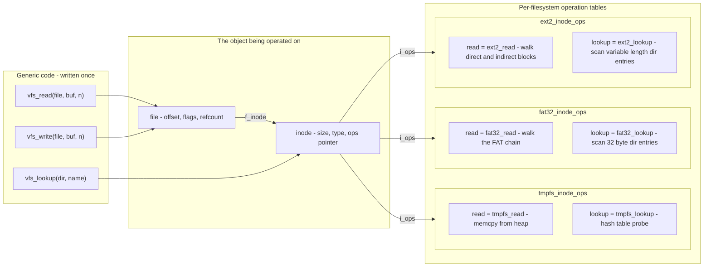

Walking it: **`vfs_read`, `vfs_write`, `vfs_lookup`** are the generic entry points —
they handle the offset arithmetic, the bounds checks, the refcounting and the errno
translation, and none of that code is duplicated per filesystem. Each takes a
**`file`**, which holds the per-open state (the read/write offset, the open flags),
and follows its **`f_inode`** pointer to the **`inode`**, which holds the per-file
state (size, type, permissions). The inode's **`i_ops`** pointer is the hinge: it
selects one of the three tables. The three dashed-looking `i_ops` arrows are
mutually exclusive for any given inode — an inode points at exactly one of them, fixed
when the inode was created by its filesystem's `read_inode`.

Inside each table, the same two slots hold radically different code. `read` on tmpfs
is a `memcpy` from a heap allocation. `read` on FAT32 walks a chain through a global
table. `read` on ext2 walks a tree hanging off the inode. The caller sees one call.

> [!question] What is the difference between an abstraction and an indirection?
> [[ADR-0009 - Filesystem Strategy FAT32 then ext2]] states the position bluntly: "A
> VFS with one implementation is not an abstraction, it is indirection." Until a
> second, genuinely different backend exists, every accidental assumption about the
> first one leaks through the interface and nobody notices. The three chosen backends
> disagree about almost everything — persistence, allocation strategy, permissions,
> link support, name length, case sensitivity — which is precisely the point.

**The shape of the ops table.** [[Stage 7.3 - The Virtual Filesystem Layer]] permits
either a struct of function pointers or C++ virtual methods. Both compile to the same
indirect call. The struct is drawn here because it makes the table an ordinary data
object you can inspect in a debugger and construct in a host unit test, and because
[[ADR-0007 - Freestanding C++20 as the Kernel Language]] rules out RTTI, so the
runtime type information that would make a class hierarchy convenient is absent
anyway.

> [!warning] Null slots in the ops table jump to address zero
> A filesystem that does not implement `write` and leaves the slot at `nullptr` will
> not fail cleanly. The generic code will call through it, the CPU will fetch an
> instruction from virtual address 0, and — because the first 4 MiB of user space is
> deliberately unmapped — you get a page fault whose faulting address is `0x0` and
> whose call stack looks like it came from nowhere. Initialise every slot to a stub
> that returns `-ENOSYS`. This is the first trap named in
> [[Stage 7.3 - The Virtual Filesystem Layer]].

### 3.2 The mount table

A filesystem does not know where in the tree it lives. FAT32 knows about *its* root
directory; it has no idea that root is reachable as `/boot/efi`. That grafting is the
mount table's job.

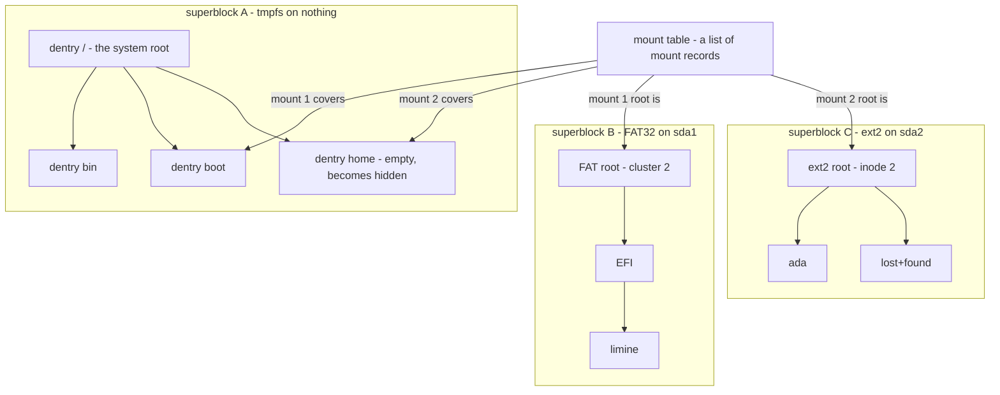

**The boxes.** `mount table` is a short list — a handful of records, scanned linearly;
there is no reason to index it in v1. Each of the three `superblock` subgraphs is one
mounted filesystem instance, with its own root and its own dentry tree hanging off
that root. Superblock A is the tmpfs unpacked from `initrd.tar` at boot; it is the
system root and is mounted before any disk driver has spoken to a disk. Superblock B
is a FAT32 partition on `sda1` — its root is not a named directory at all but
"whatever cluster `BPB_RootClus` says", conventionally cluster 2. Superblock C is ext2
on `sda2`, whose root is always **inode 2**, a fixed constant of the format.

**The arrows.** The plain arrows inside each subgraph are ordinary parent-to-child
directory edges. The four labelled arrows out of the mount table are the interesting
ones, and they come in pairs: each mount record names a **covered dentry** (the
directory in the *parent* filesystem that the mount hides) and a **mount root** (the
root dentry of the *mounted* filesystem that replaces it). Mount 1 covers `/boot` with
the FAT32 root. Mount 2 covers `/home` with the ext2 root.

Consequences that surprise people:

- **Mounting hides, it does not merge.** `/home` in the tmpfs may have had files in
  it. After mount 2 they are unreachable — still allocated, still on the heap, just
  with no name pointing at them. Unmount and they reappear.
- **A mount point is a property of a dentry, not a path.** The path walker checks a
  flag on the dentry it just resolved. There is no string matching against a list of
  mount paths, which would be both slow and wrong once directories get renamed.
- **`umount` can fail with `-EBUSY`.** If any `file` object still references an inode
  belonging to that superblock, or any task's cwd is inside it, the superblock cannot
  be torn down. The mount record holds a refcount for exactly this.
- **The root mount is special.** It has no covered dentry — there is nothing above it.
  In Phase 7 the root is tmpfs; [[Stage 10.8 - Booting From Disk]] is the stage where
  the root becomes a real partition and the ramdisk becomes optional.

### 3.3 Path resolution, one component at a time

This is the single most subtle loop in `fs/`. It is also the one place where mount
points, `.`, `..` and symbolic links all interact.

A **symbolic link** (symlink) is a file whose contents are a path string; opening it
means opening whatever that string names. ext2 has them; FAT32 does not.

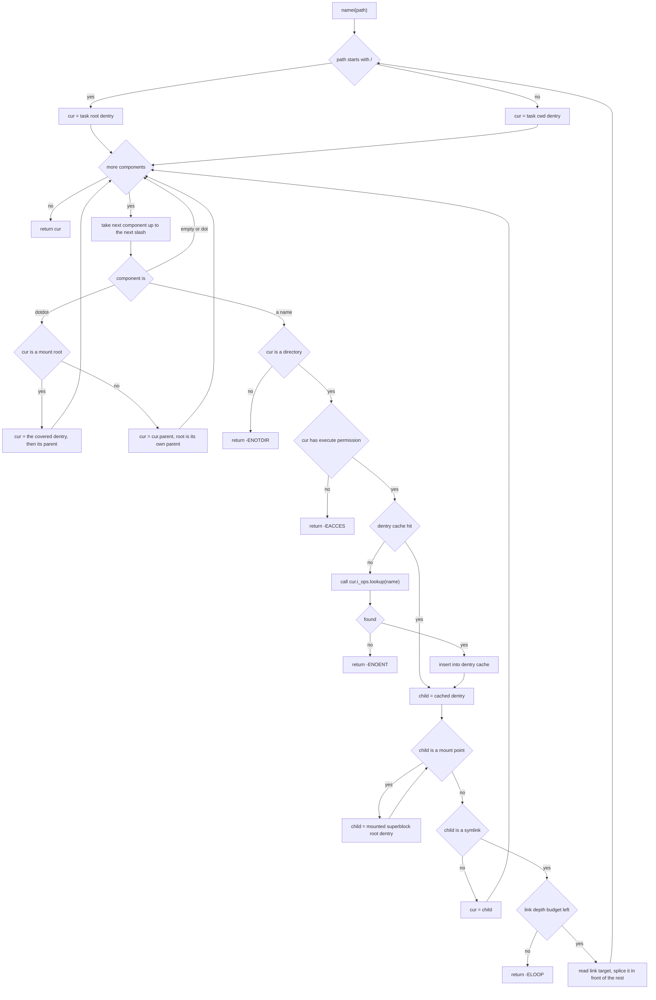

**Walking the decision points.**

- **`path starts with /`** — an absolute path restarts at the task's root dentry; a
  relative one starts at its current working directory. Both are per-task fields, which
  is what later makes `chroot` and per-process cwd possible.
- **`more components`** — the loop condition. When the string is exhausted, `cur` is
  the answer.
- **`component is`** — three cases. An **empty** component comes from a doubled slash
  (`//`) or a trailing one; POSIX says ignore it. **`.`** means "this directory" and is
  also a no-op — note that it is handled here in the walker and never reaches the
  filesystem, even though both FAT32 and ext2 store real `.` entries on disk.
- **`..` and `cur is a mount root`** — the trap. If you are standing on the root of a
  mounted filesystem, `..` must not resolve within that filesystem; the mounted root's
  on-disk `..` points at itself or at some meaningless value. It must jump *out* to the
  covered dentry and take that dentry's parent. Get this wrong and `cd /home/ada; cd
  ../..` lands somewhere impossible.
- **`root is its own parent`** — `..` at `/` yields `/`. This is what stops a path of a
  thousand `..` components from walking off the top of the tree.
- **`cur is a directory`** — if a component in the middle of a path names a regular
  file, the answer is `-ENOTDIR`, not `-ENOENT`. Callers rely on the distinction.
- **`cur has execute permission`** — on a directory, the execute bit means "may be
  traversed". ext2 stores real permission bits; FAT32 has none, so its driver
  synthesises a fixed mode at mount time from mount options.
- **`dentry cache hit`** — the fast path. A hit answers from RAM. A miss calls into the
  filesystem's `lookup`, which is where the disk reads happen, and the result is
  inserted so the next walk is a hit.
- **`child is a mount point`** — crossed *after* the lookup succeeds, and drawn as a
  **loop back into itself** because mounts can stack: mounting a filesystem on a
  directory that is already a mount point is legal, and the walker must follow the
  chain to the topmost one.
- **`child is a symlink`** — read the target and splice it in front of the remaining
  components, then restart the absolute/relative decision because the target may itself
  be absolute. The **link depth budget** is not optional: two symlinks pointing at each
  other resolve forever. Pick a constant nesting cap, decrement it per link, and return
  `-ELOOP` at zero.

> [!example] Resolving `/home/ada/../ada/notes.txt` with `/home` mounted as ext2
> 1. Absolute → `cur = /` (tmpfs root, superblock A).
> 2. `home` → lookup in tmpfs, hit; the child dentry is flagged a mount point, so
>    `cur` becomes the **ext2 root, inode 2** in superblock C. The walk has changed
>    filesystem without the caller knowing.
> 3. `ada` → `ext2_lookup` scans inode 2's directory blocks for a variable-length entry
>    with `name_len == 3`. Suppose it yields inode 12.
> 4. `..` → `cur` is not a mount root (it is one level below it), so `cur = cur.parent`
>    = ext2 inode 2.
> 5. `ada` → dentry cache **hit** this time. No disk read at all.
> 6. `notes.txt` → `ext2_lookup`, yields inode 31.
> 7. Return the dentry for inode 31.
>
> One `..` and one repeat cost zero disk I/O. Now do the same walk with the dentry
> cache removed and count the block reads: every component is a directory scan, and a
> directory scan is at least one indirect-block read plus one data-block read.

### 3.4 FAT32

FAT32 is the format UEFI mandates for the EFI System Partition, so being able to read
and write it is not optional for an OS that wants to manage its own boot media. It is
also the simplest real filesystem still in wide use. Its defining idea: **the
"what comes next" information for every file on the volume lives in one global array**,
the File Allocation Table.

#### 3.4.1 On-disk layout

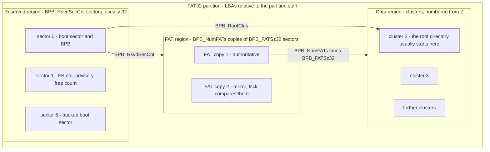

**The regions.** The **reserved region** starts at the partition's first sector and
holds the boot sector, whose **BIOS Parameter Block (BPB)** carries every geometry
number the driver needs. Sector 1 is **FSInfo**, which caches a free-cluster count and
a "search next from here" hint — it is explicitly **advisory** in the specification.
Sector 6 holds a backup boot sector, which is what you recover from when sector 0 is
damaged. The **FAT region** holds `BPB_NumFATs` (conventionally 2) identical copies of
the allocation table. The **data region** is everything else, carved into fixed-size
**clusters** of `BPB_SecPerClus` sectors, and — the arithmetic trap of the format —
**numbered starting at 2**, because entries 0 and 1 of the FAT are reserved.

**The arrows** are the three pieces of arithmetic the driver does at mount:

```
FirstDataSector = BPB_RsvdSecCnt + (BPB_NumFATs * BPB_FATSz32)
FirstSectorOfCluster(N) = FirstDataSector + (N - 2) * BPB_SecPerClus
RootDirCluster = BPB_RootClus          // usually 2, but read it, do not assume it
```

The fields that matter, all little-endian:

| Offset | Size | Field | Meaning |
|---|---|---|---|
| 0x00 | 3 | `BS_jmpBoot` | Jump instruction. Ignored by us. |
| 0x03 | 8 | `BS_OEMName` | Informational. Do **not** use it to detect FAT32. |
| 0x0B | 2 | `BPB_BytsPerSec` | Bytes per sector, normally 512. |
| 0x0D | 1 | `BPB_SecPerClus` | Sectors per cluster. Power of two. |
| 0x0E | 2 | `BPB_RsvdSecCnt` | Reserved sectors before the first FAT. 32 for FAT32. |
| 0x10 | 1 | `BPB_NumFATs` | Number of FAT copies. Almost always 2. |
| 0x11 | 2 | `BPB_RootEntCnt` | **Must be 0** on FAT32. Non-zero means FAT12/16. |
| 0x13 | 2 | `BPB_TotSec16` | 0 on FAT32; the count is in `BPB_TotSec32`. |
| 0x16 | 2 | `BPB_FATSz16` | **Must be 0** on FAT32. |
| 0x20 | 4 | `BPB_TotSec32` | Total sectors in the volume. |
| 0x24 | 4 | `BPB_FATSz32` | Sectors per FAT copy. |
| 0x2C | 4 | `BPB_RootClus` | First cluster of the root directory. Usually 2. |
| 0x30 | 2 | `BPB_FSInfo` | Sector number of FSInfo. Usually 1. |
| 0x32 | 2 | `BPB_BkBootSec` | Sector of the backup boot sector. Usually 6. |
| 0x1FE | 2 | signature | `0x55 0xAA`. Necessary but not sufficient for validity. |

> [!warning] Do not detect FAT32 by reading the type string
> There is a `BS_FilSysType` field near offset 0x52 that usually contains
> `"FAT32   "`, and the Microsoft specification says in as many words that it is
> informational only and must not be used to determine the FAT type. The correct test
> is arithmetic: compute the count of data clusters from the BPB; fewer than 4085 means
> FAT12, fewer than 65525 means FAT16, otherwise FAT32. Trusting the string means a
> volume formatted by a slightly unusual tool mounts as the wrong type and every
> subsequent read is garbage.

#### 3.4.2 The FAT chain

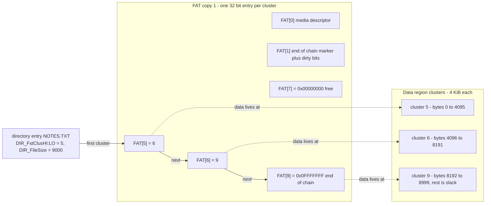

**The walk.** The **directory entry** stores the file's size and its *first* cluster
number, split across two 16-bit fields (`DIR_FstClusHI` at 0x14 and `DIR_FstClusLO` at
0x1A) that must be recombined — forgetting the high half works perfectly on small
volumes and fails on large ones, which makes it a nasty late-appearing bug. From
cluster 5, the driver reads **`FAT[5]`**, which contains 6: the next cluster. `FAT[6]`
contains 9. `FAT[9]` contains an end-of-chain marker, so the file is clusters 5, 6, 9
in that order — physically out of order, logically contiguous. The **dotted arrows**
are not stored anywhere; cluster N's data is at a computed sector, per the arithmetic
above. `FAT[7]` is shown as zero to make the point that free space is just entries
containing zero. `FAT[0]` and `FAT[1]` are reserved and never describe data.

Reading byte offset `off` of the file therefore costs: `off / cluster_size` FAT lookups
to find the right link, then one data read. **This is O(n) in the file's length** —
seeking to the end of a large file means walking the entire chain. The buffer cache
hides most of the cost because the FAT sectors are hot, but the algorithmic shape does
not change. ext2 fixes exactly this.

| FAT32 entry value (low 28 bits) | Meaning |
|---|---|
| `0x00000000` | Free cluster. |
| `0x00000002` – `0x0FFFFFEF` | In use; the value is the next cluster number. |
| `0x0FFFFFF0` – `0x0FFFFFF6` | Reserved. |
| `0x0FFFFFF7` | Bad cluster — never allocate it. |
| `0x0FFFFFF8` – `0x0FFFFFFF` | End of chain. Test with `>=`, do not compare for equality. |

> [!warning] FAT32 entries are 28-bit values in 32-bit slots
> The top four bits of each FAT32 entry are reserved and **must be preserved** on
> write: `new = (old & 0xF0000000) | (value & 0x0FFFFFFF)`. Clobbering them
> produces a volume that your own driver reads back fine and that Windows and Linux
> both reject. Equally: end-of-chain markers are a *range*, not a constant. Different
> formatters write different values in `0x0FFFFFF8`–`0x0FFFFFFF`, and a driver that
> tests `== 0x0FFFFFFF` will walk off the end of a chain written by someone else's
> tool and read whatever cluster the garbage points at.

The FAT sector holding entry N is found by `BPB_RsvdSecCnt + (N * 4) / BPB_BytsPerSec`,
at byte offset `(N * 4) % BPB_BytsPerSec` inside it. With 512-byte sectors that is 128
entries per sector, so a sequential walk of a contiguous file hits the same cached
sector 128 times in a row.

#### 3.4.3 Directory entries and VFAT long names

A FAT directory is a plain array of 32-byte records stored as the directory's file
data. There is no index, no hash, no ordering — a lookup is a linear scan.

| Offset | Size | Field | Notes |
|---|---|---|---|
| 0x00 | 11 | `DIR_Name` | 8.3, space padded, uppercase. First byte `0x00` = free and end of directory; `0xE5` = deleted. |
| 0x0B | 1 | `DIR_Attr` | Bit flags, see below. |
| 0x0C | 1 | `DIR_NTRes` | Case hints for the short name. |
| 0x0D | 1 | `DIR_CrtTimeTenth` | Creation time, tenths of a second. |
| 0x0E | 2 | `DIR_CrtTime` | Creation time, 2-second resolution. |
| 0x10 | 2 | `DIR_CrtDate` | Creation date. |
| 0x12 | 2 | `DIR_LstAccDate` | Last access date. No time. |
| 0x14 | 2 | `DIR_FstClusHI` | High 16 bits of the first cluster. |
| 0x16 | 2 | `DIR_WrtTime` | Last write time, 2-second resolution. |
| 0x18 | 2 | `DIR_WrtDate` | Last write date. |
| 0x1A | 2 | `DIR_FstClusLO` | Low 16 bits of the first cluster. |
| 0x1C | 4 | `DIR_FileSize` | Size in bytes. **32 bits — hence the 4 GiB limit.** |

`DIR_Attr` bits: `0x01` read-only, `0x02` hidden, `0x04` system, `0x08` volume label,
`0x10` directory, `0x20` archive. The combination `0x0F` — read-only, hidden, system and
volume label all at once — is not a real file. It is the marker for a **long filename
entry**, chosen precisely because every pre-VFAT tool ignores that combination.

Dates and times are packed: time is `hours << 11 | minutes << 5 | seconds / 2`, date is
`(year - 1980) << 9 | month << 5 | day`. Write timestamps therefore have **two-second
granularity**, which is enough to confuse a build system.

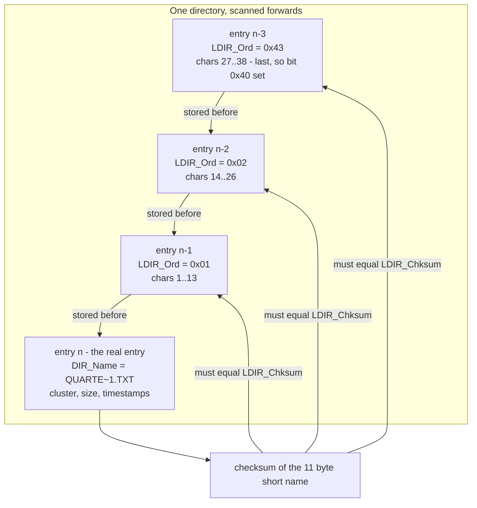

**Reading the diagram.** A long name is stored as a run of `0x0F`-attribute entries
placed **immediately before** the short entry they describe, in **reverse order**: the
entry nearest the short entry carries ordinal 1 and the *first* 13 characters, and the
run counts upward as you scan backwards. The entry holding the last chunk has
`0x40` OR'd into its ordinal to mark it as the last logical piece. Each long entry
carries 13 UCS-2 characters in three non-contiguous runs — 5 at offset 0x01, 6 at
offset 0x0E, 2 at offset 0x1C — split that way because offsets 0x0B, 0x0C, 0x0D and
0x1A had to keep holding the attribute byte, a type byte, the checksum, and a
zeroed cluster field so that old tools see a harmless volume-label entry. With 13
characters per entry and a 255-character maximum, a single name can consume up to 20
entries, 640 bytes of directory.

**The checksum arrows** are the integrity mechanism. Every long entry stores a one-byte
checksum of the associated **short** name, computed as:

```c
uint8_t lfn_checksum(const uint8_t short_name[11]) {
    uint8_t sum = 0;
    for (int i = 0; i < 11; i++)
        sum = ((sum & 1) ? 0x80 : 0) + (sum >> 1) + short_name[i];
    return sum;
}
```

If the checksums of the run do not all match the short entry that follows, the long
entries are **orphans** — left behind by a tool that deleted or renamed the file
without understanding VFAT — and must be ignored, falling back to the short name.

> [!warning] Three ways the long-name code goes wrong
> **Names come out reversed or scrambled** — the run was assembled in scan order
> instead of by ordinal. **A name attaches to the wrong file** — the checksum was not
> verified, so an orphan run got glued onto the next real entry. **Deleting a file
> leaves the old name visible** — deletion must mark *every* entry of the run `0xE5`,
> not just the short one.

### 3.5 ext2

ext2 answers the same questions as FAT32 and gets opposite answers. Where FAT32 keeps
allocation information in one global table, ext2 keeps it **in the file's own record**,
the inode, as a shallow tree. Where FAT32 has no permissions, ext2 has full Unix mode,
owner and group — which is why [[ADR-0009 - Filesystem Strategy FAT32 then ext2]] makes
it the native filesystem and why [[Phase 13 - Overview]]'s process model depends on it.

#### 3.5.1 Volume layout

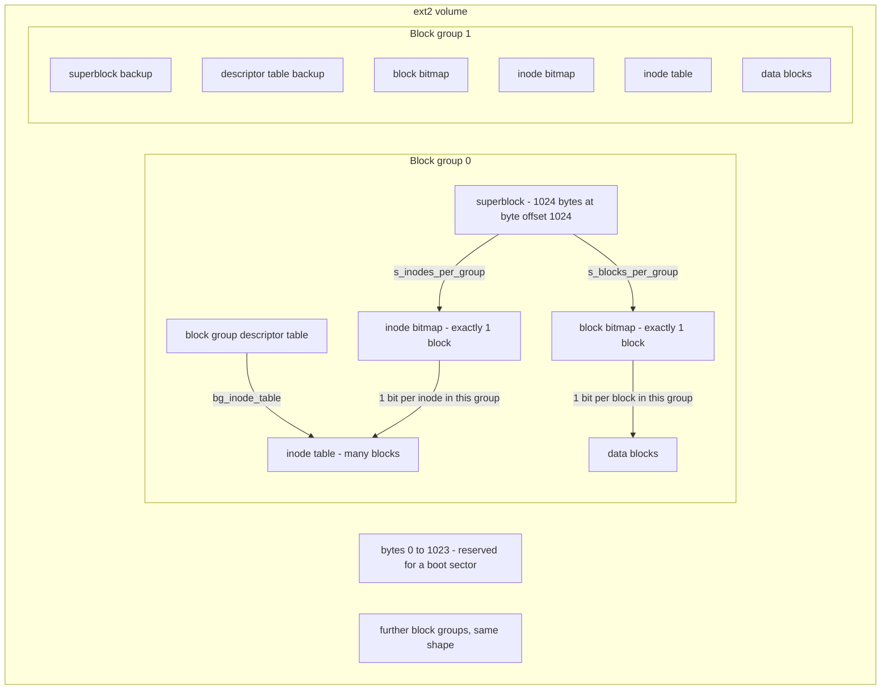

**The boxes.** The first **1024 bytes** are untouched, reserved for a boot sector, which
is why the superblock sits at byte offset 1024 rather than 0 — a fact that catches
everyone once, because with a 1 KiB block size the superblock is block 1, but with a
4 KiB block size it is inside block 0 at offset 1024. The **superblock** describes the
whole volume. The **block group descriptor table** follows it, one 32-byte descriptor
per group, and it is the map to everything else.

Each **block group** then has the same five parts: a **block bitmap** (exactly one
block — one bit per data block in this group, which is what fixes the group size), an
**inode bitmap** (one block), an **inode table** (a flat array of fixed-size inode
records), and **data blocks**. Groups after the first may carry **backup copies** of the
superblock and descriptor table; with the `sparse_super` feature those copies exist only
in groups 0, 1 and the powers of 3, 5 and 7. Those backups are what `fsck` uses when
the primary superblock is unreadable.

**Why groups at all?** Because a bitmap has to fit in one block, and because putting an
inode near its data blocks reduces seek distance on rotating media. A file's data is
allocated in its inode's own group when possible; a new directory is placed in the
group with the most free space. Neither rule matters much on an SSD, but the layout is
what it is and the arithmetic must be implemented correctly regardless.

**The arrows** are the derivations: `s_blocks_per_group` fixes how many blocks one
bitmap covers, `s_inodes_per_group` does the same for inodes, and each group
descriptor's `bg_inode_table` field is a block number pointing at that group's inode
table.

Superblock fields the driver actually reads:

| Offset | Size | Field | Meaning |
|---|---|---|---|
| 0 | 4 | `s_inodes_count` | Total inodes in the volume. |
| 4 | 4 | `s_blocks_count` | Total blocks. |
| 12 | 4 | `s_free_blocks_count` | Free blocks. Must be kept correct. |
| 16 | 4 | `s_free_inodes_count` | Free inodes. |
| 20 | 4 | `s_first_data_block` | 1 when the block size is 1024, else 0. |
| 24 | 4 | `s_log_block_size` | **Block size = 1024 << this.** |
| 32 | 4 | `s_blocks_per_group` | Fixes the group size. |
| 40 | 4 | `s_inodes_per_group` | Needed to map an inode number to a group. |
| 52 | 2 | `s_mnt_count` | Mounts since the last check. |
| 54 | 2 | `s_max_mnt_count` | Force a check after this many. |
| 56 | 2 | `s_magic` | **`0xEF53`.** The one reliable identity test. |
| 58 | 2 | `s_state` | 1 = cleanly unmounted, 2 = errors detected. |
| 76 | 4 | `s_rev_level` | 0 = original (inodes are 128 bytes), 1 = dynamic. |
| 88 | 2 | `s_inode_size` | Inode record size in rev 1. Often 128 or **256**. |
| 96 | 4 | `s_feature_incompat` | **If any bit here is unknown, refuse to mount.** |
| 100 | 4 | `s_feature_ro_compat` | If any bit is unknown, mount read-only. |

> [!warning] The two mount-time checks people skip
> **Never assume a 128-byte inode.** Modern `mke2fs` defaults to 256. Read
> `s_inode_size` for rev 1 volumes and use it in the inode-table offset arithmetic;
> hardcoding 128 gives you every second inode's bytes shifted by half a record, which
> reads as plausible-but-wrong sizes and modes.
> **Never ignore the feature flags.** `s_feature_incompat` exists so that a driver
> written before a format extension refuses the volume instead of corrupting it. Ext3's
> journal and ext4's extents both announce themselves here. Mounting anyway and
> "mostly working" is how you destroy a filesystem you could have read.

#### 3.5.2 The inode and its block pointer tree

An **inode** is the file. Not the name — the name lives in a directory entry, and
several names can point at the same inode, which is what a **hard link** is. The inode
holds the type, permissions, owner, timestamps, link count and the pointers to the data.

| Offset | Size | Field | Meaning |
|---|---|---|---|
| 0 | 2 | `i_mode` | Type bits plus permission bits. |
| 2 | 2 | `i_uid` | Owning user. |
| 4 | 4 | `i_size` | Size in bytes, low 32 bits. |
| 8 | 4 | `i_atime` | Last access, Unix seconds. |
| 12 | 4 | `i_ctime` | Inode change time. |
| 16 | 4 | `i_mtime` | Last data modification. |
| 20 | 4 | `i_dtime` | Deletion time. Non-zero means deleted. |
| 24 | 2 | `i_gid` | Owning group. |
| 26 | 2 | `i_links_count` | Hard links. **Zero plus no open handles means free it.** |
| 28 | 4 | `i_blocks` | Size in **512-byte units**, not filesystem blocks. |
| 32 | 4 | `i_flags` | Per-file flags. |
| 40 | 60 | `i_block[15]` | 12 direct, then singly, doubly and triply indirect. |
| 108 | 4 | `i_dir_acl` | On rev 1 regular files, the **high 32 bits of the size**. |

Mapping an inode number to bytes on disk:

```
group  = (inode_number - 1) / s_inodes_per_group
index  = (inode_number - 1) % s_inodes_per_group
offset = group_desc[group].bg_inode_table * block_size + index * s_inode_size
```

**Inode numbers start at 1**, which is why every expression above subtracts one. Inode
2 is always the root directory — that is how a mount finds the top of the tree with no
search. Inodes below `s_first_ino` (11 on older volumes) are reserved.

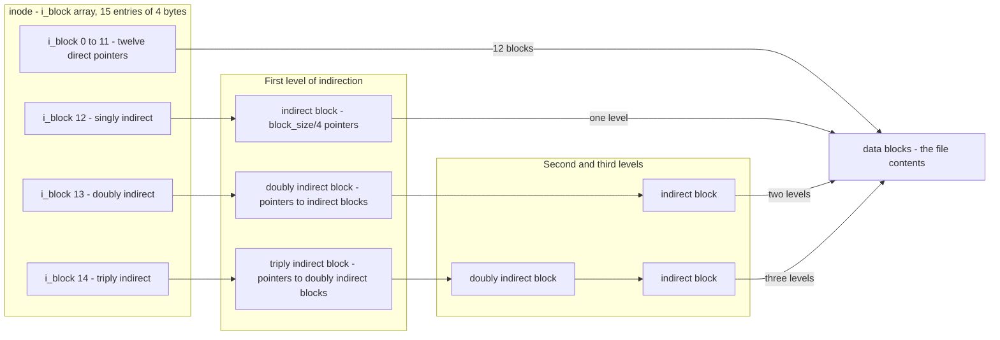

**Walking the tree.** The first twelve entries of `i_block` are **direct**: entry *k*
holds the block number of the file's *k*-th block, and reading it costs one block read.
Entry 12 is **singly indirect** — it points at a block that is nothing but an array of
block numbers, so reaching that data costs two reads. Entry 13 is **doubly indirect**:
a block of pointers to blocks of pointers, three reads. Entry 14 is **triply indirect**,
four reads. The `L2` subgraph exists to make the nesting visible: the doubly indirect
path passes through one intermediate array, the triply indirect path through two.

The design is deliberately asymmetric, and the asymmetry is the point: **small files
are fast, large files are possible.** With a 1 KiB block size and 256 pointers per
block:

| Level | Blocks reachable | Cumulative file size | Reads to reach a byte |
|---|---|---|---|
| 12 direct | 12 | 12 KiB | 1 |
| singly indirect | 256 | 268 KiB | 2 |
| doubly indirect | 65,536 | ~64 MiB | 3 |
| triply indirect | 16,777,216 | ~16 GiB | 4 |

With 4 KiB blocks (1024 pointers per block) the same structure reaches 48 KiB, 4 MiB,
4 GiB and 4 TiB. Note that the vast majority of real files fit entirely in the twelve
direct pointers, so the common case pays nothing for the machinery that makes the rare
case work. Compare with FAT32, where the cost of reaching byte *n* grows **linearly**
in *n* forever.

> [!example] Which pointer holds byte 1,000,000 of a 1 MiB file on a 1 KiB-block volume?
> Block index = `1000000 / 1024` = **976**; the byte is at offset 576 within it.
> Subtract the 12 direct pointers → 964. Subtract the 256 singly-indirect entries →
> 708, so it is under the **doubly** indirect pointer. Then `708 / 256` = **2** is the
> index into the doubly indirect block, and `708 % 256` = **196** is the index into the
> indirect block that entry names. Four block reads in total: `i_block[13]`'s block,
> then entry 2's block, then entry 196's data block — plus the inode itself, which was
> already in memory. Repeat the read a second time and the buffer cache answers the
> first three from RAM.

**Directories** are ordinary files whose contents are variable-length records: a 4-byte
inode number, a 2-byte `rec_len`, a 1-byte `name_len`, a 1-byte `file_type`, then the
name. `rec_len` is the offset to the next record, 4-byte aligned, and records never
straddle a block boundary — the last record in a block has its `rec_len` stretched to
reach the end. Deleting an entry does not blank it; it extends the **previous** record's
`rec_len` to swallow it. That is why `fsck` can often recover a name after a delete,
and why a directory that has been heavily churned never shrinks.

**Symlinks** get a shortcut: if the target string is shorter than 60 bytes it is stored
directly inside the `i_block` array (a "fast symlink") with `i_blocks == 0`, so
resolving it costs zero extra reads. Longer targets live in a real data block.

---

## 4. The data structures

Four objects carry the whole VFS. Getting their *lifetimes* right is more important
than getting their fields right, because the field list can be extended later and the
lifetime rules cannot.

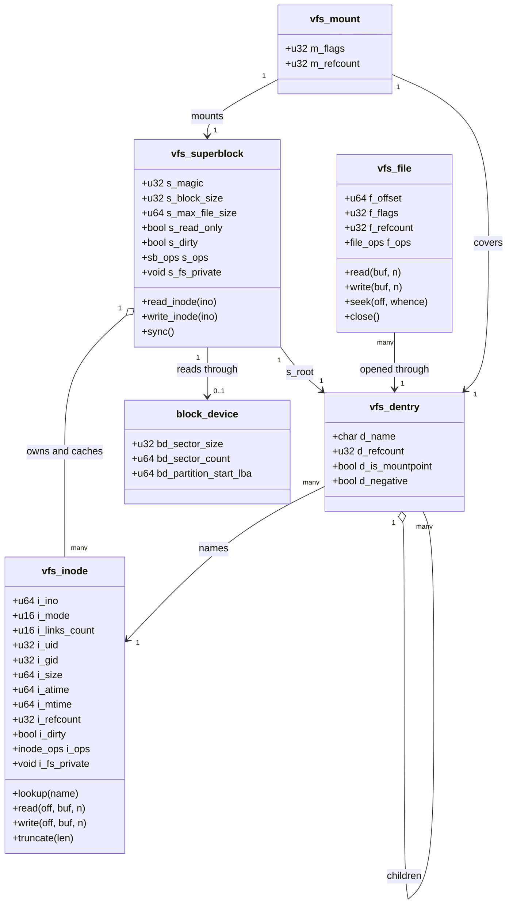

### What each object is, and how long it lives

| Object | Represents | Created by | Destroyed when | One per |
|---|---|---|---|---|
| `vfs_superblock` | One **mounted filesystem instance** | `mount` | `umount` succeeds | Mount |
| `vfs_inode` | One **file**, name-independent | First lookup that reaches it | Refcount 0 **and** `i_links_count` 0 | File on a volume |
| `vfs_dentry` | One **name edge** in the tree | Path walk, or `readdir` | Cache eviction, or unlink | (parent, name) pair |
| `vfs_file` | One **open** of a file | `open` | Last `close` or task exit | `open()` call |
| `vfs_mount` | One **graft point** | `mount` | `umount` | Mount |

**The relationships, read as sentences.**

- A superblock **has one root dentry** (`s_root`). That is the entry point a mount
  grafts into the tree.
- A superblock **owns many inodes**, and it caches them — the filled diamond means the
  inodes die with the superblock. This is the container-and-contents relationship that
  makes `umount` refuse while anything is open.
- A superblock **reads through zero or one block device**. Zero for tmpfs. The
  `bd_partition_start_lba` field is what lets FAT32 and ext2 use volume-relative block
  numbers everywhere and have exactly one place where the partition offset is added.
- **Many dentries name one inode.** This is the hard-link relationship: `/bin/sh` and
  `/bin/rsh` can be two dentries pointing at one inode with `i_links_count == 2`. FAT32
  cannot express this, so its driver keeps the count at 1 always.
- A dentry **has many child dentries** — this is the tree structure of the cache.
- **Many files can be open on one dentry**, each with its own `f_offset`. Two tasks
  reading the same file do not share a position. Two tasks that inherited the same fd
  across `fork` **do** share one `vfs_file`, and therefore do share a position; that is
  a [[Phase 13 - Overview]] concern and it is why `f_refcount` exists in Phase 7.
- A mount **points at both** the superblock it introduces and the dentry it covers. Two
  arrows, one record — that pairing is the mount table.

> [!warning] Per-open state must not live on the inode
> The most common VFS bug in [[Stage 7.3 - The Virtual Filesystem Layer]] is putting
> the read offset on the node instead of on the open handle. The symptom is delightful:
> a file reads correctly the first time and returns nothing the second time, because the
> offset was left at EOF; or two programs reading the same file interleave and each gets
> half the bytes. **`f_offset` belongs to `vfs_file`. `i_size` belongs to `vfs_inode`.**
> Ask "would two simultaneous opens disagree about this?" — if yes, it is per-file.

### Lifetimes as a state machine

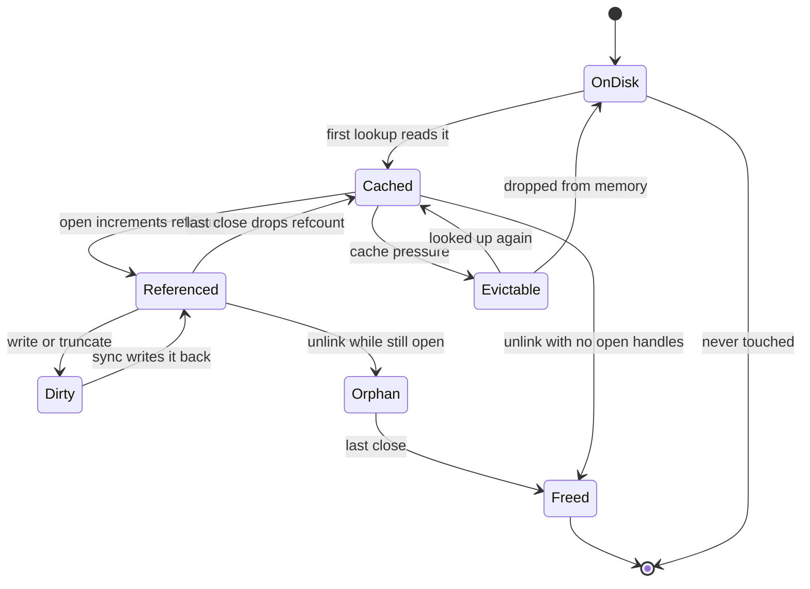

**Walking the states.** An inode begins **OnDisk** — bytes in an inode table that no
kernel object represents. The first lookup that reaches it builds an in-memory
`vfs_inode`: **Cached**. An `open` takes a reference: **Referenced**. A write marks it
**Dirty**, meaning the in-memory copy differs from the disk and a `sync` or the
buffer-cache writeback must reconcile them. `close` drops back to **Cached**, where the
inode is still in memory but unreferenced, so it becomes **Evictable** under memory
pressure and can either be resurrected by a fresh lookup or dropped back to **OnDisk**.

The two paths worth staring at are the bottom ones. **Orphan** is what `unlink` on an
open file produces: the directory entry is gone, `i_links_count` is 0, the name is
unreachable — and the file still exists, because a `vfs_file` still references it. Only
the last `close` moves it to **Freed**, which is where the blocks are actually returned
to the bitmap. This is standard Unix behaviour, it is how temporary files are made
un-leakable, and it is the single most common source of "the disk is full but `du` says
it is empty".

> [!warning] A crash in the Orphan state leaks the whole file
> Without a journal there is nowhere to record "this inode has zero links but is still
> open". Pull the power while a file is orphaned and, after reboot, its inode has
> `i_links_count == 0` while its bit is still set in the inode bitmap and its blocks are
> still marked used. Nothing points at it and nothing frees it. This is one of the
> exact conditions [[Stage 10.9 - fsck and Crash Consistency]] must detect and repair,
> and it is why real ext3 keeps an on-disk orphan list.

---

## 5. The flows

### 5.1 `open("/home/ada/notes.txt", O_RDONLY)` on ext2, cold cache

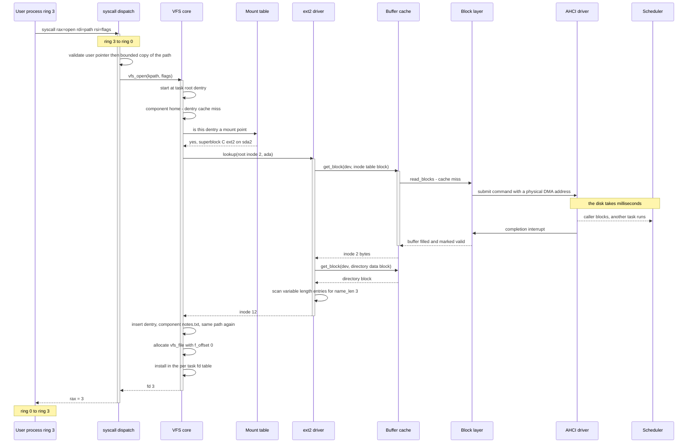

**Who holds control, and where.** The user process holds control until the `syscall`
instruction, at which point the CPU switches to ring 0 and to the kernel stack found via
the TSS. The **syscall dispatch** owns the privilege boundary and does exactly one
security-critical thing: it validates the user's path pointer and copies the string into
kernel memory with a length cap **before** anything dereferences it. Everything after
that runs on kernel memory only.

The **VFS core** owns the walk. It consults the **mount table** at each resolved
component — here, `home` is a mount point, so the rest of the walk is handed to a
different superblock and a different driver without the caller noticing. The **ext2
driver** owns the format: it converts an inode number into a block number and an offset,
asks for blocks, and scans directory records. It never issues I/O itself.

The **buffer cache** owns the "have I already read this?" question. On a miss it goes to
the **block layer**, which hands the **AHCI driver** a command containing a *physical*
address, because the controller does DMA and does not walk page tables
([[Stage 9.2 - DMA and Physically Contiguous Memory]]).

**The blocking point is the important part of this diagram.** A disk read takes
milliseconds — millions of cycles. The calling task is put to sleep
([[Stage 5.4 - Sleep and Blocking]]), the scheduler runs somebody else, and the
completion interrupt wakes it. Every arrow after that point resumes in the original
task's context. Filesystem code therefore always runs in **process context**, where it
may sleep and may take mutexes. An interrupt handler may do neither, per the concurrency
table in [[06 - Architecture Overview]] — which is why the completion handler does the
minimum (mark the buffer valid, wake the waiter) and nothing more.

Note what the diagram does **not** show: no file data is read. `open` resolves a name
and allocates a handle. The first `read` is what touches `i_block`.

### 5.2 Appending to a file with no journal

Crash consistency without journalling is entirely a matter of **write ordering**, so it
is worth drawing the order explicitly.

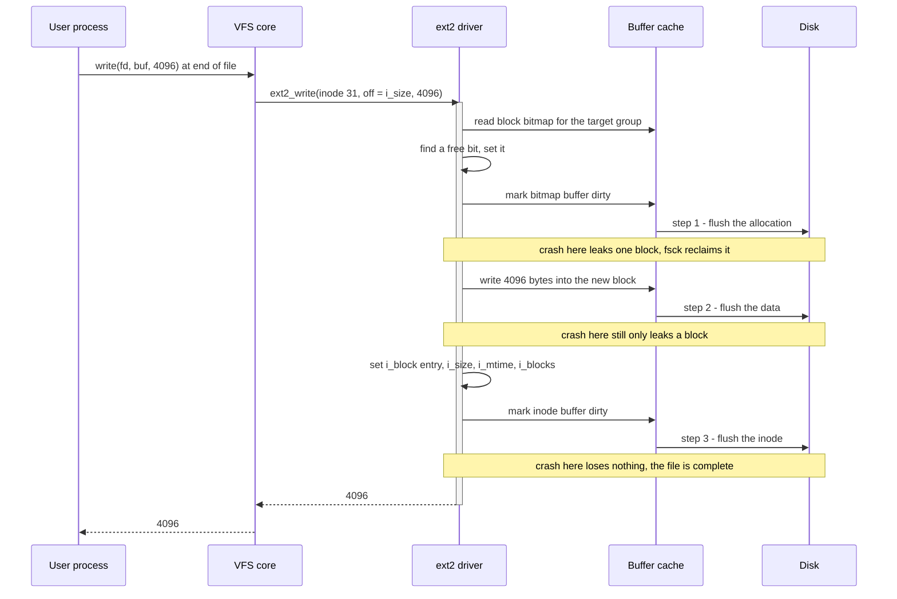

**The rule the ordering encodes: never let a pointer reach the disk before the thing it
points at.** Three flush points, three crash windows, and every one of them is
*recoverable*:

- Crash after **step 1** — a block is marked allocated that nothing references. That is
  a **leak**: capacity is lost, no data is wrong, and `fsck` reclaims it by rebuilding
  the bitmap from the inode tree.
- Crash after **step 2** — same leak. The block now contains the user's data, but no
  inode points at it, so it is invisible.
- Crash after **step 3** — nothing lost. The file is complete.

Now invert steps 2 and 3, updating the inode before writing the data. The crash window
between them produces an inode whose size and pointers claim 4096 bytes that were never
written, so the file contains **whatever was in that block before** — which may be a
deleted file's contents, i.e. a data leak across users as well as corruption. `fsck`
cannot detect this at all, because the structure is perfectly consistent. The
filesystem simply lies.

> [!warning] "Write data first, metadata last" is a shorthand that needs one refinement
> [[Phase 10 - Overview]] states the rule as data-first, metadata-last. Strictly, the
> **allocation reservation** must precede the data write, and the **pointer** must
> follow it. Reservation-then-data-then-pointer. Skip the reservation and two files can
> be handed the same block; that is a cross-linked file, the one class of corruption
> `fsck` cannot repair without discarding somebody's data.

The FAT32 equivalent runs on the same principle with different structures: write
`FAT[new] = EOC` first (reserving the cluster), then the cluster data, then
`FAT[old] = new` to link it, then the directory entry's size — and then **both FAT
copies** must agree, because `fsck` compares them and a mismatch means one write
completed and the other did not.

---

## 6. Why it is shaped this way

| Decision | Alternative | Cost of the alternative | Verdict |
|---|---|---|---|
| A VFS layer at all | Call the filesystem directly | Every caller edited per new filesystem; `sys_read` becomes a type switch | **VFS.** One pointer indirection buys three backends |
| Three backends | One backend | Untestable abstraction; assumptions leak silently | **Three.** [[ADR-0009 - Filesystem Strategy FAT32 then ext2]] |
| tmpfs first, writable | v1's read-only tar | Retrofitting writes rewrites every caller | **tmpfs.** Write support designed in on day one |
| FAT32 second | ext2 second | UEFI mandates FAT for the ESP; no way to manage own boot media | **FAT32.** Not optional |
| ext2 third | ext4 | Journal, extents, delayed allocation — several times the work | **ext2.** Stable format, real Unix semantics |
| ext2 third | Our own format | No external tool can inspect it while you debug it | **ext2.** Keep the outside view |
| `fsck` at mount | Journalling | A correct journal is a large subsystem with its own crash semantics | **fsck.** Explicit v1 limitation |
| Format on the host | Write our own `mkfs` | Duplicate work before there is anything to format | **Host tools.** `mkfs.fat`, `mke2fs` in the container |
| Buffer cache below `fs/` | Cache inside each filesystem | Two caches over one device disagree about a sector | **Below.** [[Stage 9.3 - The Buffer Cache]] |
| Ops table of function pointers | Class hierarchy | RTTI is off ([[ADR-0007 - Freestanding C++20 as the Kernel Language]]); tables are testable data | **Ops table** |
| Dentry cache | Re-read directories every walk | Every path component becomes disk I/O, repeatedly | **Cache.** Cost is invalidation correctness |

### What specifically breaks under each rejection

- **No VFS.** The ELF loader in [[Stage 7.4 - Loading and Running an ELF Program]] gets
  a hard dependency on the tar parser. Phase 8's shell gets another. By Phase 10 you are
  editing the shell to add FAT32 support, which is an absurd sentence and exactly what
  happens.
- **One backend.** The interface silently acquires tmpfs's properties: no persistence to
  worry about, no partial reads, no I/O errors, no blocking, `lookup` never fails
  transiently. Every one of those assumptions is wrong for a disk, and you discover them
  all at once under Phase 10 deadline pressure.
- **Read-only tar.** Nothing persists, so nothing the OS does matters across a reboot.
  That is the product gap [[05 - Gap Analysis (v1 to Product)]] names outright.
- **ext2 before FAT32.** You cannot write your own EFI System Partition, so you cannot
  update your own boot media from your own OS, and you lose the ability to mount your
  volumes on a normal machine to check your work.
- **Our own filesystem format.** When a write produces corruption you have exactly one
  tool capable of reading the result: the buggy code that produced it. ADR-0009 is
  explicit that this is worth doing *after* ext2, when a working reference exists.
- **Journalling in v1.** A journal that is subtly wrong is worse than no journal,
  because it convinces you that ordering does not matter.
- **Per-filesystem caches.** Mount FAT32 and ext2 on two partitions of one disk, and the
  partition table block is cached twice. Now write to one of them.

---

## 7. How this grows across the phases

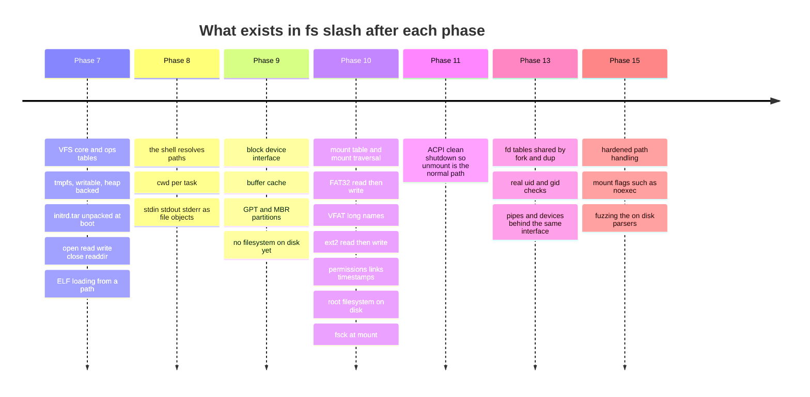

**Reading the timeline.** Phase 7 builds the abstraction with the backend that needs no
hardware, which is what makes it possible at all — the VFS ships before a disk driver
exists. Phase 8 is the first real *consumer*: a shell exercises path resolution far more
aggressively than kernel code does, and it is where relative paths and cwd become
mandatory. Phase 9 builds the entire right-hand side of the §2 diagram without a single
filesystem on it; the RAM-disk stub from [[Stage 9.1 - The Block Device Interface]] is
what lets Phase 10 work start before AHCI is finished, which is the interface-first rule
from [[12 - Team Workflow]]. Phase 10 is where this document's subject actually lands.
Phase 11 matters here for an unobvious reason: ACPI shutdown makes *clean unmount* the
normal case, which is the main mitigation for having no journal. Phase 13 generalises
the `file` object to pipes and devices and adds real credential checks. Phase 15 attacks
the on-disk parsers deliberately.

**What is deliberately missing early, and why that is acceptable:**

- **No permissions until Phase 10.** tmpfs and FAT32 have no meaningful ownership model,
  and there is only one user, so `i_uid` is a field nobody reads. The checks are written
  once, against ext2, where they are real.
- **No `sync` semantics until there is a disk.** tmpfs has no writeback, so the
  distinction between dirty and clean does not exist. This is the assumption most likely
  to leak through the interface, and it is worth adding a no-op `sync` op in Phase 7 for
  precisely that reason.
- **No `fsck` until Phase 10.9.** You cannot repair a filesystem you cannot yet corrupt.
- **No journal ever, in v1.** Named in ADR-0009 as an accepted limitation, with clean
  shutdown and `fsck` as the mitigation pair.

---

## 8. Failure modes

Symptom first — this is the section for 2am. See also [[14 - Debugging Playbook]].

| Symptom you actually observe | Cause |
|---|---|
| Page fault at faulting address `0x0` on the first `readdir` | A null slot in the ops table was called. Initialise every slot to an `-ENOSYS` stub. |
| Every file's size is wrong by a wild factor | The tar size field parsed as decimal. It is **octal ASCII**. [[Stage 7.2 - A Read-Only Filesystem]]. |
| Directory listing works for the first entry then produces garbage | Not rounding tar data length up to 512 bytes when advancing to the next header. |
| A file reads correctly once, then returns zero bytes | The read offset lives on the inode instead of the `vfs_file`. |
| Two programs reading one file each get half the bytes | Same bug, more obvious. |
| Every on-disk struct field is shifted by two bytes | Missing `__attribute__((packed))`; the compiler inserted alignment padding. |
| Values are right in a host unit test and garbage in the kernel | Endianness assumed rather than converted, or a `bool`/enum with a compiler-chosen size in a packed struct. |
| Mount succeeds, root directory is empty | Partition-relative LBAs used as disk-absolute. The partition offset must be added in exactly one place. |
| Volume rejected despite a valid `0x55 0xAA` signature | FAT type detected from `BS_FilSysType` instead of from the cluster count. |
| FAT32 chain walk runs off the end and reads random clusters | End-of-chain tested with `==` instead of `>=  0x0FFFFFF8`. |
| Volume mounts here, is rejected by Linux and Windows | The reserved top 4 bits of FAT32 entries were clobbered on write. |
| Files above 4 GiB are truncated on FAT32 | `DIR_FileSize` is 32 bits. This is the format, not a bug. Refuse the write. |
| Files above 4 GiB are truncated on **ext2** | `i_dir_acl` holds the high 32 bits of the size on rev 1 regular files and was ignored. |
| Directory contains entries with impossible names | LFN entries (attribute `0x0F`) not skipped when listing, or `0xE5` deleted entries not skipped. |
| A long filename is reversed or scrambled | The LFN run assembled in scan order rather than by `LDIR_Ord`. |
| A long filename attaches to the wrong file | `LDIR_Chksum` not verified against the short name; orphan entries adopted. |
| The old name reappears after deleting a file | Delete marked only the short entry `0xE5`, not the whole LFN run. |
| Every ext2 inode after the first reads as garbage | 128-byte inodes assumed; `s_inode_size` is 256 on modern volumes. |
| Inode 1 reads as the root directory | Inode numbers are **1-based**; the `- 1` is missing from the group/index arithmetic. |
| Files are truncated at exactly 12 KiB, or 268 KiB | Indirect-block levels not implemented. 1 KiB blocks: 12 direct = 12 KiB, plus one indirect = 268 KiB. |
| `du` reports empty, the volume is full | Orphaned inodes: unlinked while open, then a crash. Only `fsck` frees them. |
| Free space shrinks a little on every boot | Lost cluster chains or leaked blocks from interrupted appends. `fsck` reclaims them. |
| `fsck` reports thousands of errors on a volume that mounted fine | Writes went to FAT copy 1 only; or `s_state` was never set back to clean on unmount. |
| A file has the right size but zero bytes of content | Metadata flushed before data. Ordering inverted; see §5.2. |
| Two different files return each other's data | Cross-linked blocks — the allocation reservation was skipped. Data loss is unavoidable. |
| `cd /mnt/x; cd ../..` lands somewhere impossible | `..` at a mount root not crossed outward to the covered dentry. |
| Opening a symlink cycle hangs the kernel forever | No `-ELOOP` depth budget in the path walker. |
| `open("/etc/passwd/")` succeeds on a regular file | Trailing slash not enforced as `-ENOTDIR`. |
| The kernel hangs on the first real disk read | The task was not put to sleep, or the completion interrupt never fires — check the ordering in [[Stage 9.5 - The AHCI Driver]]. |
| Random memory corruption during any disk read | A virtual address handed to a DMA engine. It must be physical, and the buffer must be physically contiguous. |
| Deadlock the first time the cache is under pressure | A layering violation — something below `fs/` called back into `fs/`. |

> [!question] Which of these does a host unit test catch?
> Most of them. Cluster-chain walking, LFN checksums and reassembly, 8.3 name
> generation, inode-to-group arithmetic, indirect-block index maths and path resolution
> across mounts are all **pure logic over byte arrays**. [[09 - Testing Strategy]] puts
> them in Tier 1, where they run on the host in milliseconds. Only the ordering and
> crash behaviour genuinely needs Tier 3 — boot, write, kill QEMU mid-write, reboot,
> `fsck`. If your filesystem bugs are being found in QEMU, the tests are at the wrong
> tier.

---

## 9. Masterclass notes

> [!question] Discussion prompts
> 1. tmpfs, FAT32 and ext2 all sit behind one `read(fd, buf, n)`. Name three properties
>    the interface would have quietly acquired if tmpfs had been the only backend, and
>    say which of them would have caused the most damage when ext2 arrived.
> 2. FAT32 stores "what comes next" in one global table; ext2 stores it in the file's own
>    inode. Derive the cost of reading byte *n* under each. Then explain why FAT32 is
>    still the right filesystem to implement first.
> 3. A file is unlinked while a process still has it open, and the power fails. Describe
>    the exact on-disk state, why no ordering discipline can prevent it, and what `fsck`
>    must do about it.
> 4. `..` behaves differently depending on whether you are standing on a mount root.
>    Explain why the on-disk `..` entry cannot be trusted there, and construct a path
>    that produces the wrong answer if the walker gets it wrong.
> 5. Long filenames are stored in entries whose attribute byte is `0x0F` — read-only,
>    hidden, system and volume label simultaneously. Why *that* combination? What
>    property of pre-VFAT tools is being exploited, and what does that tell you about
>    designing extensions to formats you do not control?

Checkpoints:

- [ ] You understand this when you can draw the §2 stack from memory and say what
      crosses every arrow.
- [ ] You understand this when you can name all four VFS objects and say, for each,
      what would break if its state were moved to one of the others.
- [ ] You understand this when you can walk `/home/ada/../ada/notes.txt` across a mount
      point out loud, naming every cache consulted.
- [ ] You understand this when you can compute which of `i_block`'s fifteen entries
      reaches a given byte offset, for a given block size, without notes.
- [ ] You understand this when you can explain why the allocation bitmap is flushed
      before the data and the inode after it — and what specifically goes wrong in each
      of the two possible inversions.
- [ ] You understand this when you can explain why FAT32 is mandatory even though ext2
      is better, without saying "because it is simpler".

**Board plan** — draw in this order:

1. A row of numbered boxes: "this is a disk. No names anywhere."
2. Above it, one box: "filesystem — turns names into block numbers."
3. Above that, one box with three lines into it: "VFS — one interface, three
   implementations." Ask what happens without it.
4. The four objects, as four boxes with arrows: superblock owns inodes, dentries name
   inodes, files point at dentries. Write the lifetime of each next to it.
5. A small tree, then graft a second tree onto one of its nodes. That is a mount. Write
   `..` on the graft point and ask what it should mean.
6. FAT32: one long array, arrows from entry to entry, data clusters off to the side.
   "Where is the next block? Ask the global table."
7. ext2: one inode box, twelve arrows straight down, then one arrow into a fan-out, then
   two levels of fan-out. "Where is the next block? Ask the file."
8. Return to the four objects and mark where each of the two formats stores each piece
   of information. The empty cells in the FAT32 column are the argument for ext2.
9. Three timestamps on a whiteboard for an append: bitmap, data, inode. Erase the third
   and ask what a crash produces. Then erase the second instead and ask again.
10. Finish on the `fsck` list: leaked blocks, cross-linked blocks, orphan inodes, wrong
    link counts, stale free counts. Which are repairable without data loss?

**Time budget:** 55 minutes. Roughly 15 on the VFS argument and the four objects, 10 on
path resolution and mounts, 12 on FAT32, 12 on ext2, 6 on crash consistency. If time is
short, cut the LFN detail — it is self-contained and reads well later.

---

## 10. Related

**Stages that build this:**
[[Stage 7.1 - The Initial Ramdisk]] ·
[[Stage 7.2 - A Read-Only Filesystem]] ·
[[Stage 7.3 - The Virtual Filesystem Layer]] ·
[[Stage 7.4 - Loading and Running an ELF Program]] ·
[[Stage 10.1 - Mounting and the Mount Table]] ·
[[Stage 10.2 - FAT32 Read]] ·
[[Stage 10.3 - FAT32 Write]] ·
[[Stage 10.4 - Long Filenames (VFAT)]] ·
[[Stage 10.5 - ext2 Read]] ·
[[Stage 10.6 - ext2 Write]] ·
[[Stage 10.7 - Permissions, Links, and Timestamps]] ·
[[Stage 10.8 - Booting From Disk]] ·
[[Stage 10.9 - fsck and Crash Consistency]]

**What it stands on:**
[[Stage 4.4 - The Kernel Heap]] ·
[[Stage 5.4 - Sleep and Blocking]] ·
[[Stage 6.3 - The System Call Interface]] ·
[[Stage 9.1 - The Block Device Interface]] ·
[[Stage 9.2 - DMA and Physically Contiguous Memory]] ·
[[Stage 9.3 - The Buffer Cache]] ·
[[Stage 9.7 - Partition Table Parsing]]

**Phase context:**
[[Phase 7 - Overview]] · [[Phase 9 - Overview]] · [[Phase 10 - Overview]] ·
[[Phase 13 - Overview]]

**Decisions:**
[[ADR-0009 - Filesystem Strategy FAT32 then ext2]] ·
[[ADR-0003 - Limine as the Bootloader]] ·
[[ADR-0007 - Freestanding C++20 as the Kernel Language]] ·
[[ADR-0008 - Monorepo Layout]]

**Vault:**
[[06 - Architecture Overview]] · [[04 - Glossary]] · [[09 - Testing Strategy]] ·
[[14 - Debugging Playbook]] · [[05 - Gap Analysis (v1 to Product)]] ·
[[12 - Team Workflow]]
