# 13 — The Network Stack

> [!abstract] What this document covers
> The whole path a byte takes between the wire and a user process: the NIC's DMA
> ring, the packet buffer, Ethernet, ARP, IPv4, ICMP, UDP, TCP, and the socket
> layer that hands it all to a file descriptor. It covers both directions —
> receive and transmit are mirrors of each other, and the symmetry is the point.
> Driver register programming is not here; that belongs to the stage notes.

**Zoom level:** Subsystem
**Built by:** [[Stage 14.1 - The Network Device Interface]] · [[Stage 14.4 - Packet Buffers and the Receive Path]] · [[Stage 14.5 - Ethernet and ARP]] · [[Stage 14.6 - IPv4 and ICMP]] · [[Stage 14.7 - UDP and the Socket Layer]] · [[Stage 14.8 - TCP Connection Management]] · [[Stage 14.9 - TCP Reliability and Flow Control]]
**Prerequisites:** [[06 - Architecture Overview]] · [[Phase 11 - Overview]] (PCI finds the NIC, the IOAPIC routes its interrupt) · [[Phase 13 - Overview]] (a socket is a file descriptor) · [[Phase 12 - Overview]] (all of this is concurrent)
**Masterclass session:** 7 (see [[19 - The Eight-Hour Masterclass]])

---

> [!note] Vocabulary introduced here
> **NIC** — network interface card, the chip that puts bits on the cable.
> **Frame** — what travels on Ethernet: a header, a payload, and a trailing
> checksum. **Packet** — what travels at the IP layer, carried inside a frame.
> **Datagram** — a UDP message. **Segment** — a TCP message. The words are not
> interchangeable and using them precisely saves hours.
> **MAC address** — a 6-byte hardware address identifying one NIC on one cable.
> **IP address** — a 4-byte software address identifying one host on the Internet.
> **DMA** (direct memory access) — the device writing into RAM by itself, without
> the CPU copying anything.
> **MTU** (maximum transmission unit) — the largest payload one frame can carry;
> 1500 bytes on Ethernet.
> **Port** — a 16-bit number that says *which program on this host* a message is
> for. **Socket** — the kernel object holding one endpoint of a conversation.
> Everything else is defined where it first appears.

---

## 1. The one-sentence version

The network stack turns a blob of bytes sitting in a user process into a
correctly addressed, correctly checksummed electrical signal on a cable — and
turns the signal coming back into bytes in another process's buffer.

It does that by building the message in layers. The application supplies the
payload. TCP or UDP wraps it in a header that names the sending and receiving
programs. IP wraps *that* in a header that names the sending and receiving
machines. Ethernet wraps *that* in a header that names the sending and receiving
NICs on the local cable. On the way in, the same wrappers are peeled off in
reverse order, and each layer's header tells the kernel which piece of code to
hand the remainder to. Every one of those steps is a small, boring, testable
function. What makes the subsystem hard is not any single layer; it is that the
buffer holding the message is passed between an interrupt handler, a kernel
thread, and a user task, on several CPUs at once, and exactly one of them owns it
at any moment.

---

## 2. The picture

This is the whole subsystem. Read it top to bottom for transmit, bottom to top
for receive.

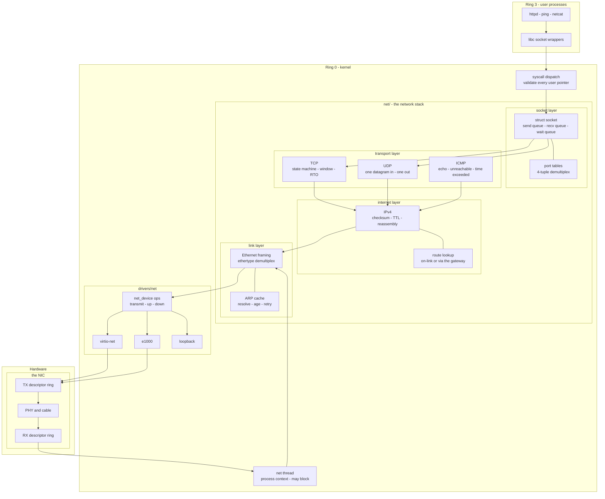

### Walking every box

**`httpd / ping / netcat`** — ordinary ring 3 programs. They know nothing about
Ethernet. They call `socket`, `connect`, `send`, `recv`, `close`. Built in
[[Stage 14.11 - Network Utilities]].

**`libc socket wrappers`** — thin functions that load the syscall number into
`rax`, the arguments into `rdi, rsi, rdx, r10, r8, r9`, and execute `syscall`.
`r10`, not `rcx`, because the `syscall` instruction overwrites `rcx` with the
return address (see [[06 - Architecture Overview]]).

**`syscall dispatch`** — the kernel side of that instruction. Its one
irreplaceable job here is **validating the user pointer**: is it canonical, is it
below the user ceiling, is it actually mapped? A socket call passes a buffer
address and a length straight from an untrusted process. A missing check is a
full kernel compromise. This is audited again in
[[Stage 15.5 - Auditing the Syscall Boundary]].

**`struct socket`** — the kernel object behind the file descriptor. It holds the
local and remote addresses and ports, a queue of received data waiting to be
read, a queue of data waiting to be sent, and a **wait queue**: the list of tasks
currently blocked inside `recv` on this socket. Built in
[[Stage 14.7 - UDP and the Socket Layer]].

**`port tables`** — the lookup that answers "which socket does this arriving
message belong to?" For UDP the key is the local port. For TCP it is the full
**4-tuple**: source IP, source port, destination IP, destination port. Two
browser tabs talking to the same web server differ only in source port, so
anything less than the full tuple mixes their data together.

**`TCP`** — the largest single algorithm in the project. A connection is a state
machine with eleven states, a pair of sliding windows, a retransmission timer,
and an estimate of the round-trip time. [[Stage 14.8 - TCP Connection Management]]
builds the state machine; [[Stage 14.9 - TCP Reliability and Flow Control]] makes
data transfer reliable.

**`UDP`** — eight bytes of header and no promises. A datagram either arrives
whole or does not arrive. There is no connection, no ordering, no
retransmission. It exists in this stack for two reasons: it is what DHCP and DNS
use ([[Stage 14.10 - DHCP and DNS]]), and it is the honest way to test the socket
layer before TCP exists to confuse the picture.

**`ICMP`** — the control protocol. It is what `ping` uses (echo request and echo
reply) and it is how a router tells you a destination is unreachable. It sits
beside TCP and UDP rather than above IP's payload boundary, because it is
addressed by IP protocol number just as they are.

**`IPv4`** — addressing between machines. It computes and verifies a header
checksum, decrements the **TTL** (time to live, a hop counter that kills packets
circulating in a routing loop), and reassembles fragments. Built in
[[Stage 14.6 - IPv4 and ICMP]].

**`route lookup`** — one decision: is the destination on my local cable, or does
it have to go through the gateway? Compare `dst & netmask` against
`my_addr & netmask`. If they match the packet is **on-link** and the next hop is
the destination itself; otherwise the next hop is the gateway. That is the entire
routing table for v1, and it is enough.

**`Ethernet framing`** — prepends 14 bytes: destination MAC, source MAC,
**ethertype**. On the way in, it checks that the destination MAC is ours or a
broadcast, reads the ethertype, and hands the rest to ARP (`0x0806`) or IPv4
(`0x0800`).

**`ARP cache`** — the bridge between the two address worlds. IP knows
`10.0.2.2`; the NIC can only address `52:54:00:12:34:56`. ARP is a broadcast
question ("who has 10.0.2.2?") whose answer is cached with a timeout. Built in
[[Stage 14.5 - Ethernet and ARP]].

**`net thread`** — a kernel task, not an interrupt handler. Everything above the
driver runs here. This box exists because of one rule from
[[06 - Architecture Overview]]: **an interrupt handler may not sleep and may not
take a mutex.** Protocol processing needs to allocate, take locks, and wake other
tasks, so it cannot live in the interrupt handler. See §3.3.

**`net_device ops`** — the abstraction from
[[Stage 14.1 - The Network Device Interface]]. One struct with a MAC address, an
MTU, an IPv4 configuration, and three function pointers: `transmit`, `up`,
`down`. Nothing above this box knows which NIC is underneath.

**`virtio-net` / `e1000` / `loopback`** — three implementations of that one
interface. `loopback` is the one to write first: `transmit` simply pushes the
buffer straight back onto the receive queue. It lets the entire stack above be
tested before any real driver exists. Writing the second real driver against an
interface designed for the first is how you discover whether Stage 14.1 was an
abstraction or an e1000-shaped hole — the same argument as two disk drivers in
[[Phase 9 - Overview]] and three filesystems in
[[ADR-0009 - Filesystem Strategy FAT32 then ext2]].

**`RX / TX descriptor ring`** — arrays in RAM, shared between the CPU and the
NIC, describing where the device should put received frames and where it should
find frames to send. Opened up in §3.1.

**`PHY and cable`** — the analogue end. The PHY adds the preamble and the frame
check sequence; neither is ever visible in your buffers.

### Walking every arrow

`APP → LIBC → SYSC` is a privilege transition: ring 3 to ring 0, via `syscall`.
It is the only way in.

`SYSC → SOCKOBJ` is a file-descriptor lookup. The fd table from
[[Stage 13.1 - The File Descriptor Table]] maps a small integer to a `struct
file`, whose private pointer is the socket.

`SOCKOBJ --- PORTS` is drawn undirected because it is a membership relation, not
a call: every bound socket is registered in the port table, and the port table's
only job is to find sockets again.

`SOCKOBJ → TCPC` and `SOCKOBJ → UDPC` are the transmit direction. The socket
type chosen at `socket()` time picks the branch permanently.

`TCPC → IPV4`, `UDPC → IPV4`, `ICMPC → IPV4` all converge, which is the whole
reason IP exists: one addressing layer serving many transport protocols.

`IPV4 --- ROUTE` is undirected for the same reason as the port table: routing is
a lookup IP performs on itself, not a layer below it.

`IPV4 → ETH` and `ETH --- ARPC`: Ethernet cannot build a header without a
destination MAC, and only ARP can supply one. If the cache misses, the packet is
parked on the ARP entry and an ARP request goes out first. That inversion — a
lower layer having to send its own packet before the higher layer's packet can
go — is the single most surprising arrow in this diagram.

`ETH → NETDEV → {VIRTIO, E1000, LOOP}` is a virtual call through the ops table.

`VIRTIO/E1000 → TXRING → PHY` is the hardware handoff: the driver writes a
descriptor, rings a doorbell, and the device does the rest by DMA.

`PHY → RXRING → NETTHREAD` is the receive handoff. Note what is **not** drawn:
there is no arrow from `RXRING` directly to `ETH`. Everything that arrives is
queued and processed later, in a context that is allowed to block.

`NETTHREAD → ETH` closes the loop, and from there the receive path climbs the
same boxes the transmit path descended.

> [!question]
> The diagram has four levels of nesting: hardware → the NIC → its rings, and
> kernel → `net/` → the socket layer → `struct socket`. Which of those
> boundaries is enforced by the CPU, which by the compiler, and which only by
> code review?

---

## 3. Zooming in

### 3.1 The wire and the ring

A NIC does not interrupt the CPU and say "here are some bytes". It is given, in
advance, a list of places it is allowed to write, and it writes there by DMA. That
list is the **descriptor ring**.

A **descriptor** is a small fixed-size record — 16 bytes on the e1000 — containing
the **physical** address of a buffer, its length, and a status byte. The ring is an
array of descriptors in physically contiguous memory. Two indices walk it: one the
hardware owns, one the driver owns.

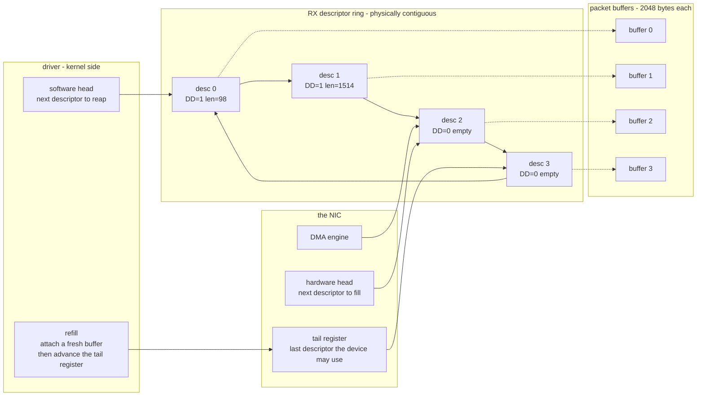

**Walking it.** The four `desc` boxes are the ring, drawn with `desc 3 → desc 0`
to make the wraparound explicit — it is an array indexed modulo its length, not a
linked list. The dotted arrows from each descriptor to a buffer are **physical
addresses**. The device does not walk page tables and has no idea what a virtual
address is; handing it one is the classic first DMA bug and it corrupts whatever
happens to live at that physical address, usually somewhere entirely unrelated.
This is the same lesson as [[Stage 9.2 - DMA and Physically Contiguous Memory]],
and the same allocator is reused.

`hardware head` is the device's own index: the next descriptor it will fill when
a frame arrives. `DMA engine → desc 2` shows it about to write there.

`tail register` is a **memory-mapped register the driver writes**. It means "the
device owns every descriptor from head up to, but not including, tail." Writing
it is how the driver says *here is more space*. On the e1000 the receive tail is
`RDT` and the transmit tail is `TDT`; on virtio-net the same idea appears as the
available ring index. The generic name for this write is a **doorbell**.

`software head` is the driver's index: the next descriptor it should inspect.
Descriptors 0 and 1 have `DD` — **Descriptor Done** — set by the device,
meaning "I have finished writing this one, it is yours now". `len` is how many
bytes it wrote.

`refill → tail register` is the loop that keeps the ring alive. For every
descriptor the driver reaps, it must attach a *fresh* buffer and hand the
descriptor back by advancing the tail. If it forgets, the ring drains, head
catches tail, and the device silently drops every subsequent frame.

> [!warning] The symptom of a ring that is never refilled
> Traffic works perfectly at low rates and stops dead under load, with no error
> anywhere. The device is not broken and your protocol code is not wrong: the NIC
> ran out of descriptors it was allowed to write into. The counter to look at is
> the controller's missed-packet or receive-no-buffers statistic. Every NIC has
> one; print it in `ifconfig`.

> [!warning] Ownership is a handshake with no lock
> The ring is shared memory between two processors, and there is no mutex the
> device can take. `DD` and the tail register *are* the protocol. Reading a
> descriptor's length before checking `DD`, or writing the tail before the buffer
> pointer is visible, gives you garbage — and on a weakly ordered read of a
> DMA-written line you may see the status byte before the data. Use the compiler
> and memory barriers from [[Stage 12.2 - Atomics and Memory Ordering]] even on
> x86, where the hardware ordering is strong but the *compiler* still reorders.

The transmit ring is the same structure with the arrows reversed: the driver
fills a descriptor with the physical address of an outgoing buffer, sets an
end-of-packet bit and a "report status when done" bit, and advances the tail. The
device DMAs the buffer out and sets `DD` when it has finished reading.

> [!danger] Do not free a transmit buffer when you submit it
> The buffer is freed when the **completion** arrives, not when the descriptor is
> written. Between those two moments the NIC is still reading that memory. Free
> it early, let the allocator hand the same page to something else, and the device
> transmits whatever the new owner wrote — or transmits fine and the new owner
> finds its memory mangled. This is a use-after-free where the second user is a
> piece of silicon, and no amount of staring at kernel code will show it to you.

### 3.2 Packet buffers: one allocation, five headers

A message gains a header at every layer on the way out and loses one at every
layer on the way in. The naive implementation allocates a new buffer per layer and
copies. For a 1460-byte segment that is four allocations and four copies of
roughly 1.5 KiB, per packet, at line rate.

The fix is old and universal — BSD calls it an `mbuf`, Linux an `sk_buff`, and we
call it a `pkt_buf`. Allocate **once**, generously, and leave empty space at the
front. Adding a header moves a pointer backwards and writes into space that was
already there.

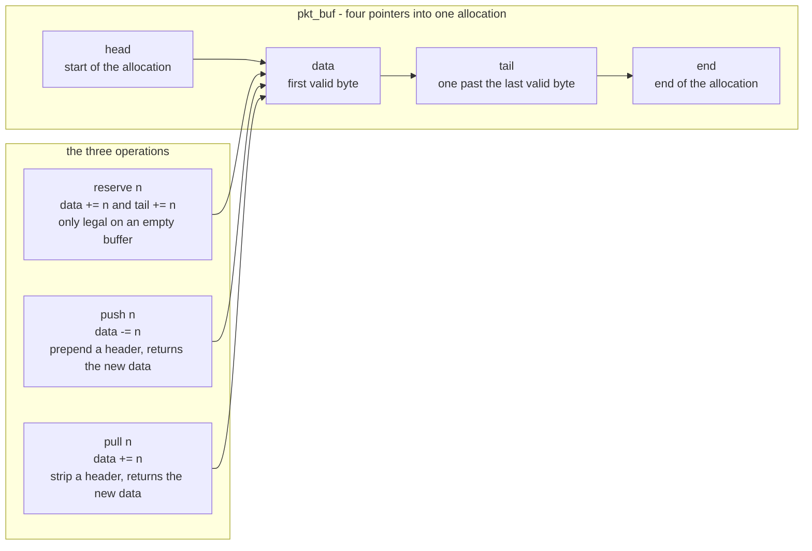

**Walking it.** `head` and `end` never move; they are the allocation. `data` and
`tail` bracket the bytes that currently matter, and `len` is `tail - data`. The
gap between `head` and `data` is **headroom**; the gap between `tail` and `end` is
**tailroom**.

`reserve` is called exactly once, right after allocation, before any payload is
written. It pushes both `data` and `tail` forward to create headroom. Calling it
on a buffer that already has content silently discards that content — hence the
"only legal on an empty buffer" note, which is worth a `KASSERT`.

`push` is prepend. It subtracts from `data` and returns the new `data` pointer,
which is exactly where the caller writes its header. Nothing is copied and nothing
is moved. `pull` is the inverse, used on receive.

All three arrows point at `data`, because `data` is the only thing any of them
actually change. That is the whole trick.

Here is the transmit side as a sequence, with real numbers:

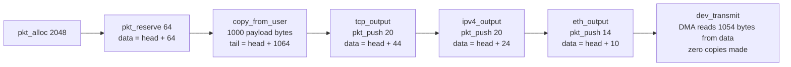

**Walking it.** Six steps, one allocation, one copy — and that copy is the
unavoidable one across the user/kernel boundary. `reserve 64` buys room for the
54 bytes of Ethernet + IPv4 + TCP with 10 bytes to spare. After the three pushes,
`data` sits at `head + 10` and `len` is 1054, which is exactly what the descriptor
gets: `virt_to_phys(data)` and 1054.

> [!example] Why 64 is tight and 128 is right
> 14 + 20 + 20 = 54, so 64 leaves 10 bytes. A VLAN tag adds 4. A virtio-net
> header — which the driver must prepend *in front of* the Ethernet header — is
> 10 bytes, or 12 with merged receive buffers. Reserve 64 and the virtio path
> fits with nothing to spare; add a VLAN tag and it does not fit at all, and the
> driver is forced into a copy or a second descriptor on every single packet.
> Reserve 128, rounded to a cache line, and stop thinking about it.

**Where the memory comes from matters.** [[06 - Architecture Overview]] puts the
kernel heap at `0xFFFFFFFF00000000` and the direct map of physical RAM (the HHDM)
at `0xFFFF800000000000`. A `kmalloc`'d address is a heap address, so getting its
physical address means walking page tables — slow, and wrong if the allocation
happens to straddle two non-contiguous frames. A packet buffer pool is therefore
built from whole physical frames addressed **through the HHDM**, where
`phys = virt - hhdm_offset` is a single subtraction and contiguity is guaranteed.

**And it must be a fixed-size pool, not a general allocator.** Buffers are
allocated from the receive interrupt handler, which may not sleep, may not take a
mutex, and must finish quickly. A slab of pre-allocated 2048-byte buffers on a
free list, protected by an IRQ-save spinlock, gives O(1) allocation with no
failure mode more complex than "empty". A general-purpose `kmalloc` gives none of
those guarantees.

> [!warning] The one rule that prevents every packet-buffer leak
> **Exactly one owner at a time, and the callee takes ownership.** When
> `eth_input` hands a buffer to `ipv4_input`, the caller must not touch it again
> — not to inspect it, not to free it. Whoever ends the journey frees it: the
> socket layer after copying to the user, or a drop path. Every early `return`
> in every layer is a potential leak, and there are dozens of them, because
> "malformed, drop it" is the most common outcome in a network stack. Write the
> rule down before the first layer is implemented, as
> [[Phase 14 - Overview]] insists.

### 3.3 The receive path in full

The receive path is split across three execution contexts, and the split is
forced by the concurrency table in [[06 - Architecture Overview]].

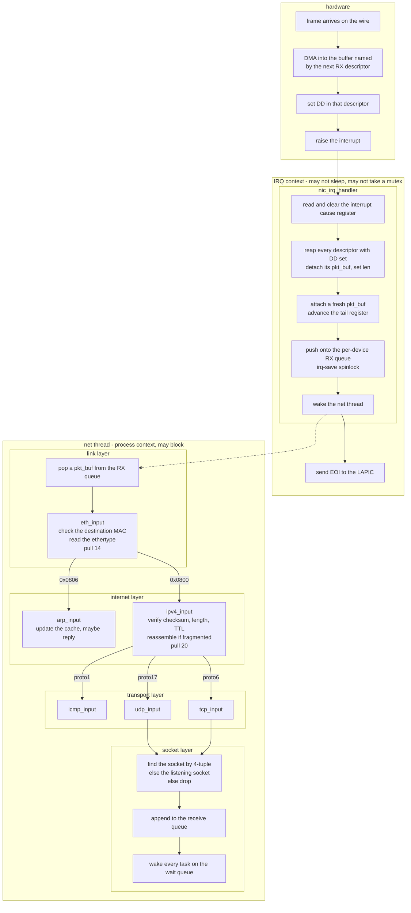

**Walking the hardware boxes.** A frame arrives; the PHY strips the preamble and
checks the frame check sequence; the DMA engine writes the frame into the buffer
the *next* descriptor names; the device sets `DD` and raises its interrupt line —
which, after [[Stage 11.5 - The I/O APIC]], arrives at a CPU through the IOAPIC
rather than the legacy 8259.

**Walking the IRQ context.** `read and clear the interrupt cause register` comes
first because on most controllers reading that register is what deasserts the
line; skip it and the interrupt refires forever. `reap` walks descriptors from the
software head while `DD` is set, detaching each buffer. `refill` immediately
attaches a replacement and advances the tail — inside the same loop, not
afterwards, so the ring is never starved. `enqueue` puts the buffers on a
per-device queue under an **IRQ-save** spinlock: the lock is shared with the net
thread, and if the thread could be interrupted while holding it, the handler would
spin forever on a lock its own CPU already owns. `wake` marks the net thread
runnable. `EOI` tells the LAPIC the interrupt is handled.

Notice what the handler does *not* do: it does not look at a single byte of the
frame. It does not know what Ethernet is. Total work is proportional to the number
of descriptors, not to the number of bytes.

**Walking the net thread.** The dotted `WAKE -.-> DEQ` arrow is deliberately
dotted: it is not a call, it is a scheduling event. The handler returns, the
scheduler eventually runs the net thread, and the thread pops the queue. Between
those two moments an arbitrary amount of time passes, which is exactly the point —
the interrupt was not held open for it.

`eth_input` checks that the destination MAC is ours, a broadcast, or a multicast
we joined, reads the 2-byte ethertype, and pulls 14 bytes. `0x0806` goes to ARP,
`0x0800` to IPv4, anything else is dropped and freed.

`ipv4_input` verifies the header checksum, checks that the total length field is
consistent with the frame, checks the destination address is ours or a broadcast,
reassembles if the fragment flags say so, then pulls the header and switches on
the protocol byte: 1 for ICMP, 6 for TCP, 17 for UDP.

`udp_input` and `tcp_input` verify their own checksums — which, unlike IP's, cover
a **pseudo-header** built from the IP addresses (§4.7) — and hand off to the
demultiplexer. `icmp_input` does not, because ICMP is addressed to the host, not
to a socket.

`demux` is the lookup that can fail three ways, and each failure has a different
correct response: no socket at all for a TCP segment means send a RST; no socket
for a UDP datagram means send an ICMP port-unreachable; a full receive queue means
silently drop, because that is what backpressure looks like at this layer.

`queue` and `wake` are the handoff to the blocked reader. The wake is why a
process sitting in `recv` uses no CPU at all while it waits — the machinery from
[[Stage 5.4 - Sleep and Blocking]] doing exactly what it was built for.

> [!warning] Doing protocol work in the interrupt handler
> It is tempting, and it works, right up until TCP needs to allocate or the socket
> layer needs a mutex. Then the handler blocks with interrupts disabled and the
> machine stops, with no output and no fault — the hardest failure in this
> document to diagnose. The three-context split is not an optimisation; it is what
> makes the rest of the stack allowed to be ordinary code.

> [!question]
> The interrupt handler enqueues and returns. What happens if frames arrive faster
> than the net thread drains the queue? Name the bounded resource, decide where
> the drop should happen, and say which counter you would print to prove it.

### 3.4 The transmit path in full

Transmit is the mirror image, with one asymmetry worth the whole section: it
mostly runs in the calling task's own context, not in a thread.

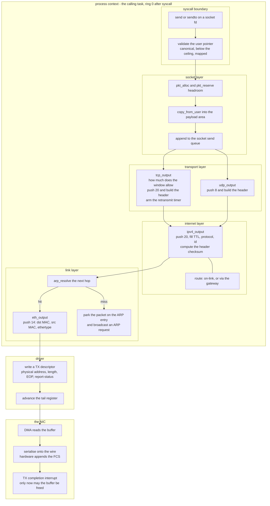

**Walking it.** `send` enters the kernel and `validate` is the security boundary
— the same check as on receive, in the opposite direction. `pkt_alloc` +
`pkt_reserve` create the buffer with headroom, and `copy_from_user` fills the
payload region. That copy is deliberate: a zero-copy design would have to pin the
user pages for the lifetime of the transmission, and a TCP buffer's lifetime lasts
until it is acknowledged, which may be seconds. Pinning arbitrary user memory for
seconds is a denial-of-service primitive handed to any process.

`append to the socket send queue` is where TCP and UDP diverge sharply. For UDP
the queue is a formality — the datagram goes straight out. For TCP the send queue
is the retransmission buffer: the data must be kept until the peer acknowledges
it, and `send` returning to the user means only "copied into the kernel", never
"delivered".

`tcp_output` is the only box in this diagram that may decide to send **nothing**.
It asks how much the peer's advertised window and the congestion window allow, and
if the answer is zero it returns having queued the data and armed a timer. §3.6
covers the arithmetic.

`ipv4_output` fills in TTL (64 is conventional), the protocol number, a fresh
identification field, and computes the header checksum over the header only.
`route` runs first to decide the **next hop**, which is what ARP is asked about —
not the final destination. Resolving the final destination's IP on a remote
network would ask a question nobody on the local cable can answer.

`arp_resolve` is the branch that makes transmit non-linear. On a hit, `eth_output`
prepends 14 bytes and the packet leaves. On a miss, the packet is **parked** on the
ARP entry, an ARP request is broadcast, and this call returns without transmitting
anything. When the reply arrives — in the net thread, later — the parked packets
are sent. Any layer above that assumed "called transmit, therefore transmitted" is
wrong.

`write a TX descriptor` + `advance the tail register` is the doorbell from §3.1.
`DMA reads the buffer` happens some time after that, asynchronously.

`TX completion interrupt` is the only place the buffer may be freed, and for TCP
not even then: TCP's copy lives on the retransmit queue until it is acknowledged.
The completion frees the *driver's* reference, and reference counting on `pkt_buf`
is how one buffer can be owned by the ring and the retransmit queue at once.

> [!warning] Sharing the transmit ring between two CPUs
> After [[Phase 12 - Overview]] two tasks on two cores can call `send` on two
> sockets simultaneously and reach the same `net_device`. The tail register is one
> register. `tx_lock` in `net_device` is not optional, and because the TX
> completion handler touches the same ring, it must be IRQ-save.

> [!question]
> Receive runs in a dedicated thread; transmit runs in the caller's context. What
> would change if transmit were also queued to a thread, and what would you lose?
> Hint: think about which task should be the one that blocks when the send queue
> is full.

### 3.5 ARP: the cache that makes IP possible on Ethernet

Ethernet delivers to a **MAC address**: 6 bytes burned into a NIC, meaningful only
on one physical cable. IP addresses to a 4-byte number that means something across
the whole Internet. Neither can be computed from the other. **ARP** (Address
Resolution Protocol, RFC 826) closes the gap by asking the cable.

The question is a broadcast: a frame sent to `ff:ff:ff:ff:ff:ff`, which every NIC
on the segment accepts, saying "who has 10.0.2.2? tell 10.0.2.15". The answer is a
unicast reply from whoever owns that address. Because broadcasting on every packet
would be absurd, the answer is cached — and because machines move, get replaced,
and change addresses, the cache entries must expire.

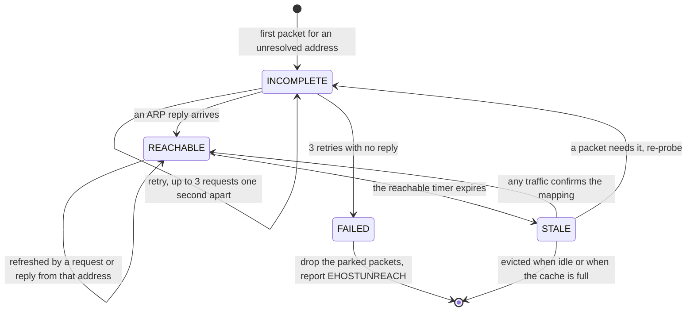

**Walking it.** An entry is created in `INCOMPLETE` the moment `arp_resolve`
misses. The self-loop is the retry timer: three requests, one second apart, is a
reasonable v1 policy. Packets for that address pile up on the entry's pending
queue while this happens — bounded, because an unreachable host must not be able
to consume all of memory.

`INCOMPLETE → REACHABLE` on a reply: fill in the MAC, flush every parked packet
through `eth_output`, start the reachable timer.

`INCOMPLETE → FAILED → [*]` is the give-up path. The parked packets are dropped
and, if a socket is waiting synchronously, `EHOSTUNREACH` is returned. A stack that
merely drops them and says nothing produces a "connect hangs forever" bug report.

`REACHABLE → REACHABLE` is opportunistic refresh. Any ARP traffic mentioning that
IP — including a request *from* it, which carries its sender's MAC — is free
evidence the mapping still holds.

`REACHABLE → STALE` and `STALE → INCOMPLETE` implement expiry lazily. A stale
entry is not deleted; it is used once more while a fresh probe goes out. Deleting
it outright would stall traffic for a round trip every time the timer fired.

`STALE → [*]` is eviction, driven by a fixed-size table.

> [!warning] Answering ARP for addresses you do not own
> The receive side must reply only when the target protocol address matches this
> interface's IP. Replying to everything makes the machine a black hole for the
> entire segment, and the people whose traffic vanished will not suspect your
> hobby OS.

> [!warning] The cache is a trust boundary
> ARP has no authentication whatsoever. Any machine on the cable can claim any IP.
> Accepting unsolicited replies for addresses you never asked about turns a
> nuisance into a redirect. v1 policy: update an entry from a reply only if an
> entry already exists, and create entries only from replies to your own requests
> or from the sender fields of a request addressed to you.

### 3.6 TCP's sliding window

UDP has no state beyond a port number. TCP has a **connection**, and the reason it
is the largest algorithm here is that it must deliver a byte stream reliably and in
order over a channel that reorders, duplicates, delays, and loses.

The mechanism is a **window** over the sequence space. Every byte of the stream has
a 32-bit sequence number. The sender tracks three of them, and their relationship
is the entire flow-control story.

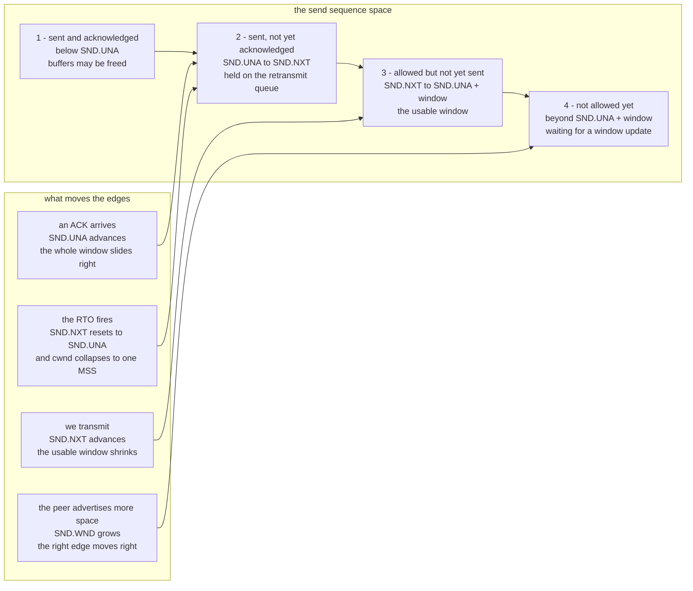

**Walking it.** The four regions are contiguous slices of one 32-bit number line,
drawn left to right in increasing sequence order.

Region 1 is history. `SND.UNA` — send unacknowledged — is the oldest byte the peer
has not confirmed. Everything below it is done and its memory is reclaimable.

Region 2 is in flight. It is the retransmit queue, and its size is what a timeout
will have to resend.

Region 3 is the **usable window**:
`SND.UNA + min(SND.WND, cwnd) - SND.NXT`. If it is positive, `tcp_output` may
send. If it is zero, it may not, no matter how much the application queued.

Region 4 is forbidden. Sending into it would overrun the peer's buffer, which is
what the window exists to prevent.

`E1` is the good event: an acknowledgement retires part of region 2 and the whole
window slides right, opening region 3 without anything else changing.

`E2` shows that transmitting *consumes* window. This is why a fast sender talking
to a slow reader eventually stalls — correctly.

`E3` is the receiver opening up after its application finally called `recv`.

`E4` is the bad event, and it is the only arrow that moves an edge **left**.

**Two windows, two different jobs.** `SND.WND` is the peer's advertised receive
window: *flow control*, protecting the receiver's memory. `cwnd`, the congestion
window, is our own estimate of what the network in between can carry: *congestion
control*, protecting everyone else. The sender obeys the smaller. Conflating them
is the most common conceptual error in a first TCP.

**Retransmission timing.** The retransmission timeout must adapt: 10 ms on
loopback, 300 ms across an ocean. RFC 6298 smooths measured round-trip times into
an average and a variance:

```text
first sample:   SRTT = R                     RTTVAR = R / 2
later samples:  RTTVAR = 0.75 * RTTVAR + 0.25 * |SRTT - R|
                SRTT   = 0.875 * SRTT  + 0.125 * R
always:         RTO    = SRTT + 4 * RTTVAR   (clamped to a floor and a ceiling)
```

> [!example] Watching the RTO absorb a hiccup
> Sample 1, R = 24 ms. `SRTT = 24`, `RTTVAR = 12`, `RTO = 24 + 48 = 72` ms.
> Sample 2, R = 28 ms. `RTTVAR = 0.75×12 + 0.25×4 = 10`,
> `SRTT = 0.875×24 + 0.125×28 = 24.5`, `RTO = 24.5 + 40 = 64.5` ms.
> Sample 3, R = 100 ms — one congested moment.
> `RTTVAR = 0.75×10 + 0.25×75.5 = 26.4`,
> `SRTT = 0.875×24.5 + 0.125×100 = 33.9`, `RTO = 33.9 + 105.6 = 139.5` ms.
> One outlier moved the average by 9 ms and the timeout by 75 ms. The variance
> term, not the average, is what stops a single slow packet from causing a
> spurious retransmission storm. Note also the floor: RFC 6298 specifies one
> second, and many stacks use 200 ms; pick one, write down which, and be aware
> that a low floor makes a lossy link much worse.

> [!warning] Karn's algorithm
> When a segment is retransmitted and an ACK arrives, you cannot tell whether it
> acknowledges the original or the copy — so the measured time is meaningless.
> **Never take an RTT sample from a retransmitted segment.** Without this the
> estimate collapses toward zero exactly when the network is worst, and the
> connection retransmits itself to death. Instead, double the RTO on each timeout
> (exponential backoff) and only resume sampling on a segment sent once.

> [!warning] Sequence numbers wrap
> The sequence space is 32 bits and it wraps. `if (ack > snd_una)` is wrong.

> [!example] The wraparound comparison
> `SND.UNA = 0xFFFFFF00`, and a valid ACK arrives for `0x00000100`.
> Naively, `0x00000100 > 0xFFFFFF00` is false, so the ACK is ignored, the
> connection stalls, and the RTO fires — once every four gigabytes of transfer,
> which is exactly often enough to be blamed on hardware.
> Correctly: `(int32_t)(ack - snd_una)` = `(int32_t)0x00000200` = `512 > 0`, so
> the ACK is accepted. **Every** sequence comparison in the stack is a signed
> difference. Unit-test this in Tier 1 with values straddling the wrap; it is the
> cheapest bug in this document to prevent and the most expensive to find.

### 3.7 Sockets and the file descriptor

A socket is reached through a file descriptor because of a decision made much
earlier: [[Stage 7.3 - The Virtual Filesystem Layer]] gave every open thing an ops
table, and [[Stage 13.1 - The File Descriptor Table]] gave every process a table of
them. A socket plugs into that. `read` and `write` work on it; `close` runs the
TCP shutdown; `dup2` makes it a pipeline stage; a shell can redirect into it.

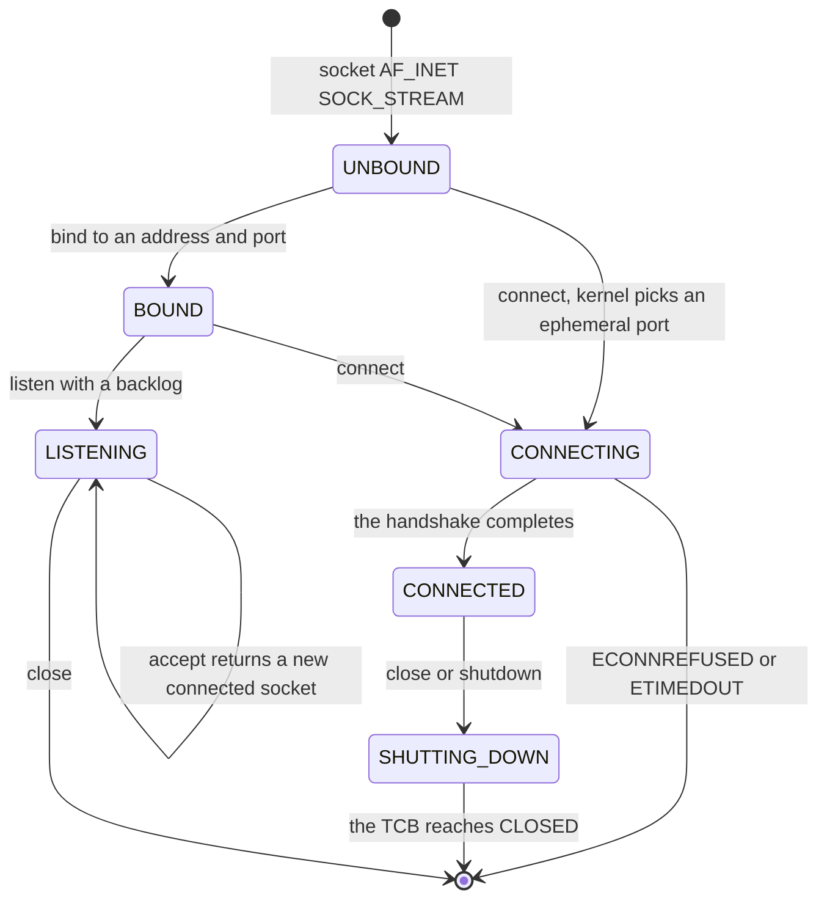

**Walking it.** `socket()` returns an `UNBOUND` socket: it has a type and a family
and nothing else. `bind` fixes a local address and port. `connect` on an unbound
socket implicitly binds it to an **ephemeral** port — a kernel-chosen number from
a high range — because a reply needs somewhere to come back to.

`listen` converts a bound socket into a `LISTENING` one, which is a different kind
of object: it never carries data. Its self-loop is the important arrow — `accept`
does not change the listening socket's state; it **manufactures a new socket** in
`CONNECTED` and returns a new fd for it. The listener goes on listening. A first
implementation that returns the listening socket itself from `accept` can serve
exactly one client, and the bug looks like a mysterious hang on the second
connection.

`CONNECTING → CONNECTED` is the completion of the three-way handshake. The two
failure exits matter: `ECONNREFUSED` is a RST arriving promptly (nothing is
listening) and `ETIMEDOUT` is silence (nothing is there, or a firewall ate it).
Reporting the wrong one makes every network problem look the same.

`SHUTTING_DOWN` exists because closing a TCP connection is not instantaneous — the
fd can be gone from the process while the TCB lingers in `TIME_WAIT` for minutes.
The socket object outlives the descriptor. This is the second place, after packet
buffers, where refcounting is unavoidable.

> [!warning] Two state machines, and they are not the same machine
> The socket lifecycle above is a *user-visible* API state. The TCP state machine
> in §4.9 is a *protocol* state. `CONNECTED` maps to `ESTABLISHED`, but
> `SHUTTING_DOWN` covers six protocol states, and `TIME_WAIT` has no socket state
> at all because the user already closed the fd. Keeping them in one enum seems
> tidy for a week and then makes `TIME_WAIT` impossible to express.

---

## 4. The data structures

### 4.1 The objects and how they point at each other

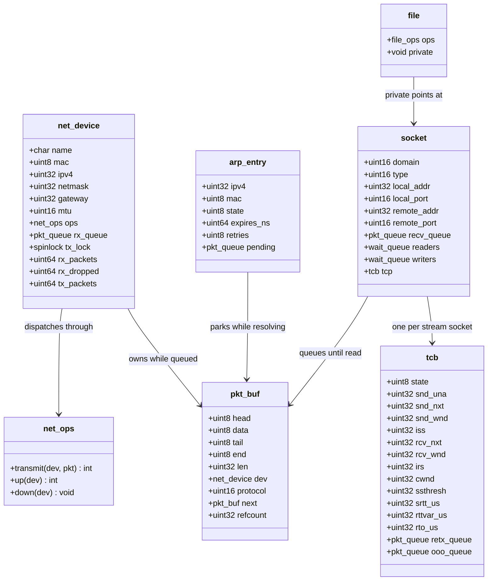

**Walking it.** `net_device` is the interface. `name` is `eth0` or `lo`. `ops` is
the vtable — a plain struct of function pointers, not a C++ virtual class, because
[[ADR-0007 - Freestanding C++20 as the Kernel Language]] rules out RTTI and the
implicit machinery that comes with it. `rx_queue` is the handoff point from §3.3
and `tx_lock` serialises access to the transmit ring.

The three counters are not decoration. `rx_dropped` climbing while `rx_packets`
stalls is the single most informative pair of numbers in the subsystem, and
[[Stage 14.11 - Network Utilities]] prints them.

`pkt_buf` is §3.2 made concrete. `next` makes it a queue element without a
separate node allocation — a packet is only ever on one queue at a time, which is
the ownership rule restated as a data structure. `refcount` exists for the one case
that violates that: a TCP segment simultaneously handed to the driver and held on
the retransmit queue.

`arp_entry` carries a `pending` queue, which is the parked-packet mechanism from
§3.4, and `expires_ns` in the monotonic nanosecond timebase from
[[Stage 11.6 - HPET and TSC Calibration]].

`socket` holds both halves of the 4-tuple and two wait queues. Two, not one:
readers block when the receive queue is empty and writers block when the send
queue is full, and waking all of them for either event is a thundering herd on a
busy server.

`tcb` — Transmission Control Block, the RFC's name — is where a connection lives.
It is deliberately a separate allocation from `socket`, because it outlives the
socket through `TIME_WAIT`.

`file → socket` is the fd indirection. Everything above the socket layer sees a
number.

### 4.2 The Ethernet frame

What the driver hands you begins at the destination MAC. The preamble, the start
frame delimiter, and the trailing FCS are the PHY's business and never appear in a
`pkt_buf`.

| Offset | Size | Field | Meaning |
|---|---|---|---|
| 0 | 6 | Destination MAC | Who should accept this frame. `ff:ff:ff:ff:ff:ff` is broadcast |
| 6 | 6 | Source MAC | The sending NIC |
| 12 | 2 | EtherType | What the payload is. Big-endian |
| 14 | 46–1500 | Payload | The IP packet or ARP message |
| — | 4 | FCS | CRC-32, added and checked by hardware |

EtherTypes that matter here: `0x0800` IPv4, `0x0806` ARP, `0x86DD` IPv6 (which we
do not implement, and must therefore drop cleanly rather than mis-parse).

> [!warning] The 60-byte minimum
> An Ethernet frame must be at least 64 bytes including the FCS, so at least 60
> bytes of header plus payload. A 28-byte ARP message plus a 14-byte header is 42.
> Some controllers pad short frames for you if you enable it; do not rely on it.
> Pad to 60 with zeroes in `eth_output`. The failure mode is that everything works
> under QEMU and ARP silently fails on real hardware, because a real switch drops
> the runt frame — and ARP failing means *nothing at all* works, which sends you
> looking in entirely the wrong place.

### 4.3 The ARP message

28 bytes for IPv4 over Ethernet. Every multi-byte field is big-endian.

| Offset | Size | Field | Value for us |
|---|---|---|---|
| 0 | 2 | Hardware type | `1` = Ethernet |
| 2 | 2 | Protocol type | `0x0800` = IPv4 |
| 4 | 1 | Hardware address length | `6` |
| 5 | 1 | Protocol address length | `4` |
| 6 | 2 | Operation | `1` = request, `2` = reply |
| 8 | 6 | Sender hardware address | The asker's MAC |
| 14 | 4 | Sender protocol address | The asker's IP |
| 18 | 6 | Target hardware address | Zeroes in a request |
| 24 | 4 | Target protocol address | The IP being asked about |

Answering a request is almost entirely a swap: copy sender into target, put your
own MAC and IP in sender, set operation to 2, and send it back **unicast** to the
asker — not broadcast. And take the free information: a request tells you the
asker's IP-to-MAC mapping, which you are about to need for the reply anyway.

### 4.4 The IPv4 header

```text
 0                   1                   2                   3
 0 1 2 3 4 5 6 7 8 9 0 1 2 3 4 5 6 7 8 9 0 1 2 3 4 5 6 7 8 9 0 1
+-+-+-+-+-+-+-+-+-+-+-+-+-+-+-+-+-+-+-+-+-+-+-+-+-+-+-+-+-+-+-+-+
|Version|  IHL  |   DSCP    |ECN|         Total Length          |
+-+-+-+-+-+-+-+-+-+-+-+-+-+-+-+-+-+-+-+-+-+-+-+-+-+-+-+-+-+-+-+-+
|        Identification         |Flags|     Fragment Offset     |
+-+-+-+-+-+-+-+-+-+-+-+-+-+-+-+-+-+-+-+-+-+-+-+-+-+-+-+-+-+-+-+-+
|  Time to Live |    Protocol   |        Header Checksum        |
+-+-+-+-+-+-+-+-+-+-+-+-+-+-+-+-+-+-+-+-+-+-+-+-+-+-+-+-+-+-+-+-+
|                        Source Address                         |
+-+-+-+-+-+-+-+-+-+-+-+-+-+-+-+-+-+-+-+-+-+-+-+-+-+-+-+-+-+-+-+-+
|                      Destination Address                      |
+-+-+-+-+-+-+-+-+-+-+-+-+-+-+-+-+-+-+-+-+-+-+-+-+-+-+-+-+-+-+-+-+
```

| Field | Bits | Meaning and the trap |
|---|---|---|
| Version | 4 | Always `4`. Check it; a `6` here means someone sent you IPv6 |
| IHL | 4 | Header length in **32-bit words**, minimum 5. Multiply by 4. Values below 5 are malformed and must be rejected before you index anything |
| DSCP / ECN | 6 + 2 | Quality of service. Ignore on receive, zero on send |
| Total Length | 16 | Header **plus** payload, in bytes. Never trust it — clamp against the actual frame length |
| Identification | 16 | Groups the fragments of one original packet |
| Flags | 3 | Bit 0 reserved, bit 1 **DF** (don't fragment), bit 2 **MF** (more fragments) |
| Fragment Offset | 13 | Position of this fragment, in **8-byte units**. Multiply by 8 |
| Time to Live | 8 | Hop count. Decrement when forwarding; 64 is the conventional initial value |
| Protocol | 8 | `1` ICMP, `6` TCP, `17` UDP |
| Header Checksum | 16 | Covers the header only, not the payload |
| Source / Destination | 32 each | The addresses, big-endian |

**Fragmentation.** If a packet is larger than the next link's MTU, IPv4 lets a
sender split it: the same identification, ascending fragment offsets, MF set on
all but the last. The receiver holds the pieces in a table keyed by
`(source, destination, protocol, identification)` and reassembles when it has a
contiguous run ending in a fragment with MF clear.

> [!warning] Reassembly is an attack surface, not a feature
> An attacker sends the first fragment of ten thousand packets and never sends the
> rest. Without a bounded table and a timer, that is all of your memory. With
> overlapping fragments, a reassembled packet can be made to look different to
> your firewall than to your TCP — the old "teardrop" class of bug. v1 policy:
> reassemble, but with a hard cap on concurrent reassemblies, a 30-second timer,
> and outright rejection of any fragment that overlaps one already held.

**On transmit we never fragment.** TCP is limited by its MSS to something that
fits, and an oversized UDP `sendto` returns `EMSGSIZE`. Setting DF and refusing to
fragment removes an entire code path, and the cost — no support for paths with a
smaller MTU than ours — is invisible on Ethernet.

### 4.5 The Internet checksum

One algorithm, used by IPv4, ICMP, UDP, and TCP: treat the region as a sequence of
big-endian 16-bit words, sum them with end-around carry, and take the one's
complement. The checksum field itself is zero during computation. Verification is
the same sum over the region *including* the stored checksum, which must come to
zero.

> [!example] Computing one by hand
> A 20-byte header — total length 60, DF set, TTL 64, protocol 6 (TCP), from
> `10.0.2.15` to `10.0.2.2`, checksum field zeroed:
> `45 00 00 3c  1c 46 40 00  40 06 00 00  0a 00 02 0f  0a 00 02 02`
>
> As ten 16-bit words: `4500 003c 1c46 4000 4006 0000 0a00 020f 0a00 0202`.
> Running total: `453c`, `6182`, `a182`, `e188`, `e188`, `eb88`, `ed97`, `f797`,
> `f999`. No carry out of 16 bits, so the sum is `0xF999` and the checksum is
> `~0xF999 = 0x0666`.
>
> To verify, sum all ten words with `0x0666` in place: `0xF999 + 0x0666 = 0xFFFF`,
> whose complement is `0x0000`. That "sums to zero" property is the whole point —
> the receiver never has to zero anything or special-case the field.
>
> Two consequences worth internalising: the sum is endian-agnostic if you are
> careful (summing native-endian 16-bit words and storing the result native-endian
> gives the same bytes on the wire), and it is trivially incrementally updatable,
> which is how a router adjusts the checksum after decrementing TTL without
> re-reading the header.

This is Tier 1 test material of the purest kind — a pure function with no
dependencies, checked against packets captured from a real stack.
[[ADR-0010 - Testing Strategy and the QEMU Exit Device]] and
[[09 - Testing Strategy]] cover the harness.

### 4.6 ICMP echo

| Offset | Size | Field | Meaning |
|---|---|---|---|
| 0 | 1 | Type | `8` = echo request, `0` = echo reply, `3` = destination unreachable, `11` = time exceeded |
| 1 | 1 | Code | Sub-reason. `0` for echo |
| 2 | 2 | Checksum | Over the whole ICMP message, **no** pseudo-header |
| 4 | 2 | Identifier | Chosen by the sender, echoed back |
| 6 | 2 | Sequence Number | Incremented per ping, echoed back |
| 8 | n | Data | Arbitrary; must be returned byte for byte |

Answering a ping is four operations: verify the checksum, change type 8 to type 0,
recompute the checksum, send it back to the source with source and destination
swapped. Identifier and sequence are how `ping` on the other machine matches
replies to requests and computes a round-trip time — they are *its* bookkeeping,
and you must not touch them.

> [!warning] Returning the wrong data
> `ping` compares the payload it sent against the payload it got back and prints
> "wrong data byte" if they differ. If you allocate a fresh buffer for the reply
> instead of reusing the request's, it is easy to copy the ICMP header and forget
> the payload — which can be any length the sender chose. Reusing the incoming
> `pkt_buf` and rewriting two fields in place is both faster and harder to get
> wrong.

Destination-unreachable (type 3) is the message a stack sends when a UDP datagram
arrives for a port nobody has bound. Its payload is the IP header plus the first 8
bytes of the offending datagram, which is enough for the sender to identify which
of its sockets to fail.

### 4.7 UDP and the pseudo-header

| Offset | Size | Field | Meaning |
|---|---|---|---|
| 0 | 2 | Source Port | |
| 2 | 2 | Destination Port | |
| 4 | 2 | Length | UDP header **plus** data. Minimum 8 |
| 6 | 2 | Checksum | Optional in IPv4; `0` means not computed |

Eight bytes, and that is the entire protocol. `sendto` becomes one datagram;
`recvfrom` returns one datagram and its sender's address. Message boundaries are
preserved, unlike TCP — a `recvfrom` with a buffer smaller than the datagram
truncates and discards the rest, it does not return the remainder next time.

**The pseudo-header** is the part that catches everyone. UDP's and TCP's checksums
are computed over a 12-byte prefix that is never transmitted:

| Offset | Size | Field |
|---|---|---|
| 0 | 4 | Source IP address |
| 4 | 4 | Destination IP address |
| 8 | 1 | Zero |
| 9 | 1 | Protocol (`17` for UDP, `6` for TCP) |
| 10 | 2 | UDP or TCP length |

It exists so that a transport-layer checksum also covers the addresses, catching a
packet delivered to the wrong host by a corrupted IP header. Because the sum is
just an addition, you do not need to build the prefix in memory — sum the fields
into the accumulator before summing the segment.

> [!warning] The checksum bug that only breaks TCP
> A missing or wrong pseudo-header produces a stack where ping works, UDP appears
> to work (because the peer may not verify a zero checksum, and IPv4 allows UDP to
> omit it), and TCP hangs forever with no error. The peer silently discards every
> segment; you see your SYNs go out and nothing come back. Wireshark on the host
> will label it `[incorrect, should be 0x....]` in the first thirty seconds of
> looking, which is why [[Phase 14 - Overview]] insists on a packet capture as the
> debugger for this phase.

### 4.8 The TCP header

```text
 0                   1                   2                   3
 0 1 2 3 4 5 6 7 8 9 0 1 2 3 4 5 6 7 8 9 0 1 2 3 4 5 6 7 8 9 0 1
+-+-+-+-+-+-+-+-+-+-+-+-+-+-+-+-+-+-+-+-+-+-+-+-+-+-+-+-+-+-+-+-+
|          Source Port          |       Destination Port        |
+-+-+-+-+-+-+-+-+-+-+-+-+-+-+-+-+-+-+-+-+-+-+-+-+-+-+-+-+-+-+-+-+
|                        Sequence Number                        |
+-+-+-+-+-+-+-+-+-+-+-+-+-+-+-+-+-+-+-+-+-+-+-+-+-+-+-+-+-+-+-+-+
|                     Acknowledgment Number                     |
+-+-+-+-+-+-+-+-+-+-+-+-+-+-+-+-+-+-+-+-+-+-+-+-+-+-+-+-+-+-+-+-+
| Offset| Rsrvd |C|E|U|A|P|R|S|F|            Window             |
+-+-+-+-+-+-+-+-+-+-+-+-+-+-+-+-+-+-+-+-+-+-+-+-+-+-+-+-+-+-+-+-+
|           Checksum            |        Urgent Pointer         |
+-+-+-+-+-+-+-+-+-+-+-+-+-+-+-+-+-+-+-+-+-+-+-+-+-+-+-+-+-+-+-+-+
|                            Options                            |
+-+-+-+-+-+-+-+-+-+-+-+-+-+-+-+-+-+-+-+-+-+-+-+-+-+-+-+-+-+-+-+-+
```

| Field | Bits | Meaning |
|---|---|---|
| Source / Destination Port | 16 each | With the IP addresses, these four form the connection's identity |
| Sequence Number | 32 | The sequence number of the **first data byte** in this segment. On a SYN, the initial sequence number |
| Acknowledgment Number | 32 | Valid only when ACK is set. The **next** sequence number expected — cumulative, not selective |
| Data Offset | 4 | Header length in 32-bit words, minimum 5. Anything less is malformed |
| Reserved | 4 | Zero |
| Flags | 8 | `CWR ECE URG ACK PSH RST SYN FIN`, in that bit order |
| Window | 16 | How many more bytes the sender of this segment can receive |
| Checksum | 16 | Over the pseudo-header, the TCP header, and the data |
| Urgent Pointer | 16 | Valid only with URG. Do not implement it; nothing sane uses it |

**The flags that matter.** `SYN` opens a connection and synchronises sequence
numbers. `FIN` says "I have no more data to send" — one direction only, which is
why teardown takes four segments. `ACK` is set on every segment after the first.
`RST` aborts, immediately and without negotiation. `PSH` is a hint to deliver
promptly. `CWR` and `ECE` belong to explicit congestion notification, which we do
not implement — but must not choke on.

**SYN and FIN each consume one sequence number** even though they carry no data.
This is not a detail; it is what makes them acknowledgeable and therefore reliable.
Get it wrong and your handshake is off by one forever.

**Options** are a list of `kind`, `length`, `value` records. The only one v1 sends
is **MSS** (kind 2, length 4): the largest segment payload we will accept,
`MTU - 20 - 20 = 1460` on Ethernet, announced in the SYN and the SYN-ACK only. You
must *parse* the others without understanding them — window scale (3),
SACK-permitted (4), timestamps (8) will all appear in the first SYN any real peer
sends you. Skipping an unknown option means reading its length byte and advancing;
NOP (1) is one byte with no length, and EOL (0) ends the list. An option parser
that trusts the length field without bounding it against the data offset is a
remote memory-read primitive.

### 4.9 The TCP state machine

Eleven states. This is the diagram to be able to draw from memory.

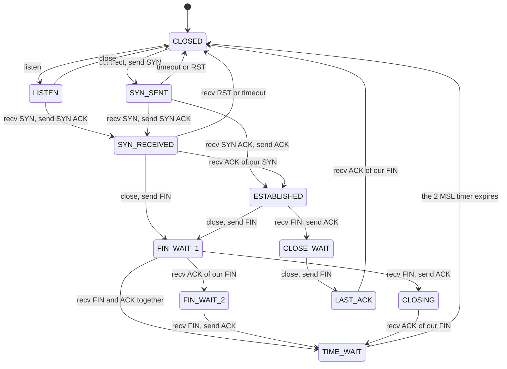

**Walking it.** Read it as three regions: opening (top), established (middle), and
closing (bottom, and much larger than you expect).

`CLOSED → LISTEN` is the server's `listen`. `CLOSED → SYN_SENT` is the client's
`connect`. These are the only two transitions driven purely by the local
application.

`LISTEN → SYN_RECEIVED` on an incoming SYN. `SYN_RECEIVED → ESTABLISHED` when the
handshake's third segment arrives.

`SYN_SENT → ESTABLISHED` is the client's normal path: it gets a SYN and an ACK in
one segment and replies with an ACK.

`SYN_SENT → SYN_RECEIVED` is **simultaneous open** — both sides called `connect`
to each other at the same moment. It essentially never happens in practice and it
is in the diagram because leaving it out means an unhandled case in a switch
statement, and unhandled cases in a protocol state machine are how you get a
kernel that panics on a crafted packet.

`ESTABLISHED → FIN_WAIT_1` is *we* closed first. `ESTABLISHED → CLOSE_WAIT` is
*they* closed first. Everything below splits on that, and the two halves are not
symmetric.

The active-close side: `FIN_WAIT_1` waits for its FIN to be acknowledged.
`FIN_WAIT_2` means our FIN is acknowledged but they are still sending. `CLOSING`
is simultaneous close. All three funnel into `TIME_WAIT`.

The passive-close side: `CLOSE_WAIT` means the peer is done but **we may still
send** — the connection is half-closed, and the local application has not called
`close` yet. `CLOSE_WAIT → LAST_ACK` happens when it finally does. This is why
`netstat` on an overloaded server shows thousands of `CLOSE_WAIT` sockets: that is
not a kernel bug, it is an application that leaked file descriptors.

`TIME_WAIT → CLOSED` after **2 MSL** — twice the maximum segment lifetime,
conventionally 2 minutes each, though 60 seconds total is a common
implementation choice.

> [!warning] TIME_WAIT is not a wart, and removing it breaks things
> It does two jobs. First, if the final ACK is lost, the peer retransmits its FIN;
> something must still exist to re-acknowledge it, or the peer receives a RST and
> reports an error on a connection that closed perfectly. Second, it holds the
> 4-tuple out of circulation long enough for stray duplicates of the old
> connection to expire, so a new connection reusing the same ports cannot receive
> data addressed to its predecessor. The visible cost is that restarting a server
> gives `EADDRINUSE` for a minute — which is what `SO_REUSEADDR` exists to
> override for a listening socket.

> [!warning] Predictable initial sequence numbers are a remote vulnerability
> If ISS is a simple counter, an off-path attacker who can guess it can inject
> data into somebody else's connection without ever seeing a packet. RFC 6528
> specifies a fine-grained clock plus a keyed hash of the 4-tuple. This is on the
> list for [[Stage 15.5 - Auditing the Syscall Boundary]] and
> [[Phase 15 - Overview]], and it is cheap to do correctly from the start.

> [!question]
> Trace a connection where the *server* calls `close` first. Which states does
> each side pass through, which one ends in `TIME_WAIT`, and what does that imply
> about which machine accumulates them under load — the busy web server or its
> clients?

### 4.10 The TCB variables

RFC 9293's names, because using them makes the RFC readable as documentation.

| Variable | Meaning |
|---|---|
| `SND.UNA` | Oldest unacknowledged sequence number. The left edge of the send window |
| `SND.NXT` | Next sequence number to send |
| `SND.WND` | The peer's advertised receive window |
| `ISS` | Our initial send sequence number |
| `RCV.NXT` | Next sequence number we expect. This is what we put in the ACK field |
| `RCV.WND` | How much space we have. This is what we advertise |
| `IRS` | The peer's initial sequence number |
| `cwnd` | Congestion window — our estimate of what the path can carry |
| `ssthresh` | Slow-start threshold; the boundary between exponential and linear growth |
| `SRTT`, `RTTVAR`, `RTO` | The timing estimates from §3.6 |

**Congestion control, Reno-style, in four rules.** Start with `cwnd` small and
`ssthresh` large. While `cwnd < ssthresh` (**slow start**) increase `cwnd` by one
MSS per ACK, which doubles it every round trip. At or above `ssthresh`
(**congestion avoidance**) increase it by one MSS per *round trip* instead. On a
timeout, set `ssthresh` to half the flight size and `cwnd` to one MSS — the
network told you it is congested in the harshest available way. On three duplicate
ACKs, **fast retransmit**: resend the missing segment immediately rather than
waiting for the timer, because three duplicates mean segments after the gap are
still arriving, so the path is not dead.

[[Phase 14 - Overview]] fixes the scope: Reno, yes; SACK, window scaling,
timestamps, and full fast recovery, no. Those are all real improvements and all of
them are easier to add to a correct Reno than to debug alongside one.

---

## 5. The flows

### 5.1 Answering a ping — the first thing that works

This is the deliverable of [[Stage 14.6 - IPv4 and ICMP]], and the moment the
project stops being theoretical.

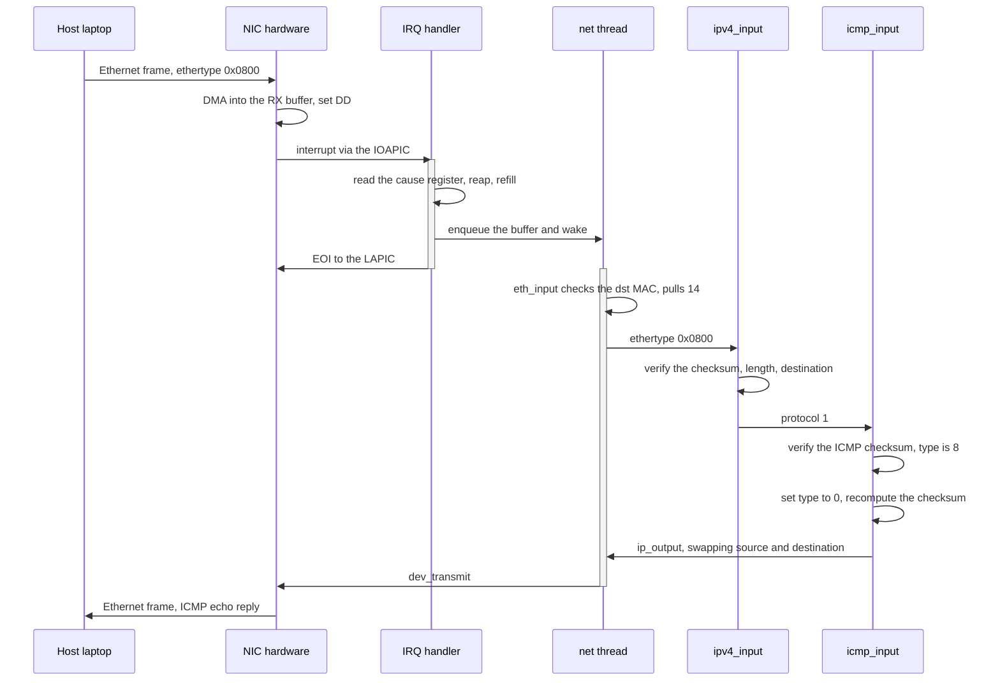

**Walking it.** The `activate`/`deactivate` bars are the point of this diagram:
they show who holds control. The IRQ handler's bar is short and contains no
protocol logic at all — read the cause register, reap descriptors, refill, enqueue,
wake, EOI. The net thread's bar is long and does everything else.

The handoff between them is `enqueue and wake`, which is not a call: the handler
returns first and the thread runs whenever the scheduler chooses. Nothing in this
path holds a lock across the boundary.

Inside the net thread, notice that each layer's first action is **validation**.
`eth_input` checks the destination MAC. `ipv4_input` checks the checksum, that the
total length is consistent, and that the destination is us. `icmp_input` checks the
ICMP checksum before believing the type field. A packet from a hostile network is
the least trustworthy input the kernel ever handles — more so than a syscall
argument, because at least a syscall came from a process you started.

The reply is built by mutating the request in place and sending it back out
through the same `ip_output` path a locally generated packet would use. Nothing
about the transmit path knows or cares that this packet began life as a receive.

### 5.2 The three-way handshake and `accept`

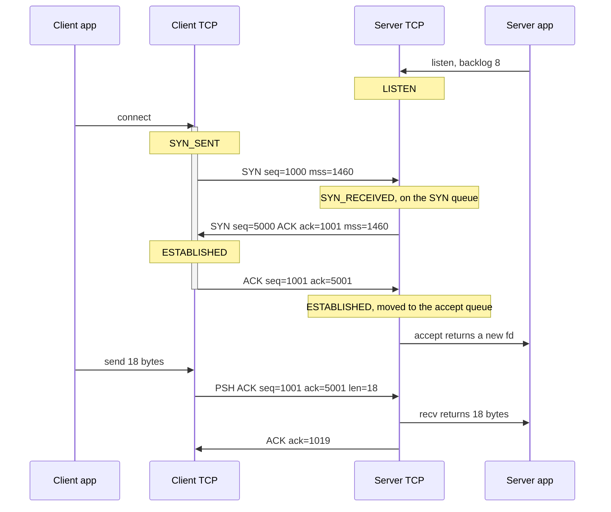

**Walking it.** `listen` with a backlog creates the two queues that make a server
work. The **SYN queue** holds half-open connections in `SYN_RECEIVED`; the
**accept queue** holds completed ones waiting for the application. `accept` pops
the second queue and blocks if it is empty.

The client's `connect` sends a SYN with `seq=1000` — its ISS — and blocks. Note
that `connect` blocking is why `CT`'s activation bar spans the whole handshake:
one syscall, three network segments, a round trip of latency.

The server replies with its own SYN (`seq=5000`, its ISS) and an ACK of
`ack=1001`. The 1001 is 1000 + 1, because **the SYN consumed sequence number
1000**. Both directions synchronise in this one segment, which is why the
handshake is three segments and not four.

The client's ACK completes it. The client is `ESTABLISHED` as soon as it *sends*
that ACK; the server only when it *receives* it. There is a window where the
client can send data the server has not yet accounted for — which is exactly why
the server must be prepared to receive data in `SYN_RECEIVED`.

`accept returns a new fd` is the transition from §3.7: the listening socket is
untouched, and a new socket object with its own TCB is handed to the application.

The `mss=1460` option on both SYNs is each side telling the other the largest
segment it will accept. Neither side may exceed the other's announcement, and the
option appears **only** on SYN segments — there is no way to renegotiate later.

The final exchange shows normal data flow: `seq=1001` because the SYN used 1000,
`len=18`, and the server's `ack=1019` = 1001 + 18. Every off-by-one in TCP is
findable by writing this arithmetic out.

> [!warning] The SYN flood
> Every SYN allocates an entry on the SYN queue and holds it until the third
> segment arrives or the timer expires. An attacker sends SYNs from spoofed
> addresses and never completes any of them; the queue fills; legitimate
> connections are refused. The classic mitigation is **SYN cookies**: instead of
> allocating, encode the connection's essential state into the ISS itself using a
> keyed hash, allocate nothing, and reconstruct the state from the ACK's
> acknowledgment number when it comes back. [[Phase 14 - Overview]] lists a SYN
> flood among the Tier 3 adversarial tests for exactly this reason.

### 5.3 Blocking in `recv` and being woken

This flow is where the network stack meets the scheduler, and it is the reason
[[Stage 5.4 - Sleep and Blocking]] had to exist before Phase 14 could start.

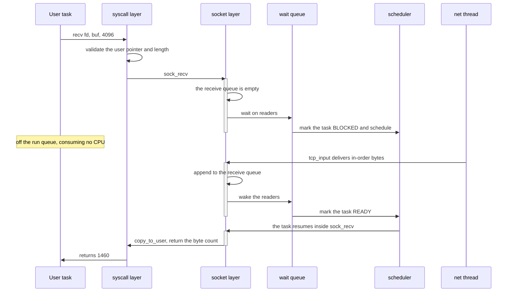

**Walking it.** The three separate activation bars on `SK` are the important
visual: `sock_recv` is entered, abandoned mid-function, re-entered by a different
context, and then resumed by the original task. It is one C function whose stack
frame survives across a context switch, which is the whole trick of a blocking
syscall.

`validate the user pointer and length` happens **before** anything else, and the
`copy_to_user` at the end is the second half of the same discipline. The pointer is
checked once on entry, but the copy itself must still be fault-tolerant, because
the process could have unmapped the page in between — on SMP, from another thread,
while this one is blocked.

`wait on readers` puts the task on the socket's reader wait queue and calls the
scheduler. The `Note over U` is doing real work in this diagram: the task is not
polling, not spinning, not on the run queue. It costs nothing until data arrives.

`tcp_input delivers in-order bytes` is deliberately specific. TCP delivers only
the contiguous prefix of the stream. A segment that arrives out of order goes on
the out-of-order queue in the TCB and wakes nobody, because the bytes before it
are still missing. This is the single behaviour that makes TCP a *stream*.

`wake the readers` is where the lock discipline bites. The socket's queue lock and
the wait queue's lock are both taken here, always in the same order, ranked as
described in [[06 - Architecture Overview]]. Waking a task while holding a lock the
woken task will immediately need is a self-inflicted stall on a uniprocessor and a
deadlock on SMP.

> [!warning] Short reads are correct, and applications forget it
> `recv` on a stream socket returns what is available, not what was asked for. A
> return of 1460 from a `recv(fd, buf, 4096)` is not an error and not an
> end-of-stream. `0` means the peer sent FIN. Negative is an errno. A libc that
> loops until the buffer is full will hang on a well-behaved server that sent
> exactly one message.

### 5.4 Retransmission

There is no diagram for this because the sequence is short and the arithmetic is
the whole story.

A segment is sent, a copy stays on `retx_queue`, and the retransmission timer is
armed for `RTO` if it is not already running. Three outcomes:

- **The ACK arrives.** `SND.UNA` advances past the segment, the copy is freed, an
  RTT sample is taken (unless Karn forbids it), and the timer is re-armed for the
  oldest remaining unacknowledged segment or cancelled if there is none.
- **The RTO fires.** The oldest unacknowledged segment is retransmitted — *only*
  that one. `ssthresh` drops to half the flight size, `cwnd` collapses to one MSS,
  and `RTO` doubles. Retransmitting the entire queue on a timeout is a mistake that
  turns a single lost packet into a burst that guarantees more loss.
- **Three duplicate ACKs arrive.** Fast retransmit: resend the segment at
  `SND.UNA` immediately without waiting for the timer, and halve `ssthresh` without
  collapsing `cwnd` all the way. Duplicate ACKs are *good news* — they prove later
  segments are still arriving.

> [!warning] Two stalls that look identical from the outside
> A connection that transfers nothing while both sides appear healthy is usually
> one of two things. **Zero window:** the peer advertised `wnd=0` and you have no
> persist timer, so nobody ever asks again — a deadlock where both sides wait
> politely forever. The fix is a persist timer that sends a one-byte probe.
> **Nagle against delayed ACK:** your sender is withholding a small segment until
> the previous one is acknowledged, and the receiver is withholding the
> acknowledgement for up to 500 ms hoping to piggyback it. Each waits for the
> other, at 200–500 ms per exchange. Both are in every real stack and both look
> like "the network is slow".

---

## 6. Why it is shaped this way

| Option | Cost | Verdict |
|---|---|---|
| Port lwIP or picoTCP | Weeks saved; a working stack immediately | **Rejected.** The stack *is* the phase. Keep lwIP as a reference to compare packet captures against, as [[Phase 14 - Overview]] suggests |
| Copy a fresh buffer at each layer | Simple, obviously correct | **Rejected.** Four allocations and 6 KiB of copying per 1460-byte segment. Headroom costs one `reserve` call |
| Zero-copy DMA into user buffers | No copy at all | **Rejected.** Requires pinning user pages for the lifetime of a transfer — seconds, for TCP. A process could pin all of RAM. Copy at the socket boundary |
| Protocol processing in the IRQ handler | No thread, no queue, lower latency | **Rejected.** Interrupt handlers may not sleep or take mutexes ([[06 - Architecture Overview]]). Everything above the driver needs both |
| NAPI-style polling under load | Much better throughput at high packet rates | **Deferred.** Interrupt per batch is adequate at our rates; the enqueue-and-wake split is already the right shape to add polling later |
| A simplified TCP with fewer states | Less code, easier to finish | **Rejected.** The missing states are exactly the ones a real peer will drive you into. An unhandled state is a panic on a crafted packet |
| Hardware checksum offload | Free checksums, both directions | **Rejected for v1.** Software first: it is Tier 1 testable, works identically on every device, and you cannot debug an offload you never understood |
| Full IPv4 fragmentation on transmit | Handles any path MTU | **Rejected.** TCP is bounded by MSS; oversized UDP returns `EMSGSIZE`. Reassembly on receive is still required |
| Sockets in their own namespace, not fds | Simpler; no VFS coupling | **Rejected.** Then `read`, `write`, `close`, `dup2`, and shell redirection all need special cases, and `netcat` cannot be a pipeline stage |
| One global lock for the whole stack | Trivially correct | **Rejected past Phase 12.** Per-device queues and per-socket locks, with a documented rank order |
| Predictable initial sequence numbers | One line of code | **Rejected.** Off-path connection injection. RFC 6528 hashing, from the start |

**What specifically breaks under the rejected alternatives.**

*Copying per layer* does not fail, it just caps throughput and hides the cost
inside `memcpy`, where a profiler blames the wrong thing.

*IRQ-context protocol processing* fails the first time TCP allocates under memory
pressure or the socket layer takes a mutex: the machine stops with interrupts
disabled, no panic, no output. This is the worst failure in the document because
there is nothing to read afterwards.

*A simplified TCP* fails on contact with a real peer. Linux will send you window
scale and SACK-permitted options in its first SYN, will perform simultaneous
close, and will retransmit a FIN if your final ACK is lost. Each unhandled case is
a hang or a panic, triggered remotely.

*Sockets outside the fd table* fails at the shell: `nc host 80 < file` is not
expressible, and after [[Phase 13 - Overview]] gave you pipes and `dup2`, having
one kind of I/O object that does not participate is a permanent tax.

Related decisions: [[ADR-0007 - Freestanding C++20 as the Kernel Language]] (no
exceptions, so every layer returns an error code and every early return is a
potential buffer leak), [[ADR-0008 - Monorepo Layout]] (`sockaddr_in`, the socket
constants, and `errno` values live in `kernel/include/abi/`, shared verbatim by
kernel and libc), [[ADR-0010 - Testing Strategy and the QEMU Exit Device]] (the
three tiers that make checksums and sequence arithmetic testable without booting).

---

## 7. How this grows across the phases

Phase 14 is late in the project for a reason: nearly every earlier phase
contributes a piece the network stack cannot live without.

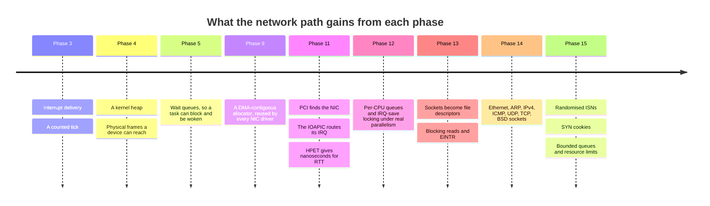

**Walking it.** [[Phase 3 - Overview]] gives interrupt delivery — without it a NIC
cannot tell you anything happened. [[Phase 4 - Overview]] gives the heap and,
critically, physical frame allocation: a device needs physical addresses, and the
HHDM from [[06 - Architecture Overview]] is what makes converting between the two a
subtraction.

[[Phase 5 - Overview]] is the one people underestimate. `recv` blocking is the
whole reason a server does not burn a core per idle connection, and the mechanism
is [[Stage 5.4 - Sleep and Blocking]], written nine phases earlier for a keyboard.

[[Phase 9 - Overview]] contributes [[Stage 9.2 - DMA and Physically Contiguous Memory]]
verbatim. A NIC ring and an AHCI command list have the same requirements:
contiguous, aligned, addressed physically. Writing that allocator twice would be a
sign the first one was wrong.

[[Phase 11 - Overview]] contributes three things: PCI enumeration to find the NIC
at all, the IOAPIC so its interrupt can be routed to a specific core, and a
calibrated nanosecond clock. That last one is not optional — RTT estimation on a
LAN measures tens of microseconds, and the PIT's ~838 ns granularity would make
every sample noise.

[[Phase 12 - Overview]] is where the locking stops being theoretical: packets
arrive on one core while a task calls `send` on another and a retransmit timer
fires on a third.

[[Phase 13 - Overview]] makes the socket an fd, which is what lets `netcat` be a
pipeline stage.

[[Phase 15 - Overview]] hardens what Phase 14 built: unpredictable ISNs, SYN
cookies, bounded reassembly and accept queues, and per-process socket limits from
[[Stage 15.7 - Resource Limits]].

**What is deliberately missing, and why that is acceptable.**

*IPv6* — a second address family throughout, for no new concept. The stack's shape
would not change; the volume would roughly double.

*SACK, window scaling, timestamps* — real throughput improvements on high
bandwidth-delay paths, and irrelevant on a LAN where the window never fills.
Adding them to a correct Reno later is straightforward; debugging them alongside a
new Reno is not.

*A real routing table* — with one interface plus loopback, "on-link or gateway" is
complete. Longest-prefix matching is a data-structure exercise, not an OS one.

*Checksum and segmentation offload* — pure performance, and each one removes a
piece of code you can test on the host.

*A firewall, traffic shaping, netlink* — product features, not operating-system
concepts.

The honest note from [[Phase 14 - Overview]] belongs here too: this is the first
phase to cut if the schedule slips. It is the largest self-contained chunk and the
least load-bearing for the claim "we built an operating system." That is a
pre-agreed decision in [[15 - Roadmap and Milestones]], not a failure.

---

## 8. Failure modes

Symptom first, because at 2am that is all you have. Capture packets before reading
code: QEMU will dump every frame to a pcap with
`-object filter-dump,id=f0,netdev=n0,file=net.pcap`, and Wireshark decodes your
own malformed packet in seconds.

| What you see | What it is |
|---|---|
| `ping` from the host times out; the capture shows an ARP request and no reply | ARP receive not implemented, or you are checking the target protocol address against the wrong interface, or the reply frame is under 60 bytes and the switch dropped it |
| ARP works; ping request appears, no reply | IP header checksum wrong, or the destination-address check rejects your own address, or `protocol` is being read at the wrong offset |
| Ping replies come back but `ping` prints "wrong data byte" | The echo payload was not copied back verbatim. Reuse the request buffer instead of building a new one |
| Ports appear as 20480 when you expect 80 | A missing `htons`. `80` is `0x0050`; written little-endian and read big-endian it becomes `0x5000` = 20480. Every header field needs a conversion, in both directions |
| Everything works under QEMU; ARP fails on real hardware | Frames shorter than 60 bytes are not being padded. QEMU forgives it; a switch does not |
| TCP handshake goes out, nothing comes back, no error | TCP checksum wrong, almost always a missing or malformed pseudo-header. The peer discards silently — that is correct behaviour on its part |
| `connect` hangs forever instead of failing | An ARP resolution that failed is dropping packets without reporting `EHOSTUNREACH`, or `connect` has no timeout |
| The connection opens, then stalls after a few kilobytes | Sequence comparison using `<` instead of a signed difference, or an ACK advancing `SND.UNA` past data that was never sent |
| Transfers stall with both sides idle and healthy | Zero window with no persist timer, or Nagle deadlocked against the peer's delayed ACK |
| A single lost packet triggers a burst of retransmissions | The whole retransmit queue is being resent on timeout instead of only the oldest segment; or the RTO is not backing off; or Karn's algorithm is missing and the RTO has collapsed |
| `bind` fails with `EADDRINUSE` for a minute after restarting the server | `TIME_WAIT`, working as designed. Implement `SO_REUSEADDR` for listening sockets |
| `netstat` shows thousands of `CLOSE_WAIT` sockets | Not a kernel bug: an application that never calls `close` on connections the peer already closed |
| Free memory falls steadily under traffic and never recovers | A `pkt_buf` leak on a drop path. Every `return` after a validation failure must free. Instrument the pool's in-use count and print it |
| Random corruption in unrelated kernel structures | A virtual address was given to the NIC instead of a physical one, or a TX buffer was freed at submit time instead of at completion |
| The machine hangs the moment traffic arrives, no panic, no output | Protocol work in the interrupt handler: it took a mutex or tried to sleep with interrupts disabled. Or a spinlock shared with the handler was taken without IRQ-save, and the handler is spinning on a lock its own CPU holds |
| Works at low rate, drops everything above a threshold | The RX ring is not being refilled inside the reap loop. Check the controller's receive-no-buffers counter |
| The interrupt fires continuously and nothing else runs | The interrupt cause register is not being read, so the line is never deasserted |
| A crafted packet panics the kernel | An unhandled state in the TCP switch, an option length trusted without bounding it against the data offset, or an IHL below 5 used as an offset |

> [!danger] The last row is the one that matters
> Every other entry costs you a night. That one is remotely triggerable by anyone
> who can reach the machine. Malformed input handling is not polish to do after
> the protocol works — it is the protocol working. Add the adversarial Tier 3
> cases from [[Phase 14 - Overview]] (truncated headers, absurd lengths, a SYN
> flood) as soon as each layer parses anything at all.

More general technique in [[14 - Debugging Playbook]].

---

## 9. Masterclass notes

> [!question] Discussion prompts
> 1. The receive path runs in three contexts and the transmit path in two. Justify
>    each boundary from the concurrency rules in [[06 - Architecture Overview]],
>    then find the one place in transmit where the caller's context is *not* where
>    the packet actually leaves — and say what that implies for error reporting.
> 2. A packet buffer is allocated in an interrupt handler and freed by a user task
>    minutes later, after passing through four layers and two queues. Design the
>    ownership rule, then name three specific code paths where it is most likely
>    to be violated. Why is "just reference-count everything" the wrong answer?
> 3. TCP has two windows. Explain what breaks if you implement only the receiver's
>    advertised window, and what breaks if you implement only the congestion
>    window. Which failure is visible to the user of *this* machine, and which is
>    only visible to everyone else?
> 4. `TIME_WAIT` holds a 4-tuple for a minute after the application is finished
>    with it. Construct the exact packet sequence that goes wrong if you skip it.
>    Then explain why `SO_REUSEADDR` is safe for a listening socket and not for a
>    connecting one.
> 5. Which is more dangerous: a bug in `copy_from_user` at the socket boundary, or
>    a bug in the TCP option parser? Both handle untrusted input. What is different
>    about who can reach them and what they can reach?

- [ ] You understand this when you can draw the receive path from wire to wake-up
      from memory, naming the execution context of every box.
- [ ] You understand this when you can explain why a header is prepended by moving
      a pointer rather than by copying, and compute the headroom a 1460-byte TCP
      segment actually needs.
- [ ] You understand this when you can draw all eleven TCP states and both closing
      paths without looking, and say which side ends in `TIME_WAIT`.
- [ ] You understand this when you can explain why sequence numbers are compared
      with a signed subtraction, with a worked example that straddles the wrap.
- [ ] You understand this when you can explain why protocol processing cannot live
      in the interrupt handler, in terms of what the handler is forbidden to do.
- [ ] You understand this when you can name what the ARP cache, the reassembly
      table, the SYN queue, and the receive queue all have in common as attack
      surfaces.

**Board plan** — the order to draw this, in nine steps:

1. Two boxes and a cable. Label one "our machine", one "the host laptop". Everything
   in this session is about the line between them.
2. The layer stack as five stacked rectangles: application, transport, internet,
   link, hardware. Write one sentence per layer of *what question it answers*.
3. The packet buffer as a single long allocation, with `head`, `data`, `tail`,
   `end` marked. Draw `push` moving `data` left. Do not erase this — it stays up.
4. The NIC ring: four descriptors in a circle, head and tail arrows, dotted lines
   to buffers. Emphasise that the buffer pointers are physical.
5. The receive path down the right-hand side of the board, with a heavy vertical
   line separating IRQ context from thread context. Write the two forbidden
   operations on the IRQ side.
6. The transmit path mirrored on the left. Draw the ARP miss as the one arrow that
   leaves the column and comes back later.
7. The three-way handshake as three arrows between the two boxes from step 1, with
   sequence numbers written on them. Do the +1 arithmetic out loud.
8. The eleven-state machine. Draw the opening region, then `ESTABLISHED`, then
   split the board for active close and passive close. `TIME_WAIT` last, with the
   two reasons written beside it.
9. The sliding window as one number line with four regions, and the four events
   that move its edges. Finish by pointing back at the retransmit queue in step 6.

**Time budget:** 75 minutes. Steps 1–4 in 20, steps 5–6 in 20, steps 7–8 in 25,
step 9 and questions in 10. If time is short, cut step 9 and keep the state
machine — the window can be read; the state machine has to be drawn.

---

## 10. Related

**Stages that build this document**
[[Stage 14.1 - The Network Device Interface]] ·
[[Stage 14.4 - Packet Buffers and the Receive Path]] ·
[[Stage 14.5 - Ethernet and ARP]] ·
[[Stage 14.6 - IPv4 and ICMP]] ·
[[Stage 14.7 - UDP and the Socket Layer]] ·
[[Stage 14.8 - TCP Connection Management]] ·
[[Stage 14.9 - TCP Reliability and Flow Control]]

**Stages that surround it**
[[Stage 14.2 - The virtio-net Driver]] ·
[[Stage 14.3 - The e1000 Driver]] ·
[[Stage 14.10 - DHCP and DNS]] ·
[[Stage 14.11 - Network Utilities]]

**Stages this depends on**
[[Stage 5.4 - Sleep and Blocking]] ·
[[Stage 9.2 - DMA and Physically Contiguous Memory]] ·
[[Stage 11.3 - PCI Enumeration]] ·
[[Stage 11.5 - The I/O APIC]] ·
[[Stage 11.6 - HPET and TSC Calibration]] ·
[[Stage 12.2 - Atomics and Memory Ordering]] ·
[[Stage 13.1 - The File Descriptor Table]] ·
[[Stage 15.5 - Auditing the Syscall Boundary]] ·
[[Stage 15.7 - Resource Limits]]

**Phases**
[[Phase 14 - Overview]] · [[Phase 9 - Overview]] · [[Phase 11 - Overview]] ·
[[Phase 12 - Overview]] · [[Phase 13 - Overview]] · [[Phase 15 - Overview]]

**Vault**
[[06 - Architecture Overview]] · [[04 - Glossary]] · [[09 - Testing Strategy]] ·
[[14 - Debugging Playbook]] · [[15 - Roadmap and Milestones]] ·
[[ADR-0007 - Freestanding C++20 as the Kernel Language]] ·
[[ADR-0008 - Monorepo Layout]] ·
[[ADR-0009 - Filesystem Strategy FAT32 then ext2]] ·
[[ADR-0010 - Testing Strategy and the QEMU Exit Device]]


