# 14 — SMP Architecture

> [!abstract] What this document covers
> How one core becomes many. The per-CPU data area and the `GS`-base trick that
> addresses it, how the application processors are started and handed over, what
> atomics and memory barriers actually do on x86_64, why unmapping a page requires an
> inter-processor interrupt, and why a naive spinlock gets *slower* as you add cores.
> It stops at the boundary of each subsystem: how the scheduler or the frame allocator
> is built is elsewhere; what SMP does to them is here.

**Zoom level:** Subsystem
**Built by:** [[Stage 12.1 - Per-CPU Data]], [[Stage 12.2 - Atomics and Memory Ordering]], [[Stage 12.3 - Starting the Application Processors]], [[Stage 12.4 - Per-CPU Scheduling and Load Balancing]], [[Stage 12.5 - Auditing the Kernel for Races]], [[Stage 12.6 - TLB Shootdown]], [[Stage 12.7 - Scalable Locking]]
**Prerequisites:** [[06 - Architecture Overview]], [[Phase 11 - Overview]] (ACPI, LAPIC), [[Phase 5 - Overview]] (tasks, the scheduler, spinlocks)
**Masterclass session:** 7 (see [[19 - The Eight-Hour Masterclass]])

---

## 1. The one-sentence version

**SMP is the discovery that every global variable in your kernel was secretly a
single-core assumption, and per-CPU data plus locking is how you pay that debt.**

Up to and including [[Phase 11 - Overview|Phase 11]] this kernel runs on exactly one
CPU. Every machine you will ever run it on has between four and sixteen. "Symmetric
multiprocessing" — *symmetric* because every core is equal and runs the same kernel,
as opposed to a design where one core is a master and the others are workers — means
starting those other cores and letting them execute kernel code simultaneously. The
bring-up itself is an afternoon of work, and [[ADR-0003 - Limine as the Bootloader]]
removes most of even that. The real work is that a data structure which was safe
because "only one thing runs at a time" is now being read and written by four cores at
the same instant, and *nothing in the source code changed to tell you*. This document
is about which structures must be duplicated per core, which must be locked, and how
the hardware makes both of those harder than they look.

---

## 2. The picture

The single most important thing to understand about Phase 12 is that it splits the
kernel's state into three categories that did not exist before: **per-CPU** (one copy
per core, never locked), **shared** (one copy, always locked), and **read-only after
init** (one copy, never locked because nobody writes it). Everything else in this
document is a consequence.

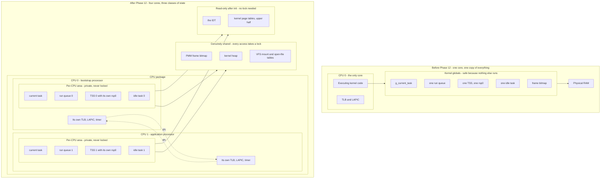

**Walking the left half.** `CPU 0` is the only core in existence, and it is executing
kernel code. Its `TLB` — the CPU's private cache of virtual-to-physical address
translations — and its `LAPIC` — the local interrupt controller built into every core
since [[Stage 11.4 - The Local APIC]] — belong to it alone, but that has never
mattered, because there is nobody to disagree with. The arrow from `Executing kernel
code` into `Kernel globals` is the whole single-core model: one instruction stream
touching one copy of every variable. `g_current_task` names the task running right
now; there is exactly one, so a global is correct. There is one run queue, one TSS
holding one `rsp0` (the kernel stack the CPU switches to when an interrupt arrives
from ring 3 — see [[Stage 2.2 - The TSS and Interrupt Stacks]]), one idle task, and
one physical-frame bitmap. The final arrow into `Physical RAM` is there to make the
point that all of this is just memory; nothing about it is magic.

**Walking the right half.** `CPU package` contains two cores (four in the target
configuration; two are drawn to keep the diagram legible). Inside `CPU 0` there is now
a box labelled `Per-CPU area`, and inside *that* are four fields — this is the
three-level nesting the atlas keeps insisting on, and here it is load-bearing rather
than decorative: machine → core → per-CPU area → field. `CPU 1` has an identical
structure with different contents. Neither core ever takes a lock to touch its own
per-CPU area, because no other core has the address of it in any hot path. `Its own
TLB, LAPIC, timer` is drawn separately from the per-CPU area because it is *hardware*
state, not memory: you cannot lock it, you cannot read another core's copy, and the
only way to affect it is to interrupt that core and ask it to act on itself. That is
the dashed `IPI` arrow, and it is the mechanism §3.5 is built on.

`Genuinely shared` holds the structures that cannot be split. There is one pool of
physical memory; the frame bitmap that tracks it is one object and both cores allocate
from it. The kernel heap is one arena. The VFS mount table describes one filesystem
tree. Every arrow into this box is a lock acquisition. `Read-only after init` is the
category people forget exists, and it is the cheapest correctness win in the phase:
the IDT is written once during boot and never modified, so all four cores can point
`idtr` at the same table with no synchronisation whatsoever. The same is true of the
kernel's upper-half page tables — every address space shares them, and after boot they
do not change.

> [!note] The category is a design decision, not an observation
> Deciding which category a structure belongs to *is* the architectural work of Phase
> 12. "Shared and locked" is always correct and always slow. "Per-CPU" is always fast
> and is only correct if the data genuinely has no cross-core meaning. Most of
> [[Stage 12.7 - Scalable Locking]] is moving structures from the first category to
> the third by finding a per-CPU formulation of them.

---

## 3. Zooming in

### 3.1 The per-CPU area, and why `current` cannot be a global

Take one box from §2 — `Per-CPU area` — and open it.

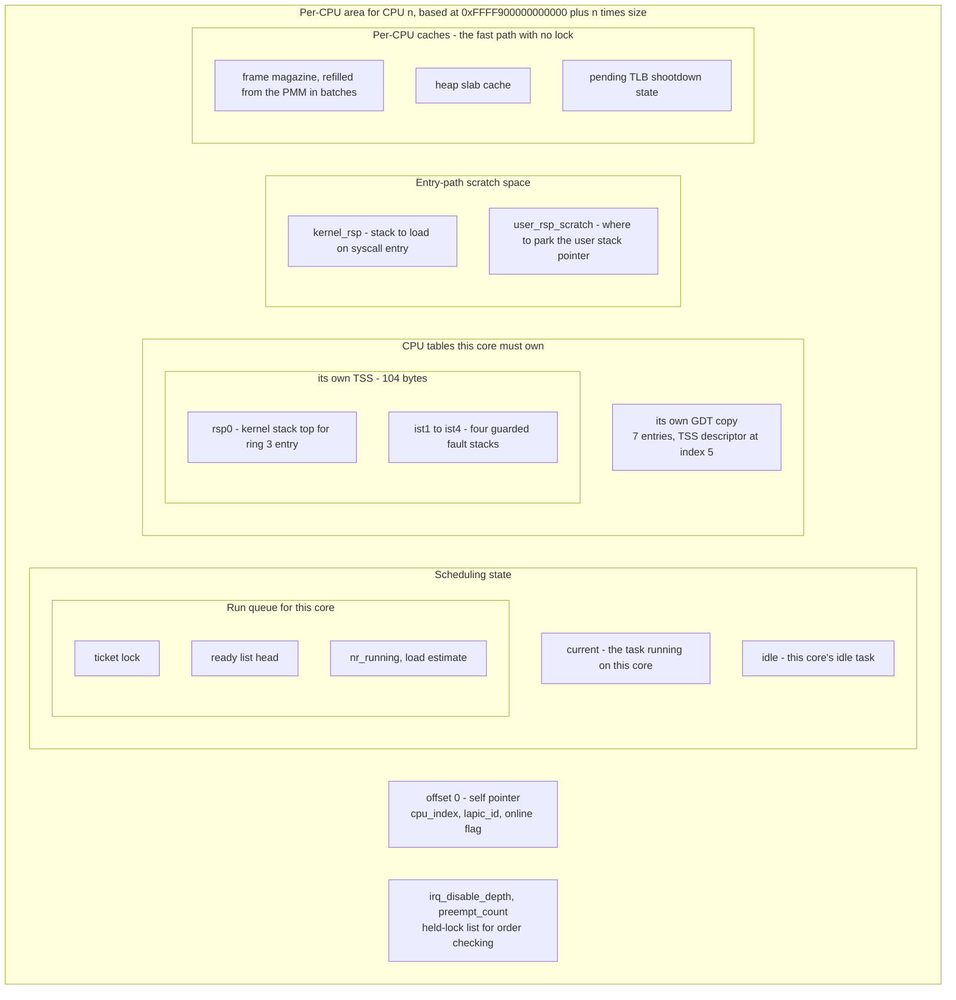

**Walking it.** The `self pointer` at offset 0 is a pointer to the area itself. That
looks circular and useless; it is neither. Because per-CPU data is reached through a
segment base (§3.2), a GS-prefixed access can only produce a *value at an offset*, not
the *address of the area*. Loading offset 0 through `GS` is the one-instruction way to
turn "wherever I am" into a normal pointer you can pass to a function. `cpu_index` is
our own dense 0..N-1 numbering; `lapic_id` is the hardware's identifier for this core,
which is *not* dense and *not* necessarily equal to the index — on many machines the
LAPIC IDs of a four-core part are 0, 2, 4, 6, and assuming otherwise indexes off the
end of an array. `online` is the flag an application processor sets to announce that
it has finished initialising itself.

`Scheduling state` holds `current`. This is the field that makes the whole mechanism
necessary. On one core, "the currently running task" is a property of the system and a
global is honest. On four cores it is a property of *a core*: four tasks are running at
once and each core needs its own answer. A single global `g_current_task` under SMP is
not merely wrong, it is wrong in the worst way — it compiles, boots, and then core 1's
context switch overwrites the pointer core 0 is about to save registers into.

`idle` is per-CPU for a reason worth stating explicitly, because it surprises people:
the idle task is a real task with a real stack and a real saved register context. If
two cores both ran "the idle task", they would both be executing the same code on the
same stack with the same saved context, and the first interrupt would corrupt it. Idle
is not special; it is a task, and tasks cannot be in two places at once. Each core gets
its own, created during that core's bring-up.

`Run queue for this core` is the third level of nesting. Its `ticket lock` exists even
though the queue is per-CPU, because the queue is one of the few per-CPU structures
that *is* touched remotely: waking a task means putting it on some core's queue, and
the load balancer in [[Stage 12.4 - Per-CPU Scheduling and Load Balancing]] steals from
other cores' queues. `ready list head` is the queue itself; `nr_running` is what the
balancer compares.

`CPU tables this core must own` is where a decision made ten phases earlier pays off.
[[Stage 2.2 - The TSS and Interrupt Stacks]] §3.5 chose one TSS but hid it behind
`tss_set_rsp0()` precisely so this change would be additive. `rsp0` is per-CPU because
two cores can be inside the kernel simultaneously and they must not be using the same
kernel stack. The IST stacks are per-CPU for the same reason: two cores can double-fault
independently, and IST stacks are not re-entrant. And because `ltr` takes a *selector*
— an index into the GDT — each core needs its own TSS *descriptor*, which in practice
means each core gets its own copy of the GDT with the descriptor at a fixed index. The
GDT contents are otherwise identical across cores; it is duplicated only so that slot 5
can name a different TSS.

`Entry-path scratch space` is two words that exist because the `syscall` instruction
performs no stack switch (see [[06 - Architecture Overview]] and §5.2 below). On entry
from ring 3 the kernel is running with `rsp` still pointing at a user-controlled stack,
and it has exactly one instruction's worth of trusted state — the `GS` base — with
which to find a kernel stack. `kernel_rsp` is that stack's top; `user_rsp_scratch` is
where the user's `rsp` is parked for the two instructions before there is a stack to
push it on.

`Per-CPU caches` are the answer from [[Stage 12.7 - Scalable Locking]] to lock
contention: rather than four cores fighting over the PMM's lock for every 4 KiB frame,
each core takes a *batch* of frames under the lock once and then allocates from its own
magazine with no lock at all. `pending TLB shootdown state` is the per-core mailbox
§3.5 uses. Finally `irq_disable_depth` and `preempt_count` are counters that must be
per-CPU because they describe *this core's* interrupt state, and the `held-lock list`
is the debug-build structure that makes lock-order violations an assertion failure
instead of an occasional deadlock.

> [!warning] The false-sharing trap in this very diagram
> Two per-CPU areas that land in the same 64-byte cache line are not per-CPU in any
> way that matters. Core 0 writing `cpu[0].nr_running` and core 1 writing
> `cpu[1].nr_running` will bounce the shared line between the two caches on every
> update — all the coherence traffic of a shared variable with none of the safety.
> Every per-CPU area must be cache-line aligned and padded to a multiple of the line
> size. The symptom is not a bug; it is that adding cores makes the system *slower*,
> which is far harder to notice.

---

### 3.2 Addressing per-CPU data through GS

Per-CPU data has a bootstrapping problem: to find "this core's area" you need to know
which core you are, and every obvious way to ask that question is expensive. `cpuid` is
a serialising instruction that flushes the pipeline. Reading the LAPIC ID register is a
memory-mapped I/O access. Doing either on every access to `current` would make the
scheduler's hot path absurd.

x86_64 solves it with a segment base. In long mode all the old segmentation machinery is
gone except for one surviving feature: the `FS` and `GS` segments still have a 64-bit
base address, held in a model-specific register, that is added to any memory operand
carrying that segment prefix.

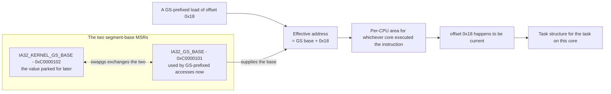

**Walking it.** The instruction is an ordinary `mov` with a `gs:` prefix on its memory
operand; in C++ this is produced by a small inline-assembly accessor or by GCC's
`__seg_gs` address-space qualifier. The CPU computes the effective address as *GS base
plus the offset encoded in the instruction*. Crucially, the offset is a compile-time
constant — the same instruction bytes on every core — while the base is a per-core
register. The identical instruction therefore reads a different address on each core,
with no branch, no lookup, and no serialisation. That is the entire trick.

`IA32_GS_BASE` at MSR `0xC0000101` is the base actually used by GS-prefixed accesses.
`IA32_KERNEL_GS_BASE` at MSR `0xC0000102` is a holding pen: the CPU never uses it for
addressing. The only thing it does is participate in `swapgs`, which atomically
exchanges the contents of the two — that is the bidirectional dashed arrow. `swapgs` is
a single instruction, valid only in 64-bit mode at ring 0, and it takes no operands.

The final two arrows: offset `0x18` in this example is where `current` lives, so the
load yields a `Task*`, and dereferencing that reaches the task structure. Note that the
per-CPU *area* is at `0xFFFF900000000000` and upward (see the memory map in
[[06 - Architecture Overview]]) — a kernel-half address, which matters in a moment.

#### Why `swapgs` exists at all

The kernel wants `GS` to mean "per-CPU area". User space also wants a segment base —
that is where thread-local storage lives, and `FS` is conventionally the user's TLS
base while `GS` is available. If the kernel simply set `GS` and left it, user code
could read and write it, and worse, on entry from ring 3 the kernel would have no way to
know whether `GS` currently held its own value or a value the user chose.

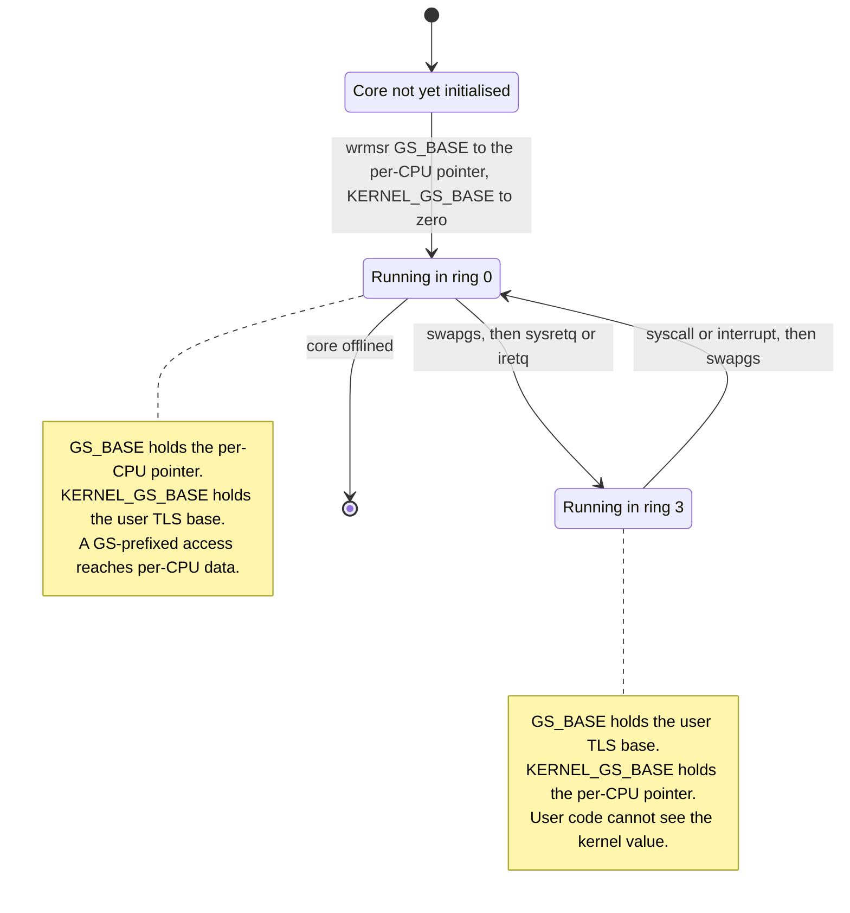

**Walking it.** A core starts in `Core not yet initialised`. Its first meaningful act
during bring-up is a pair of `wrmsr` instructions setting `GS_BASE` to its per-CPU
pointer and `KERNEL_GS_BASE` to zero — from that moment `this_cpu()` works, and
*nothing* before that moment may call it, including the logging code and the assertion
macros. That constraint shapes the whole AP entry function in §3.3.

The transition to ring 3 executes `swapgs` first: the per-CPU pointer moves into
`KERNEL_GS_BASE` where user code cannot reach it, and the user's TLS base moves into
`GS_BASE` where user code expects it. The return transition — a `syscall` or any
interrupt from ring 3 — executes `swapgs` again, restoring the kernel's view. The
invariant is simple and total: **in ring 0, `GS_BASE` is the per-CPU pointer; in ring 3,
it is not.** Every entry and exit path must preserve it.

> [!warning] The `swapgs` bug class, named in advance
> Three interlocking traps live here, and real kernels have shipped all three.
>
> **One: an interrupt that arrives from ring 0 must not `swapgs`.** If the timer fires
> while the kernel is already running, the base is already correct; swapping it points
> `GS` at zero or at a user value, and the next `this_cpu()` dereferences a wild
> pointer. The entry stub must therefore test the saved `CS` on the interrupt frame and
> swap only when the interrupted code was at CPL 3.
>
> **Two: NMI and machine check do not respect that test.** A non-maskable interrupt can
> land on the single instruction *between* the `syscall` entry and its `swapgs`, at
> which point `CS` says ring 0 but `GS` is still the user's. Linux's answer is a
> "paranoid" entry path that reads the current GS base directly and decides from its
> value rather than from `CS`. With `CR4.FSGSBASE` enabled, ring 3 can write any value
> into its own GS base — including one that looks like a kernel address — so a naive
> sign-bit test is not sound on its own. Verify the exact rule against Linux's
> `paranoid_entry` before relying on it.
>
> **Three: the window before the stack switch.** Between `syscall` and the instruction
> that loads a kernel `rsp`, the kernel is executing with a user-controlled stack
> pointer. Maskable interrupts are kept out by setting `IA32_FMASK` so that `syscall`
> clears `IF`. NMI is not, which is exactly why NMI gets its own IST stack back in
> [[Stage 2.2 - The TSS and Interrupt Stacks]].
>
> `swapgs` is also a known speculative-execution hazard — the CPU can speculate past the
> conditional swap and perform a GS-relative load with the wrong base. That mitigation
> belongs to [[Phase 15 - Overview|Phase 15]]; note it here so it is not a surprise.

> [!example] Reading the two MSRs from the QEMU monitor
> `info registers` does not show the FS/GS bases in all QEMU versions. The reliable
> check during bring-up is to have each core print `cpu_index` and `lapic_id` out of its
> own per-CPU area over the serial port as the first thing it does after `wrmsr`. Four
> distinct pairs means the mechanism works. Four identical pairs means every core is
> reading CPU 0's area, which means a `wrmsr` was skipped or given the wrong address.

---

### 3.3 Starting the application processors

Terminology first. The **bootstrap processor (BSP)** is the core the firmware chose to
start executing; it is the one running `kmain`. Every other core is an **application
processor (AP)**, and it is sitting halted, having never executed an instruction of
your code.

The classic way to start an AP is a small piece of theatre. Because an AP always wakes
in 16-bit real mode — the CPU's 1978 startup state, no paging, no protection, 20-bit
addresses — you must place a **trampoline**: a stub of real-mode code, in a page below
1 MiB, that walks the CPU forward through protected mode into long mode and then jumps
to your 64-bit entry point.

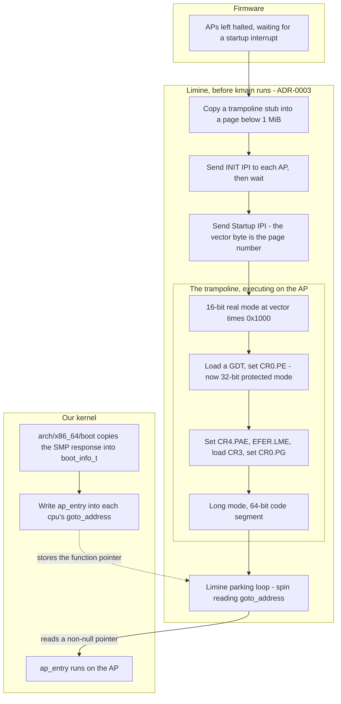

**Walking it.** `Firmware` leaves the APs halted; nothing runs on them. Everything in
the `Limine` box is work **this project does not do**, and that is the point of drawing
it: [[ADR-0003 - Limine as the Bootloader]] hands us the APs already in long mode, so
the entire real-mode trampoline — the classic hardest part of SMP bring-up — never gets
written. You still need to know it exists, because it explains the shape of what you
*do* receive.

`Copy a trampoline stub into a page below 1 MiB` is forced by the hardware: a Startup
IPI carries an 8-bit vector, and the AP begins executing at *vector × 0x1000* in
physical memory. Eight bits times 4 KiB reaches only the first megabyte, so the stub
must live there and must be page-aligned. `Send INIT IPI` resets the AP into a known
state; `Send Startup IPI` releases it at the stub. (The canonical sequence is INIT,
then two SIPIs with a short delay, because some parts miss the first one.)

Inside `The trampoline` are the three mode transitions, in the only order the hardware
permits: real mode → protected mode by setting `CR0.PE` → long mode by enabling PAE in
`CR4`, setting `EFER.LME`, loading a `CR3` that points at valid 4-level page tables, and
then setting `CR0.PG`. Long mode is not entered by a single bit; it is entered by
turning on paging while `LME` is set, and the CPU sets `EFER.LMA` to confirm.

`Limine parking loop` is where each AP ends up. It spins, reading a field named
`goto_address` in a per-CPU structure Limine exposes. Our side of the handshake is the
`Our kernel` box: `arch/x86_64/boot` is the only directory in the tree that may include
`limine.h` ([[06 - Architecture Overview]]), so it is the code that reads the SMP
response — a `bsp_lapic_id`, a `cpu_count`, and an array of per-CPU entries carrying
`processor_id`, `lapic_id`, and the writable `goto_address` — and copies what we need
into our own `boot_info_t`. Verify these field names against the pinned `limine.h` in
`scaffold/`; the protocol renamed its SMP request to MP after v8, and this project is
pinned to `v8.6.0-binary`.

The dashed arrow is the handoff itself: storing a function pointer into `goto_address`
releases that one AP, which jumps to `ap_entry` with a stack Limine provided.

> [!danger] The ordering constraint that will catch you
> The parking loop, and the stack the AP is standing on when it leaves the parking
> loop, both live in **bootloader-reclaimable** memory. [[06 - Architecture Overview]]
> puts the physical memory manager at init step 8 and SMP bring-up at step 16. If the
> PMM hands out bootloader-reclaimable frames at step 8, then by step 16 the code the
> APs are spinning in has been overwritten by page tables and heap.
>
> The PMM must therefore treat bootloader-reclaimable regions as **reserved** until AP
> bring-up has completed and every AP has switched to a kernel-owned stack and to the
> kernel's own `CR3`. Only then are those regions released. This is a real constraint
> that falls straight out of the documented init order, and it is worth an explicit
> `KASSERT` on the reclaim path.

#### What `ap_entry` must do, and in what order

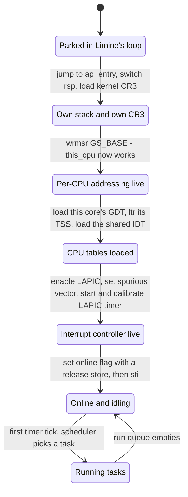

**Walking it.** The order is not a preference; each state is a prerequisite for the
next, and getting it wrong produces faults that look like they came from somewhere else.

`Parked` → `Own stack and own CR3`: the very first instructions must move off Limine's
stack and off Limine's page tables. Until this happens the AP is executing on memory
that is about to be reclaimed and translating addresses through tables the kernel does
not own.

→ `Per-CPU addressing live`: the `wrmsr` pair from §3.2. This must come before anything
that could conceivably call `this_cpu()`, which in practice means before the first log
line and before the first `KASSERT`, because both of them want to print which core they
are on. An AP that logs before setting `GS_BASE` faults inside the logging code, and you
debug the logger instead of the bring-up.

→ `CPU tables loaded`: this core's own GDT (so that `ltr` names this core's TSS
descriptor), then `ltr`, then `lidt` pointing at the *shared* IDT — shared because it
is read-only after init, which is the third category from §2.

→ `Interrupt controller live`: the LAPIC must be enabled and given a spurious-interrupt
vector before interrupts are allowed, and the LAPIC timer must be programmed, because
that timer is this core's preemption source. Timer calibration comes from
[[Stage 11.6 - HPET and TSC Calibration]].

→ `Online and idling`: the `online` flag is published with a **release** store (§3.4)
so that everything the AP wrote while initialising is guaranteed visible to the BSP that
observes the flag. Only then does `sti` enable interrupts. Enabling interrupts before
the IDT and LAPIC are ready is an immediate triple fault.

`Online` ⇄ `Running` is the steady state: the idle task runs when the run queue is
empty, a timer tick or an IPI wakes the scheduler, a task runs, the queue empties, back
to idle.

> [!question] Why does the BSP wait for all APs before continuing?
> It could just fire off all the `goto_address` writes and carry on. It does not,
> because the reclaim of bootloader memory, the reclaim of the trampoline page, and the
> transition of the scheduler from "one queue" to "N queues" all depend on every core
> having finished. The BSP therefore spins on a count of `online` flags with a timeout.
> A core that never comes online should be logged and excluded, not hung on — real
> machines ship with disabled cores in the MADT.

---

### 3.4 Atomics and memory ordering, from zero

This is the section that decides whether the kernel works. Read it slowly.

#### `volatile` is not a concurrency primitive

`volatile` in C and C++ means exactly one thing: *the compiler may not elide, duplicate,
reorder-with-other-volatiles, or cache in a register this particular access*. It was
invented for memory-mapped I/O registers, where reading twice really does mean reading
twice. It says nothing at all about:

- **Atomicity.** `counter++` on a `volatile int` compiles to a load, an add, and a
  store. Three separate operations. Two cores can both load 5, both compute 6, both
  store 6, and one increment vanishes.
- **Ordering against non-volatile accesses.** The compiler is free to move ordinary
  loads and stores across a volatile one.
- **What the CPU does.** `volatile` emits no fence. The hardware reorders exactly as it
  pleases.

> [!warning] The reason this bug survives testing
> A `volatile`-based lock will usually work on x86, because x86's memory model is
> strong enough to hide most of the problem, and because a single core cannot exhibit it
> at all. It then fails after an unrelated change to inlining, on one machine, once a
> week. This is the single most expensive mistake available in this phase.

The kernel's rule, from [[Stage 12.2 - Atomics and Memory Ordering]]: **every location
touched by more than one core is an atomic with an explicitly named memory order.** No
exceptions, no "it is only a flag".

> [!note] Where the atomics come from in a freestanding kernel
> [[ADR-0007 - Freestanding C++20 as the Kernel Language]] forbids libstdc++ entirely,
> and `<atomic>` is a libstdc++ header — so `std::atomic` itself is unavailable. What
> *is* available is the compiler intrinsics that `std::atomic` is implemented on top of:
> `__atomic_load_n`, `__atomic_store_n`, `__atomic_fetch_add`,
> `__atomic_compare_exchange_n` and friends, parameterised by `__ATOMIC_RELAXED`,
> `__ATOMIC_ACQUIRE`, `__ATOMIC_RELEASE`, `__ATOMIC_ACQ_REL`, `__ATOMIC_SEQ_CST`. These
> are built into GCC and require no library. `kstd::atomic<T>` is a thin wrapper that
> presents the familiar `std::atomic` interface over them, which is what
> [[Phase 12 - Overview]] means by "use `std::atomic` with explicit ordering". Keep the
> types at 8 bytes or smaller: 16-byte atomics need `cmpxchg16b` and can emit calls into
> `libatomic`, which this kernel does not link.

#### What a memory barrier does

There are two independent reorderers between the source you wrote and the loads and
stores another core observes, and you must defeat both.

1. **The compiler.** It reorders freely to schedule instructions. A *compiler barrier*
   — `asm volatile("" ::: "memory")` — tells GCC that memory may have changed
   arbitrarily, forcing it to flush values from registers and not move accesses across
   the barrier. It emits **no instructions**.
2. **The CPU.** It buffers stores and executes loads early. A *hardware fence* —
   `mfence`, or any `lock`-prefixed instruction — constrains that.

An atomic operation with a named memory order emits whichever of these is required.
That is its entire job.

#### What x86 gives you for free

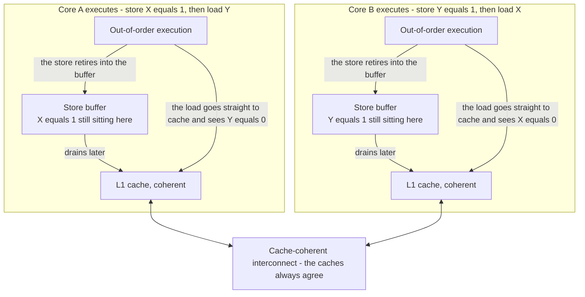

**Walking it.** Both cores execute a store followed by a load of the *other* variable.
On each core the store retires into a **store buffer** — a small queue that lets the
core continue without waiting for the cache line — and the subsequent load bypasses that
buffer and reads the cache directly. Because neither store has reached the coherent
caches yet, each core's load sees the *old* value. Both cores conclude the other has not
stored. This is not a bug in the CPU; it is the documented x86 memory model, and it is
the **only** reordering x86 performs: a **load may be reordered ahead of an older store
to a different address**.

The `Cache-coherent interconnect` box is there to head off a common confusion: caches on
x86 are kept coherent in hardware. You never need to flush a cache to make a store
visible to another core, and there is no "cache flush" step anywhere in this document.
The store buffer, which sits *in front of* the cache, is the thing that delays
visibility.

| Reordering | Does x86 hardware do it? | Consequence | What you must add |
|---|---|---|---|
| Load then Load | No | Loads observe in program order | Compiler barrier only |
| Load then Store | No | | Compiler barrier only |
| Store then Store | No | Stores become visible in program order | Compiler barrier only |
| **Store then Load** (different addresses) | **Yes** | The store buffer above | `mfence`, or a `lock`-prefixed RMW |
| Non-temporal stores, write-combining memory | **Yes, weakly** | `movnt` and WC framebuffer writes are not ordered with anything | `sfence` |
| **The compiler**, all four cases | **Yes, always** | Independent of the hardware | An atomic with a named order, or a compiler barrier |

This maps onto the C++ orders as follows on x86_64:

| Named order | What it means | x86 code generated |
|---|---|---|
| `relaxed` | Atomicity only, no ordering | Plain `mov` |
| `acquire` (loads) | Nothing after it may move before it | Plain `mov` + compiler barrier |
| `release` (stores) | Nothing before it may move after it | Plain `mov` + compiler barrier |
| `acq_rel` (RMW) | Both | `lock`-prefixed instruction |
| `seq_cst` store | Single total order across all cores | `xchg`, or `mov` + `mfence` |
| Any RMW | Read-modify-write, indivisible | `lock xadd`, `lock cmpxchg`, `xchg` — always a full fence |

> [!warning] The trap hidden in that table
> Acquire and release are *free* on x86 — they generate the same instruction a
> non-atomic access would. That means code with the ordering annotations completely
> wrong runs at identical speed and produces identical machine code, so neither
> benchmarks nor disassembly will tell you. The annotations are documentation that the
> compiler enforces; on this architecture they are almost nothing else. Write them
> correctly anyway, because they are the only record of your intent and because
> `seq_cst` and every RMW *are* different.

#### Acquire and release, in one paragraph

A **release** store is a publish: every write you performed before it is guaranteed
visible to anyone who observes that store. An **acquire** load is a subscribe: once you
observe the value, every write the publisher made before releasing it is visible to you.
They pair. Nothing is guaranteed unless both sides are annotated. This is exactly the
AP-bring-up handshake in §3.3: the AP fills in its per-CPU area and *then* release-stores
`online = true`; the BSP acquire-loads `online` and, having seen `true`, may safely read
everything the AP wrote. It is also exactly what a spinlock is: acquiring the lock is an
acquire, releasing it is a release, and that is why data protected by a lock is visible
to the next holder.

> [!example] The atomic counter test, and why it is the right first test
> [[Phase 12 - Overview]] specifies a Tier-2 test: four cores each increment a shared
> counter one million times; the result must be exactly four million. It is a good test
> because a `volatile int++` will produce something like 3 987 214 — obviously,
> reproducibly wrong, on the very first run, with a number that tells you roughly how
> often the interleaving hit. Run it under `-accel tcg,thread=multi`, which interleaves
> far more aggressively than hardware and shakes out races the real CPU would hide.

---

### 3.5 TLB shootdown

The **TLB (translation lookaside buffer)** is a small cache inside each core holding
recent virtual-to-physical translations, so that the CPU does not walk four levels of
page tables on every memory access. It is per-core hardware, and — unlike the data
caches — **it is not coherent**. Nothing in the hardware notices that you edited a page
table entry. The core that made the edit invalidates its own TLB with `invlpg`; every
other core keeps happily using its stale copy until told otherwise.

There is no instruction that invalidates another core's TLB. The only way to make a
remote core act on its own TLB is to interrupt it and ask. That interrupt is an **IPI
(inter-processor interrupt)**: a message one LAPIC sends to another, delivered as an
ordinary interrupt vector on the target.

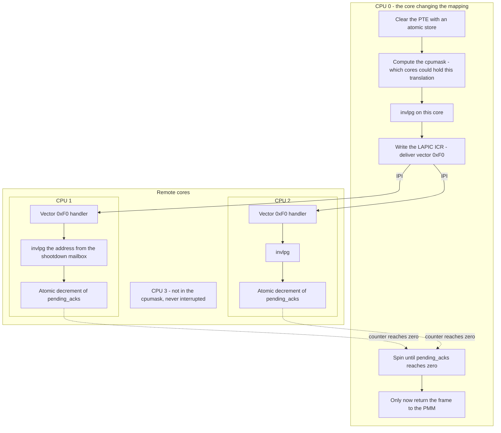

**Walking it.** `Clear the PTE with an atomic store` comes first: the page table entry
must be invalid *before* anyone is told to flush, or a core could flush and then
immediately re-walk the still-valid entry and cache it again.

`Compute the cpumask` is the optimisation that keeps this affordable. Every address
space tracks a bitmask of the cores currently using it — set when a core loads that
`CR3`, cleared when it switches away. Only those cores can possibly hold a translation
for this address, and `CPU 3` in the diagram is deliberately drawn outside the fan-out
to make that visible. Broadcasting to all cores instead is correct but turns every
unmap into an N-core interrupt storm. Kernel-half mappings are the exception: they are
in *every* address space, so unmapping kernel memory always broadcasts.

`invlpg on this core` is the local half, done directly. `Write the LAPIC ICR` is the
send: the Interrupt Command Register carries the vector and the destination, and writing
it dispatches the IPI. `Spin until pending_acks reaches zero` is the part people delete
because it looks like a performance problem, and it is the part that makes the whole
thing correct.

`Only now return the frame to the PMM` is why. Consider the alternative ordering:
CPU 0 unmaps a page, frees the frame, and does not wait. The PMM hands the frame to
someone else, who writes a page table into it. CPU 1, still holding the stale
translation, writes to what it believes is its own data. It is now scribbling on live
page tables through a virtual address that no longer means what it thinks. Nothing
faults. Nothing logs. The system dies somewhere else entirely, minutes later, under
load, on four cores only.

> [!warning] The deadlock you will invent while fixing this
> The obvious implementation takes a lock, disables interrupts, sends the IPIs, and
> spins for acknowledgements. Now two cores do that simultaneously, each waiting for the
> other, each with interrupts disabled and therefore unable to service the other's
> shootdown IPI. Both spin forever.
>
> The rule: **never wait for a shootdown acknowledgement with local interrupts
> disabled.** Either keep `IF` set while spinning, or poll and service your own pending
> shootdown mailbox inside the wait loop. This deadlock is invisible on two cores and
> reliable on eight.

Three further properties that shape the design:

**`invlpg` is per-address, `mov cr3` is per-address-space.** Reloading `CR3` flushes
every non-global TLB entry on that core, which is what a context switch between address
spaces does anyway. Above roughly a dozen pages, a full flush is cheaper than a dozen
`invlpg`s, so the shootdown message carries either an address or a "flush everything"
marker.

**Global pages survive `CR3` reloads.** Setting bit 8 (`G`) in a PTE, with `CR4.PGE`
enabled, marks a translation as global so it is not flushed on a context switch. This is
exactly right for the kernel's upper half, which is identical in every address space —
and it is exactly the trap in a shootdown, because a `CR3` reload will *not* clear it.
Kernel-half mappings must be invalidated with `invlpg`, or by toggling `CR4.PGE`.

**Adding permission is lazier than removing it.** Making a page more permissive — say,
marking a copy-on-write page writable — can skip the shootdown: a core with the stale
restrictive entry simply takes a spurious page fault, and the handler notices the PTE is
already correct and returns. Removing permission or removing a mapping can never be
lazy. Treat "lazy on relax, eager on restrict" as a documented optimisation with an
explicit comment, not as a default, and make sure the page-fault handler really does
recognise the spurious case.

---

### 3.6 Scalable locking: why the naive spinlock gets worse with more cores

A spinlock is one word and a loop: atomically swap 1 into it, and if the old value was
1, try again. It is correct. It is also, in the form most people write first,
pathological.

```mermaid
flowchart TB
    subgraph NAIVE["Naive test-and-set - every waiter hammers one cache line"]
        subgraph NW["Four waiters"]
            NC1["Core 1 - lock xchg"]
            NC2["Core 2 - lock xchg"]
            NC3["Core 3 - lock xchg"]
        end
        NLINE["The lock's cache line"]
        NC1 -->|"must take the line exclusively"| NLINE
        NC2 -->|"must take the line exclusively"| NLINE
        NC3 -->|"must take the line exclusively"| NLINE
        NLINE -->|"invalidated in every other cache, every attempt"| NBUS["Coherence traffic grows with core count"]
    end

    subgraph TICKET["Ticket lock - fair, one winner per handoff"]
        subgraph TW["Four waiters"]
            TC1["Core 1 - holds ticket 7"]
            TC2["Core 2 - holds ticket 8"]
            TC3["Core 3 - holds ticket 9"]
        end
        TLINE["now_serving - waiters spin on a plain load"]
        TC1 -->|"read only"| TLINE
        TC2 -->|"read only"| TLINE
        TC3 -->|"read only"| TLINE
        TLINE -->|"one write per handoff invalidates all N copies"| TBUS["Still O of N traffic per handoff, but FIFO"]
    end

    subgraph MCS["MCS queue lock - each waiter spins on its own line"]
        subgraph MQ["A linked queue of per-CPU nodes"]
            MN1["Node for core 1<br/>spins on its own flag"]
            MN2["Node for core 2<br/>spins on its own flag"]
            MN3["Node for core 3<br/>spins on its own flag"]
        end
        MN1 -->|"next"| MN2
        MN2 -->|"next"| MN3
        MN1 -->|"one remote write hands off"| MBUS["O of 1 traffic per handoff"]
    end
```

**Walking it.** In `Naive test-and-set`, every waiting core executes `lock xchg` in a
tight loop. A `lock`-prefixed read-modify-write must acquire the cache line in an
exclusive state, which invalidates every other core's copy. So with four waiters, the
line ping-pongs between four caches continuously, *even though nothing is changing*, and
the core actually holding the lock is competing for the same line when it tries to
release. Adding cores makes acquisition slower. This is the failure that surprises
people: the lock is correct and the system gets less throughput at eight cores than at
four.

The first fix is not shown as a separate box because it is one line of code:
**test-and-test-and-set**. Spin on a plain load, and only attempt the atomic when the
plain load says the lock looks free. A plain load keeps the line in a shared state in
every cache with no traffic at all. Add the `pause` instruction inside the spin body —
it hints to the CPU that this is a spin-wait loop, reduces power, and avoids a pipeline
flush when the loop exits.

`Ticket lock` fixes a different problem: fairness. Two counters, `next` and
`now_serving`. To acquire, atomically fetch-and-increment `next` — that is your ticket —
then wait until `now_serving` equals it. To release, increment `now_serving` with a
release store. Waiters are served strictly in arrival order, so no core can starve. The
cost is that every waiter still spins on the same `now_serving` line, so each handoff
invalidates N copies. Fair, and still O(N) traffic per handoff. This is the right
default for this kernel's short critical sections.

`MCS queue lock` fixes the traffic. The lock itself is just a pointer to the tail of a
queue. To acquire, you atomically swap your own node into the tail; if there was a
predecessor, you set its `next` pointer to your node and then spin on a flag **inside
your own node**, which is a cache line nobody else is touching. To release, you write
`true` into your successor's flag — one remote write, one invalidation, regardless of
how many cores are waiting. O(1) traffic per handoff. The costs are real: the API needs a
node passed in by the caller, the release path needs a compare-and-swap to handle the
case where a successor has swapped in but not yet linked itself, and the whole thing is
harder to read. Linux's `qspinlock` is an MCS lock compressed into a 4-byte word with
fast paths for the uncontended and single-waiter cases.

#### Convoys, and the real answer

A **convoy** is what happens when a lock's hold time becomes comparable to the arrival
rate: waiters pile up behind the holder and the system settles into a state where every
core is queued on one lock. A FIFO ticket lock makes convoys *orderly* rather than
absent — arrival order is preserved, so the queue drains predictably, but it is still a
queue. Convoys are made worse by anything that stretches hold time: a `kprintf` inside a
critical section, a page fault, an unlucky interrupt.

> [!warning] Interrupts, and the lock you already hold
> A spinlock shared with an interrupt handler must be taken with interrupts disabled on
> the local core. Otherwise the handler interrupts the holder on the *same* core and
> spins forever waiting for a lock that core already owns — a guaranteed, immediate
> self-deadlock, not a rare race. [[06 - Architecture Overview]] makes `irq_lock_guard`
> the default form for exactly this reason. SMP does not change this rule; it just means
> you now also have to be right about the remote case.

**The real answer to lock contention is not a better lock.** It is not having the lock.
Every technique in [[Stage 12.7 - Scalable Locking]] is a way of turning a shared
structure into a per-CPU one:

| Contended structure | Per-CPU reformulation |
|---|---|
| One global run queue | Per-CPU run queues, plus a balancer that steals |
| PMM frame bitmap lock on every allocation | Per-CPU magazine of frames, refilled in batches under the lock |
| Heap free list | Per-CPU slab caches, with a shared backing arena |
| Global statistics counter | Per-CPU counters, summed when someone reads them |
| Kernel log ring buffer | Per-CPU buffers, merged by timestamp on `dmesg` |
| Reader-writer lock over read-mostly data | Sequence lock, or per-CPU reader counters |

Each row trades a small amount of memory and a small amount of imprecision — a summed
counter is a moment out of date — for the removal of a contention point entirely. That
is almost always the correct trade in a kernel.

---

### 3.7 The race audit

[[Phase 12 - Overview]] is blunt about this: **Stage 12.5 is the phase.** Bring-up is an
afternoon; the audit is weeks. The method is unglamorous — open every file under
`kernel/`, find every mutable structure reachable from more than one core, and answer
"what happens if two cores are here at once?" — and there is no substitute for it.

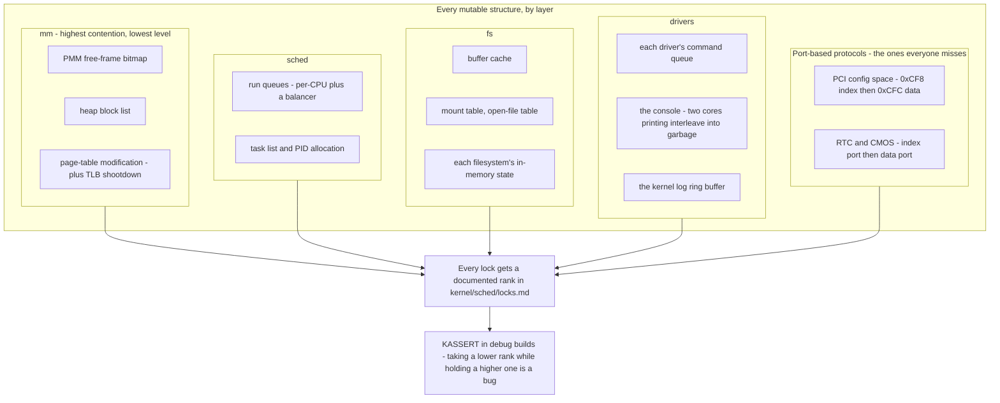

**Walking it.** The layers match the subsystem map in [[06 - Architecture Overview]], and
they are drawn bottom-heavy on purpose: `mm` is both the most contended and the most
dangerous, because a race in the frame allocator hands the same physical page to two
subsystems and the corruption surfaces anywhere.

`page-table modification` is drawn inside `mm` rather than as its own box because the
lock and the shootdown are one operation — editing a PTE without the subsequent
shootdown is exactly as broken as editing it without the lock.

`sched` needs `task list and PID allocation` locked even though run queues are per-CPU:
`ps` walks the global task list while another core is forking into it.

`drivers` contains the two that are easy to underestimate. `the console` is a genuine
shared device, and two cores calling `kprintf` concurrently produce interleaved
half-lines that are worse than useless during a bring-up. `the kernel log ring buffer`
has the same problem one layer up.

`Port-based protocols` is the box worth memorising. PCI configuration space is accessed
by writing an address to port `0xCF8` and then reading or writing port `0xCFC`. That is
a *stateful two-instruction protocol on a global resource*. If core 1 writes its address
between core 0's address write and core 0's data read, core 0 silently reads a different
device's register. There is no memory to lock and no pointer to guard — the shared state
is inside the chipset. The same applies to the RTC's index/data port pair. Both need a
dedicated global lock, and neither will ever announce that it is missing one.

Everything funnels into `Every lock gets a documented rank`. Lock ordering was a
suggestion on one core; on four it is a specification. `kernel/sched/locks.md` lists
every lock and its rank, and debug builds `KASSERT` that a core never acquires a
lower-ranked lock while holding a higher one — which converts "deadlocks once a day
under load" into "fails immediately, with a stack trace, on the machine that did it".

> [!warning] The panic path holds locks too
> A core that panics while holding the console lock will deadlock trying to print the
> panic. And the other three cores keep running, keep corrupting, and keep printing over
> your panic message. The SMP panic path must therefore (a) send an NMI IPI to every
> other core to stop them, and (b) forcibly reinitialise the console lock rather than
> waiting for it. Both feel wrong and both are correct: at panic time, correctness of
> the lock no longer matters, and getting the message out does.

---

## 4. The data structures

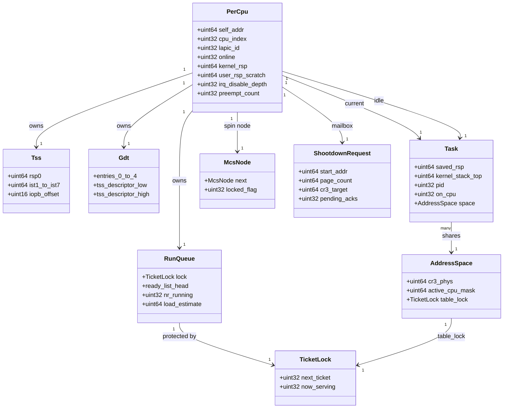

**Walking it.** `PerCpu` is the root: everything a core owns hangs off it, and it is the
only structure reachable through `GS`. `self_addr` is the self-pointer from §3.1;
`kernel_rsp` and `user_rsp_scratch` are the syscall-entry scratch words; the two depth
counters describe this core's interrupt and preemption nesting.

`Tss` and `Gdt` are owned one-per-core for the reasons in §3.1 — `rsp0` must differ per
core, and `ltr` needs a per-core descriptor to name a per-core TSS. The full 104-byte
TSS layout is specified in [[Stage 2.2 - The TSS and Interrupt Stacks]] and does not
change here; only its multiplicity does.

`RunQueue` is per-core and still carries a `TicketLock`, because remote wakeups and the
load balancer reach into it. `Task` gains one new field under SMP: `on_cpu`, which is
what `ps` prints and what the balancer reads. `saved_rsp` is unchanged from
[[Stage 5.1 - Tasks, Context, and the Stack]].

`AddressSpace` gains `active_cpu_mask` — the bitmask from §3.5 naming which cores
currently have this `cr3_phys` loaded — and a `table_lock` serialising page-table edits.
The `many → 1` relationship from `Task` records that threads of one process share an
address space, which is precisely why a shootdown must go to every core in the mask
rather than just to the core that owns the task.

`TicketLock` is two 32-bit counters, which is deliberate: both fit in one 64-bit word,
so the whole lock is one atomic load and the fast path is trivial. `McsNode` is
per-CPU and is passed by the caller into an MCS acquisition; it exists in the per-CPU
area rather than on the stack so that its address is stable and its cache line is
private.

`ShootdownRequest` is the mailbox: the range to invalidate, the target address space,
and the acknowledgement counter the initiator spins on.

### Field reference

| Structure | Field | Size | Meaning |
|---|---|---|---|
| `PerCpu` | `self_addr` | 8 | Address of this area. The one way to turn `GS` into a pointer. |
| | `cpu_index` | 4 | Dense 0..N-1 index. Our numbering, not the hardware's. |
| | `lapic_id` | 4 | Hardware APIC ID from the MADT. Sparse. Never use as an array index. |
| | `online` | 4 | Set with a release store at the end of AP bring-up. |
| | `kernel_rsp` | 8 | Kernel stack top loaded by the `syscall` entry stub. |
| | `user_rsp_scratch` | 8 | Where the user `rsp` is parked for two instructions. |
| | `irq_disable_depth` | 4 | Nesting count so `irq_lock_guard` restores correctly. |
| `AddressSpace` | `active_cpu_mask` | 8 | Bit *n* set while CPU *n* has this `CR3` loaded. |
| `ShootdownRequest` | `pending_acks` | 4 | Decremented atomically by each target; initiator waits for zero. |
| `TicketLock` | `next_ticket` / `now_serving` | 4 + 4 | Fetch-add to acquire; increment to release. FIFO. |

### The MSRs this subsystem touches

| MSR | Number | Purpose |
|---|---|---|
| `IA32_GS_BASE` | `0xC0000101` | Base added to GS-prefixed accesses. Holds the per-CPU pointer in ring 0. |
| `IA32_KERNEL_GS_BASE` | `0xC0000102` | The parked value. Exchanged with the above by `swapgs`. |
| `IA32_FS_BASE` | `0xC0000100` | User TLS base. Not used by the kernel. |
| `IA32_APIC_BASE` | `0x1B` | LAPIC MMIO base and the x2APIC enable bit. |
| `IA32_EFER` | `0xC0000080` | `SCE` bit 0 enables `syscall`; `NXE` bit 11 enables the no-execute bit. |
| `IA32_LSTAR` | `0xC0000082` | The `syscall` entry point. Per-core write, same value. |
| `IA32_FMASK` | `0xC0000084` | RFLAGS bits cleared by `syscall`. Must include `IF`. |
| x2APIC `ICR` | `0x830` | Interrupt Command Register when x2APIC is enabled — a single 64-bit write. |

Relevant `CR4` bits: `PGE` (bit 7) enables global pages; `FSGSBASE` (bit 16) allows
`rdgsbase`/`wrgsbase` at any privilege level; `PCIDE` (bit 17) enables tagged TLBs and is
deliberately out of scope for v1; `SMEP` (bit 20) and `SMAP` (bit 21) belong to
[[Phase 15 - Overview|Phase 15]].

### The Interrupt Command Register, bit by bit

Writing this register is what sends an IPI. In xAPIC mode it is two 32-bit MMIO
registers at LAPIC offsets `0x300` (low) and `0x310` (high); in x2APIC mode it is one
64-bit MSR write to `0x830`, which is also atomic and therefore preferable. Verify
against Intel SDM Vol. 3A, "Interrupt Command Register (ICR)".

| Bits | Field | Values used here |
|---|---|---|
| 0–7 | Vector | `0xF0` TLB shootdown, `0xF1` reschedule, `0xF2` panic-stop, `0xFF` spurious |
| 8–10 | Delivery mode | `000` Fixed (normal IPI), `100` NMI, `101` INIT, `110` Start Up |
| 11 | Destination mode | `0` physical (by APIC ID), `1` logical |
| 12 | Delivery status | Read-only. `1` means a previous IPI is still in flight |
| 14 | Level | `1` assert; `0` only for the INIT de-assert step |
| 15 | Trigger mode | `0` edge for everything we send |
| 18–19 | Destination shorthand | `00` use the destination field, `01` self, `10` all including self, `11` all excluding self |
| 56–63 (xAPIC high dword) | Destination | Target APIC ID |

The `all excluding self` shorthand is tempting for shootdowns and is usually wrong: it
reaches cores that never had the mapping, turning a two-core flush into an N-core
interrupt. Use the cpumask and send individually, except on the panic path where you do
genuinely want everyone.

---

## 5. The flows

### 5.1 AP bring-up, end to end

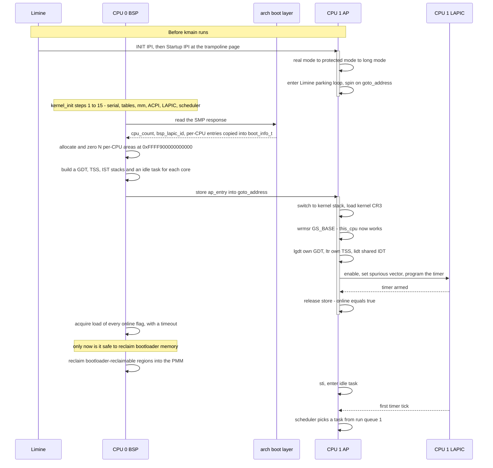

**Walking it.** The first block happens entirely before `kmain`: Limine sends INIT and
Startup IPIs, the AP walks the mode transitions, and it parks. `activate`/`deactivate`
mark the AP as executing; note that between the two blocks it is *spinning*, which is
why bootloader memory is still live.

The BSP block is the whole of `kernel_init` steps 1 through 15 from
[[06 - Architecture Overview]] — SMP is step 16 for a reason, because the per-CPU areas
need the heap (step 10), the LAPIC needs ACPI (step 12), and the idle tasks need the
scheduler (step 15).

`read the SMP response` goes through `BOOT` rather than direct, because
`arch/x86_64/boot` is the only Limine-aware directory. The response is *copied* into
`boot_info_t`; it lives in bootloader-reclaimable memory and must not be referenced
later.

The `store ap_entry into goto_address` message is the handoff. Everything the AP does
after it is §3.3's state machine, and the ordering within it is not negotiable.

The two messages worth staring at are `release store - online equals true` and the BSP's
`acquire load of every online flag`. That pair is the acquire/release handshake from
§3.4 doing real work: it is what makes the AP's GDT, TSS and per-CPU area guaranteed
visible to the BSP. Without the annotations the BSP could observe `online == true` and
then read a half-written per-CPU area.

`only now is it safe to reclaim bootloader memory` is the constraint from §3.3's danger
callout, placed on the timeline so the dependency is impossible to miss.

### 5.2 Kernel entry from ring 3, with `swapgs`

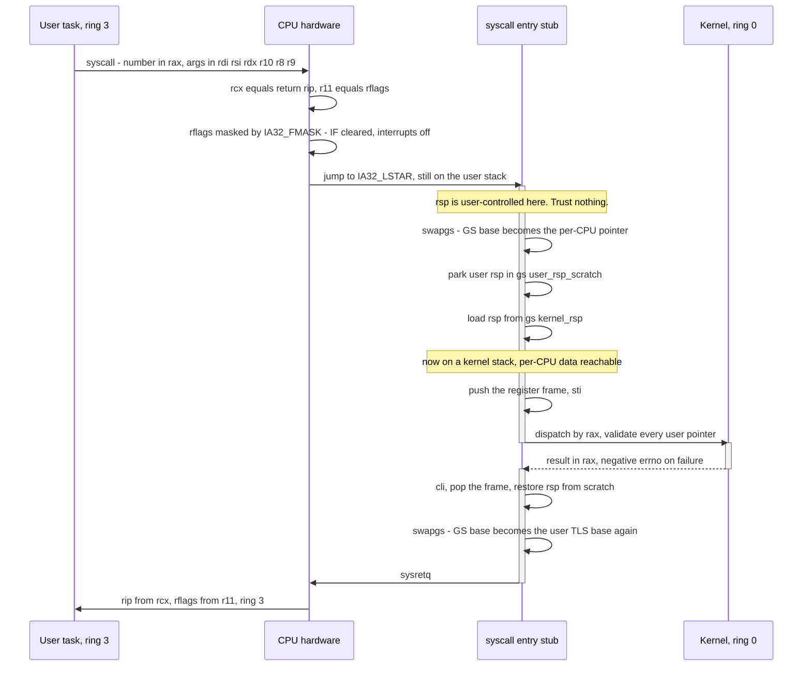

**Walking it.** The user executes `syscall`. The CPU stores the return address in `rcx`
and the flags in `r11` — which is why the syscall ABI passes the fourth argument in
`r10` and not `rcx` ([[06 - Architecture Overview]]). It masks `RFLAGS` with
`IA32_FMASK`, and because we put `IF` in that mask, maskable interrupts are off from
this instruction onward. Then it jumps to `IA32_LSTAR`.

The `Note over STUB` is the crux: the CPU performed **no stack switch**. `rsp` still
points wherever the user process left it. The kernel is running at ring 0 on an
untrusted stack pointer and cannot push anything.

The escape is `swapgs`, which needs no stack and no registers. After it, `GS` names this
core's per-CPU area, and two GS-relative moves — park `rsp` in `user_rsp_scratch`, load
`rsp` from `kernel_rsp` — put the kernel on solid ground. Only then can it push a
register frame and `sti`.

The exit path mirrors it exactly, in reverse: `cli` first (so no interrupt lands in the
window), restore the user `rsp`, `swapgs` back, `sysretq`. Any asymmetry here — a path
that returns without the second `swapgs`, or an error path that jumps past it — leaves
ring 3 running with the kernel's per-CPU pointer in its GS base, which is an
information leak, and leaves the next kernel entry swapping the wrong way, which is a
wild pointer.

> [!warning] Why interrupts must be off across the stack switch
> If `IF` were set on entry, a timer tick landing between `syscall` and the `rsp` load
> would push its interrupt frame onto the *user* stack while at ring 0. A hostile
> process points `rsp` at a kernel address and gets the kernel to write a controlled
> interrupt frame there. `IA32_FMASK` closes this for maskable interrupts. NMI stays
> open, which is what its IST stack is for.

### 5.3 A TLB shootdown, with acknowledgement

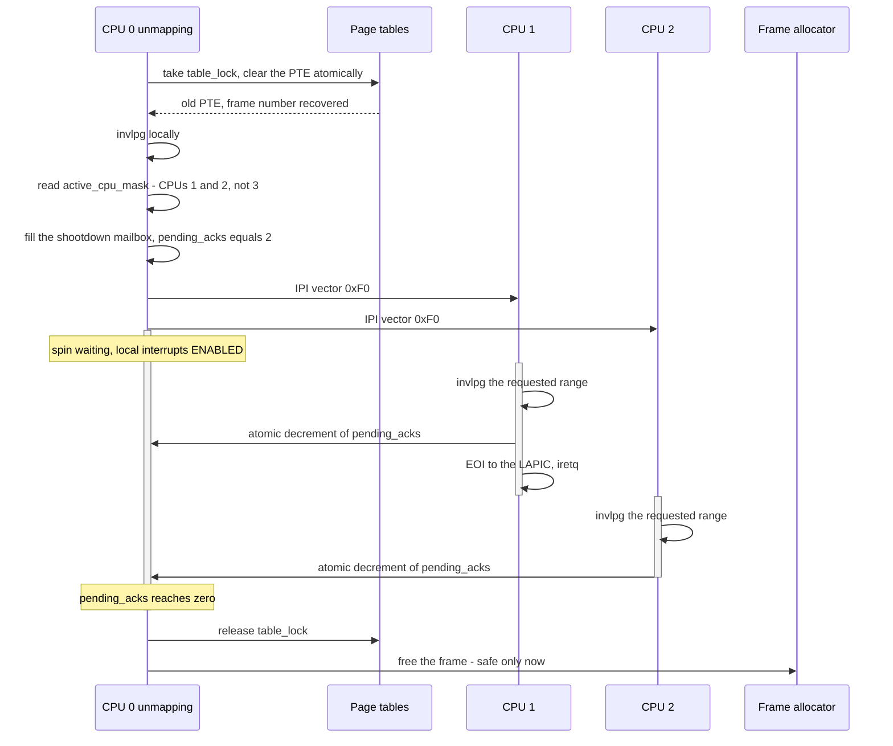

**Walking it.** The PTE is cleared *first*, under the address space's `table_lock`, and
the old entry is read to recover the physical frame number. The local `invlpg` follows
immediately; there is no reason to defer it.

`read active_cpu_mask` narrows the fan-out to the cores that actually have this address
space loaded. `pending_acks equals 2` is initialised *before* the IPIs are sent — set it
afterwards and a fast target can decrement a counter that has not been initialised.

The `Note over C0: spin waiting, local interrupts ENABLED` is the anti-deadlock rule
from §3.5 made explicit on the timeline. If CPU 1 is simultaneously trying to shoot down
a mapping of its own and needs CPU 0 to acknowledge, both must be able to service the
incoming IPI while waiting.

Each target does exactly three things: invalidate, decrement, `EOI`. The handler must be
short — it runs with interrupts disabled at the target and delays everything else on
that core.

`free the frame - safe only now` is the payoff. Every earlier point in this diagram is a
point at which freeing the frame would create a use-after-free reachable through a stale
translation on another core.

### 5.4 A race, as an interleaving

The most useful diagram in the whole phase is the one that shows a race as a *timeline*,
because that is the shape the bug actually has. Here is a lock-free pop from a free list
— the pattern everyone writes first.

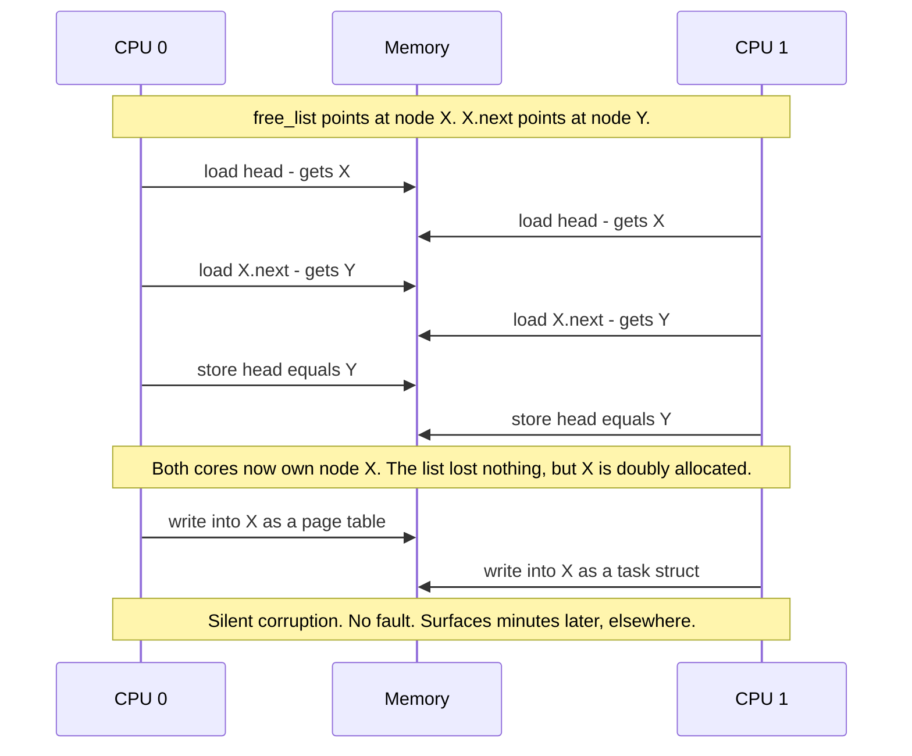

**Walking it.** Both cores load the same head pointer and the same `next` pointer, and
both store the same new head. Every individual load and store is atomic — 8-byte aligned
accesses on x86 are single-copy atomic, so no torn value is involved. The list is even
left in a *consistent* state: `head` correctly points at `Y`. Nothing is detectably
wrong at the moment the race occurs.

The damage is that node `X` was handed to two callers. One writes a page table into it,
the other a task structure. Neither faults. The system dies later, somewhere else, in a
subsystem that did nothing wrong.

Three things to take from this:

**Atomic accesses do not make an algorithm atomic.** The bug is that load-then-store is
two operations. Fixing it needs either a lock around the pair or a
compare-and-swap that fails if `head` changed.

**The window is a handful of instructions wide.** That is why it reproduces once an hour
under load and never under a debugger, and why `-accel tcg,thread=multi` is specified for
the Tier-2 and Tier-3 tests — it widens the window enormously.

**Compare-and-swap alone is not sufficient here either.** If CPU 1 pops `X`, pops `Y`,
and pushes `X` back before CPU 0's CAS executes, CPU 0 sees `head == X`, its CAS
succeeds, and it installs a stale `next` pointing at `Y` which is no longer free. That
is the **ABA problem**, and it is why lock-free lists need version-tagged pointers or
deferred reclamation. For this kernel, the verdict in
[[Stage 12.7 - Scalable Locking]] is: **use a lock, and remove the contention by making
the structure per-CPU.** Lock-free data structures are a post-1.0 topic and a good way to
lose a month.

> [!question] Draw this one yourself
> Take the run queue, the buffer cache, and the PID allocator in turn, and draw the
> three-message interleaving that breaks each one. If you cannot draw it, you have not
> found the race — you have only found the shared variable.

---

## 6. Why it is shaped this way

| Decision | Option | Cost | Verdict |
|---|---|---|---|
| **Finding per-CPU data** | GS-base MSR plus a fixed offset | One `wrmsr` per core at boot; every access is one instruction | ✅ |
| | Array indexed by LAPIC ID read from MMIO | An MMIO read on every `current` access; sparse IDs waste an array | ❌ |
| | `cpuid` to get the APIC ID | Serialising instruction, pipeline flush, on the scheduler hot path | ❌ |
| **Who starts the APs** | Limine's SMP request | Zero trampoline code; the AP arrives in long mode | ✅ |
| | Hand-written INIT/SIPI plus real-mode trampoline | A week of 16-bit debugging for a solved problem | ❌ |
| **Run queues** | Per-CPU queues plus a balancer | Load imbalance until the balancer runs | ✅ |
| | One global queue with one lock | Every scheduling decision on every core serialises on one line | ❌ |
| **Atomics** | `kstd::atomic` over GCC `__atomic_*` builtins | A small header to write | ✅ |
| | `volatile` plus inline `lock` asm | No named ordering; the compiler still reorders | ❌ |
| | libstdc++ `<atomic>` | Forbidden by [[ADR-0007 - Freestanding C++20 as the Kernel Language]] | ❌ |
| **Shootdown targets** | Per-address-space cpumask | A mask to maintain on every `CR3` load | ✅ |
| | Broadcast to all cores | Every unmap interrupts every core | ❌ |
| **Shootdown acknowledgement** | Wait for acks before freeing the frame | Latency on every unmap | ✅ |
| | Fire and forget | Use-after-free through a stale translation | ❌ |
| **Default lock** | Ticket lock, IRQ-save by RAII guard | O(N) coherence traffic per handoff | ✅ |
| | Naive test-and-set | Throughput falls as cores are added | ❌ |
| | MCS everywhere | Correct and fastest; API friction on every call site | ⚠️ reserved for the few proven hot locks |
| **Preemption in kernel mode** | Stays non-preemptible in v1 | Long syscalls hurt latency | ✅ |
| | Fully preemptible kernel | Every kernel critical section becomes a race with itself | ❌ post-1.0 |

**Why GS-base and not an array.** The scheduler reads `current` on every syscall,
interrupt, and context switch. It must cost one instruction. A segment base is the only
mechanism x86_64 offers that makes the *same instruction bytes* resolve to different
memory on different cores with no branch and no serialisation. Everything else on that
list costs at least a memory round trip.

**Why the non-preemptible kernel survives SMP.** This is the decision most likely to be
questioned, so state what it buys. [[06 - Architecture Overview]] fixes v1 as
non-preemptible: a task in kernel mode runs until it blocks or returns to user mode. On
one core that eliminated all races between kernel paths. On four cores it eliminates a
*different* and still valuable class: because a task cannot be preempted mid-kernel, it
cannot be **migrated** mid-kernel, so `this_cpu()` is stable for the whole of a kernel
critical section, and per-CPU data can be touched without disabling preemption around it.
In a preemptible kernel every per-CPU access needs a `preempt_disable()` bracket or it
can read core 0's data and write core 1's. Keeping the kernel non-preemptible is what
makes §3.1's design as simple as it is. The price is scheduling latency inside long
syscalls, which is the right thing to defer.

**What breaks under each rejection.** A shared TSS means two cores entering the kernel
from ring 3 land on the same `rsp0` and overwrite each other's interrupt frames — random
corruption that looks like a scheduler bug. A shared `current` means context switches
save registers into the wrong task. A missing shootdown ack means use-after-free. A
global run queue means the kernel measurably fails to scale, which is the one failure
that no test will report as a failure.

---

## 7. How this grows across the phases

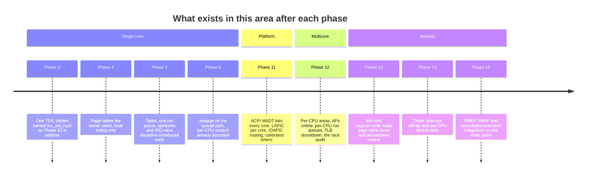

**Walking it.** Phase 2 is on the timeline because
[[Stage 2.2 - The TSS and Interrupt Stacks]] made an explicit decision — one TSS, but
never a visible global — that turns Phase 12's TSS work into an edit of one function
body. That is the pattern the whole roadmap uses: build the single-core version behind
an interface whose shape already admits the multicore version.

Phase 5 is the other example, and the more important one. [[05 - Gap Analysis (v1 to Product)]] records gap S7: the original plan built a preemptive scheduler with no
discussion of locking. The fix was to introduce spinlocks, atomics and IRQ-save discipline
in Phase 5 — seven phases before they were strictly needed — so that Phase 12 extends an
existing discipline rather than retrofitting one. **This is the single decision that makes
Phase 12 a phase rather than a rewrite.**

Phase 6 appears because `swapgs` is already on the syscall path before per-CPU data
exists; the entry stub is written assuming a per-CPU area from the start, with a
one-element array standing in for it.

Phase 11 is the hard prerequisite: without ACPI you cannot discover how many cores exist,
and without the LAPIC you cannot send an IPI or give each core its own timer. The 8259
PIC physically cannot route interrupts to more than one core.

What is deliberately missing, and why that is acceptable:

- **No CPU hotplug.** Cores are enumerated at boot and never added or removed. Real
  hotplug requires every per-CPU structure to tolerate disappearing, which is a large
  tax for a capability nothing here needs.
- **No NUMA awareness.** Memory is treated as uniform. Correct on every machine this
  targets; wrong on a two-socket server, where the balancer should prefer local memory.
- **No PCID.** Every address-space switch does a full non-global TLB flush. Tagged TLBs
  would avoid it, and would make shootdown considerably more intricate.
- **No RCU.** Read-mostly structures use locks or sequence locks. RCU is the right answer
  for the VFS and the task list at scale and is firmly post-1.0.
- **No lock-free data structures.** See §5.4. Locks plus per-CPU reformulation get the
  same scalability with a fraction of the risk.

---

## 8. Failure modes

Symptom first. This is the section to read at 2am.

> [!warning] Boots fine with `-smp 1`, triple-faults or hangs with `-smp 4`
> Something is shared that must be per-CPU. In order of likelihood: one TSS (two cores
> using the same `rsp0`), one GDT (the second `ltr` hits a descriptor whose busy bit the
> first core already set, giving `#GP`), one set of IST stacks, one idle task, or one
> initial kernel stack. Check that the per-CPU allocation loop actually ran `N` times and
> that each core's `lgdt` used *its* GDT.

> [!warning] `#GP` on the second core's `ltr`
> `ltr` sets the busy bit in the TSS descriptor, rewriting its type from `0x9` to `0xB`.
> A second `ltr` on the same descriptor faults. This is the diagnostic signature of a
> shared GDT. Each core needs its own copy with its own descriptor.

> [!warning] An AP faults immediately, before printing anything
> It called something that touches per-CPU data before `wrmsr` of `IA32_GS_BASE`. The
> usual culprit is a log line or a `KASSERT` at the very top of `ap_entry`. Move the
> `wrmsr` to the first thing after the stack and `CR3` switch, and keep the entry
> function's prologue free of anything that could log.

> [!warning] All cores report `cpu_index` 0
> Every core is reading CPU 0's area. Either the `wrmsr` used the same address for all
> cores (a loop variable not being used), or the areas were allocated but the pointer
> array was not filled in.

> [!warning] Everything works, then an AP faults the moment the kernel gets busy
> The AP is still standing on Limine's stack or Limine's page tables, and the PMM has
> now handed that memory out. See §3.3's ordering constraint. The tell is that the faulting
> address is in low physical memory and the fault happens after the first significant
> allocation.

> [!warning] A page fault at a plausible-looking address, long after an `munmap`
> Missing or incomplete TLB shootdown. A core is using a stale translation to a frame
> that has been reallocated. Confirm by checking whether the address was recently
> unmapped and whether the unmap path waits for acknowledgements. If the fault does not
> happen but memory quietly corrupts instead, it is the same bug with worse luck.

> [!warning] Two cores wedge, load average pinned, no output
> Lock-order inversion. Enable the debug-build rank checking; it converts this into an
> immediate assertion naming both locks. If the wedge involves the unmap path, suspect
> the shootdown deadlock from §3.5 instead — spinning for acknowledgements with
> interrupts disabled.

> [!warning] The four-core atomic counter test returns less than four million
> A non-atomic read-modify-write. Somewhere a `volatile` increment survived the audit.

> [!warning] A sleeping task never wakes, occasionally
> Lost wakeup. The classic cause is the store-then-load reordering from §3.4: the sleeper
> sets "I am sleeping" then checks the condition; the waker sets the condition then checks
> "is anyone sleeping". Each load is reordered ahead of its own store and both see the old
> value. Requires a `seq_cst` operation or an explicit `mfence` on at least one side —
> acquire/release is *not* enough for this pattern.

> [!warning] Console output is interleaved into unreadable garbage
> The console and log ring have no lock, or the lock is not taken around the whole line.
> Lock at line granularity, not character granularity.

> [!warning] Reads from PCI config space return another device's registers
> The `0xCF8`/`0xCFC` index-then-data protocol has no lock. Same class of bug for the
> RTC's CMOS ports. Neither is memory, so neither shows up in a search for shared
> pointers.

> [!warning] Adding cores makes the system slower
> Not a correctness bug and far harder to notice. Either lock convoying on a hot lock, or
> false sharing — two per-CPU fields in one cache line. Check that the per-CPU area is
> cache-line aligned and padded, and that hot per-CPU counters are not adjacent.

> [!warning] A panic on one core produces no output, or output shredded by the others
> The panicking core deadlocked on the console lock it already held, and the other cores
> never stopped. The SMP panic path must NMI-IPI every other core and forcibly reset the
> console lock.

---

## 9. Masterclass notes

> [!question] Discussion prompts
> 1. `current` was a global for seven phases and correct the whole time. Name the exact
>    property of the system that made it correct, and the exact moment that property
>    stopped holding. Then explain why a *lock* around `g_current_task` would not have
>    fixed it.
> 2. x86 is strongly ordered: it will not reorder loads with loads, or stores with
>    stores. Given that, construct a two-variable program that still produces a result
>    forbidden by sequential consistency, and say which single hardware structure is
>    responsible.
> 3. The kernel's upper half is mapped identically into every address space, and those
>    pages are marked global so they survive `CR3` reloads. Explain why that makes
>    unmapping a *kernel* page strictly more expensive than unmapping a user page.
> 4. A ticket lock is fair and an MCS lock is scalable. Describe a workload where the
>    ticket lock is measurably faster, and one where it is measurably slower, and name
>    the property that distinguishes them.
> 5. Limine starts the APs, so no trampoline is written. What did that decision cost in
>    understanding, and which of this document's failure modes would have been *easier*
>    to diagnose if the trampoline were ours?

Checkpoints:

- [ ] You understand this when you can draw the per-CPU area and its GS-base addressing
      from memory, including which MSR holds what in ring 0 and in ring 3.
- [ ] You understand this when you can explain why the idle task must be per-CPU, without
      using the word "because it is per-CPU".
- [ ] You understand this when you can explain why `volatile` is not a substitute for an
      atomic, in terms of both the compiler and the store buffer.
- [ ] You understand this when you can draw the TLB shootdown timeline and point at the
      exact instant before which freeing the frame is a use-after-free.
- [ ] You understand this when you can explain why a naive spinlock gets slower with more
      cores, in terms of cache-line ownership.
- [ ] You understand this when you can name the two structures in the audit checklist that
      are not memory at all.

**Board plan** — the order to draw this on a whiteboard:

1. One core, one box of globals. Label it "correct". Then draw a second core next to it
   and put a question mark on every global.
2. Split the globals into three columns: per-CPU, shared-and-locked, read-only-after-init.
   Sort the globals into them live, arguing each one.
3. Draw the per-CPU area with `current`, run queue, TSS, idle. Draw four of them.
4. Draw the GS-base arrow: one instruction, one register, four destinations. Add
   `swapgs` and the ring 3 / ring 0 invariant.
5. Draw the AP timeline: parked → stack and `CR3` → `GS` → tables → LAPIC → online →
   idle. Mark where bootloader memory can be reclaimed.
6. Draw the store buffer with two cores and the store-then-load reordering. Write the
   four-row ordering table beside it.
7. Draw the shootdown fan-out with the ack counter, and circle "free the frame" as the
   line that must come last.
8. Draw three locks side by side — test-and-set, ticket, MCS — with their cache traffic
   annotated. Then cross all three out and write "per-CPU".
9. Put the audit checklist up and go through it as a group, arguing which column each
   entry belongs to.

**Time budget:** 55 minutes. Roughly 8 minutes on §2's three categories, 10 on GS and
`swapgs`, 8 on AP bring-up, 12 on memory ordering (this always overruns and should be
allowed to), 8 on shootdown, 6 on locking, 3 on the audit.

---

## 10. Related

**Stages that build this:** [[Stage 12.1 - Per-CPU Data]] ·
[[Stage 12.2 - Atomics and Memory Ordering]] ·
[[Stage 12.3 - Starting the Application Processors]] ·
[[Stage 12.4 - Per-CPU Scheduling and Load Balancing]] ·
[[Stage 12.5 - Auditing the Kernel for Races]] · [[Stage 12.6 - TLB Shootdown]] ·
[[Stage 12.7 - Scalable Locking]]

**Stages this depends on:** [[Stage 2.2 - The TSS and Interrupt Stacks]] ·
[[Stage 4.2 - The Physical Frame Allocator]] · [[Stage 4.3 - Enabling Paging]] ·
[[Stage 5.1 - Tasks, Context, and the Stack]] ·
[[Stage 5.3 - Preemptive Scheduling]] ·
[[Stage 11.2 - The MADT and Interrupt Topology]] · [[Stage 11.4 - The Local APIC]] ·
[[Stage 11.6 - HPET and TSC Calibration]]

**Phases:** [[Phase 11 - Overview]] · [[Phase 12 - Overview]] · [[Phase 13 - Overview]]

**Decisions:** [[ADR-0003 - Limine as the Bootloader]] ·
[[ADR-0007 - Freestanding C++20 as the Kernel Language]] ·
[[ADR-0010 - Testing Strategy and the QEMU Exit Device]]

**Vault:** [[06 - Architecture Overview]] · [[05 - Gap Analysis (v1 to Product)]] (gaps
S7, C9, C10) · [[04 - Glossary]] · [[09 - Testing Strategy]] · [[13 - Coding Standards]] ·
[[14 - Debugging Playbook]] · [[19 - The Eight-Hour Masterclass]]
