# 15 — Security Architecture

> [!abstract] What this document covers
> Every other document in this atlas describes a subsystem. This one describes a
> property that no subsystem owns: the fact that a program running in ring 3 must not
> be able to become the kernel. It starts from the threat model — what an attacker
> actually controls and what they are actually trying to reach — and then walks each
> defence in the system, naming the exact attack it converts from a compromise into a
> clean fault. It ends with an honest account of what is *not* defended against.

**Zoom level:** Cross-cutting — this document deliberately spans system, subsystem and
bit level, because security is not a layer you can point at
**Built by:** [[Stage 15.1 - NX and W^X]], [[Stage 15.2 - SMEP and SMAP]],
[[Stage 15.3 - Guard Pages and Stack Protection]], [[Stage 15.4 - KASLR]],
[[Stage 15.5 - Auditing the Syscall Boundary]],
[[Stage 15.6 - Users, Groups, and Permissions]], [[Stage 15.7 - Resource Limits]]
**Prerequisites:** [[06 - Architecture Overview]], [[01 - What Happens at Power-On]]
**Masterclass session:** 8 (see [[19 - The Eight-Hour Masterclass]])

> [!note] Zero background assumed, and one caveat about older notes
> Every term is defined at first use. Where a word already has a vault definition it
> matches [[04 - Glossary]] — but the glossary was written against the v1 plan and still
> describes a 32-bit `i686` target with GRUB. So does [[Stage 6.3 - The System Call Interface]],
> which still specifies `int 0x80` and `eax`/`ebx`/`ecx`/`edx`. This project targets
> **x86_64** ([[ADR-0002 - Target x86_64 Not i686]]), boots with **Limine**
> ([[ADR-0003 - Limine as the Bootloader]]), and uses **`syscall`/`sysret`** with
> arguments in `rdi, rsi, rdx, r10, r8, r9`. Where they disagree,
> [[06 - Architecture Overview]] and this document win.

---

## 1. The one-sentence version

Security in this kernel is one rule — **nothing that crosses the boundary from ring 3
into ring 0 is trusted** — enforced twice: once in software at the syscall boundary
where the kernel checks every argument, and once in hardware by page-table bits and
control registers that make whole classes of mistake fault instead of succeed.

Expanded. A **ring** is a hardware privilege level. Ring 0 code can execute any
instruction and touch any memory; ring 3 code cannot. That wall is the only thing
separating "a user program crashed" from "a user program owns the machine". The wall
has exactly three doors — the `syscall` instruction, hardware interrupts, and CPU
exceptions — and an attacker's entire job is to get something through one of those
doors that makes the kernel act against itself. The kernel's job is symmetrical: check
everything at the door, and arrange the hardware so that if a check is ever missed, the
CPU refuses the resulting access rather than performing it. The first half is
[[Stage 15.5 - Auditing the Syscall Boundary]]. The second half is Stages 15.1 through
15.4. Neither half is sufficient alone, and the reason both exist is that the first
half is written by humans.

---

## 2. The picture

This is the whole document in one diagram: what the attacker holds, where it enters,
what stands in the way, and what they are trying to reach.

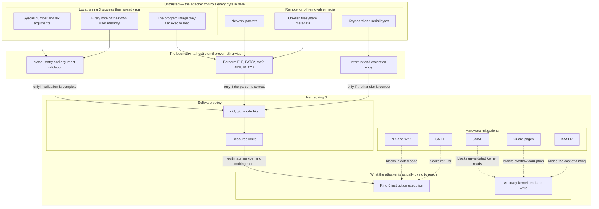

**Walking every box.**

- **`HOSTILE`** is the threat model stated as a picture. Everything inside it is a byte
  the attacker chooses. Nothing inside it may ever be assumed well-formed, in range,
  stable, or even self-consistent between two reads.
- **`LOCAL` → `SARG`**: the attacker already has code running in ring 3. That is the
  starting assumption, not the thing to prevent — they downloaded a program, or they
  have a shell. They control `rax` (the syscall number) and all six argument registers
  absolutely.
- **`LOCAL` → `UMEM`**: they control the *contents* of their own address space, and on a
  multi-threaded process they can change those contents concurrently with a syscall.
  This is what makes "check the pointer, then read it twice" a vulnerability rather than
  a style issue (§3.6).
- **`LOCAL` → `IMG`**: `execve` takes a path to a file the attacker may have written. The
  ELF parser from [[Stage 7.4 - Loading and Running an ELF Program]] runs on bytes chosen
  by the attacker before any privilege check has been usefully applied.
- **`REMOTE` → `PKT`**: from [[Phase 14 - Overview|Phase 14]], packets arrive from the
  network. The attacker no longer needs a local account. This is a categorical widening
  of the threat model, and it happens one phase before hardening.
- **`REMOTE` → `FSB`**: a USB stick, or a disk image, contains a FAT32 or ext2
  superblock. A malformed one that makes the driver index past an array is a kernel
  compromise from a plugged-in device. [[Phase 10 - Overview|Phase 10]].
- **`REMOTE` → `KBD`**: the least interesting entry point, but the one that exists first.
  A keyboard scancode is still input.
- **`GATE`** is the entire trusted computing surface. Every byte from `HOSTILE` must pass
  through one of these three boxes, and the security of the system is the correctness of
  what is inside them.
- **`GATE` → `SYSC`**: the `syscall` entry path. Its validation is
  [[Stage 15.5 - Auditing the Syscall Boundary]].
- **`GATE` → `TRAP`**: the IDT entry path from [[Stage 2.3 - The Interrupt Descriptor Table]].
  Attacker-triggerable because a user program can *cause* a fault deliberately — a page
  fault, a divide by zero, a general protection fault — and thereby run kernel code at a
  moment of its choosing.
- **`GATE` → `PARSE`**: the parsers. These are boundary code that does not look like
  boundary code, which is precisely why they get audited last and break first.
- **`KRN` → `MITI`**: the five hardware mitigations of Stages 15.1–15.4. They do not stop
  bugs. They change what a bug *does*.
- **`KRN` → `POL`**: policy the kernel implements in software, not the CPU. Credentials
  and limits ([[Stage 15.6 - Users, Groups, and Permissions]],
  [[Stage 15.7 - Resource Limits]]).
- **`KRN` → `GOAL`**: the two things every kernel exploit is ultimately after. `RING0` is
  "run my instructions with CPL 0". `KMEM` is "read or write any kernel address" — which
  is strictly more useful, because from arbitrary write you can construct ring 0
  execution, and from arbitrary read you can defeat KASLR first.

**Walking every arrow.**

- The six arrows from `HOSTILE` into `GATE` are the complete list of ways attacker bytes
  become kernel inputs. If you can add a seventh, you have found an unaudited entry
  point, and that is the exercise in §9.
- `SYSC --> CRED`, `PARSE --> CRED`, `TRAP --> CRED` carry the conditional in their
  labels deliberately. Validation being *complete* is an assumption, not a fact. The
  dashed arrows exist because that assumption fails.
- `CRED --> LIMS --> RING0`: the legitimate path. A validated request from an
  authenticated process within its limits does get serviced in ring 0. Security is not
  refusal; it is refusing exactly the right things.
- The five dashed arrows are the subject of §3. Each one is a hardware or structural
  mechanism that intercepts a specific attack technique. **Read them as "this line is
  what the attacker runs into when the solid line above was drawn wrong."**

> [!warning] The single most dangerous sentence in kernel development
> "The user program would never pass that value." It would. It is not a program, it is
> an attacker with a debugger, and the value it passes is the one that breaks you.

---

## 3. Zooming in

### 3.1 The doors: every way into ring 0

Before defending the boundary you must be able to enumerate it. On x86_64 there are
exactly three mechanisms by which ring 3 causes ring 0 code to run, and every one of
them is a place attacker-chosen register state arrives.

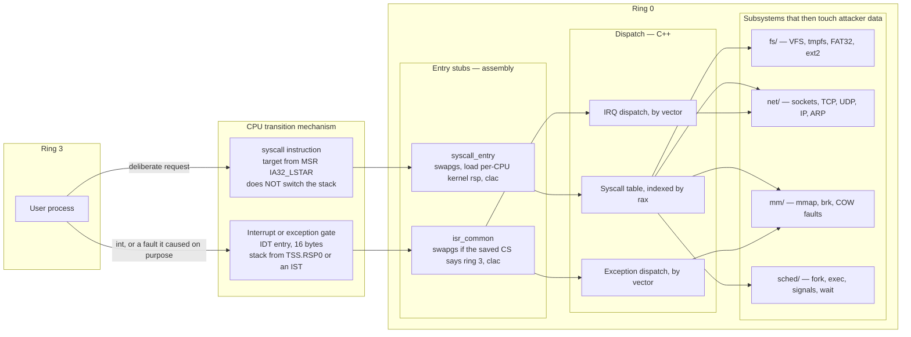

**Walking every box.**

- **`P`** is the attacker's process. It has full control of every general-purpose
  register and of `RFLAGS` — including, critically, the `AC` bit (bit 18), which a ring 3
  program *can* set with `popfq`.
- **`SYSCI`**: the `syscall` instruction. It loads `RIP` from the MSR `IA32_LSTAR`
  (`0xC0000082`), saves the old `RIP` in `rcx` and the old `RFLAGS` in `r11`, and masks
  `RFLAGS` with `IA32_FMASK` (`0xC0000084`). It is fast because it does almost nothing —
  and "almost nothing" includes **not switching the stack**. On entry, `rsp` still points
  into user memory.
- **`INTG`**: an IDT gate. Unlike `syscall`, the CPU *does* switch stacks when the
  privilege level changes, loading `RSP0` from the TSS ([[Stage 2.2 - The TSS and Interrupt Stacks]]),
  or one of the seven **IST** (Interrupt Stack Table) stacks if the gate names one. It
  always pushes five qwords: `SS`, `RSP`, `RFLAGS`, `CS`, `RIP`.
- **`ENTRY` → `SSTUB`**: because `syscall` did not switch the stack, the first thing the
  stub must do is get a kernel stack. That means `swapgs` — an instruction that exchanges
  the `GS` base with the value in `IA32_KERNEL_GS_BASE` (`0xC0000102`) — so that the
  per-CPU area at `0xFFFF900000000000` becomes reachable, and the kernel `rsp` can be
  loaded from it.
- **`ENTRY` → `ISTUB`**: the interrupt stub has a harder job, because an interrupt can
  arrive while already in ring 0. It must `swapgs` only if the saved `CS` shows the
  interrupted code was ring 3. Getting this conditional wrong in either direction is a
  classic, and it is exploitable in both.
- **`DISPATCH`**: the three tables. `TBL` is the syscall table indexed by `rax`; the
  range check on `rax` is the first validation in the whole system and the cheapest.
- **`WORK`**: four subsystems, each of which will eventually operate on bytes the
  attacker chose. Note that `MM` is reachable from *both* the syscall path (`mmap`) and
  the exception path (a page fault), and `NET` from both the syscall path (`send`) and
  the interrupt path (a packet arriving). Two entry points into the same code, with
  different concurrency rules, is where the interesting bugs live.

**Walking every arrow.**

The two arrows out of `P` are the complete threat surface for privilege transition. The
second one deserves emphasis: **a user program can trigger an exception on purpose.** It
can dereference null to invoke the page fault handler, execute `ud2` to invoke the
invalid-opcode handler, or misalign a stack to provoke a fault at an inconvenient moment.
Exception handlers are attacker-invokable code, at attacker-chosen times, and they must
be written that way.

`SSTUB --> TBL` and `ISTUB --> EXC/IRQ` are the moment control passes from assembly to
C++. Everything before that arrow is written once and read a hundred times; everything
after it is written a hundred times and audited once. That asymmetry is why the entry
stubs are short and why they carry the `clac` (§3.3).

> [!warning] `clac` belongs in the entry stubs, not only in `IA32_FMASK`
> `RFLAGS.AC` is settable from ring 3 with `popfq`. `IA32_FMASK` clears it on the
> `syscall` path — but an **interrupt gate does not clear `AC`**. If a user program sets
> `AC` and then triggers a page fault, your exception handler runs at CPL 0 with SMAP
> effectively disabled. Every ring-0 entry stub must execute `clac` explicitly.
> [[Stage 15.2 - SMEP and SMAP]].

### 3.2 W^X and NX — no page is both writable and executable

The oldest exploit technique is: write my instructions into some memory the program will
later jump to, then arrange for it to jump there. The countermeasure is to make no page
in the system both writable and executable, so that memory the attacker can write is
memory the CPU refuses to fetch from.

**NX** is the hardware half. Bit 63 of a page-table entry, when set, means "no
instruction fetch from this page". **W^X** ("W xor X") is the policy half: the invariant
that the writable set and the executable set never intersect.

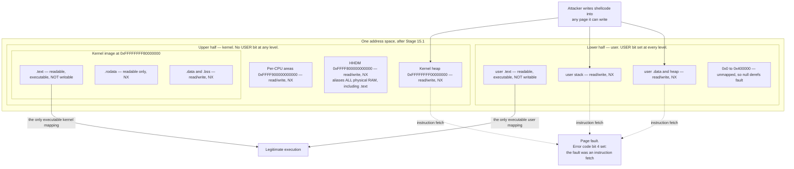

**Walking every box.**

- **`UPPER`** is the kernel half of every address space, per [[06 - Architecture Overview]].
  It is mapped identically in every process, which is why a syscall does not need a
  page-table switch — and which is also why a bug here is a bug everywhere.
- **`IMAGE` → `TEXT`**: the kernel's own code. After Stage 15.1 it is read-only and
  executable, and nothing else in the kernel is executable at all.
- **`IMAGE` → `RODATA`**: constants, string literals, the syscall table itself. Read-only
  and NX. Putting the **syscall table in `.rodata`** matters: it is a table of function
  pointers, and a writable table of function pointers is the single most convenient
  target an arbitrary-write primitive could ask for.
- **`IMAGE` → `DATA`**: mutable kernel globals. Writable, therefore non-executable.
- **`HEAP`**: `kmalloc` memory. Writable, therefore non-executable. There is no legitimate
  reason for the kernel to execute heap memory in this design — there are no loadable
  modules and no JIT.
- **`PCPU`**: per-CPU areas. Same reasoning.
- **`HHDM`** is the one that catches people. The **higher-half direct map** aliases *all*
  physical RAM at `0xFFFF800000000000 + phys`. That includes the frames holding the
  kernel's `.text`, and it includes every frame currently backing a user page. If the
  HHDM is left executable, then every writable user page has a second, kernel-side,
  executable alias — and W^X is silently and completely defeated. The published attack
  that exploits exactly this is called **ret2dir**. **The HHDM must be NX.**
- **`LOWER`** is the user half, distinguished by the `USER` bit. Same policy: exactly one
  executable region, and it is not writable.
- **`NULLP`**: the first 4 MiB of user space is deliberately unmapped, so a null pointer
  dereference faults instead of reading whatever happens to live at address 0. This is a
  security property as much as a debugging one — "null page mapping" attacks are a real
  historical class, and unmapping the region ends them by construction.

**Walking every arrow.** The three solid arrows from `SHELL` show what the attacker can
still do: they can absolutely write shellcode into a writable page. W^X does not prevent
that and does not try. The three dashed arrows show what happens next — the instruction
fetch faults, with the page-fault error code's bit 4 (`I/D`) set, which is the CPU
telling you in one bit that this fault was a fetch and not a data access. The two solid
arrows into `OK` show the total set of places execution is legal.

#### The lifecycle of the kernel's own `.text` permissions

Permissions are not static. `.text` starts life writable and becomes read-only.

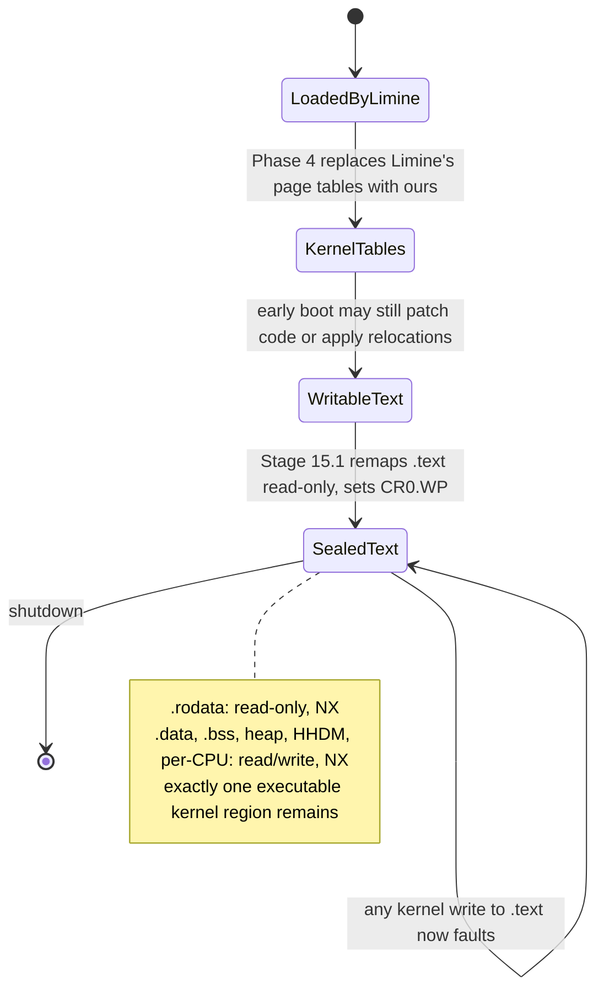

**Walking it.** Limine loads the image with whatever permissions its own page tables
carry; the kernel does not control that. [[Stage 4.3 - Enabling Paging]] builds our own
tables, and until Stage 15.1 runs they are permissive. `WritableText --> SealedText` is
the *sealing* transition, and it must happen after every legitimate self-modification
and before `init` is spawned. The self-loop on `SealedText` is the property being bought:
from that point, a kernel bug that writes into `.text` faults rather than succeeding.

> [!warning] W^X on `.text` is worthless without `CR0.WP`
> `CR0.WP` (bit 16, "write protect") controls whether *ring 0* obeys the read-only bit at
> all. With `WP` clear — which is a legal state — the kernel can write to any page marked
> read-only, and your beautifully sealed `.text` is writable again. There is no fault, no
> warning, and no test failure unless you write the test that specifically tries to write
> to `.text` and expects a panic. Set `CR0.WP` in Stage 15.1 and test it.

> [!warning] NX bit 63 is a *reserved* bit until `EFER.NXE` is set
> `NX` only exists if bit 11 (`NXE`) of the `IA32_EFER` MSR (`0xC0000080`) is set. If it
> is clear, bit 63 of a PTE is reserved, and setting it makes every access to that page
> raise a page fault with the reserved-bit flag (error code bit 3) set. The symptom is a
> kernel that triple-faults the instant the new tables are loaded. Set `NXE` **before**
> you write any PTE with bit 63 set. [[Stage 15.1 - NX and W^X]].

### 3.3 SMEP and SMAP — the kernel is not allowed to touch user space by accident

W^X defends against code the attacker *wrote*. The next two features defend against code
and data the attacker owns simply by being a running process. Both are single bits in
`CR4`, and both convert a category of kernel bug into a page fault.

**SMEP** — Supervisor Mode Execution Prevention, `CR4` bit 20 — makes it a fault for
ring 0 to fetch an instruction from any page with the `USER` bit set. **SMAP** —
Supervisor Mode Access Prevention, `CR4` bit 21 — goes further: it makes it a fault for
ring 0 to *read or write* a user page at all, unless `RFLAGS.AC` is set.

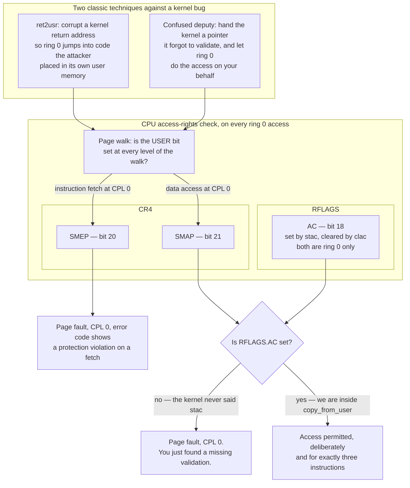

**Walking every box.**

- **`R2U`**: *return to user*. The attacker corrupts a saved return address, a function
  pointer, or a jump table entry inside the kernel so that ring 0 execution lands on code
  the attacker placed in their own user pages. It is attractive because the attacker
  fully controls that memory and does not have to find gadgets. Before SMEP it was the
  default technique for turning a kernel write into a kernel shell.
- **`CD`**: the *confused deputy*. The attacker does not need to run any code in ring 0.
  They hand the kernel a pointer to memory they should not be able to touch, and the
  kernel — which *is* allowed to touch it — does the access for them. Passing
  `0xFFFFFFFF80000000` to `read()` and having the kernel obligingly fill kernel `.text`
  from a file is the canonical example.
- **`WALK`**: both techniques funnel into the same hardware moment. On every access the
  MMU walks four levels (PML4 → PDPT → PD → PT) and computes an effective `USER` bit as
  the **AND** across all four entries. A page is user-accessible only if every level says
  so. This is why the kernel half of the address space is protected by a single `USER`
  bit cleared at the PML4 level — one entry protects an entire region.
- **`CR4R`**: the two enable bits. Both must be checked for availability first —
  `CPUID.(EAX=07H,ECX=0):EBX` bit 7 for SMEP and bit 20 for SMAP — because a CPU without
  them will `#GP` on the attempt to set them.
- **`FLR` → `ACBIT`**: `RFLAGS.AC`. The SMAP escape hatch. `stac` sets it and `clac`
  clears it, and **both instructions fault with `#UD` if executed at CPL greater than 0**,
  so a user program cannot use them to disable SMAP for itself. It can, however, set `AC`
  through `popfq`, which is why §3.1's warning about `clac` in the entry stubs exists.

**Walking every arrow.** `WALK --> SMEPBIT` is taken when the access was an instruction
fetch; `WALK --> SMAPBIT` when it was a data read or write. SMEP has no escape hatch at
all — there is never a legitimate reason for the kernel to execute user code — so it goes
straight to `FAULT1`. SMAP branches on `AC`, and the two outcomes are the whole point:
`FAULT2` is a bug you just found, and `ALLOW` is `copy_from_user` doing its job.

The `ALLOW` label says "for exactly three instructions" for a reason. The correct shape
is `stac`, the copy, `clac`, with nothing else between them — no allocation, no locking,
no logging. Every instruction executed with `AC` set is an instruction executing with
SMAP switched off.

> [!example] SMAP as a bug-finding tool, not a security feature
> The Phase 15 overview says SMAP is the most valuable feature in this phase, and *not
> primarily for security*. Here is why, concretely. Before SMAP, a `sys_write` that does
> `memcpy(kbuf, user_ptr, len)` without validation works perfectly in every test you
> write, because your test passes valid pointers. After SMAP, that same line faults
> immediately, every time, on the first legitimate call — because the kernel is reading a
> user page with `AC` clear. Turning SMAP on does not protect you from the bug. It
> *converts the bug into a boot failure*, which is the only kind of bug that reliably
> gets fixed. Turn it on in [[Stage 15.2 - SMEP and SMAP]], **before** the audit in
> [[Stage 15.5 - Auditing the Syscall Boundary]], and let the machine write your to-do
> list.

> [!warning] SMAP's rules for *implicit* supervisor accesses are different
> Accesses the CPU makes on its own behalf — loading a descriptor from the GDT, reading
> the TSS, walking the page tables themselves — are "implicit supervisor accesses", and
> `AC` does not exempt them. They are blocked from user pages unconditionally. This
> matters if you were ever tempted to place a descriptor table in a user-accessible page.
> Verify the exact wording against Intel SDM Vol. 3, §4.6 before relying on the detail.

> [!warning] QEMU will not test this unless you ask it to
> The default `qemu64` CPU model does **not** expose SMEP or SMAP. Your `CPUID` check
> correctly finds them absent, your code correctly skips enabling them, every test
> passes, and you ship a kernel whose mitigations have never once executed. Use
> `-cpu max` or an explicit `+smep,+smap`, and make the in-kernel test *assert* that the
> bits ended up set rather than logging that they were unavailable.

### 3.4 Guard pages — an overflow becomes a fault, not corruption

A **stack** grows downward. Nothing in the hardware knows where it ends. If a function
recurses too deeply or allocates a large local array, the stack pointer simply walks off
the bottom of the allocation and into whatever the allocator placed below — silently
corrupting it. A **guard page** is an unmapped page deliberately placed there, so the
walk-off becomes a page fault at the exact instant it happens.

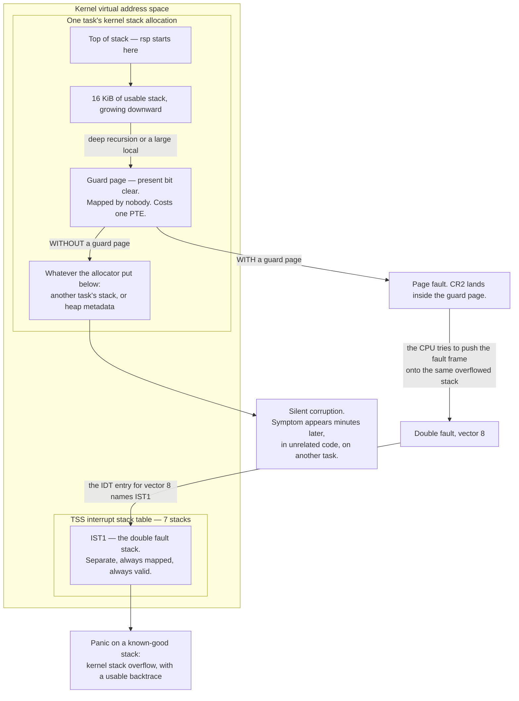

**Walking every box.**

- **`TOP`/`BODY`**: an ordinary kernel stack, allocated per task in
  [[Stage 5.1 - Tasks, Context, and the Stack]]. Sixteen kibibytes is a typical size; the
  exact number matters less than the fact that it is finite and that nothing checks it.
- **`GP`**: the guard page. It is not "protected" memory — it is *absent* memory. The
  `Present` bit (PTE bit 0) is clear, so any touch faults. It costs one page-table entry
  and zero physical frames, which is why there is no excuse not to have one.
- **`NEIGH`**: the counterfactual. Without a guard page, the overflow writes into the
  neighbouring allocation. Nothing faults. Nothing logs.
- **`IST1`**: one of the seven Interrupt Stack Table entries in the TSS. An IDT gate can
  name an IST index, and when it does, the CPU switches to that stack *unconditionally* —
  even if it was already in ring 0. This is the mechanism that makes the guard page
  reportable rather than merely fatal.

**Walking every arrow — and the subtlety that makes this stage worth its own diagram.**

The interesting path is `PF --> DF`. When the overflowing push touches the guard page,
the CPU raises a **page fault**. But delivering a page fault means pushing five qwords —
`SS`, `RSP`, `RFLAGS`, `CS`, `RIP` — and because this is a same-privilege fault the CPU
pushes them onto *the current stack*, which is the stack that just overflowed. That push
also lands in the guard page. A fault while delivering a fault is a **double fault**,
vector 8.

If vector 8's IDT entry does not name an IST, the double fault delivery hits the guard
page too, and a fault while delivering a double fault is a **triple fault**: the CPU
gives up and the machine resets, with no message. That is why the project fact "**`#DF`
must use an IST**" is stated in the architecture spec and not left as an optimisation.
`DF --> IST1 --> PANIC` is the payoff: the handler runs on a stack that is guaranteed
valid, so it can print `CR2`, the error code and a backtrace
([[Stage 1.7 - Symbolised Backtraces]]).

> [!warning] The `SILENT` branch is what makes this stage worth doing late as well as early
> Without a guard page, a stack overflow in task A corrupts task B's stack, and task B
> crashes ten seconds later in a function that is entirely correct. You will debug task
> B. You will find nothing wrong with task B, because there is nothing wrong with task B.
> This is the most expensive class of bug in the project measured in hours per incident,
> and one absent PTE per stack eliminates it.

User-space stacks get the same treatment for a different reason: a guard page between
the user stack region (growing down from `0x0000700000000000`) and the `mmap` region
turns "the stack grew into a mapping" into a clean `SIGSEGV` instead of a program that
silently reads its own heap as stack frames. That fault is an ordinary user page fault,
delivered on the `RSP0` stack, and needs no IST.

### 3.5 KASLR — and an honest account of what it buys

**KASLR** — Kernel Address Space Layout Randomisation — loads the kernel at a different
base address on every boot, so an attacker who wants to overwrite a specific kernel
function pointer does not know where it is.

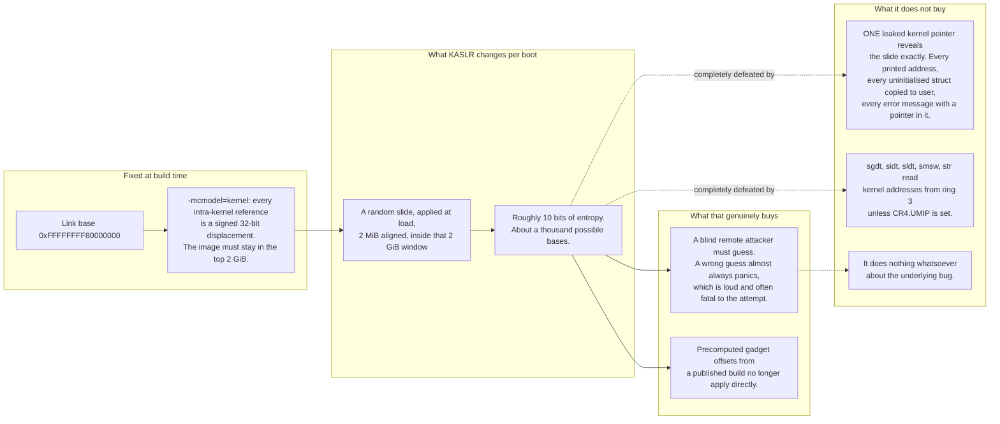

**Walking every box.**

- **`LINK` and `MC`**: the constraint that shapes everything. `-mcmodel=kernel` tells the
  compiler that all code and data live in the top 2 GiB, so it can use 32-bit signed
  displacements for every internal reference — smaller and faster code. The price is that
  the randomisation window is 2 GiB, not the 128 TiB of the upper half.
- **`SLIDE`**: the kernel is loaded at base plus a random, 2 MiB-aligned offset. The
  alignment is not arbitrary: 2 MiB alignment lets large pages back the kernel image, and
  a finer granularity would buy a few bits of entropy at the cost of the TLB.
- **`ENT`**: 2 GiB divided by 2 MiB is 1024 slots, so about **10 bits**. State this number
  out loud, because it is the whole honest argument. A thousand guesses is nothing to an
  attacker who can retry; it is a great deal to one who gets a single attempt.
- **`BLIND`**: the real value. If a wrong guess causes a panic, the attacker gets one
  attempt per reboot, and a panicking machine is an incident someone notices.
- **`NOTGADGET`**: a published binary no longer yields directly usable absolute addresses.
  The attacker must find a leak first, which is an extra bug they must have.
- **`LEAK`**: the fatal weakness. KASLR is defeated by a *single* kernel address reaching
  user space. Not an exploit — a `printf`. A pointer in an error string. A struct copied
  to user with a padding field that happened to contain a stack address. This is why the
  syscall audit's last checklist item is "the return value cannot leak a kernel address",
  and why that item is in the *same* checklist as the pointer validation.
- **`INSTR`**: five instructions — `sgdt`, `sidt`, `sldt`, `smsw`, `str` — are executable
  from ring 3 and return kernel addresses. `CR4.UMIP` (bit 11, where available; check
  `CPUID.(EAX=07H,ECX=0):ECX` bit 2) makes them fault in ring 3. Enabling UMIP is a
  two-line change that closes a leak your own code cannot avoid.
- **`NOFIX`**: KASLR is mitigation, not repair. It buys time and noise. It is the least
  valuable item in Phase 15 and the one most likely to be mistaken for the most valuable.

**Walking the arrows.** The solid chain `LINK → MC → SLIDE → ENT` is the mechanism. The
two dashed arrows are labelled "completely defeated by" rather than "weakened by" on
purpose: an address leak does not reduce KASLR's entropy, it eliminates it.

> [!warning] KASLR makes every debugging session harder, for two years' worth of sessions
> With a random base, a panic that prints `RIP = 0xFFFFFFFF9A3C1204` tells you nothing,
> your `gdb` symbol file is wrong on every boot, and your backtraces are numbers. The
> mitigation is mandatory infrastructure, not optional polish: **print the slide at boot**,
> and provide a script that rebases the symbol table by it. Budget for that in
> [[Stage 15.4 - KASLR]] rather than discovering it during the first post-KASLR panic. It
> is the main reason this stage is last among the hardware mitigations.

### 3.6 The syscall boundary — the most security-critical code in the tree

Everything above is a safety net. This is the actual defence. The claim from
[[06 - Architecture Overview]] — "a missing check here is a full kernel compromise" — is
not rhetoric, and this diagram is the checklist made executable.

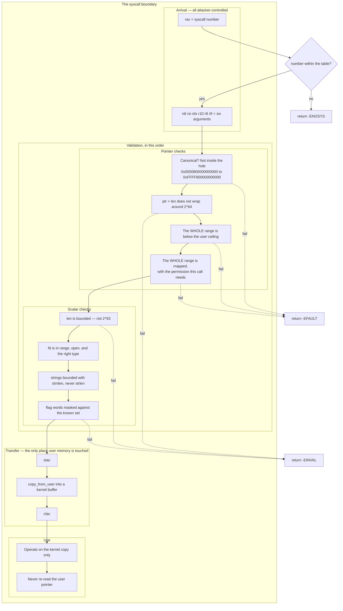

**Walking every box.**

- **`ARRIVE`**: nothing here is trustworthy, including `rax`. The range check on `rax` is
  first because it is the cheapest and because an out-of-range index into a function
  pointer table is an immediate arbitrary-call primitive.
- **`PTRV` → `CANON`**: x86_64 requires **canonical** addresses — bits 63 through 47 must
  all be copies of bit 47. The **non-canonical hole** between `0x0000800000000000` and
  `0xFFFF800000000000` is not merely unmapped; touching it raises a general protection
  fault rather than a page fault, which some code paths handle differently. Reject it
  explicitly rather than relying on the fault.
- **`PTRV` → `OVF`**: `ptr + len` computed in 64-bit arithmetic can wrap. An attacker who
  passes `ptr = 0x7FFFFFFFF000` and `len = 0xFFFFFFFFFFFFF000` produces a sum that lands
  back in low memory, so a naive "is `ptr + len` below the ceiling?" check passes while
  the actual range covers everything. **Check the overflow before checking the range.**
  Order matters here, which is why the diagram is a chain and not a set.
- **`PTRV` → `CEIL`**: the *whole* range, not the first byte. A buffer that starts at
  `0x00007FFFFFFFFFF0` and runs 32 bytes straddles the ceiling. Checking the start
  address alone is the single most common form of this bug.
- **`PTRV` → `MAPPED`**: present, and with the right permission. A `read()` into a buffer
  needs that buffer *writable*; validating it as merely present lets an attacker have the
  kernel write into their read-only `.text`. Direction is part of the check.
- **`SCALARV`**: the non-pointer arguments, which are equally attacker-controlled and get
  audited half as carefully. `strnlen` rather than `strlen` because a user "string" is not
  guaranteed to contain a terminator anywhere in the address space. Flag masking because
  an unknown flag bit today is a feature you add next year with a different meaning.
- **`COPY`**: the chokepoint. `copy_from_user` and `copy_to_user` are the *only* functions
  in the kernel that dereference a user address, they are the only ones that execute
  `stac`/`clac`, and they must handle a fault mid-copy by returning an error rather than
  panicking. Centralising this is what makes the audit finite: you audit one function
  deeply and every call site shallowly.
- **`USE` → `NEVER`**: the **TOCTOU** rule (Time Of Check, Time Of Use). If you validate a
  pointer and then read from it twice, a second thread in the same process can change the
  memory between the two reads — so the value you validated is not the value you used.
  Copy once into the kernel, then operate exclusively on the copy. From
  [[Stage 13.2 - fork]] onward there are multiple threads to do this with, and from
  [[Phase 12 - Overview|Phase 12]] onward they run genuinely simultaneously on another
  core.

**Walking the arrows.** The solid chain is the happy path and its order is load-bearing:
canonical before overflow before range before mapping, then scalars, then the transfer,
then use. The six dashed failure arrows all leave the pipeline before any user byte has
been touched. The distinction between `-EFAULT` (the pointer is bad) and `-EINVAL` (the
value is bad) is worth maintaining, because it is the difference between a debuggable
error report and a shrug.

> [!example] The bug this whole section exists to prevent
> ```cpp
> // WRONG — and it works perfectly in every test you will write.
> long sys_write(int fd, const char* buf, size_t len) {
>     return vfs_write(fd_lookup(fd), buf, len);   // buf is dereferenced in ring 0
> }
> ```
> A user program calls `write(1, (char*)0xFFFFFFFF80000000, 8)`. The kernel is allowed to
> read that address. It reads eight bytes of its own `.text` and writes them to stdout.
> Repeat with an incrementing pointer and the attacker has dumped the entire kernel
> image — including, incidentally, the KASLR slide. Now call `read()` with the same
> pointer and the attacker is *writing* to kernel `.text`. That is game over, from four
> lines of plausible code, and SMAP is what makes it fault instead.

### 3.7 Users, groups and permissions — the policy layer

Everything so far is enforced by the CPU. This layer is not: it is a decision the kernel
makes in software, on every filesystem operation, and it is only as good as its coverage.

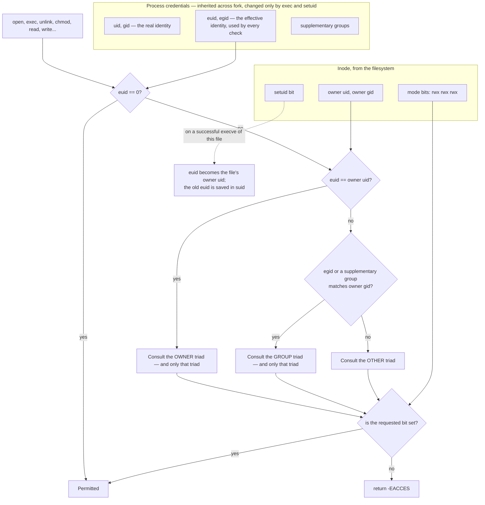

**Walking every box.**

- **`PROC` → `UIDN` vs `EUIDN`**: a process has a *real* identity (who started it) and an
  *effective* identity (whose authority it is currently acting with). Every permission
  check uses the effective one. Confusing the two is the classic implementation bug, and
  it is silent — the system appears to work, and `setuid` programs are simply broken in a
  direction nobody notices until it is exploited.
- **`FILEN`**: the inode carries an owner, an owning group, and nine permission bits
  grouped into three triads. This is the whole model. It is coarse and it is 1971, and it
  is chosen because its coarseness is what makes it auditable.
- **`ROOTQ`**: `euid == 0` bypasses everything. This is the definition of root, and it is
  worth stating plainly that in this model root is not a user with many permissions — it
  is a check that is skipped.
- **`OWNBITS` / `GRPBITS` / `OTHBITS`**: **only the first matching triad is consulted.**
  This is the rule everyone gets wrong. A file with mode `0057` — owner `---`, group
  `r-x`, other `rwx` — is *unreadable by its owner*, even though "other" grants read to
  everybody else. The owner matches first, the owner triad says no, and the check stops.
  Implementing this as "OR the applicable triads together" is a permissive bug that will
  never fail a test written by someone who assumed the same thing.
- **`SETU` → `RAISE`**: the `setuid` bit means "run this program with the file owner's
  effective identity". It is how an unprivileged user runs a privileged operation, and it
  is the single largest source of local privilege escalation in Unix history — because a
  `setuid` program is an attack surface with the same properties as a syscall boundary,
  written by an application programmer.

**Walking the arrows.** The chain from `START` is evaluated on every operation, and the
architectural requirement is that it is evaluated in **one function**, called from every
VFS entry point. A permission check duplicated across `open`, `unlink`, `rename` and
`chmod` is four chances to differ; the one that differs is the vulnerability.

Directory bits mean something different from file bits and need saying: on a directory,
`x` means "may traverse into it", `r` means "may list its contents", and `w` means "may
create and delete entries in it". A user with `w` on a directory can delete a file they
cannot read, which is correct Unix behaviour and surprises everyone.

> [!warning] `setuid` is not finished when `euid` changes
> A `setuid` binary inherits its parent's open file descriptors, environment and
> resource limits, all of which the attacker chose. Close-on-exec must actually work
> ([[Stage 13.1 - The File Descriptor Table]]), the environment must be treated as
> hostile, and the `setuid` bit must be **cleared on any write to the file** — otherwise
> an attacker who can append to a root-owned `setuid` binary owns the machine. If
> [[Stage 15.6 - Users, Groups, and Permissions]] ships `setuid` without those three, it
> has shipped a vulnerability, not a feature.

### 3.8 Resource limits — availability is a security property

An attacker who cannot read your memory can still stop your machine. `fork()` in a loop,
`open()` in a loop, `mmap()` a terabyte. Nothing here is a memory-safety bug; the kernel
does exactly what it was asked, until it cannot do anything at all.

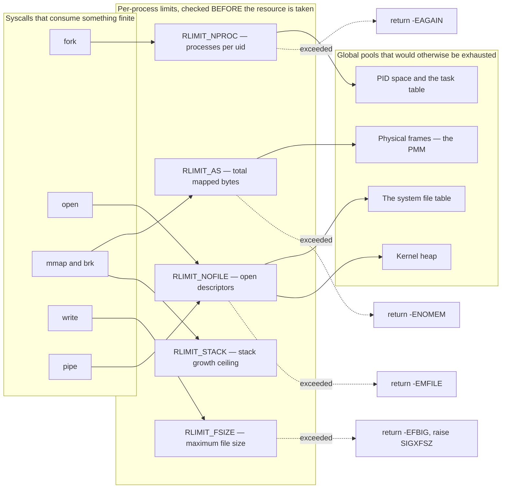

**Walking every box.**

- **`SYSCALLS`**: five calls, each of which converts an attacker's CPU time into a
  permanently held kernel resource. Note that they are all completely ordinary calls that
  every legitimate program makes. There is no malicious syscall to block.
- **`LIMITS`**: a per-process array of soft and hard limits, inherited across `fork` and
  preserved across `exec`. A process may lower its own limits freely and may raise the
  soft limit only up to the hard limit; only root may raise a hard limit. That asymmetry
  is the entire security model of the mechanism.
- **`GLOBAL`**: the pools. Every one of them is exhaustible, and every one of them, when
  exhausted, breaks the kernel rather than the attacker — the PMM cannot allocate a page
  table, `kmalloc` returns null in a path that did not check, the scheduler cannot create
  the reaper. **Denial of service in a kernel is not "the machine is slow", it is
  "allocation failures appear in code paths that were never tested for them."**

**Walking the arrows.** The three-hop chains — `fork → RLIMIT_NPROC → PIDs` — say where
each limit is charged, and the important word in the `LIMITS` subgraph title is
**before**. A limit checked after the resource has been allocated is not a limit, it is
an accounting record; the fork bomb still wins the race, because the check and the
allocation are separated by exactly the window it needs. `RLIMIT_NPROC` being scoped
**per uid** rather than per process is the other detail that decides whether the
containment test in the Phase 13 tier-3 suite passes: a per-process count is trivially
defeated by forking a tree instead of a chain.

> [!question] Why is `RLIMIT_AS` measured in *mapped* bytes, not resident bytes?
> With copy-on-write ([[Stage 13.3 - Copy-on-Write]]) and demand paging, a process can
> map far more than it touches. Limiting resident memory only lets an attacker create an
> enormous number of mappings — each of which costs page-table entries and VM region
> records in the kernel heap — without ever exceeding a resident limit. The kernel's cost
> is in the bookkeeping, so the limit must be on the thing being booked.

### 3.9 Defence in depth, drawn literally

Every layer above assumes the layer outside it failed. That is the entire design, and it
is worth one diagram in which the nesting *is* the argument.

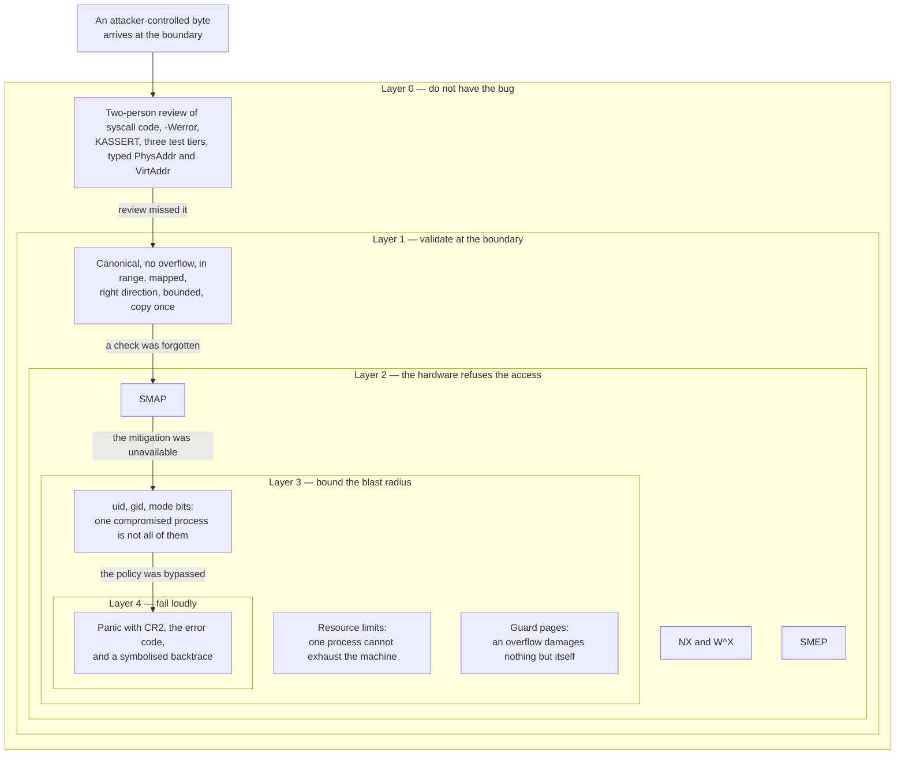

**Walking it, from the outside in.**

- **`L0`** is the outermost layer and the only one that actually prevents anything. Code
  review, `-Werror`, `KASSERT`, the type-level separation of physical and virtual
  addresses from [[13 - Coding Standards]] — all of it is cheaper than every layer inside
  it. The reason the diagram puts it outside is that a bug that never exists needs no
  mitigation.
- **`L1`** assumes review failed. It is the syscall boundary of §3.6.
- **`L2`** assumes validation was forgotten. NX, SMEP and SMAP are inside L1 because they
  only matter when L1 has a hole; they do nothing on the correct path except cost a
  `stac`/`clac` pair.
- **`L3`** assumes the hardware mitigation was absent or bypassed. Credentials and limits
  do not stop the compromise — they bound what it reaches. A compromise of a process
  running as an unprivileged uid, inside its resource limits, with a guard page under its
  stack, is a much smaller event than the same compromise as root.
- **`L4`** assumes everything failed. The last defence is being *noisy*: a panic that
  prints `CR2`, the page-fault error code, and a backtrace is an incident report. A silent
  reboot is not.

**Walking the arrows.** Each is labelled with the failure of the layer it leaves. Read the
chain as a sentence: *review missed it, so a check was forgotten, so the mitigation was
unavailable, so the policy was bypassed, so at least the machine screamed.* Every
production kernel exploit is that sentence with some of the clauses removed. The job of
Phase 15 is to make removing clauses expensive.

---

## 4. The data structures

Three structures carry almost all of the security state, and one hardware layout — the
page-table entry — carries the rest.

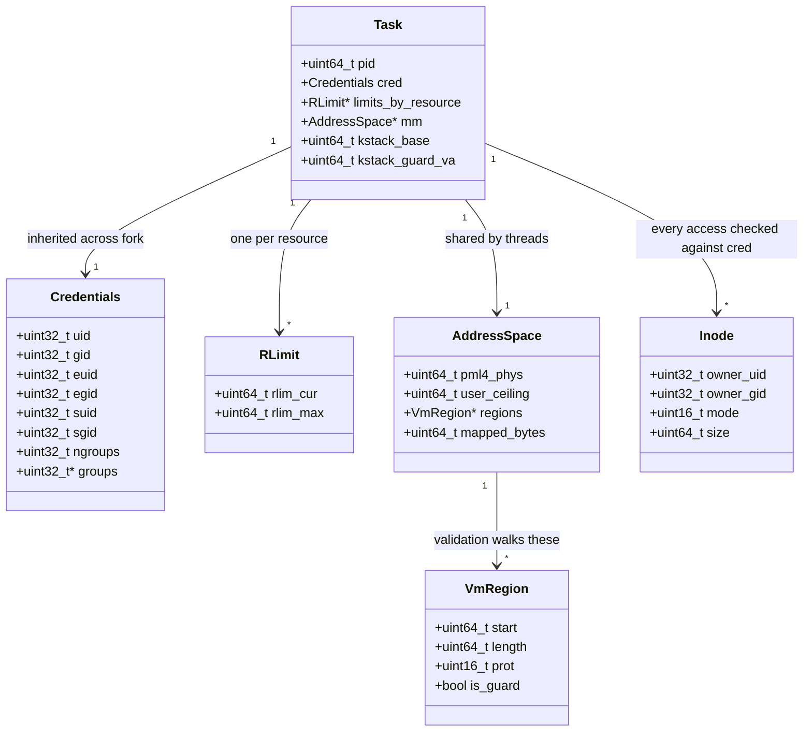

**Walking the model.**

- **`Credentials`** is one struct, embedded in `Task`, holding six identity fields and the
  supplementary group list. It is one struct on purpose: a credential change must be
  atomic with respect to a permission check, and a single struct assigned as a unit is the
  simplest way to guarantee that. The `suid`/`sgid` *saved-set* fields exist so a
  `setuid` program can drop privilege temporarily and regain it — which it can only do if
  the old value was preserved somewhere.
- **`RLimit`** is a soft/hard pair. Soft is what is enforced; hard is the ceiling the
  process may raise the soft one to.
- **`Task`** owns the credentials, the limits, the address space, and — the fields that
  matter for §3.4 — the kernel stack base and the address of its guard page. Recording the
  guard page's virtual address in the task lets the double-fault handler answer the
  question "was this a stack overflow?" by comparing `CR2` against it, which turns a
  generic panic into a specific one.
- **`AddressSpace`** carries `user_ceiling` as a *field*, not a compile-time constant. It
  is `0x0000800000000000` in practice, but naming it in the structure is what makes the
  validation code read like the check it is performing. `mapped_bytes` is the running
  total that `RLIMIT_AS` is compared against.
- **`VmRegion`** is what pointer validation actually walks: a sorted list of mapped
  ranges with their protections. `is_guard` marks a region that exists solely to be
  absent.
- **`Inode`** carries the file's side of the permission check. Only three fields matter
  for security, and they must come from the on-disk filesystem — which means a hostile
  disk image can claim any owner it likes, and a mount of untrusted media needs the
  `nosuid` treatment.

### 4.1 The page-table entry, bit by bit

This is the hardware layout that the whole of §3.2 and §3.3 manipulates.

| Bit(s) | Name | Meaning |
|---|---|---|
| 0 | `P` | Present. Clear on a guard page and on the first 4 MiB of user space |
| 1 | `R/W` | Writable |
| 2 | `U/S` | User-accessible. **This bit alone separates ring 3 from ring 0 memory** |
| 3 | `PWT` | Page-level write-through |
| 4 | `PCD` | Page-level cache disable |
| 5 | `A` | Accessed — set by the CPU, cleared by software |
| 6 | `D` | Dirty — set by the CPU on a write |
| 7 | `PAT` / `PS` | Page attribute table; at higher levels, page size |
| 8 | `G` | Global — the entry survives a `CR3` reload |
| 9–11 | available | Software use. Where a COW marker lives |
| 12–51 | frame address | The physical frame this entry points at |
| 52–58 | available | Software use |
| 59–62 | protection key | Only if `CR4.PKE`; unused in this design |
| 63 | `XD` / `NX` | **No-execute. Meaningless — and reserved — unless `EFER.NXE` is set** |

Three combination rules govern how the four levels of the walk are merged, and every one
of them is exploitable if misremembered:

| Property | Combined how | Consequence |
|---|---|---|
| `U/S` | **AND** across all four levels | Clearing `U/S` on one PML4 entry protects an entire 512 GiB region |
| `XD` | **OR** across all four levels | Setting `XD` on one high-level entry makes a whole region non-executable in one write |
| `R/W` | **AND** across all four levels (when `CR0.WP` is set) | A read-only PDE makes everything beneath it read-only regardless of the PTEs |

### 4.2 Page permission combinations, and which are legal

The W^X policy is exactly the statement that two rows of this table never appear.

| `P` | `R/W` | `U/S` | `XD` | Meaning | Used for | Legal? |
|---|---|---|---|---|---|---|
| 0 | – | – | – | Not present; every access faults | guard pages, the first 4 MiB of user space, unallocated VA | yes |
| 1 | 0 | 0 | 0 | kernel, read-only, executable | kernel `.text` | yes — the only executable kernel mapping |
| 1 | 0 | 0 | 1 | kernel, read-only, no execute | `.rodata`, the syscall table | yes |
| 1 | 1 | 0 | 1 | kernel, read/write, no execute | `.data`, `.bss`, heap, HHDM, per-CPU | yes |
| 1 | 1 | 0 | 0 | kernel, read/write **and executable** | nothing, ever | **no — this is the W^X violation** |
| 1 | 0 | 1 | 0 | user, read-only, executable | user `.text` | yes |
| 1 | 0 | 1 | 1 | user, read-only, no execute | user `.rodata`, COW pages before the first write | yes |
| 1 | 1 | 1 | 1 | user, read/write, no execute | user `.data`, heap, stack | yes |
| 1 | 1 | 1 | 0 | user, read/write **and executable** | nothing, ever | **no — this is the W^X violation** |

The in-kernel test for [[Stage 15.1 - NX and W^X]] is therefore mechanical: walk every
page table in the system, and assert that no entry has `R/W` set and `XD` clear. It runs
in a few milliseconds and it is the only proof that the policy actually holds — including
across the HHDM, which is where a manual review will not look.

### 4.3 The control bits, and who sets them

| Register | Bit | Name | Set in | Effect if left clear |
|---|---|---|---|---|
| `CR0` | 16 | `WP` | [[Stage 15.1 - NX and W^X]] | Ring 0 may write read-only pages. W^X on `.text` is silently void |
| `CR4` | 20 | `SMEP` | [[Stage 15.2 - SMEP and SMAP]] | ret2usr works |
| `CR4` | 21 | `SMAP` | [[Stage 15.2 - SMEP and SMAP]] | Every missing pointer validation is silent |
| `CR4` | 11 | `UMIP` | [[Stage 15.2 - SMEP and SMAP]] | `sgdt`/`sidt`/`sldt`/`smsw`/`str` leak kernel addresses to ring 3 |
| `IA32_EFER` (`0xC0000080`) | 11 | `NXE` | [[Stage 15.1 - NX and W^X]] | PTE bit 63 is reserved; setting it faults |
| `IA32_EFER` | 0 | `SCE` | Phase 6 | `syscall`/`sysret` raise `#UD` |
| `IA32_FMASK` (`0xC0000084`) | 9, 18 | mask `IF`, `AC` | Phase 6, tightened in 15.2 | Syscalls run with interrupts on and SMAP disabled |
| `RFLAGS` | 18 | `AC` | `stac` / `clac` only | — this is the escape hatch itself |

`CPUID` availability must be checked before setting anything in `CR4`: SMEP is
`CPUID.(EAX=07H,ECX=0):EBX` bit 7, SMAP is the same leaf's `EBX` bit 20, UMIP is that
leaf's `ECX` bit 2, and NX is `CPUID.80000001H:EDX` bit 20. Setting an unsupported `CR4`
bit raises `#GP`, which on a machine without an IDT is a reset.

---

## 5. The flows

### 5.1 A validated `write()`, end to end

This is the correct path — what every syscall looks like after Stage 15.5.

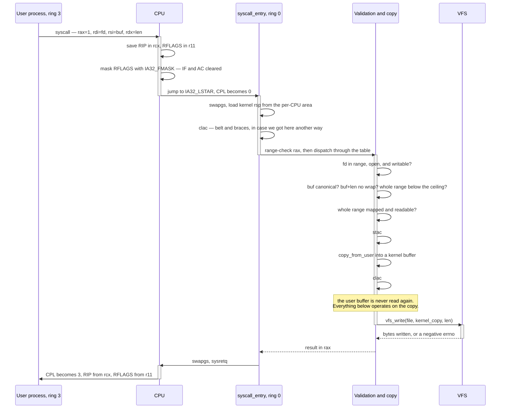

**Walking it.**

Control moves right and privilege changes exactly twice: at `CPU->>ENT` (ring 3 to
ring 0) and at `CPU->>U` (back). Everything between those two arrows runs with full
authority on data the attacker chose.

The two `swapgs` calls bracket the whole thing, because the per-CPU area is only
reachable between them. The `clac` in the entry stub is redundant on this path —
`IA32_FMASK` already cleared `AC` — and it is there anyway, because the *interrupt* path
shares the same discipline and does not get the FMASK guarantee.

The validation block is four questions asked in the order §3.6 established, and note
that the `fd` check comes first: it is the cheapest and it fails most often in practice.
The `stac`/`copy`/`clac` triple is three consecutive operations with nothing between
them. The `Note over VAL` is the TOCTOU rule, and it is the sentence to memorise from
this entire document.

`sysretq` restores `RIP` from `rcx` and `RFLAGS` from `r11`, which is why the calling
convention uses `r10` for the fourth argument rather than `rcx` — `syscall` has already
overwritten `rcx` with the return address before any kernel code runs.

### 5.2 A privilege escalation attempt, failing at every layer

Same attacker, six escalating attempts, each defeated by a different mechanism.

```mermaid
sequenceDiagram
    participant A as Attacker, ring 3
    participant K as Kernel
    participant H as CPU hardware checks

    A->>K: 1. write(fd, 0xFFFFFFFF80000000, 8)
    K-->>A: -EFAULT — pointer is above the user ceiling
    Note over K: Layer 1 — boundary validation, the range check

    A->>K: 2. write(fd, valid_ptr, 0xFFFFFFFFFFFFFFF0)
    K-->>A: -EINVAL — ptr + len wraps around 2^64
    Note over K: Layer 1 — and the reason overflow is checked before range

    A->>K: 3. exploit a genuinely missing check in a rarely-used ioctl
    K->>H: read from a USER page at CPL 0, with AC clear
    H-->>K: page fault, supervisor mode, protection violation
    Note over H: Layer 2 — SMAP. The bug exists; the exploit does not.

    A->>K: 4. corrupt a saved return address to point at user shellcode
    K->>H: instruction fetch at CPL 0 from a page with the USER bit set
    H-->>K: page fault, error code bit 4 set — this was a fetch
    Note over H: Layer 2 — SMEP. ret2usr is over.

    A->>K: 5. spray the same shellcode, jump to it through its HHDM alias
    K->>H: instruction fetch from a kernel mapping with XD set
    H-->>K: page fault
    Note over H: Layer 2 — NX on the direct map. This is ret2dir.

    A->>K: 6. recurse deeply inside a syscall to smash the kernel stack
    K->>H: push past the end of the stack allocation
    H-->>K: page fault on the guard page; the fault frame push faults too
    H->>H: escalate to double fault, switch to IST1
    Note over H: Layer 3 — guard page plus IST

    K->>K: panic: CR2, error code, symbolised backtrace, halt
    Note over K: Layer 4 — loud. An incident, not a mystery reboot.
```

**Walking it.**

Attempts 1 and 2 are stopped by software the team wrote, and they are the attempts that
*should* be stopped there — they are exactly what the audit checklist enumerates. They
cost nothing at runtime beyond a comparison.

Attempt 3 is the important one. It concedes that the audit missed something — because
audits do — and shows SMAP catching the consequence. Note the phrasing in the note: the
bug still exists and still needs fixing. What changed is that the attacker got a page
fault instead of a kernel memory dump.

Attempts 4 and 5 are the same technique twice, and 5 is why §3.2 spends a paragraph on
the HHDM. An attacker who knows SMEP is on does not give up; they look for a *kernel*
mapping of the same bytes, and the direct map is one by construction. NX on the HHDM is
what closes it.

Attempt 6 changes target from confidentiality to integrity, and it is defeated by
structure rather than by a control bit: an absent page plus a known-good stack.

The final message is the one that makes all of the above operationally useful. A
mitigation that fires silently teaches nobody anything. The panic is the deliverable.

---

## 6. Why it is shaped this way

| Decision | Option taken | Rejected | What breaks under the rejected option | Reference |
|---|---|---|---|---|
| Where validation lives | One `copy_from_user` / `copy_to_user` pair, called from everywhere | Each syscall dereferences user pointers itself | The audit surface goes from one function to every syscall. It stops being finishable | [[13 - Coding Standards]] rule 5 |
| SMAP timing | Enabled in 15.2, *before* the audit in 15.5 | Enabled after the audit | You lose the fault-based oracle that finds the bugs the audit will otherwise miss | [[Phase 15 - Overview]] |
| Executable kernel mappings | Exactly one: `.text` | Leave the HHDM executable "because it is kernel memory" | ret2dir: every writable user page gains an executable kernel alias, and W^X is void | §3.2 |
| `.text` protection | Read-only **and** `CR0.WP` set | Read-only PTEs alone | With `WP` clear, ring 0 ignores the read-only bit entirely. Silent, untested, worthless | §3.2 |
| `AC` handling | `clac` in every ring-0 entry stub, plus `AC` in `IA32_FMASK` | `IA32_FMASK` alone | Interrupt gates do not clear `AC`. A user sets `AC`, triggers a fault, and the handler runs with SMAP off | §3.1 |
| Guard page cost | One absent PTE per kernel stack | Detect overflow with a canary word | A canary is checked at function return, so it detects the overflow *after* the corruption. A guard page faults at the instruction that does it | §3.4 |
| Double fault stack | `#DF` on IST1, mandatory | `#DF` on the current stack | A stack-overflow page fault escalates to `#DF`, whose delivery also faults, and the machine triple-faults with no message | project fact |
| Permission triads | First matching triad wins | OR the applicable triads | More permissive than Unix, in a way no test written by the same author will catch | §3.7 |
| `RLIMIT_NPROC` scope | Per uid | Per process | A fork *tree* rather than a chain defeats a per-process count instantly | §3.8 |
| KASLR entropy | ~10 bits, honestly stated | Claim it as a primary defence | One leaked pointer removes all of it. Overstating it leads to under-investing in the leaks | §3.5 |
| Syscall arg 4 | `r10` | `rcx` | `syscall` overwrites `rcx` with the return address before any kernel code runs | [[06 - Architecture Overview]] |

### 6.1 Why Phase 15 and not earlier — and what it costs to retrofit

The brief question behind this whole phase is: if these mitigations are so cheap, why are
they last? The answers differ per feature, and two of them are honest admissions.

| Feature | Why it waits | Retrofit cost, and what makes it cheap |
|---|---|---|
| **NX / W^X** | Needs per-section permissions, which need the linker script to 4 KiB-align every section — which [[Stage 0.4 - The Linker Script and Higher-Half Layout]] already did, in Phase 0, for exactly this reason | **Low**, *because the shape was right early.* If `map_page` had no permission argument, every call site in `mm/`, `fs/` and the drivers would need touching. It has one from [[Stage 4.3 - Enabling Paging]] |
| **SMEP** | Nothing depends on it and nothing conflicts with it. It could genuinely have been Phase 4 | **Trivial** — one `CR4` bit. It is here only because it belongs next to SMAP |
| **SMAP** | Requires `copy_from_user` to be the *only* path to user memory, which requires syscalls to exist and to have been written with that discipline | **Medium.** The cost is not the `CR4` bit; it is fixing every place that dereferenced a user pointer directly. Turning it on is how you find them, which is why it precedes the audit |
| **Guard pages** | **Nothing.** This should have been [[Stage 5.1 - Tasks, Context, and the Stack]], when kernel stacks were first allocated | **Low** — one allocator change plus an IST entry. But ten phases of silent stack-overflow corruption were debugged the hard way in the meantime. This is the one to move earlier if you rerun the project |
| **KASLR** | Makes every panic address meaningless and every `gdb` session need a rebase script. Doing it early taxes two years of debugging | **Medium**, and it is the tooling that costs, not the slide |
| **Users and permissions** | Credentials need `fork`/`exec` to inherit and a real filesystem with owners to check against — [[Phase 13 - Overview|Phase 13]] and [[Phase 10 - Overview|Phase 10]] | **High.** Every VFS entry point gains a check, and the one you miss is the vulnerability. Cheap only if the VFS funnels operations through few enough functions |
| **Resource limits** | There must be a `fork` to limit and an fd table to bound | **Medium.** The check must go *before* the allocation at every site, and finding every site is the work |

The pattern across the table is the thesis of the phase: **hardening is cheap to add late
if the structure was right early, and ruinous if it was not.** Permissions as a parameter
on `map_page`. Sections aligned in the linker script. A single `copy_from_user`
chokepoint. Credentials in one struct. None of those are security features; all of them
are what make security features a week of work instead of a rewrite.

### 6.2 What this system deliberately does not defend against

An honest limitations list is part of the `v1.0.0` release ([[11 - Release and Deployment]]).

- **Meltdown and Spectre.** There is no page-table isolation (KPTI), so on a vulnerable
  CPU a user process can speculatively read the HHDM — which maps all of physical RAM.
  This is a complete break of kernel/user isolation on affected hardware, and mitigating
  it properly means two page tables per process and a trampoline. Out of scope for v1.
- **Control-flow integrity.** No CFI, no shadow stacks, no `CR4.CET`. A ROP chain against
  a kernel bug is unimpeded once the attacker knows the base.
- **Stack canaries in the kernel.** `-fstack-protector-strong` on x86_64 reads the canary
  from `%fs:0x28` by default, and `%fs` is not set up in this kernel — `%gs` is the
  per-CPU base. Using it needs `-mstack-protector-guard=global` or a per-CPU canary
  through `%gs`. Verify the available GCC options for the pinned 14.2.0 before relying on
  either.
- **Userspace ASLR.** KASLR randomises the *kernel*. User programs load at a fixed
  `0x400000` unless the ELF loader is taught to randomise PIE binaries and the stack and
  `mmap` bases. That is a Phase 7 change, not a Phase 15 one.
- **Capabilities, seccomp, namespaces, MAC.** The privilege model is uid 0 or not uid 0.
  There is no way to grant one privilege without granting all of them.
- **Untrusted filesystem images.** The FAT32 and ext2 parsers are not fuzzed. Mounting a
  hostile disk image should be assumed to be a kernel compromise.
- **Side channels of every kind** — timing, cache, TLB. Not modelled, not measured.

Publishing this list is not a weakness. A hardened system with an unstated threat model
invites people to assume it defends against things it does not.

---

## 7. How this grows across the phases

Security is the one property in this atlas that does not arrive with its own phase and
then sit still. Every phase *widens* the attack surface, and only the last one narrows it.

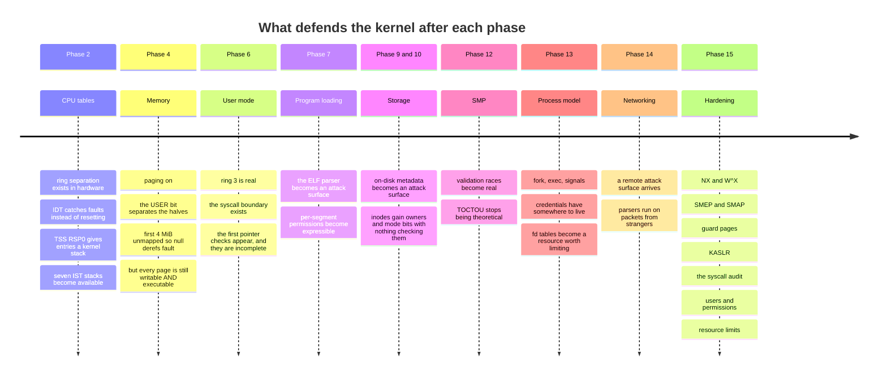

**Walking it.**

- **Phase 2** gives the hardware wall. Rings, an IDT, a kernel stack for entries, and the
  IST stacks that Stage 15.3 will need. Nothing is *checked* yet, but the mechanism for
  checking exists.
- **Phase 4** gives the `USER` bit, which is the single most important security primitive
  in the system — it is what makes "kernel memory" a category the CPU understands. It also
  ships a kernel in which every page is both writable and executable, which is fine only
  because there is no user code yet to exploit it.
- **Phase 6** is the inflection point: the first time attacker-controlled data reaches
  ring 0. From here the system has a threat model. The validation written here will be
  incomplete, and knowing that in advance is what makes Stage 15.5 a scheduled audit
  rather than an emergency.
- **Phase 7** and **Phases 9–10** widen the surface without adding defences. Parsers are
  boundary code, and the inodes gain owner and mode fields that nothing yet consults.
- **Phase 12** is the quiet one. Before SMP, "another thread changed the buffer between
  the check and the use" required preemption to land in exactly the wrong place. After
  SMP, another core is *genuinely* writing that memory while your syscall runs. Every
  TOCTOU bug written in Phases 6–11 becomes reachable here.
- **Phase 13** finally gives credentials a home, because a credential that cannot be
  inherited across `fork` or changed by `exec` is not a credential.
- **Phase 14** is the largest single widening in the project: the attacker no longer needs
  an account.
- **Phase 15** is the only narrowing.

**What is deliberately missing early, and why it is acceptable.** For Phases 0 through 5
there is no user code, so there is no attacker — the threat model is empty and mitigations
would defend nothing. From Phase 6 to Phase 14 the system is genuinely insecure, and that
is a deliberate, time-boxed choice: it runs only in QEMU, on the developers' machines,
with no network exposure until Phase 14 and no real users at all. The moment that ceases
to be true is the moment Phase 15 must have happened, which is why
[[15 - Roadmap and Milestones]] ties it to `v1.0.0` and not to a date.

---

## 8. Failure modes

Symptom first. Every one of these has been met by someone building exactly this.

> [!warning] The kernel triple-faults the instant the new page tables are loaded in Stage 15.1
> `EFER.NXE` was not set before PTEs were written with bit 63. With `NXE` clear, bit 63 is
> **reserved**, and every access to such a page raises a page fault with the reserved-bit
> flag (error code bit 3) set — including the fetch of the next instruction. **Check:**
> read `IA32_EFER` and confirm bit 11 before writing any NX mapping.

> [!warning] W^X "works", but writing to `.text` in a test does not fault
> `CR0.WP` is clear, so ring 0 ignores the read-only bit. The PTEs are correct and
> completely ineffective. This produces no symptom at all until someone relies on it.
> **Check:** read `CR0` and assert bit 16. Then write the test that expects a panic.

> [!warning] The W^X audit passes, but the exploit still works
> The audit walked the kernel image's page tables and not the HHDM. Every physical frame
> — including every writable user page — is aliased at `0xFFFF800000000000 + phys`, and if
> that mapping is executable, W^X is void. **Check:** the audit must walk *every* page
> table entry in the address space, not a list of known regions.

> [!warning] The kernel boots fine, then page-faults at CPL 0 on the first syscall after enabling SMAP
> Working as designed. Some code path is reading user memory without `stac`. `CR2` is a
> user address, the error code shows a supervisor-mode protection violation, and the
> faulting `RIP` is the bug. **This is not a regression — it is the feature.** Fix the
> call site to use `copy_from_user` and repeat until it boots.

> [!warning] Everything passes in QEMU, and SMEP/SMAP were never actually on
> The default `qemu64` CPU model does not expose them, your `CPUID` check correctly found
> them missing, and your code correctly skipped enabling them. **Check:** run with
> `-cpu max` (or `+smep,+smap`) and make the in-kernel test *assert the bits are set*
> rather than logging that they were unavailable.

> [!warning] A user program can still get the kernel to read its memory, with SMAP on
> The user set `RFLAGS.AC` with `popfq` and then triggered an exception. Interrupt gates
> do **not** clear `AC` — only `IA32_FMASK` on the `syscall` path does. **Check:** every
> ring-0 entry stub executes `clac`, including the exception and IRQ stubs.

> [!warning] Stack overflow reboots the machine silently instead of panicking
> The guard page is working; the double fault has no IST. The page fault's frame push
> faults, escalating to `#DF`, whose delivery faults on the same guard page, escalating to
> a triple fault. **Check:** the IDT entry for vector 8 names an IST index, and that IST
> stack is mapped and large enough for a panic with a backtrace.

> [!warning] Stack overflow panics, but the backtrace is garbage
> The IST stack is too small, or the panic handler allocates. A double-fault handler must
> assume the heap and the scheduler are unusable, print from a static buffer, and halt.

> [!warning] After enabling KASLR, every panic address is meaningless and `gdb` is useless
> Predicted, in §3.5, and it is not a bug — it is the cost. **Fix:** print the slide as
> the first line of boot output, and ship a script that rebases the symbol file by it.
> Without both, you have traded away your debugging for ten bits of entropy.

> [!warning] KASLR boots nine times out of ten
> Either the randomly chosen base lets the image cross the top of the 2 GiB window that
> `-mcmodel=kernel` permits, or the slide collides with a fixed mapping. **Check:** the
> slide computation must bound `base + image_size` inside the window, and it must be
> deterministic under a fixed seed so the failure is reproducible.

> [!warning] A non-root user can read a `0600` file owned by root
> Either the check lives in libc or the shell rather than in the kernel's `open`, or it
> tests `uid` instead of `euid`, or one VFS entry point does not call the check at all.
> **Check:** the tier-3 test must attempt the read through a syscall made directly, not
> through a shell that might have refused it first.

> [!warning] A file's owner cannot read it, and this is correct
> Mode `0057` gives the owner nothing and everyone else everything. Only the first
> matching triad is consulted. If your implementation grants access here, it is more
> permissive than Unix — a real bug, hiding behind a surprising rule.

> [!warning] The fork bomb still takes the machine down
> `RLIMIT_NPROC` is counted per process instead of per uid, or the limit is checked after
> the task is allocated rather than before. **Check:** the count is keyed on `uid`, and the
> check precedes every allocation on the path.

> [!warning] Boots and hardens perfectly in QEMU, faults immediately on the test laptop
> Real firmware leaves the machine in a state OVMF does not: different memory map
> regions, a framebuffer in a different format, and a CPU that genuinely supports SMEP,
> SMAP, UMIP and NX — so all four mitigations execute for the first time on metal.
> [[Stage 15.8 - Real Hardware Bring-Up]] is where this is confronted deliberately, and
> [[15 - Roadmap and Milestones]] is why it should have been confronted from M1.

---

## 9. Masterclass notes

> [!question] Discussion prompts
> 1. SMAP is described in this vault as "the most valuable feature in Phase 15, and not
>    primarily for security". Reconstruct that argument from first principles, then argue
>    the opposite case: what would be lost by shipping SMAP *without* completing the
>    Stage 15.5 audit, and what would be lost by completing the audit without SMAP?
> 2. `RFLAGS.AC` can be set from ring 3 with `popfq`, but `stac` and `clac` raise `#UD`
>    outside ring 0. Explain why that asymmetry is not a design flaw, then use it to
>    derive — without looking — which entry paths need an explicit `clac`.
> 3. The HHDM maps all physical RAM, including every user page. Given SMEP and W^X are
>    both correctly implemented, construct the ret2dir attack step by step, and then
>    identify the single PTE bit that stops it. What does this tell you about auditing
>    mitigations by *region* rather than by *entry*?
> 4. KASLR provides about 10 bits of entropy here, and one leaked pointer removes all of
>    it. Given that, argue for or against implementing it at all in v1 — and if you argue
>    for, say what else must be funded alongside it for it to be net positive.
> 5. Six of the seven Phase 15 stages could technically have been done much earlier. Pick
>    the two whose *placement* you would change if you rebuilt the project, defend the
>    choice in terms of debugging hours rather than security, and say what structural
>    decision in an earlier phase makes the retrofit cheap or expensive.

**You understand this when you can:**

- [ ] Draw the §2 attack-surface diagram from memory, and add a seventh source of
      attacker-controlled bytes that is not on it
- [ ] Name the three mechanisms by which ring 3 causes ring 0 code to run, and say which
      of them switches the stack automatically and which does not
- [ ] Recite the nine-item syscall validation checklist, in the order the checks must be
      applied, and explain why overflow must precede range
- [ ] Explain why `CR0.WP` matters, and describe the exact test that proves it is set
- [ ] Explain what makes a stack-overflow page fault escalate to a double fault, and why
      that requires an IST entry rather than being an implementation preference
- [ ] State KASLR's entropy in bits, where the number comes from, and the single event
      that reduces it to zero
- [ ] Given mode `0057` and a process owned by the file's owner, state the access decision
      and justify it
- [ ] Distinguish `uid` from `euid` from `suid`, and say which one every permission check
      uses
- [ ] Name three things this system deliberately does not defend against

**Board plan** — the order to draw this, in eight steps:

1. Two boxes and a line: **ring 3** and **ring 0**. Write "the wall" on the line. Ask what
   the wall is made of. Let someone say "software"; correct it to "one bit in a page-table
   entry, plus three doors".
2. Draw the three doors — `syscall`, interrupt, exception — and put attacker-controlled
   register names above each. Emphasise that a user can *cause* an exception on purpose.
3. Under ring 0, draw the syscall validation chain as nine boxes in a vertical line.
   Circle "overflow before range" and "copy once". Do not explain them yet; ask what
   happens if the order is swapped.
4. Now the address space, drawn tall: kernel half on top, user half below. Colour writable
   regions one way and executable regions another. Show that they never overlap — then
   draw the HHDM and let the room notice it aliases everything.
5. Add `CR4` in the corner with two bits: SMEP and SMAP. Draw a ret2usr arrow from ring 0
   into a user page and cross it out with SMEP. Draw a confused-deputy arrow and cross it
   out with SMAP. Then draw the `stac`/`clac` window and explain why it is three
   instructions wide.
6. Draw a kernel stack with a guard page under it. Trace the overflow → page fault →
   double fault → IST1 → panic chain. This is the step the room will remember.
7. Write "KASLR: 10 bits" and next to it "one leaked pointer = 0 bits". Spend two minutes
   on the debugging cost and move on. Do not oversell it.
8. Finally, redraw everything as the concentric layers of §3.9, outermost first, and
   annotate each boundary with the failure of the layer outside it. End on layer 4:
   **fail loudly**.

**Time budget:** 55 minutes. Steps 1–3 in fifteen. Step 4 in ten. Step 5 in fifteen — it
generates the most questions and is worth the overrun. Step 6 in eight. Steps 7–8 in
seven. Do not let the Spectre digression start; point at §6.2 and move on.

---

## 10. Related

- [[06 - Architecture Overview]] — the memory layout, the kernel initialisation order, and
  the syscall interface this document defends
- [[01 - What Happens at Power-On]] — where the machine state this all sits on comes from
- [[Phase 15 - Overview]] — the stage list, the real-hardware bring-up table, and the
  release checklist
- [[13 - Coding Standards]] — rule 5 is the one-paragraph version of §3.6
- [[05 - Gap Analysis (v1 to Product)]] — gaps C18, C19 and C20 are this phase
- [[15 - Roadmap and Milestones]] — milestone M8, and why hardening is partially cuttable
  but NX and W^X are not
- [[14 - Debugging Playbook]] — reading a page-fault error code and `CR2`
- [[09 - Testing Strategy]] — the three tiers the mitigation tests live in
- [[11 - Release and Deployment]] — where the known-limitations list from §6.2 is published
- [[Stage 15.1 - NX and W^X]] · [[Stage 15.2 - SMEP and SMAP]] ·
  [[Stage 15.3 - Guard Pages and Stack Protection]] · [[Stage 15.4 - KASLR]] ·
  [[Stage 15.5 - Auditing the Syscall Boundary]] ·
  [[Stage 15.6 - Users, Groups, and Permissions]] · [[Stage 15.7 - Resource Limits]] ·
  [[Stage 15.8 - Real Hardware Bring-Up]] · [[Stage 15.9 - The Release Checklist]]
