# 16 — The Build and Artefact Pipeline

> [!abstract] What this document covers
> Everything between a `.cpp` file on your laptop and a machine that is executing
> your instructions. Three toolchains, one container, two artefacts. This is the
> **cross-cutting** view: the pipeline touches every phase, every subsystem, and
> every test tier, and almost none of it is code that runs on the target. The
> boot chain itself — what the firmware does once it has the artefact — is
> [[02 - The Boot Chain]]. This document stops at the moment the ISO exists.

**Zoom level:** Cross-cutting
**Built by:** [[Stage 0.4 - The Linker Script and Higher-Half Layout]], [[Stage 0.5 - Building a Bootable Image]], [[Stage 0.8 - The Build System]]
**Prerequisites:** [[06 - Architecture Overview]] · [[01 - What Happens at Power-On]] · [[02 - The Boot Chain]]
**Masterclass session:** 1 (see [[19 - The Eight-Hour Masterclass]])

---

## 1. The one-sentence version

**The build pipeline is the machinery that turns text you typed into a byte
pattern a chip will execute, and it is machinery you have to build yourself,
because every convenience a normal compiler gives you assumes an operating
system that does not exist yet.**

When you compile a normal program, an enormous amount is done for you and you
never see it. A startup object called `crt0` runs before `main`. A standard
library provides `printf` and `malloc`. A default linker script decides where
your code lands. A dynamic loader patches addresses at launch. A kernel maps
your pages. Every one of those is missing here — we are *writing* the thing that
would provide them. So the pipeline has to state, explicitly and in files under
version control, every fact the toolchain would otherwise have assumed: which
compiler, which flags, which address, which sections, which segments, which
permissions, which filesystem, which partition table, which firmware handoff.
That explicitness is the whole subject of this document, and the reason a hobby
OS spends its entire first phase on the build rather than on the kernel.

### Vocabulary, defined once

Nothing below parses without these. Read them even if some are familiar.

- **Translation unit** — one `.cpp` file plus everything it `#include`s, after the
  preprocessor has finished. The compiler's unit of work.
- **Object file (`.o`)** — the compiled form of one translation unit. It contains
  machine code, but with *holes*: every reference to a function or global defined
  elsewhere is a placeholder plus an instruction saying "patch this later".
- **Linker** — the program that takes many object files, resolves every
  placeholder to a final address, and writes one output file.
- **ELF (Executable and Linkable Format)** — the container format for object files
  and for `kernel.elf` itself. Two independent views of the same bytes: sections
  (for tools) and segments (for loaders). §3.5 is entirely about the difference.
- **Section** — a named region of an object or executable: `.text` is code,
  `.rodata` is constants, `.data` is initialised globals, `.bss` is
  zero-initialised globals.
- **Segment** — a run of bytes a loader must place at a virtual address with a
  given set of permissions. A bootloader reads segments and ignores sections.
- **Freestanding** — a C/C++ mode with no standard library and no OS underneath.
  You get the language, not `printf`. See [[ADR-0007 - Freestanding C++20 as the Kernel Language]].
- **Cross-compiler** — a compiler that runs on one machine and produces code for a
  different target. Ours runs on Linux x86-64 and targets `x86_64-elf`: 64-bit
  x86, ELF output, **no operating system**.
- **Target triple** — the string naming that target. `x86_64-elf`. The `elf` in
  place of `linux-gnu` is what removes every OS assumption.
- **Artefact** — a file the build produces that someone or something consumes:
  `kernel.elf`, `os.iso`, `os.img`, `compile_commands.json`.
- **Container** — a packaged Linux userland (compilers, tools, versions) that runs
  identically on any host. Ours is a Docker image, pinned by content digest.
- **Reproducible build** — building the same commit twice produces byte-identical
  artefacts. It turns "works on my machine" into a falsifiable claim.

---

## 2. The picture

One diagram for the whole pipeline. Sources enter at the top left; a booting
machine leaves at the bottom right. The outer boxes are *where the work happens*,
which is at least as important as *what the work is*.

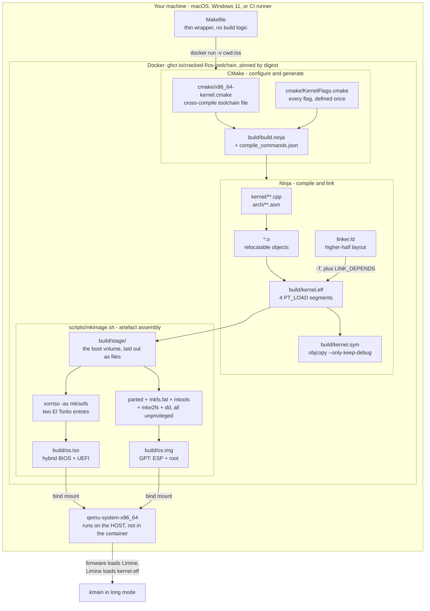

### Walking every box

**`Makefile`** is the outermost box and the only thing you actually type. It is a
*thin wrapper*: it provides the verbs (`make`, `make iso`, `make run`,
`make test`) and it owns the container plumbing. It contains no decision about
how anything is compiled. That rule is load-bearing — see §6 — because a flag
that lives in the `Makefile` applies when you type `make` and not when CI invokes
CMake directly, and the two silently diverge.

**The `docker run` arrow** is the single most important arrow in the diagram. It
carries `-v "$(CURDIR):/os"` (your working tree, bind-mounted into the container
at `/os`), `-v os-ccache:/ccache` (a persistent compiler cache), `-w /os`,
`-e CONTAINER=1`, and `-e SOURCE_DATE_EPOCH`. Everything inside the
`CONTAINER` box therefore sees your files and your edits live, but uses the
container's compilers, never your machine's. §3.1 opens this box.

**`CONFIGURE`** is CMake's first phase. It reads `cmake/x86_64-kernel.cmake`
before it probes any compiler — that file is what tells CMake it is
cross-compiling and which compiler to use — then reads
`cmake/KernelFlags.cmake`, and **generates** `build/build.ninja` plus
`build/compile_commands.json`. CMake builds nothing itself; it writes build files
for Ninja. §3.3 opens this box, including the one line that stops CMake failing
here outright.

**`COMPILE`** is Ninja executing the generated graph. Each `.cpp` becomes a `.o`;
`linker.ld` and all the `.o` files become `kernel.elf`; a `POST_BUILD` step runs
`objcopy --only-keep-debug` to produce `kernel.sym`. The `-T, plus LINK_DEPENDS`
label on the `linker.ld` arrow is not decoration: `-T` is how the script reaches
the linker, and `LINK_DEPENDS` is how CMake learns that editing the script must
force a relink. CMake cannot infer the second from the first ([[Stage 0.8 - The Build System]]).

**`IMAGE`** is `scripts/mkimage.sh`. It first builds `build/stage/` — a directory
tree that *is* the boot volume, file for file — and then wraps that tree twice,
once as an ISO and once as a partitioned disk. The two wrapping paths share the
staging step and nothing else. §3.6 opens both.

**`kernel.sym`** leaves the pipeline sideways. It is not part of any bootable
artefact; it is what `make gdb` loads and what [[Stage 1.7 - Symbolised Backtraces]]
uses to turn a raw address in a panic message into a file and line.

**`QEMU` sits outside the container box.** That placement is the whole of §3.1. The
container builds; the host runs. In CI the arrangement changes — QEMU runs
*inside* the container with `-display none` — and understanding why both are
correct is the point.

**The final arrow** hands off to [[02 - The Boot Chain]]: firmware finds Limine
inside the artefact, Limine finds `kernel.elf`, and `kmain` runs in 64-bit long
mode with paging already on. Everything this document builds exists to make that
one arrow possible.

> [!question] Before you read on
> The diagram shows `kernel.elf` entering `build/stage/` and being wrapped twice.
> Why is the ELF file copied *verbatim* onto the boot volume rather than being
> converted into some flat binary the firmware can load directly?

---

## 3. Zooming in

### 3.1 The container boundary

The team is two people on different operating systems, and CI is a third. Three
environments, one required behaviour: identical bytes out.

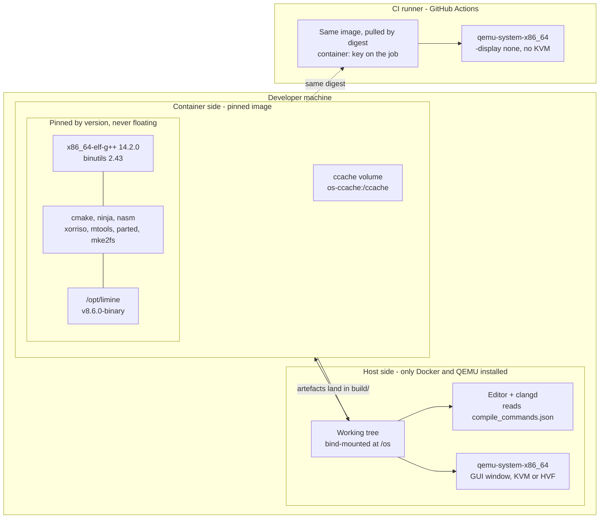

**`TREE`** is your checkout. It exists once, on the host filesystem, and is
bind-mounted into the container. Nothing is copied in or out; the container
writes `build/` straight into your working tree, which is why your editor sees
new artefacts instantly and why `make clean` on the host removes what the
container produced.

**`PINNED`** is the reason the container exists at all. `x86_64-elf-g++` 14.2.0
and binutils 2.43 are *built from source inside the image* at exactly those
versions; `nasm`, `cmake`, `ninja`, `xorriso`, `mtools`, `dosfstools`,
`e2fsprogs` and `parted` come from a pinned Ubuntu 24.04 base; Limine is cloned
at the `v8.6.0-binary` tag into `/opt/limine`. Different GCC versions make
different inlining and stack-layout decisions, so a race that never fires on one
machine fires reliably on the other — and a bug report you cannot reproduce costs
a day. [[ADR-0005 - Containerised Pinned Toolchain]] is the decision; the
Dockerfile is its implementation.

**`CCACHE`** is a named Docker volume, not a directory in your tree. It survives
`make clean` and container restarts, and it is keyed on the *content* of what is
compiled, so it never returns a stale object for changed input. It matters most
on Apple Silicon, where the image runs under `linux/amd64` emulation and every
build is slower ([[ADR-0006 - Apple Silicon Is Not a Boot Target]]).

**`EDITOR`** consumes `build/compile_commands.json` from the host side. This is
worth noticing: the compile database is produced by a cross-compiler that your
host does not have, and it is consumed by an editor that never runs the build.
It is the one artefact whose entire purpose is to cross the boundary in the other
direction.

**`HQEMU` is on the host, and `CIQEMU` is in the container.** Both are correct,
for reasons that do not overlap:

- **Graphics.** A GUI window needs a display server — Cocoa on macOS, the Windows
  compositor, X11 or Wayland on Linux. A container has none of these. On a Linux
  host you can forward an X11 socket and it works; on macOS and Windows the
  container is itself inside a Linux VM with no path to the host compositor. A
  rule that works on one developer's machine and not the other's is not a rule.
- **Acceleration.** KVM needs `/dev/kvm` passed into the container *and* a Linux
  host kernel. On macOS the accelerator is HVF, on Windows it is WHPX, and neither
  is reachable from inside the Docker VM. Without acceleration QEMU falls back to
  TCG — pure software emulation — which is perhaps an order of magnitude slower.
- **CI does not care about either.** No human is watching, so `-display none`
  removes the graphics problem entirely, and the runs are short enough that TCG is
  acceptable. Running QEMU inside the container in CI buys the same pinning
  guarantee for the *emulator version* that the rest of the image buys for the
  compiler.

**The `CONTAINER=1` detail.** The image itself sets `ENV CONTAINER=1`. The
`Makefile` checks that variable and, when it is set, drops the `docker run`
prefix entirely. Without it, every CI step — which already runs *inside* the
image — would try to launch a nested container and fail with
`docker: command not found`. One environment variable is what lets the same
`Makefile` be correct in both contexts, and it is what makes the claim "CI runs
the same verbs you do" literally true rather than approximately true.

> [!warning] The boundary is where drift hides
> The rule is: **all compilation inside, all interactive running outside.** The
> failure mode of breaking it is not an error, it is a slow divergence. Someone
> installs a cross-compiler on the host "just to check something quickly", the
> host GCC is 15.1, and for the next month one developer's builds subtly differ
> from CI's. [[10 - CI Pipeline]] pins the image by *digest* rather than by tag
> for exactly this reason: a tag can be moved, a digest cannot.

---

### 3.2 Three toolchains in one tree

A single `make` produces binaries for three different environments. Conflating
them is the classic mistake, and it is painful in both directions.

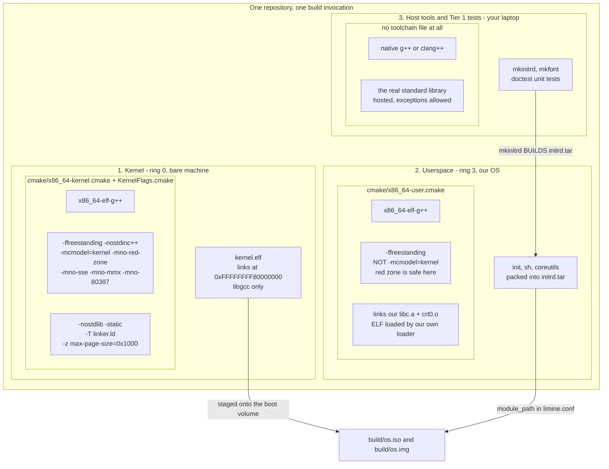

**Toolchain 1, the kernel.** `x86_64-elf-g++`, freestanding, no standard library
of any kind — not even libstdc++ headers, which is what `-nostdinc++` enforces.
The image is built with `--without-headers --disable-hosted-libstdcxx` and only
`all-gcc all-target-libgcc`, so there is genuinely nothing there to include. It
links against `libgcc` alone, for compiler helpers such as 128-bit division.
`-mcmodel=kernel` and the `0xFFFFFFFF80000000` link address are two halves of one
decision ([[Stage 0.4 - The Linker Script and Higher-Half Layout]]).

**Toolchain 2, userspace.** The *same compiler binary*, a different environment.
Still freestanding — our libc is not glibc — but it links `crt0.o` and `libc.a`
from our own tree, and it is emphatically **not** `-mcmodel=kernel`, because
user programs live at `0x0000000000400000` upward in the low half of the address
space, not in the top 2 GiB. The red zone is also safe in ring 3: when an
interrupt arrives while user code is running, the CPU switches to the kernel
stack named by the TSS ([[Stage 6.1 - The Task State Segment]]) rather than
pushing onto the user stack. Nothing writes behind a user leaf function's back.

**Toolchain 3, the host.** Native compiler, real standard library, hosted mode,
exceptions and `<vector>` allowed. Two kinds of thing live here: build-time tools
such as `mkinitrd` (which *creates* `initrd.tar` from the userspace binaries) and
`mkfont`, and the Tier 1 unit tests from [[09 - Testing Strategy]] that exercise
pure kernel logic — allocator bookkeeping, path parsing — on your laptop in
seconds. These are built via a superbuild so the cross-toolchain never
contaminates them.

**The arrows between them.** Note the direction of the bottom arrow: a *host*
tool builds an artefact out of *userspace* binaries, which is then loaded by the
*kernel*. All three toolchains meet inside one `initrd.tar`. That is why they
have to coexist in one build rather than living in three repositories.

**What conflating them looks like.** Both directions produce confusing failures:

| Mistake | Symptom | Why it is confusing |
|---|---|---|
| Host test compiled with kernel flags | `cannot execute binary file` | The build succeeded; the file is a valid ELF for a machine with no OS |
| Kernel TU picks up host `<string.h>` | Link error for `memcpy`, or worse, it links | If it links, it linked against host libc — a very confusing afternoon |
| Userspace built with `-mcmodel=kernel` | Relocation truncated, or a program that faults at load | The code assumes addresses in the top 2 GiB that user space never has |
| A new kernel file missing `-mno-red-zone` | Random corruption, weeks later, elsewhere | Nothing fails at build time; see §3.4 |

The last row is the reason the flags live in exactly one file and the reason CI
greps the compile database rather than trusting review ([[Stage 0.9 - CI From Day One]]).

---

### 3.3 CMake: configure, generate, build

CMake does not build anything. It is a *generator*: it reads your
`CMakeLists.txt`, works out the whole dependency graph, and writes build files
for Ninja, which then does the work. Two phases, and knowing which one you are in
tells you which file to edit when something is wrong.

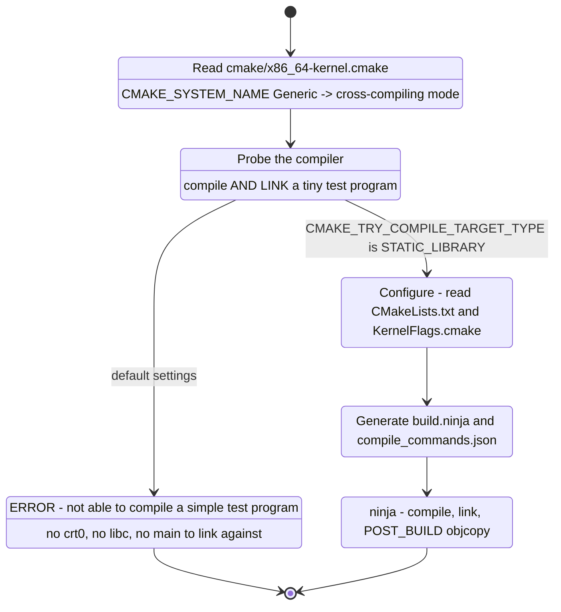

**`ReadToolchain`.** The toolchain file is read *very early*, before any compiler
is examined. Setting `CMAKE_SYSTEM_NAME` at all is what puts CMake into
cross-compiling mode; the value `Generic` means "a system with no operating
system", which suppresses every OS-specific behaviour CMake would otherwise
apply. The same file names `x86_64-elf-gcc`, `x86_64-elf-g++` and `nasm`, and
sets the three `CMAKE_FIND_ROOT_PATH_MODE_*` variables so that `find_program`
searches the host (you want the host's `nasm` and `objcopy`) while `find_library`
and `find_path` search only the target sysroot (you emphatically do not want
`/usr/include/stdio.h`).

**`ProbeCompiler` and the fork.** CMake verifies a compiler by compiling *and
linking* a tiny test program. Linking a complete executable requires a C runtime
startup object, a standard library, and a function called `main`. Our target has
none of the three, so the link fails and CMake stops with:

```
CMake Error: The C++ compiler "/opt/cross/bin/x86_64-elf-g++" is not able to
compile a simple test program.
```

which is alarming and completely misleading — the compiler is fine, and
[[Stage 0.1 - Prove Your Toolchain Works]] proved it. The fix is one line in the
toolchain file:

```cmake
set(CMAKE_TRY_COMPILE_TARGET_TYPE STATIC_LIBRARY)
```

Producing a `.a` requires compiling and archiving, never linking, so the probe
passes. A successful configure prints `Check for working CXX compiler: ... -
skipped`, and that word **skipped** is the fix working, not a warning.

**`Configure` → `Generate`.** Now `CMakeLists.txt` and `kernel/CMakeLists.txt`
are read. Sources are listed *explicitly*, never globbed: CMake evaluates a glob
at configure time, so a glob does not re-run when you add a file, and your new
`.cpp` is silently not compiled — you get an undefined reference to a function
whose definition is sitting right there in the tree. `Generate` writes
`build/build.ninja` and, because `CMAKE_EXPORT_COMPILE_COMMANDS` is on,
`build/compile_commands.json`.

**`Build`.** Ninja executes the graph, in parallel, in dependency order, and the
`POST_BUILD` `objcopy --only-keep-debug` produces `kernel.sym`. CMake re-runs
itself automatically if it notices a `CMakeLists.txt` changed, so in practice you
type `make` and both phases happen.

> [!example] Why `compile_commands.json` is worth more than it looks
> It is a JSON array of every compiler invocation the build would make. Three
> consumers, all of which would otherwise be impossible: your editor's clangd
> (autocomplete and go-to-definition across a tree that will reach tens of
> thousands of lines), `clang-tidy`, and `scripts/lint.sh` — which queries it with
> `jq` and fails the build if any file under `kernel/` was compiled without
> `-mno-red-zone`. A human reviewer misses that on the fortieth pull request. A
> query does not.

---

### 3.4 Every kernel compile flag, and the failure it prevents

These are not stylistic. Each one prevents a specific, real failure, and they are
defined exactly once in `cmake/KernelFlags.cmake` so a new target cannot quietly
omit one.

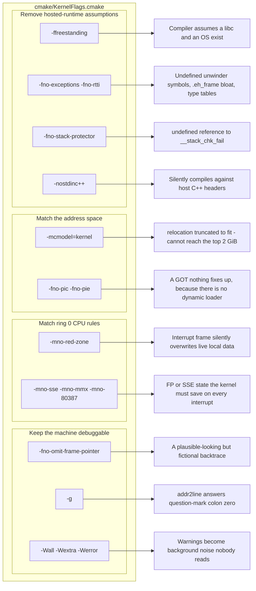

Each left-hand box is a flag group; each right-hand box is what happens without
it. Four groups, because the flags fall into four genuinely different kinds of
problem.

**Removing hosted-runtime assumptions.** `-ffreestanding` tells the compiler
there is no hosted environment: no libc, no `main` contract, and it must not
assume standard library functions behave in the standard ways. `-fno-exceptions`
and `-fno-rtti` remove the two C++ features that require runtime support we do
not have — a stack unwinder and type-identity tables ([[ADR-0007 - Freestanding C++20 as the Kernel Language]]).
`-fno-stack-protector` stops GCC emitting calls to `__stack_chk_fail`, which
exists in glibc and nowhere in our tree. `-nostdinc++` is the one that differs
from most tutorials: because the image contains **no libstdc++ at all**, an
accidental `#include <cstdint>` must fail immediately and legibly, rather than
being "fixed" by someone adding a host include path and compiling against headers
that describe a completely different environment.

**Matching the address space.** `-mcmodel=kernel` tells GCC it may assume all
code and data live in the top 2 GiB, so it emits 32-bit sign-extended
displacements instead of 10-byte `movabs` sequences. That assumption is only true
because the linker script puts the kernel at `0xFFFFFFFF80000000` — the two are
one decision. `-fno-pic -fno-pie` disables position-independent code, which would
otherwise route global accesses through a Global Offset Table that *something*
would have to fix up at load time. There is no dynamic loader, so that something
would have to be hand-written assembly running before `kmain`.

**Matching ring 0 CPU rules.** `-mno-sse -mno-mmx -mno-80387` stop GCC using
floating-point and vector registers for ordinary code, such as copying a struct
with wide moves. If it used them, every interrupt entry would have to save and
restore that state, which is large and slow, and if you forgot, an interrupt would
corrupt whatever user or kernel computation was in flight. `-mno-red-zone` gets
its own subsection, immediately below, because it is the one whose absence
produces no error at all.

**Keeping the machine debuggable.** `-fno-omit-frame-pointer` keeps `rbp` as a
frame pointer so the panic handler can walk the call chain
([[Stage 0.7 - Panic and KASSERT]]). At `-O2` without it, GCC uses `rbp` as a
general-purpose register and your backtrace prints plausible-looking fiction —
which is strictly worse than printing nothing. `-g` emits DWARF debug
information; it costs nothing at runtime because debug sections are not
`PT_LOAD` and never occupy target memory, and without it `addr2line` cannot turn
a panic address into a source line. `-Werror` is on from the first commit,
because turning it on later means fixing hundreds of warnings in one sitting,
which nobody ever schedules.

#### `-mno-red-zone`, in detail

The AMD64 System V ABI defines a **red zone**: the 128 bytes immediately *below*
`rsp`. A leaf function — one that calls nothing else — may use that area for
locals without adjusting `rsp` at all, saving two instructions on entry and exit.
In user space this is entirely safe, because the only things that write below the
user stack pointer are signal handlers, and the kernel arranges those to skip the
red zone.

In ring 0 there are no signal handlers. There are interrupts.

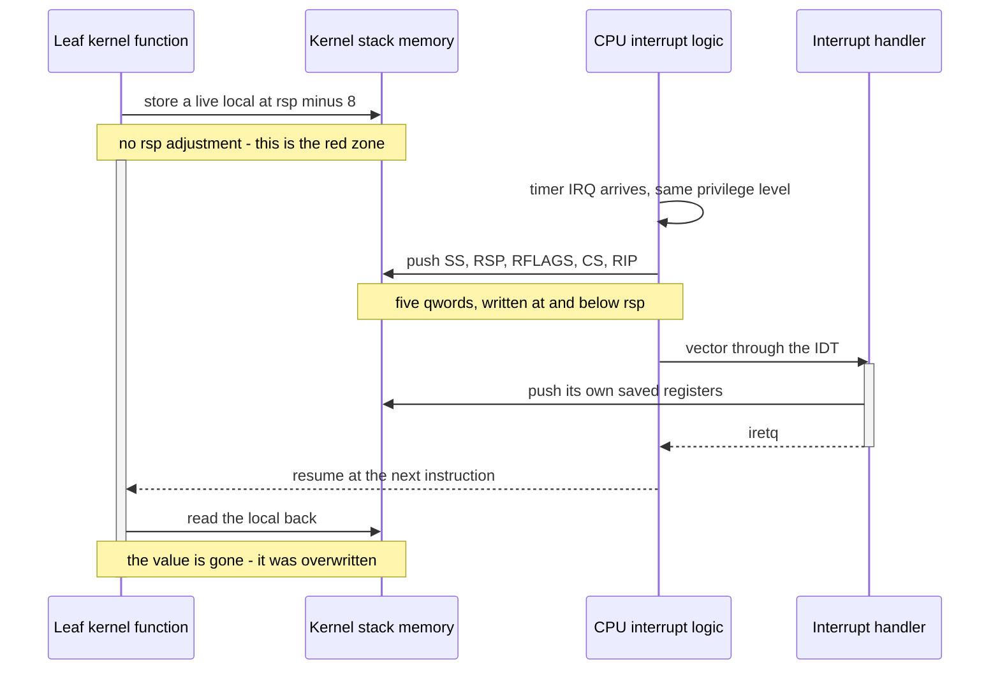

**Walking it.** The leaf function stores a live value at `rsp - 8` and does not
move `rsp`; by the ABI it is entitled to. A hardware interrupt then arrives. The
CPU does not know or care about the red zone: in 64-bit mode it always pushes
five 64-bit values — `SS`, `RSP`, `RFLAGS`, `CS`, `RIP` — onto the current stack
before vectoring through the IDT. Those pushes land at and below `rsp`, squarely
inside the 128 bytes the leaf function believed were private. The handler then
pushes more. When `iretq` returns, the leaf function reads its local back and
gets an interrupt frame byte instead.

The consequences are what make this the worst flag to forget:

- **Nothing fails at build time.** The code is valid. The ABI is being honoured on
  both sides.
- **The corruption is data-dependent and timing-dependent.** It only happens if an
  interrupt fires during the window, which makes it unreproducible.
- **The fault appears somewhere else.** The corrupted value is used later, in a
  different function, possibly in a different subsystem, and the stack trace
  points at innocent code.
- **Adding logging often makes it disappear**, because it changes the timing.

There is exactly one defence: never generate red-zone code in the kernel. That is
one flag — and a CI rule that proves every translation unit under `kernel/` has
it, because the flag being *present in the file that defines flags* is not the
same claim as it *reaching every compile command*.

> [!warning] The one exception you will be tempted to make
> User-space code compiled with the userspace toolchain does not need
> `-mno-red-zone`, and adding it there costs a little performance for nothing.
> But the moment a source file moves from `user/` into `kernel/` — a helper that
> turned out to be useful on both sides — it must acquire the kernel flags. The
> lint rule keys on the path `/kernel/`, which is why [[07 - Repository Layout]]
> insists that where a file lives is a real decision and not filing.

---

### 3.5 The link: sections, segments, and memory

The linker's job is three things in order: resolve every symbol, place every
section at a final address, and patch every relocation. The linker *script* is
how you control the middle one, and it is where a bare-metal build stops
resembling a normal one.

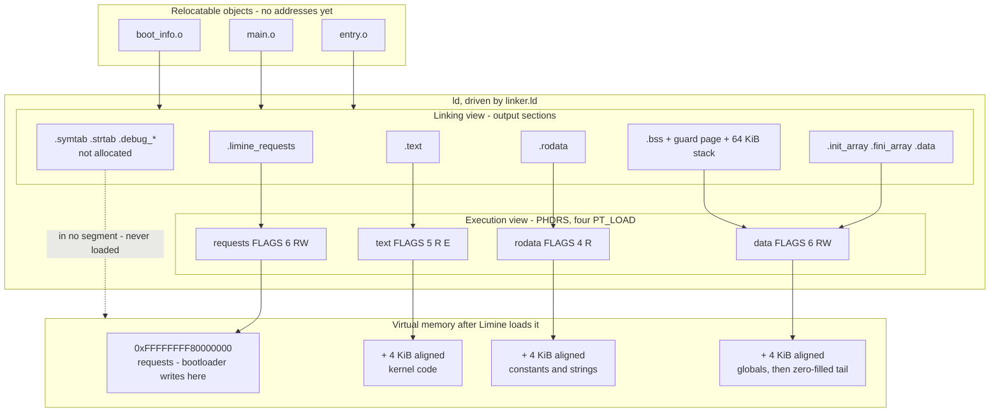

**`OBJECTS`.** Each `.o` is a bag of sections with no final addresses. `entry.o`
carries `kmain` and the Limine request structures; the others carry the rest.
Nothing in an object file knows where it will live.

**`SECTIONS` — the linking view.** The script gathers input sections by name into
output sections and assigns each an address, starting the location counter at
`KERNEL_VMA = 0xFFFFFFFF80000000`. Five groups matter:

- **`.limine_requests`** is placed first and wrapped in `KEEP()`. Nothing in the
  kernel references these structures by name — Limine finds them by scanning the
  loaded image for 128-bit magic IDs — so both the compiler and the linker are
  entitled to delete them. `__attribute__((used))` stops the compiler and
  `KEEP()` stops `--gc-sections`; neither substitutes for the other
  ([[Stage 0.2 - The Limine Request Section]]).
- **`.text`, `.rodata`, `.data`** are each preceded by `. = ALIGN(PAGE_SIZE)`.
  This is the alignment that makes per-section permissions *expressible* at all —
  see below.
- **`.bss`** must be the **last allocated section**, and it carries the 4 KiB
  guard page and the 64 KiB boot stack, carved out with location-counter
  arithmetic so they cost zero bytes in the file.
- **`.symtab`, `.strtab`, `.debug_*`** are not allocated, land in no segment, and
  are never loaded. They cost disk space and nothing else, which is why
  `kernel.elf` is never stripped.

**`SEGMENTS` — the execution view.** A bootloader reads *only* the program header
table. Each `PT_LOAD` says: take `p_filesz` bytes from file offset `p_offset`,
place them at `p_vaddr`, extend to `p_memsz` (zero-filling the excess), and map
with `p_flags`. The `PHDRS` block declares four explicitly. Declaring `PHDRS` at
all turns off GNU `ld`'s automatic merging, which would otherwise collapse text,
rodata and data into a single `RWX` segment — the permission set every exploit
wants, and one binutils 2.43 will warn about.

`FLAGS()` writes `p_flags` directly: `PF_X` is 1, `PF_W` is 2, `PF_R` is 4. So 4
is read-only, 5 is read plus execute, 6 is read plus write. `FLAGS(7)` is `RWX`
and must never appear.

The `requests` segment is `RW`, not `R`, because Limine writes a response pointer
into each request structure. Marking it read-only buys nothing and invites a fault.

**`MEM`.** Limine maps each segment at its `p_vaddr`. The kernel is in the top
2 GiB of the canonical 48-bit address space, which is precisely the range a
sign-extended 32-bit displacement can reach, which is precisely what
`-mcmodel=kernel` assumes. The three constraints — the code model, the link
address, and the Limine x86-64 protocol — agree, and that agreement is not a
coincidence: each was chosen knowing the others.

**The dotted arrow** is the one people miss. Non-allocatable sections go nowhere.
They exist in the file, GDB and `addr2line` read them, and the target never sees
a byte of them.

#### The link flags, and what silently breaks

| Flag | What it does | What breaks without it |
|---|---|---|
| `-T .../linker.ld` | Uses our layout | The linker's default layout: wrong address, wrong segments |
| `-nostdlib` | No `crt0`, no libc, no default libs | Undefined `_start`, `__libc_csu_init`, and friends |
| `-static` | No dynamic linking | A `.dynamic` section that nothing will ever process |
| `-Wl,-z,max-page-size=0x1000` | Makes `CONSTANT(MAXPAGESIZE)` 4 KiB | **The build works and is quietly wrong** — see below |
| `-Wl,--build-id=none` | No `.note.gnu.build-id` | An orphan note section, and a reproducibility hazard |
| `--orphan-handling=warn` | Warns about unplaced input sections | Sections land somewhere arbitrary, in silence |

> [!warning] `-z max-page-size=0x1000` is the flag whose absence produces a
> working build
> The x86-64 linker defaults to a **2 MiB** maximum page size. Without the flag,
> `CONSTANT(MAXPAGESIZE)` in the script is `0x200000`, so every `ALIGN(PAGE_SIZE)`
> aligns to 2 MiB instead of 4 KiB. Three things follow, none of which is an
> error: the ELF is padded by megabytes and the ISO with it; the segments are
> 2 MiB-aligned rather than page-aligned; and the section boundaries the VMM will
> use to apply W^X in [[Phase 15 - Overview|Phase 15]] no longer land where the
> script said. You find out at the far end of the project, and the fix is a
> relayout that shifts every symbol the PMM, the VMM and the backtrace symboliser
> depend on. Check it every time with `readelf -l`: the `Align` column must read
> `0x1000`.

**Why page alignment is the whole point.** Permissions have page granularity. A
page-table entry carries one writable bit and one no-execute bit per 4 KiB page.
If the last byte of `.text` and the first byte of `.rodata` share a page, that
page must be both executable and part of your read-only data — so you either mark
rodata executable or mark text non-executable, and neither is acceptable.
Aligning to 4 KiB is what makes the sentence "text is `R E`, rodata is `R`, data
is `RW NX`" possible to say at all. The cost is on average half a page per
boundary — a few kilobytes in an image measured in hundreds.

**The boundary symbols.** The script exports `__kernel_start/end`,
`__text_start/end`, `__rodata_start/end`, `__data_start/end`, `__bss_start/end`,
`__init_array_start/end`, `__stack_guard_bottom/top` and
`__stack_bottom/top`. Every one has a named consumer: the physical memory manager
reserves `[__kernel_start, __kernel_end)` so it never hands out a frame the
kernel is running from; the VMM maps each region with its own permissions; the
global-constructor walker iterates `.init_array`; the backtrace symboliser
decides whether a return address is kernel code. Regions are contiguous — every
`_end` equals the next `_start` — so consumers can walk them without gap
handling.

---

### 3.6 Building the artefacts

Two artefacts, two very different container formats, one shared staging tree.
`scripts/mkimage.sh` builds `build/stage/` first — a directory that *is* the boot
volume — then wraps it twice.

#### The hybrid ISO

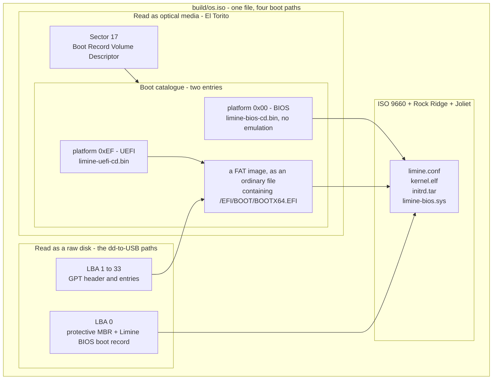

**Why one file boots four ways.** An El Torito boot catalogue may hold more than
one entry, each tagged with a platform ID. Firmware reads the catalogue and picks
the entry it understands, ignoring the other. Platform `0x00` is 80x86 BIOS;
platform `0xEF` is UEFI.

**`E86`, the BIOS entry**, points at `limine-bios-cd.bin` in *no-emulation* mode:
the BIOS loads a fixed number of raw sectors to `0x7C00` and jumps, with no
pretence that the disc is a floppy or a hard disk. `-boot-load-size 4` is four
512-byte *virtual* sectors — 2048 bytes, one physical CD sector — and
`-boot-info-table` patches a 56-byte table into the boot image at offset 8 so the
stage can locate the rest of the disc.

**`EEFI`, the UEFI entry**, cannot point at raw sectors, because UEFI does not
boot raw sectors — it opens a *file* out of a FAT filesystem and runs it as a
PE32+ application. So the entry points at `limine-uefi-cd.bin`, which is a small
prebuilt **FAT image stored inside the ISO as an ordinary file**. The firmware
exposes that file as a virtual block device, mounts it, and finds
`/EFI/BOOT/BOOTX64.EFI` inside it.

**`MBR` and `GPT`** exist for the fourth and richest path. If you `dd` the ISO
onto a USB stick, the firmware sees a *disk*, not an optical drive, and El Torito
never enters the picture — BIOS reads LBA 0 as an MBR, UEFI reads LBA 1 as a GPT.
`--protective-msdos-label` writes the protective MBR, `-efi-boot-part
--efi-boot-image` registers the embedded FAT image as a real EFI System Partition
in the partition table, and the separate `limine bios-install` step afterwards
writes Limine's BIOS boot record into LBA 0. That last command is a separate
invocation after `xorriso` and is therefore the easiest thing in the script to
lose in a refactor; its absence breaks only BIOS-from-USB, which is to say it
breaks on release day, on hardware, in front of someone.

**`FS9660`.** `-R -r -J` add Rock Ridge and Joliet. Without Rock Ridge, ISO 9660
mangles names to 8.3 uppercase and `kernel.elf` becomes `KERNEL.ELF;1`, which
`boot():/kernel.elf` in `limine.conf` will not resolve. The `-r` variant also
rationalises ownership to uid/gid 0, which matters for reproducibility: otherwise
the build user's uid ends up in the image.

#### The GPT disk image

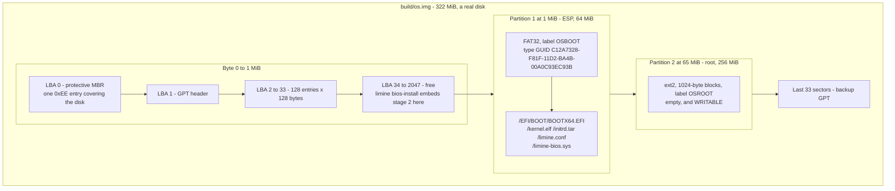

**Why 1 MiB before the first partition.** Two reasons, both real. The GPT itself
needs 34 sectors, and `limine bios-install` embeds its intermediate BIOS stage in
the free space that follows — which is why the partition must not start below
1 MiB. Separately, 1 MiB aligns the partition to any plausible flash erase-block
boundary, which matters for write endurance on the USB stick this eventually
becomes.

**Why the ESP is FAT32 and 64 MiB.** UEFI firmware contains exactly one
filesystem driver, for FAT, and the specification requires nothing else. You may
not put the bootloader on ext2 — the firmware cannot read it and cannot be
taught. This is the direct cause of the FAT32 half of
[[ADR-0009 - Filesystem Strategy FAT32 then ext2]]: we implement FAT32 in the
kernel not because it is a good filesystem but because it is the one we are
*required* to be able to write. The size matters too: FAT32 requires more than
65 524 clusters, so an ESP below roughly 33 MiB cannot be formatted as FAT32 at
all, and firmware will reject whatever `mkfs.fat` produces instead.

**Why `/EFI/BOOT/BOOTX64.EFI` exactly.** A permanently installed OS registers a
boot entry in firmware NVRAM. Removable media cannot — the stick has never seen
this machine. So the specification defines a hardcoded fallback path per
architecture that firmware must try. Put the file one directory off and UEFI
finds no bootloader and drops you at a shell prompt, which looks identical to a
dozen other failures.

**Why `limine-bios.sys` is on an *EFI* System Partition.** It looks wrong and it
is deliberate. When this image is booted on a legacy-BIOS machine, the boot
record in LBA 0 has to load a second stage from some filesystem it can read, and
FAT32 is one Limine can read. Without it, BIOS boot from `os.img` gets as far as
the MBR and stops.

**Why partition 2 exists while it is empty.** ISO 9660 has no concept of writing,
so the ISO can never demonstrate persistence. `os.img` has somewhere to write
from Stage 0.5 onward, which means the layout is final before eight phases of
work depend on it. Layout changes late are the ones that break the release
pipeline ([[11 - Release and Deployment]]).

#### The decisive constraint: no root, anywhere

Every step above runs as an ordinary user inside an unprivileged container. That
is not an aesthetic preference; it is what makes the whole pipeline possible.

`mount` is a privileged operation. `losetup` needs `CAP_SYS_ADMIN`, and so does
mounting the resulting device, so the obvious approach — attach the image to a
loop device, mount the partitions, `cp` files in — requires `docker run
--privileged`, which is a security posture nobody should accept for a build step
and which many CI providers refuse outright.

The alternative is to build each filesystem as a *standalone file* and copy it
into the disk image at the right byte offset:

| Step | Tool | Why it needs no privilege |
|---|---|---|
| Create the disk | `truncate -s 322M` | Sparse file; no blocks allocated until written |
| Partition it | `parted -s` | Writes GPT structures into a plain file |
| Format the ESP | `mkfs.fat -F 32` | Writes FAT structures into a plain file |
| Populate the ESP | `mmd`, `mcopy` | `mtools` implements FAT entirely in userspace |
| Format the root | `mke2fs -F` | `-F` means "proceed on something that is not a block device" |
| Place them | `dd ... conv=notrunc` | Ordinary file writes at computed offsets |

> [!warning] `conv=notrunc` is load-bearing, and the offsets are duplicated
> By default `dd` truncates its output at the end of what it wrote. Omit
> `conv=notrunc` and `os.img` becomes 65 MiB: an ESP, no root partition, no
> backup GPT, and an image that still looks plausible. Separately, the byte
> offsets given to `dd` restate the numbers given to `parted`, and **nothing
> checks that the two agree**. Change `1MiB` in the `parted` line without changing
> the corresponding offset and you will write a perfectly good filesystem
> somewhere that is not where the partition table says the partition is. Every
> command succeeds. Nothing boots.

---

### 3.7 Reproducibility

Two builds of the same commit must produce identical bytes. That is what turns
"it works on my machine" from an argument into a falsifiable claim.

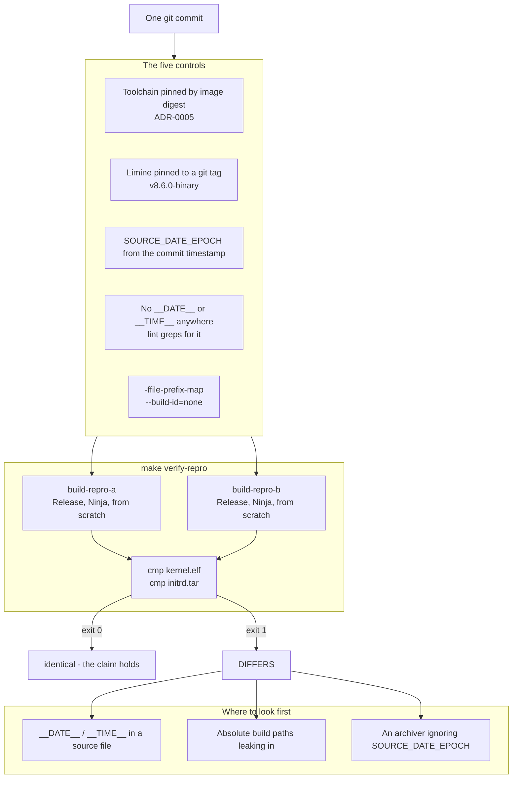

**The five controls, each removing one source of variation.**

*The toolchain digest* removes compiler variation. A tag can be moved; a digest
is the content. This is why [[10 - CI Pipeline]] pulls the image by digest and
why upgrading the compiler is a reviewed pull request that changes one line.

*The Limine tag* removes bootloader variation. The prebuilt binaries that end up
inside every artefact come from a specific commit, not from whatever `trunk` was
that afternoon.

*`SOURCE_DATE_EPOCH`* is the cross-tool convention for "pretend the current time
is this". `verify-repro.sh` sets it from `git log -1 --pretty=%ct` — the commit
timestamp, which is a property of the commit rather than of when you built it.
The `Makefile` forwards it into the container with `-e SOURCE_DATE_EPOCH`.
Archivers such as `tar` honour it for mtimes, which is what makes `initrd.tar`
comparable at all.

*Banning `__DATE__` and `__TIME__`* removes the most direct route for a
timestamp to reach a binary. These macros expand to the moment of compilation, so
a single `kprintf("built " __DATE__)` makes every build differ forever.
`scripts/lint.sh` greps `kernel/`, `libc/` and `user/` for both and fails.

*`-ffile-prefix-map` and `--build-id=none`* remove path and identity variation.
Debug information records the paths of source files; if yours is `/home/alice/os`
and your teammate's is `/Users/bob/os`, the DWARF differs even though the code is
identical, and `-ffile-prefix-map` rewrites those to a common prefix. A build-id
is a hash the linker embeds to identify the binary; it is useless to us and one
more thing to differ.

**The verification.** `make verify-repro` builds twice, into `build-repro-a` and
`build-repro-b`, both `Release`, both from nothing, and `cmp`s `kernel.elf` and
`initrd.tar`. Note what it does *not* diff: `os.iso` and `os.img`. Those are the
harder case — filesystem creation tools embed volume creation timestamps and
serial numbers — and the honest position is that the kernel and the initrd are
the artefacts whose reproducibility is currently claimed and checked.

> [!question] Worth arguing about
> Reproducibility is usually sold as a supply-chain security property: you can
> verify that a published binary really was built from the published source. That
> is true and it is not why we do it here. What is the *day-to-day* payoff for a
> two-person team, and which specific class of bug does it make cheaper?

---

## 4. The data structures

Almost every structure in this document belongs to a *file format* rather than to
the running kernel. There are three that matter, and they are all inside
`kernel.elf`.

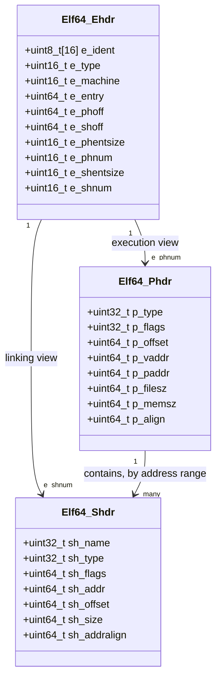

**Two tables, one file, independent.** The header points at both. `e_phoff` and
`e_phnum` locate the program header table — the execution view, which Limine
reads. `e_shoff` and `e_shnum` locate the section header table — the linking
view, which `ld`, `objdump`, `nm` and GDB read. The relationship between a
segment and the sections inside it is not stored anywhere; it is *derived* from
address ranges, which is why `readelf -l` prints a separate
"Section to Segment mapping" that it computed itself.

**Fields worth knowing by name.**

| Field | Meaning | What you check it for |
|---|---|---|
| `e_entry` | Virtual address of the entry point | Must equal the address `nm` reports for `kmain`. `0x0` means `ENTRY()` did not resolve — usually a missing `extern "C"` |
| `e_type` | `EXEC` for us | `DYN` would mean PIE crept in |
| `p_vaddr` | Where the loader must place the segment | Every one must start `0xffffffff80` |
| `p_flags` | Permissions | Never 7 |
| `p_filesz` vs `p_memsz` | Bytes in the file vs bytes in memory | The last segment must have `p_memsz` much greater — that gap is `.bss` plus the stack |
| `p_align` | Alignment congruence the linker maintained | `0x1000`, never `0x200000` |
| `sh_type` | `PROGBITS`, `NOBITS`, `SYMTAB`, … | `.bss` must be `NOBITS`; if it is `PROGBITS` something is placed after it and the zeros are in the file |

### `p_flags` bits

| Bit | Name | Value | Our segments using it |
|---|---|---|---|
| 0 | `PF_X` — execute | 1 | `text` only |
| 1 | `PF_W` — write | 2 | `requests`, `data` |
| 2 | `PF_R` — read | 4 | all four |

Combinations we emit: `FLAGS(4)` = `R`, `FLAGS(5)` = `R E`, `FLAGS(6)` = `RW`.
`FLAGS(7)` = `RWX` is what you get by accident and must never appear.

### Relocations you will meet

The linker patches placeholders using these. Which one the compiler emitted
depends on the code model, and that is where a wrong link address becomes a hard
error rather than a mystery.

| Value | Name | Encodes | Fails when |
|---|---|---|---|
| 1 | `R_X86_64_64` | Full 64-bit address | Effectively never |
| 2 | `R_X86_64_PC32` | 32-bit PC-relative | Target further than ±2 GiB from the reference |
| 4 | `R_X86_64_PLT32` | Call via a PLT slot; no PLT here, so same as PC32 | As above |
| 10 | `R_X86_64_32` | Zero-extended 32-bit | Address ≥ 2 GiB — the `-mcmodel=small` failure |
| 11 | `R_X86_64_32S` | Sign-extended 32-bit | Address outside the low 2 GiB **and** outside the top 2 GiB |

`relocation truncated to fit` is the linker saying the final address does not fit
the field the compiler chose. It is the code model and the link address
disagreeing, and it is the single most common error in this whole area.

### The El Torito boot catalogue, as we use it

| Field | Value here | Meaning |
|---|---|---|
| BIOS entry platform ID | `0x00` | 80x86 |
| UEFI entry platform ID | `0xEF` | UEFI |
| Emulation | none | Load raw sectors, no floppy or HDD pretence |
| Boot load size | 4 | Four 512-byte *virtual* sectors = one 2048-byte CD sector |
| Boot info table | present | 56 bytes patched in at offset 8: PVD LBA, boot-file LBA, length, checksum |

### `os.img`, exact offsets

Defaults are `ESP_MB=64`, `ROOT_MB=256`, total `ESP_MB + ROOT_MB + 2`.

| Region | Byte offset | Size | Contents |
|---|---|---|---|
| Protective MBR | 0 | 512 B | One entry, type `0xEE`, covering the disk |
| GPT header | 512 | 512 B | LBA 1 |
| Partition entries | 1024 | 16 KiB | 128 × 128 B, LBA 2–33 |
| Gap | ~17 KiB | ~1007 KiB | `limine bios-install` embeds stage 2 here |
| Partition 1 — ESP | 1 MiB | 64 MiB | FAT32, label `OSBOOT`, ESP type GUID |
| Partition 2 — root | 65 MiB | 256 MiB in 257 MiB | ext2, 1024-byte blocks, label `OSROOT` |
| Backup GPT | last 33 sectors | ~17 KiB | Mirror of the primary |

The `+ 2` is not padding for luck: one MiB at the front for the GPT and
alignment, roughly one at the end so the backup GPT has somewhere to live. Remove
it and `parted` cannot place the backup header.

---

## 5. The flows

### 5.1 `make run`, end to end

One command, five processes, two privilege domains, one boundary crossing. This
is the loop you will run thousands of times.

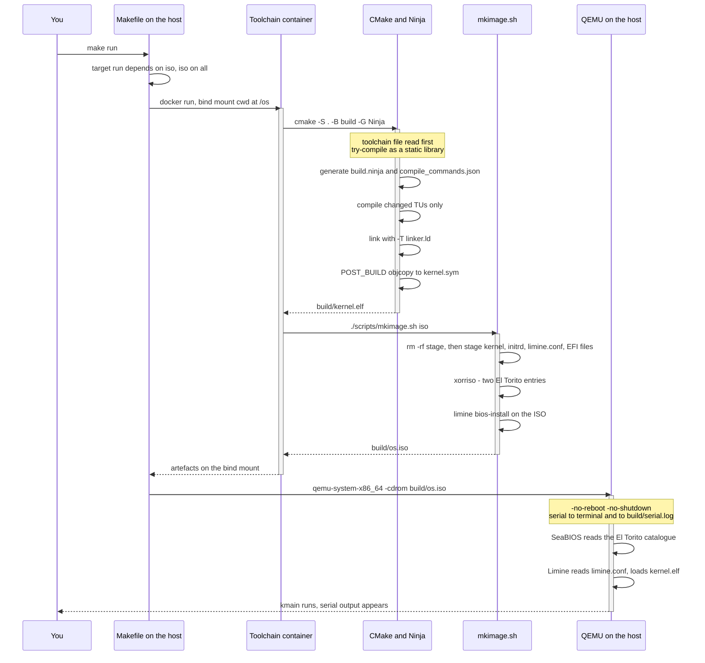

**Where control sits, step by step.** The `Makefile` resolves the dependency
chain `run → iso → all → configure` on the host, then hands everything from
`configure` to `mkimage.sh` into the container in a *single* `docker run` per
target. CMake configures and generates; Ninja compiles only the translation units
whose inputs changed and relinks if any object or the linker script changed.
`mkimage.sh` rebuilds the staging tree from nothing — never incrementally,
because a stale `kernel.elf` that still boots is the worst debugging experience
available — wraps it, and installs the BIOS boot record. Control returns to the
host, and QEMU starts there.

**Two flags on the QEMU line are not optional.** `-no-reboot` turns a guest reset
request into a shutdown request; `-no-shutdown` turns *that* into "stop emulating
but keep the process alive". Together they freeze the machine at the moment it
died, with the monitor still attached. Without them a triple fault reboots the
VM and erases the evidence each time round — see §8.

**Serial goes to two places at once** — your terminal and `build/serial.log` — via
a `chardev` with a `logfile`. The terminal is for the edit-run loop; the file is
what survives the crash, what you paste into a bug report, and what
`scripts/test.sh` greps. A run whose only output vanished with the QEMU window is
a run you cannot debug.

### 5.2 The graph CMake builds

Ninja does not know what a kernel is. It knows a directed acyclic graph of files
and commands. Getting the *edges* right is the entire value of using a build
system rather than a shell script.

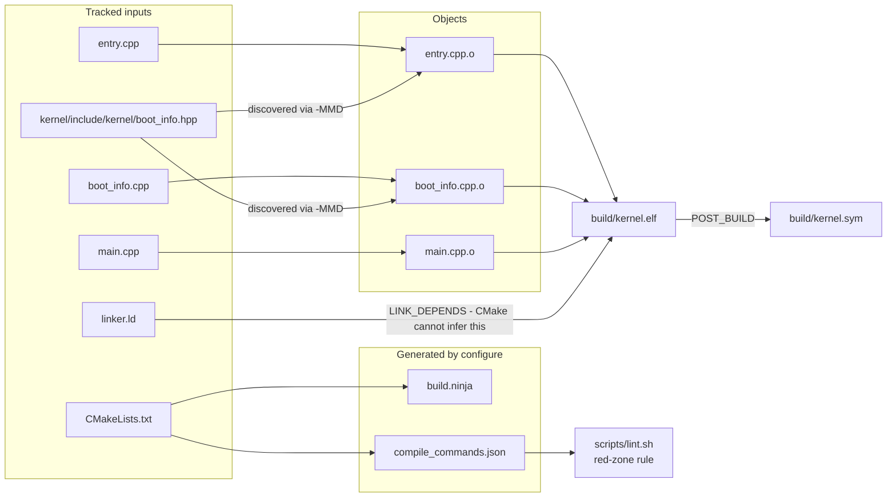

**The header edges are the point.** `H1` is included by two of the three sources
and by neither the third. The compiler emits that fact as a side effect of
compiling (`-MMD`), the build system consumes it, and touching the header
therefore rebuilds exactly `O1` and `O2`. Done by hand, this is where builds go
wrong: you edit a struct definition, rebuild, and end up with object files
compiled against two different definitions of the same struct linked into one
binary. The symptom is a field reading as garbage, and nothing in your diff
explains it.

**`LD → ELF` is the edge CMake cannot infer.** CMake tracks `#include`
dependencies automatically but has no idea that `-T somefile` on the link line
means the output depends on that file. `LINK_DEPENDS` states it manually. Without
that line, editing `linker.ld` does not relink, and you spend twenty minutes
wondering why your layout change had no effect — which is exactly the class of
bug a build system is supposed to eliminate, appearing in the one place the build
system is blind.

**`CDB → LINT` is an edge nobody thinks of as a build edge.** The compile
database is an artefact with a consumer that is not a compiler. That is what
makes "every kernel translation unit carries `-mno-red-zone`" a *mechanised*
invariant rather than a review convention.

**What is deliberately absent.** There is no edge from a wildcard to the object
list. Sources are listed explicitly because a glob is evaluated at configure time
and does not re-run, so a new `.cpp` would be silently omitted and its functions
undefined at link time.

### 5.3 Reproducibility verification

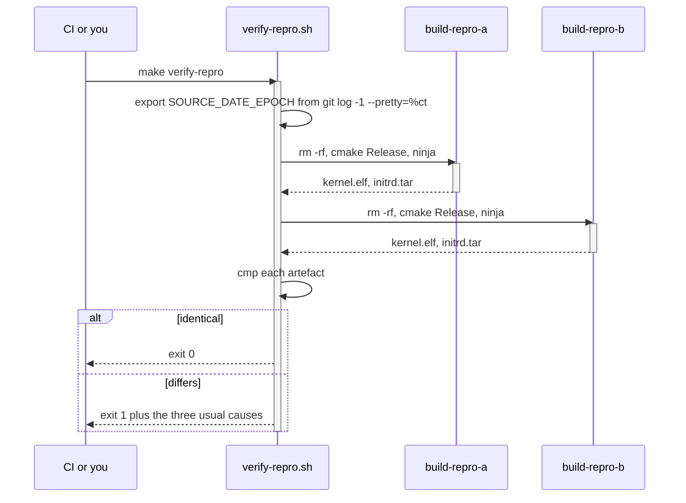

**Both builds are from scratch and both are `Release`.** From scratch, because a
reproducibility check that reuses objects proves nothing about the compilation
step. `Release` rather than the `Debug` default, because that is what ships, and
because optimisation is where timestamps and paths are most likely to be baked
into inlined constants.

**`SOURCE_DATE_EPOCH` is exported before either build**, so both see the same
notion of "now" — the commit's timestamp. Setting it per-build would be a bug
that made the check pass for the wrong reason.

**The `alt` block is the useful part.** A failure prints the three causes worth
checking first, in the order they actually occur: a `__DATE__`/`__TIME__` that
slipped past lint, an absolute path leaking into debug info, or an archiver
ignoring `SOURCE_DATE_EPOCH`. That list is a diagnostic that outlives whoever
wrote the script.

---

## 6. Why it is shaped this way

### Where the build runs

| Option | Cost | Verdict |
|---|---|---|
| **Pinned container, QEMU on the host (chosen)** | Docker becomes a hard prerequisite; emulated and slower on Apple Silicon | ✅ |
| Per-OS manual toolchain install | Three different compilers; "works on my machine" becomes unfalsifiable | ❌ |
| Everything in the container, QEMU included | No GUI on macOS or Windows; no KVM, HVF or WHPX; interactive debugging becomes painful | ❌ for dev, ✅ for CI |
| Nix | Genuinely better at reproducibility | ❌ on team familiarity, not on merit |

**What breaks under the rejected options.** With per-OS installs, different GCC
versions make different inlining and stack-layout decisions, so a race fires
reliably on one machine and never on the other; you burn a day discovering the
difference was 14.2 versus 15.1. With everything containerised, your development
loop loses the framebuffer output that [[ADR-0004 - Framebuffer Console Not VGA Text]]
makes the *only* console path — you would be debugging a graphical OS through a
serial log. Nix is rejected on learning curve, not on quality, and the decision is
recorded as revisitable in [[ADR-0005 - Containerised Pinned Toolchain]].

### How the build is described

| Option | Cost | Verdict |
|---|---|---|
| **CMake + Ninja (chosen)** | Verbose, idiosyncratic language; a real learning curve | ✅ |
| Hand-written Makefile | Header dependencies are manual and always subtly wrong; three toolchains means three parallel rule sets | ❌ |
| Meson | Cleaner cross-compilation model than CMake | ❌ on ecosystem — less prior art to crib from at 1am |
| Bazel | Hermetic by construction | ❌ — enormous configuration overhead for a problem two people do not have |

**Be fair to hand-written Make**: for six files it is *better* — shorter, no
generator step, readable end to end. The crossover is when you have more
directories than you can hold in your head, or more than one toolchain, which for
this project is around [[Phase 4 - Overview|Phase 4]]. The reason not to start
there and migrate is that migrating a build system mid-project is a day nobody
schedules, and it always lands in a week you needed for something else.

### How the artefacts are shaped

| Option | Cost | Verdict |
|---|---|---|
| **Hybrid ISO *and* GPT image (chosen)** | Two build paths; the boot matrix doubles | ✅ |
| ISO only | **Read-only root, forever** — persistence can never be demonstrated | ❌ |
| Image only | ~10× the build time on every iteration; no Ventoy or optical path | ❌ |
| Separate BIOS and UEFI ISOs | Two artefacts, two checksums, and a user who must know their own firmware type | ❌ |

They answer different questions. The ISO answers "did my change boot?" in
seconds. The image answers "does the thing we ship work?" — it is the only
artefact with a real partition table, a real ESP, and a writable root. The risk
of having two is drift: you work all day on the ISO and discover a UEFI break
later. The mitigation is mechanical, not disciplinary — `make test-boot` runs
`bios/iso`, `uefi/iso`, `uefi/img` and `uefi/img --smp 4`, and CI runs it on every
push ([[09 - Testing Strategy]], [[ADR-0010 - Testing Strategy and the QEMU Exit Device]]).

### How image contents get written

| Option | Cost | Verdict |
|---|---|---|
| **`parted` + `mkfs` + `mtools` + `dd` (chosen)** | Offsets computed by hand, duplicated between `parted` and `dd` | ✅ |
| `losetup` + `mount` | **Needs root and `--privileged`**; many CI providers refuse | ❌ |
| libguestfs / `guestfish` | Enormous dependency; needs KVM to be tolerable | ❌ |

Loop mounts also make builds machine-dependent in ways that are miserable to
debug: loop device numbers, whether `udev` has settled, whether a stale mount from
a crashed earlier run is still attached. Half the "works on my machine" reports in
image-building code come from loop mounts. Note the honest exception:
`sudo mount -o loop,offset=1048576 build/os.img /mnt` is a perfectly good way to
*inspect* an image interactively. Inspection is not the build, and only the build
has to be unprivileged.

### Flags defined once

| Option | Cost | Verdict |
|---|---|---|
| **One `KernelFlags.cmake`, enforced by lint (chosen)** | Indirection — you open another file to see the flags | ✅ |
| Repeated per target | Drift; a new subsystem quietly missing `-mno-red-zone` | ❌ |
| Reviewed by humans | A reviewer misses it on the fortieth pull request | ❌ |

The argument is entirely about §3.4's failure mode. A flag whose absence causes a
compile error can be enforced by the compiler. A flag whose absence causes random
corruption weeks later, in unrelated code, must be enforced by a machine.

---

## 7. How this grows across the phases

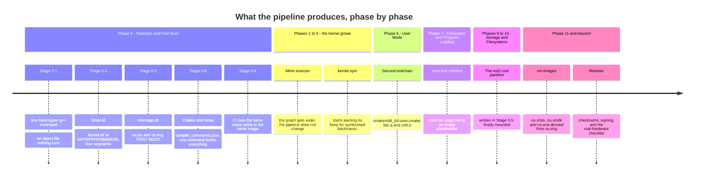

**What deliberately does not change.** The pipeline reaches its final *shape* in
Phase 0 and then only gains inputs. That is the intent: from Stage 0.8 onward,
adding a subsystem is adding a line to a source list. The three structural
changes that do arrive are each additive — a second toolchain file in Phase 6, a
host tool in Phase 7, and derived VM appliances in Phase 11 — and none of them
touches how the kernel is compiled or linked.

**What is deliberately missing early, and why that is acceptable.**

- **`initrd.tar` is an empty placeholder** until [[Phase 7 - Overview|Phase 7]].
  `limine.conf` names it as a module, so the file must exist or Limine errors while
  loading the entry; ten kilobytes of nulls is a valid tar archive. The staging
  step creates it and says so.
- **The ext2 root partition is empty** until [[Phase 10 - Overview|Phase 10]]. It
  exists from Stage 0.5 so the layout is final before anything depends on it.
- **`kernel-test.elf` does not exist** until the Tier 2 build. The self-test menu
  entry in `limine.conf` will fail if you select it. That is expected; do not
  "fix" it by deleting the entry.
- **The guard page below the kernel stack is reserved, not protected**, until
  [[Stage 4.3 - Enabling Paging]]. Limine maps every `PT_LOAD` segment, so today
  it is mapped read-write like the rest of `.bss`. What Stage 0.4 buys is the
  *layout* — a known-address, page-aligned hole with a symbol on each end — so
  Phase 4 only has to clear one present bit.

---

## 8. Failure modes

Symptom first, because that is what you have at 2am.

**"The C++ compiler is not able to compile a simple test program."**
The compiler is fine. CMake's probe tries to *link* an executable, which needs
`crt0`, a libc and `main`. Add `set(CMAKE_TRY_COMPILE_TARGET_TYPE STATIC_LIBRARY)`
to the toolchain file. If it persists, read `build/CMakeFiles/CMakeError.log` —
the real error is in there, not in the message CMake printed.

**"`relocation truncated to fit: R_X86_64_32S`."**
The code model and the link address disagree. Either the script is not placing
the kernel at `0xFFFFFFFF80000000`, or `-mcmodel=kernel` is missing from a
translation unit, or `-T` never reached the linker. If the offending symbol lives
in `libgcc.a`, that is the known caveat: the image's `libgcc` is built with the
default code model and *with* the red zone. Hobby kernels link it and it works
because the helpers are small and largely self-referential, but that is where to
look.

**"`build/os.iso` is enormous, or `.text` sits at file offset `0x200000`."**
`-Wl,-z,max-page-size=0x1000` is missing. The linker's 2 MiB default padded every
segment. Confirm with `readelf -l`: the `Align` column must read `0x1000`.

**"`mkimage.sh` says `missing build/kernel.elf — run 'make' first`."**
The build ran perfectly and put the file somewhere else.
`RUNTIME_OUTPUT_DIRECTORY` is unset, so CMake mirrored the source tree and your
kernel is at `build/kernel/kernel.elf`.

**"`undefined reference to memcpy`" (or `memset`, `memmove`, `memcmp`).**
Not a build-system bug. The C++ standard requires a freestanding implementation
to provide those four, and GCC emits calls to them for struct assignment, array
initialisation and zeroing even when you never wrote the name. `-nostdlib` means
nothing provides them, so you must. Compile that file with `-fno-builtin`, or GCC
may cheerfully optimise your `memset` into a call to `memset`.

**"`fatal error: cstdint: No such file or directory`."**
There is no libstdc++ in the image. Use `<stdint.h>` and `kstd::`. This failure is
`-nostdinc++` working correctly — the alternative is silently compiling against
host headers.

**"Editing `linker.ld` changes nothing."**
`LINK_DEPENDS` is missing. `make clean` proves it; `LINK_DEPENDS` fixes it.

**"A new `.cpp` is not compiled and its functions are undefined at link time."**
Someone used `file(GLOB ...)`. Globs are evaluated at configure time and do not
re-run.

> [!warning] The three silent failures
> Everything above announces itself. These do not, and they are the reason this
> document exists:
>
> 1. **A kernel file compiled without `-mno-red-zone`.** No build error. Random
>    memory corruption, weeks later, in code that is not at fault. Caught only by
>    the `jq` query over `compile_commands.json`.
> 2. **`.limine_requests` dropped by `--gc-sections`.** No build error. Limine
>    finds no requests and either refuses the kernel or hands it every response
>    pointer null. Caught by checking that `readelf -S` reports a non-zero size
>    for the section.
> 3. **`limine bios-install` not run on the ISO.** No build error, and QEMU with
>    `-cdrom` never notices because that path is El Torito. It fails only when the
>    ISO is `dd`'d to a USB stick and booted on a BIOS machine — on release day, on
>    hardware, in front of someone.

**"Limine says it cannot open `kernel.elf`."**
The bootloader loaded and read its config, so the boot chain is fine — this is a
path problem. Almost always confusion between the *staging* path and the *boot
volume* path: `boot():/kernel.elf` means "`/kernel.elf` on the volume Limine
booted from", and `build/stage/` **is** that volume's root. Check what is really
in the artefact with `xorriso -indev build/os.iso -find /` or
`mdir -i build/esp.img ::/` rather than assuming. Second most common cause:
`-R -r` dropped from the `xorriso` line, so the name was mangled to
`KERNEL.ELF;1`.

**"BIOS boots fine, UEFI drops me at a shell prompt."**
The firmware started, found no bootable application, and gave up gracefully.
Three causes in order of likelihood: `BOOTX64.EFI` is not at exactly
`/EFI/BOOT/BOOTX64.EFI`; the ESP type GUID was never set, so no firmware will look
inside the partition; or the FAT is not valid FAT32 because the ESP is too small
to reach the 65 525-cluster minimum.

**"Limine's menu appears, then the screen goes black and QEMU reboots forever."**
A triple fault, and you are seeing the loop because `-no-reboot` is missing. Add
`-no-reboot -no-shutdown` first — that alone converts an infinite loop into a
frozen machine you can inspect — then find the fault with
`-d int,cpu_reset -D build/qemu.log`. Note carefully: the black screen is *not*
the symptom. Until [[Stage 0.6 - Serial Output]], a black screen that stays black
is success. The reboot is the symptom.

**"`make verify-repro` says DIFFERS."**
In order: grep for `__DATE__` and `__TIME__` (lint should have caught it, so also
ask why it did not); check whether absolute build paths leaked into debug info,
which means `-ffile-prefix-map` is missing or incomplete; check whether an
archiver is ignoring `SOURCE_DATE_EPOCH`.

**"I changed something and the behaviour did not change."**
Check you rebuilt the artefact you actually booted. `make run` depends on `iso`;
`make run-uefi` depends on `img`. Editing `boot/limine.conf` and then booting a
stale `os.iso` is a genuinely convincing illusion. `ls -l build/os.iso
build/os.img` and read the timestamps.

---

## 9. Masterclass notes

> [!question] Discussion prompts
> 1. `kernel.elf` is copied onto the boot volume as an ELF file, and Limine parses
>    it at boot. A flat binary would need no parsing at all. What does the ELF
>    format buy that justifies making the bootloader do work — and what would you
>    have to invent to replace it?
> 2. `-mno-red-zone` is required in ring 0 and unnecessary in ring 3. Explain
>    precisely why the same ABI feature is safe in one privilege level and
>    catastrophic in the other. What hardware mechanism makes the difference?
> 3. The image build refuses to use `mount`. Trace the consequence chain from that
>    one refusal all the way to a property of the CI pipeline. Which other design
>    decisions in this project have the same shape — a constraint accepted early
>    that removes a class of problem later?
> 4. Suppose `-z max-page-size=0x1000` is dropped. Every test passes and the OS
>    boots. Name three things that are now wrong, and say which phase each one
>    would first bite in.
> 5. Reproducibility is verified for `kernel.elf` and `initrd.tar` but not for
>    `os.iso`. Is that a gap worth closing? What would it cost, and what would you
>    gain that you do not already have?

- [ ] You understand this when you can draw the pipeline from `.cpp` to `os.iso`
      from memory, with the container boundary in the right place and QEMU
      outside it
- [ ] You understand this when you can explain why the section view and the
      segment view of an ELF file are independent, and which one a bootloader
      reads
- [ ] You understand this when you can explain why `-mno-red-zone` produces no
      build error and why that makes it the most dangerous flag to omit
- [ ] You understand this when you can say what `-z max-page-size=0x1000` has to
      do with W^X in [[Phase 15 - Overview|Phase 15]]
- [ ] You understand this when you can name the two El Torito catalogue entries
      and the four boot paths a single `os.iso` supports
- [ ] You understand this when you can explain why sources are listed explicitly
      and never globbed

**Board plan** — draw in this order, one layer at a time:

1. Two vertical columns: **host** on the left, **container** on the right. Put
   `Makefile` and QEMU on the left, everything else on the right. Do not draw any
   arrows yet.
2. Inside the container, three stacked boxes: **CMake**, **Ninja**, **mkimage**.
   Say the words "CMake generates, Ninja builds".
3. Under Ninja, draw three `.o` boxes converging on one `kernel.elf`. Add
   `linker.ld` off to the side with an arrow into the link.
4. Beside `kernel.elf`, draw the section list, then the four segments beside that,
   then the memory picture beside that. Three columns. This is the heart of the
   session.
5. Write `0xFFFFFFFF80000000` under the memory column and connect it to
   `-mcmodel=kernel` written next to the compile flags. Draw a line between them.
   This is the single most important connection on the board.
6. Return to `mkimage`. Draw the staging tree once, then two arrows out of it:
   `xorriso` to `os.iso`, `parted+mtools` to `os.img`.
7. Draw the ISO as a tall rectangle and mark four entry points down its left edge:
   MBR, GPT, El Torito BIOS, El Torito UEFI. Label the four boot paths.
8. Draw the arrow from the artefact across to QEMU on the *host* column, and
   underline the crossing. Say why it crosses.
9. Add the red-zone diagram in a clear corner: `rsp`, 128 bytes below it, and an
   interrupt frame landing on top.
10. Finish with `make verify-repro`: two build boxes, one `cmp`, one word —
    *identical*.

**Time budget:** 45 minutes. Roughly 12 on the container boundary and the three
toolchains, 15 on sections-to-segments-to-memory (steps 4 and 5, which is where
the real understanding is), 10 on the artefacts and the four boot paths, 5 on the
red zone, 3 on reproducibility.

---

## 10. Related

**Stages that build this:** [[Stage 0.1 - Prove Your Toolchain Works]] · [[Stage 0.2 - The Limine Request Section]] · [[Stage 0.3 - Freestanding C++ and kmain]] · [[Stage 0.4 - The Linker Script and Higher-Half Layout]] · [[Stage 0.5 - Building a Bootable Image]] · [[Stage 0.8 - The Build System]] · [[Stage 0.9 - CI From Day One]]

**Documents:** [[06 - Architecture Overview]] · [[07 - Repository Layout]] · [[08 - Build System]] · [[09 - Testing Strategy]] · [[10 - CI Pipeline]] · [[11 - Release and Deployment]] · [[14 - Debugging Playbook]]

**Atlas neighbours:** [[01 - What Happens at Power-On]] · [[02 - The Boot Chain]]

**Decisions:** [[ADR-0002 - Target x86_64 Not i686]] · [[ADR-0003 - Limine as the Bootloader]] · [[ADR-0005 - Containerised Pinned Toolchain]] · [[ADR-0006 - Apple Silicon Is Not a Boot Target]] · [[ADR-0007 - Freestanding C++20 as the Kernel Language]] · [[ADR-0009 - Filesystem Strategy FAT32 then ext2]] · [[ADR-0010 - Testing Strategy and the QEMU Exit Device]]
