# 17 — The Test Architecture

> [!abstract] What this document covers
> How this project knows the kernel works, across three test tiers that run on three
> different machines and catch three disjoint classes of bug. It covers what each tier
> can and cannot see, the `isa-debug-exit` protocol by which a kernel with no parent
> process reports a result to a shell script, why `KASSERT` is the primitive underneath
> every in-kernel test, the rule that separates an assertion from an error return, why CI
> runs the same container and the same `make` targets you run on your laptop, and what is
> deliberately left untested.

**Zoom level:** Cross-cutting
**Built by:** [[Stage 0.7 - Panic and KASSERT]], [[Stage 0.9 - CI From Day One]], [[Stage 1.6 - kprintf]]
**Prerequisites:** [[06 - Architecture Overview]] · [[08 - Build System]] · [[04 - Glossary]]
**Masterclass session:** 8 (see [[19 - The Eight-Hour Masterclass]])

---

## 1. The one-sentence version

**Three different machines run three different kinds of test against one source tree,
because no single machine can catch every kind of bug a kernel has.**

An ordinary program is tested by linking it into a test binary and calling its functions.
A kernel cannot be tested that way, because a kernel *assumes it owns the machine*: it
writes to CPU control registers, it installs tables the processor reads directly, it
expects interrupts to arrive at addresses it chose. Link that into a normal test binary on
your laptop and the first instruction that touches a control register terminates the test
process. So the testing problem splits in two. The parts of the kernel that are just
arithmetic over bytes — a formatter, an allocator's bit twiddling, a filesystem's
cluster-chain walk — can be compiled for your laptop and tested in milliseconds. The parts
that only mean anything on real x86-64 hardware must be tested *inside a booted kernel*, in
an emulator, with a channel for the result to escape. And the parts that only break when
everything is assembled — the bootloader, the disk image, the firmware, the shell — must be
tested by booting the real shipped image and driving it like a user. Those are the three
tiers, and they are not a hierarchy of thoroughness. They are three nets with different mesh
sizes catching different fish.

> [!note] Terms defined on first use
> **Unit test** — a test of one function in isolation. **Integration test** — a test of
> several components working together. **Host** — the machine you are sitting at.
> **Target** — the machine the kernel is built for; here, x86-64. **Guest** — the
> operating system running inside an emulator. **Emulator** — a program (QEMU) that
> pretends to be a whole PC. **Exit status** — a small integer a program hands back to
> whatever launched it when it finishes; by convention 0 means success. **Assertion** — a
> statement in the code claiming something is true, which crashes the program if it is
> not. **Invariant** — a fact your own code guarantees by construction. **CI (Continuous
> Integration)** — a service that runs your build and tests automatically on every push.
> **Container** — a packaged, frozen filesystem holding an exact set of tools, so every
> machine runs identical software. **Port I/O** — a second address space on x86, separate
> from memory, addressed with the `in` and `out` instructions.

---

## 2. The picture

This is the diagram to be able to draw from memory. Everything else in this document zooms
into one of its boxes.

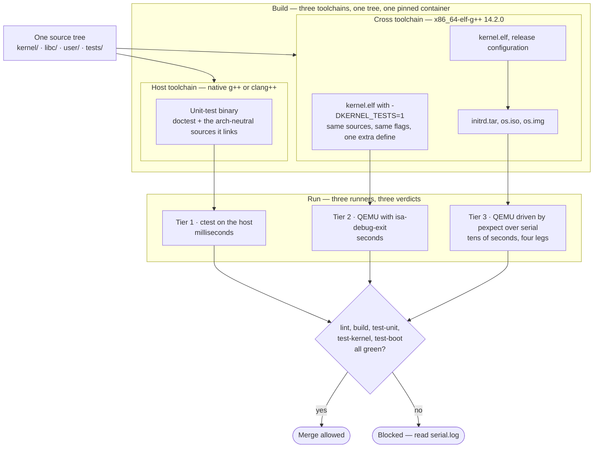

### Walking it

**`One source tree`.** There is exactly one repository holding the kernel, the C library,
the userspace programs and all three tiers of test
([[ADR-0008 - Monorepo Layout]], [[07 - Repository Layout]]). Tests are not a separate
project that lags behind. `tests/unit/`, `tests/kernel/` and `tests/integration/` sit beside
`kernel/`, version together, and are reviewed in the same pull request as the code they
test.

**The two toolchain boxes.** One tree, but two compilers, because Tier 1 must produce a
binary your laptop can execute and Tiers 2 and 3 must produce a binary a bare x86-64 machine
can execute. `cmake/x86_64-kernel.cmake` selects `x86_64-elf-g++`; the host tests use the
native compiler with no cross flags at all. [[08 - Build System]] keeps these apart with
CMake's superbuild mechanism specifically so the freestanding kernel flags
(`-ffreestanding`, `-mno-red-zone`, `-mcmodel=kernel`) never contaminate a host test
binary, and so the host's standard library never contaminates the kernel. A test file is
allowed to `#include <string.h>` and call `strcmp`; the kernel it tests is not
([[ADR-0007 - Freestanding C++20 as the Kernel Language]]).

**`Unit-test binary`.** This links the *actual kernel source files* — not copies, not
mocks — for every subsystem whose logic is architecture-neutral. `kernel/lib/printf.cpp`
compiles unmodified for x86-64 Linux. That is not luck; §3.1 shows the single design
decision that makes it possible.

**`kernel.elf with -DKERNEL_TESTS=1`.** A second configuration of the same kernel, with
`tests/kernel/` compiled in and a different entry path that runs the tests instead of
spawning `init`. [[ADR-0010 - Testing Strategy and the QEMU Exit Device]] is explicit that
this must remain "same sources, same flags, one extra `-DKERNEL_TESTS=1`". The moment the
test kernel and the release kernel diverge in flags, the test kernel is testing a program
you do not ship.

**`kernel.elf, release configuration` → `initrd.tar, os.iso, os.img`.** Tier 3 tests the
release artefacts, byte for byte the same files a user would download
([[11 - Release and Deployment]]). Testing a specially-built "test image" here would defeat
the entire purpose of the tier, which is to catch mistakes made during *assembly* — a
bootloader configuration typo, a missing file in the ESP, a partition table that only some
firmware likes.

**The three runners.** All three are invoked through `scripts/test.sh`, which is what
`make test-unit`, `make test-kernel` and `make test-boot` call. Tier 1 runs a native
binary under `ctest`. Tier 2 launches QEMU with one extra device attached and reads the
*process exit status* to learn the verdict. Tier 3 launches QEMU, attaches to its serial
port, types at it and asserts on what comes back.

**The gate.** Branch protection on `master` requires all five CI jobs — `lint`, `build`,
`test-unit`, `test-kernel`, `test-boot` — and with a four-leg matrix GitHub reports each
boot leg as its own check, so all four legs must be selected or the gate has a hole
([[Stage 0.9 - CI From Day One]] §4, [[12 - Team Workflow]]).

**`Blocked — read serial.log`.** Every failing job uploads the kernel's own account of what
happened. That artefact, not the CI log, is where a kernel failure is diagnosed
([[10 - CI Pipeline]]).

### The economics, which is why there are three and not one

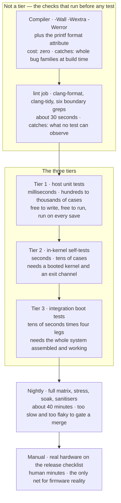

**Read this top to bottom as a cost gradient.** Each step down costs more per run, produces
fewer assertions per second, and — crucially — catches bugs the step above it *structurally
cannot see*. That last property is the argument for having more than one tier at all. If
Tier 2 merely did Tier 1's job more slowly, you would delete Tier 1. It does not.

**`Compiler`.** The cheapest bug elimination in the project. `-Werror` is on from commit
one, because turning it on later means fixing hundreds of warnings at once, which nobody
ever does. The `__attribute__((format(printf, N, M)))` annotation on every printf-like
declaration converts a whole family of silent runtime corruption — `kprintf("%s", 42)`
dereferencing the address `0x2A` — into a build failure with no runtime cost whatsoever
([[Stage 1.6 - kprintf]] §3).

**`lint job`.** Six greps that enforce architectural rules no test can observe, because the
violations they catch do not change behaviour *until they do*, months later, at random. The
canonical one: every kernel translation unit must be compiled with `-mno-red-zone`, and a
single file missing it produces random memory corruption discovered weeks later in code
that is not at fault ([[08 - Build System]]). No assertion anywhere can detect that. A grep
over `compile_commands.json` can, in under a second. The others confine `limine.h` to
`kernel/arch/x86_64/boot/`, confine inline assembly to `kernel/arch/`, forbid the kernel
including userspace headers, forbid `__DATE__`/`__TIME__` (which break reproducible
builds), and forbid a `TODO` without an issue number.

**Tiers 1 → 3.** Detailed in §3.

**`Nightly`** and **`Manual`** are deliberately outside the merge gate. A stress test that
fails one run in fifty is worse than no test on a merge gate, because it trains everyone to
press re-run without reading the output — and once that habit exists, the gate protects
nothing ([[10 - CI Pipeline]]).

---

## 3. Zooming in

### 3.1 Tier 1 — host unit tests, and why `kprintf` is the flagship

Tier 1 compiles kernel source for the *host* and runs it natively. Full debugger, full
speed, ordinary tools, no emulator. The suite finishes in milliseconds, which means it can
run on every file save rather than every coffee break, and a test you run a hundred times a
day catches bugs a test you run twice a week does not.

`kprintf` is the flagship example, and [[Phase 1 - Overview]] says why in one line:

> `kprintf` is the ideal Tier-1 candidate: pure logic, enormous edge-case surface, and a
> bug in it will mislead you about *every other* subsystem for years.

Read the last clause literally. A formatter bug does not announce itself with a crash; it
produces a *plausible number*. If `%p` drops the top 32 bits, you read `0x80104A2C` for an
address that is really `0xFFFFFFFF80104A2C`, conclude your higher-half mapping is broken,
and spend a day in [[Phase 4 - Overview]] rewriting a page-table walker that was correct.
The formatter is the instrument you measure every other subsystem with. An instrument that
is wrong is worse than no instrument, because you believe it.

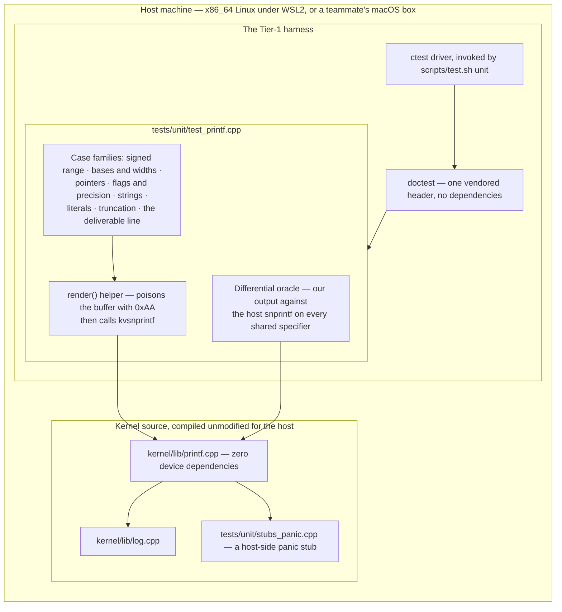

#### Walking it

**`Host machine`.** The primary host is x86-64 Linux under WSL2, which shares the target's
LP64 data model and its System V `va_list` representation. That equivalence is *why the
test is meaningful* — `%lu`, `%zu` and pointer width behave on the host exactly as they will
on the target. And running the same suite on the macOS teammate's machine, where `va_list`
is represented differently, is a **feature**: it catches the class of bug where a `va_list`
is passed by value instead of forwarded correctly, which is invisible on Linux and fatal on
macOS.

**`doctest`.** A single vendored header, no build dependencies, no package manager. Chosen
because a test framework that needs its own dependency tree is a test framework that
eventually breaks the build on a machine you do not own.

**`ctest driver`.** `scripts/test.sh unit` configures a *separate* build directory with
`-DBUILD_HOST_TESTS=ON`, builds it, and runs `ctest --output-on-failure`. Separate
directory, separate toolchain, no contamination in either direction.

**`render() helper`.** Fills the output buffer with the poison byte `0xAA` before every
call. That single line converts "the formatter forgot to write the NUL terminator" from a
test that passes by luck into a test that fails reliably — without the poison, whatever the
previous test left in the buffer might happen to be a zero.

**`Case families`.** Thirty-three documented cases in [[Stage 1.6 - kprintf]] §6, and the
list is the point: `%lld` of `INT64_MIN` (the value that cannot be negated, and the single
most common integer-formatting bug in existence), `%d` of `0` (which distinguishes a
`do…while` from a `while` in the digit loop), `%x` of `-1` reading 32 bits while `%lx` of
`-1L` reads 64, `%08d` of `-42` producing `-0000042` with the sign *before* the zeros,
`%s` of a null pointer producing `(null)` rather than a fault, `%.2s` on a two-byte array
with no terminator, and `ksnprintf` truncating to four characters while returning **8**,
because C99 says the return value is what *would* have been written. Every one of these is
a real bug someone has shipped.

**`Differential oracle`.** For every specifier the host's C library also implements, the
test runs both formatters and compares. This is the highest-leverage test in the tier: it
converts decades of glibc's own edge-case handling into your test oracle for free. `%p` and
`%b` are excluded, because glibc's pointer formatting is its own convention and `%b` is our
extension.

**`kernel/lib/printf.cpp`, compiled unmodified.** This is the load-bearing architectural
fact, and it is not an accident. The formatter's core emits characters through a callback,
`void (*)(void*, char)` — it never learns whether a character is going to a UART, a
framebuffer, a memory buffer, or a doctest capture. That indirection is what gives
`printf.cpp` **zero device dependencies**, which is exactly what lets it compile on the
host ([[Stage 1.6 - kprintf]] §3). Testability was not bolted on afterwards; the shape that
makes it testable is also the shape that lets one formatter serve `klog`, `ksnprintf` and
the panic path.

> [!example] The design constraint, stated generally
> Tier 1 only works on code that takes its dependencies as parameters instead of reaching
> for globals or hardware. That is why `kernel/mm/` and `kernel/arch/x86_64/mm/` are
> separate directories ([[ADR-0008 - Monorepo Layout]]): the allocator's *arithmetic* is
> host-testable, and only the page-table *writes* need real hardware. This is not a tax
> paid for tests. It is better architecture that tests happen to require, and if you
> deleted every test tomorrow you would still want the split.

**What else belongs in Tier 1.** Bitmap and buddy allocator bit arithmetic; the `string.h`
implementations; FAT32 cluster-chain walking, long-filename reassembly and 8.3 name
generation; ext2 inode and block-group arithmetic; ELF header parsing *including malformed
input*; tar parsing with its octal size fields and 512-byte padding rule; the scheduler's
run-queue selection over a synthetic task list; path canonicalisation of `.`, `..`, `//`
and trailing slashes; ring buffer wraparound; TCP sequence-number and window arithmetic.
The common thread: bytes in, bytes out, no hardware.

---

### 3.2 Tier 2 — in-kernel self-tests, and the escape channel

Tier 2 answers the questions Tier 1 structurally cannot: does `map_page` actually make the
address readable? Does unmapping actually fault, with the right address in `CR2`? Does the
context switch resume a task with its callee-saved registers intact? Does an IRQ actually
arrive, and does the End Of Interrupt signal let the next one through? Does a general
protection fault raised from ring 3 land in the right handler with the right error code?
Are atomics actually atomic across cores?

None of those can be faked on a host. All of them require a real CPU executing real
privileged instructions against real hardware tables. So the test runs *inside the kernel*,
in ring 0, on QEMU's model of the machine. The hard part is not running the test. The hard
part is **getting the answer out**, because a kernel has no parent process to return an exit
code to. It owns the machine.

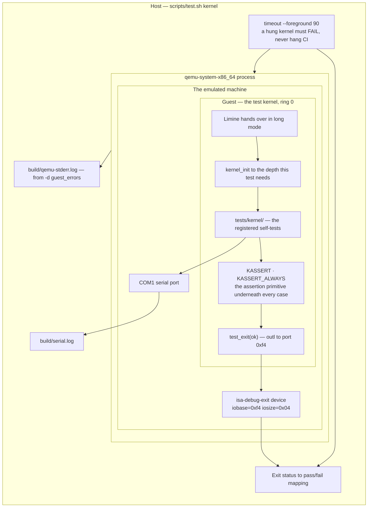

#### Walking it

Read this diagram from the outside in — that nesting is the whole idea. The runner script
contains a `timeout`, which contains a QEMU process, which contains an emulated machine,
which contains a guest kernel, which contains a test registry, which is built on `KASSERT`.
Four levels of containment, and the result has to travel back out through every one of
them.

**`timeout --foreground 90`.** The outermost box, and it is not optional. The characteristic
failure of a kernel is not a wrong answer; it is a *hang* — a spin on a lock nobody
releases, a wait on an interrupt that never arrives, a `hlt` loop after a panic. Without an
outer timeout a hung kernel does not fail the build, it stalls the build, forever. The
scaffold defaults to 90 seconds and `--timeout` overrides it. `timeout` reports status
`124` when it fires, which the runner turns into an explicit "TIMEOUT after Ns — the kernel
hung" and a dump of the serial log.

**`qemu-system-x86_64 process`.** Launched with `-display none` (there is no graphical
backend inside a container), `-m 512M`, `-smp 1` by default, and two flags that matter more
than they look:

> [!warning] `-no-reboot -no-shutdown` is not a convenience flag
> A **triple fault** — a fault raised while handling a fault while handling a fault — makes
> an x86 CPU reset. Without `-no-reboot`, QEMU obliges: the machine reboots, boots your
> kernel again, triple-faults again, and loops. You get a 90-second timeout instead of the
> fault message, having lost the single piece of information you needed. With the flag, the
> machine stops dead at the fault, and QEMU's `-d guest_errors` output in
> `qemu-stderr.log` tells you what it was.

**`Guest — the test kernel, ring 0`.** Same sources, same flags, one extra
`-DKERNEL_TESTS=1`. It boots exactly as the real kernel boots — Limine hands over in 64-bit
long mode with paging already on and interrupts disabled ([[02 - The Boot Chain]]) — and
runs `kernel_init` far enough to have whatever the test under examination needs. A test of
`map_page` needs steps 1 through 9 of the initialisation order in
[[06 - Architecture Overview]]; a test of the IDT needs only 1 through 4. This is why the
initialisation order is a documented, ordered list rather than folklore: Tier 2 tests
depend on being able to stop partway down it.

**`KASSERT` — the primitive.** Every Tier 2 case is ultimately a `KASSERT`. That is stated
outright in [[ADR-0010 - Testing Strategy and the QEMU Exit Device]] and it is the reason
panic and assertion infrastructure had to exist in Phase 0 rather than appearing late: you
cannot write an in-kernel test before you have a way for the kernel to say "this is not
true". There is no `EXPECT_EQ` in ring 0, no test framework, no exception to throw and
nothing to catch it. There is one macro that compares a value and stops the machine with a
report if the comparison fails. §4 gives its exact shape.

**`test_exit(ok)`.** Two instructions of real work: write `0` or `1` to I/O port `0xf4`.
That is the entire escape channel.

**`isa-debug-exit device`.** A QEMU device that exists for exactly this purpose. It watches
one I/O port, and when the guest writes to it, *QEMU itself terminates* with a status
derived from the value written. The guest cannot call `exit()` — there is no operating
system under it to call — so instead it pokes a fake device and the emulator does the
exiting on its behalf. §5.1 walks the protocol in full. This is the same mechanism
`kvm-unit-tests` uses; it is not a hack invented here.

**`COM1 serial port` → `serial.log`.** The verdict is one bit. The *diagnosis* is the serial
log. QEMU's `-serial file:build/serial.log` captures everything the kernel printed, and the
runner prints it on pass and the last 60 lines on failure. This is why serial output is
step 1 of the initialisation order and precedes the framebuffer: from step 1 onward, every
failure is reportable ([[06 - Architecture Overview]], [[Stage 0.6 - Serial Output]]).

**`build/qemu-stderr.log`.** QEMU's own complaints, from `-d guest_errors`: an unassigned
memory access, an invalid instruction, a bad descriptor. When the kernel's log stops mid-line
and tells you nothing, this file usually tells you what the CPU objected to.

> [!question] Why not have the kernel print `PASS` on serial and grep for it?
> Because the absence of `PASS` is ambiguous. A kernel that hung before running any test,
> a kernel that ran the tests and failed, and a kernel that ran and passed but whose serial
> output got truncated all produce a log without `PASS`. Exit statuses are a channel that
> a hung kernel *cannot* accidentally produce — which is exactly the property §5.1 exploits.

---

### 3.3 Tier 3 — integration boot tests, and why four legs

Tier 3 boots the real release image and drives it as a user would: send keystrokes over the
serial port, assert on what comes back. The mechanism is `pexpect` — a Python library that
launches a program, waits for expected output patterns, and types in response — with a
per-step timeout so a hang at any step fails rather than stalls.

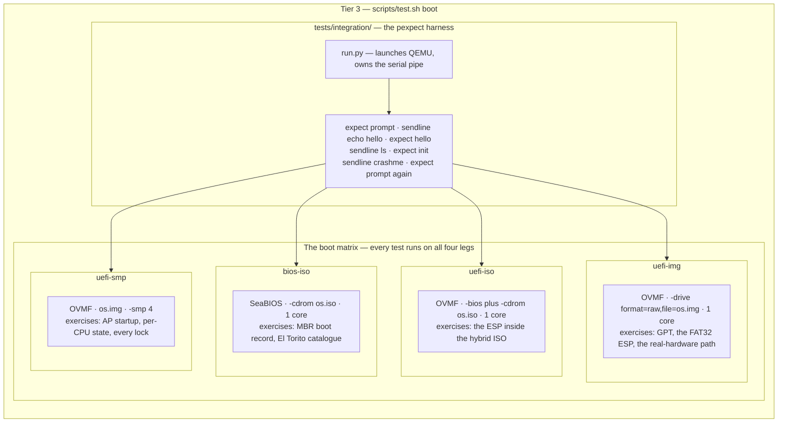

#### Walking it

**`run.py`.** Owns the QEMU process and its serial pipe. Every step has its own timeout, so
a failure reports *which* step hung, not merely that the whole run took too long. The
canonical script is short and reads like a session transcript: wait up to 30 seconds for a
shell prompt, type `echo hello`, expect `hello`, type `ls`, expect `init`, type a program
that deliberately faults, and then **expect the prompt again** — because "a crashing child
does not take down its parent" is a property of the process model that no unit test can
express.

**The four legs, and the reason they exist.** They fail differently. That is the entire
justification, and it is stated bluntly in [[09 - Testing Strategy]]: *a bug that only
appears under UEFI is exactly the bug that ruins a release.*

- **`bios-iso`** is the only leg that executes the legacy boot path at all: the 512-byte
  MBR boot record, the El Torito catalogue that makes an optical image bootable, and the
  16-bit real-mode stage that precedes everything. None of that code runs under UEFI.
- **`uefi-iso`** loads `EFI/BOOT/BOOTX64.EFI` from an EFI System Partition embedded in the
  ISO. If your ISO staging tree forgot a file, this leg is where you find out — and only
  this leg.
- **`uefi-img`** is the path a real machine and a real cloud VM take: a GPT partition
  table, a FAT32 ESP, a second partition for the root filesystem. It is also the leg that
  proves the disk image is bootable at all, which the ISO legs never touch.
- **`uefi-smp`** boots the same image with four cores. Every lock in the kernel is
  exercised concurrently here and nowhere else in the merge gate. Before
  [[Phase 12 - Overview]] this leg mostly proves the extra processors stay safely parked;
  after it, it is the only routine test of the entire concurrency model.

**`fail-fast: false`.** All four legs run to completion even after one fails. Knowing that
three legs pass and one fails is a diagnosis; knowing that "the boot test failed" is not.

> [!warning] The trap this matrix exists to catch
> The most expensive class of release bug in this project's design is a firmware-specific
> one, because it is invisible on the configuration you develop against. You run `make run`
> all day — that is BIOS and ISO — and the ESP staging bug sits there quietly for six weeks
> until someone writes the image to a USB stick. Four legs on every pull request cost
> roughly three minutes of wall clock, running in parallel. That is the cheapest insurance
> in the project.

---

### 3.4 The CI pipeline as a job graph

CI is not a fourth tier. It is a machine that runs the same three tiers you run locally, on
hardware you do not own, on every push. Its shape is a dependency graph.

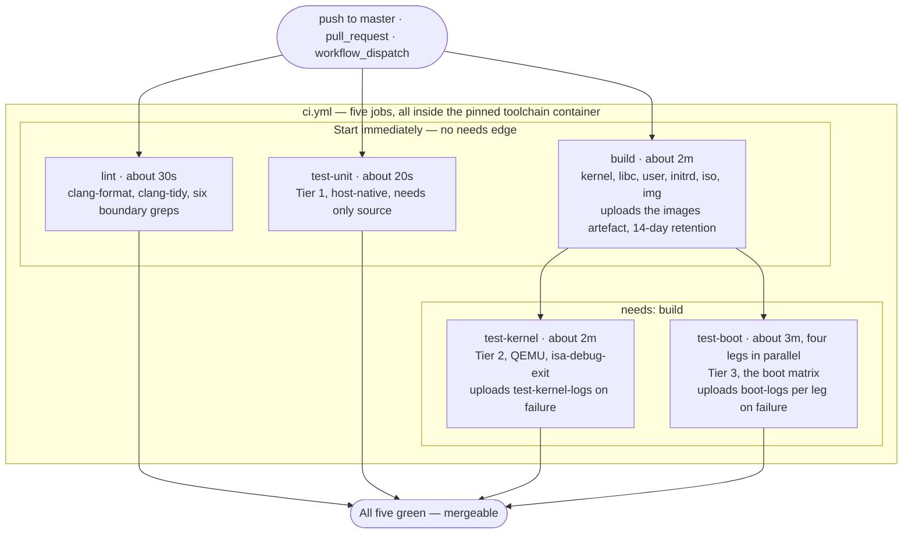

#### Walking it

**The trigger.** Every push to `master`, every pull request, and manual dispatch. Note the
consequence spelled out in [[Stage 0.9 - CI From Day One]] §4: as scaffolded, a push to a
feature branch with *no open pull request* runs nothing. Open the PR early.

**`lint`, `build`, `test-unit` have no `needs:` edge**, so they start together. This is the
cheap-checks-first principle made concrete: there is no point booting a kernel that does not
lint, and `lint` returns in about thirty seconds while `build` is still compiling. A
formatting failure costs you half a minute, not eight.

**`test-unit` needs nothing at all**, not even `build`, because Tier 1 compiles its own
binary from source with the host compiler. Tier 1 is genuinely independent of the kernel
build — a useful property when the cross-compile is broken and you still want to know
whether your allocator arithmetic is right.

**`test-kernel` and `test-boot` both carry `needs: build`.** They consume the images
artefact `build` uploaded. Those are the only two dependency edges in the graph, and that is
deliberate: a graph with more edges is a graph with a longer critical path.

**The container.** Every job declares `container:` pointing at
`ghcr.io/cracked-f/os-toolchain`, **pinned by digest, not by tag**. This is the single most
important property of the pipeline and it deserves its own statement:

> [!example] Why CI runs your container and your make targets
> CI has no private build recipe. No `apt-get` list, no "install the cross-compiler" step,
> no separate script. Every job is `make <target>` inside the same image `make shell` drops
> you into on your laptop ([[ADR-0005 - Containerised Pinned Toolchain]]). It is the same
> `x86_64-elf-g++ 14.2.0`, the same binutils 2.43, the same pinned Limine, the same QEMU.
>
> The property this buys is **reproducibility of failure**. When CI goes red, you reproduce
> it with one command. A CI that can only be debugged by pushing commits and waiting six
> minutes is a CI nobody trusts, and an untrusted CI gets bypassed — first with
> `[skip ci]`, then with admin merges, then not at all. The whole gate collapses, and it
> collapses for a reason that has nothing to do with testing and everything to do with
> whether people believe the machine.
>
> Pinning by *digest* rather than *tag* is the other half. A `latest` tag that moves under
> you means the toolchain updates itself on a morning you had other plans, and the build
> that worked yesterday fails today with no commit to blame. Pinned by digest, updating the
> toolchain is an explicit pull request that changes one line — visible in `git log`,
> reviewable, revertable.

**Caching.** The container image is pulled by digest, `ccache` is keyed on the hash of the
source files, and the Limine checkout is keyed on its pinned tag. Cold cache is about
twelve minutes; warm, about six.

---

## 4. The data structures

Tier 2's data structures are not structs in the usual sense. They are *protocols*: an
encoding of a verdict into a process exit status, a pair of macros with different
build-mode behaviour, and a function-pointer contract. Those are the things that must be
exactly right.

### 4.1 The exit-status encoding

The `isa-debug-exit` device transforms the value the guest writes. This transform is the
architecturally interesting part.

| Item | Value |
|---|---|
| Device | `isa-debug-exit` |
| I/O port base | `0xf4` |
| Port window size | `0x04` bytes |
| Guest writes | `N`, via `outl` |
| QEMU process exit status | `(N << 1) \| 1` |

Worked bit by bit:

| Guest writes `N` | `N` in binary | Shifted left | With low bit set | Exit status |
|---|---|---|---|---|
| `0` | `0000` | `0000` | `0001` | **1** |
| `1` | `0001` | `0010` | `0011` | **3** |
| `2` | `0010` | `0100` | `0101` | **5** |
| `3` | `0011` | `0110` | `0111` | **7** |

**Every producible status is odd.** The low bit is forced to 1, so the guest can never
cause an exit status of `0`. That is not incidental — it is the entire reason the transform
exists, and it reserves `0` to mean one specific, otherwise indistinguishable thing.

| Exit status | Source | `scripts/test.sh` reports |
|---|---|---|
| `1` | guest wrote `0` | **PASS**, and prints `serial.log` |
| `3` | guest wrote `1` | **FAIL**, prints the last 60 lines of `serial.log` and QEMU's stderr |
| `124` | `timeout(1)` fired | **TIMEOUT after Ns — the kernel hung** |
| `0` | QEMU exited on its own | **QEMU exited 0 without writing to the exit device** — the test kernel probably never reached `test_exit()` |
| anything else | — | crash or bad invocation |

**Why the reserved zero matters.** Without the shift, a kernel that wrote `0` for "pass"
and a kernel that never ran the tests at all would both produce exit status 0. A test suite
that silently executed nothing would report PASS forever, and it would keep reporting PASS
as the kernel rotted underneath it. The single most dangerous state a test suite can be in
is *green and not running*, and this one-bit transform is what makes that state
detectable. The runner has an explicit arm for it with its own error message.

**`124` is even, and that is also load-bearing.** Since every guest-produced status is odd,
`timeout`'s `124` can never collide with something the kernel chose. Hang and fail are
distinguishable, always.

> [!warning] The one residual ambiguity, and the cheap defence
> This table maps *guest-produced* statuses. QEMU can also exit on its own account before
> the guest ever runs — a bad command line, a missing image file, unavailable firmware —
> and those statuses are not guaranteed to be distinct from the guest's. The defence is
> already in the script and costs nothing: it prints `serial.log` **on pass**, not only on
> failure. A PASS with an empty serial log means QEMU never ran your kernel. Read the log
> on green runs occasionally; it is the only way to notice a suite that has quietly stopped
> executing.

> [!warning] Do not encode "which test failed" in `N`
> It is tempting to write the failing test's index to the port. Resist. A POSIX exit status
> is a single byte, so you get 128 usable values at best, and the moment you use them the
> reserved-zero property and the odd/even property both become harder to reason about. The
> exit status carries one bit: pass or fail. *Which* test failed, with what expected and
> actual value, at which file and line, goes on the serial port, where there is no width
> limit and the answer is human-readable.

### 4.2 The assertion macros

```cpp
#define KASSERT_ALWAYS(cond)                                                   \
    do {                                                                       \
        if (!(cond)) [[unlikely]] {                                            \
            panic("assertion failed: %s\n  at %s:%d", #cond, __FILE__,         \
                  __LINE__);                                                   \
        }                                                                      \
    } while (0)

#ifdef NDEBUG
#  define KASSERT(cond) do { (void)sizeof((cond)); } while (0)
#else
#  define KASSERT(cond) KASSERT_ALWAYS(cond)
#endif
```

| Macro | Debug build | Release build (`NDEBUG` defined) | Use for |
|---|---|---|---|
| `KASSERT(c)` | evaluates `c`, panics if false | parsed and type-checked, **never evaluated** | invariants generally |
| `KASSERT_ALWAYS(c)` | evaluates `c`, panics if false | **identical** — never compiles out | cheap checks whose violation corrupts state |

Four properties of this shape matter to the test architecture:

- **`do { … } while (0)`** makes the macro one statement, usable anywhere a statement is
  legal, so `if (x) KASSERT(y); else z();` parses as written. Bare braces break the `else`;
  a bare `if` silently swallows it.
- **`#cond`** stringifies the *source text* of the condition, so a failure prints
  `assertion failed: is_aligned(addr, PAGE_SIZE)` — the expression you wrote — rather than
  its expansion. That is what makes a Tier 2 failure self-explanatory in `serial.log`
  without opening a file.
- **`__FILE__` and `__LINE__` expand at the call site**, which is how one macro in one
  header reports a line number in a thousand other files. `-ffile-prefix-map` (already set
  for reproducible builds) normalises the path, so the panic output is byte-identical on
  your machine, your teammate's macOS box, and CI. That matters more than it sounds: it
  means you can diff two failure logs.
- **The release form uses `sizeof`**, an unevaluated operand. The condition is still parsed
  and type-checked and every variable in it still counts as used, so an assert cannot rot
  while `NDEBUG` is on — but no code is generated. The cost of that: **a `KASSERT`
  condition must have no side effects.** `KASSERT(list_remove(node) == 0)` works until the
  release build, where the node is never removed and you have shipped a leak that does not
  reproduce in debug.

### 4.3 The sink contract that makes Tier 1 possible

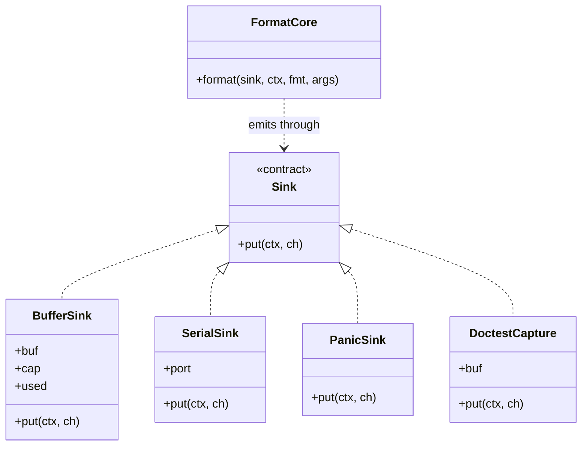

#### Walking it

**`FormatCore`** is the parser and digit converter. It never learns where a character is
going; it calls `put(ctx, ch)` once per character. That is one indirect call per character —
the entire cost of the design.

**`SerialSink`** writes to COM1. **`PanicSink`** writes synchronously and deliberately
bypasses the log ring, because the ring is one of the things that might be corrupt when
panic runs. **`BufferSink`** is `kvsnprintf`: fifteen lines that accumulate into memory and
implement the C99 truncation convention. **`DoctestCapture`** is the same idea inside the
Tier 1 harness.

**The arrow that matters is the one that is missing.** `FormatCore` has no edge to any
device, any global, or any header outside the freestanding set. That absence is what lets
`printf.cpp` compile for the host, and it generalises: **every box in the kernel that has
no outgoing edge to hardware is a box Tier 1 can test.** When you are deciding where a new
subsystem's boundary goes, that is the question to ask.

### 4.4 The CI graph as data

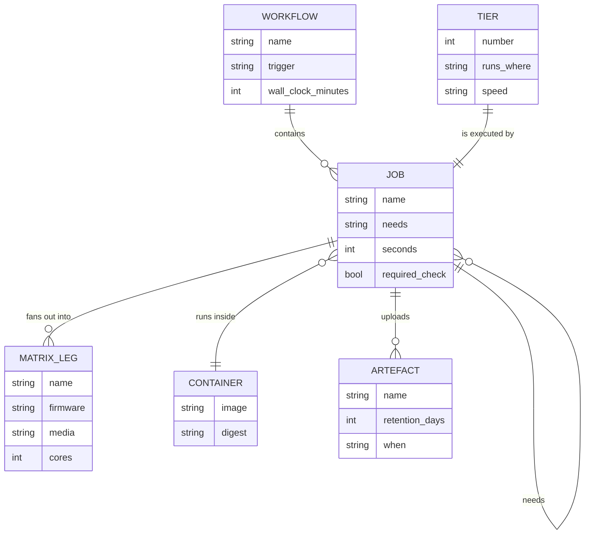

#### Walking it

A **workflow** is a YAML file that contains **jobs**. There are four workflows: `ci.yml`
(every push and PR, about six minutes, the merge gate), `nightly.yml` (03:00 UTC, about
forty minutes), `release.yml` (on a `v*` tag, about fifteen minutes) and `toolchain.yml`
(on changes under `toolchain/`, about twenty-five minutes).

A **job** *needs* zero or more other jobs — the self-relationship is the `needs:` edge that
turns a flat list into the graph in §3.4. A job **runs inside** a container identified by an
immutable digest. A job **uploads** artefacts, each with a retention period and a condition:
`build` uploads `images` always, for fourteen days; `test-kernel` and `test-boot` upload
logs only on failure.

A job **fans out into** matrix legs, each a `(firmware, media, cores)` triple. This is the
relationship that produces four separate GitHub status checks from one job definition, and
the reason branch protection must name all four.

Each **tier** maps onto exactly one job: Tier 1 to `test-unit`, Tier 2 to `test-kernel`,
Tier 3 to `test-boot`. That one-to-one correspondence is worth preserving. A CI job that
runs "some of Tier 1 and a bit of Tier 2" is a job whose failure does not tell you which
kind of bug you have.

---

## 5. The flows

### 5.1 The `isa-debug-exit` protocol — the happy path and both failures

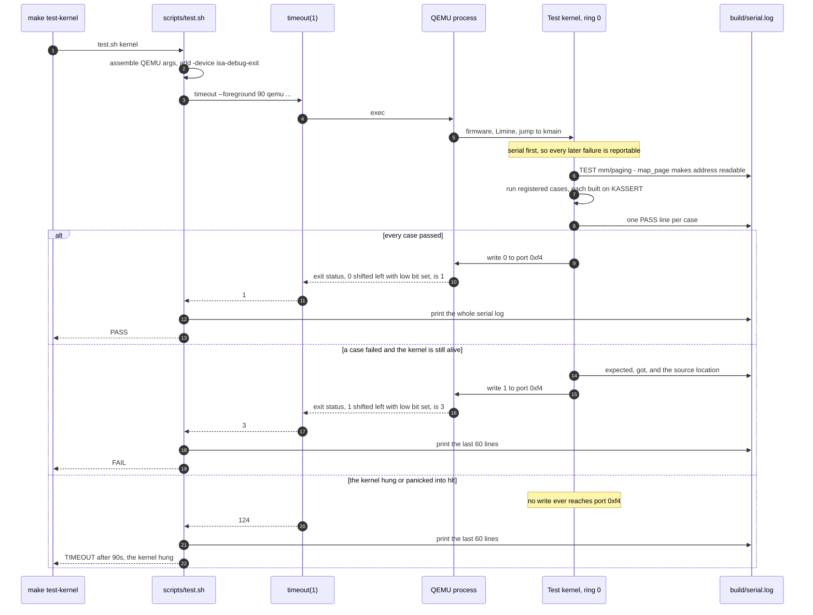

#### Walking it

**Steps 1–3.** `make` is a thin wrapper. All the logic is in `scripts/test.sh`, which
assembles the QEMU command line from `--firmware`, `--media`, `--smp`, `--mem` and
`--timeout` options with sane defaults. `-device isa-debug-exit,iobase=0xf4,iosize=0x04` is
added **only for Tier 2** — Tier 3 does not use it, because a booted system's verdict comes
from what it says on the serial port, not from a magic port write.

**Steps 4–6.** `timeout` execs QEMU; QEMU runs firmware, which runs Limine, which loads the
kernel and jumps to `kmain` in 64-bit long mode with paging on and interrupts disabled.
Note who holds control: from the moment QEMU starts, the host script is *blocked*. It has
no visibility into the guest at all. Everything it will ever learn arrives through exactly
two channels — the serial file and the eventual exit status.

**Step 7, the `Note`.** Serial is initialised first, before anything else in
`kernel_init`. That ordering is the reason a Tier 2 failure is ever diagnosable: a failure
at initialisation step 2 can be reported because step 1 already works
([[06 - Architecture Overview]]).

**Steps 8–10.** The kernel writes a line per case as it goes. Streaming the results rather
than buffering them to the end is deliberate — if case 7 hangs the machine, the log ends
after case 6 and you know precisely where you are.

**The `alt` block — three exits, and the asymmetry between them.**

*Pass:* one `outl` of zero. QEMU computes `(0 << 1) | 1 = 1` and terminates. `timeout`
passes the status through unchanged. The script prints the whole serial log, so a green run
still shows you what ran.

*Fail:* the kernel prints the specifics — expected, got, and the source location that
`KASSERT`'s `__FILE__`/`__LINE__` produced — and then writes `1`. Exit `3`. Note that this
arm requires the kernel to still be *capable* of running code after the failure, which is
the case for a test that compares two values and records a mismatch, and is not the case
for a `KASSERT` that fires. Which brings us to the third arm.

*Hang:* nothing is ever written to `0xf4`. QEMU never exits. Ninety seconds later `timeout`
kills it and returns `124`. The script says so, in those words, and dumps the log. This arm
is not a degenerate case — it is the **most common** Tier 2 failure, because a failing
`KASSERT` calls `panic`, and panic's last step is `for (;;) { cli; hlt; }` by design
([[Stage 0.7 - Panic and KASSERT]]). §5.2 walks that.

### 5.2 A failing `KASSERT` inside a Tier 2 test

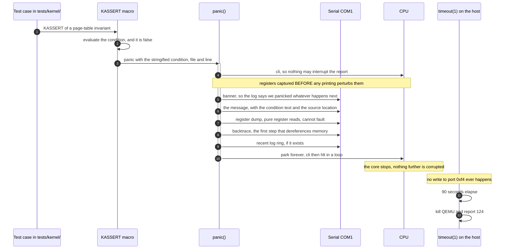

#### Walking it

**Steps 1–3.** The condition is false, so the macro calls `panic` with the stringified
condition and the call site's file and line. There is no way to "return a failure" here —
`panic` is `[[noreturn]]` and the compiler knows it.

**Step 4, `cli`.** One instruction, cannot fail. Until [[Phase 2 - Overview]] installs an
IDT, *any* interrupt during the report is a triple fault, and after Phase 2 an interrupt
landing mid-report scrambles the output or re-enters panic fatally.

**The `Note` about register capture.** The values are read before step 5 prints anything,
because the printing code itself would overwrite the caller-saved registers. The dump
distinguishes what is trustworthy from what is not: `rbx`, `rbp`, `r12`–`r15` are
callee-saved and still hold the caller's values; `rax`, `rcx`, `rdx`, `rsi`, `rdi`,
`r8`–`r11` were already clobbered by the call to `panic` itself and are printed for
completeness, not for truth.

**Steps 5–9 are ordered by increasing likelihood of failure.** The banner is
unconditional so the log says *something* even if everything below it dies. The message is
next because it is the most valuable line. The register dump is pure register reads and
cannot fault. The backtrace is the first step that dereferences memory, so it is the first
step that can fault — which is why it comes after everything that must survive. The log ring
comes after that, because a corrupt ring buffer is a plausible cause of the panic in the
first place.

**Steps 10–11, the park.** The core stops. The machine freezes in the state closest to the
cause, which is the state you want to inspect.

**Steps 12–14, on the host.** No `outl` happens, so QEMU keeps running a halted machine
forever, and the outer `timeout` is the only thing that ends the run. **The verdict arrives
as `124`, not `3`** — and the diagnosis is not lost, because everything panic printed is
sitting in `serial.log`, which the runner dumps.

> [!question] Should the test build route panic's last step into `test_exit(false)`?
> There is a real design choice here, and it is worth arguing in the room. Turning the
> final `hlt` loop into `test_exit(false)` under `-DKERNEL_TESTS=1` converts every failing
> `KASSERT` from a 90-second timeout into an immediate exit 3 — faster CI, and a verdict
> that names the right category. Against it: the test build then differs from the release
> build in the one code path whose behaviour you most want to be identical, and a panic
> that exits cleanly is a panic that can no longer be inspected in a live GDB session
> attached with `make debug`. Either answer is defensible; what is not defensible is not
> knowing which one your `tests/kernel/` does. Check it, and write it down.

### 5.3 A Tier 3 run

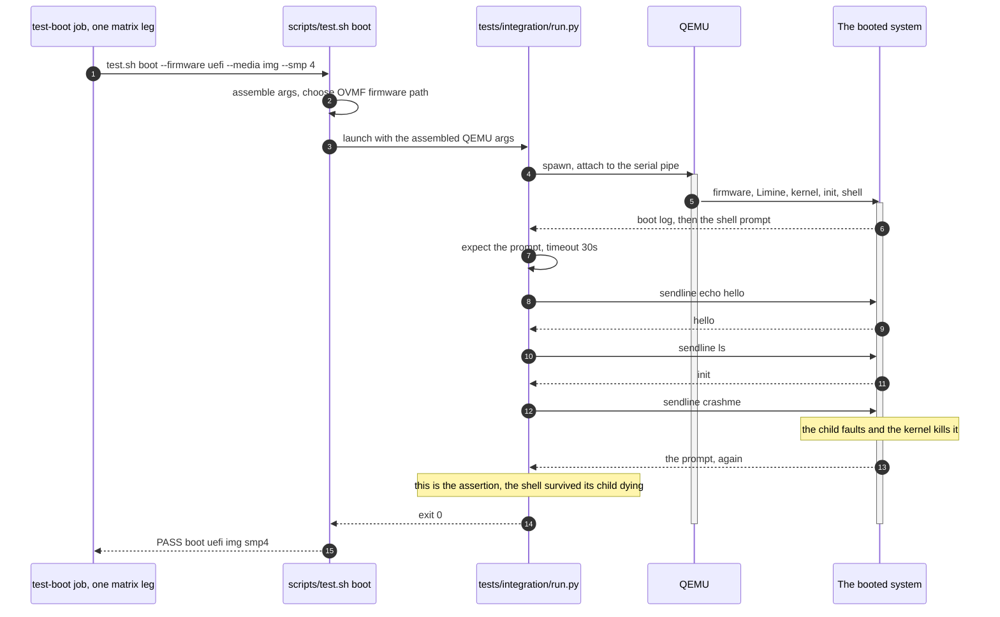

#### Walking it

**Steps 1–2.** The matrix leg's parameters arrive as command-line options. The script
resolves the OVMF firmware path by probing several well-known locations, because it differs
between Ubuntu 24.04, older Debian, and Homebrew QEMU on macOS — a small piece of
portability that pays for itself the first time a teammate on a different distribution runs
the suite.

**Steps 3–5.** `pexpect` owns the process and the serial pipe. Every `expect` has its own
timeout, so the failure message identifies which step hung.

**Steps 6–8.** The system boots all the way through the initialisation order to spawning
`init` in ring 3. Reaching the prompt at all is the first assertion, and in early phases it
is the *only* one.

**Steps 9–13.** The harness types and asserts, exactly as a human would. `echo hello`
proves the shell parses and a program runs. `ls` proves the filesystem is mounted and
readable.

**Steps 14–16, the important one.** `crashme` faults deliberately. The assertion is that
**the prompt comes back** — that the kernel killed one process and left the rest of the
system standing. That is a property of the process model, the fault handler, the scheduler
and the shell all being correct together, and there is no smaller test that can express it.

**Steps 17–18.** Exit 0 from the Python harness is the verdict. Tier 3 does not use
`isa-debug-exit`, because here there *is* a normal process to return a status: the harness
itself.

---

## 6. Why it is shaped this way

### 6.1 The decisions

| Decision | Option | Cost | Verdict |
|---|---|---|---|
| How many tiers | One (host only) | Cannot test paging, interrupts, context switch, firmware — most of a kernel | ❌ |
| | One (QEMU only) | Every test costs seconds; formatter edge cases become unaffordable to enumerate | ❌ |
| | **Three, with different mechanisms** | Three harnesses to maintain; a judgement call per test | ✅ |
| Tier 2 result channel | Grep serial output for `PASS` | Absence of `PASS` is ambiguous between hang, fail and truncation | ❌ |
| | GDB scripting against the guest | A second moving part in the failure path; slow; fragile | ❌ |
| | **`isa-debug-exit` port write** | Needs a QEMU-specific device; two exit statuses to remember | ✅ |
| Exit encoding | Raw value | Exit 0 cannot distinguish "passed" from "never ran" | ❌ |
| | **`(N << 1) \| 1`** | Statuses are 1 and 3 rather than 0 and 1, which surprises people once | ✅ |
| Hung kernel | Let it run | CI stalls indefinitely; the queue backs up behind it | ❌ |
| | **Hard outer `timeout`** | A slow machine can produce a false timeout; tune the value | ✅ |
| Triple fault | Default QEMU reboot | Reboot loop, timeout, no fault message — the evidence is destroyed | ❌ |
| | **`-no-reboot -no-shutdown`** | The process must be killed by the timeout | ✅ |
| Boot coverage | Test one configuration | Firmware-specific bugs ship | ❌ |
| | **Four legs on every PR** | About three minutes, in parallel | ✅ |
| CI environment | CI-specific setup | Failures reproduce only by pushing commits; trust erodes; gate collapses | ❌ |
| | **Same container, same `make` targets** | The container must be built and pushed; digest pinned by hand | ✅ |
| Invariant violation | Return an error | The caller ignores or "handles" it; the bug survives and moves | ❌ |
| | **`KASSERT` → panic** | The machine stops; you must reboot to continue | ✅ |
| Hostile input | `KASSERT` | A three-line user program halts the machine — a denial of service, then a security bug | ❌ |
| | **Return a negative errno** | One branch, and a decision at every boundary | ✅ |

The relevant decision records: [[ADR-0010 - Testing Strategy and the QEMU Exit Device]] for
the tiers and the exit device, [[ADR-0005 - Containerised Pinned Toolchain]] for the shared
container, [[ADR-0008 - Monorepo Layout]] for the arch split that makes Tier 1 possible.

### 6.2 Assert, or return? The decision that runs through the whole kernel

This is the most consequential judgement in the test architecture, because it decides which
failures stop the machine and which are the caller's problem. It is rule 7 of
[[13 - Coding Standards]].

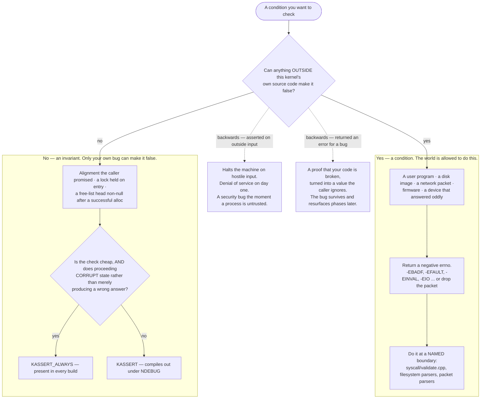

#### Walking it

**The one question at the top** decides everything: *can anything outside this kernel's own
source make this false?* Everything below is consequence.

**The `Yes` branch — conditions.** A user program can pass `close(999999)`. A disk image
can contain a block number past the end of the device. A packet can declare a length that
does not match its bytes. None of those are bugs in your kernel; they are the world doing
something the world is allowed to do, and your kernel's job is to reject them cleanly and
carry on. The treatment is a negative errno, Linux-style, returned in `rax`
([[06 - Architecture Overview]]).

**`Do it at a NAMED boundary`.** The check should live in a place with a name —
`kernel/syscall/validate.cpp`, the filesystem parser, the packet parser — not scattered
through the code that consumes the value. This is what makes the trust boundary *visible* in
the tree, and it is what lets a reviewer answer "where is this validated?" by opening one
file.

**The `No` branch — invariants.** These are facts your own code guarantees by construction.
If one is false, the code is wrong and every line after it runs on a false premise. In
kernel context there is no containment: no process to kill, no exception to throw, no
supervisor to notice. So you stop, and you stop *loudly*, while the machine is still in the
state closest to the cause.

**The second question** picks which macro. `KASSERT_ALWAYS` when the check is cheap
relative to the work around it *and* proceeding corrupts state — free-list magic numbers,
page-table-entry sanity before a write, lock-rank ordering, "this index is inside this array
before I write through it". `KASSERT` otherwise: arithmetic preconditions, consistency
checks in settled code, anything in a tight loop. By [[Phase 12 - Overview]] there will be
hundreds of asserts, and a test-and-branch on every page-fault path is a real cost you would
like to stop paying once the code is trusted.

**The dashed arrows are the two ways to get it backwards, and they fail differently.**

> [!warning] Asserting on input the outside world controls
> `KASSERT(fd < MAX_FD)` in a syscall handler means a three-line user program calling
> `close(999999)` halts the machine. That is a denial of service on day one, and once
> processes exist and one of them is untrusted it is a **security bug**: an unprivileged
> program has a reliable one-instruction way to take the system down. These are easy to
> write because the assert *reads* as defensive. It is the opposite — it converts a
> rejectable input into a fatal one.

> [!warning] Returning an error for a broken invariant
> `if (!is_aligned(addr, PAGE_SIZE)) return -EINVAL;` is worse than it looks. You have taken
> a proof that your own code is broken and turned it into a return value the caller almost
> certainly ignores — or, worse, *handles*, by retrying or falling back or logging at debug
> level. The bug survives. The misaligned address came from somewhere, that somewhere is
> still wrong, and the next symptom is a corrupt page-table entry discovered in
> [[Phase 12 - Overview]] as a scheduler fault. You spent the one moment where the bug was
> cheap to find and bought nothing.

**Where the answer flips.** At a trust boundary, the same check is an assert on one side and
an error return on the other. `sys_read` validates its `fd` and returns `-EBADF`; the
internal `file_read(File*, ...)` it then calls may `KASSERT(f != nullptr)`, because by that
point the value was validated by kernel code and a null is a bug in that validation.

### 6.3 What each tier can and cannot catch

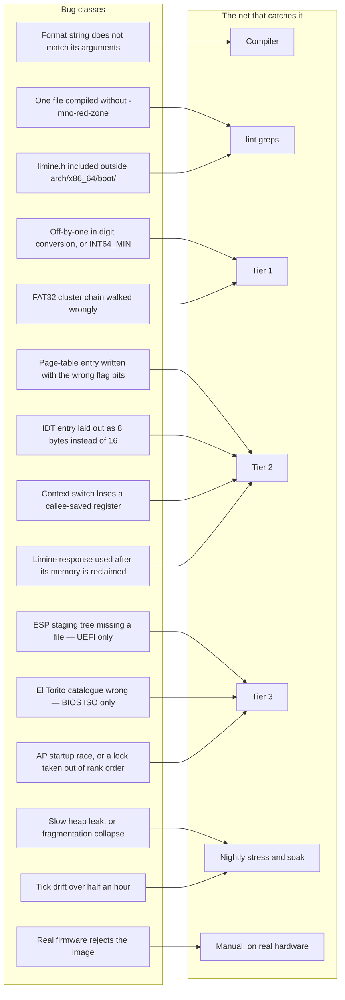

#### Walking it

Every bug class on the left has exactly one arrow. That is the point of the diagram and it
is not a simplification for teaching — it is close to literally true, and it is the reason
deleting a tier is not a cost saving.

**`G1` → `Compiler`.** No test catches a `%s` given an integer, because the wrong output is
*plausible*. The format attribute catches it at build time, at zero cost.

**`G2`, `G3` → `lint greps`.** Neither changes behaviour today. A missing `-mno-red-zone`
produces corruption weeks later; a leaked `limine.h` produces nothing at all until the day
you want to change bootloader and discover the protocol has grown into forty files. Both
are invisible to every test that exists, and both are a one-second grep.

**`G4`, `G5` → `Tier 1`.** Pure arithmetic over bytes. Testable in milliseconds, with
hundreds of cases, under a debugger. Tier 2 *could* catch these, in the sense that a wrong
number would eventually be printed — but you would be enumerating edge cases at seconds per
run, so you would enumerate ten instead of thirty-three, and `INT64_MIN` would not be one of
them.

**`G6`, `G7`, `G8`, `G9` → `Tier 2`.** No host can express these. A page-table entry only
means something to a real MMU. An IDT entry only means something to a real CPU delivering a
real interrupt. A context switch only means something when real registers are really
restored. And `G9` — using a Limine response after Phase 4 reclaims bootloader-reclaimable
memory — is a bug whose only symptom is a fault long after the mistake, on a real memory
map ([[02 - The Boot Chain]]).

**`G10`, `G11`, `G12` → `Tier 3`, and each on exactly one leg.** This is the sharpest
argument for the matrix. `G10` is invisible on both BIOS legs. `G11` is invisible on both
UEFI legs. `G12` is invisible on every single-core leg. Drop any leg and you have created a
blind spot with a name.

**`G13`, `G14` → `Nightly`.** A leak of a few bytes per iteration needs a million
iterations to become visible; drift needs half an hour of wall clock. Neither fits in a
six-minute merge gate, and forcing them in would make the gate slow *and* flaky.

**`G15` → `Manual`.** There is no hardware runner. QEMU is not a PC; it is a very good
model of one, and real firmware has opinions QEMU does not. This is a checklist item at
release time ([[11 - Release and Deployment]]), performed by a human.

### 6.4 What is deliberately not tested

Recorded so that these are decisions rather than oversights. Every one of them is a place
where a test would cost more than it is worth, or would measure the wrong thing.

| Not tested | Why | What we do instead |
|---|---|---|
| **Timing precision** | QEMU's timing is not real timing. Asserting that a 10 ms sleep returns *near* 10 ms measures the emulator's scheduling, not your kernel | Assert that a sleep returns **after** its deadline, never that it returns near it |
| **Real hardware, in CI** | There is no hardware runner, and buying one adds a machine that must be maintained, secured and physically reset when it wedges | A manual entry on the release checklist ([[11 - Release and Deployment]]) |
| **Performance** | Benchmarking emulated hardware measures QEMU. A 20% "regression" may be the host being busy | No benchmarks in v1. Correctness first |
| **Fuzzing** | Real value, real cost, and the obvious first target — the syscall boundary — does not exist until [[Phase 6 - Overview]] | Post-1.0. Syscall-boundary fuzzing is the first target when it happens |
| **Coverage as a gate** | Coverage is measurable only on Tier 1. Gating on it would push people to write host tests for code that should have been tested in ring 0 | `gcov`/`lcov` on Tier 1 as a **diagnostic**: 80% on `kernel/lib/`, the neutral parts of `kernel/mm/`, and `kernel/fs/` parsing. No target elsewhere |
| **Kernel-context coverage** | Not meaningfully measurable in this setup, and pretending otherwise invites gaming the number | Judge Tier 2 by whether each hardware interaction has a test, not by a percentage |

> [!warning] The failure mode of a coverage target
> A coverage number applied to code that cannot be host-tested produces theatre, not
> quality. The predictable response is that someone writes a host test that constructs a
> fake page table in an array, walks it with the real walker, and asserts on the result —
> 100% line coverage of `paging.cpp`, and zero evidence that a real MMU agrees. The number
> goes up and the kernel does not get better. This is why coverage is reported and never
> required.

---

## 7. How this grows across the phases

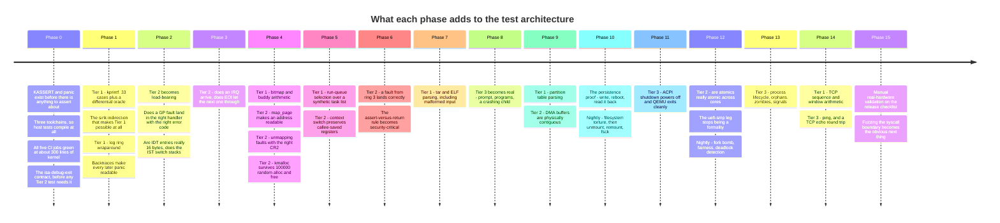

### What is deliberately missing early, and why that is acceptable

**Phase 0 turns on all five CI jobs when the kernel is about three hundred lines and there
is essentially nothing to test.** That looks like ceremony and is not. Three things are
being bought:

1. **The jobs are green while satisfying them is trivial.** Adding the `-mno-red-zone` grep
   when one file exists costs nothing. Adding it when four hundred files exist means fixing
   four hundred files first, which means the grep never gets added.
2. **The harness is debugged before it is load-bearing.** The first time
   `isa-debug-exit` misbehaves, you want the kernel to be three hundred lines, not thirty
   thousand. If you build the exit-code plumbing in Phase 4, its first failure is
   indistinguishable from a page-table bug.
3. **The rule "a stage is not done until it has a test at the appropriate tier" is
   established as a habit before it is inconvenient.** It is in the pull request template
   and it is the reviewer's job to enforce it ([[12 - Team Workflow]]). Process rules
   adopted while they are free survive; process rules adopted under pressure do not.

**Tier 3 is nearly empty until Phase 8**, because until there is a shell there is nothing
to drive. That is fine. In Phases 0 to 7 the boot matrix asserts one thing — *the image
boots and reaches a known line of output on all four legs* — and that one assertion has
already been worth it, because it catches every image-assembly and firmware regression the
moment it is introduced rather than at release.

**The `uefi-smp` leg is nearly redundant until Phase 12**, since the application processors
are parked. Keep it anyway. It costs three minutes in parallel, it proves the parked
processors *stay* parked, and on the day [[Phase 12 - Overview]] wakes them the leg is
already wired, already green, and already trusted — so its first red is unambiguous.

---

## 8. Failure modes

Symptom first. This is the section that is useful at 2am.

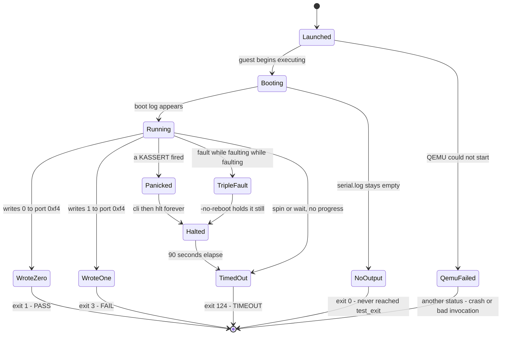

#### Walking it

Five terminal states, and each has a distinct exit status. **`WroteZero`** and
**`WroteOne`** are the two states where the kernel was alive enough to report. **`Halted`**
is reached from both `Panicked` and `TripleFault`, and both funnel into `TimedOut` — which
is why exit 124 is not one failure mode but a family, and why the serial log rather than the
exit status tells you which. **`NoOutput` → exit 0** is the state the shift-and-set-low-bit
transform exists to make visible. **`QemuFailed`** is the one state the exit status alone
cannot always disambiguate, which is why the runner prints the serial log even on success.

### The table

| Symptom | Cause | What to do |
|---|---|---|
| `test-unit` passes, but the kernel prints garbage | The host and target disagree — a `va_list` passed by value, or `long` assumed to be 32 bits | Run the suite on a second host with a different ABI. This is precisely why the macOS run is valuable |
| **PASS with an empty `serial.log`** | QEMU never ran the guest: bad command line, missing image, firmware not found | Read the QEMU invocation. This is the one case where a green result is a lie |
| `QEMU exited 0 without writing to the exit device` | The test kernel never reached `test_exit()` | Usually `-DKERNEL_TESTS=1` was not passed, so the tests compiled out; or the kernel returned from `kmain` |
| `TIMEOUT after 90s — the kernel hung` | A `KASSERT` fired and panic halted; or a triple fault; or a genuine spin | Read `serial.log` first — the panic report with the stringified condition and `file:line` is in it. Then `qemu-stderr.log` for what the CPU objected to |
| Timeout with an **empty** serial log | The kernel died before serial was initialised — step 1 of the initialisation order | Almost always the linker script, the Limine request section, or the entry path. See [[02 - The Boot Chain]] |
| Reboot loop instead of a fault message | `-no-reboot` was dropped from the invocation | Put it back. Never run a test without it |
| CI red, local green | You did not build through the container, or a stale `build/` directory, or a debug/release `NDEBUG` difference that changed which `KASSERT`s run | `make shell`, clean build, run the same `make` target CI ran |
| `bios-iso` green, `uefi-iso` red | The ESP staging tree, not the kernel. The kernel never ran | Inspect the ISO's EFI partition. `EFI/BOOT/BOOTX64.EFI` is almost certainly missing or misnamed |
| Three legs green, `uefi-smp` red | A concurrency bug, or a lock taken out of rank order | The lock ranks are in `kernel/sched/locks.md`; debug builds `KASSERT` on rank violations |
| A boot test that fails one run in twenty | A timing assumption in an `expect`, or a genuine race | Never re-run and move on. Either lengthen a timeout with a written reason, or find the race. A tolerated flake is a gate that has already failed |
| A user program halts the whole machine | An assert used where an error return was required | §6.2. Find the `KASSERT` on a value the user controls, and make it a negative errno |
| A test that used to catch a bug stops catching it | Its `KASSERT` acquired a side effect and the release build compiles the condition out | Conditions in `KASSERT` must be pure. Check for a function call inside one |
| Every tier green, real hardware triple-faults | Nothing in CI runs on real hardware, by design | The release checklist. Real firmware has opinions QEMU does not |

> [!warning] The most dangerous state a test suite can be in
> Not red. **Green and not running.** A suite that silently executes nothing reports PASS
> forever, and it keeps reporting PASS while the code rots underneath it. Three specific
> defences exist in this design, and all three are cheap: the exit-status transform that
> makes "never reached the exit call" a distinct value; the runner printing `serial.log` on
> pass so you can see what actually ran; and the doctest assertion count in the Tier 1
> output — `assertions: 120 | 120 passed | 0 failed`. If that number ever drops, something
> stopped compiling in. Look at it.

---

## 9. Masterclass notes

> [!question] Discussion prompts
> 1. QEMU computes the exit status as `(N << 1) | 1` rather than passing `N` through. Name
>    the exact failure that the raw form permits, and explain why no amount of serial-log
>    parsing recovers it.
> 2. `kprintf` is host-testable and `map_page` is not. Both are C++ functions in the same
>    kernel. What structural property separates them — and how would you use that property
>    to decide where the boundary goes in a subsystem nobody has written yet?
> 3. A colleague proposes adding `KASSERT(fd >= 0 && fd < MAX_FD)` at the top of every
>    syscall handler, arguing it is defensive programming. Give the two-sentence argument
>    against, and then name the one place in the same call path where an equivalent assert
>    *is* correct.
> 4. The merge gate runs four boot legs. Your CI budget is halved and you must drop one.
>    Which, and what specific class of bug have you just agreed to ship?
> 5. Coverage is measured on Tier 1 only and is never a gate. Construct the concrete bad
>    outcome that a 90% coverage requirement would produce in *this* codebase — name the
>    file and the shape of the test someone would write to satisfy it.

- [ ] You understand this when you can draw the three tiers, their runners and their exit
      channels from memory, without notes
- [ ] You understand this when you can explain why exit status 1 means pass and 0 means
      failure, and why that is not perverse
- [ ] You understand this when you can decide `KASSERT` versus `return -EINVAL` for a new
      function in under ten seconds, and justify it in one sentence
- [ ] You understand this when you can explain why `-no-reboot` is a debugging tool rather
      than a QEMU preference
- [ ] You understand this when you can say which tier catches a bug *before* you write the
      test, and name the tier that structurally cannot
- [ ] You understand this when you can explain why CI runs `make test-kernel` and not a
      script of its own

**Board plan** — the order to draw this, in eight steps:

1. One box: `source tree`. Fork it into two compilers — host and cross. Say the sentence:
   *a kernel cannot be linked into a normal test binary.*
2. Under the host compiler, draw Tier 1. Write `milliseconds` next to it. Put `kprintf` in
   it and say why a formatter bug misleads you about everything else.
3. Under the cross compiler, draw a QEMU box, and a kernel box inside it. Ask the room:
   *how does the answer get out?* Let them try. Someone will suggest grepping serial.
4. Draw port `0xf4` on the boundary of the kernel box and the arrow out of QEMU labelled
   `exit status`. Write `(N << 1) | 1` beside it. Do the four-row bit table on the board.
5. Circle exit `0` and write `reserved: never reached the exit call`. This is the moment
   the design clicks; do not rush it.
6. Draw a box around the whole QEMU box labelled `timeout 90` and add exit `124`. Now walk
   a failing `KASSERT`: assert → panic → `hlt` → no write → 124 → serial log.
7. Draw Tier 3 outside all of it: the release image, four legs. Label each leg with the one
   thing only it exercises. Erase one leg and ask what just became invisible.
8. Finish with the assert-versus-return flowchart: one question at the top, two branches,
   two dashed arrows to the two ways of getting it backwards.

**Time budget:** 50 minutes. Ten on the tiers and the economics, fifteen on the exit-device
protocol and the reserved zero (this is the part people remember), ten on `KASSERT` and the
assert-versus-return rule, ten on the boot matrix and why four legs, five on what is
deliberately not tested.

---

## 10. Related

**Stages that build this**
[[Stage 0.7 - Panic and KASSERT]] — `panic`, `KASSERT`, `KASSERT_ALWAYS`, the eight-step
report, and the invariant-versus-condition rule ·
[[Stage 0.9 - CI From Day One]] — the five jobs, the boundary greps, the boot matrix, and
the `isa-debug-exit` contract in full ·
[[Stage 1.6 - kprintf]] — the flagship Tier 1 suite, the sink indirection, and the
differential oracle

**Stages this leans on**
[[Stage 0.6 - Serial Output]] — the channel every Tier 2 diagnosis travels down ·
[[Stage 0.8 - The Build System]] — three toolchains, and the flags CI greps for ·
[[Stage 1.5 - The Log Ring Buffer and Levels]] — the `Recent log` section of a panic report ·
[[Stage 1.7 - Symbolised Backtraces]] — what turns a Tier 2 panic address into a function name

**Decisions**
[[ADR-0010 - Testing Strategy and the QEMU Exit Device]] ·
[[ADR-0005 - Containerised Pinned Toolchain]] ·
[[ADR-0008 - Monorepo Layout]] ·
[[ADR-0007 - Freestanding C++20 as the Kernel Language]] ·
[[ADR-0002 - Target x86_64 Not i686]]

**Vault context**
[[06 - Architecture Overview]] — the initialisation order Tier 2 tests stop partway down ·
[[07 - Repository Layout]] — `tests/unit`, `tests/kernel`, `tests/integration`, and the four
boundary rules ·
[[08 - Build System]] — the three toolchains and the flags ·
[[09 - Testing Strategy]] — the tier-by-tier reference this document is the architecture of ·
[[10 - CI Pipeline]] — the four workflows and how to read a CI failure ·
[[11 - Release and Deployment]] — where the manual real-hardware step lives ·
[[12 - Team Workflow]] — the definition of done and the pull request template ·
[[13 - Coding Standards]] — rule 5 (validate user pointers) and rule 7 (assert or return) ·
[[14 - Debugging Playbook]] — what to do once a test has told you something is wrong ·
[[04 - Glossary]]

**Architecture atlas**
[[02 - The Boot Chain]] — what the four matrix legs are actually exercising ·
[[19 - The Eight-Hour Masterclass]]

**Phases**
[[Phase 0 - Overview]] · [[Phase 1 - Overview]] · [[Phase 2 - Overview]] ·
[[Phase 4 - Overview]] · [[Phase 8 - Overview]] · [[Phase 10 - Overview]] ·
[[Phase 12 - Overview]] · [[Phase 15 - Overview]]
