# 18 — Phase to Architecture Map

> [!abstract] What this document covers
> Every other document in this atlas describes a *part of the system*. This one
> describes the *route through them*. It answers one question, asked from inside the
> work: **"I am on Stage N.M — which box of the architecture am I building, which
> document explains it, and what does finishing it unlock?"** It maps all 16 phases and
> every stage to the atlas documents, draws the honest dependency graph between phases,
> shows what the OS can actually *do* after each one, and records where to cut when the
> schedule slips.

**Zoom level:** Cross-cutting — this is the index, not a subsystem
**Built by:** nothing. Every other stage builds something; this document points at it.
**Prerequisites:** [[06 - The Subsystem Map]] (the layer cake this maps onto) · [[15 - Roadmap and Milestones]] (the schedule this maps onto)
**Masterclass session:** 1 as the opening orientation, 8 as the closing review (see [[19 - The Eight-Hour Masterclass]])

---

## 1. The one-sentence version

**The stage list is a to-do list ordered by what compiles next; this document is the
same list ordered by what it *means*.**

Expanding that. The [[Progress Tracker]] is a linear sequence of checkboxes. That is
exactly what you want at 11pm when you are three lines from a working AHCI driver, and
exactly what you do not want when you have lost the thread and cannot remember why you
are writing a bitmap allocator at all. A linear list hides three things that matter:

1. **Which architectural box a stage builds.** "Stage 4.2" means nothing. "The bottom
   layer of `mm/`, the thing that owns every physical page in the machine and hands
   them out four kilobytes at a time" means something, and it lives in
   [[07 - Memory Management]].
2. **What is genuinely blocked and what only looks blocked.** The stage numbers imply a
   total order. The real dependency graph is a *partial* order with wide parallel
   regions — which is the entire reason two people can work on this at once.
3. **What each phase buys you.** Not "seven stages complete" but "the machine now
   remembers things across a power cycle". That is the number that keeps a
   two-year project alive.

This document supplies all three, and nothing else. If you want to know *how* a thing
works, this page will send you to the document that explains it. It will not explain
it here.

---

## 2. The picture

Three coordinate systems describe every piece of work in this project, and every
question you will ask is a translation between two of them.

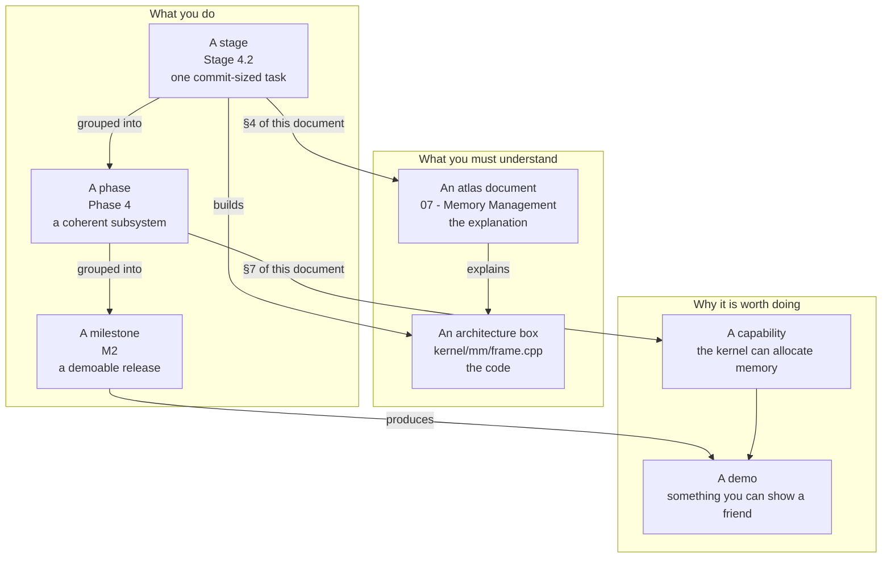
```mermaid
flowchart TD
    subgraph WORK["What you do"]
        STAGE["A stage<br/>Stage 4.2<br/>one commit-sized task"]
        PHASE["A phase<br/>Phase 4<br/>a coherent subsystem"]
        MILE["A milestone<br/>M2<br/>a demoable release"]
    end
    subgraph KNOW["What you must understand"]
        DOC["An atlas document<br/>07 - Memory Management<br/>the explanation"]
        BOX["An architecture box<br/>kernel/mm/frame.cpp<br/>the code"]
    end
    subgraph WORTH["Why it is worth doing"]
        CAP["A capability<br/>the kernel can allocate memory"]
        DEMO["A demo<br/>something you can show a friend"]
    end
    STAGE -->|"grouped into"| PHASE
    PHASE -->|"grouped into"| MILE
    STAGE -->|"§4 of this document"| DOC
    STAGE -->|"builds"| BOX
    DOC -->|"explains"| BOX
    PHASE -->|"§7 of this document"| CAP
    MILE -->|"produces"| DEMO
    CAP --> DEMO
```

**Walking it.** The left column is the unit of work, at three zoom levels: a *stage* is
one sitting and one commit; a *phase* is a subsystem that is either finished or not;
a *milestone* is a version tag and a thing you can demonstrate. The middle column is
the unit of understanding — a *document* in this atlas explains a *box* in the source
tree, and a stage is precisely the act of turning one into the other. The right column
is the unit of motivation, which is not decoration: [[15 - Roadmap and Milestones]]
names "losing motivation in a long phase" as **High** likelihood and **High** impact,
above every technical risk on the register.

The arrow labelled *§4 of this document* is the one you will use most. The rest of this
page exists to make it accurate.

### 2.1 The atlas, seen whole

Seventeen documents precede this one. They are not a sequence; they are five bands,
and the band tells you when in the project you will need them.

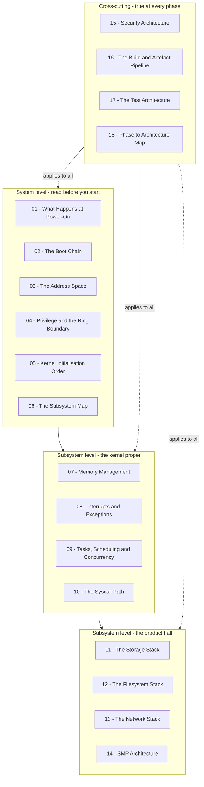
```mermaid
flowchart TD
    subgraph SYS["System level - read before you start"]
        D01["01 - What Happens at Power-On"]
        D02["02 - The Boot Chain"]
        D03["03 - The Address Space"]
        D04["04 - Privilege and the Ring Boundary"]
        D05["05 - Kernel Initialisation Order"]
        D06["06 - The Subsystem Map"]
    end
    subgraph CORE["Subsystem level - the kernel proper"]
        D07["07 - Memory Management"]
        D08["08 - Interrupts and Exceptions"]
        D09["09 - Tasks, Scheduling and Concurrency"]
        D10["10 - The Syscall Path"]
    end
    subgraph PROD["Subsystem level - the product half"]
        D11["11 - The Storage Stack"]
        D12["12 - The Filesystem Stack"]
        D13["13 - The Network Stack"]
        D14["14 - SMP Architecture"]
    end
    subgraph CROSS["Cross-cutting - true at every phase"]
        D15["15 - Security Architecture"]
        D16["16 - The Build and Artefact Pipeline"]
        D17["17 - The Test Architecture"]
        D18["18 - Phase to Architecture Map"]
    end
    SYS --> CORE --> PROD
    CROSS -.->|"applies to all"| SYS
    CROSS -.->|"applies to all"| CORE
    CROSS -.->|"applies to all"| PROD
```

The dotted arrows are the important ones. [[16 - The Build and Artefact Pipeline]] and
[[17 - The Test Architecture]] are not "Phase 0 documents" that you finish with — they
describe machinery that every later phase leans on. [[15 - Security Architecture]] is
formally built by Phase 15, but reading it in Phase 6 changes how you write the syscall
boundary, which is the difference between hardening and rewriting.

### 2.2 The phase-to-document matrix

The compact version. A ● means the document's own **Built by** line names a stage in
that phase — that is a first-class mapping, asserted by the document itself. A ○ means
the phase is covered substantially but is not claimed in the header; §6 is honest about
where the ○s hide real gaps.

| Phase | 01 | 02 | 03 | 04 | 05 | 06 | 07 | 08 | 09 | 10 | 11 | 12 | 13 | 14 | 15 | 16 | 17 |
|---|---|---|---|---|---|---|---|---|---|---|---|---|---|---|---|---|---|
| **0** Toolchain & First Boot | ● | ● | ● | | ● | ● | | | | | | | | | | ● | ● |
| **1** Console & Logging | | ○ | | | ○ | ○ | | | | | | | | | | | ● |
| **2** CPU Tables & Interrupts | | | | ● | ● | | ○ | ● | ○ | | | | | | ○ | | |
| **3** Drivers: Timer & Keyboard | | | | | ○ | ○ | | ○ | ● | | | | | | | | |
| **4** Memory Management | | | ● | | ● | ○ | ● | | ○ | | ○ | | | | ○ | | |
| **5** Multitasking | | | | | ○ | ○ | ○ | | ● | | ○ | | | | | | |
| **6** User Mode & Syscalls | | | ○ | ● | | ○ | | | | ● | | | | | ○ | | |
| **7** VFS & Program Loading | | | ○ | | | ○ | | | | ○ | | ● | | | | ○ | |
| **8** The Shell | | | | | ○ | ○ | | | | ○ | | ○ | | | | | ○ |
| **9** Storage | | | | | | ○ | ○ | | | | ● | ○ | | | | | |
| **10** Real Filesystems | | | | | | ○ | | | | | ○ | ● | | | ○ | | |
| **11** Modern Platform | | | | | ○ | ○ | | ○ | | | ○ | | ○ | ○ | | | |
| **12** SMP | | | | | | ○ | ○ | | ○ | | | | ○ | ● | | | |
| **13** Unix Process Model | | | | | | ○ | ● | | ○ | ● | | ○ | ○ | | ○ | | |
| **14** Networking | | | | | | ○ | | | | ○ | ○ | | ● | ○ | | | |
| **15** Hardening & Real Hardware | ○ | ○ | ○ | ○ | | | ○ | | | | | | | | ● | ○ | ○ |

Two rows have no ● at all — **Phase 1** and **Phase 11**. That is a real hole in the
atlas, not an accident of notation, and §6 says so plainly.

---

## 3. How to use this page

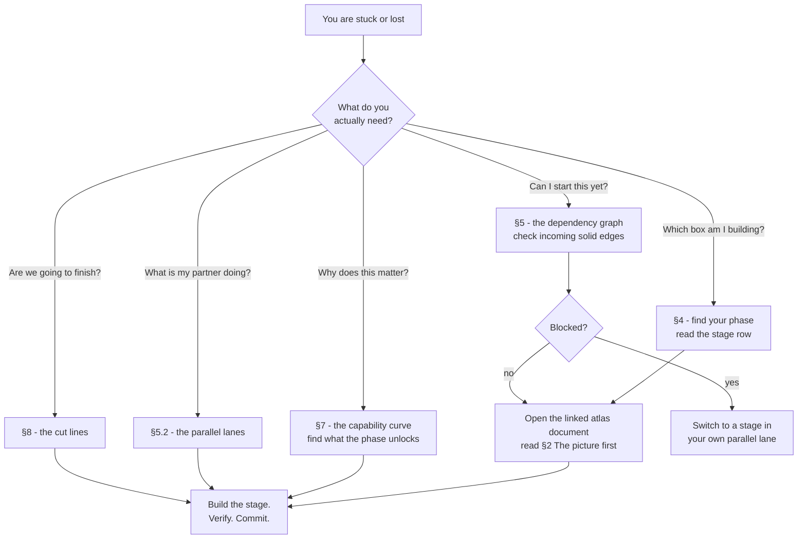
```mermaid
flowchart TD
    START["You are stuck or lost"] --> Q1{"What do you<br/>actually need?"}
    Q1 -->|"Which box am I building?"| A1["§4 - find your phase<br/>read the stage row"]
    Q1 -->|"Why does this matter?"| A2["§7 - the capability curve<br/>find what the phase unlocks"]
    Q1 -->|"Can I start this yet?"| A3["§5 - the dependency graph<br/>check incoming solid edges"]
    Q1 -->|"What is my partner doing?"| A4["§5.2 - the parallel lanes"]
    Q1 -->|"Are we going to finish?"| A5["§8 - the cut lines"]
    A1 --> READ["Open the linked atlas document<br/>read §2 The picture first"]
    A3 --> BLOCKED{"Blocked?"}
    BLOCKED -->|"yes"| SWITCH["Switch to a stage in<br/>your own parallel lane"]
    BLOCKED -->|"no"| READ
    READ --> BUILD["Build the stage.<br/>Verify. Commit."]
    A2 --> BUILD
    A4 --> BUILD
    A5 --> BUILD
```

> [!tip] The one habit that makes this atlas pay for itself
> Before writing a line of a new stage, open the document its row points at and read
> **only its §2, "The picture"**. Five minutes. You are looking for the box you are
> about to build and the two arrows going into it. Reading the whole document first is
> a way of not starting; reading none of it is how you discover in Phase 12 that a
> Phase 5 global was a single-core assumption.

---

## 4. The master table

Every stage in the project, grouped by phase. Three columns that matter: what you
build, where it is explained, and the one line of capability it adds.

> [!warning] The stage count, honestly
> Counted from the phase overviews as they stand today, the project has **109 stage
> slots**, not the 102 that older summaries quote. The tracker holds stage *notes* for
> Phases 0–8 only (46 stages), minus [[Stage 2.4 - Interrupt Stubs and the Saved Frame]],
> whose note is not written. Phases 9–15 exist as overviews with stage tables but no
> per-stage notes yet. **Write the stage notes for a phase before starting that phase.**
> Where this table and a phase overview disagree, the overview wins; where an overview
> and an ADR disagree, the ADR wins.

> [!note] Two stale details you will meet in the older stage notes
> [[Stage 6.3 - The System Call Interface]] still says `int 0x80` and 32-bit register
> arguments. [[Stage 7.1 - The Initial Ramdisk]] still says GRUB and a read-only tar.
> Both predate [[ADR-0002 - Target x86_64 Not i686]] and
> [[ADR-0003 - Limine as the Bootloader]]. The truth is `syscall`/`sysret` with
> arguments in `rdi, rsi, rdx, r10, r8, r9`, and Limine loading `initrd.tar` as a
> module which is unpacked into a writable `tmpfs`. The atlas documents are correct;
> those two stage notes are pending rewrites.

---

### Phase 0 — Toolchain & First Boot

**Owner:** Member A (plus the toolchain container and build system). **Milestone:** M1.

| Stage | Read | Capability it adds |
|---|---|---|
| [[Stage 0.1 - Prove Your Toolchain Works]] | [[16 - The Build and Artefact Pipeline\|16]] | The container, the cross-compiler and QEMU all run |
| [[Stage 0.2 - The Limine Request Section]] | [[01 - What Happens at Power-On\|01]] · [[02 - The Boot Chain\|02]] | A kernel image Limine recognises and agrees to load |
| [[Stage 0.3 - Freestanding C++ and kmain]] | [[02 - The Boot Chain\|02]] | `kmain` in freestanding C++20, and our own `BootInfo` copy |
| [[Stage 0.4 - The Linker Script and Higher-Half Layout]] | [[03 - The Address Space\|03]] · [[16 - The Build and Artefact Pipeline\|16]] | A kernel linked at `0xFFFFFFFF80000000` |
| [[Stage 0.5 - Building a Bootable Image]] | [[02 - The Boot Chain\|02]] · [[16 - The Build and Artefact Pipeline\|16]] | **FIRST BOOT** — a hybrid ISO, kernel reached, `hlt` |
| [[Stage 0.6 - Serial Output]] | [[05 - Kernel Initialisation Order\|05]] | **FIRST OUTPUT** — a line of text out of COM1 |
| [[Stage 0.7 - Panic and KASSERT]] | [[05 - Kernel Initialisation Order\|05]] · [[17 - The Test Architecture\|17]] | Faults halt with a register dump instead of a reboot loop |
| [[Stage 0.8 - The Build System]] | [[16 - The Build and Artefact Pipeline\|16]] | `make run` builds and boots in one command |
| [[Stage 0.9 - CI From Day One]] | [[06 - The Subsystem Map\|06]] · [[17 - The Test Architecture\|17]] | Every push builds and boot-tests itself |

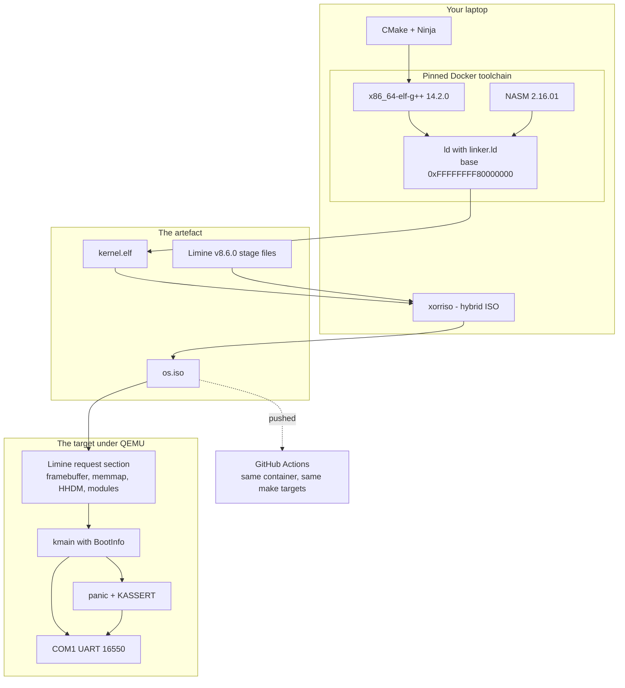
```mermaid
flowchart TD
    subgraph HOST["Your laptop"]
        subgraph CONT["Pinned Docker toolchain"]
            GPP["x86_64-elf-g++ 14.2.0"]
            NASM["NASM 2.16.01"]
            LD["ld with linker.ld<br/>base 0xFFFFFFFF80000000"]
        end
        CMAKE["CMake + Ninja"]
        XORR["xorriso - hybrid ISO"]
    end
    subgraph IMG["The artefact"]
        KERN["kernel.elf"]
        LIM["Limine v8.6.0 stage files"]
        ISO["os.iso"]
    end
    subgraph TGT["The target under QEMU"]
        REQ["Limine request section<br/>framebuffer, memmap, HHDM, modules"]
        KMAIN["kmain with BootInfo"]
        SER["COM1 UART 16550"]
        PANIC["panic + KASSERT"]
    end
    CMAKE --> GPP --> LD --> KERN
    NASM --> LD
    KERN --> XORR
    LIM --> XORR --> ISO
    ISO --> REQ --> KMAIN
    KMAIN --> SER
    KMAIN --> PANIC --> SER
    ISO -.->|"pushed"| CI["GitHub Actions<br/>same container, same make targets"]
```

**Unlocks:** everything. Until Stage 0.6 the machine has no voice at all, and every bug
in every later phase presents identically as a black screen. This is why serial comes
before the framebuffer console: a UART needs no memory, no interrupts and no
allocator, so it can report the failure of all three.

---

### Phase 1 — Console & Logging

**Owner:** shared. **Milestone:** M1.

| Stage | Read | Capability it adds |
|---|---|---|
| [[Stage 1.1 - The Linear Framebuffer]] | [[02 - The Boot Chain\|02]] · [[03 - The Address Space\|03]] | Your first pixel — a coloured rectangle on screen |
| [[Stage 1.2 - Rasterising a Bitmap Font]] | [[05 - Kernel Initialisation Order\|05]] | Characters drawn from an 8x16 bitmap font |
| [[Stage 1.3 - A Console - Cursor, Colour, Scrolling]] | [[06 - The Subsystem Map\|06]] | `print`, a tracked cursor, a screen that scrolls |
| [[Stage 1.4 - Double Buffering]] | [[07 - Memory Management\|07]] | Flicker-free redraws; scrolling stops being a bottleneck |
| [[Stage 1.5 - The Log Ring Buffer and Levels]] | [[17 - The Test Architecture\|17]] | `dmesg`-style history with severity levels |
| [[Stage 1.6 - kprintf]] | [[17 - The Test Architecture\|17]] | `kprintf("%d %x %s %p", ...)` — the debugging primitive |
| [[Stage 1.7 - Symbolised Backtraces]] | [[16 - The Build and Artefact Pipeline\|16]] · [[08 - Interrupts and Exceptions\|08]] | Panics that name functions, not raw addresses |

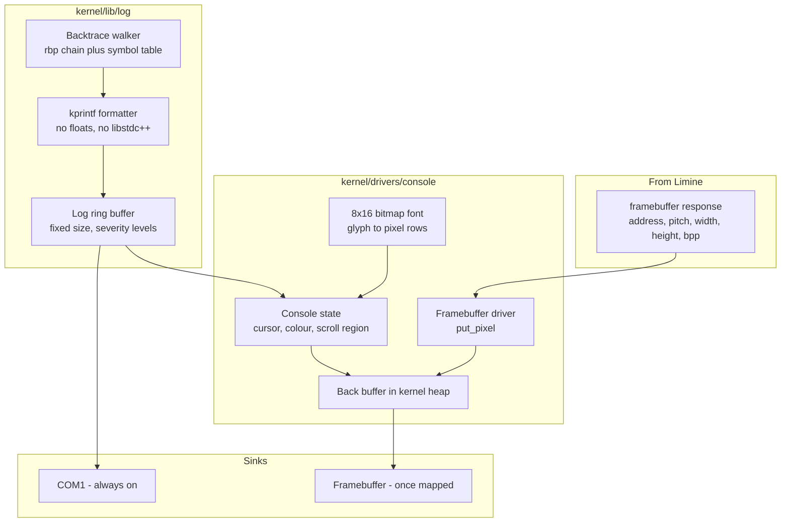
```mermaid
flowchart TD
    subgraph BOOTINFO["From Limine"]
        FBINFO["framebuffer response<br/>address, pitch, width, height, bpp"]
    end
    subgraph CONSOLE["kernel/drivers/console"]
        FB["Framebuffer driver<br/>put_pixel"]
        BACK["Back buffer in kernel heap"]
        FONT["8x16 bitmap font<br/>glyph to pixel rows"]
        TERM["Console state<br/>cursor, colour, scroll region"]
    end
    subgraph LOG["kernel/lib/log"]
        RING["Log ring buffer<br/>fixed size, severity levels"]
        FMT["kprintf formatter<br/>no floats, no libstdc++"]
        BT["Backtrace walker<br/>rbp chain plus symbol table"]
    end
    subgraph SINKS["Sinks"]
        SERIAL["COM1 - always on"]
        SCREEN["Framebuffer - once mapped"]
    end
    FBINFO --> FB --> BACK --> SCREEN
    FONT --> TERM --> BACK
    FMT --> RING
    RING --> SERIAL
    RING --> TERM
    BT --> FMT
```

> [!warning] The trap nobody warns you about
> The framebuffer address Limine hands you is a **higher-half virtual address inside
> the HHDM**, valid only while Limine's page tables are still installed. The moment
> Phase 4 loads your own `CR3`, the console goes black — not because the driver broke,
> but because you never mapped the framebuffer into your own tables. Every hobby OS
> hits this exactly once. [[03 - The Address Space]] explains the fix; the reason it
> is survivable is that Stage 0.6 gave you serial first.

**Unlocks:** debuggability. Phase 2 is about deliberately causing CPU exceptions, and
a symbolised backtrace turns that from archaeology into reading.

---

### Phase 2 — CPU Tables & Interrupts

**Owner:** Member A. **Milestone:** M1.

| Stage | Read | Capability it adds |
|---|---|---|
| [[Stage 2.1 - The Global Descriptor Table]] | [[08 - Interrupts and Exceptions\|08]] · [[04 - Privilege and the Ring Boundary\|04]] | Our own 64-bit GDT, with ring-3 descriptors already present |
| [[Stage 2.2 - The TSS and Interrupt Stacks]] | [[08 - Interrupts and Exceptions\|08]] · [[04 - Privilege and the Ring Boundary\|04]] | `rsp0` and the 7 IST slots — a survivable double fault |
| [[Stage 2.3 - The Interrupt Descriptor Table]] | [[08 - Interrupts and Exceptions\|08]] · [[05 - Kernel Initialisation Order\|05]] | 256 sixteen-byte gates with correct types and DPLs |
| [[Stage 2.4 - Interrupt Stubs and the Saved Frame]] | [[08 - Interrupts and Exceptions\|08]] | One consistent `registers_t` for every vector |
| [[Stage 2.5 - CPU Exception Handlers]] | [[08 - Interrupts and Exceptions\|08]] | Every fault reported with cause, faulting address and backtrace |
| [[Stage 2.6 - The 8259 PIC - Remap and Mask]] | [[08 - Interrupts and Exceptions\|08]] | Legacy IRQs remapped off the exception vectors, ready to be replaced |
| [[Stage 2.7 - Hardware Interrupts]] | [[08 - Interrupts and Exceptions\|08]] | A real device interrupt reaching a C++ handler |

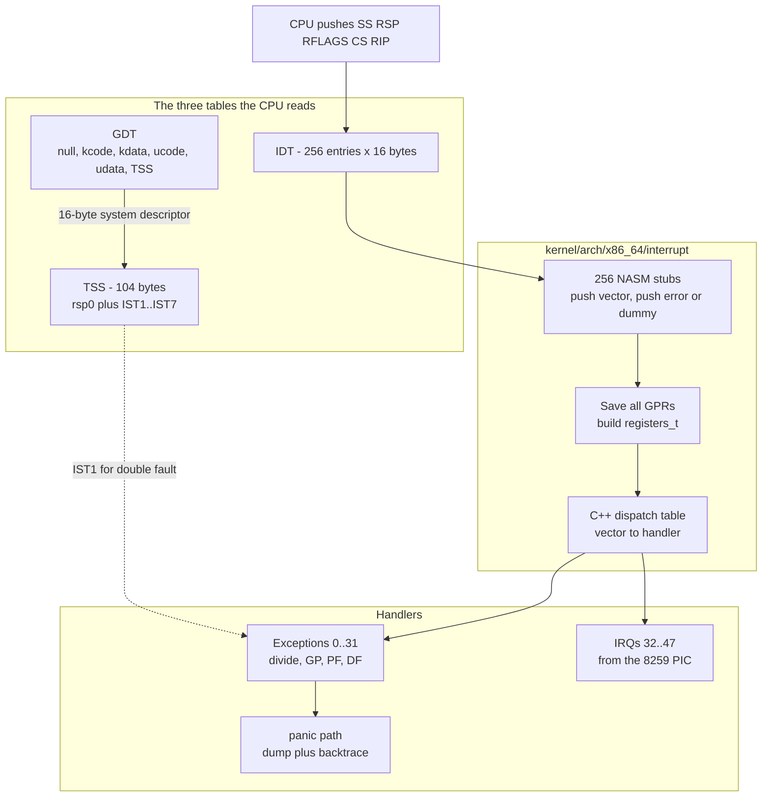
```mermaid
flowchart TD
    subgraph TABLES["The three tables the CPU reads"]
        GDT["GDT<br/>null, kcode, kdata, ucode, udata, TSS"]
        TSS["TSS - 104 bytes<br/>rsp0 plus IST1..IST7"]
        IDT["IDT - 256 entries x 16 bytes"]
        GDT -->|"16-byte system descriptor"| TSS
    end
    subgraph ENTRY["kernel/arch/x86_64/interrupt"]
        STUB["256 NASM stubs<br/>push vector, push error or dummy"]
        SAVE["Save all GPRs<br/>build registers_t"]
        DISP["C++ dispatch table<br/>vector to handler"]
    end
    subgraph HANDLERS["Handlers"]
        EXC["Exceptions 0..31<br/>divide, GP, PF, DF"]
        IRQ["IRQs 32..47<br/>from the 8259 PIC"]
        PANICP["panic path<br/>dump plus backtrace"]
    end
    CPU["CPU pushes SS RSP RFLAGS CS RIP"] --> IDT --> STUB --> SAVE --> DISP
    DISP --> EXC --> PANICP
    DISP --> IRQ
    TSS -.->|"IST1 for double fault"| EXC
```

> [!note] Why the GDT still exists in long mode
> Segmentation is dead in 64-bit mode — base and limit are ignored for `cs`, `ds`,
> `es`, `ss`. The GDT survives for exactly three reasons: the CPU still needs a
> descriptor to know the current **privilege level**, `syscall`/`sysret` derive their
> segment selectors from a fixed **layout** around the `STAR` MSR's index, and the TSS
> must be reachable through a descriptor. Get the ordering of the four user/kernel
> entries wrong in Phase 2 and `sysret` in Phase 6 lands in the wrong ring with no
> obvious cause. Build the ring-3 descriptors now even though nothing uses them yet.

**Unlocks:** Phase 3 (a timer IRQ needs somewhere to land) and Phase 4 (a page fault
handler must exist before paging is switched on, or the first bad map is a triple
fault and an instant reboot).

---

### Phase 3 — Drivers: Timer & Keyboard

**Owner:** Member A. **Milestone:** M2.

| Stage | Read | Capability it adds |
|---|---|---|
| [[Stage 3.1 - The Programmable Interval Timer]] | [[09 - Tasks, Scheduling and Concurrency\|09]] · [[08 - Interrupts and Exceptions\|08]] | A counted tick at a known rate — the kernel has a clock |
| [[Stage 3.2 - The Keyboard Driver]] | [[08 - Interrupts and Exceptions\|08]] · [[06 - The Subsystem Map\|06]] | Key presses turned into characters |
| [[Stage 3.3 - An Input Line Buffer]] | [[06 - The Subsystem Map\|06]] | A `readline` that returns a whole typed line |

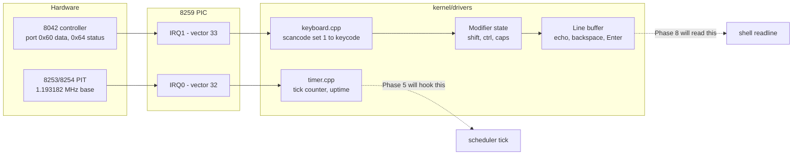
```mermaid
flowchart LR
    subgraph HW["Hardware"]
        PIT["8253/8254 PIT<br/>1.193182 MHz base"]
        KBD["8042 controller<br/>port 0x60 data, 0x64 status"]
    end
    subgraph PICBOX["8259 PIC"]
        IRQ0["IRQ0 - vector 32"]
        IRQ1["IRQ1 - vector 33"]
    end
    subgraph DRV["kernel/drivers"]
        TICK["timer.cpp<br/>tick counter, uptime"]
        SCAN["keyboard.cpp<br/>scancode set 1 to keycode"]
        MAP["Modifier state<br/>shift, ctrl, caps"]
        LINE["Line buffer<br/>echo, backspace, Enter"]
    end
    PIT --> IRQ0 --> TICK
    KBD --> IRQ1 --> SCAN --> MAP --> LINE
    TICK -.->|"Phase 5 will hook this"| SCHED["scheduler tick"]
    LINE -.->|"Phase 8 will read this"| SHELL["shell readline"]
```

**Unlocks:** preemption. A scheduler without a timer is cooperative forever, and a
cooperative scheduler cannot survive a user program with an infinite loop — which
means it cannot survive ring 3, which means Phase 6 has no teeth.

---

### Phase 4 — Memory Management

**Owner:** Member A. **Milestone:** M2.

| Stage | Read | Capability it adds |
|---|---|---|
| [[Stage 4.1 - Reading the Memory Map]] | [[07 - Memory Management\|07]] · [[03 - The Address Space\|03]] | The authoritative list of usable RAM regions |
| [[Stage 4.2 - The Physical Frame Allocator]] | [[07 - Memory Management\|07]] | `alloc_frame` / `free_frame` over every 4 KiB of RAM |
| [[Stage 4.3 - Enabling Paging]] | [[07 - Memory Management\|07]] · [[03 - The Address Space\|03]] | Our own 4-level tables in `CR3` — virtual memory is ours |
| [[Stage 4.4 - The Kernel Heap]] | [[07 - Memory Management\|07]] · [[05 - Kernel Initialisation Order\|05]] | Working `kmalloc` / `kfree` |

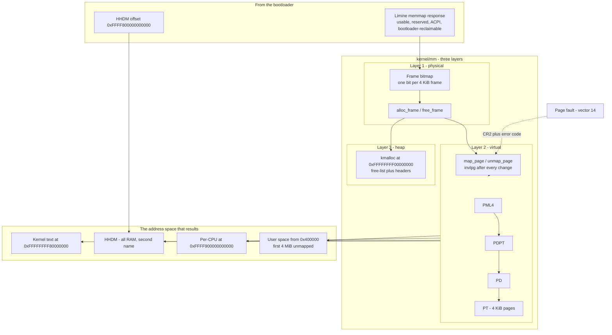
```mermaid
flowchart TD
    subgraph SRC["From the bootloader"]
        MMAP["Limine memmap response<br/>usable, reserved, ACPI, bootloader-reclaimable"]
        HHDMR["HHDM offset 0xFFFF800000000000"]
    end
    subgraph MM["kernel/mm - three layers"]
        subgraph L1["Layer 1 - physical"]
            BITMAP["Frame bitmap<br/>one bit per 4 KiB frame"]
            ALLOC["alloc_frame / free_frame"]
        end
        subgraph L2["Layer 2 - virtual"]
            PML4["PML4"]
            PDPT["PDPT"]
            PD["PD"]
            PT["PT - 4 KiB pages"]
            MAPF["map_page / unmap_page<br/>invlpg after every change"]
            PML4 --> PDPT --> PD --> PT
        end
        subgraph L3["Layer 3 - heap"]
            HEAP["kmalloc at 0xFFFFFFFF00000000<br/>free-list plus headers"]
        end
    end
    subgraph REGIONS["The address space that results"]
        KTEXT["Kernel text at 0xFFFFFFFF80000000"]
        HHDMMAP["HHDM - all RAM, second name"]
        PERCPU["Per-CPU at 0xFFFF900000000000"]
        USERLOW["User space from 0x400000<br/>first 4 MiB unmapped"]
    end
    MMAP --> BITMAP --> ALLOC --> MAPF
    HHDMR --> HHDMMAP
    MAPF --> L2
    ALLOC --> HEAP
    L2 --> KTEXT
    L2 --> HHDMMAP
    L2 --> PERCPU
    L2 --> USERLOW
    PF["Page fault - vector 14"] -.->|"CR2 plus error code"| MAPF
```

> [!warning] The two hard failures of this phase
> **Triple fault at `mov cr3, rax`.** Your new PML4 does not map the instruction
> immediately after the `mov`. The CPU faults, the fault handler is not mapped either,
> the double-fault handler is not mapped either, and the machine resets with no output.
> Map the kernel *and the framebuffer* into the new tables before loading them, and put
> `#DF` on an IST stack in Phase 2 so at least the second fault can talk.
> **Silent corruption later.** The frame allocator handed out a frame that the memmap
> marked reserved, or an ACPI region you will need in Phase 11. Phase 4 bugs surface in
> Phase 9, hours away from their cause.

**Unlocks:** every allocation in the rest of the project. Tasks (Phase 5) need stacks;
the buffer cache (Phase 9) needs pages; packet buffers (Phase 14) need
physically-contiguous DMA memory that only the frame allocator can promise.

---

### Phase 5 — Multitasking

**Owner:** Member B. **Milestone:** M2.

| Stage | Read | Capability it adds |
|---|---|---|
| [[Stage 5.1 - Tasks, Context, and the Stack]] | [[09 - Tasks, Scheduling and Concurrency\|09]] | A task struct, a kernel stack, a saved register set |
| [[Stage 5.2 - Cooperative Task Switching]] | [[09 - Tasks, Scheduling and Concurrency\|09]] | `yield()` genuinely switches which code is running |
| [[Stage 5.3 - Preemptive Scheduling]] | [[09 - Tasks, Scheduling and Concurrency\|09]] | The timer takes the CPU away without being asked |
| [[Stage 5.4 - Sleep and Blocking]] | [[09 - Tasks, Scheduling and Concurrency\|09]] | Tasks wait on events without burning the machine |

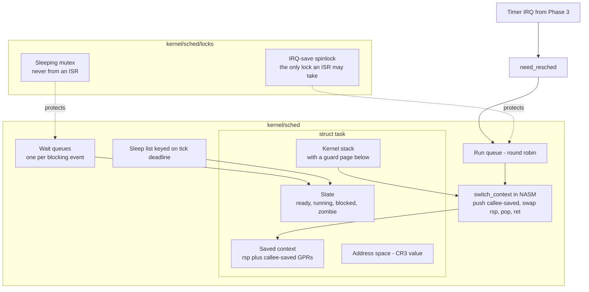
```mermaid
flowchart TD
    subgraph SCHEDBOX["kernel/sched"]
        subgraph TASK["struct task"]
            CTX["Saved context<br/>rsp plus callee-saved GPRs"]
            KSTACK["Kernel stack<br/>with a guard page below"]
            CR3F["Address space - CR3 value"]
            STATE["State<br/>ready, running, blocked, zombie"]
        end
        RQ["Run queue - round robin"]
        SW["switch_context in NASM<br/>push callee-saved, swap rsp, pop, ret"]
        WQ["Wait queues<br/>one per blocking event"]
        SLEEP["Sleep list keyed on tick deadline"]
    end
    subgraph LOCKS["kernel/sched/locks"]
        SPIN["IRQ-save spinlock<br/>the only lock an ISR may take"]
        MUTEX["Sleeping mutex<br/>never from an ISR"]
    end
    TICKSRC["Timer IRQ from Phase 3"] --> PREEMPT["need_resched"] --> RQ
    RQ --> SW --> CTX
    KSTACK --> SW
    WQ --> STATE
    SLEEP --> STATE
    SPIN -.->|"protects"| RQ
    MUTEX -.->|"protects"| WQ
```

> [!note] The rule that shapes this whole phase
> The kernel is **non-preemptible in v1**: once kernel code is running it keeps the CPU
> until it blocks or returns. That single decision removes a whole class of bug from
> Phases 6–11 and it is why an interrupt handler may **not** sleep, may **not** take a
> mutex, and may **only** take an IRQ-save spinlock. Phase 12 is where you find out
> how many places quietly assumed it. Write the locking rules down now — the vault
> already asks for `kernel/sched/locks.md` before the second lock exists.

**Unlocks:** ring 3. A user process is a task with a different `CR3` and a different
privilege level; without tasks there is nothing to *be* in ring 3.

---

### Phase 6 — User Mode & System Calls

**Owner:** Member B. **Milestone:** M3.

| Stage | Read | Capability it adds |
|---|---|---|
| [[Stage 6.1 - The Task State Segment]] | [[10 - The Syscall Path\|10]] · [[08 - Interrupts and Exceptions\|08]] | `rsp0` per task — the kernel stack a ring switch lands on |
| [[Stage 6.2 - Entering Ring 3]] | [[04 - Privilege and the Ring Boundary\|04]] · [[10 - The Syscall Path\|10]] | Code genuinely executing at CPL 3 |
| [[Stage 6.3 - The System Call Interface]] | [[10 - The Syscall Path\|10]] · [[04 - Privilege and the Ring Boundary\|04]] | `syscall`/`sysret` with a validating dispatcher |
| [[Stage 6.4 - A Minimal User C Library]] | [[10 - The Syscall Path\|10]] | `write` and `exit` wrappers a program can call |

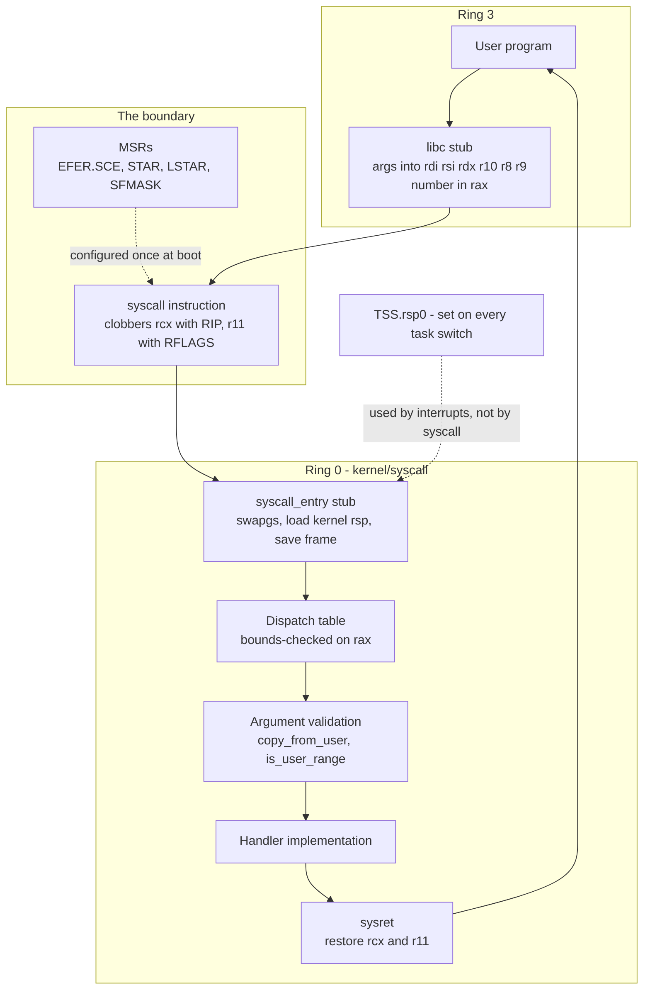
```mermaid
flowchart TD
    subgraph RING3["Ring 3"]
        UPROG["User program"]
        ULIBC["libc stub<br/>args into rdi rsi rdx r10 r8 r9<br/>number in rax"]
    end
    subgraph GATE["The boundary"]
        SYSCALL["syscall instruction<br/>clobbers rcx with RIP, r11 with RFLAGS"]
        MSRS["MSRs<br/>EFER.SCE, STAR, LSTAR, SFMASK"]
    end
    subgraph RING0["Ring 0 - kernel/syscall"]
        ENTRY["syscall_entry stub<br/>swapgs, load kernel rsp, save frame"]
        TABLE["Dispatch table<br/>bounds-checked on rax"]
        VALID["Argument validation<br/>copy_from_user, is_user_range"]
        IMPL["Handler implementation"]
        RET["sysret<br/>restore rcx and r11"]
    end
    TSSB["TSS.rsp0 - set on every task switch"] -.->|"used by interrupts, not by syscall"| ENTRY
    UPROG --> ULIBC --> SYSCALL --> ENTRY
    MSRS -.->|"configured once at boot"| SYSCALL
    ENTRY --> TABLE --> VALID --> IMPL --> RET --> UPROG
```

> [!danger] `r10`, not `rcx` — and why
> The `syscall` instruction overwrites `rcx` with the return address and `r11` with the
> saved `RFLAGS` before your code runs. The System V C calling convention puts the
> fourth argument in `rcx`. Those two facts collide, so the Linux-compatible kernel ABI
> moves the fourth argument to **`r10`** and the libc stub does the shuffle. If you
> read the fourth argument from `rcx` you get a user-controlled return address
> interpreted as a pointer, which is a privilege escalation, not a bug.

**Unlocks:** the security model. Everything in [[15 - Security Architecture]] is about
this boundary. Every pointer that crosses it in Phases 7–14 must be validated at the
moment it crosses, not later.

---

### Phase 7 — VFS & Program Loading

**Owner:** Member B. **Milestone:** M3.

| Stage | Read | Capability it adds |
|---|---|---|
| [[Stage 7.1 - The Initial Ramdisk]] | [[12 - The Filesystem Stack\|12]] · [[02 - The Boot Chain\|02]] | Limine loads `initrd.tar` as a module; we unpack it |
| [[Stage 7.2 - A Read-Only Filesystem]] | [[12 - The Filesystem Stack\|12]] | List and read files by name from a USTAR image |
| [[Stage 7.3 - The Virtual Filesystem Layer]] | [[12 - The Filesystem Stack\|12]] | One `open`/`read`/`write`/`close` over any backend |
| [[Stage 7.4 - Loading and Running an ELF Program]] | [[16 - The Build and Artefact Pipeline\|16]] · [[03 - The Address Space\|03]] | A file on disk becomes a running ring-3 process |

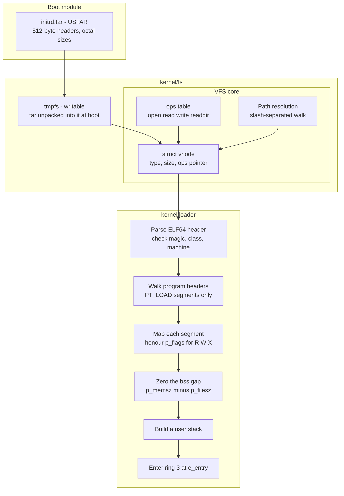
```mermaid
flowchart TD
    subgraph BOOTM["Boot module"]
        TAR["initrd.tar - USTAR<br/>512-byte headers, octal sizes"]
    end
    subgraph FSBOX["kernel/fs"]
        TMPFS["tmpfs - writable<br/>tar unpacked into it at boot"]
        subgraph VFS["VFS core"]
            NODE["struct vnode<br/>type, size, ops pointer"]
            OPS["ops table<br/>open read write readdir"]
            PATH["Path resolution<br/>slash-separated walk"]
        end
    end
    subgraph LOADER["kernel/loader"]
        EHDR["Parse ELF64 header<br/>check magic, class, machine"]
        PHDR["Walk program headers<br/>PT_LOAD segments only"]
        MAPSEG["Map each segment<br/>honour p_flags for R W X"]
        BSS["Zero the bss gap<br/>p_memsz minus p_filesz"]
        STACKU["Build a user stack"]
        JUMP["Enter ring 3 at e_entry"]
    end
    TAR --> TMPFS --> NODE
    OPS --> NODE
    PATH --> NODE
    NODE --> EHDR --> PHDR --> MAPSEG --> BSS --> STACKU --> JUMP
```

> [!note] Why the ops table is the whole point
> The VFS is one indirection: a `vnode` holds a pointer to a table of function
> pointers. `tmpfs` fills it in Phase 7, FAT32 in Phase 10, ext2 in Phase 10, a pipe in
> Phase 13, a socket in Phase 14, a TTY in Phase 13. Six completely different things
> become readable by the same `read()` because they all fill in the same six slots.
> Getting this interface right in Phase 7 is worth a day of argument; getting it wrong
> costs a week in Phase 13.

**Unlocks:** the shell, and the entire "everything is a file descriptor" model that
Phase 13 and Phase 14 are built on.

---

### Phase 8 — The Shell

**Owner:** Member B. **Milestone:** M3 — *the* milestone.

| Stage | Read | Capability it adds |
|---|---|---|
| [[Stage 8.1 - The Shell Read-Eval Loop]] | [[10 - The Syscall Path\|10]] | A prompt that reads a line from the keyboard |
| [[Stage 8.2 - Built-in Commands]] | [[12 - The Filesystem Stack\|12]] | `help`, `echo`, `ls` running in ring 3 |
| [[Stage 8.3 - Launching Programs]] | [[12 - The Filesystem Stack\|12]] · [[10 - The Syscall Path\|10]] | Type a program name and it runs |
| [[Stage 8.4 - init - Wiring It Together]] | [[05 - Kernel Initialisation Order\|05]] | The shell starts by itself at boot |

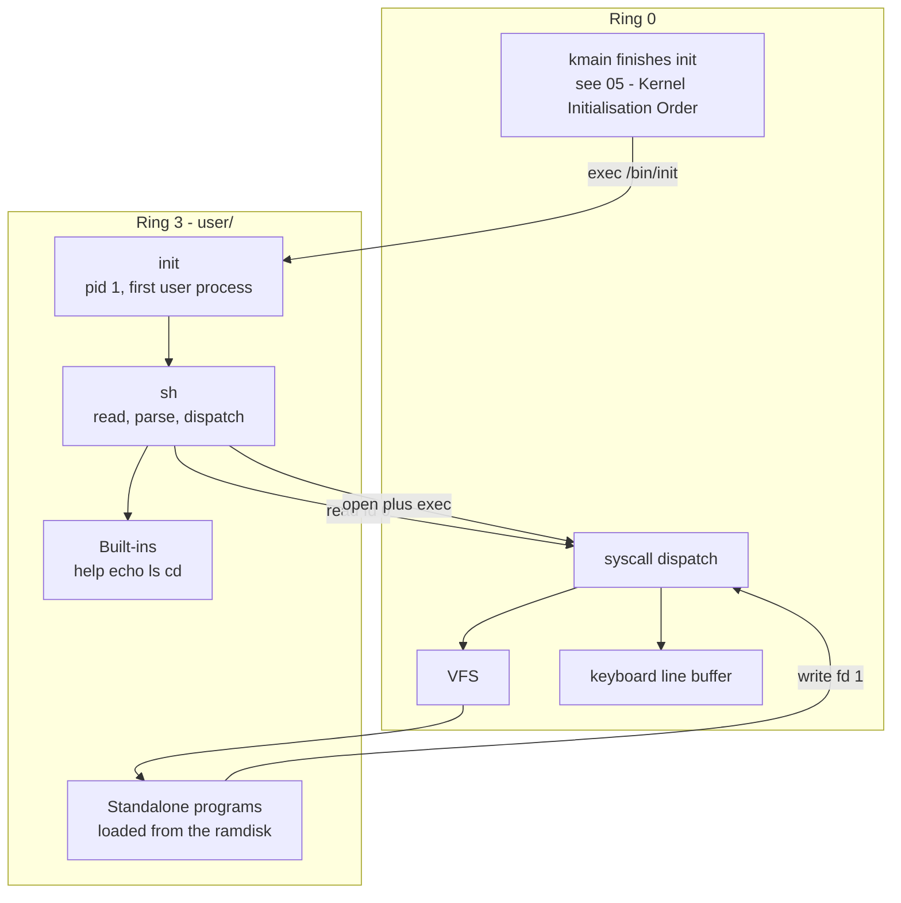
```mermaid
flowchart TD
    subgraph RING0S["Ring 0"]
        KINIT["kmain finishes init<br/>see 05 - Kernel Initialisation Order"]
        SYSC["syscall dispatch"]
        VFSS["VFS"]
        KBDS["keyboard line buffer"]
    end
    subgraph RING3S["Ring 3 - user/"]
        INIT["init<br/>pid 1, first user process"]
        SH["sh<br/>read, parse, dispatch"]
        BUILTIN["Built-ins<br/>help echo ls cd"]
        PROGS["Standalone programs<br/>loaded from the ramdisk"]
    end
    KINIT -->|"exec /bin/init"| INIT --> SH
    SH -->|"read fd 0"| SYSC --> KBDS
    SH --> BUILTIN
    SH -->|"open plus exec"| SYSC --> VFSS --> PROGS
    PROGS -->|"write fd 1"| SYSC
```

> [!abstract] What M3 actually means
> This is the line the project is really trying to cross. Everything before Phase 8 is
> "it works"; everything after is "product". You now have a machine that boots to a
> prompt, takes typed commands, and runs programs from a filesystem, entirely in code
> you wrote. The remaining seven phases make it *good*; none of them make it *an
> operating system*, because it already is one.

**Unlocks:** motivation, which the risk register rates as the leading cause of death
for projects like this. Ship `v0.3.0`. Show someone.

---

### Phase 9 — Storage

**Owner:** Member A. **Milestone:** M4.

| Stage | Read | Capability it adds |
|---|---|---|
| [[Stage 9.1 - The Block Device Interface]] | [[11 - The Storage Stack\|11]] | One API over any disk, plus a RAM-disk implementation |
| [[Stage 9.2 - DMA and Physically Contiguous Memory]] | [[11 - The Storage Stack\|11]] · [[07 - Memory Management\|07]] | An allocator for buffers hardware can actually reach |
| [[Stage 9.3 - The Buffer Cache]] | [[11 - The Storage Stack\|11]] | Cached, write-back sector access |
| [[Stage 9.4 - PCI Device Discovery for Storage]] | [[11 - The Storage Stack\|11]] | Find the disk controller and its BARs |
| [[Stage 9.5 - The AHCI Driver]] | [[11 - The Storage Stack\|11]] | Read and write real SATA sectors |
| [[Stage 9.6 - The NVMe Driver]] | [[11 - The Storage Stack\|11]] | Read and write real NVMe sectors |
| [[Stage 9.7 - Partition Table Parsing]] | [[11 - The Storage Stack\|11]] | Find partitions via GPT and MBR |

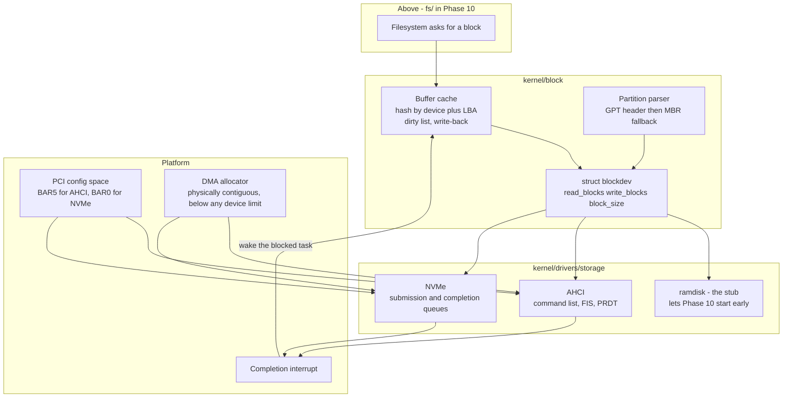
```mermaid
flowchart TD
    subgraph FSUP["Above - fs/ in Phase 10"]
        FSC["Filesystem asks for a block"]
    end
    subgraph BLK["kernel/block"]
        BCACHE["Buffer cache<br/>hash by device plus LBA<br/>dirty list, write-back"]
        BDEV["struct blockdev<br/>read_blocks write_blocks block_size"]
        PART["Partition parser<br/>GPT header then MBR fallback"]
    end
    subgraph DRVS["kernel/drivers/storage"]
        RAMD["ramdisk - the stub<br/>lets Phase 10 start early"]
        AHCI["AHCI<br/>command list, FIS, PRDT"]
        NVME["NVMe<br/>submission and completion queues"]
    end
    subgraph PLAT["Platform"]
        PCIS["PCI config space<br/>BAR5 for AHCI, BAR0 for NVMe"]
        DMAA["DMA allocator<br/>physically contiguous, below any device limit"]
        IRQD["Completion interrupt"]
    end
    FSC --> BCACHE --> BDEV
    BDEV --> RAMD
    BDEV --> AHCI
    BDEV --> NVME
    PART --> BDEV
    PCIS --> AHCI
    PCIS --> NVME
    DMAA --> AHCI
    DMAA --> NVME
    AHCI --> IRQD -->|"wake the blocked task"| BCACHE
    NVME --> IRQD
```

> [!warning] The first genuinely asynchronous subsystem
> Everything before this is synchronous: you write to a port, the work is done. A disk
> read takes milliseconds — millions of instructions — so the requesting task must
> **block** and be woken by the completion interrupt. That is why
> [[Stage 5.4 - Sleep and Blocking]] is a hard prerequisite, and why DMA is both the
> mechanism that makes storage fast and the mechanism that lets a buggy driver
> overwrite arbitrary RAM while the CPU is elsewhere. A DMA bug does not fault; it
> corrupts, silently, and you find out three phases later.

**Unlocks:** Phase 10, and with it the M4 demo: write a file, reboot, read it back.

---

### Phase 10 — Real Filesystems

**Owner:** Member B. **Milestone:** M4.

| Stage | Read | Capability it adds |
|---|---|---|
| [[Stage 10.1 - Mounting and the Mount Table]] | [[12 - The Filesystem Stack\|12]] | `mount`/`umount`, path resolution across mount points |
| [[Stage 10.2 - FAT32 Read]] | [[12 - The Filesystem Stack\|12]] | List directories and read files from a real FAT32 partition |
| [[Stage 10.3 - FAT32 Write]] | [[12 - The Filesystem Stack\|12]] | Create, write, extend, delete, with a consistent FAT chain |
| [[Stage 10.4 - Long Filenames (VFAT)]] | [[12 - The Filesystem Stack\|12]] | Names longer than 8.3 |
| [[Stage 10.5 - ext2 Read]] | [[12 - The Filesystem Stack\|12]] | Inodes, block groups, indirect blocks, directories |
| [[Stage 10.6 - ext2 Write]] | [[12 - The Filesystem Stack\|12]] | Allocate inodes and blocks, update bitmaps, link and unlink |
| [[Stage 10.7 - Permissions, Links, and Timestamps]] | [[12 - The Filesystem Stack\|12]] · [[15 - Security Architecture\|15]] | Real Unix file metadata |
| [[Stage 10.8 - Booting From Disk]] | [[02 - The Boot Chain\|02]] · [[12 - The Filesystem Stack\|12]] | Root filesystem on disk; the ramdisk becomes optional |
| [[Stage 10.9 - fsck and Crash Consistency]] | [[12 - The Filesystem Stack\|12]] | Detect and repair after an unclean shutdown |

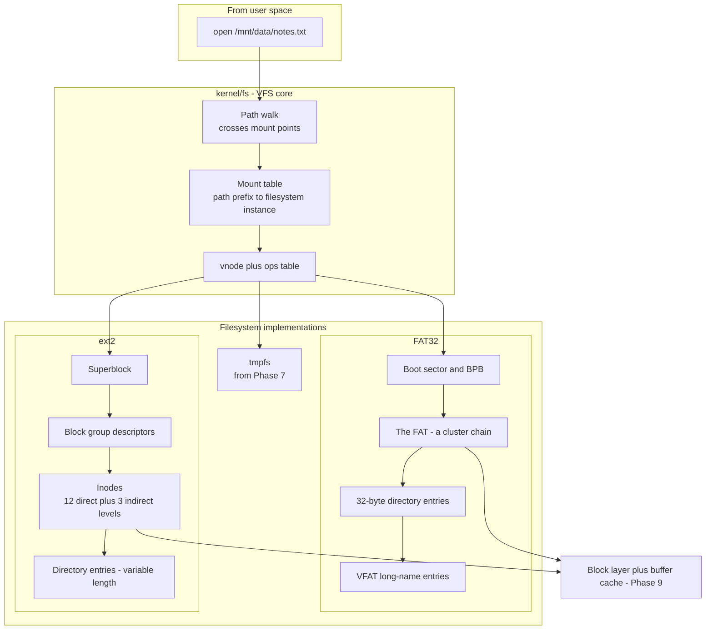
```mermaid
flowchart TD
    subgraph SYSCALLL["From user space"]
        OPENC["open /mnt/data/notes.txt"]
    end
    subgraph VFSL["kernel/fs - VFS core"]
        MTAB["Mount table<br/>path prefix to filesystem instance"]
        RESOLVE["Path walk<br/>crosses mount points"]
        VNODE["vnode plus ops table"]
    end
    subgraph IMPLS["Filesystem implementations"]
        TMPFSI["tmpfs<br/>from Phase 7"]
        subgraph FAT["FAT32"]
            BPB["Boot sector and BPB"]
            FATCH["The FAT - a cluster chain"]
            DIRE["32-byte directory entries"]
            LFN["VFAT long-name entries"]
        end
        subgraph EXT["ext2"]
            SB["Superblock"]
            BG["Block group descriptors"]
            INODE["Inodes<br/>12 direct plus 3 indirect levels"]
            DENT["Directory entries - variable length"]
        end
    end
    BLKL["Block layer plus buffer cache - Phase 9"]
    OPENC --> RESOLVE --> MTAB --> VNODE
    VNODE --> TMPFSI
    VNODE --> BPB --> FATCH --> DIRE --> LFN
    VNODE --> SB --> BG --> INODE --> DENT
    FATCH --> BLKL
    INODE --> BLKL
```

> [!tip] The interface-first rule, in its highest-leverage application
> Phases 9 and 10 are the textbook case from [[12 - Team Workflow]]. Agree
> `blockdev.hpp` — `read_blocks`, `write_blocks`, `block_size` — merge it with a
> RAM-backed stub, and then Member A writes AHCI while Member B writes FAT32 against
> the stub. They meet at the interface and it works. Without that header, one of them
> waits six weeks.

**Unlocks:** **data survives a reboot.** This is M4, and it is the point at which the
project stops being a demo. Also unlocks Phase 13's `exec` from a real disk and Phase
15's on-disk permission bits.

---

### Phase 11 — Modern Platform

**Owner:** Member A. **Milestone:** M5.

| Stage | Read | Capability it adds |
|---|---|---|
| [[Stage 11.1 - Finding and Validating ACPI Tables]] | [[05 - Kernel Initialisation Order\|05]] | RSDP to RSDT/XSDT to any table by signature |
| [[Stage 11.2 - The MADT and Interrupt Topology]] | [[14 - SMP Architecture\|14]] · [[05 - Kernel Initialisation Order\|05]] | The list of CPUs, LAPICs and IOAPICs |
| [[Stage 11.3 - PCI Enumeration]] | [[11 - The Storage Stack\|11]] | Every device on the bus, with BARs and IRQ routing |
| [[Stage 11.4 - The Local APIC]] | [[14 - SMP Architecture\|14]] · [[08 - Interrupts and Exceptions\|08]] | A per-CPU interrupt controller and the LAPIC timer |
| [[Stage 11.5 - The I/O APIC]] | [[08 - Interrupts and Exceptions\|08]] | Device IRQs routed through the APIC; the 8259 retired |
| [[Stage 11.6 - HPET and TSC Calibration]] | [[09 - Tasks, Scheduling and Concurrency\|09]] | Nanosecond timing and a monotonic clock |
| [[Stage 11.7 - The RTC and Wall Clock Time]] | [[12 - The Filesystem Stack\|12]] | Real dates on files |
| [[Stage 11.8 - ACPI Shutdown and Reboot]] | [[05 - Kernel Initialisation Order\|05]] | `poweroff` and `reboot` that actually work |

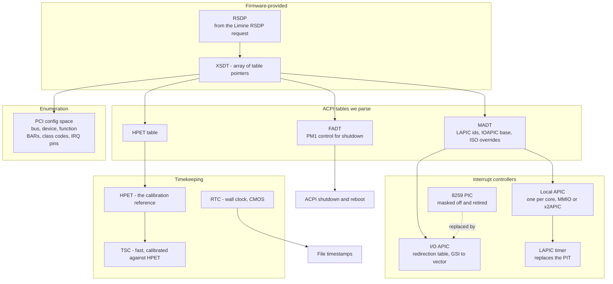
```mermaid
flowchart TD
    subgraph FIRM["Firmware-provided"]
        RSDP["RSDP<br/>from the Limine RSDP request"]
        XSDT["XSDT - array of table pointers"]
    end
    subgraph TAB["ACPI tables we parse"]
        MADT["MADT<br/>LAPIC ids, IOAPIC base, ISO overrides"]
        HPETT["HPET table"]
        FADT["FADT<br/>PM1 control for shutdown"]
    end
    subgraph INTC["Interrupt controllers"]
        PICOLD["8259 PIC<br/>masked off and retired"]
        LAPIC["Local APIC<br/>one per core, MMIO or x2APIC"]
        IOAPIC["I/O APIC<br/>redirection table, GSI to vector"]
        LTIMER["LAPIC timer<br/>replaces the PIT"]
    end
    subgraph TIME["Timekeeping"]
        HPETD["HPET - the calibration reference"]
        TSC["TSC - fast, calibrated against HPET"]
        RTC["RTC - wall clock, CMOS"]
    end
    subgraph BUS["Enumeration"]
        PCI["PCI config space<br/>bus, device, function<br/>BARs, class codes, IRQ pins"]
    end
    RSDP --> XSDT --> MADT
    XSDT --> HPETT --> HPETD --> TSC
    XSDT --> FADT --> SHUT["ACPI shutdown and reboot"]
    MADT --> LAPIC --> LTIMER
    MADT --> IOAPIC
    PICOLD -.->|"replaced by"| IOAPIC
    XSDT --> PCI
    RTC --> WALL["File timestamps"]
```

> [!warning] This phase has no dedicated atlas document
> Phase 11 is the largest coverage gap in the atlas — see §6. Until a document exists,
> the platform material is spread across four: [[05 - Kernel Initialisation Order]] has
> the deepest treatment of the ACPI/MADT/LAPIC/IOAPIC/HPET bring-up *order*,
> [[14 - SMP Architecture]] covers the LAPIC in detail, [[08 - Interrupts and Exceptions]]
> covers routing, and [[11 - The Storage Stack]] covers PCI as far as BARs. Read the
> phase overview first, then those four sections.

> [!note] Two PCI scans, on purpose
> [[Stage 9.4 - PCI Device Discovery for Storage]] is a *narrow* scan: walk the bus,
> match one class code, read one BAR. [[Stage 11.3 - PCI Enumeration]] is the general
> one: every device, every function, every BAR, IRQ routing included. Phase 9 does not
> wait for Phase 11 because it only needs the narrow version. Do not skip the general
> one — Phase 14 needs it to find the NIC.

**Unlocks:** SMP (the MADT is the list of cores; the LAPIC is how you start them), and
the ability to power the machine off, which is not a joke — without ACPI the only way
to stop your OS is to hold the power button.

---

### Phase 12 — SMP

**Owner:** Member A. **Milestone:** M5.

| Stage | Read | Capability it adds |
|---|---|---|
| [[Stage 12.1 - Per-CPU Data]] | [[14 - SMP Architecture\|14]] | A per-core data area, addressed through `GS` |
| [[Stage 12.2 - Atomics and Memory Ordering]] | [[14 - SMP Architecture\|14]] | Correct lock-free primitives and barriers |
| [[Stage 12.3 - Starting the Application Processors]] | [[14 - SMP Architecture\|14]] | Every core executing kernel code |
| [[Stage 12.4 - Per-CPU Scheduling and Load Balancing]] | [[14 - SMP Architecture\|14]] · [[09 - Tasks, Scheduling and Concurrency\|09]] | One run queue per core, with work stealing |
| [[Stage 12.5 - Auditing the Kernel for Races]] | [[14 - SMP Architecture\|14]] | Every Phase 0–11 global either locked or made per-CPU |
| [[Stage 12.6 - TLB Shootdown]] | [[14 - SMP Architecture\|14]] · [[07 - Memory Management\|07]] | Unmapping a page is safe on every core |
| [[Stage 12.7 - Scalable Locking]] | [[14 - SMP Architecture\|14]] | Locks that do not get slower as cores are added |

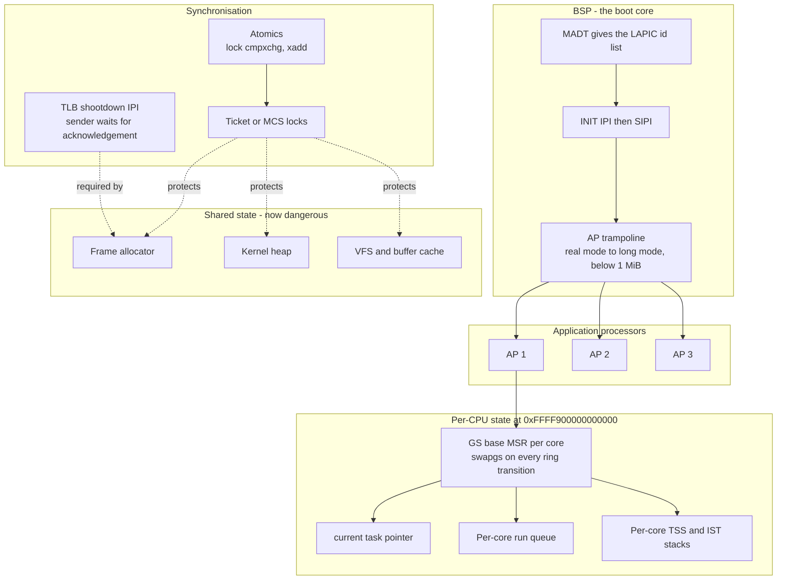
```mermaid
flowchart TD
    subgraph BSPB["BSP - the boot core"]
        MADTL["MADT gives the LAPIC id list"]
        TRAMP["AP trampoline<br/>real mode to long mode, below 1 MiB"]
        IPISEQ["INIT IPI then SIPI"]
    end
    subgraph APS["Application processors"]
        AP1["AP 1"]
        AP2["AP 2"]
        AP3["AP 3"]
    end
    subgraph PERCPU["Per-CPU state at 0xFFFF900000000000"]
        GSB["GS base MSR per core<br/>swapgs on every ring transition"]
        CURTASK["current task pointer"]
        RQP["Per-core run queue"]
        TSSP["Per-core TSS and IST stacks"]
    end
    subgraph SHARED["Shared state - now dangerous"]
        FRAMEA["Frame allocator"]
        HEAPS["Kernel heap"]
        VFSSH["VFS and buffer cache"]
    end
    subgraph SYNC["Synchronisation"]
        ATOM["Atomics<br/>lock cmpxchg, xadd"]
        TICKET["Ticket or MCS locks"]
        SHOOT["TLB shootdown IPI<br/>sender waits for acknowledgement"]
    end
    MADTL --> IPISEQ --> TRAMP --> AP1
    TRAMP --> AP2
    TRAMP --> AP3
    AP1 --> GSB
    GSB --> CURTASK
    GSB --> RQP
    GSB --> TSSP
    ATOM --> TICKET -.->|"protects"| FRAMEA
    TICKET -.->|"protects"| HEAPS
    TICKET -.->|"protects"| VFSSH
    SHOOT -.->|"required by"| FRAMEA
```

> [!question] The realisation this phase is built on
> Every global variable you wrote in Phases 0–11 was a single-core assumption. Not
> "might be" — *was*. The console cursor, the frame bitmap's next-free hint, the heap
> free list, `current_task`. Stage 12.5 is not a code review; it is the systematic
> repayment of eleven phases of debt. Budget for it honestly: it is the stage most
> likely to be underestimated in the entire project.

**Unlocks:** all cores. Also, honestly: this is the phase the roadmap marks
**cuttable**. A single-core OS is a legitimate `v1.0`.

---

### Phase 13 — Unix Process Model

**Owner:** Member B. **Milestone:** M6.

| Stage | Read | Capability it adds |
|---|---|---|
| [[Stage 13.1 - The File Descriptor Table]] | [[10 - The Syscall Path\|10]] | Per-process fds, `dup`, `dup2`, close-on-exec |
| [[Stage 13.2 - fork]] | [[09 - Tasks, Scheduling and Concurrency\|09]] · [[07 - Memory Management\|07]] | A child process that is a copy of its parent |
| [[Stage 13.3 - Copy-on-Write]] | [[07 - Memory Management\|07]] | `fork` that does not copy memory until it is written |
| [[Stage 13.4 - exec and Argument Passing]] | [[03 - The Address Space\|03]] · [[16 - The Build and Artefact Pipeline\|16]] | `execve` with `argv` and `envp` |
| [[Stage 13.5 - wait, exit codes, and Zombies]] | [[09 - Tasks, Scheduling and Concurrency\|09]] | `waitpid`, exit status, orphan reparenting |
| [[Stage 13.6 - Pipes]] | [[12 - The Filesystem Stack\|12]] | `pipe()`, blocking reads, EOF, `SIGPIPE` |
| [[Stage 13.7 - Signals]] | [[08 - Interrupts and Exceptions\|08]] · [[10 - The Syscall Path\|10]] | Delivery, handlers, masks, the signal trampoline |
| [[Stage 13.8 - The TTY Layer and Line Discipline]] | [[12 - The Filesystem Stack\|12]] | Canonical mode, echo, editing, `Ctrl-C`/`Ctrl-D`/`Ctrl-Z` |
| [[Stage 13.9 - Process Groups and Job Control]] | [[09 - Tasks, Scheduling and Concurrency\|09]] | Foreground and background, `jobs`/`fg`/`bg` |
| [[Stage 13.10 - Userspace malloc]] | [[07 - Memory Management\|07]] | `brk`/`mmap` and a real user allocator |
| [[Stage 13.11 - Filling Out libc]] | [[10 - The Syscall Path\|10]] | `stdio`, `string`, `stdlib`, `time` — enough to port programs |
| [[Stage 13.12 - A Real Shell]] | [[10 - The Syscall Path\|10]] | Pipelines, redirection, job control, `$?`, quoting |

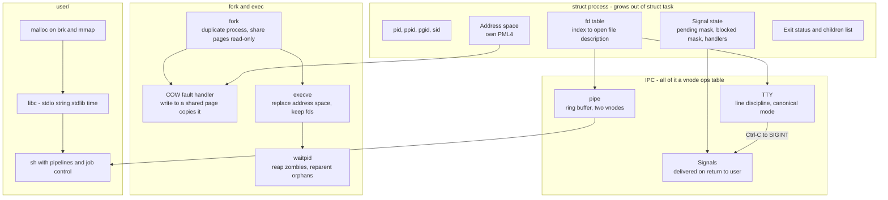
```mermaid
flowchart TD
    subgraph PROC["struct process - grows out of struct task"]
        PID["pid, ppid, pgid, sid"]
        FDT["fd table<br/>index to open file description"]
        ASPACE["Address space<br/>own PML4"]
        SIGST["Signal state<br/>pending mask, blocked mask, handlers"]
        EXITS["Exit status and children list"]
    end
    subgraph FORKEX["fork and exec"]
        FORKB["fork<br/>duplicate process, share pages read-only"]
        COW["COW fault handler<br/>write to a shared page copies it"]
        EXECB["execve<br/>replace address space, keep fds"]
        WAITB["waitpid<br/>reap zombies, reparent orphans"]
        FORKB --> COW
        FORKB --> EXECB --> WAITB
    end
    subgraph IPC["IPC - all of it a vnode ops table"]
        PIPEB["pipe<br/>ring buffer, two vnodes"]
        TTYB["TTY<br/>line discipline, canonical mode"]
        SIGB["Signals<br/>delivered on return to user"]
    end
    subgraph USER["user/"]
        MALLOCU["malloc on brk and mmap"]
        LIBCU["libc - stdio string stdlib time"]
        SHU["sh with pipelines and job control"]
    end
    FDT --> PIPEB
    FDT --> TTYB
    SIGST --> SIGB
    ASPACE --> COW
    TTYB -->|"Ctrl-C to SIGINT"| SIGB
    PIPEB --> SHU
    MALLOCU --> LIBCU --> SHU
```

> [!note] Why `fork` is the hardest thing in this phase and not `exec`
> `exec` throws an address space away and builds a new one — you already do that in
> Phase 7. `fork` must produce a *second* process that is byte-identical to the first
> including its stack, its open files and its position mid-syscall, and then return
> two different values from one call. Copy-on-write then makes it fast by lying to
> both of them until one writes. Every page-table and refcount bug you have ever
> written shows up here at once.

**Unlocks:** "Unix-like" becomes a defensible claim. The roadmap marks this
**never cut**: `fork`, pipes and signals are precisely what the phrase means.

---

### Phase 14 — Networking

**Owner:** both — A on drivers, B on the stack. **Milestone:** M7.

| Stage | Read | Capability it adds |
|---|---|---|
| [[Stage 14.1 - The Network Device Interface]] | [[13 - The Network Stack\|13]] | One API over any NIC, plus a loopback device |
| [[Stage 14.2 - The virtio-net Driver]] | [[13 - The Network Stack\|13]] | Packets in and out under QEMU |
| [[Stage 14.3 - The e1000 Driver]] | [[13 - The Network Stack\|13]] | Packets in and out on real hardware |
| [[Stage 14.4 - Packet Buffers and the Receive Path]] | [[13 - The Network Stack\|13]] | Interrupt-driven RX with reusable buffers |
| [[Stage 14.5 - Ethernet and ARP]] | [[13 - The Network Stack\|13]] | Resolve IPs to MACs; answer ARP requests |
| [[Stage 14.6 - IPv4 and ICMP]] | [[13 - The Network Stack\|13]] | **It answers ping** |
| [[Stage 14.7 - UDP and the Socket Layer]] | [[13 - The Network Stack\|13]] | `socket`/`bind`/`sendto`/`recvfrom` |
| [[Stage 14.8 - TCP Connection Management]] | [[13 - The Network Stack\|13]] | The state machine, handshake and teardown |
| [[Stage 14.9 - TCP Reliability and Flow Control]] | [[13 - The Network Stack\|13]] | Retransmission, windows, RTT estimation |
| [[Stage 14.10 - DHCP and DNS]] | [[13 - The Network Stack\|13]] | Get an address automatically; resolve names |
| [[Stage 14.11 - Network Utilities]] | [[13 - The Network Stack\|13]] | `ping`, `ifconfig`, `netcat`, a tiny HTTP server |

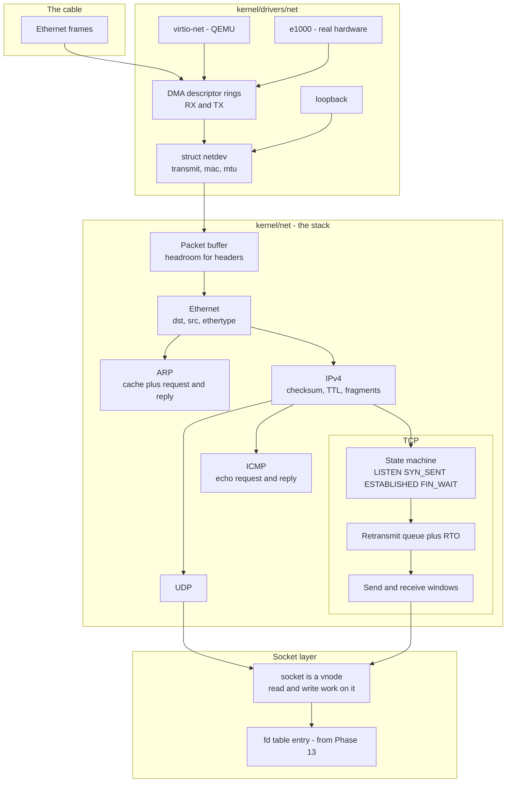
```mermaid
flowchart TD
    subgraph WIRE["The cable"]
        PHY["Ethernet frames"]
    end
    subgraph NICD["kernel/drivers/net"]
        NETDEV["struct netdev<br/>transmit, mac, mtu"]
        VIRTIO["virtio-net - QEMU"]
        E1000["e1000 - real hardware"]
        RINGS["DMA descriptor rings<br/>RX and TX"]
        LOOP["loopback"]
    end
    subgraph STACK["kernel/net - the stack"]
        PBUF["Packet buffer<br/>headroom for headers"]
        ETH["Ethernet<br/>dst, src, ethertype"]
        ARP["ARP<br/>cache plus request and reply"]
        IP["IPv4<br/>checksum, TTL, fragments"]
        ICMP["ICMP<br/>echo request and reply"]
        UDP["UDP"]
        subgraph TCPB["TCP"]
            TSM["State machine<br/>LISTEN SYN_SENT ESTABLISHED FIN_WAIT"]
            RETX["Retransmit queue plus RTO"]
            WND["Send and receive windows"]
        end
    end
    subgraph SOCK["Socket layer"]
        SOCKV["socket is a vnode<br/>read and write work on it"]
        FDN["fd table entry - from Phase 13"]
    end
    PHY --> RINGS --> NETDEV
    VIRTIO --> RINGS
    E1000 --> RINGS
    LOOP --> NETDEV
    NETDEV --> PBUF --> ETH
    ETH --> ARP
    ETH --> IP --> ICMP
    IP --> UDP --> SOCKV
    IP --> TSM --> RETX --> WND --> SOCKV
    SOCKV --> FDN
```

> [!warning] The honest note about this phase
> Phase 14 is 10–14 weeks, the largest single chunk in the project, and the roadmap
> names it **first to cut**. It is also the phase where a subtle bug is hardest to see,
> because the failure mode is "the other machine ignored us" rather than a fault. Two
> disciplines pay for themselves immediately: build the loopback device in Stage 14.1
> and test every layer against it before any real NIC exists, and keep Wireshark open
> on the QEMU tap from Stage 14.5 onward.

**Unlocks:** the M7 demo — `ping` from your laptop reaches your OS and comes back.

---

### Phase 15 — Hardening & Real Hardware

**Owner:** shared. **Milestone:** M8, `v1.0.0`.

| Stage | Read | Capability it adds |
|---|---|---|
| [[Stage 15.1 - NX and W^X]] | [[15 - Security Architecture\|15]] · [[07 - Memory Management\|07]] | No page is both writable and executable |
| [[Stage 15.2 - SMEP and SMAP]] | [[15 - Security Architecture\|15]] · [[04 - Privilege and the Ring Boundary\|04]] | The kernel cannot accidentally run or read user memory |
| [[Stage 15.3 - Guard Pages and Stack Protection]] | [[15 - Security Architecture\|15]] · [[09 - Tasks, Scheduling and Concurrency\|09]] | Stack overflow faults cleanly instead of corrupting |
| [[Stage 15.4 - KASLR]] | [[15 - Security Architecture\|15]] · [[03 - The Address Space\|03]] | Kernel base randomised on every boot |
| [[Stage 15.5 - Auditing the Syscall Boundary]] | [[15 - Security Architecture\|15]] · [[10 - The Syscall Path\|10]] | Every user pointer, length and fd validated |
| [[Stage 15.6 - Users, Groups, and Permissions]] | [[15 - Security Architecture\|15]] · [[12 - The Filesystem Stack\|12]] | `uid`/`gid`, mode bits enforced, `setuid` |
| [[Stage 15.7 - Resource Limits]] | [[15 - Security Architecture\|15]] | A process cannot exhaust the machine |
| [[Stage 15.8 - Real Hardware Bring-Up]] | [[02 - The Boot Chain\|02]] · [[17 - The Test Architecture\|17]] | **It boots on an actual computer** |
| [[Stage 15.9 - The Release Checklist]] | [[16 - The Build and Artefact Pipeline\|16]] | `v1.0.0` published with artefacts |

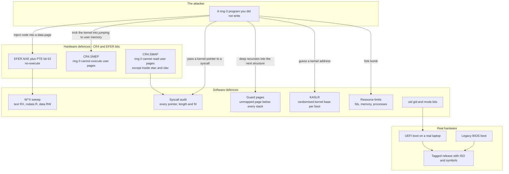
```mermaid
flowchart TD
    subgraph THREAT["The attacker"]
        R3["A ring-3 program you did not write"]
    end
    subgraph HWD["Hardware defences - CR4 and EFER bits"]
        NX["EFER.NXE plus PTE bit 63<br/>no-execute"]
        SMEP["CR4.SMEP<br/>ring 0 cannot execute user pages"]
        SMAP["CR4.SMAP<br/>ring 0 cannot read user pages<br/>except inside stac and clac"]
    end
    subgraph SWD["Software defences"]
        WX["W^X sweep<br/>text RX, rodata R, data RW"]
        GUARD["Guard pages<br/>unmapped page below every stack"]
        KASLRB["KASLR<br/>randomised kernel base per boot"]
        AUDIT["Syscall audit<br/>every pointer, length and fd"]
        RLIM["Resource limits<br/>fds, memory, processes"]
        PERM["uid gid and mode bits"]
    end
    subgraph METAL["Real hardware"]
        UEFI["UEFI boot on a real laptop"]
        BIOSL["Legacy BIOS boot"]
        REL["Tagged release with ISO and symbols"]
    end
    R3 -->|"inject code into a data page"| NX
    R3 -->|"trick the kernel into jumping to user memory"| SMEP
    R3 -->|"pass a kernel pointer to a syscall"| AUDIT
    R3 -->|"deep recursion into the next structure"| GUARD
    R3 -->|"guess a kernel address"| KASLRB
    R3 -->|"fork bomb"| RLIM
    NX --> WX
    SMAP --> AUDIT
    PERM --> UEFI --> REL
    BIOSL --> REL
```

> [!danger] Do not save Stage 15.8 for month 20
> The risk register rates "real hardware does not boot at M8" as Medium likelihood and
> High impact, and its mitigation is unambiguous: **test on metal from M1**. Buy a
> cheap second-hand x86_64 UEFI laptop now and boot every milestone build on it.
> Discovering at month 20 that an assumption was QEMU-specific is a project-ending
> class of bug, and it is entirely avoidable by spending twenty minutes per milestone.

**Unlocks:** `v1.0.0`. The claim "we built an operating system" becomes checkable by
someone else, on their own hardware.

---

## 5. The dependency graph

### 5.1 What genuinely blocks what

The stage numbers imply a total order. The truth is a partial order, and the gap
between them is the entire budget for parallel work.

A **solid** arrow is a hard block: the downstream phase cannot start meaningfully
without the upstream one. A **dotted** arrow is soft: you can start, and you will hit
a wall partway through that the upstream phase removes.

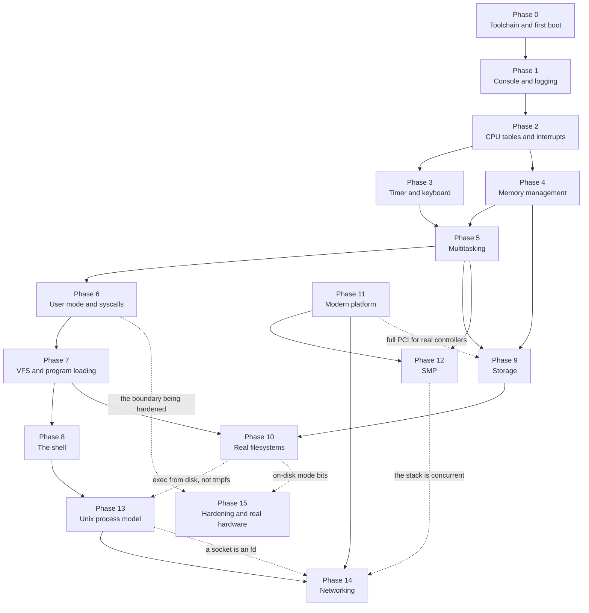
```mermaid
flowchart TD
    P0["Phase 0<br/>Toolchain and first boot"]
    P1["Phase 1<br/>Console and logging"]
    P2["Phase 2<br/>CPU tables and interrupts"]
    P3["Phase 3<br/>Timer and keyboard"]
    P4["Phase 4<br/>Memory management"]
    P5["Phase 5<br/>Multitasking"]
    P6["Phase 6<br/>User mode and syscalls"]
    P7["Phase 7<br/>VFS and program loading"]
    P8["Phase 8<br/>The shell"]
    P9["Phase 9<br/>Storage"]
    P10["Phase 10<br/>Real filesystems"]
    P11["Phase 11<br/>Modern platform"]
    P12["Phase 12<br/>SMP"]
    P13["Phase 13<br/>Unix process model"]
    P14["Phase 14<br/>Networking"]
    P15["Phase 15<br/>Hardening and real hardware"]

    P0 --> P1 --> P2
    P2 --> P3
    P2 --> P4
    P3 --> P5
    P4 --> P5
    P5 --> P6 --> P7 --> P8
    P4 --> P9
    P5 --> P9
    P9 --> P10
    P7 --> P10
    P11 --> P12
    P5 --> P12
    P8 --> P13
    P13 --> P14
    P11 --> P14
    P10 -.->|"exec from disk, not tmpfs"| P13
    P11 -.->|"full PCI for real controllers"| P9
    P12 -.->|"the stack is concurrent"| P14
    P13 -.->|"a socket is an fd"| P14
    P6 -.->|"the boundary being hardened"| P15
    P10 -.->|"on-disk mode bits"| P15
```

**Walking the graph.** The spine — 0 → 1 → 2 → 4 → 5 → 6 → 7 → 8 — is unavoidable and
is the reason M1 to M3 is roughly half the schedule. Phase 3 hangs off Phase 2 and
rejoins at Phase 5, which is the first genuine fork in the road.

After Phase 8 the graph opens up into three chains that barely touch:
**9 → 10** (storage then filesystems), **11 → 12** (platform then SMP), and
**13 → 14** (process model then networking). Phase 15 depends on everything and is
scheduled last, but the *reading* for it — [[15 - Security Architecture]] — belongs in
Phase 6.

The dotted `11 ⇢ 9` deserves a note: Phase 9 does its own narrow PCI scan in Stage
9.4, so it is genuinely startable before Phase 11. What it cannot do without full
enumeration is cope with a controller behind a bridge or with non-trivial IRQ routing
— which is exactly what real hardware presents and QEMU does not.

### 5.2 The two-person parallel lanes

The ownership split follows the seam in the system: hardware and memory on one side,
processes and files on the other.

| | **Member A — "Down"** | **Member B — "Up"** |
|---|---|---|
| Theme | Hardware and memory | Processes, files, userspace |
| Owns | `arch/`, `mm/`, `drivers/`, ACPI, APIC, PCI, SMP | `fs/`, `syscall/`, `sched/`, `libc/`, `user/`, `net/` |
| Phases | 0, 2, 3, 4, 9, 11, 12 | 5, 6, 7, 8, 10, 13, 14 |
| Also owns | toolchain container, build system | CI workflows, test harness, release |
| Shared | Phase 1, Phase 15, and `kernel/include/abi/` | Phase 1, Phase 15, and `kernel/include/abi/` |

```mermaid
flowchart LR
    subgraph M1L["M1 - it boots"]
        A1["A: Phase 0, Phase 2"]
        B1["B: Phase 1"]
    end
    subgraph M2L["M2 - it is interactive"]
        A2["A: Phase 3"]
        B2["B: Phase 4 heap, Phase 5"]
    end
    subgraph M3L["M3 - it has users"]
        A3["A: Phase 4 address spaces, fork prep"]
        B3["B: Phase 6, 7, 8"]
    end
    subgraph M4L["M4 - it remembers"]
        A4["A: Phase 9 AHCI and NVMe"]
        B4["B: Phase 10 on a stub blockdev"]
    end
    subgraph M5L["M5 - it is modern"]
        A5["A: Phase 11 ACPI APIC PCI"]
        B5["B: Phase 12 per-CPU and locking"]
    end
    subgraph M6L["M6 - it is Unix"]
        A6["A: Phase 12 AP bring-up"]
        B6["B: Phase 13"]
    end
    subgraph M7L["M7 - it is networked"]
        A7["A: Phase 14 NIC drivers"]
        B7["B: Phase 14 TCP/IP and sockets"]
    end
    subgraph M8L["M8 - it is hardened"]
        A8["A: Phase 15 real hardware"]
        B8["B: Phase 15 users and permissions"]
    end
    M1L --> M2L --> M3L --> M4L --> M5L --> M6L --> M7L --> M8L
```

> [!tip] The rule that makes those rows real
> **Write the header first, merge it, then implement both sides in parallel.** The M4
> row is only possible because `blockdev.hpp` is agreed and merged with a RAM-backed
> stub before either AHCI or FAT32 exists. The M7 row is only possible because
> `netdev.hpp` is agreed the same way. Without that habit, the two of you serialise and
> the schedule doubles. With it, you genuinely parallelise.

> [!note] Why A runs one phase ahead
> The dependency chain runs downward: A's work unblocks B's, rarely the reverse. So the
> default posture is A one phase ahead. When B is blocked waiting on A, B works on
> tests, tooling or documentation — **never** on A's files. Both members review
> everything, because the risk register rates "one member drops out" as *fatal*, and
> the only mitigation is that no knowledge has a single owner.

---

## 6. Coverage gaps — the honest section

The atlas has seventeen documents and sixteen phases, and the mapping is not onto.
These are the places where §4's "Read" column points at the *nearest* document rather
than a document written for that phase. Knowing this in advance stops you concluding
that you have missed something.

| Gap | Stages affected | Nearest coverage today | Severity |
|---|---|---|---|
| **No console/logging document** | 1.1–1.7 | [[05 - Kernel Initialisation Order]] for bring-up order, [[06 - The Subsystem Map]] for the driver band, [[17 - The Test Architecture]] for `kprintf` as the test primitive | Medium — the material is simple enough to learn from the stage notes, which are complete and rewritten for the framebuffer |
| **No platform document** | 11.1–11.8 | [[05 - Kernel Initialisation Order]] for ACPI/MADT/LAPIC/IOAPIC/HPET ordering, [[14 - SMP Architecture]] for the LAPIC, [[08 - Interrupts and Exceptions]] for routing, [[11 - The Storage Stack]] for PCI | **High** — eight stages, no stage notes yet, and it gates SMP and networking |
| **No shell document** | 8.1–8.4 | [[10 - The Syscall Path]], [[12 - The Filesystem Stack]] | Low — Phase 8 is assembly of existing parts, and the stage notes exist |
| **Process model is partial** | 13.2, 13.4–13.12 | [[07 - Memory Management]] covers COW, [[10 - The Syscall Path]] covers the fd table, [[09 - Tasks, Scheduling and Concurrency]] covers the task struct | Medium — twelve stages with two documented |
| **NIC drivers excluded by design** | 14.2, 14.3 | [[13 - The Network Stack]] states plainly that register programming belongs to the stage notes | Low — deliberate, and correct |
| **Filesystem write paths** | 10.3, 10.4, 10.6–10.9 | [[12 - The Filesystem Stack]] names only the read paths in its header | Medium — write and crash consistency are where the hard bugs are |
| **Release and metal bring-up** | 15.8, 15.9 | [[16 - The Build and Artefact Pipeline]], [[17 - The Test Architecture]], [[02 - The Boot Chain]] for both firmware legs | Low |

```mermaid
flowchart LR
    subgraph HAVE["Documented by a dedicated atlas document"]
        H1["Phases 0, 2, 4, 5, 6, 7, 9, 10, 12, 14, 15"]
    end
    subgraph PART["Partially documented"]
        H2["Phase 13<br/>2 of 12 stages named"]
        H3["Phase 3<br/>timer only"]
    end
    subgraph NONE["No dedicated document"]
        H4["Phase 1<br/>console and logging"]
        H5["Phase 8<br/>the shell"]
        H6["Phase 11<br/>modern platform"]
    end
    H6 -->|"highest value document to write next"| WRITE["Candidate document 20<br/>The Platform Layer"]
    H2 -->|"second"| WRITE2["Candidate document 21<br/>The Process Model"]
```

> [!note] What to do about it
> Do not write those documents now. Write each one **in the phase before you need it**,
> the same way the vault already instructs you to write a phase's stage notes before
> starting the phase. A platform document written in Phase 10, while Phase 11 is the
> next thing you will do, will be correct. One written now would be speculation.

---

## 7. The capability curve

### 7.1 What the machine can actually do

The single most useful column here is the last one: the sentence you would say to a
non-programmer to explain what you have.

| After | Phase | The OS can now… | Demo in one sentence |
|---|---|---|---|
| 0.5 | 0 | Reach `kmain` and halt | "The computer is running my code." |
| 0.6 | 0 | Emit a line on the serial port | "It said hello." |
| 0 | 0 | Report its own faults with a register dump; CI boots every push | "It tells me when it breaks." |
| 1 | 1 | Draw text on the screen, keep a log, name functions in a backtrace | "It has a screen and a diary." |
| 2 | 2 | Catch every CPU exception; receive device interrupts | "It survives its own mistakes." |
| 3 | 3 | Count time; read a typed line | "I can type at it." |
| 4 | 4 | Allocate physical frames, map pages, `kmalloc` | "It manages its own memory." |
| 5 | 5 | Run several kernel tasks preemptively; sleep and block | "It does two things at once." |
| 6 | 6 | Run untrusted code in ring 3 that asks the kernel for things | "It can run a program safely." |
| 7 | 7 | Open files by name and execute an ELF from one | "It runs programs off a filesystem." |
| **8** | **8** | **Boot to a prompt, take commands, run programs** | **"It's an operating system."** |
| 9 | 9 | Read and write real disk sectors through a cache | "It talks to a real hard disk." |
| **10** | **10** | **Mount FAT32 and ext2, and persist across a power cycle** | **"It remembers things after you turn it off."** |
| 11 | 11 | Enumerate PCI, use the APICs, know the date, power itself off | "It behaves like a modern machine." |
| **12** | **12** | **Run on every core** | **"It uses all four processors."** |
| 13 | 13 | `fork`, `exec`, pipes, signals, `Ctrl-C`, job control | "It's Unix." |
| **14** | **14** | **Answer a ping; accept a TCP connection** | **"It's on the network."** |
| **15** | **15** | **Enforce W^X, SMEP/SMAP, users; boot on real hardware** | **"It boots on that laptop over there."** |

### 7.2 The curve, drawn

```mermaid
flowchart LR
    subgraph FLOOR["It exists"]
        C0["Phase 0<br/>runs and speaks"]
        C1["Phase 1<br/>visible and debuggable"]
        C2["Phase 2<br/>survivable"]
    end
    subgraph KERNEL["It is a kernel"]
        C3["Phase 3<br/>has a clock and input"]
        C4["Phase 4<br/>owns memory"]
        C5["Phase 5<br/>concurrent"]
    end
    subgraph OS["It is an OS"]
        C6["Phase 6<br/>has a privilege boundary"]
        C7["Phase 7<br/>has files and programs"]
        C8["Phase 8<br/>INTERACTIVE"]
    end
    subgraph PRODUCT["It is a product"]
        C9["Phase 9<br/>real disks"]
        C10["Phase 10<br/>PERSISTENT"]
        C11["Phase 11<br/>modern platform"]
        C12["Phase 12<br/>MULTICORE"]
        C13["Phase 13<br/>Unix"]
        C14["Phase 14<br/>NETWORKED"]
        C15["Phase 15<br/>REAL HARDWARE"]
    end
    C0 --> C1 --> C2 --> C3 --> C4 --> C5 --> C6 --> C7 --> C8
    C8 --> C9 --> C10
    C8 --> C11 --> C12
    C10 --> C13 --> C14
    C12 --> C15
    C14 --> C15
```

Note the shape. The chain from Phase 0 to Phase 8 is a single line — nothing can be
skipped and nothing can be reordered. After Phase 8 it becomes a mesh, and that is
where a two-person team stops queuing and starts genuinely parallelising.

### 7.3 Where the effort actually goes

```mermaid
pie showData
    title Nominal weeks per milestone in an 88-week plan
    "M1 boots - phases 0 to 2" : 8
    "M2 interactive kernel - phases 3 to 5" : 12
    "M3 shell - phases 6 to 8" : 14
    "M4 persistence - phases 9 to 10" : 12
    "M5 platform and SMP - phases 11 to 12" : 12
    "M6 Unix - phase 13" : 10
    "M7 networking - phase 14" : 12
    "M8 hardening - phase 15" : 8
```

The uncomfortable observation: reaching "it is an operating system" at M3 is 34 of 88
weeks — roughly 39% of the schedule for 100% of the claim. Everything after is
quality, and quality is where the other 61% lives.

---

## 8. The timeline

### 8.1 The whole project as a schedule

```mermaid
gantt
    title The 16 phases and the seven moments that matter
    dateFormat YYYY-MM-DD
    axisFormat %b %Y

    section M1 It boots
    Phase 0 Toolchain and first boot   :p0, 2026-01-05, 3w
    FIRST BOOT at Stage 0.5            :milestone, mfb, 2026-01-19, 0d
    FIRST OUTPUT at Stage 0.6          :milestone, mfo, 2026-01-22, 0d
    Phase 1 Console and logging        :p1, after p0, 2w
    Phase 2 CPU tables and interrupts  :p2, after p1, 3w
    Tag v0.1.0                         :milestone, m1, 2026-03-02, 0d

    section M2 Interactive kernel
    Phase 3 Timer and keyboard         :p3, after p2, 2w
    Phase 4 Memory management          :p4, after p3, 4w
    Phase 5 Multitasking               :p5, after p4, 6w
    Tag v0.2.0                         :milestone, m2, 2026-05-25, 0d

    section M3 It has users
    Phase 6 User mode and syscalls     :p6, after p5, 4w
    Phase 7 VFS and program loading    :p7, after p6, 5w
    Phase 8 The shell                  :p8, after p7, 5w
    INTERACTIVE SHELL                  :milestone, msh, 2026-08-31, 0d

    section M4 It remembers
    Phase 9 Storage                    :p9, after p8, 6w
    Phase 10 Real filesystems          :p10, after p9, 6w
    DATA SURVIVES REBOOT               :milestone, mper, 2026-11-23, 0d

    section M5 It is modern
    Phase 11 Modern platform           :p11, after p10, 5w
    Phase 12 SMP                       :p12, after p11, 7w
    MULTIPLE CORES ONLINE              :milestone, msmp, 2027-02-15, 0d

    section M6 It is Unix
    Phase 13 Unix process model        :p13, after p12, 10w
    Tag v0.6.0                         :milestone, m6, 2027-04-26, 0d

    section M7 It is networked
    Phase 14 Networking                :p14, after p13, 12w
    IT ANSWERS A PING                  :milestone, mping, 2027-04-26, 0d

    section M8 It is hardened
    Phase 15 Hardening and metal       :p15, after p14, 8w
    BOOTS ON REAL HARDWARE             :milestone, mmetal, 2027-09-13, 0d
```

> [!warning] These dates are arithmetic, not a commitment
> The bar lengths are the midpoints of the ranges in [[15 - Roadmap and Milestones]],
> starting from a notional January. The total, **88 weeks**, sits inside the honest
> 72–104 week estimate — roughly 18 to 26 months part-time for two people. That number
> is uncomfortable and it is real. The correct response to disliking it is §9, cutting
> scope deliberately, not compressing the estimates. Re-estimate at every milestone
> retro using actual velocity, not hope. If a phase runs 50% over, stop and re-plan.

> [!note] One milestone is placed early on purpose
> **IT ANSWERS A PING** is drawn at the start of Phase 14, not the end, because
> [[Stage 14.6 - IPv4 and ICMP]] is the sixth of eleven stages and ICMP echo works long
> before TCP does. It is the best morale checkpoint in the whole project: you type
> `ping` on your laptop and your own operating system replies.

### 8.2 The seven moments

```mermaid
timeline
    title The moments worth stopping and celebrating
    section Foundation
        Stage 0.5 : FIRST BOOT : Limine loads the kernel and it halts where you told it to
        Stage 0.6 : FIRST OUTPUT : a line of your text leaves COM1
    section It becomes an OS
        Phase 8 : INTERACTIVE SHELL : it boots to a prompt and runs your programs
        Phase 10 : DATA SURVIVES REBOOT : write a file, power cycle, read it back
    section It becomes a product
        Phase 12 : MULTIPLE CORES : every processor in the machine is running your kernel
        Phase 14 : IT ANSWERS A PING : another computer talks to yours over a cable
        Phase 15 : REAL HARDWARE : it boots on a laptop with no emulator underneath
```

---

## 9. Cut lines — decided now, not at month 14

If the schedule slips, and it will, these are the pre-agreed places to cut. Deciding in
advance prevents the far worse outcome: cutting in a panic, badly, at the point where
you have the least judgement available.

### 9.1 The milestone-level cuts

These are already agreed in [[15 - Roadmap and Milestones]] and are binding.

| Priority | Scope | Verdict |
|---|---|---|
| 1 | M1–M4, boot through persistence | **Never cut.** Below this it is not an operating system |
| 2 | M5 platform — ACPI and PCI | **Never cut.** Without ACPI it cannot power itself off |
| 3 | M5 SMP | **Cuttable.** Single-core is a legitimate `v1.0` |
| 4 | M6 process model | **Never cut.** `fork`, pipes and signals are what "Unix-like" means |
| 5 | M7 networking | **First to cut.** Ship `v1.0` at M6; networking becomes `v1.1` |
| 6 | M8 hardening | **Partially cuttable.** Keep NX and W^X; defer users and permissions |

```mermaid
flowchart TD
    SLIP["The schedule has slipped"] --> Q1{"By how much?"}
    Q1 -->|"a few weeks"| FINE["Do nothing.<br/>Re-estimate at the next retro<br/>using actual velocity"]
    Q1 -->|"one phase overrun by 50%"| STOP["Stop and re-plan the phase.<br/>Do not push through"]
    Q1 -->|"a whole milestone"| CUT1["Cut networking.<br/>Ship v1.0 at M6,<br/>make Phase 14 the v1.1 goal"]
    CUT1 --> Q2{"Still behind?"}
    Q2 -->|"yes"| CUT2["Also cut SMP.<br/>Single-core v1.0<br/>lands at 12 to 16 months"]
    Q2 -->|"no"| SHIP["Ship"]
    CUT2 --> Q3{"Still behind?"}
    Q3 -->|"yes"| CUT3["Trim Phase 15 to<br/>NX, W^X, SMEP, SMAP<br/>and metal bring-up.<br/>Defer users and rlimits"]
    Q3 -->|"no"| SHIP
    CUT3 --> FLOOR2["The floor.<br/>Phases 0 to 13 plus NX and W^X<br/>plus a real machine.<br/>Do not cut below this"]
```

**If you cut one thing, cut networking.** It is the largest single chunk at 10–14 weeks,
the most self-contained, and the least load-bearing for the claim "we built an
operating system."

**If you cut two, cut networking and SMP.** That brings `v1.0` to roughly 12–16 months
and loses nothing essential. A single-core OS that boots real hardware, persists data
and runs a Unix process model is unambiguously a real operating system.

### 9.2 Stage-level cuts, one level finer

> [!warning] These are proposals, not yet agreed
> The roadmap pre-agrees cuts at **milestone** granularity only. The table below is the
> same decision made one level finer, and it is offered so that the conversation
> happens once, early, at the same meeting. **Nothing here is binding until you record
> it as an ADR.** Do that at the M3 retro, when you have three milestones of real
> velocity data and the decision is still cheap.

| Stage | Cut? | What you lose | What still works |
|---|---|---|---|
| [[Stage 1.4 - Double Buffering]] | Yes, defer | Fast scrolling; the console visibly tears | Everything on screen still legible |
| [[Stage 1.7 - Symbolised Backtraces]] | **No** | Every panic becomes raw hex for the rest of the project | — |
| [[Stage 9.6 - The NVMe Driver]] | Yes, if AHCI works | NVMe machines; QEMU and most SATA hardware unaffected | Persistence via AHCI |
| [[Stage 10.4 - Long Filenames (VFAT)]] | Yes | Filenames longer than 8.3 on FAT32 | ext2 has no such limit |
| [[Stage 10.9 - fsck and Crash Consistency]] | Yes, with a warning | Recovery after an unclean shutdown; power-cut testing becomes destructive | Clean shutdowns are safe |
| [[Stage 11.7 - The RTC and Wall Clock Time]] | Yes | Real dates on files; everything is epoch zero | Monotonic time from HPET/TSC |
| [[Stage 12.7 - Scalable Locking]] | Yes | Throughput above roughly four cores | Correctness — a simple spinlock is still correct |
| [[Stage 13.9 - Process Groups and Job Control]] | Yes, reluctantly | `Ctrl-Z`, `jobs`, `fg`, `bg` | `Ctrl-C` still works via signals |
| [[Stage 14.10 - DHCP and DNS]] | Yes | Automatic addressing and name resolution | Static IP configuration |
| [[Stage 15.4 - KASLR]] | Yes | Randomised kernel base | NX, W^X, SMEP and SMAP — the defences that matter more |
| [[Stage 15.8 - Real Hardware Bring-Up]] | **Never** | The whole claim | — |

### 9.3 What is never cuttable, and why

```mermaid
flowchart TD
    subgraph FLOORB["The floor - cut below this and the claim fails"]
        F1["Stage 0.6 Serial output<br/>without it nothing else is debuggable"]
        F2["Stage 0.7 Panic and KASSERT<br/>silent corruption costs more than it saves"]
        F3["Stage 0.9 CI from day one<br/>retrofitting CI never happens"]
        F4["Stage 1.7 Symbolised backtraces<br/>pays for itself within two phases"]
        F5["Phase 6 syscall validation<br/>a hole here is not a bug, it is the absence of an OS"]
        F6["Phase 13 fork, pipes, signals<br/>this is what Unix-like means"]
        F7["Stage 15.8 Real hardware<br/>the difference between an OS and an emulator toy"]
    end
```

The pattern in that list: everything on the floor is either **a tool that makes later
work possible** or **the thing the project is actually claiming**. Features are
cuttable. Feedback loops are not.

---

## 10. Failure modes

Symptom-first, because that is the order you will meet them.

| Symptom | Actual cause | Fix |
|---|---|---|
| "I finished the stage but I have no idea what I built" | You read the stage note and not the atlas document behind it | §4, the Read column. Read §2 of that document |
| "I am blocked and there is nothing to do" | You are looking at the stage list, which is a total order, instead of §5.1, which is not | Find a phase in your own lane with no incoming solid edge |
| "We keep waiting for each other" | An interface was not agreed before implementation started | The interface-first rule in §5.2. Write and merge the header first |
| "The screen went black three stages ago" | Almost always Phase 4: your own page tables do not map the framebuffer | `git diff` against the last green commit. This is why you commit after every green stage |
| "A Phase 9 bug that makes no sense" | A Phase 4 frame-allocator bug handing out reserved memory | Frame allocator bugs surface phases later. Assert the memmap types |
| "It works in QEMU and not on the laptop" | Something was emulator-specific, and it accumulated | Boot every milestone on metal. Do not let this pile up to Stage 15.8 |
| "Phase 12 broke everything" | Correct. Eleven phases of globals were single-core assumptions | Stage 12.5 is that debt, itemised. Budget for it |
| "We are 40% through the stages and 20% through the time" | Stage counts are not effort. Phase 13 has twelve stages and Phase 3 has three | Track weeks against §8.1, never stage counts |

> [!note] The one that is not a bug
> "This is taking much longer than I expected" is not a failure mode. It is the
> schedule. Every hobby OS that shipped took this long.

---

## 11. Masterclass notes

> [!question] Discussion prompts
> 1. The dependency graph in §5.1 has three chains after Phase 8 that barely touch. If
>    you had **three** developers instead of two, where would the third one go, and
>    what would break about the ownership split in §5.2?
> 2. Phase 8 is the milestone that makes the project "an operating system", and it is
>    34 of 88 weeks in. Argue for reordering the schedule to reach it sooner. Then
>    argue against your own proposal using the graph in §5.1.
> 3. §9 says cut networking first. Networking is also the phase most people would name
>    if asked what a modern OS does. Reconcile those.
> 4. Phase 11 has eight stages and no dedicated atlas document, while Phase 0 has nine
>    stages and four documents. What does that ratio tell you about how this atlas was
>    written, and is it the wrong way round?
> 5. Stage 12.5 — "audit the kernel for races" — is repayment of debt taken on in
>    Phases 0 through 11. Name three specific globals from earlier phases that will
>    appear on that list, and say for each whether the fix is a lock or a per-CPU copy.

- [ ] You understand this when you can name, for any stage number said aloud, the phase, the owner, and the atlas document — without looking
- [ ] You understand this when you can draw the §5.1 dependency graph from memory and defend each solid edge as genuinely blocking
- [ ] You understand this when you can say what the OS can *do* after each phase in one sentence, in order, with no notes
- [ ] You understand this when you can state the cut order and the reason for each cut, and identify the floor below which cutting fails
- [ ] You understand this when you can explain why Phase 8 and not Phase 15 is the milestone that matters most

**Board plan** — the order to draw this on a whiteboard:

1. Three columns: work, understanding, worth. One arrow each way. (§2)
2. The spine: 0 → 1 → 2 → 4 → 5 → 6 → 7 → 8, left to right, in one line.
3. Hang Phase 3 off Phase 2 and rejoin at Phase 5. This is the first fork.
4. After Phase 8, split into three chains: 9→10, 11→12, 13→14. Draw them as parallel rows.
5. Phase 15 at the far right, arrows into it from everything.
6. Two horizontal bands over the whole picture: A above, B below. Colour the phases.
7. Mark the seven moments as vertical bars: 0.5, 0.6, Phase 8, 10, 12, 14, 15.
8. Under each phase, one sentence: what the machine can now do.
9. Draw the cut line: strike through Phase 14, then Phase 12. Show that the spine survives.
10. Circle Phase 8. Write "this is where it becomes an OS" and stop.

**Time budget:** 25 minutes as the opening orientation of session 1; 20 minutes as the
closing review in session 8, where the same board is redrawn from memory by the
audience rather than the presenter.

---

## 12. Related

**Navigation:** [[00 - Start Here]] · [[Progress Tracker]] · [[15 - Roadmap and Milestones]] · [[12 - Team Workflow]] · [[19 - The Eight-Hour Masterclass]]

**Every document this page maps onto:** [[01 - What Happens at Power-On]] · [[02 - The Boot Chain]] · [[03 - The Address Space]] · [[04 - Privilege and the Ring Boundary]] · [[05 - Kernel Initialisation Order]] · [[06 - The Subsystem Map]] · [[07 - Memory Management]] · [[08 - Interrupts and Exceptions]] · [[09 - Tasks, Scheduling and Concurrency]] · [[10 - The Syscall Path]] · [[11 - The Storage Stack]] · [[12 - The Filesystem Stack]] · [[13 - The Network Stack]] · [[14 - SMP Architecture]] · [[15 - Security Architecture]] · [[16 - The Build and Artefact Pipeline]] · [[17 - The Test Architecture]]

**Phase overviews:** [[Phase 0 - Overview]] · [[Phase 1 - Overview]] · [[Phase 2 - Overview]] · [[Phase 3 - Overview]] · [[Phase 4 - Overview]] · [[Phase 5 - Overview]] · [[Phase 6 - Overview]] · [[Phase 7 - Overview]] · [[Phase 8 - Overview]] · [[Phase 9 - Overview]] · [[Phase 10 - Overview]] · [[Phase 11 - Overview]] · [[Phase 12 - Overview]] · [[Phase 13 - Overview]] · [[Phase 14 - Overview]] · [[Phase 15 - Overview]]

**Decisions that shape the map:** [[ADR-0002 - Target x86_64 Not i686]] · [[ADR-0003 - Limine as the Bootloader]] · [[ADR-0009 - Filesystem Strategy FAT32 then ext2]] · [[05 - Gap Analysis (v1 to Product)]] · [[Capstone - You Built an OS]]
