# 19 — The Eight-Hour Masterclass

> [!abstract] What this document covers
> A runbook for teaching the whole atlas in one day, to a room of competent programmers
> with no operating-systems background. Eight one-hour sessions, each with objectives
> stated as things the learner can *do*, a minute-by-minute plan, an exact board plan,
> the anchor diagram it is built on, Socratic questions paired with the misconception
> each one surfaces, a hands-on exercise tied to a real stage, and a checkpoint that
> gates the next session. This is a lesson plan, not a summary. Somebody who has read
> the atlas once should be able to teach from this cold.

**Zoom level:** Cross-cutting — a teaching artefact, not a description of the system
**Built by:** every document in this atlas; the board plans in each document's §9 are the
raw material this one assembles
**Prerequisites for the teacher:** all seventeen atlas documents, read once
**Prerequisites for the learner:** §2 of this document
**Runs:** 8 × 60 minutes, plus breaks

> [!note] One reconciliation
> Every atlas document carries a `**Masterclass session:** N` field in its header. Those
> fields were written per-document, before this runbook existed, and several of them
> disagree with the table in §4. **§4 is authoritative.** The per-document fields tell
> you roughly where a document lands; §4 tells you what is actually taught when.

---

## 1. How to use this runbook

The day has one thesis, stated in the first five minutes and returned to in the last
five: **an operating system is not a thing the hardware knows about.** The CPU knows
about a reset vector, page tables, a privilege bit in `CS`, and a table of 256 gates.
Everything else — processes, files, sockets, users — is a fiction the kernel maintains
on top of those four mechanisms. The eight sessions are the four mechanisms first, then
the fictions built on them.

### 1.1 The shape of the day

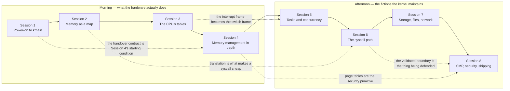

Solid arrows are the running order. Dotted arrows are the four callbacks the teacher
must make explicitly — each one is a moment where a room that has been collecting
facts suddenly sees a system. Do not let them pass silently. Say, out loud, *"this is
the thing we drew at 09:40"*, and point at the board if it is still there.

### 1.2 The teaching loop inside every session

Every session runs the same loop. The loop is the point: a fact stated is not a fact
learned, and the only reliable evidence of learning is a learner drawing something
unprompted.

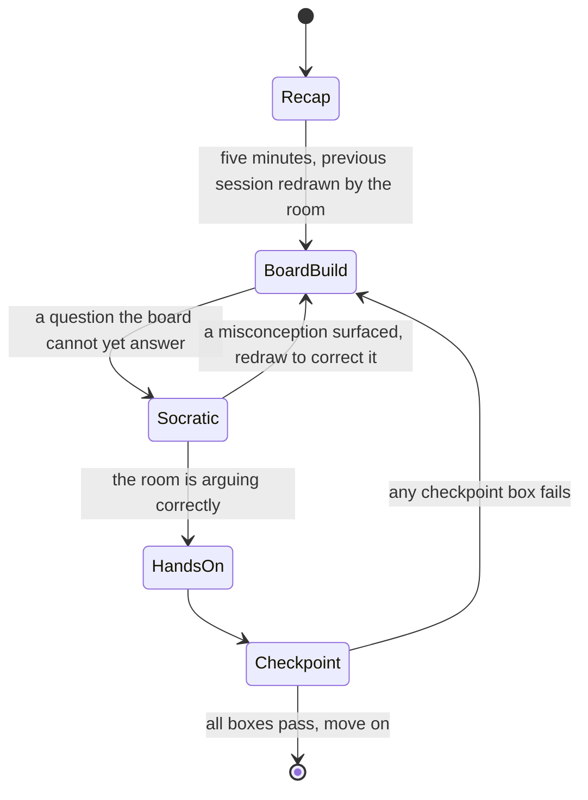

The `Checkpoint --> BoardBuild` edge is the one teachers skip and should not. If a
checkpoint fails, the correct response is to erase and redraw the *specific box* that
failed, not to repeat the explanation. Repetition does not fix a wrong picture; a
different drawing order does.

### 1.3 Standing rules for the room

| Rule | Why |
|---|---|
| Nothing is projected. Everything is drawn live. | A slide is finished before the room is. A board is built at the speed of the argument, and the pauses are where the questions arrive. |
| The board is never wiped except where a session plan says to wipe it. | The callbacks in §1.1 depend on earlier drawings still being visible. Session 6 has the only mandatory mid-session wipe, and it is for effect. |
| Every register name, address and bit number is written, not spoken. | `0xFFFFFFFF80000000` heard is noise. Written, it is a landmark that gets pointed at nine times during the day. |
| Questions are answered by drawing, not by talking. | If you cannot answer it on the board, the room cannot hold it. |
| "Verify against the manual" is an acceptable answer. | Inventing a bit number to keep momentum destroys the room's trust in every number you got right. |

### 1.4 Where the eight hours actually go

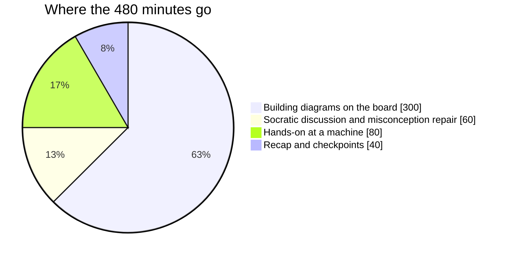

Sixty per cent of the day is one person drawing. That is not a failure to prepare
material; it is the material. The atlas is 1.4 MB of prose that already exists and can
be read afterwards. What cannot be read afterwards is the order the pictures were
built in, and that order is the whole product.

---

## 2. Prerequisites

### 2.1 What the learner must bring

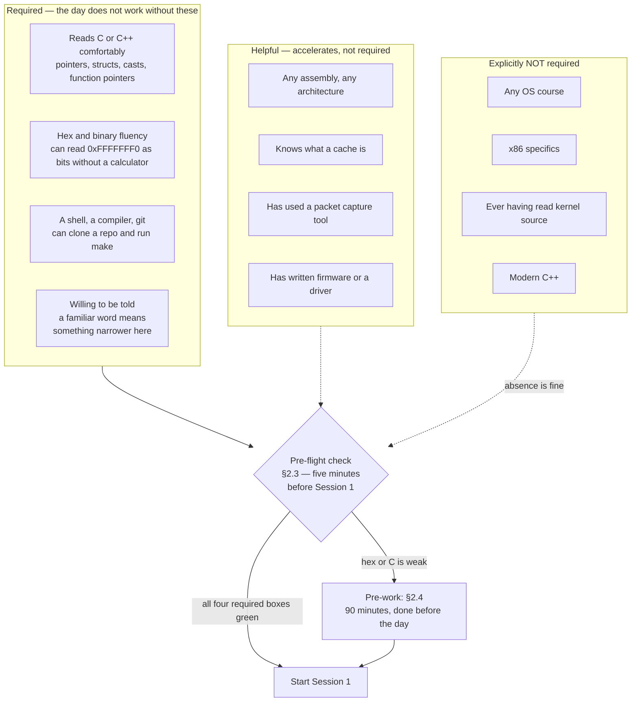

The one non-negotiable is hex. Everything else can be scaffolded live. A learner who
has to stop and think about what `0xFFFF800000000000` looks like in bits will lose
Session 2 in the first ten minutes and never recover it, because Session 2 is the
foundation for Sessions 4, 6 and 8.

### 2.2 What the teacher must bring

- [ ] All seventeen atlas documents read once, and §2 of each read twice
- [ ] A working build of the project at the phase the class has reached, on a laptop
      that can run QEMU
- [ ] A whiteboard at least 3 m wide, or two boards. **Sessions 3 and 5 do not fit on
      one small board**, and the failure mode is erasing the GDT to make room for the
      IDT, which destroys the arrow between them
- [ ] Four marker colours: black for structure, red for failure paths, blue for
      hardware-written values, green for values the kernel writes
- [ ] The colour convention written in the corner of the board on minute one and never
      changed

> [!warning] The colour convention is load-bearing
> Blue for "the CPU wrote this" and green for "we wrote this" is how the room learns
> the single most useful distinction in the day: which side of the contract each field
> belongs to. In Session 3 the interrupt frame is five blue qwords with green ones
> pushed on top, and the picture explains itself. Change colours mid-day and it stops
> working.

### 2.3 The pre-flight check — five minutes, before Session 1

Ask the room to write these four answers on paper. Do not collect them; ask for a show
of hands on each. Anyone with fewer than three is a candidate for the pre-work.

1. Write `0xFFFFFFF0` in binary. How many bits are set?
2. If `p` is a `uint32_t*` holding `0x1000`, what is `p + 3`?
3. What does `struct { uint8_t a; uint32_t b; }` occupy in bytes, and why is it not 5?
4. A function takes `void (*cb)(int)`. In one sentence, what does the caller supply?

### 2.4 Pre-work if the check fails

| Gap | Pre-work | Time |
|---|---|---|
| Hex and binary | Convert twenty addresses from the memory-layout table in [[03 - The Address Space]] §2 to binary by hand. Stop when bit 47 becomes obvious. | 40 min |
| Pointer arithmetic | Read [[04 - Glossary]] entries for *page*, *frame*, *address space*. Write a C program that prints `&arr[0]`, `&arr[1]` for three element types. | 20 min |
| Structs and layout | Read [[13 - Coding Standards]] rule 9 and the `BootInfo` structure in [[02 - The Boot Chain]] §4.2. | 30 min |

---

## 3. The concept dependency graph

This is the diagram the teacher needs and the learner never sees. It answers one
question: *if I cut this, what stops making sense?*

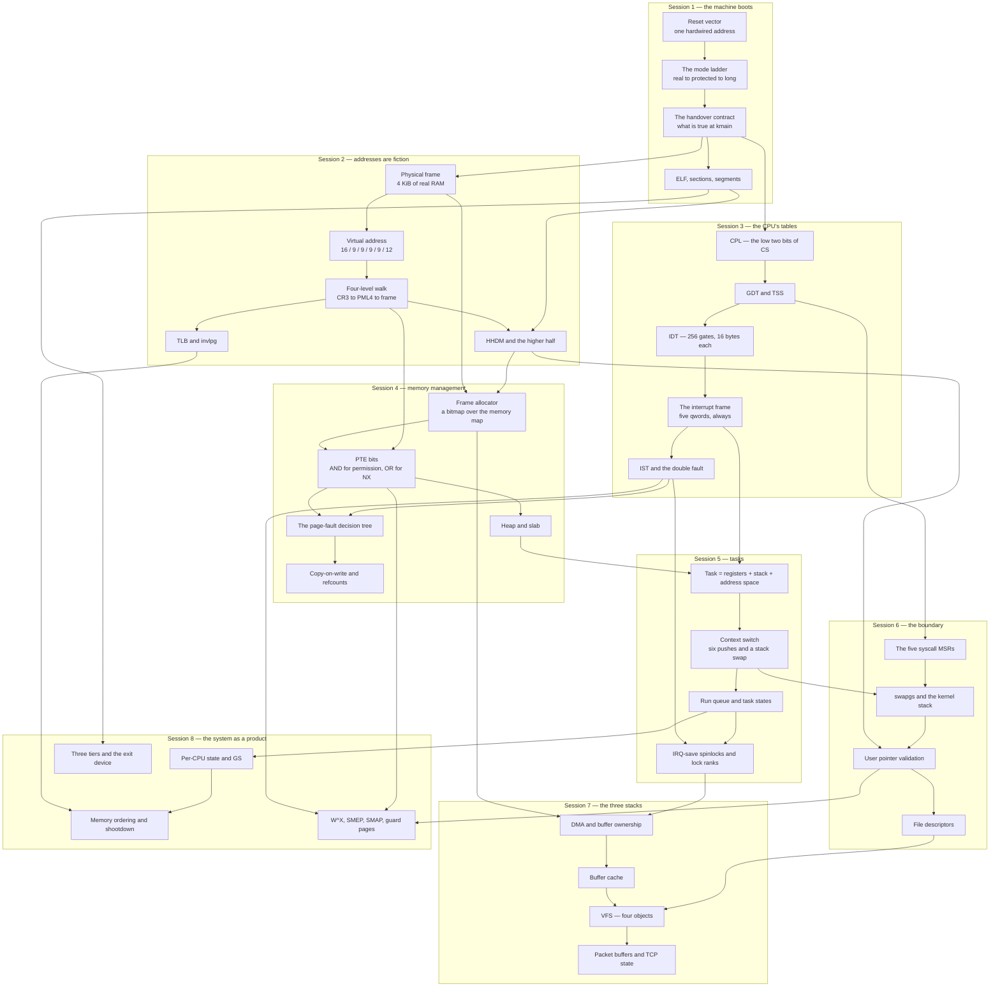

### 3.1 Reading it

Three properties matter to a teacher.

**The graph is nearly a chain.** Sessions 1 → 2 → 3 → 4 → 5 → 6 form a spine with very
few skip edges. That is deliberate: it means the day survives a room that is slower
than planned, because you can spend a whole extra ten minutes anywhere in the first
six sessions and only lose depth in Sessions 7 and 8, which are surveys.

**Four nodes have unusually high in-degree.** `WALK` (the four-level page-table walk),
`IFRAME` (the interrupt frame), `HHDMN` (the higher-half direct map) and `PTEN` (the
page-table entry bits). If a learner has one of these wrong, three later sessions
degrade at once and it will look like the later sessions were badly taught. These four
get the longest board time in the day and the most explicit checkpoints.

**Two edges are non-obvious and are the ones teachers forget to say out loud.**

| Edge | Why it exists | Say this |
|---|---|---|
| `HHDMN --> VALN` | Validating a user pointer means proving it is *not* a kernel address, and the kernel's reach is defined by the HHDM. | "The reason a user pointer check is one comparison is the layout we drew in Session 2." |
| `IFRAME --> TASKN` | A task is defined by what has to be saved, and what has to be saved is exactly what the hardware did not save for you. | "The scheduler saves six registers because the hardware already saved five values and the calling convention covers nine more." |

### 3.2 What can be cut, and what cannot

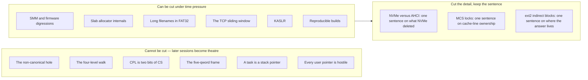

---

## 4. The session map

| # | Session | Primary documents | Supporting | Anchor diagram | Board minutes |
|---|---|---|---|---|---|
| 1 | What a computer does when you turn it on | [[01 - What Happens at Power-On]], [[02 - The Boot Chain]] | [[06 - The Subsystem Map]] §2, [[16 - The Build and Artefact Pipeline]] §3.5 | [[02 - The Boot Chain]] §2 — power to `kmain`, three bands | 45 |
| 2 | Memory as a map: address spaces and paging | [[03 - The Address Space]], [[07 - Memory Management]] §3.1–3.3 | [[04 - Glossary]] | [[03 - The Address Space]] §2 — one tall rectangle, the hole in the middle | 44 |
| 3 | The CPU's tables: privilege and interrupts | [[04 - Privilege and the Ring Boundary]], [[08 - Interrupts and Exceptions]] | [[05 - Kernel Initialisation Order]] §3.2 (the trap triangle) | [[08 - Interrupts and Exceptions]] §2 — sources, PIC, IDT, stubs, dispatcher | 46 |
| 4 | Memory management in depth | [[07 - Memory Management]] | [[05 - Kernel Initialisation Order]] §3.4 (the memory staircase) | [[07 - Memory Management]] §2 — hardware on top, three layers, consumers below | 44 |
| 5 | Tasks, scheduling, concurrency | [[09 - Tasks, Scheduling and Concurrency]] | [[08 - Interrupts and Exceptions]] §3.5 | [[09 - Tasks, Scheduling and Concurrency]] §2 — PIT, core, `sched/`, run queue | 42 |
| 6 | The syscall path, traced end to end | [[10 - The Syscall Path]] | [[04 - Privilege and the Ring Boundary]] §5.3 | [[10 - The Syscall Path]] §2 — ring 3, the instruction, ring 0 | 44 |
| 7 | Storage, filesystems, network | [[11 - The Storage Stack]], [[12 - The Filesystem Stack]], [[13 - The Network Stack]] | — | [[11 - The Storage Stack]] §2, then [[12 - The Filesystem Stack]] §2, then [[13 - The Network Stack]] §2 | 47 |
| 8 | SMP, security, and shipping it | [[14 - SMP Architecture]], [[15 - Security Architecture]], [[16 - The Build and Artefact Pipeline]], [[17 - The Test Architecture]] | [[05 - Kernel Initialisation Order]] §2 (the closing recap) | [[14 - SMP Architecture]] §2, then [[15 - Security Architecture]] §3.9 | 48 |

> [!warning] Sessions 7 and 8 are surveys and must be taught as such
> Their source documents budget 185 and 205 minutes respectively. They get sixty each.
> Do not attempt the full board plan of any of those seven documents. §11.3 and §12.3
> name exactly what is dropped and where it lives, and you should tell the room that
> at the start of each — a room that knows it is getting the shape rather than the
> detail asks better questions than a room that thinks it got everything.

---

## 5. Session 1 — What a computer does when you turn it on

**Documents:** [[01 - What Happens at Power-On]], [[02 - The Boot Chain]]
**Anchor diagram:** [[02 - The Boot Chain]] §2 — the three-band picture, power to `kmain`
**Runs:** 60 minutes

### 5.1 Objectives — by the end, the learner can

- [ ] Draw the path from `0xFFFFFFF0` to `kmain` on both firmware families, labelling
      the CPU mode at every arrow
- [ ] State the reset values of `CS`, its hidden base, and `IP`, and compute the reset
      vector from them
- [ ] Name the seven facts that are true about the machine at the first instruction of
      `kmain` — mode, paging, interrupts, stack, arguments, GDT, IDT
- [ ] Explain why the kernel allocates the Limine request structures and the bootloader
      fills them in, rather than the reverse
- [ ] Explain why every Limine response must be copied out before Phase 4, and describe
      the delay between the mistake and the symptom
- [ ] Say why an operating system is not a thing the hardware knows about

### 5.2 The anchor diagram

Put [[02 - The Boot Chain]] §2 on the board — not projected. Three bands down the left
edge: **Firmware**, **Limine**, **Kernel**. The whole session is filling those three
bands in and then drawing one line across the bottom of the second.

### 5.3 Minute by minute

| Min | Segment | On the board | Purpose |
|---|---|---|---|
| 0–5 | The thesis | One horizontal line: power → firmware → bootloader → kernel. Nothing labelled. | Establish that four things run before your code, and none of them know what an OS is. |
| 5–12 | The reset vector | `0xFFFFFFF0` above "power". `CS = 0xF000`, hidden base `0xFFFF0000`, `IP = 0xFFF0`. The ROM window at the top of the address space with an arrow into it. | The immovable fact the entire industry is built on. |
| 12–22 | Two firmware families | Split the firmware band into BIOS and UEFI columns. Write `0x7C00` and `0x55 0xAA` on the left; the ESP type GUID `C12A7328-F81F-11D2-BA4B-00A0C93EC93B` and `\EFI\BOOT\BOOTX64.EFI` on the right. | Each firmware looks for exactly one thing. Name it. |
| 22–30 | The mode ladder | Vertical ladder off to one side: real → protected → long. The five long-mode steps beside the top rung. Bracket over it: "Limine does this". Second bracket under the UEFI lane: "firmware already did this". | The ladder is climbed by somebody, and it is not us. |
| 30–40 | Limine proper | Both columns converge on one box labelled `limine.conf`. Inside the Limine band, four boxes: read config, load ELF, **scan for requests**, prepare the machine. Star box three. | The convergence is the product decision. Say so aloud. |
| 40–48 | Request and response, drawn backwards | Kernel image on the left with empty envelopes inside it. Arrow from Limine writing pointers into them. Arrows from those pointers **out of the image** into a separate rectangle: reclaimable memory. | The arrows point out of the image. That is the whole trap. |
| 48–55 | The handover contract | Across the bottom of the Limine band: long mode, paging on, `IF = 0`, valid stack, no arguments, Limine's GDT, no usable IDT. Then cross out the reclaimable-memory rectangle and write "Phase 4". | Let the crossing-out land before saying anything. |
| 55–60 | Checkpoint and preview | Erase nothing. Ask the room to reproduce the state table from memory. | The state table is Session 4's starting condition. |

### 5.4 Board plan

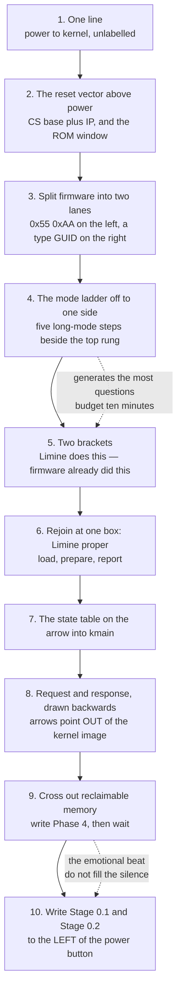

Step 10 is the close, and it is deliberately jarring: the two things you build first
sit to the left of the power button, because the build pipeline runs before the
machine does. The room reacts to that, and the reaction is the bridge to Session 8.

### 5.5 Socratic questions

> [!question] Q1 — The reset vector cannot be configured. Why is a configurable one impossible?
> **Surfaces:** the belief that firmware "boots the OS", i.e. that the hardware has a
> concept of an operating system at all. The answer — the CPU must fetch *something*
> before any code has run that could read a configuration — is the first time the room
> meets bootstrapping as a hard constraint rather than a design style.

> [!question] Q2 — Limine finds our requests by scanning the loaded image for a 128-bit magic value, not by looking up a symbol. Symbol lookup is simpler. Name two failures scanning avoids and one it creates.
> **Surfaces:** the assumption that the bootloader and the kernel are linked together,
> or share a build. They share nothing but a number. The failure scanning creates — a
> value that happens to appear in `.rodata` — is the moment the room understands that
> the contract is *the layout of bytes*, not an API.

> [!question] Q3 — UEFI puts the CPU in long mode before third-party code runs; BIOS hands over in 16-bit real mode. `kmain` is byte-for-byte identical on both. Where is the difference absorbed?
> **Surfaces:** the idea that a kernel is portable because it is written in C. It is
> identical because *Limine* normalises two machines into one contract. Delete Limine
> and the kernel needs two entry paths and a mode trampoline.

> [!question] Q4 — `EFER.LMA` is read-only and set by the CPU when `CR0.PG` is written. Reconstruct the five-step long-mode entry from that one fact.
> **Surfaces:** the belief that "enable long mode" is an instruction. It is a
> *consequence*. The room usually gets the order wrong by putting page-table setup
> after enabling paging, which is exactly the bug that produces an instant reset.

> [!question] Q5 — Phase 4 reclaims the memory holding every Limine response. You cannot change Phase 4. Design an alternative to copying everything out in Phase 0, and explain why it is worse.
> **Surfaces:** the instinct to "just keep a pointer". Every alternative — pinning the
> region, deferring the reclaim, re-requesting later — costs more than one `memcpy` and
> introduces a lifetime rule that no compiler checks.

### 5.6 Hands-on

> [!example] Exercise 1.1 — Make the handover fail on purpose (12 minutes, at a machine)
> **Stage:** [[Stage 0.2 - The Limine Request Section]] and [[Stage 0.5 - Building a Bootable Image]]
>
> 1. Boot the current image: `make run`. Note the first serial line.
> 2. Now break the request section. Remove the `used` attribute from one Limine request
>    global (or remove the matching `KEEP` from the linker script — do exactly one).
> 3. Rebuild and boot. Observe: the kernel runs, and that request's `.response` is null.
>    Nothing faults. Nothing warns.
> 4. Restore it. Boot with `qemu-system-x86_64 ... -d int,cpu_reset -no-reboot` and
>    read the log for the boot that *worked*, so the room sees what a clean boot looks
>    like in that log before they ever see a broken one.
>
> **What it proves:** the contract is bytes in a section, not a function call, and a
> broken contract is silent. This is the first evidence for the day's recurring theme
> that in kernel work the symptom is usually far from the cause.

If the room has no machine, run it once at the front and have the room predict the
output before each step. The prediction is worth more than the observation.

### 5.7 Misconceptions and corrections

| Misconception | Why it is appealing | The correction |
|---|---|---|
| "The BIOS boots the operating system." | Every consumer-facing description says so. | Firmware loads 512 bytes, or one PE file, and jumps. It has no concept of an OS. Say it as: *the firmware's job ends before anything called an operating system exists.* |
| "The bootloader is part of the kernel." | They ship in the same ISO. | Limine is third-party, pinned at `v8.6.0-binary`, and shares exactly one thing with our code: a 128-bit magic number. |
| "`kmain` gets the memory map as an argument." | Every other `main` takes arguments. | `kmain` takes none. Information arrives by the bootloader writing pointers into globals the kernel declared. Draw the arrow pointing *into* the image. |
| "Paging is turned on by the kernel." | The kernel is where memory management lives. | Limine hands over with paging already on. Phase 4 replaces those tables; it does not enable paging. |
| "Once it boots, the boot code is irrelevant." | It runs once. | Its memory is still live and still referenced until Phase 0 copies it out. The reclaim in Phase 4 is what turns a Phase 0 shortcut into a Phase 4 crash. |
| "The hybrid ISO is a convenience." | It looks like packaging. | It is the decision that gives the project one artefact and one test matrix instead of two of each. |

### 5.8 Checkpoint — do not proceed until every box is ticked by someone in the room

- [ ] Somebody redraws the three bands and both firmware lanes without looking
- [ ] Somebody states all seven facts of the handover contract
- [ ] Somebody explains why the request arrows point out of the kernel image
- [ ] Somebody names the phase in which the reclaimable-memory bug becomes a symptom,
      and the phase in which it was introduced
- [ ] Somebody answers "what does the hardware know about an operating system?" with
      "nothing"

---

## 6. Session 2 — Memory as a map: address spaces and paging

**Documents:** [[03 - The Address Space]], [[07 - Memory Management]] §3.1–3.3
**Anchor diagram:** [[03 - The Address Space]] §2 — one tall rectangle with a hole
through the middle
**Runs:** 60 minutes

### 6.1 Objectives — by the end, the learner can

- [ ] Draw the full address-space map with all five upper-half constants and the user
      base, and say which PML4 entry each falls in
- [ ] Split a 64-bit virtual address into its five fields and name what each selects
- [ ] Translate `0xFFFFFFFF80001000` to its four table indices without notes
- [ ] Explain why a non-canonical address raises `#GP` and not `#PF`
- [ ] Explain what changes and what does not when `CR3` is written
- [ ] Explain why `phys_to_virt` is one instruction and why that was worth 16 TiB of
      address space
- [ ] State what the 4 MiB null guard catches that a 4 KiB guard does not

### 6.2 The anchor diagram

[[03 - The Address Space]] §2. Addresses increase upward. Draw the rectangle first,
empty, and label only the two extremes. Everything for the next fifty minutes goes
inside it.

### 6.3 Minute by minute

| Min | Segment | On the board | Purpose |
|---|---|---|---|
| 0–4 | Recap and the frame for the session | Two boxes: "which bytes exist" and "what does this address mean". | The split that organises Sessions 2 and 4. Session 2 is the right-hand box. |
| 4–10 | The rectangle | A tall rectangle. Top `0xFFFFFFFFFFFFFFFF`, bottom `0x0`. Say: "this is one process's view, and none of it is real." | Establish fiction before mechanism. |
| 10–20 | The hole | Draw it across the middle. `0x0000800000000000` below, `0xFFFF800000000000` above. Sign extension of bit 47, written in binary. | **Do not move on until this lands.** Everything else hangs off it. |
| 20–30 | Filling the map | Upper half top-down: kernel image `0xFFFFFFFF80000000`, heap `0xFFFFFFFF00000000`, gap, per-CPU `0xFFFF900000000000`, HHDM `0xFFFF800000000000`. Lower half bottom-up: 4 MiB guard, program at `0x400000`, mmap, stack at `0x0000700000000000`. | Five constants, written not spoken. They get pointed at all day. |
| 30–42 | One address, five fields | Write `0xFFFF800012345678`. Cut it into 16 / 9 / 9 / 9 / 9 / 12. Derive the widths from "a table is one page, an entry is eight bytes". Then the four-level walk as five boxes, and work `0xFFFFFFFF80001000` live. | The highest in-degree concept in the graph. Do the arithmetic on the board, slowly. |
| 42–50 | The TLB | Draw it as a cache in front of the walker. Ask: what happens when we edit a table? Introduce `invlpg`. Then `CR3` write semantics, and the Global bit as the exception. | The audience has just watched the walker read RAM four times. This is the natural moment and no other moment works. |
| 50–56 | The HHDM | One physical frame with three arrows pointing at it from three different virtual addresses. `phys_to_virt` as one addition. | Aliasing is the idea people need drawn, not described. |
| 56–60 | The context switch | Second identical rectangle beside the first. Erase and redraw only its lower half. "This is a context switch. One register write." | The thesis of the session, and the setup for Session 6. |

### 6.4 Board plan

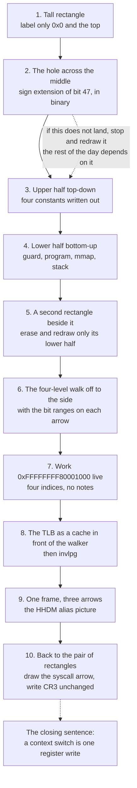

### 6.5 Socratic questions

> [!question] Q1 — The CPU does not switch page tables on a syscall or an interrupt. Trace, fault by fault, what happens if the kernel is not mapped in the current address space.
> **Surfaces:** the belief that "kernel space" is a separate address space the CPU
> switches to. It is the top half of the *same* space. The fault-by-fault trace ends in
> a triple fault, and the room discovers that "just switch `CR3` in the handler" is
> unavailable because the handler's own code is not mapped to run the switch.

> [!question] Q2 — The non-canonical hole makes roughly 16 million TiB illegal. Argue that this is better hardware design than ignoring the top 16 bits.
> **Surfaces:** the intuition that unused bits should be ignored for convenience. The
> answer is forward compatibility: software that stashed data in the top bits would
> break the day the address width grew. This generalises to every reserved field in the
> day's remaining tables.

> [!question] Q3 — `virt_to_phys` is a subtraction for HHDM addresses and a four-level walk for kernel heap addresses. Why can it not be a subtraction for both?
> **Surfaces:** the assumption that a "direct map" means all kernel addresses are
> offset by a constant. Only the HHDM window is. The heap is mapped by us, page by
> page, and its physical frames are wherever the allocator found them.

> [!question] Q4 — Kernel pages set the Global bit so their TLB entries survive a `CR3` write. Construct a scenario where that is a correctness bug, not an optimisation.
> **Surfaces:** the belief that a performance flag cannot cause wrong answers. Change a
> kernel mapping and the stale global entry outlives the `CR3` reload that would
> otherwise have flushed it. Session 8's shootdown discussion is this question, scaled.

> [!question] Q5 — What does the 4 MiB null guard catch that a 4 KiB guard does not?
> **Surfaces:** "null pointer means address zero". A null `struct` pointer dereferenced
> at a large field offset, or a null array indexed, lands well past 4 KiB. The size of
> the guard is a statement about the size of the mistakes you expect.

### 6.6 Hands-on

> [!example] Exercise 2.1 — Translate an address by hand, then make the machine agree (15 minutes)
> **Stage:** [[Stage 4.3 - Enabling Paging]]
>
> 1. On paper, split `0xFFFFFFFF80001000` into PML4, PDPT, PD, PT indices and offset.
>    Expected: the top-half sign extension, PML4 index 511, and an offset of `0x000`.
> 2. In the QEMU monitor (`Ctrl-Alt-2`), run `info registers` and read `CR3`.
> 3. Run `info mem` and find the range containing the kernel image. Confirm the
>    kernel's virtual base maps to a physical address well under 16 MiB.
> 4. Run `info tlb` and find an entry for a kernel page. Note the flags.
> 5. Now use `x/4gx` on a physical address through its HHDM alias and through the
>    kernel-image address for the same bytes. Two virtual addresses, one frame, same
>    bytes.
>
> **What it proves:** the map on the board is the map in the machine, and aliasing is
> real rather than a diagram convention. Step 5 is the one to spend time on; it is
> where "one frame, three names" stops being an abstraction.

### 6.7 Misconceptions and corrections

| Misconception | Why it is appealing | The correction |
|---|---|---|
| "Virtual memory is about running programs bigger than RAM." | It is the textbook motivation and it is a real use. | In this kernel it is about *isolation and layout*: two programs both at `0x400000`, and one kernel visible from both. Swap does not exist here. |
| "The kernel has its own address space." | The phrase "kernel space" implies it. | The kernel is the top 256 PML4 entries of *every* address space. A syscall changes privilege, not `CR3`. |
| "Non-canonical addresses page-fault." | They are invalid, and invalid usually means `#PF`. | `#GP`, and `CR2` is not updated. This costs you the faulting address at debug time; that cost is the reason to teach it. |
| "The TLB is flushed when you change a page table." | Caches usually maintain coherence. | Nothing tells the TLB. You must issue `invlpg`, or reload `CR3`, and neither helps for Global pages or for other cores. |
| "Writing `CR3` flushes everything." | It flushes most things. | Global entries survive it. That exception is the whole reason Session 8 has a shootdown section. |
| "The HHDM wastes 16 TiB of memory." | 16 TiB sounds enormous. | It costs *address space*, not memory. Address space is the one resource that is genuinely free in a 64-bit kernel, and it bought a one-instruction `phys_to_virt`. |

### 6.8 Checkpoint

- [ ] Somebody draws the rectangle with all five constants and the hole, unaided
- [ ] Somebody translates a fresh address to four indices on the board
- [ ] Somebody states what a `CR3` write does and does *not* invalidate
- [ ] Somebody explains why `#GP` and not `#PF` for a non-canonical address
- [ ] Somebody says the sentence "the upper half is identical in every address space"

---

## 7. Session 3 — The CPU's tables: privilege and interrupts

**Documents:** [[04 - Privilege and the Ring Boundary]], [[08 - Interrupts and Exceptions]]
**Supporting:** [[05 - Kernel Initialisation Order]] §3.2, the trap triangle
**Anchor diagram:** [[08 - Interrupts and Exceptions]] §2 — sources, PIC, IDT, stubs,
dispatcher
**Runs:** 60 minutes

> [!warning] This session needs the wide board
> The GDT, the TSS and the IDT must be visible simultaneously, because the arrows
> *between* them are the content. If you erase the GDT to make room for the IDT, the
> selector-field arrow has nowhere to point and the session collapses into three
> unrelated table formats.

### 7.1 Objectives — by the end, the learner can

- [ ] Draw the GDT, TSS and IDT and every arrow between them, from memory
- [ ] Explain why `CS`'s low two bits, and not a dedicated register, carry the CPL
- [ ] Explain why an IDT gate is 16 bytes when a code descriptor is 8, in one sentence
- [ ] State the five things the CPU pushes, in order, and why `SS` and `RSP` are pushed
      even without a privilege change
- [ ] Name the ten vectors that push an error code and say what the dummy push buys
      besides layout uniformity
- [ ] Decode page-fault error code `0x7` into English without looking it up
- [ ] Tell the triple-fault story end to end, naming the exact box where an IST entry
      changes the outcome

### 7.2 Minute by minute

| Min | Segment | On the board | Purpose |
|---|---|---|---|
| 0–4 | Recap and thesis | Two boxes, ring 3 and ring 0, thick line between. Write **hardware** on the line. | The wall is not made of code. |
| 4–12 | The three privilege numbers | Under ring 0 write `CS`, circle the low two bits. Three arrows in on the line — `syscall`, exception, IRQ — two out: `sysretq`, `iretq`. | CPL, DPL, RPL is where the confusion lives; ten minutes here saves twenty later. |
| 12–22 | GDT and TSS | GDT as seven slots, `0x00` to `0x30`, DPL marked. `IA32_STAR = 0x0013000800000000` above it with the `+0 / +8 / +16` arrows into the slots. Then the TSS beside it: `rsp0` and `ist1..7`, one arrow from `rsp0` to a kernel stack. | Show that the reversed GDT order has *no* solution. That is why the order is not a style choice. |
| 22–32 | The IDT | 256 boxes. Explode one into offset, selector, IST index, type/DPL/present. From the selector field, an arrow to the GDT. From the IST field, an arrow to the TSS. | Both tables were built before the IDT for exactly this reason. Point at the arrows while saying it. |
| 32–42 | The frame contract | The stack, pushed in the hardware's order: `SS RSP RFLAGS CS RIP`, in **blue**. Error code below it in a dashed box; mark which vectors get one. Then in **green**: dummy zero, vector number, fifteen GPRs. Turn the picture upside down and write the C++ struct beside it. | The colour convention does the explaining. The upside-down moment is when the reversal clicks. |
| 42–50 | The PIC | Two 8259s cascaded on IRQ 2, master remapped to `0x20`, slave to `0x28`, vectors 32–47. EOI: both chips for IRQ 8–15, master only for 0–7. | One CPU pin, sixteen devices. And the default master offset of 8 makes a timer tick indistinguishable from a double fault — say that out loud. |
| 50–57 | The triple fault | Erase the IST arrow. Walk `#PF` → `#DF` → triple fault → reset. Put the arrow back. Walk it again, ending in a readable panic. | The narrative the room remembers. Do not narrate it while the arrow is still drawn. |
| 57–60 | Checkpoint | | |

### 7.3 Board plan

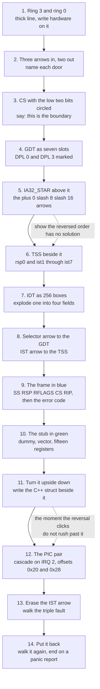

### 7.4 Socratic questions

> [!question] Q1 — The CPL is the low two bits of `CS`, and `CS` can only be changed by a far transfer. Why is that better than a dedicated CPL register some instruction could write?
> **Surfaces:** the assumption that privilege is a variable the kernel sets. It is a
> side effect of *how you got here*. If `mov cs, ax` were encodable, ring 3 would write
> its own privilege level and the wall would not exist.

> [!question] Q2 — The CPU discards the vector number before entering your handler, forcing 256 separate entry points. If hardware passed the vector in a register, what would the stub layer collapse to, and what would you lose?
> **Surfaces:** the belief that the stubs are boilerplate a better design would remove.
> The entry point *is* the identity. Passing a register would cost a register that must
> then be saved, and the room usually spots that only after arguing the other way first.

> [!question] Q3 — Ten vectors push an error code and 246 do not. Instead of a dummy zero, you could define two structs and two dispatch functions. Argue both sides.
> **Surfaces:** the instinct that uniformity is cosmetic. Then ask what happens to
> Session 5's context switch under each design — the answer is that one uniform frame
> shape is what lets a preempted task and a yielding task share one stack layout.

> [!question] Q4 — `#PF` deliberately gets no IST entry, on the grounds that page faults nest legitimately. Construct a kernel design where an IST for `#PF` would be right.
> **Surfaces:** "IST is safer, so use it everywhere." An IST stack is a *fixed* stack:
> a nested fault on it overwrites the outer frame. IST is correct exactly when nesting
> is impossible or already fatal, which is why `#DF` gets one and `#PF` does not.

> [!question] Q5 — Interrupt gates clear `IF`, so handlers never nest. That costs latency. What breaks first if you allow nesting?
> **Surfaces:** the idea that nesting is a performance knob. The first thing to break is
> the locking model: every spinlock taken in a handler becomes re-entrant-hostile.
> This question plants Session 5's IRQ-save deadlock four hours early, deliberately.

### 7.5 Hands-on

> [!example] Exercise 3.1 — Delete the IST entry and watch a readable crash become a reboot (14 minutes)
> **Stage:** [[Stage 2.2 - The TSS and Interrupt Stacks]] and [[Stage 2.3 - The Interrupt Descriptor Table]]
>
> 1. Confirm the working case first. Trigger a deliberate kernel stack overflow (a
>    recursive function with a large local array behind a debug command). Observe: a
>    panic report with a register dump and a backtrace.
> 2. Set the IST index for vector 8 (`#DF`) to zero in the IDT gate. Rebuild.
> 3. Repeat the overflow. Observe: QEMU reboots in a loop. No output.
> 4. Re-run with `-d int,cpu_reset -no-reboot` and read the **first** exception in the
>    log, not the last. It is `#PF`, then `#DF`, then reset.
> 5. Restore the IST index.
>
> **What it proves:** one 3-bit field in a 16-byte descriptor is the difference between
> a diagnosable failure and a machine that tells you nothing. It also teaches the
> debugging habit that matters most all day: read the *first* fault.

### 7.6 Misconceptions and corrections

| Misconception | Why it is appealing | The correction |
|---|---|---|
| "The kernel checks whether a program is allowed to do something." | It is how permissions work in every application the learner has written. | For privileged *instructions*, nothing in the kernel runs. The CPU compares CPL against DPL and faults. The kernel only checks things the hardware cannot, such as pointers. |
| "Segmentation is dead in 64-bit mode, so the GDT is vestigial." | Base and limit really are ignored for most descriptors. | The DPL and the code/data distinction still matter, `sysret` synthesises descriptor state from `STAR` but the descriptors must still exist and be correct, and the TSS descriptor is how `rsp0` is found. |
| "An interrupt is like a function call." | The control flow looks similar. | Nothing set up arguments, nothing chose the moment, and the stack may change under you. It is the hardware's `goto`, and the register state you find is somebody else's. |
| "`iretq` is just `ret` for interrupts." | Both return. | `iretq` restores `RFLAGS` — including `IF` — `CS` and `SS`. Returning with `ret` leaves interrupts disabled forever and the machine appears to hang after exactly one interrupt. |
| "The PIC offsets are arbitrary." | Any number would work. | Vectors 0–31 are reserved for exceptions. The default master offset of 8 aliases IRQ 0 onto `#DF`, so a timer tick is reported as a double fault. That is why remapping precedes the first `sti`. |
| "An IST stack makes a handler safe." | It provides a known-good stack. | It provides a *single fixed* stack. Two vectors sharing one IST slot corrupt each other's frames, which produces a `#DF` report with a garbage register dump. |

### 7.7 Checkpoint

- [ ] Somebody draws GDT, TSS, IDT and the two arrows between them, unaided
- [ ] Somebody lists the five hardware-pushed qwords in address order
- [ ] Somebody names the error-code vector set `{8, 10, 11, 12, 13, 14, 17, 21, 29, 30}`
- [ ] Somebody decodes `#PF` error code `0x7` as "present, write, user"
- [ ] Somebody tells the triple-fault story and points at the box where IST changes it

---

## 8. Session 4 — Memory management in depth

**Document:** [[07 - Memory Management]]
**Supporting:** [[05 - Kernel Initialisation Order]] §3.4, the memory staircase
**Anchor diagram:** [[07 - Memory Management]] §2 — hardware on top, three software
layers, consumers below
**Runs:** 60 minutes

> [!note] What Session 2 already covered
> Sessions 2 and 4 split one document. Session 2 taught the *right-hand box* — what an
> address means, the four-level walk, the TLB, the HHDM. Session 4 teaches the
> *left-hand box* — which bytes exist — and then everything built on top of both. Open
> by redrawing the two boxes so the room sees the split explicitly.

### 8.1 Objectives — by the end, the learner can

- [ ] Name every bit of a PTE, say who writes it — the CPU or us — and give the failure
      mode of getting it wrong
- [ ] Explain why `CR3` holds a physical address, and why that is not a design choice
- [ ] Explain why the frame allocator is a bitmap and not a free list, using DMA and
      failure containment rather than speed
- [ ] Explain why a slab allocator sits on the heap in terms of where the fragmentation
      goes, not in terms of being faster
- [ ] Trace a page fault from `CR2` to every one of its outcomes, including the two
      that panic and the five that kill the process
- [ ] Draw copy-on-write before and after, including the reference count, and say what
      happens when it is 1
- [ ] State the three things living in bootloader-reclaimable memory and the order in
      which each must be replaced

### 8.2 Minute by minute

| Min | Segment | On the board | Purpose |
|---|---|---|---|
| 0–4 | The two questions, redrawn | Two boxes. Point at Session 2's rectangle if it is still up. | Re-anchor. Session 4 is the other box plus the consumers. |
| 4–12 | The memory map | RAM as a strip of 4 KiB frames. Mark usable, reserved, bootloader-reclaimable, framebuffer. Mark the kernel image. | Which bytes exist is a *question you have to ask the bootloader*, and its answer lives in memory it will later take back. |
| 12–20 | The frame allocator | The bitmap under the strip, one bit per frame. Cost: 0.003% of RAM. | Bitmap over free list, justified by contiguous DMA allocation and by a corrupted allocator not destroying the free list itself. |
| 20–30 | The PTE, bit by bit | One 64-bit entry drawn wide. Present, writable, user, write-through, cache-disable, accessed, dirty, NX at bit 63. Blue for accessed and dirty; green for the rest. AND down the chain for permissions, OR down it for NX. `CR0.WP` in the corner. | The second-highest in-degree concept. The AND/OR asymmetry is the question they will be asked in three sessions' time. |
| 30–38 | The heap, three boxes deep | `kmalloc` → cache → slab → object. The free list living *inside* the free objects. `kfree` masking a pointer to find its slab. | Fragmentation does not disappear; it moves into fixed-size pools where it is bounded. |
| 38–52 | The fault handler as a decision tree | Start with `CR2` and the error code. Add outcomes one at a time, easiest first: segfault, demand fill, stack growth, COW, then the two panics. After each, ask: *what state did we need to decide that?* | This is where the subsystem stops being bookkeeping and becomes an operating system. Protect this segment from overrun elsewhere. |
| 52–58 | COW | Two address spaces, one frame, refcount 2. The write. The split. Then the refcount-1 case. | The refcount-1 special case is the question that checks whether the room was following. |
| 58–60 | Checkpoint | | |

### 8.3 The fault-handler decision tree, as taught

Draw this incrementally, never all at once. Each new leaf is added only after the room
answers *what extra state did we need to know that?*

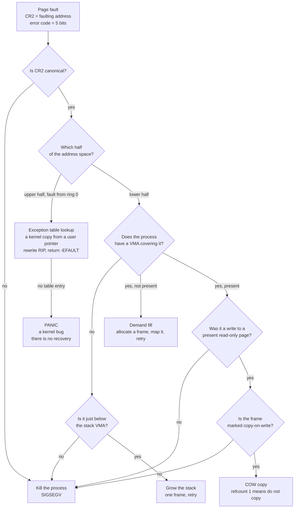

The teaching point is not the tree. It is that **the page tables cannot answer most of
these questions.** "Not mapped yet but should be" and "not mapped and never will be"
look identical in a PTE. The VMA list is the extra state, and the reason it cannot live
in the spare PTE bits is that a not-present PTE has nowhere to put a length.

### 8.4 Socratic questions

> [!question] Q1 — Permissions AND down the four-level chain; NX ORs down it. Why the different polarities, and what breaks if NX also ANDed?
> **Surfaces:** the belief that all PTE bits are the same kind of thing. Permission bits
> grant, so the most restrictive level must win — AND. NX *denies*, so the most
> restrictive level must also win — which for a deny bit is OR. If NX ANDed, a
> permissive upper level would re-enable execution on a page marked non-executable.

> [!question] Q2 — Demand paging needs the handler to distinguish "not mapped yet but should be" from "not mapped and never will be". The page tables cannot answer that. What is the minimum extra state, and why can it not go in the PTE?
> **Surfaces:** the assumption that the hardware structure is the whole model. A
> not-present PTE has 63 usable bits and no way to express a *range*. You need a
> per-process list of regions with lengths and backing.

> [!question] Q3 — Copy-on-write with a refcount of exactly 1 must not copy. Construct a sequence of `fork` and `exit` that reaches that state, and work out the waste if the handler copies anyway.
> **Surfaces:** the belief that COW is symmetric between parent and child. After a child
> exits, the parent holds a page still marked read-only with refcount 1. Copying it
> doubles the working set for no reason, and the waste is unbounded across a fork loop.

> [!question] Q4 — Kernel heap pages are mapped eagerly and user pages lazily. Both are defensible. What property of *context* makes the asymmetry correct?
> **Surfaces:** "lazy is always better". A kernel page fault can happen while holding a
> lock, in an interrupt handler, or inside the allocator itself. Making kernel memory
> lazy means the fault handler may need to allocate, which may fault, which is the
> deadlock. User faults happen in a context that can sleep.

> [!question] Q5 — The frame bitmap costs 0.003% of RAM, a COW refcount array 0.1%, a Linux-style per-page descriptor about 1%. What does each order of magnitude buy?
> **Surfaces:** the idea that data-structure choice is about speed. Each step buys a
> *question you can now answer*: is this frame free, how many mappings does it have,
> and who exactly maps it. You pay for questions, not for cycles.

### 8.5 Hands-on

> [!example] Exercise 4.1 — Make the allocator hand out memory it does not own (14 minutes)
> **Stage:** [[Stage 4.1 - Reading the Memory Map]] and [[Stage 4.2 - The Physical Frame Allocator]]
>
> 1. Print the frame allocator's free count at boot. Compare it against the sum of the
>    lengths of the usable entries in the Limine memory map. They should agree exactly.
> 2. Now remove the code that reserves the framebuffer's physical range.
> 3. Boot and run anything that allocates. Observe: the console fills with coloured
>    noise as the allocator hands out framebuffer frames and something writes to them.
> 4. Restore it. Then add the assertion from [[07 - Memory Management]] §8: `alloc_frame`
>    must never return an address inside the kernel image. Make it a Tier 2 test.
>
> **What it proves:** "which bytes exist" is a question with a wrong answer available,
> and the wrong answer is visible on screen rather than abstract. Step 4 turns a
> demonstration into a regression test, which is the habit the day is selling.

If the class is running before Phase 4, do the paper version: hand out the memory-map
table from [[07 - Memory Management]] §3.1 and have pairs compute the free-frame count,
then reveal the three regions most people forget to reserve.

### 8.6 Misconceptions and corrections

| Misconception | Why it is appealing | The correction |
|---|---|---|
| "`kmalloc` gets memory from the OS." | That is what `malloc` does. | There is no "the OS". `kmalloc` carves from a heap the kernel mapped itself, out of frames the kernel allocated itself, from RAM the bootloader described. Draw the staircase: map → frames → pages → heap → objects. |
| "The page tables describe the process's memory." | They are the memory map the hardware reads. | They describe what is *mapped right now*. What the process is *entitled to* lives in the VMA list. The gap between those two is demand paging. |
| "A page fault is an error." | The name says fault. | Most page faults in a mature kernel are routine: demand fill, stack growth, COW. The fault is the *mechanism*, and the decision tree is where policy lives. |
| "COW copies on read." | The name is ambiguous. | Reads are free forever. Only a write triggers the copy, and only when the refcount is above 1. |
| "Reclaiming bootloader memory frees memory we need." | It sounds risky. | It is required, and it is safe only after three specific replacements: our own `CR3`, our own stack, and a fully copied `boot_info_t`. Name all three; the order is the exam question. |
| "`CR3` could hold a virtual address if the kernel translated it." | It would be more convenient. | Translating it requires reading the page tables, which requires `CR3`. It is physical because it is the base case of the recursion. |

### 8.7 Checkpoint

- [ ] Somebody names five PTE bits and says who writes each
- [ ] Somebody explains AND for permissions and OR for NX without prompting
- [ ] Somebody draws the fault decision tree with at least six outcomes
- [ ] Somebody explains what refcount 1 means for a COW fault
- [ ] Somebody names the three things that must be replaced before reclaiming type 5
      memory, in order

---

## 9. Session 5 — Tasks, scheduling, concurrency

**Document:** [[09 - Tasks, Scheduling and Concurrency]]
**Anchor diagram:** [[09 - Tasks, Scheduling and Concurrency]] §2 — PIT, PIC, one core,
`arch/`, `sched/`, run queue
**Runs:** 60 minutes

### 9.1 Objectives — by the end, the learner can

- [ ] Draw a task's kernel stack at three moments — freshly created, yielded, preempted
      — and say what `task_t.kernel_rsp` points at in each
- [ ] Write `switch_context` from memory, and justify the register list from the calling
      convention rather than from memorisation
- [ ] Explain why the routine cannot be written in C++ without using the word "fast"
- [ ] State the run-queue invariant in one sentence and give three consequences of
      breaking it
- [ ] Explain why an interrupt handler may not sleep, in terms of whose stack it is on
- [ ] Draw the IRQ-save deadlock as a cycle and point at the edge IRQ-save removes
- [ ] Explain why lock ranks are checked with `KASSERT` rather than found by review

### 9.2 Minute by minute

| Min | Segment | On the board | Purpose |
|---|---|---|---|
| 0–4 | The lie | One CPU, one set of registers, one `rsp`. Write: "running two things at once is a lie." | Everything else is a consequence of there being exactly one `rsp`. |
| 4–12 | Two stacks | Two stacks side by side. A task struct beside each with one field: `kernel_rsp`. Draw the arrow from the field into the stack. | A task *is* a stack pointer plus an address space. Nothing more, at this level. |
| 12–24 | The switch | Six pushes, `mov [rdi], rsp`, `mov rsp, rsi`, six pops, `ret`. **Move the chalk between the two stacks at exactly the right instruction.** | The physical gesture is the teaching. Twelve minutes, and do not compress them. |
| 24–30 | A task that has never run | The pre-filled stack for a new task. Add the fake return address last, then ask what happens without it. | Creation is forgery: you build the stack a switch would have left behind. |
| 30–40 | The timer | PIT at the top with an arrow into the middle of task A's instruction stream. The 176-byte interrupt frame landing on A's stack, then the switch frame on top of it. | A preempted task carries both frames. This is the callback to Session 3. |
| 40–46 | Queues and the idle task | Run queue as a horizontal list. Move a task out into a wait queue, stating the invariant aloud while erasing it. Then the idle task drawn deliberately *outside* the run-queue box. | The invariant is: the run queue contains exactly the READY tasks, and nothing else. |
| 46–56 | The rules and the deadlock | Three contexts, three columns. Then the IRQ-save deadlock as a four-arrow cycle in the corner. Then the rank line, 1 to 10, mutexes left, spinlocks right, and the arrow `KASSERT` refuses to let you draw backwards. | The deadlock is a cycle; IRQ-save deletes one edge. Draw it as a cycle or it does not land. |
| 56–60 | Checkpoint | | |

### 9.3 The task state machine

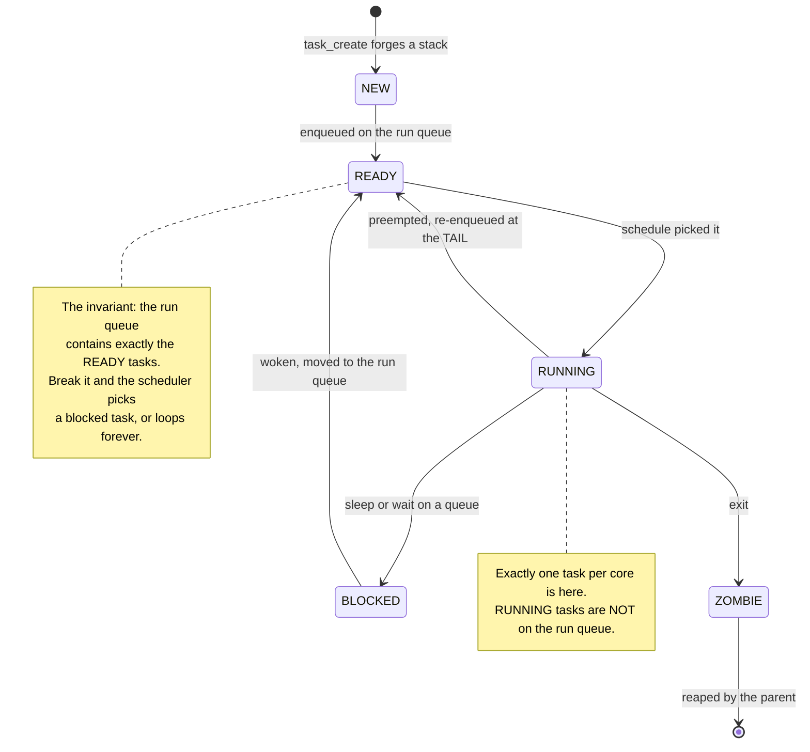

The second note is the one that gets argued about, and the argument is productive.
"Running" is not a queue position, it is the absence of one plus the CPU's `rsp`
pointing at your stack.

### 9.4 Socratic questions

> [!question] Q1 — `switch_context` saves six registers. A full interrupt frame saves twenty-two values. Both correctly preserve a task. Explain the difference in terms of who was asked and who was not.
> **Surfaces:** the belief that saving more is always safer. A yielding task *called* the
> switch, so the calling convention already spilled the caller-saved registers; only
> callee-saved ones remain. An interrupted task was not asked, so everything must be
> saved. Then ask why a preempted task ends up carrying both frames at once.

> [!question] Q2 — Delete the idle task and make `schedule()` return without switching when the run queue is empty. Name three things that break, in increasing order of how long they take to discover.
> **Surfaces:** "the idle task does nothing, so it is optional." It breaks immediately
> (returning into a task that just blocked), soon (nowhere to run the `hlt` that stops
> the fan spinning), and eventually (per-CPU accounting has no baseline).

> [!question] Q3 — Take the IRQ-save deadlock to a four-core machine. Does it still occur? Does IRQ-save still fix it? Does IRQ-save *alone* still suffice?
> **Surfaces:** the assumption that a fix for a single-core race is a fix in general.
> Yes, yes, and no — on four cores you also need the lock itself to be safe against a
> *different* core, which IRQ-save does nothing about. This is Session 8's opening.

> [!question] Q4 — The lock ranks put the log ring buffer near the top of the order rather than the bottom. Argue for the opposite choice, then say what it costs the panic handler.
> **Surfaces:** the intuition that the most-used lock should be lowest. If logging is at
> the bottom, nothing holding any other lock can log — including the panic path, which
> is exactly when you need it.

> [!question] Q5 — The overview says the kernel is non-preemptible in v1, and Stage 5.3 preempts kernel tasks with the timer. Both are true. Reconcile them, using the phrase "preemption point".
> **Surfaces:** conflation of "preemptive scheduling" with "preemptible kernel". Tasks
> are preempted at controlled points — on the way out of an interrupt — not at an
> arbitrary instruction inside a kernel critical section.

### 9.5 Hands-on

> [!example] Exercise 5.1 — Two bugs with famous symptoms (16 minutes)
> **Stage:** [[Stage 3.1 - The Programmable Interval Timer]], [[Stage 5.3 - Preemptive Scheduling]], [[Stage 5.4 - Sleep and Blocking]]
>
> **Part A — output stops after exactly one tick.** Remove the EOI from the timer path.
> Rebuild, boot. Observe: exactly one tick, then silence, and the host CPU at 0%.
> Ask the room what the word *exactly* tells them before you explain anything.
>
> **Part B — the deadlock.** Take a plain (non-IRQ-save) spinlock in task context, then
> let the timer handler take the same lock. Boot. Observe: the machine hangs with the
> host CPU pinned at 100%. Draw the cycle on the board from the observed behaviour
> rather than from the diagram.
>
> Restore both. Then run the lock-rank `KASSERT` in a debug build and deliberately take
> two locks out of order, so the room sees the panic that *prevents* Part B.
>
> **What it proves:** the two hang signatures — 0% and 100% host CPU — are diagnostic,
> and the room now owns a debugging heuristic they will use for the rest of their
> careers. Part C shows that an assertion converts a hang into a message with a name.

### 9.6 Misconceptions and corrections

| Misconception | Why it is appealing | The correction |
|---|---|---|
| "The scheduler runs continuously in the background." | It is described as "the scheduler" as if it were a service. | It is a function. It runs when something calls it: a yield, a block, or the tail of a timer interrupt. Between those calls, no scheduler code exists on any CPU. |
| "A context switch saves all the registers." | It sounds thorough. | Six. The calling convention did the rest, because the yielding task *called* the switch. A preempted task is different, and the difference is the whole of Q1. |
| "A blocked task is checked periodically to see if it can run." | Polling is the obvious implementation. | It is on a wait queue and is not examined at all until whoever holds the resource moves it. The lost-wakeup bug exists precisely because nobody is polling. |
| "An interrupt handler could just take a mutex and sleep briefly." | Brief sounds harmless. | It is running on somebody else's stack, in nobody's task context. There is no task to block, and the switch would return into a task that is not there. |
| "The idle task wastes a task slot." | It never does work. | It is the only place `hlt` can legally execute with interrupts enabled, and its absence means `schedule()` has no valid answer for an empty run queue. |
| "Lock ordering is a code-review problem." | It is a discipline, and disciplines are human. | Ranks make it mechanical: `KASSERT` fires on the violation, in the run that violates it, naming both locks. A rank panic is the system working. |

### 9.7 Checkpoint

- [ ] Somebody writes `switch_context`'s instruction sequence unaided
- [ ] Somebody states the run-queue invariant in one sentence
- [ ] Somebody draws the preempted stack with both frames on it
- [ ] Somebody explains why a handler may not sleep, mentioning whose stack it is on
- [ ] Somebody distinguishes host CPU at 0% from host CPU at 100% as hang signatures

---

## 10. Session 6 — The syscall path, traced end to end

**Document:** [[10 - The Syscall Path]]
**Supporting:** [[04 - Privilege and the Ring Boundary]] §5.3
**Anchor diagram:** [[10 - The Syscall Path]] §2 — ring 3, the instruction, ring 0
**Runs:** 60 minutes

> [!warning] This is the only session with a mandatory mid-session board wipe
> At minute 30 the board is wiped and the validation flowchart is drawn alone. That is
> deliberate: the half of the session people remember is the half where nothing else is
> competing for attention. Photograph the board first if the room wants the record.

### 10.1 Objectives — by the end, the learner can

- [ ] Draw the full path from `main` to `outb` from memory, marking exactly where the
      privilege level changes
- [ ] Name the five MSRs and say what breaks if each one is wrong
- [ ] Explain why `r10` carries argument 3, without saying "because Linux does"
- [ ] Write the overflow-safe range check on a whiteboard and explain why the obvious
      form is wrong
- [ ] Explain why `sysret` needs a guard and `iret` does not
- [ ] Say what `swapgs` exchanges, why once and not twice, and what an NMI does to the
      argument
- [ ] Explain why the driver never sees a user pointer

### 10.2 The path, as a sequence

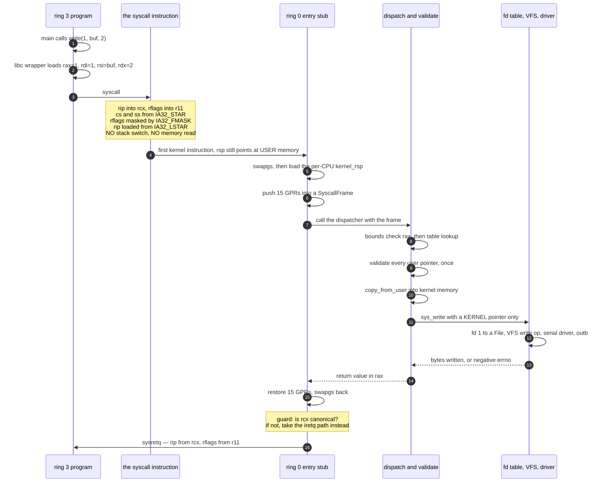

Walk it twice. Forwards for the mechanism; backwards for the return path and the three
constraints `sysretq` imposes.

### 10.3 Minute by minute

| Min | Segment | On the board | Purpose |
|---|---|---|---|
| 0–4 | One door | Two boxes, ring 3 above, ring 0 below, one arrow labelled `syscall`. Nothing else. | Establish that this is the only voluntary door. |
| 4–10 | The ring 3 side | `main` → `write` → `__syscall3`, with the register loads written beside the last box: `rax` number; `rdi rsi rdx r10 r8 r9`. | Write `r10` in a different colour and refuse to explain it yet. |
| 10–22 | What the instruction does | Six lines of what it does. Then a heavy line, and under it the four things it does **not** do: no stack switch, no memory read, no `CR3` change, no register save beyond `rcx` and `r11`. | This is the crux of the session. `rcx` is clobbered with the return address, which is why argument 3 is `r10`. |
| 22–30 | The first kernel instruction | `rsp` still pointing into the user's stack. Ask the room what the first kernel instruction can safely do. Let them arrive at "nothing". Then `swapgs` and the per-CPU `kernel_rsp`, then the frame pushed. | Note the frame is the same shape as the interrupt frame from Session 3. |
| 30–44 | **Wipe the board.** Validation | The validation flowchart alone, with all five rejection paths: null, non-canonical, above the user ceiling, length overflow, not mapped. Write the overflow-safe check as an expression. | The half people remember. Ask what each rejection stops before explaining any of them. |
| 44–50 | `copy_from_user` | The function beside the exception table. The fault, the `RIP` rewrite, the `-EFAULT`. | Recovery is possible only for faults the kernel *expected*, at addresses the user chose. |
| 50–57 | The return path | Redraw the whole path in one line, fast, then walk it backwards. `sysretq`'s three constraints. Finish on the non-canonical `rcx` escalation. | The best story in the session, and it lands the point that this path is security code. |
| 57–60 | Checkpoint | | |

### 10.4 Socratic questions

> [!question] Q1 — `syscall` performs no stack switch and reads no memory; an `int` gate switches stacks in hardware by reading the TSS. Which is safer, which is faster, and what does that tell you about where the kernel's remaining work went?
> **Surfaces:** the assumption that a faster instruction is a simpler one. `syscall` is
> faster because it does less; every task it skipped is now the kernel's, done in
> software, in the three most dangerous instructions in the tree.

> [!question] Q2 — The canonicality check and the "below the user ceiling" check collapse into one comparison. Under what change would they stop being the same check?
> **Surfaces:** the belief that the collapse is a clever trick rather than a consequence
> of the layout. It holds because the user half ends exactly where the non-canonical
> hole begins. Move the user ceiling down, or introduce a second user region, and you
> need two checks.

> [!question] Q3 — `copy_from_user` recovers from a page fault by rewriting the saved `rip`. Why must the same machinery not be used for a fault at an address the kernel itself computed?
> **Surfaces:** "we have a recovery mechanism, so use it everywhere." A fault on a
> kernel-computed address is a kernel bug. Recovering from it converts a diagnosable
> panic into silent corruption with an unknown cause.

> [!question] Q4 — A process calls `write(1, buf, 4096)` where the first half of `buf` is mapped and the second half is not. What should the call return, and where is that decided?
> **Surfaces:** the assumption that validation is a boolean gate before the work. Partial
> success is the correct answer, and it forces the copy to happen in a loop with a
> running count, not in one call — which changes the shape of the whole path.

> [!question] Q5 — Why does the convention stop at six arguments? What if you needed a seventh?
> **Surfaces:** the idea that the limit is arbitrary. Six is what remains after `rax`,
> `rcx` and `r11` are spoken for. A seventh goes in a struct behind a pointer, and that
> pointer is a *user pointer* — so you have converted a register read into a validated,
> copied, possibly-faulting memory access.

### 10.5 Hands-on

> [!example] Exercise 6.1 — There is no symptom (14 minutes)
> **Stage:** [[Stage 6.3 - The System Call Interface]] and [[Stage 6.4 - A Minimal User C Library]]
>
> 1. From a ring-3 test program, call `write(1, (void*)0xFFFFFFFF80000000, 16)` —
>    a kernel address. Observe: `-EFAULT`. Nothing crashes.
> 2. Now comment out the user-ceiling check in `validate.cpp`. Rebuild.
> 3. Run the same program. Observe: **the first sixteen bytes of the kernel image are
>    printed to the console by a ring-3 process.** There is no fault, no warning, no log
>    line. The wall is gone and the machine is entirely happy.
> 4. Restore the check. Then write the Tier 2 test that would have caught step 3.
>
> **What it proves:** the last row of the failure-mode table in [[10 - The Syscall Path]]
> §8 says *"a user program can read kernel memory — there is no symptom; this one is
> found by a test or not at all."* Step 3 makes that sentence physical. Every room goes
> quiet here, and the quiet is the point.

> [!warning] Do this only on a throwaway build
> Leave the check commented out in a branch somebody might merge and you have taught
> the wrong lesson permanently. Restore it on the board, in front of the room, and run
> the test again before moving on.

### 10.6 Misconceptions and corrections

| Misconception | Why it is appealing | The correction |
|---|---|---|
| "A syscall is a function call into the kernel." | It looks like one from C. | It is a privilege transition with a register-based contract and no shared stack. The caller's stack pointer is still in user memory when the first kernel instruction runs. |
| "The kernel can trust arguments because the libc wrapper set them." | The wrapper is "ours". | The wrapper is ring-3 code the process can bypass entirely by executing `syscall` itself. Every register is attacker-controlled. |
| "Checking a pointer once is enough." | It is checked. | It is enough only because the data is *copied* immediately. Validate, then read the user pointer a second time, and a second thread can change it in the window between. |
| "`r10` is used because Linux uses it." | It is true that Linux does. | `syscall` clobbers `rcx` with the return address. `rcx` is argument 4 in the SysV C ABI, so the syscall ABI substitutes `r10`. The hardware forced it. |
| "`sysret` is just a faster `iret`." | It is faster. | It is faster *and weaker*: it will fault in ring 0 if `rcx` is non-canonical, which a user process can arrange. That is why the return path needs a guard and `iretq` does not. |
| "Validation is one function, so it is one problem." | It is one file. | It is nine ordered checks, and the order matters: overflow before range, or the range check passes on a wrapped length. |

### 10.7 Checkpoint

- [ ] Somebody draws the path from `main` to `outb` and marks the privilege change
- [ ] Somebody names the five MSRs and one failure mode each
- [ ] Somebody explains `r10` from the hardware, not from precedent
- [ ] Somebody writes the overflow-safe range check correctly on the board
- [ ] Somebody explains why the driver only ever sees kernel pointers

---

## 11. Session 7 — Storage, filesystems, network

**Documents:** [[11 - The Storage Stack]], [[12 - The Filesystem Stack]], [[13 - The Network Stack]]
**Anchor diagrams:** the §2 picture of each, drawn in that order
**Runs:** 60 minutes

### 11.1 The framing that makes 185 minutes fit in 60

Open by telling the room this is a survey, and then give them the reason it works:
**all three subsystems have the same shape.**

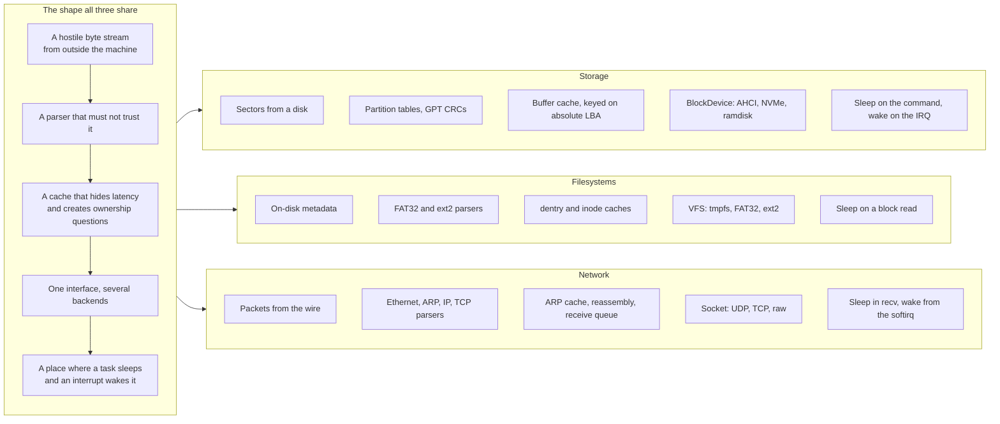

Say the shape once, then teach three instances of it. The room leaves with one
transferable structure rather than three half-learned subsystems.

### 11.2 Objectives — by the end, the learner can

- [ ] Explain what prevents the frame allocator from handing out a frame while a DMA
      transfer into it is in flight — naming the field and the check
- [ ] Explain why a `kmalloc`ed buffer is unsafe for DMA, and give two correct fixes
- [ ] Name all four VFS objects and say what breaks if one's state moves to another
- [ ] Explain why FAT32 asks a global table "what comes next" and ext2 asks the file
- [ ] Explain why the allocation bitmap is flushed before the data and the inode after
- [ ] Explain why protocol processing cannot live in the interrupt handler, in terms of
      what the handler is forbidden to do
- [ ] Say which side of a TCP close ends in `TIME_WAIT`, and both reasons it exists

### 11.3 What is dropped, and where it lives

| Dropped | Lives in |
|---|---|
| AHCI's four nested command structures, field by field | [[11 - The Storage Stack]] §3.5 |
| NVMe queue setup and the phase bit in detail | [[11 - The Storage Stack]] §3.6 |
| GPT header fields and the two CRC32s | [[11 - The Storage Stack]] §3.7 |
| Long filenames and the `0x0F` attribute trick | [[12 - The Filesystem Stack]] §3.4 |
| ext2 indirect-block arithmetic | [[12 - The Filesystem Stack]] §3.5 |
| The `fsck` repair taxonomy | [[12 - The Filesystem Stack]] §5.2 |
| The TCP sliding window and retransmission timing | [[13 - The Network Stack]] §3.6 |
| The Internet checksum and every header bit layout | [[13 - The Network Stack]] §4 |

Read that list to the room. It takes forty seconds and it converts "I did not
understand NVMe" into "we did not cover NVMe", which is a completely different feeling
to leave a session with.

### 11.4 Minute by minute

| Min | Segment | On the board | Purpose |
|---|---|---|---|
| 0–5 | The shared shape | The five-box column from §11.1, once. | One structure, three instances. |
| 5–12 | DMA | RAM and a controller. The DMA arrow from the controller **directly into the buffer cache's box**, crossing every layer. Then the interrupt as a separate, thin arrow to a different place. | Data goes to memory; control goes to the CPU. Say it aloud. This is the concept that does not survive being rushed. |
| 12–20 | The buffer cache | Hash table keyed on disk id plus absolute LBA, LRU list, one buffer with three flag bits. Hit path, miss path, dirty-eviction path. | Then ask what stops the frame under DMA from being reallocated, and answer it. |
| 20–26 | Storage backends, compared not explained | Two boxes side by side. Left: AHCI's four nested structures. Right: NVMe's one SQE plus two rings. Let the picture make the comparison, then one sentence on what NVMe deleted. | Six minutes, no more. |
| 26–36 | VFS | Four boxes with arrows: superblock owns inodes, dentries name inodes, files point at dentries. Write each object's lifetime beside it. Then a small tree, and graft a second tree onto a node — that is a mount. Write `..` on the graft point and ask what it should mean. | The four objects and the mount `..` problem are the whole VFS in ten minutes. |
| 36–44 | Two formats, one question | FAT32: one long array, arrows entry to entry, data clusters off to the side — "where is the next block? Ask the global table." ext2: one inode box, twelve arrows down, then a fan-out, then two more levels — "ask the file." Then three timestamps for an append: bitmap, data, inode. Erase the third and ask what a crash produces. | The two erasures are the crash-consistency lesson in ninety seconds. |
| 44–56 | Network | Two boxes and a cable. The packet buffer as one long allocation with `head`, `data`, `tail`, `end`, and `push` moving `data` left. The NIC ring as four descriptors in a circle with **physical** buffer pointers. The receive path down the right with a heavy line separating IRQ context from thread context, and the two forbidden operations written on the IRQ side. Then the three-way handshake with sequence numbers, doing the `+1` arithmetic aloud. | Headroom, the ring, the context boundary, the handshake. `TIME_WAIT` named but not drawn. |
| 56–60 | Recap and checkpoint | Point back at the five-box column. Ask the room to place three named things from the session into it. | |

### 11.5 Socratic questions

> [!question] Q1 — The DMA engine writes into a frame the buffer cache owns. Nothing in the page tables mentions it, and the device does not consult page tables anyway. What prevents the frame allocator from handing that frame to a process mid-transfer?
> **Surfaces:** the belief that the MMU protects memory from everything. It protects the
> *CPU's* accesses. A device bus-masters straight into physical RAM. The answer is a
> software convention — a pinned or in-flight flag checked before eviction — and the
> room must name both the field and the check.

> [!question] Q2 — Why is a `kmalloc`ed buffer unsafe for DMA? Give two correct fixes.
> **Surfaces:** "memory is memory." A heap object may straddle a page boundary, and two
> virtually contiguous pages need not be physically contiguous. Fixes: allocate whole
> frames from the PMM, or build a scatter-gather list the controller can walk.

> [!question] Q3 — tmpfs, FAT32 and ext2 all sit behind one `read(fd, buf, n)`. Name three properties the interface would have quietly acquired if tmpfs had been the only backend.
> **Surfaces:** the assumption that an abstraction discovered against one implementation
> is general. Synchronous completion, infallible writes, and no notion of a block size
> would all have leaked in — and the first of the three is the one that hurts.

> [!question] Q4 — A file is unlinked while a process still has it open, and the power fails. Describe the exact on-disk state and why no ordering discipline prevents it.
> **Surfaces:** the belief that careful write ordering gives you crash safety. Ordering
> gives you *recoverability*, not prevention. The orphan inode is unavoidable without a
> journal, and `fsck` exists to find it.

> [!question] Q5 — Which is more dangerous: a bug in `copy_from_user` at the socket boundary, or a bug in the TCP option parser? Both handle untrusted input.
> **Surfaces:** the assumption that all untrusted input is equally dangerous. One
> requires an attacker to already run code on the machine. The other is reachable by
> anyone who can send a packet. Reachability, not severity, ranks them.

### 11.6 Hands-on

> [!example] Exercise 7.1 — Three short observations, five minutes each
> **Stages:** [[Stage 9.3 - The Buffer Cache]], [[Stage 10.2 - FAT32 Read]], [[Stage 14.6 - IPv4 and ICMP]]
>
> **A — the cache is real.** Read the same file twice with a counter printed on each
> block-device request. Second read: zero requests. Then read enough other data to evict
> it, read the file again, and watch the requests reappear.
>
> **B — the chain is real.** `hexdump` the FAT32 image the project builds. Find the
> boot sector, read the FAT start and cluster size, then walk one file's cluster chain
> by hand for three entries. Confirm against the file's directory entry.
>
> **C — the wire is real.** From the host, `ping` the guest while `tcpdump` runs on the
> tap interface. Observe echo request and echo reply, and match the identifier and
> sequence fields to what the kernel's ICMP path prints.
>
> **What it proves:** three subsystems, three five-minute confirmations that the board
> drawing corresponds to bytes. Exercise B is the one that changes people — walking a
> cluster chain by hand converts "filesystem" from a service into a data structure.

> [!note] If the class is running before Phase 9
> Phases 9 through 15 have overview notes but not yet per-stage notes. Do the paper
> versions: hand out a hexdump of the first 4 KiB of a FAT32 image for B, and a saved
> `tcpdump` capture for C. A is the only one that needs a running kernel, and it can be
> replaced by tracing the miss path on the board with the room calling out the next box.

### 11.7 Misconceptions and corrections

| Misconception | Why it is appealing | The correction |
|---|---|---|
| "The CPU copies data from the disk." | It is the mental model from `read()`. | The controller writes into RAM by itself. The CPU is told afterwards, by a separate thin arrow. Data path and control path are different arrows on the board for a reason. |
| "The MMU protects memory from devices." | It protects memory. | It constrains the CPU. Without an IOMMU, a device writes any physical address it is given. Frame ownership during DMA is a software convention. |
| "The buffer cache is a performance optimisation." | It makes things faster. | It is also the ownership boundary for every DMA target and the place write-back durability is decided. Remove it for speed and you remove the answer to Q1. |
| "A filesystem stores files." | It is the name. | It stores *blocks*, plus metadata mapping names to block numbers. The interesting question is always where "what comes next" is stored — a global table or the file itself. |
| "Write ordering makes a filesystem crash-safe." | It clearly helps. | It makes damage *bounded and repairable*. Without a journal, some inconsistencies are unavoidable, which is exactly why `fsck` has a taxonomy. |
| "TCP guarantees delivery." | Marketing, and every tutorial. | It guarantees that you find out. `TIME_WAIT` exists because even a completed connection can be lied about by a delayed duplicate. |
| "The interrupt handler can just process the packet." | It has the packet. | It cannot sleep, cannot take a mutex, and cannot allocate without constraints. Protocol processing needs all three. Hence the context boundary drawn as a heavy line. |

### 11.8 Checkpoint

- [ ] Somebody names the field and the check that keep a DMA frame from being reused
- [ ] Somebody names the four VFS objects and one lifetime each
- [ ] Somebody states the "ask the table" versus "ask the file" distinction
- [ ] Somebody states the append flush order and what each inversion costs
- [ ] Somebody names the two operations forbidden on the IRQ side of the receive path
- [ ] Somebody places three items from the session into the five-box shared shape

---

## 12. Session 8 — SMP, security, and shipping it

**Documents:** [[14 - SMP Architecture]], [[15 - Security Architecture]], [[16 - The Build and Artefact Pipeline]], [[17 - The Test Architecture]]
**Supporting:** [[05 - Kernel Initialisation Order]] §2, for the closing recap
**Anchor diagrams:** [[14 - SMP Architecture]] §2, then [[15 - Security Architecture]] §3.9
**Runs:** 60 minutes

### 12.1 The framing

Three of today's four documents describe things that are not features and cannot be
added later cheaply. Say it in one line at the start: **SMP, security and testability
are properties of a design, not modules you install.** The session's job is to show
what each one costs when retrofitted, using this project's own choices as evidence.

### 12.2 Objectives — by the end, the learner can

- [ ] Sort a list of kernel globals into per-CPU, shared-and-locked, and
      read-only-after-init, and justify each
- [ ] Explain why `volatile` is not a substitute for an atomic, in terms of both the
      compiler and the store buffer
- [ ] Draw the TLB shootdown timeline and point at the instant before which freeing the
      frame is a use-after-free
- [ ] Name the three mechanisms by which ring 3 causes ring 0 code to run, and say which
      switches the stack automatically
- [ ] Explain what makes a stack-overflow page fault escalate to a double fault, and why
      that needs an IST entry
- [ ] Explain why `-mno-red-zone` is required in ring 0 and unnecessary in ring 3
- [ ] Explain why exit status 1 means pass and 0 means failure, and why that is not
      perverse

### 12.3 What is dropped, and where it lives

| Dropped | Lives in |
|---|---|
| AP bring-up sequence step by step | [[14 - SMP Architecture]] §3.3 |
| Ticket versus MCS lock cache traffic | [[14 - SMP Architecture]] §3.6 |
| The full race-audit checklist | [[14 - SMP Architecture]] §3.7 |
| KASLR entropy accounting | [[15 - Security Architecture]] §3.5 |
| Users, groups, permission bits | [[15 - Security Architecture]] §3.7 |
| Every compile flag and its failure | [[16 - The Build and Artefact Pipeline]] §3.4 |
| Reproducible-build verification | [[16 - The Build and Artefact Pipeline]] §3.7 |
| Assert-versus-return decision rule | [[17 - The Test Architecture]] §6.2 |

### 12.4 Minute by minute

| Min | Segment | On the board | Purpose |
|---|---|---|---|
| 0–4 | The framing | Three words: **SMP · security · testability**, and under them "not features". | Set expectations for a survey with a thesis. |
| 4–12 | Three categories of state | One core with a box of globals labelled "correct". Draw a second core and put a question mark on every global. Then three columns: per-CPU, shared-and-locked, read-only-after-init, and sort the globals live. | `current` was a global for seven phases and correct the whole time. Name the property that made it correct and the moment it stopped. |
| 12–18 | Per-CPU and GS | The per-CPU area with `current`, run queue, TSS, idle. Draw four of them. Then the GS-base arrow: one instruction, one register, four destinations. Add `swapgs` and the ring-3 / ring-0 invariant. | Callback to Session 6's `swapgs`. The room should recognise it. |
| 18–26 | Ordering and shootdown | The store buffer with two cores and the store-then-load reordering. Then the shootdown fan-out with the ack counter, and circle "free the frame" as the line that must come last. | Memory ordering always overruns and should be allowed to. Take the time from §12.4's build segment, not from security. |
| 26–40 | Security | Two boxes and a line; ask what the wall is made of. Correct "software" to "one bit in a page-table entry, plus three doors". Draw the three doors with attacker-controlled registers above each. Then the address space tall, writable regions one colour and executable another, never overlapping — then draw the HHDM and let the room notice it aliases everything. Add `CR4` with SMEP (bit 20) and SMAP (bit 21). Then the guard page under a kernel stack and the overflow → `#PF` → `#DF` → IST1 → panic chain. | The HHDM realisation and the guard-page chain are the two moments the room remembers. Do not oversell KASLR: write "10 bits" and "one leaked pointer = 0 bits" and move on. |
| 40–50 | Shipping | Two columns: **host** and **container**. `Makefile` and QEMU on the left, everything else on the right. Then sections → segments → memory as three columns beside each other. Write `0xFFFFFFFF80000000` under the memory column and connect it to `-mcmodel=kernel` with a line. Add the red-zone picture: `rsp`, 128 bytes below it, an interrupt frame landing on top. | The `-mcmodel=kernel` line is the single most important connection on this board. The red zone is the day's last "produces no build error" trap. |
| 50–57 | Testing | Three tiers, three runners. Port `0xf4` on the kernel box, an arrow out of QEMU labelled `exit status`, and `(N << 1) or 1` beside it. Circle exit `0` and write "reserved: never reached the exit call". Box the whole thing in `timeout 90` and add exit `124`. | The reserved zero is where the design clicks. A kernel with no parent process still has to report a result. |
| 57–60 | The close | Redraw the 21-step init DAG from [[05 - Kernel Initialisation Order]] §2 as bare numbered boxes, and have the room name each one. | Every box was taught today. The room discovers they can name all of them, which is the correct way to end the day. |

### 12.5 The defence layers, drawn as the close of the security segment

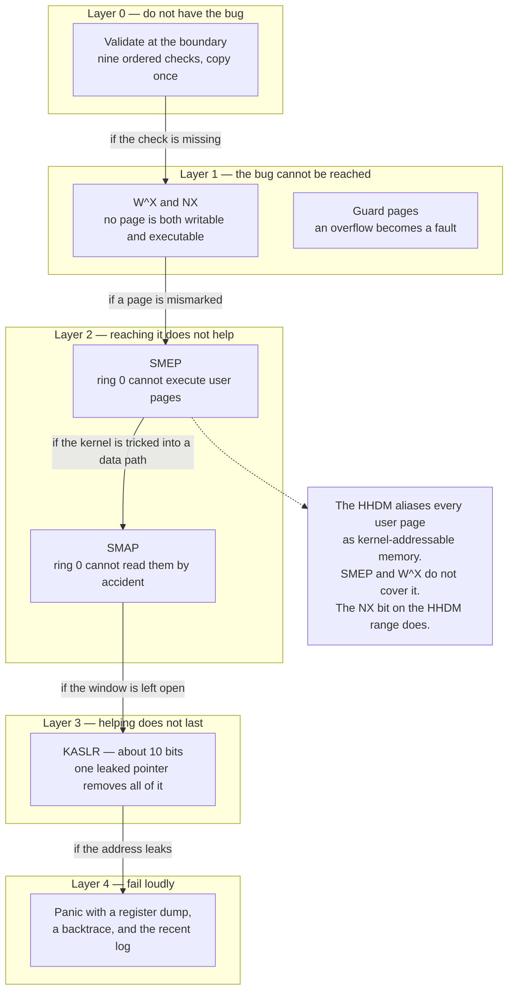

Each arrow is labelled with the failure of the layer above it. That labelling is the
lesson: defence in depth is not "more defences", it is *each layer named against a
specific failure of the previous one*. The dotted note is the ret2dir observation and
it is the sharpest question in the atlas — auditing mitigations by *region* rather than
by *entry* is the transferable idea.

### 12.6 Socratic questions

> [!question] Q1 — `current` was a global for seven phases and correct the whole time. Name the exact property that made it correct, and the moment it stopped. Then explain why a lock around it would not have fixed it.
> **Surfaces:** the belief that races are fixed by locking. The property was "only one
> thread of control exists". A lock serialises access to *one* value; the problem is
> that there now need to be four values. The fix is per-CPU storage, not mutual
> exclusion.

> [!question] Q2 — x86 will not reorder loads with loads or stores with stores. Construct a two-variable program that still produces a result forbidden by sequential consistency, and name the single hardware structure responsible.
> **Surfaces:** "x86 is strongly ordered, so I do not need barriers." Store-then-load
> *is* reordered, by the store buffer, and Dekker-style mutual exclusion breaks on it.

> [!question] Q3 — The kernel's upper half is mapped identically everywhere and marked global so it survives `CR3` reloads. Why does that make unmapping a kernel page strictly more expensive than unmapping a user page?
> **Surfaces:** the assumption that Global is free. A user unmap is fixed by the `CR3`
> reload a context switch performs anyway. A kernel unmap must be broadcast to every
> core by IPI, and every core must acknowledge before the frame is freed.

> [!question] Q4 — `RFLAGS.AC` can be set from ring 3 with `popfq`, but `stac` and `clac` raise `#UD` outside ring 0. Why is that asymmetry not a design flaw? Use it to derive which entry paths need an explicit `clac`.
> **Surfaces:** the belief that a user-settable flag is a hole. `AC` only matters when
> SMAP is enabled and the CPL is 0; a ring-3 process setting it changes nothing until
> it enters the kernel — which is exactly why every kernel entry path must `clac`.

> [!question] Q5 — QEMU computes the exit status as `(N << 1) | 1` rather than passing `N` through. Name the exact failure the raw form permits, and why no amount of serial-log parsing recovers it.
> **Surfaces:** the assumption that an exit code is just a number. With the raw form,
> a kernel that never reaches the exit call and a kernel that reports zero failures both
> produce 0. The encoding reserves 0 for "never got there", which is a state the kernel
> cannot report about itself by definition.

### 12.7 Hands-on

> [!example] Exercise 8.1 — Make the test harness tell you three different things (14 minutes)
> **Stage:** [[Stage 0.7 - Panic and KASSERT]] and [[Stage 0.9 - CI From Day One]]
>
> 1. Run `make test-kernel` on a clean tree. Note the exit status and confirm it is odd.
> 2. Add a `KASSERT` that fails inside a Tier 2 test. Re-run. Observe the exit status
>    change, and read the panic report on the serial log — assert, panic, `hlt`.
> 3. Now make the kernel hang *before* reaching the exit call: an infinite loop with
>    interrupts disabled, early in `kernel_init`. Re-run. Observe exit status **124**,
>    from `timeout`, and an empty or truncated serial log.
> 4. Restore. Then answer on the board: which of the three runs would a serial-log grep
>    have distinguished, and which would it not?
>
> **What it proves:** the exit channel carries information the log cannot, because the
> failure mode being detected is *the kernel not running*. This is the cleanest example
> in the whole day of a design decision made by asking "what does the failure look
> like?" rather than "what does success look like?".

> [!example] Exercise 8.2 — The flag that produces no error (5 minutes, if time allows)
> **Stage:** [[Stage 0.8 - The Build System]]
>
> Remove `-mno-red-zone` from the kernel flags. Rebuild. Observe: it compiles cleanly,
> links cleanly, and boots. Then leave it removed and run the timer-heavy Tier 2 tests
> a few times. Observe: intermittent, moving corruption.
>
> **What it proves:** the most dangerous build flags are the ones whose absence produces
> no diagnostic. Connect it back to Session 3: the red zone is 128 bytes below `rsp`
> that an interrupt frame will land on, and only ring 0 takes interrupts on its own
> stack.

### 12.8 Misconceptions and corrections

| Misconception | Why it is appealing | The correction |
|---|---|---|
| "SMP means adding locks." | Locks are the visible artefact. | It means classifying every piece of state. Most of the work is deciding what should be per-CPU, and per-CPU state needs no lock at all. |
| "`volatile` makes a variable thread-safe." | It stops the compiler caching it. | It stops one compiler optimisation and does nothing about the store buffer, nothing about atomicity, and nothing about ordering. It is required for MMIO and for the Limine request globals, and wrong for anything shared between cores. |
| "Security is a phase." | It is Phase 15 in this project. | Phase 15 *enables* mechanisms whose preconditions were built in Phases 2, 4 and 6. W^X requires the linker's page alignment; SMAP requires the entry paths to be audited. The phase is where you turn it on, not where you earn it. |
| "SMEP and SMAP make user pointers safe." | They stop two whole attack classes. | They stop *accidents*. A deliberate `stac`/`clac` window is three instructions wide and still needs the validation. And neither covers the HHDM alias of the same page. |
| "Tests slow the project down." | They are extra code. | Tier 1 runs in milliseconds and catches formatter bugs that would otherwise make you distrust every other diagnostic. The economics argument in [[17 - The Test Architecture]] §2 is the one to give. |
| "Exit status 0 means success." | Every Unix tool. | Here, 0 is reserved for "the kernel never reached the exit call". Pass is 1. The encoding exists so that "did not run" is distinguishable from "ran and found nothing wrong". |
| "The build is just tooling." | It produces the thing; it is not the thing. | `-mcmodel=kernel` and `0xFFFFFFFF80000000` are the same decision written in two places. Change one without the other and the kernel does not link, or worse, links and misbehaves. |

### 12.9 Checkpoint — the last one of the day

- [ ] Somebody sorts five named globals into the three state categories
- [ ] Somebody explains why a lock would not have fixed `current`
- [ ] Somebody points at the exact instant in the shootdown timeline before which
      freeing the frame is a use-after-free
- [ ] Somebody traces overflow → `#PF` → `#DF` → IST1 → panic without prompting
- [ ] Somebody explains `(N << 1) | 1` and what exit 0 is reserved for
- [ ] **The room, collectively, names all 21 boxes of the init DAG**

---

## 13. The compressed two-hour variant

For a conference workshop, an internal brown-bag, or a hiring loop. Two hours, no
machines, one board. It is not the eight-hour day with material removed; it is a
different lesson with a narrower thesis: **four hardware mechanisms, and one fiction
built on each.**

```mermaid
flowchart LR
    subgraph B1["Block 1 — 30 min — the machine"]
        direction TB
        B1A["Reset vector to kmain<br/>compressed from Session 1"]
        B1B["The handover contract<br/>seven facts, written out"]
    end
    subgraph B2["Block 2 — 35 min — the map"]
        direction TB
        B2A["One rectangle, the hole,<br/>five constants"]
        B2B["The four-level walk,<br/>one worked address"]
        B2C["One frame, three names"]
    end
    subgraph B3["Block 3 — 30 min — the wall"]
        direction TB
        B3A["CS low two bits<br/>three doors in, two out"]
        B3B["The five-qword frame"]
        B3C["Validation: five rejection paths"]
    end
    subgraph B4["Block 4 — 25 min — the fiction"]
        direction TB
        B4A["A task is a stack pointer"]
        B4B["Two stacks, one switch"]
        B4C["Close: everything else<br/>is built from these four"]
    end
    B1 --> B2 --> B3 --> B4
```

### 13.1 What survives, and why

| Kept | Dropped | Because |
|---|---|---|
| The reset vector and the handover contract | Both firmware legs in detail, the hybrid ISO | The contract is what later blocks depend on; the legs are colour. |
| The rectangle, the hole, the walk | HHDM aliasing detail, the Global bit, `invlpg` | Without the hole and the walk, nothing later parses. The rest is refinement. |
| CPL, the frame, validation | GDT/`STAR` arithmetic, the IDT gate layout, the PIC | Two hours cannot carry three table formats. The *boundary* survives; the tables do not. |
| The context switch | Run queues, blocking, locking, the idle task | One switch drawn slowly beats four scheduler concepts sketched. |
| Nothing from Sessions 4, 7, 8 | Everything | Say so explicitly and hand out the atlas. |

### 13.2 The two-hour close

Point at the four blocks and say the sentence the eight-hour day earns over a full day:
*a process is a page table plus a stack plus a saved register set; a file is a number
in a per-process array; a socket is a file. None of those things exist in the
hardware.* Then stop. Two hours does not support a question-and-answer session that
opens Session 4 material, and starting one leaves the room worse off.

---

## 14. The expanded three-day variant

Three days, six hours of contact each, with the machine open the whole time. The
expansion is not more talking — it is that **every board plan becomes a build**. The
eight-hour day demonstrates; the three-day version has the room implementing.

```mermaid
gantt
    title Three-day expansion, contact hours only
    dateFormat HH:mm
    axisFormat %H:%M
    section Day 1 the machine
    Power-on and the boot chain          :d1a, 09:00, 90m
    Lab build and boot your own image    :d1b, after d1a, 90m
    The address space and translation    :d1c, 13:00, 90m
    Lab walk page tables in the monitor  :d1d, after d1c, 90m
    section Day 2 the kernel
    Privilege and the three CPU tables   :d2a, 09:00, 90m
    Lab break and repair the IST         :d2b, after d2a, 90m
    Memory management in depth           :d2c, 13:00, 90m
    Lab the fault handler decision tree  :d2d, after d2c, 90m
    section Day 3 the system
    Tasks switching and concurrency      :d3a, 09:00, 90m
    Lab write switch_context             :d3b, after d3a, 90m
    The syscall path and validation      :d3c, 13:00, 90m
    Survey and close storage to shipping :d3d, after d3c, 90m
```

### 14.1 What the extra ten hours buy

| Addition | Session it expands | What the room does |
|---|---|---|
| Build the image from a clean tree, in the container | 1 | Runs `make iso`, boots it, breaks the request section, fixes it |
| Walk four page-table levels in the QEMU monitor for an address they choose | 2 | Confirms every level by hand against `info mem` |
| Write the IDT gate encoder and unit-test it against golden bytes | 3 | Discovers `base[63:32]` the hard way, in a test rather than in a reboot loop |
| Implement `alloc_frame` and its reservation logic | 4 | Reproduces the framebuffer-corruption bug and then prevents it |
| Write `switch_context` in assembly, from the calling convention | 5 | This is the single highest-value lab in the three days |
| Write the validation function, then attack it | 6 | Pairs: one writes the check, the other writes the program that defeats it |
| The Session 7 and 8 surveys, unchanged | 7, 8 | Deliberately still surveys — three days does not make them deep, and pretending otherwise is worse than admitting it |

### 14.2 The labs that must not be cut

Two labs carry the three-day version, and if the schedule slips they are the last
things to go: **writing `switch_context`** and **attacking your neighbour's
validation function**. Both are adversarial in the right way — the first against the
hardware's calling convention, the second against another person — and adversarial
exercises are the only ones where learners reliably discover that their mental model
was wrong rather than being told.

### 14.3 Homework between days

| After day | Reading | Exercise |
|---|---|---|
| 1 | [[03 - The Address Space]] §3.3 and §3.6 | Translate five addresses to four indices each, on paper |
| 2 | [[07 - Memory Management]] §5.2 and [[08 - Interrupts and Exceptions]] §5.4 | Write the page-fault decision tree from memory, then diff against §5.2 |
| 3 | [[15 - Security Architecture]] §3.9 and [[17 - The Test Architecture]] §6.2 | Pick one atlas failure mode and write the test that would catch it |

---

## 15. Glossary

Forty-six terms, in the session that introduces them. Where a term already has a vault
definition it matches [[04 - Glossary]] — with the standing caveat that the vault
glossary was written against the v1 plan and still mentions GRUB, Multiboot and i686,
none of which apply.

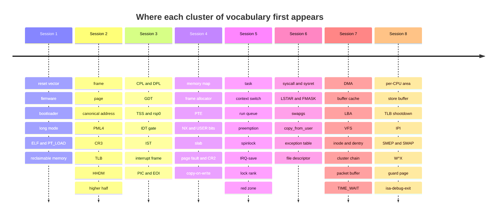

| # | Term | One-line meaning | Session |
|---|---|---|---|
| 1 | Reset vector | The fixed address `0xFFFFFFF0` the CPU fetches from after reset, formed from `CS`'s hidden base plus `IP`. | 1 |
| 2 | Firmware | Code in motherboard flash that runs before anything on a disk. Two families here: legacy BIOS and UEFI. | 1 |
| 3 | ESP | EFI System Partition — a FAT32 partition with a known type GUID from which UEFI loads `\EFI\BOOT\BOOTX64.EFI`. | 1 |
| 4 | El Torito | The optical-disc boot specification that lets one ISO carry both a BIOS and a UEFI boot entry. | 1 |
| 5 | Bootloader | Third-party code (here Limine `v8.6.0-binary`) that loads the kernel and normalises two firmware families into one handover contract. | 1 |
| 6 | Long mode | x86_64's 64-bit operating mode. Reached by a five-step sequence; `EFER.LMA` is set by the CPU, not by software. | 1 |
| 7 | Handover contract | The seven facts true at `kmain`: long mode, paging on, `IF = 0`, valid stack, no arguments, Limine's GDT, no usable IDT. | 1 |
| 8 | ELF / `PT_LOAD` | The executable format Limine parses, and the segment type that says "copy these bytes to this virtual address". | 1 |
| 9 | Bootloader-reclaimable memory | Memory holding Limine's responses and tables, freed in Phase 4 — which is why everything must be copied out in Phase 0. | 1 |
| 10 | Frame | 4 KiB of physical RAM. | 2 |
| 11 | Page | 4 KiB of virtual address space. | 2 |
| 12 | Canonical address | An address whose bits 63–48 all equal bit 47. Anything else raises `#GP`, not `#PF`. | 2 |
| 13 | Non-canonical hole | The illegal range between `0x0000800000000000` and `0xFFFF800000000000`. | 2 |
| 14 | PML4 | The top of the four-level page-table hierarchy; `CR3` holds its physical address. | 2 |
| 15 | `CR3` | The register holding the *physical* address of the current PML4. Writing it switches address spaces. | 2 |
| 16 | TLB | The CPU's cache of completed translations. Nothing invalidates it automatically; `invlpg` and `CR3` writes do. | 2 |
| 17 | HHDM | Higher-half direct map at `0xFFFF800000000000` — every physical byte given a permanent second name, making `phys_to_virt` one addition. | 2 |
| 18 | Higher half | The upper 256 PML4 entries, identical in every address space, where the kernel lives. | 2 |
| 19 | CPL / DPL / RPL | Current, descriptor and requested privilege levels. CPL is the low two bits of `CS` and there is no other CPL register. | 3 |
| 20 | GDT | Global Descriptor Table. Base and limit are mostly ignored in 64-bit mode; DPL and the code/data distinction are not. | 3 |
| 21 | TSS | Task State Segment, 104 bytes, holding `rsp0` and seven IST stack pointers. Its descriptor is 16 bytes, not 8. | 3 |
| 22 | IDT gate | One of 256 entries, 16 bytes each, holding the handler offset, a code selector, an IST index, type and DPL. | 3 |
| 23 | IST | Interrupt Stack Table — seven known-good stacks selected by a 3-bit gate field. `#DF` must use one. | 3 |
| 24 | Interrupt frame | The five qwords the CPU always pushes in 64-bit mode: `SS`, `RSP`, `RFLAGS`, `CS`, `RIP`, plus an error code for ten vectors. | 3 |
| 25 | PIC / EOI | The cascaded 8259 pair, remapped to vectors 32–47, and the end-of-interrupt that must go to both chips for IRQs 8–15. | 3 |
| 26 | Double / triple fault | An exception during exception delivery; then a fault during that, which resets the machine with no state preserved. | 3 |
| 27 | Memory map | The bootloader's description of which physical ranges are usable, reserved, reclaimable, or the framebuffer. | 4 |
| 28 | Frame allocator | A bitmap over the memory map, one bit per frame, costing about 0.003% of RAM. | 4 |
| 29 | PTE | A 64-bit page-table entry. Permissions AND down the four levels; NX ORs down them. | 4 |
| 30 | `CR0.WP` | The bit that makes ring 0 respect the read-only bit. Without it, copy-on-write silently does nothing for kernel writes. | 4 |
| 31 | Slab allocator | Fixed-size object pools on top of the heap, with the free list living inside the free objects. | 4 |
| 32 | Page fault / `CR2` | The exception raised on a failed translation, and the register holding the address that caused it. | 4 |
| 33 | Copy-on-write | Sharing a frame read-only between address spaces and copying on the first write — unless the refcount is already 1. | 4 |
| 34 | Task | A saved register set plus a kernel stack plus an address space. `task_t.kernel_rsp` is the whole identity at switch time. | 5 |
| 35 | Context switch | Six pushes, a stack-pointer swap, six pops, `ret`. The calling convention accounts for everything else. | 5 |
| 36 | Run queue | The list of READY tasks — exactly the READY tasks. RUNNING and BLOCKED tasks are not on it. | 5 |
| 37 | IRQ-save spinlock | A spinlock that also disables interrupts, removing the one edge that makes the handler-versus-task deadlock a cycle. | 5 |
| 38 | Lock rank | A number per lock, asserted at acquisition, making lock-ordering violations a panic instead of a code-review question. | 5 |
| 39 | Red zone | 128 bytes below `rsp` the SysV ABI lets leaf functions use. Safe in ring 3, catastrophic in ring 0, hence `-mno-red-zone`. | 5 |
| 40 | `syscall` / `sysret` | The fast ring transition. `syscall` clobbers `rcx` with the return address and `r11` with `RFLAGS`; `sysret` faults in ring 0 on a non-canonical `rcx`. | 6 |
| 41 | `IA32_LSTAR` / `IA32_FMASK` / `IA32_STAR` | The kernel entry `RIP`, the `RFLAGS` bits cleared on entry, and the selector arithmetic that fixes the GDT's order. | 6 |
| 42 | `swapgs` | Exchanges `GS` base with `IA32_KERNEL_GS_BASE`. Once on entry, once on exit — never twice. | 6 |
| 43 | Exception table | A sorted list of kernel instruction addresses allowed to fault, with the address to resume at. It is what makes `copy_from_user` recoverable. | 6 |
| 44 | File descriptor | A small integer indexing a per-process table of open files. A socket is one of these. | 6 |
| 45 | DMA | A device writing directly into physical RAM without the CPU or the MMU. The reason frame ownership is a software convention. | 7 |
| 46 | Buffer cache | Cached disk blocks keyed on disk id plus absolute LBA, holding the dirty and in-flight flags that make write-back and DMA safe. | 7 |
| 47 | VFS | One `open`/`read`/`write` interface over several on-disk formats, built from four objects: superblock, inode, dentry, file. | 7 |
| 48 | Cluster chain | FAT32's answer to "what comes next" — a global table, one entry per cluster. ext2 asks the file's own inode instead. | 7 |
| 49 | Packet buffer | One allocation with `head`/`data`/`tail`/`end`, so headers are prepended by moving a pointer rather than by copying. | 7 |
| 50 | `TIME_WAIT` | The TCP state that holds a 4-tuple for about a minute after close, so a delayed duplicate cannot be mistaken for new data. | 7 |
| 51 | Per-CPU area | A private block per core at `0xFFFF900000000000`, addressed through the `GS` base, holding `current`, the run queue, the TSS and the idle task. | 8 |
| 52 | Store buffer | The hardware structure that reorders a store past a later load on x86, and the reason "strongly ordered" is not "sequentially consistent". | 8 |
| 53 | TLB shootdown | An IPI to every core after changing a kernel mapping, with acknowledgements, because the frame must not be freed until every core has stopped using the stale entry. | 8 |
| 54 | SMEP / SMAP | `CR4` bits 20 and 21: ring 0 may not execute, and may not accidentally read or write, user pages. `stac`/`clac` open a three-instruction window. | 8 |
| 55 | W^X | No page is both writable and executable — enforced per region, which is why the HHDM's NX marking matters as much as the text segment's. | 8 |
| 56 | Guard page | An unmapped page below a kernel stack, converting a silent overflow into a `#PF` that escalates to `#DF` on IST1 and produces a panic report. | 8 |
| 57 | `isa-debug-exit` | The QEMU device on port `0xf4` that lets a kernel with no parent process report a result as an exit status of `(N << 1) or 1` — shift left, set the low bit — reserving 0 for "never got there". | 8 |
| 58 | Test tier | One of three: host unit tests in milliseconds, in-kernel tests under QEMU in seconds, integration boot legs in tens of seconds. | 8 |

---

## 16. Running the room — the class's own failure modes

Symptom first, as everywhere else in this atlas.

| Symptom | Cause | Correction |
|---|---|---|
| The room is silent through Session 2 and animated in Session 3 | Session 2's hole did not land, and nobody wants to say so. Session 3 feels concrete by comparison. | Stop Session 3 at minute 10 and re-derive canonical addressing in two minutes on a clean board. It costs two minutes and rescues Sessions 4, 6 and 8. |
| Every question is about a language feature, not a mechanism | The room is treating this as a C++ course. | Answer once, then move the question to the board as a picture. If it cannot be drawn, it is out of scope for the day. |
| Session 4 runs 15 minutes over | The fault decision tree generated real argument. | This is the good overrun. Take the time from Session 7's storage-backend comparison, which is six minutes of picture with almost no dependency. |
| Session 5's context switch does not land | The chalk did not move between the two stacks at the right instruction. | Redo it. It is four minutes. There is no verbal substitute — the room has to watch the pointer move. |
| Session 6 goes flat after the board wipe | The wipe was announced apologetically. | Wipe it decisively and say "this next part is why the session exists". The wipe is a signal, and hedging it wastes the signal. |
| Sessions 7 and 8 feel like a list | The "what is dropped" list was skipped. | Read it. Forty seconds. A room that knows the boundary of what was covered stops trying to hold everything and starts holding the shape. |
| Somebody has clearly built a hobby OS before and is answering everything | Not a problem — a resource. | Give them the Socratic questions to answer *last*, and ask them for the failure they actually hit. Their war story is worth more than your correction. |
| The final DAG recap falls flat | The room is tired at minute 57 and the DAG looks like new material. | Draw only the numbered boxes, no labels, and ask for names. Recognition at that hour works; recall does not. |

---

## 17. Related

**The eight sessions, in order**
[[01 - What Happens at Power-On]] · [[02 - The Boot Chain]] · [[03 - The Address Space]] ·
[[04 - Privilege and the Ring Boundary]] · [[05 - Kernel Initialisation Order]] ·
[[06 - The Subsystem Map]] · [[07 - Memory Management]] ·
[[08 - Interrupts and Exceptions]] · [[09 - Tasks, Scheduling and Concurrency]] ·
[[10 - The Syscall Path]] · [[11 - The Storage Stack]] · [[12 - The Filesystem Stack]] ·
[[13 - The Network Stack]] · [[14 - SMP Architecture]] · [[15 - Security Architecture]] ·
[[16 - The Build and Artefact Pipeline]] · [[17 - The Test Architecture]]

**Stages the hands-on exercises touch**
[[Stage 0.2 - The Limine Request Section]] · [[Stage 0.5 - Building a Bootable Image]] ·
[[Stage 0.7 - Panic and KASSERT]] · [[Stage 0.8 - The Build System]] ·
[[Stage 0.9 - CI From Day One]] · [[Stage 2.2 - The TSS and Interrupt Stacks]] ·
[[Stage 2.3 - The Interrupt Descriptor Table]] · [[Stage 3.1 - The Programmable Interval Timer]] ·
[[Stage 4.1 - Reading the Memory Map]] · [[Stage 4.2 - The Physical Frame Allocator]] ·
[[Stage 4.3 - Enabling Paging]] · [[Stage 5.3 - Preemptive Scheduling]] ·
[[Stage 5.4 - Sleep and Blocking]] · [[Stage 6.3 - The System Call Interface]] ·
[[Stage 6.4 - A Minimal User C Library]] · [[Stage 9.3 - The Buffer Cache]] ·
[[Stage 10.2 - FAT32 Read]] · [[Stage 14.6 - IPv4 and ICMP]]

**Vault context for the teacher**
[[04 - Glossary]] — with the v1-era caveat noted in §15 ·
[[06 - Architecture Overview]] — the one-page version to hand out at the start ·
[[09 - Testing Strategy]] · [[13 - Coding Standards]] ·
[[14 - Debugging Playbook]] — the source of most of the failure-mode tables quoted here ·
[[15 - Roadmap and Milestones]] — for placing the class against project progress

**Decisions worth reading before teaching**
[[ADR-0002 - Target x86_64 Not i686]] · [[ADR-0003 - Limine as the Bootloader]] ·
[[ADR-0004 - Framebuffer Console Not VGA Text]] ·
[[ADR-0005 - Containerised Pinned Toolchain]] ·
[[ADR-0007 - Freestanding C++20 as the Kernel Language]] ·
[[ADR-0009 - Filesystem Strategy FAT32 then ext2]] ·
[[ADR-0010 - Testing Strategy and the QEMU Exit Device]]
