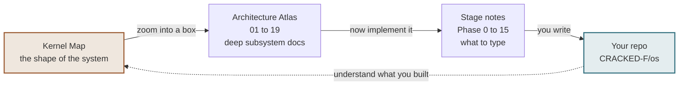

# 00 — The Kernel Map

> [!abstract] What this is
> One connected, zoomable map of the whole operating system — from the instruction
> the CPU fetches when power arrives, to a hardened multi-core machine answering a
> ping. 78 boxes, every one carrying the code you write, a line-by-line walkthrough,
> verification commands, the traps, and a whiteboard plan.
>
> It is a single HTML file sitting next to this note. **It works with no internet.**

---

## Opening it

### ▶ [Click here to open the Kernel Map](file:///D:/CRACKED/steps/architecture/Kernel%20Map.html)

That link opens it in your default browser straight from Obsidian. It is the
fastest route, and the one to use day to day.

> [!warning] If the link does nothing
> Obsidian blocks `file://` links until you allow them: **Settings → Files and
> links → Detect all file extensions** on, and confirm the security prompt the
> first time you click. If it still refuses, use either fallback below — they
> always work.

**Fallback 1 — from the file explorer.** Right-click `Kernel Map.html` in
Obsidian's sidebar and choose **Show in system explorer**, then double-click it.

**Fallback 2 — from the browser.** Press `Ctrl+O` in any browser and pick:

```
D:\CRACKED\steps\architecture\Kernel Map.html
```

Obsidian will not render the map *inside* a note. It is an interactive
application — pan, zoom, click — not a document, and Obsidian's markdown view
has no way to host that. Opening it in a browser is the intended route, not a
workaround.

**Pin the tab.** You will open this more often than any single note.

> [!tip] On your teammate's Mac
> Same file, different path. Use `Cmd+O` in the browser, or right-click →
> **Show in system explorer** from Obsidian.

> [!tip] It is genuinely offline
> Everything is inline — no CDN, no framework, no build step. The only external
> reference is a webfont link, and if there is no network it falls back to Segoe UI
> and Cascadia Mono on Windows, or the system faces on macOS. The map itself is
> identical either way.

---

## How to drive it

| Action | What it does |
|---|---|
| **Drag** | Pan around the map |
| **Scroll** | Zoom at the cursor |
| **Click a box** | Opens the full lesson in the right-hand panel |
| **Fit** | Frame the whole map |
| **Walk it** | Steps through 42 boxes in teaching order, one per click |
| **Session A–8** | Dims everything outside one session |

Zoom is level-of-detail. Far out you see the spine and the milestones; as you zoom
in the supporting stages fade into view. Nothing ever jumps you somewhere else.

---

## What is in a box

Click any box and the panel gives you, in this order:

1. **What it is** — taught from zero, every term defined on first use
2. **Why it exists** — what is impossible or broken without it
3. **Reference** — the hard facts: ports, registers, bit positions, addresses, offsets
4. **The code you write** — the actual 10–40 lines, in the real language
5. **Line by line** — numbered: what each line does, why it is written that way,
   and what breaks if it is wrong
6. **How to verify** — exact commands and what a pass looks like
7. **Traps** — symptom first. What you will actually *observe*, then the cause
8. **Board plan** — what to draw on a whiteboard, in what order, for teaching
9. **Needs first / Unlocks** — clickable, so you can walk the dependency web

---

## The eight sessions

The session buttons map to the runbook in
[[19 - The Eight-Hour Masterclass]].

| # | Session | Boxes | Covers |
|---|---|---|---|
| 1 | Power-on to first boot | 7 | reset vector, firmware, Limine, requests, linker script, first boot |
| 2 | Output and diagnosis | 11 | serial, panic, build system, CI, framebuffer, font, console, kprintf |
| 3 | CPU tables and interrupts | 10 | GDT, TSS/IST, IDT, stubs, exceptions, PIC, IRQs, timer, keyboard |
| 4 | Memory management | 4 | memory map, frame allocator, paging, heap |
| 5 | Tasks and scheduling | 4 | tasks, context switch, preemption, blocking |
| 6 | User mode, files, the shell | 12 | ring 3, syscalls, libc, VFS, ELF loader, shell, init |
| 7 | Storage, filesystems, platform | 12 | block devices, DMA, AHCI/NVMe, FAT32, ext2, ACPI, PCI, APIC |
| 8 | SMP, processes, network, hardening | 18 | per-CPU, atomics, APs, fork, COW, TCP, W^X, real hardware |

Sessions 6, 7 and 8 are deliberately larger — by then the pace picks up, because
the foundations are in place and each box leans on ones the class already knows.

---

## How it relates to the rest of the vault



- **The map** answers *where am I and what does this connect to.*
- **The atlas** ([[01 - What Happens at Power-On]] onward) answers *how does this
  subsystem actually work,* with 249 diagrams across 17 documents.
- **The stage notes** answer *what exactly do I type,* with full line-by-line
  walkthroughs and verification.
- **[[Progress Tracker]]** is where you tick things off.

Start at the map. Zoom until you find the box you are on. Read its panel. Then
open the stage note it names and write the code.

---

## Related

[[18 - Phase to Architecture Map]] · [[19 - The Eight-Hour Masterclass]] ·
[[06 - Architecture Overview]] · [[Progress Tracker]]
